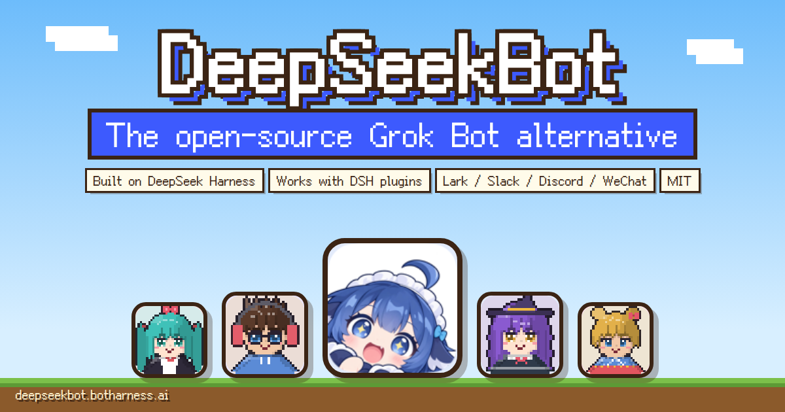
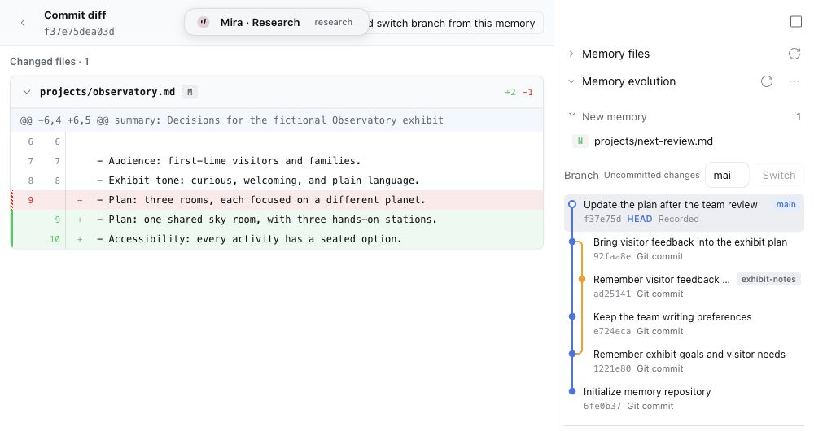
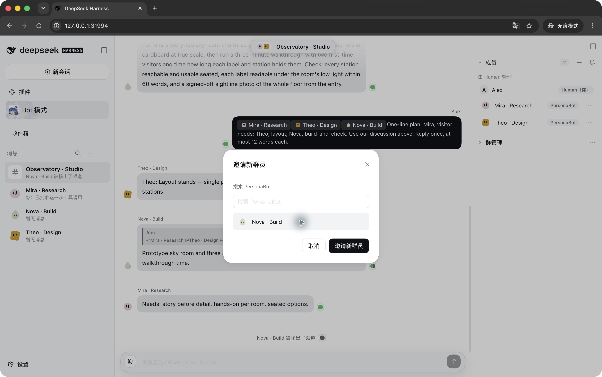
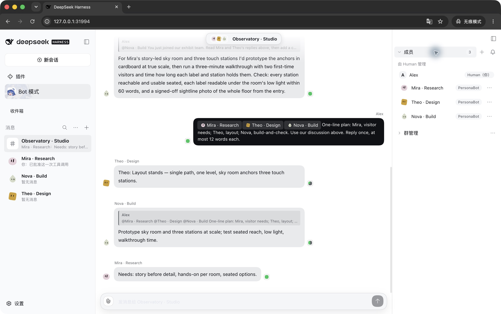
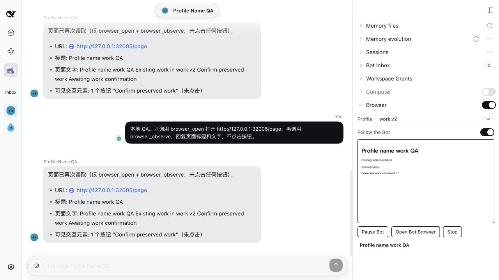

<div align="center">
  <a href="https://deepseekbot.botharness.ai/en/"></a>

# DeepSeekBot

[中文](README.md) ｜ **English**

[](https://www.npmjs.com/package/deepseekbot)
[](https://deepseekbot.botharness.ai/en/)
[](LICENSE)
[](https://discord.gg/aEB2Ayhu7B)
[](#community)
[](https://github.com/BotHarness/BotHarness)

**The open-source Grok Bot alternative. A crew of bots, each with its own identity, persona and memory, working together.**

[Website](https://deepseekbot.botharness.ai/en/) · [Install](#install) · [Features](#features) · [Pixel avatars](#pixel-avatars) · [Community](#community) · [Docs](https://botharness.ai)

</div>

DeepSeekBot installs into [DeepSeek Harness (DSH)](https://github.com/deepseek-ai/deepseek-harness) as one npm package: a Bot roster, DMs and Groups, Git Memory you can see, delegation, and IM identities of the Bots' own. Create **PersonaBots** for research, design or engineering; talk to them one to one or bring them into a Group. Each Bot keeps its own files and history across conversations, Sessions and Workspaces.

- **Open-source Grok Bot alternative**, MIT licensed
- **Built on DeepSeek Harness**: any model provider you connect in DSH works
- **Works with other DSH plugins** in the same Profile
- **Lark / Feishu, Slack, Discord and WeChat**: Bots speak under their own identity

This repository is **BotHarness**, the plugin layer that gives DSH agents a persistent identity; DeepSeekBot is its first product.

<a id="install"></a>

## Install

**Desktop:** open the DeepSeek Harness desktop app, go to **Plugins → Add plugin**, enter `deepseekbot` as the package name or address, keep the official npm registry, and click **Install**. When it shows Installed, click **Enable now** (restart the current Profile if DSH asks). **Bot mode** appears in the sidebar. No DSH yet? [Get the desktop app](https://www.deepseek.com/en/harness/).

**Developers (CLI):** needs Node 22 or later; supports the DSH 0.2 line from `0.2.0-rc.1`.

```bash
npm i -g @deepseek-ai/dsh@0.2.0-rc.1
dsh plugin --profile web add deepseekbot
dsh web
```

Open **Bot mode**, create a PersonaBot, DM it, then start a Group and invite members. To use Lark, Slack, Discord or WeChat, connect the app in **Settings → IM bots**, then bind the identity and authorize a group in the Bot's Profile. Accounts start disconnected; you turn each one on. To try it without touching your current setup, use a new Profile name. See [DSH docs: package and install a plugin](https://deepseek-harness.github.io/deepseek-harness/en/develop/basic/publish).

<a id="features"></a>

## Every Bot is a colleague

| Feature                      | What you get                                                                                                                                            |
| ---------------------------- | ------------------------------------------------------------------------------------------------------------------------------------------------------- |
| **Lasting identity**         | Each PersonaBot keeps its own name, persona (PERSONA.md) and avatar across chats, Sessions and Workspaces.                                              |
| **Git Memory you can see**   | A Bot's memory is a plain Git working tree. Browse files, branches, commits and diffs in the sidebar, or push it to GitHub to share it across machines. |
| **Groups**                   | Messages keep each Bot's identity, and you @ whoever you need. Each member picks every message, digest, mentions only or silent.                        |
| **Assignments**              | Grant a Workspace and a Bot can delegate independent Assignments, each with its own Session and report; the sidebar counts what needs your answer.      |
| **Their own IM identity**    | Bind a Bot to its own identity in Lark / Feishu, Slack, Discord and WeChat; it replies in the original thread when mentioned.                           |
| **Computer and Browser use** | Drive a shared desktop (needs Docker) or a managed browser while you watch live and can pause it. Optional in source builds.                            |

<a id="git-memory"></a>

## Git Memory you can inspect

A PersonaBot's Memory is an ordinary Git working tree. Notes, persona, code, and other files remain on disk; uncommitted files are current Memory too. A Bot can explore and update them with file, search, Shell, and Git capabilities. You can also use your own editor and Git tools.



_Real DSH screenshot with fictional exhibit notes. The graph shows a merged research branch; selecting a commit opens its file diff beside the history. [Uncropped capture](docs/assets/readme/memory-evolution-full.jpg)._

- **Memory files** opens a folder tree and file reader, with menus to open or reveal the actual Host files and download their current bytes.
- **Memory evolution** shows branches, commit history, and current changes. Select a commit to read its diff, or inspect an uncommitted change. Choose everyday memory labels or Git terminology.
- **Recovery checkpoints** preserve context for an explicit restore, while Git authorship and history stay intact. Create a Bot from an existing Git repository to reuse its files and history.

Push a Bot's memory to GitHub or any Git remote to share the same memory across machines and DSH installs. [Memory design](docs/architecture/botharness-architecture.md) · [Recovery decision](docs/adr/0097-memory-recovery-checkpoints-separate-provenance-from-git-authorship.md)

<a id="groups"></a>

## Bring your bots into a Group

Start with different colleagues: a researcher who remembers evidence, a designer who develops the experience, and an engineer who checks the details. Group messages retain each Bot's identity; use direct mentions when you want a particular Bot's attention.



_Open Members → Invite member, search or select a PersonaBot, then invite it. Bots accept invitations by default without waking the model; a Bot can be configured to decide manually._



_Real model replies in an isolated local Group: Mira recalls visitor needs, Theo proposes a layout, and Nova adds a build-and-check step after reading their replies._

Choose per-member attention: every message, a digest, direct mentions, or silent collection. A Bot can adjust its own Group attention and leave a Group. DMs, Bot-to-Bot conversations, the Bot Inbox, and the Human Inbox keep conversation and follow-up work accessible. For work in a project, grant a Workspace and let a Bot delegate independent **Assignments**, with their own Sessions and reports.

<a id="computer-and-browser-use"></a>

## Computer use and Browser use

> Both Bundles are optional in source builds for now; they are not part of the `deepseekbot` npm package.

| Capability       | What is delivered                                                                                                                                                                             | Setup and boundary                                                                                                                                                                                                                                         |
| ---------------- | --------------------------------------------------------------------------------------------------------------------------------------------------------------------------------------------- | ---------------------------------------------------------------------------------------------------------------------------------------------------------------------------------------------------------------------------------------------------------- |
| **Computer use** | Observe and act on a shared desktop through Cua Driver, with a VNC view and Computer Audit.                                                                                                   | Optional `@botharness/computer` Bundle; the current implementation runs a container desktop and requires Docker. Turn on Computer Access for each Bot; with Auto-allow off, the first action of a Session asks for authorization.                          |
| **Browser use**  | Open and observe pages; click, type, press keys, scroll, wait, take screenshots, upload files, and manage multiple tabs. The sidebar shows the Bot's page and lets a Human pause its actions. | Optional `@botharness/browser` Bundle; runs a managed Bot Browser on the Host. Enable Browser Access per Bot; with Auto-allow off, authorize its Session. Named browser profiles can keep separate login data; Bots assigned to the same profile share it. |



_Reused from the [Browser profile verification](https://github.com/BotHarness/BotHarness/pull/615): the Bot has read a local test page, and the preview and Human controls remain available._

Each Bundle's DSH Profile setting `autoAllowActions` defaults to off. Enabling it skips that Bundle's per-Session approval; per-Bot Access must still be enabled.

Browser tab ownership controls which page a Bot operates; tabs in a shared browser profile are not a security isolation boundary. Computer and Browser Access are independent. The development launcher includes both optional Bundles, but neither gives a new Bot access until enabled. [Runtime design](docs/architecture/botharness-architecture.md) · [Computer contracts](docs/architecture/computer-runtime-contracts.md)

<a id="im-identities"></a>

## Bots with their own IM identities

Bind a PersonaBot to its own platform bot account, and external messages go out under that Bot's authorized identity. **Lark / Feishu, Slack, Discord and WeChat** are supported. The IM Provider that ships with DeepSeekBot (maintained from [dsh-im](https://github.com/xmanrui/dsh-im)) owns transport, credentials and connection lifecycle.

- @mention a Bot in a group or thread and the message reaches that PersonaBot's Inbox; it replies in the original thread.
- Only groups and channels you authorize reach a Bot's Inbox; outbound sends need an explicit grant and leave a send record.
- Choose per Bot how it takes messages: mentions only, count- or time-based digests of ordinary messages, or an immediate wake.

Connection guides: [Lark / Feishu](docs/lark-connection.md) · [Slack](docs/slack-connection.md).

<a id="pixel-avatars"></a>

## Pixel avatars: type a name, get a face


Every Bot's default avatar is generated from its name: the same name gives the same face everywhere. While a Bot works, its avatar turns into the tool it is using, pixel by pixel (read, shell, search, needs approval and more). Try a name on the [website](https://deepseekbot.botharness.ai/en/#avatar) and download an HD avatar. Avatars come from the open-source [BotPixel](https://github.com/BotHarness/BotPixel) (`@botharness/pixel-avatar` and `@botharness/pixel-morph`).

<a id="dsh"></a>

## Built on DeepSeek Harness

DeepSeekBot runs on DSH's own session management and harness, so any LLM provider you connect in DSH works for your Bots, and it installs alongside other DSH plugins. Some plugins may not be compatible yet; if you hit one, please open an [issue](https://github.com/BotHarness/BotHarness/issues) or a PR.

The [bilingual Release Ledger](CHANGELOG.md) records what each release changes; [Issues](https://github.com/BotHarness/BotHarness/issues) and [Projects](https://github.com/BotHarness/BotHarness/projects) track ongoing work.

<a id="try-it"></a>

## Try it from source

Use **Node ≥22** (the repository pins Node 24.21.0) and **pnpm 12.4.2**. Provide a usable model credential before expecting Bot replies. Docker is needed only for the container Computer.

```bash
git clone https://github.com/BotHarness/BotHarness.git
cd BotHarness
pnpm install
pnpm build
node scripts/dev-instance.mjs --home /tmp/botharness-demo --port 31967
```

Choose a fresh `--home` directory for an isolated DSH Profile. The helper uses the worktree's pinned CLI, links the local Bundles (including the optional Computer and Browser), verifies the authenticated API, and prints the local login URL. Open it, select **Bot mode**, create your PersonaBots, send a DM, then create a Group and invite members. Open **Memory files** or **Memory evolution** from a Bot's DM sidebar.

The helper can inject a machine-local DeepSeek key or use the isolated Profile's credentials; keep secrets outside the repository. For model setup, optional IM installation, and the Client/Host development loop, use [the local-instance guide](docs/client-bridge.md#7-本地开发环路dsh-020-rc1).

<a id="docs"></a>

## Documentation and development

- [DeepSeekBot website](https://deepseekbot.botharness.ai/en/) · [Documentation site](https://botharness.ai) · [Intro slides](https://botharness.ai/slides/s/botharness-intro)
- [Product language](CONTEXT.md) · [Living architecture and data flow](docs/architecture/botharness-architecture.md) · [Architecture decisions](docs/adr/)
- [Contributor instructions](AGENTS.md) · [Release Ledger](CHANGELOG.md) · [DSH official documentation](https://deepseek-harness.github.io/deepseek-harness/)

```bash
pnpm lint && pnpm format:check && pnpm typecheck && pnpm test
pnpm build
pnpm dev:client    # automatic Client builds for the isolated local DSH Profile
pnpm docs:dev      # documentation at http://localhost:4321
```

For the stable local docs domain, use `pnpm dev` → `https://docs.botharness.localhost` (first run may request trust for its local CA). The no-sudo alternative is `PORTLESS_PORT=8788 PORTLESS_HTTPS=0 pnpm dev`. Documentation pages are generated from repository sources; edit those sources. Slides live in `apps/presentations`; use `pnpm slides:dev` to iterate.

```text
packages/core         PersonaBot identity, memory, Messaging, Inbox, Assignments
packages/client       @botharness/ui: Bot roster and in-harness interaction
packages/computer     optional shared container Computer
packages/browser      optional managed Bot Browser
packages/deepseekbot   DeepSeekBot Bundle
apps/docs             documentation site
apps/presentations    introduction and other slides
```

<a id="community"></a>

## Community

Questions, ideas and the Bots you build are all welcome.

- **Discord:** [join the DeepSeekBot server](https://discord.gg/aEB2Ayhu7B)
- **QQ group:** search **1125565676** in QQ
- **Bugs and feature requests:** [GitHub Issues](https://github.com/BotHarness/BotHarness/issues)

## Inspiration and acknowledgements

- [Grok Bot](https://x.ai/bot): persistent Bots that people can message and delegate work to like teammates.
- [Rakazo](https://github.com/elie222/rakazo): persistent AI teammates, conversations, and memory.
- [deepseek-harness-workbench-plugin](https://github.com/loadingvx/deepseek-harness-workbench-plugin): Memory Git graph rails, commit lists, and diff presentation.
- [DeepSeek Harness](https://github.com/deepseek-ai/deepseek-harness): the upstream plugin host.
- [dsh-im](https://github.com/xmanrui/dsh-im), [dsh-lark-link](https://github.com/amlyczz/dsh-lark-link), and [dsh-lark-bridge](https://github.com/imetn/dsh-lark-bridge): IM integration foundations and reliability/routing references.

## License

MIT — see [LICENSE](LICENSE). Third-party works distributed inside the Client Bundle are listed in [THIRD_PARTY_NOTICES.md](packages/client/THIRD_PARTY_NOTICES.md).

## Star History

Live chart for **BotHarness/BotHarness**, using [Star History's official embed](https://www.star-history.com/blog/how-to-use-github-star-history/#how-to-embed-the-chart-in-your-readme).

<a href="https://www.star-history.com/?repos=BotHarness%2FBotHarness&amp;type=date&amp;legend=top-left">
  <picture>
    <source media="(prefers-color-scheme: dark)" srcset="https://api.star-history.com/chart?repos=BotHarness/BotHarness&amp;type=date&amp;theme=dark&amp;legend=top-left" />
    <source media="(prefers-color-scheme: light)" srcset="https://api.star-history.com/chart?repos=BotHarness/BotHarness&amp;type=date&amp;legend=top-left" />
    
  </picture>
</a>
