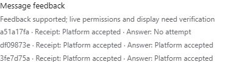
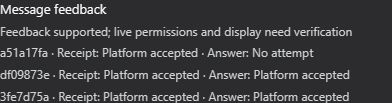

# Lark feedback candidate QA / Lark 反馈候选 QA

This is an exact-candidate review path for [#1040](https://github.com/BotHarness/BotHarness/issues/1040), not a release or production rollout. The source PRs have merged; the window evidence below identifies the exact paired sources tested. Remaining runtime qualification still gates Provider pin promotion. The published Provider pin remains unchanged.

这是精确候选的审阅路径，不是发布或生产部署。源码 PR 已合并，下方窗口证据标识实际测试的两端版本；剩余运行时验证仍是提升 Provider pin 的门槛，当前 pin 不变。

## Prepare before the Human window / 窗口前准备

1. Check out both candidate commits in independent checkouts. Install and build BotHarness with the repository toolchain. In the Provider checkout run `npm ci --ignore-scripts`, `npm run build` and `node scripts/verify-package.mjs`. Run the focused tests listed in the evidence file. Do not substitute a same-number released Provider: the optional checked reaction contract must be present.
2. Boot a private Profile with `node scripts/dev-instance.mjs --home <isolated-home> --port <unused-port> --build`. Follow `docs/client-bridge.md` §7 and `docs/agents/ax-model.md`; retain the local login URL privately. Obtain a real native Human DM reply before claiming model usability. A health response proves only transport.
3. With that exact isolated Host stopped, add `@xmanrui/dsh-im` as a local `file:` dependency pointing at the built candidate checkout in that Profile's `package.json`, and add its Bundle to `dsh.profile.bundles`. Restart through the same helper, without `--im-provider` (which selects the separate qualified pin). Verify the installed runtime digest against the candidate using `providerRuntimeDigest` from `scripts/dev-im-provider.mjs`. This local composition is for QA only and must never become a promoted pin by accident.
4. Leave all IM accounts unconfigured/disabled. Prepare unique test markers and the table below. Request a **new Human-approved receiver window**, naming the exact app, maximum duration, competing receiver, restoration owner and verification steps. Prior #1029/#1031 windows do not authorize this task. Do not obtain shared app credentials, stop production or alter permissions beforehand.

两端独立 checkout、构建并核对候选；先用无 IM 账号的私有 Profile 验证真实 DM。候选 Provider 只通过该 Profile 的本地依赖加入，不能替换全局 pin。准备完成后才申请新窗口；旧窗口不构成本次授权。

## Operate only inside the approved window / 仅在授权窗口操作

Use the native credentials flow for the approved QA app and only one receiver. Confirm the reviewed app already has the permissions needed by the official reaction-write API, and can access the designated DM/group. If permission is missing, record it and exercise the nonblocking failure path; do not add scope without maintainer authorization. Bind only the dedicated QA PersonaBot. No approval pairing or management destination is needed for feedback.

仅使用获批 QA 应用、原生凭据流程及单一 receiver；先核对权限与指定会话，不擅自加 scope。仅绑定专用 QA Bot；无需审批配对或管理目的地。

| Case / 用例                                                                 | Canonical evidence / 权威证据                                             | Lark expectation / 外部预期                                                                                                      |
| --------------------------------------------------------------------------- | ------------------------------------------------------------------------- | -------------------------------------------------------------------------------------------------------------------------------- |
| Answerable DM and qualifying group mention / 可回答私聊与群 @               | Exact source + durable Admission; source-bound Outbox `provider-accepted` | `GLANCE`, then `DONE` on that original message; record actual appearance / 原消息先接收后回答，确认样式                          |
| Two concurrent distinct messages / 两条并发消息                             | Separate source IDs and matching Outboxes                                 | No cross-source completion / 完成不串线                                                                                          |
| Silent result or pending clarification / 静默或待澄清                       | Admission; no accepted source reply                                       | Receipt only / 仅接收                                                                                                            |
| Delegation or unrelated output / 委派或无关输出                             | No accepted reply for the original source                                 | No completion / 无完成                                                                                                           |
| Send rejected or outcome unknown / 发送失败或未知                           | Outbox `failed` or `unknown-outcome`                                      | No completion / 无完成                                                                                                           |
| Reaction denied, unavailable or source deleted / 表情拒绝、不可用或来源删除 | Attempt failure/unavailable/unknown; intake and reply still work          | No false success / 不假报成功                                                                                                    |
| Replay, reconnect and same-Profile restart / 重放、重连与重启               | Retained attempts; one canonical reply                                    | No automatic reaction resend / 不自动重发表情                                                                                    |
| Mute then block / 静音再屏蔽                                                | Silent Admission under mute; block denies new Admission                   | Mute may receipt; explicit accepted reply may complete; blocked new message has neither / 静音可接收与明确回复，屏蔽后新消息均无 |

Use the signed-in Lark web client in the Codex in-app browser for authorized message tests, following [IM browser QA (AX)](../../AGENTS.md#im-browser-qa-ax). For each source retain only sanitized IDs, Admission/Outbox/feedback states and timestamps. Capture cropped before/after Lark screenshots with the unique marker and actual reaction shapes; exclude unrelated conversations and credentials. Compare the authenticated `messagingSnapshot` with the exact original source. `accepted` means the platform accepted a request; it cannot substitute for observed rendering. Open the Lark identity editor in Web to compare the capability and recent source attempts, then refresh external identities.

逐条保存脱敏 ID、权威状态与时间；截图需显示唯一 marker、原消息及真实表情，裁掉无关会话和凭据。平台 accepted 不能代替样式截图；在 Web 的 Lark 身份编辑窗口核对能力与近期来源状态，并刷新外部身份。

## Restore and stop / 恢复并停止

Before the approved deadline, disable the QA account, unbind its identity, remove temporary account configuration/credentials through native controls and stop only the task's recorded isolated Host PID. Restore the designated original receiver only as authorized. Have the Human verify normal production Lark and Discord replies independently. Record restoration results, candidate commits and pending cases in the issue and both PRs. Merge only after explicit Human approval; merging does not authorize publication, deployment or Provider pin promotion.

到期前关闭 QA 账号、解绑、通过原生控制删除临时配置与凭据，仅停止任务记录的隔离 PID；按授权恢复原 receiver，由 Human 分别验证生产 Lark／Discord 回复。记录恢复与未完成项，仅在 Human 明确批准后合并；合并不授权发布、部署或提升 pin。

## First window: 2026-10-09 / 首次窗口

The first authorized production-app window ran from 00:47:34 to approximately 00:54 JST, within the ten-minute limit. Both distinct DM sources committed one Admission and one corresponding `provider-accepted` reply. The app rejected all three attempted reaction writes with Lark code `99991672`; no target reactions were observed. The first source also missed its receipt attempt while the new reply connection was starting. The original runtime retained unknown results; later fixes do not rewrite or resend those attempts.

The isolated receiver stopped at 00:53:44 JST and production was restored before the deadline. Temporary QA account configuration and credentials were removed through their owning stores. Lark replies were observed after restoration, and the Human confirmed Discord was online and replied. See [sanitized window evidence](../evidence/issue-1040/lark-window-2026-10-09.json) and the [cropped failure capture](../evidence/issue-1040/lark-qa-reactions-unknown.png). SDK permission-error classification and first-connection timing have offline regression coverage; actual `GLANCE` / `DONE` appearance, group behavior and remaining cases still require permission review and a fresh authorized window.

首次窗口内两条私聊各完成一次 Admission 与对应的已接受回复，但三次表情写入均遭平台 `99991672` 权限拒绝，未观察到目标表情；首条消息还暴露连接建立期间遗漏接收尝试的问题。历史未知状态保留、不补发。QA 已提前停止，生产恢复，Lark 回复可见，Human 确认 Discord 在线且能回复；临时账号和凭据已清理。两处代码问题已有离线回归覆盖，真实表情样式、群聊及剩余用例仍待权限审查和新授权窗口。

## Authorized retest: 2026-10-09 / 授权复测

The Human authorized and added tenant-token scope `im:message.reactions:write_only`; the console showed the change published. A new guarded ten-minute window was armed at 01:42:58 JST. This retest used BotHarness `9871fd20ef4dbbafa9801d681d1e9acb96677ee2` and Provider `26e6d66d2ac3c3658d3a0faabdc154ff75af441e`, with the installed Provider runtime digest verified against its checkout. The agent sent uniquely marked messages through the signed-in Codex in-app browser.

Both `BH1040-R2-A` and `BH1040-R2-B` committed exactly one Admission and one corresponding `provider-accepted` reply, with accepted receipt and answer attempts. Their original messages visibly rendered native **Glance** and **Done** images. `BH1040-SILENT-R2` committed one Admission, rendered **Glance** only, and had no Outbox or answered attempt. Historical unknown attempts were retained without replay. See [sanitized retest facts](../evidence/issue-1040/lark-retest-2026-10-09.json) and [three original-message browser crops](../evidence/issue-1040/lark-qa-reactions-accepted.png); the crops are a window comparison, not matched baseline/after screenshots.

QA stopped early, the independent restoration timer was stopped after production recovery, and temporary account configuration and credentials were removed through native stores. A matching `BH1040-PRODUCTION-R2 OK` reply was observed in Lark after restoration; the Human confirmed normal Discord replies. Group mention, live mute/block and reconnect/restart cases, plus matched Web identity-editor light/dark captures remain pending. The Human subsequently accepted the available screenshots and authorized merge after review. Remaining cases stay as follow-up qualification; merging does not promote the Provider pin or deploy the candidate.

Human 已明确授权并添加最小 tenant-token 权限，控制台确认发布；01:42:58 开始的新窗口预设了自动恢复。代理直接在已登录的内置浏览器发送测试。两条不同私聊各只有一次 Admission 与对应已接受回复，原消息实际显示 Glance 和 Done；静默消息仅显示 Glance，没有 Outbox 或回答尝试。历史未知记录保留、不补发。QA 提前结束、临时账号及凭据清理、生产恢复；Lark 生产测试回复可见，Human 确认 Discord 正常回复。Human 随后认可现有截图并授权审阅后合并；群 @、静音／屏蔽、重连／重启及 Web 身份编辑器明暗对照保留为后续验证，合并不提升 Provider pin 或部署候选。

## Post-merge qualification: 2026-10-09 / 合并后验证

A fresh Human-approved window was armed at **03:50:18.602 JST**, with a local cutoff at **03:58:18.602** and an independent server restoration fallback at **03:59:18.602**, within the approved ten-minute maximum. BotHarness was `a7b8524639dbec5d354aa94f504f1ed25fd6845a`; Provider was `26e6d66d2ac3c3658d3a0faabdc154ff75af441e`. All 400 installed Provider runtime files matched its checkout digest. A real local native DM reply had verified model usability before the window. See [sanitized qualification facts](../evidence/issue-1040/lark-qualification-2026-10-09.json).

The signed-in Lark web client listed DeepSeekBot in **BH Cloud QA**, but the native mention chooser failed to load. The Human therefore sent the real group mention and the private test messages from their working client. Browser submission alone was not treated as delivery proof.

| Case                          | Verified canonical result                                                                                                                          | Limit                                                                              |
| ----------------------------- | -------------------------------------------------------------------------------------------------------------------------------------------------- | ---------------------------------------------------------------------------------- |
| `BH1040-R3-GROUP`             | Checked group event had `mentionedAccount: true`; one Admission, one source-bound `provider-accepted` Outbox, accepted receipt and answer attempts | No new original-message reaction rendering capture                                 |
| `BH1040-R3-DM`                | One Admission, one matching accepted Outbox, accepted receipt and answer attempts                                                                  | Does not extend the prior DM visual proof to group rendering                       |
| `BH1040-R3-MUTED`             | One Admission with both wake modes `silent`; accepted receipt, no Outbox and no answered attempt                                                   | Receipt-only state observed during this window                                     |
| Provider disconnect/reconnect | Same identity retained, connection restored, feedback records unchanged; subsequent sources processed                                              | Live receiver Host restart was not performed                                       |
| `BH1040-R3-BLOCKED`           | Canonical block and grant revocation verified; no matching Admission observed; Human reported sending                                              | Human later confirmed sending at 03:59 JST, after the QA cutoff; **not qualified** |

The authenticated Web identity editor showed the same three sources and attempt states in both themes. These are cropped **post-merge light/dark** captures at the same observed 1280 × 720 viewport, not pre-feature before/after evidence. Platform acceptance does not prove external rendering.

| Light                                                                                   | Dark                                                                                       |
| --------------------------------------------------------------------------------------- | ------------------------------------------------------------------------------------------ |
|  |  |

The preserved first Web failure logged `SlotAssemblyError: scope 'session-maybe' rendered without an installed adapter` at **03:48:24.290 JST**, before the QA window armed at 03:50:18.602. The earlier report's attribution to the in-window Provider hot lifecycle was unsupported and is corrected here. Ten subsequent isolated reload/Session-mode/Bot-mode cycles, each waiting for the actual composer, produced no new console errors and did not reproduce the original failure. Reload later recovered the page; the trigger and cause remain unverified. The captures do not establish lifecycle reliability.

QA identity/account cleanup and temporary credential removal completed, the window Host stopped, and production was verified running at **03:58:21.920 JST**. The independent restoration timer was then stopped. The Human separately confirmed that **both production Lark and Discord replied** in their known working conversations. The browser Discord marker had targeted BotHarness Cloud QA, so it was not used as production recovery evidence.

A subsequent private cold restart had **no configured IM accounts and no active identities**, and retained all feedback records unchanged. This is persistence evidence only. Still pending: blocked-message arrival/rejection proof, live receiver Host restart, actual group reaction rendering, investigation of the Web failure and its trigger, and the other unexercised acceptance cases above. Source merge and these results do not publish, deploy or promote the Provider pin.

本轮由 Human 新授权，03:50:18.602 开始，预设 03:58:18.602 本地截止和 03:59:18.602 服务器自动恢复，均在最长十分钟内。两端精确版本和 400 个 Provider 运行文件摘要已核对，窗口前真实本地 DM 已验证模型可用。网页确认 DeepSeekBot 在 BH Cloud QA 群内，但原生 @ 列表加载失败，因此由 Human 使用可用客户端发送真实群 @、私聊和静音消息；网页提交不等于送达。

群消息的受校验事件确认真实提及账号；群与私聊各只有一次 Admission、一次对应的已接受 Outbox，以及 accepted 接收／回答尝试。静音私聊只有一次 Admission，两项 wake mode 均为 `silent`，仅接收 accepted，没有 Outbox 或回答尝试。Provider 重连保留同一身份、反馈记录不变，后续来源可处理。屏蔽及 grant 撤销已核验，Human 后来确认屏蔽消息在 03:59 发出，晚于 QA 截止与生产恢复，因此不能用于本轮屏蔽验收；没有 Admission 不能单独证明屏蔽成功。

Web 明暗截图显示同样三条来源与状态，只是合并后的主题对照，不是功能实现前后对照，也不证明群原消息表情实际显示。保存的首个 `SlotAssemblyError` 发生在 03:48:24.290，早于 03:50:18.602 的窗口开始；先前将其归因于窗口内 Provider 热生命周期的说法没有证据，现已更正。网页后来刷新恢复；后续十次隔离刷新／Session 模式／Bot 模式切换均等待实际编辑框就绪，没有新增控制台错误，也未复现原故障。触发条件和根因仍未确认，不能据此宣称已修复。

QA 身份、账号及临时凭据清理，窗口 Host 停止，03:58:21.920 核验生产运行后停止独立恢复计时器；Human 已分别确认原有生产 Lark／Discord 会话正常回复。后续无 IM 账号、无活动身份的私有冷启动保留全部反馈记录，只证明持久性，不等于现场 receiver 重启验收。屏蔽消息到达／拒绝、现场重启、群原消息实际表情、Web 故障及其触发条件、上表其他未执行项仍待验证；不发布、不部署、不提升 Provider pin。

Human follow-up: the Human reported that Bot replies show Glance and Done. No new source-specific group image was captured, so this does not replace the missing original-message screenshot.

Human 补充确认 Bot 回应时显示 Glance 和 Done；尚无本轮群原消息的对应截图，此确认不能代替缺失的原消息图证。
