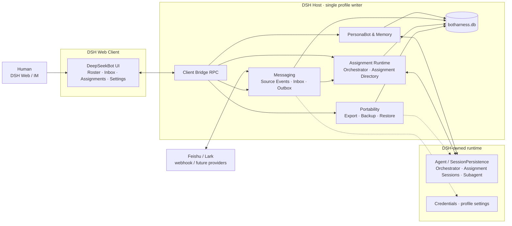
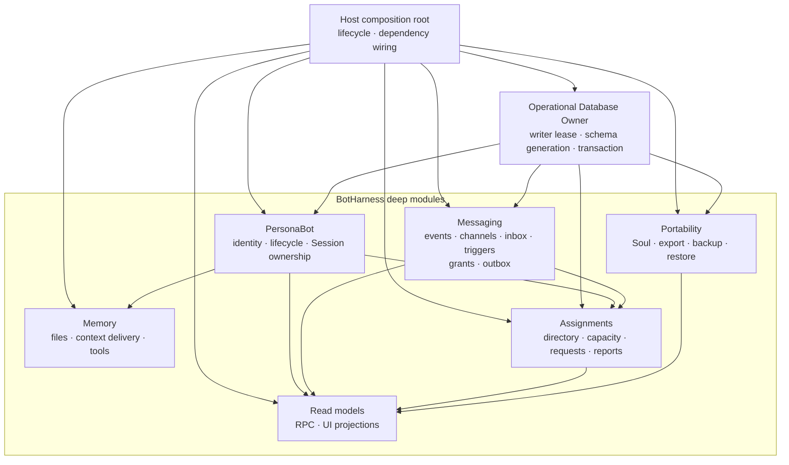
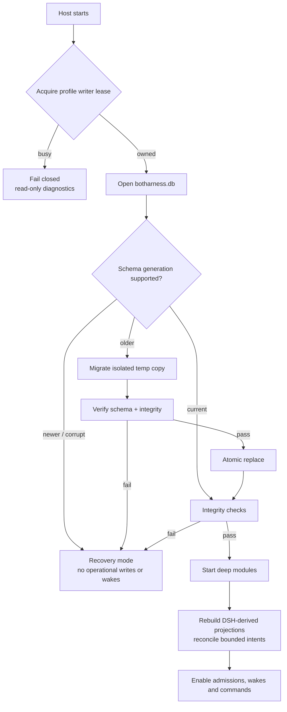
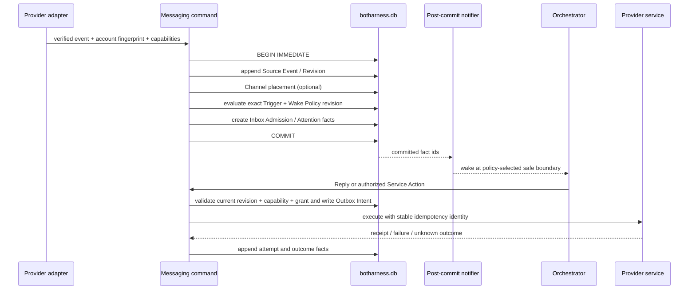
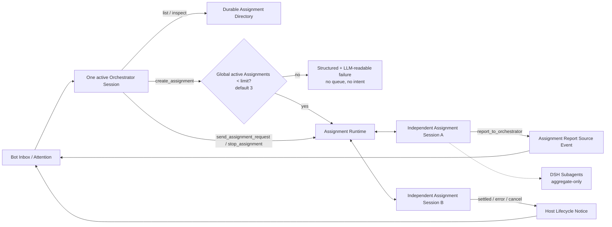
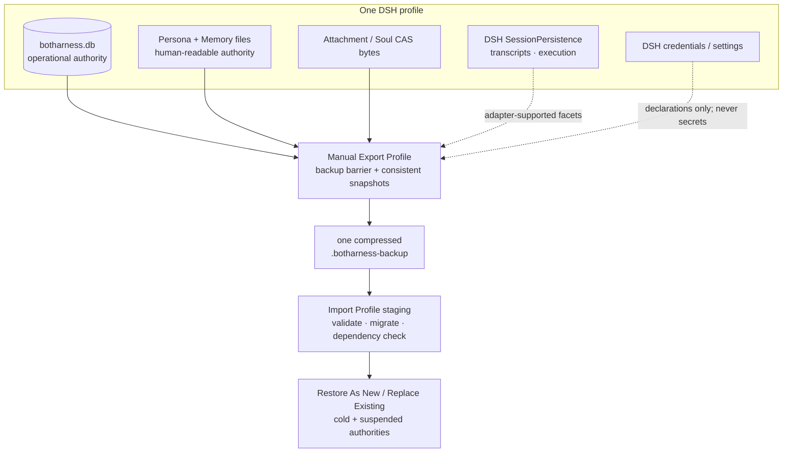

# BotHarness Architecture & Data Flow

<!-- Maintained source, not generated: this is the English translation of `docs/architecture/botharness-architecture.md`. Edit this file (and its `diagrams/en/*.mmd` sources), not `apps/docs`. -->

BotHarness is a plugin layer on top of DSH (DeepSeek Harness) that gives an Agent a persistent identity: a **PersonaBot**. Its persona and Memory continue across Sessions. One Orchestrator Session manages its Inbox and may coordinate multiple independent Assignment Sessions concurrently. DeepSeekBot is the first app, providing the roster, Bot Inbox, Assignment Directory, delegation, and IM integration.

This document describes the target architecture agreed in #71. The M1 registry, M2 Memory MVP, and #66 roster storage exist today; #77 has validated the DSH runtime seams, while explicit Session ownership, Messaging, the Assignment Runtime, the unified operational database, and portability ship incrementally through #79–#81. Updated 2026-09-20.

The rollout stays explicit: #66's `botharness_roster` domain is the current roster authority; #79 establishes only the `botharness.db` owner, and #80 performs the one-way roster and Session-ownership migration. The target diagrams show ownership after that migration, not a present-day dual-write path.

#56 extends the current roster global slot to `{ pins, sectionOrder, topOrder? }`: `topOrder` mixes section blocks with loose Channels while membership remains owned only by section records. The unary client bridge now has eight arrangement methods, adding `topReorder`; #80 must migrate this order and its single-membership invariant into the database without dual writes.

The root [`CONTEXT.md`](/dev/design/context) is the single product glossary. [BotHarness Runtime Architecture](/dev/design/bot-runtime) focuses on how PersonaBot, Bot Inbox, Orchestrator, Assignment, and DSH execution relate. DSH/Cordis terminology and Plugin-development decisions live under `/dsh` and are not redefined here.

## 1 · System context

The browser reaches Host read models and commands only through RPC. A provider adapter verifies and normalizes events and executes declared capabilities; it does not own the Inbox and cannot wake an Agent directly. DSH remains authoritative for Agent execution, SessionPersistence, Subagents, and credentials. BotHarness does not duplicate that runtime authority.

## 2 · Deep modules and ownership

| Module      | Owns                                                                                                      | Does not own                                         |
| ----------- | --------------------------------------------------------------------------------------------------------- | ---------------------------------------------------- |
| PersonaBot  | identity, lifecycle, explicit Session ownership                                                           | DSH Session lifecycle, Memory content                |
| Memory      | `PERSONA.md`, Memory files, the context-assembly contract                                                 | Inbox content, automatic distillation                |
| Messaging   | Source Events, Channel placement, Inbox Admission, Attention, Trigger/Wake Policy, Service Grants, Outbox | Agent execution, provider credentials                |
| Assignments | Assignment Directory, Assignment Request/Delivery Intent, capacity admission, report/lifecycle routing    | DSH transcripts, Subagent runtime                    |
| Portability | coordination for SoulSnapshot, PersonaBot Export, Profile Backup/Restore/Transfer                         | credentials, executable plugins, private DSH formats |
| Read models | queries, pagination, UI-friendly projections                                                              | business facts and write rules                       |

`botharness.db` is one physical transaction host, not a shared generic repository. Each deep module owns its tables and invariants only through its own interfaces; explicit commands and ports coordinate cross-module flows.

## 3 · Host boot, migration, and recovery

Only one BotHarness writer may own a DSH profile at a time. Module migrations combine into one monotonically increasing Schema Generation. Migration runs against a temporary copy and atomically replaces the active database only after validation. Open, migration, or integrity failure enters recovery mode; the Host never falls back to NDJSON, a storage domain, or in-memory writes.

## 4 · Messaging transaction and external side effects

A Source Event is the sole authority for content; Channels and Inboxes hold relationships only. A Reply follows the trusted Reply Route so the Host selects the source provider. A proactive post is a Service Action and requires both Provider Capability and a Human Service Grant. A SQLite transaction covers local facts only. External effects use an Outbox Intent, a stable idempotency identity, and bounded reconciliation without claiming exactly-once delivery. An outcome that cannot be proven becomes `unknown-outcome` for Human resolution.

Wake Policy decides when an Orchestrator observes new attention: at the safe boundary after the current step, after the current turn, or by starting a new turn while idle. Ordinary external messages do not interrupt a running model/tool step. Only a DSH-supported and policy-authorized control path may steer execution.

## 5 · Orchestrator and Assignment control plane

The Human does not create or select execution Conversations. The PersonaBot DM is the sole chat entry: a message becomes a Source Event, enters the Bot Inbox, and reaches the Orchestrator, which either replies directly or creates, reuses, and manages several Assignment Sessions within authorization and capacity. The UI projects those Assignment Sessions by purpose and state in the `Assignments` list; it never presents the Orchestrator Session as an Assignment.

PersonaBot navigation appears only in a DM. `Chat` and `Memory` are primary destinations, followed directly by the Assignments list. Selecting an Assignment opens read-only detail; raw DSH Session content requires an explicit secondary action. A group Channel has no such navigation. The first tracer bullet delivers Chat plus the files-first Memory loop; the Assignment list follows by consuming the Assignment Directory read model.

An Assignment Session is an independent DSH root whose canonical identity is the DSH `sessionId`; a Continuity Key is only a PersonaBot-local alias. The Orchestrator manages Assignments through five tools: `list_assignments`, `inspect_assignment`, `create_assignment`, `send_assignment_request`, and `stop_assignment`. An Assignment Agent can report only through `report_to_orchestrator`. v1 has no direct Assignment-to-Assignment messaging, broadcast, or waiting queue.

The Assignment Request modes `context-update`, `next-step`, and `next-turn` map to verified DSH inject, steer, and followup seams. An ordinary request never cancels the current step. Across the SQLite/DSH boundary BotHarness retains only a minimal Assignment Delivery Intent and performs bounded restart reconciliation. Ambiguity becomes `needs-repair`; it does not grow into a general workflow engine.

## 6 · Persistence, export, and restore boundaries

| Data                           | Authority                            | Portability                                                              |
| ------------------------------ | ------------------------------------ | ------------------------------------------------------------------------ |
| operational facts              | `$DSH_HOME/botharness/botharness.db` | consistent SQLite snapshot in a manual profile backup                    |
| Persona / Memory               | files under PersonaBot ownership     | SoulSnapshot / PersonaBot Export / profile backup                        |
| attachments / Soul bytes       | content-addressed files              | dependency-closed selected bytes                                         |
| Session transcript / execution | DSH SessionPersistence               | only through a verified DSH export adapter; otherwise explicitly omitted |
| credentials and DSH settings   | DSH services                         | never copied; restore creates suspended rebind requests                  |

v1 has only two backup actions: Export Profile produces one self-contained `.botharness-backup`, and Import Profile selects one file. There is no automatic backup, scheduler, catalog, retention, or incremental chain. Restore always validates in isolated staging. A restored PersonaBot stays cold, provider authorities stay suspended, and Workspace/model/plugin dependencies must be resolved on the target before a Human explicitly activates it.

## 7 · Critical boundaries

- Normal runtime uses explicit Session ownership only. `cwd` may be a migration or repair hint but never decides PersonaBot identity.
- DSH Session state is authoritative for execution. BotHarness projects activity/last-run facts and keeps a semantic Assignment Report separate from a Host Lifecycle Notice.
- Provider capability is not authorization. Discovering a Feishu channel never grants permission to post into it.
- The UI never reads files or the database directly and does not derive business state. It consumes Host read models and sends commands back to the owning module.
- Archiving a PersonaBot first closes admissions, wakes, and external actions, then stops its Orchestrator, Assignment Sessions, and owned Subagents. Purge is a separate destructive action.
- Browser and Host are separate Cordis applications. Host services are never injected across processes; all calls use the `/api` client bridge.
- Roadmap Project #1 stays private. Docs sync reads only explicit `In Progress` and Artifact values with `read:project`, then commits public JSON only after a fail-closed allowlist projection. Project notes, private items, assignees, backlog, and ETA never cross this publication boundary.

## 8 · Implementation order and parallel work

1. #77 validates the pinned DSH Agent/SessionPersistence/Subagent seams while #79 builds the operational database owner. These can proceed in parallel.
2. #80 implements explicit Session ownership and the activity projection after #77 and #79.
3. #81 implements the Assignment Runtime after #77, #79, and #80; Assignment coordination in #47 depends on it.
4. #78 can research the Feishu provider contract in parallel, but it gates adapter implementation in #48.
5. #74, #75, and #76 are focused design/grill tracks. In particular, #75 can run in parallel with sidebar ordering #55.

## 9 · Maintenance

- When module structure, data flow, transaction boundaries, or authority changes, update this file, its Chinese mirror, and `docs/architecture/diagrams/*.mmd`.
- Run `pnpm diagrams` and commit the light/dark SVGs. `scripts/sync-docs.mjs` publishes this source and those diagrams to `apps/docs`.
- Companion sources: BotHarness Product Context in `CONTEXT.md`, with trade-offs and rationale in `docs/adr/`. The platform spec and app PRD are archived working drafts rather than parallel design authorities.
