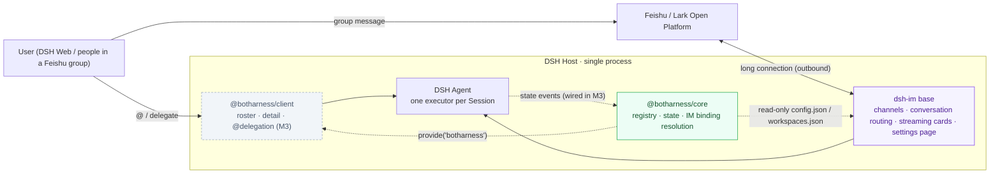
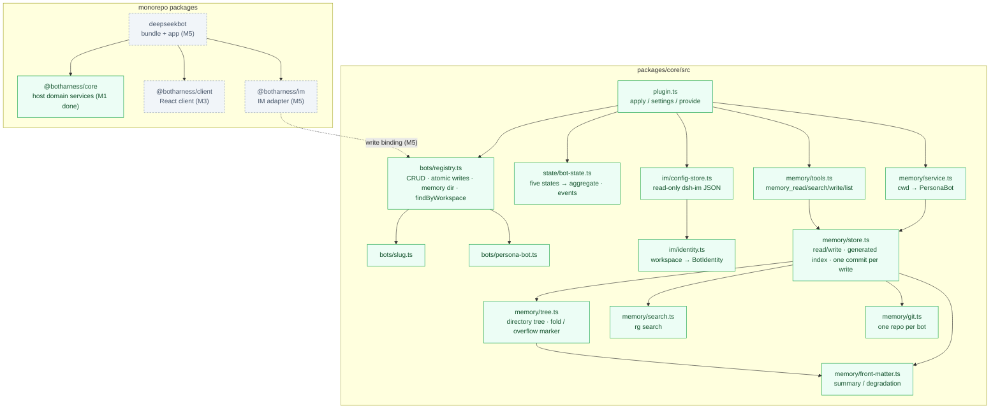
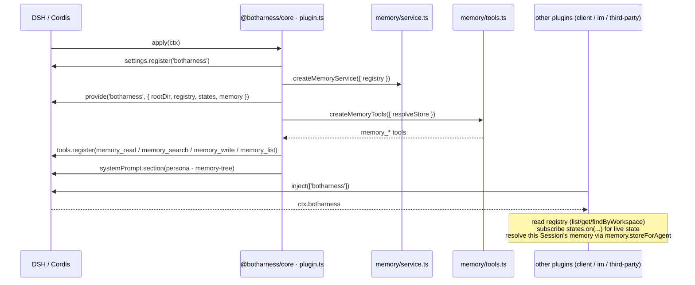
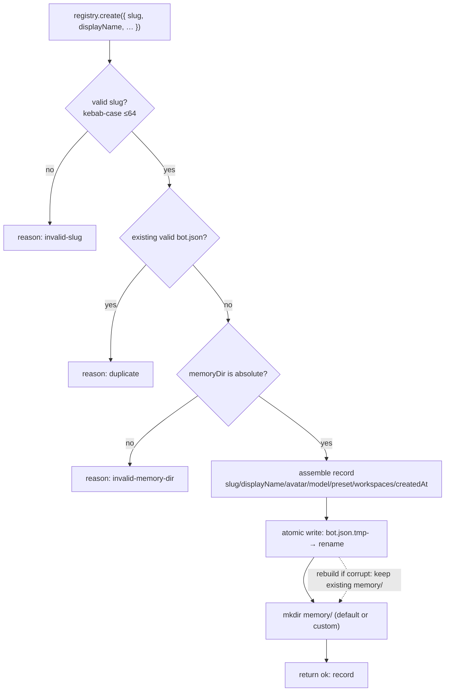
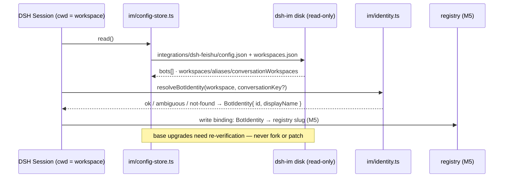
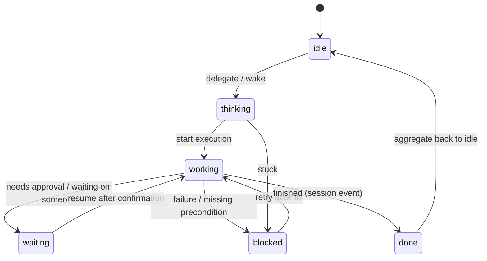

# BotHarness Architecture & Data Flow

<!-- Maintained source, not generated: this is the English translation of `docs/architecture/botharness-architecture.md`. Edit this file (and its `diagrams/en/*.mmd` sources), not `apps/docs`. -->

BotHarness is a plugin layer on top of DSH (DeepSeek Harness) that gives agents a persistent identity: **PersonaBot** — a persona with memory that spans sessions and can work concurrently. DeepSeekBot is its first app (sidebar roster + delegation + IM integration). The DSH core is not forked; IM channels come from the dsh-im base.

Status: M1 implemented (PR #13) · M2 memory MVP implemented · M3 roster & delegation · M5 IM adapter · M6 SoulSnapshot · M7 Soul registry (ADR-0019/0020) · updated 2026-09-18

## 1 · System context



Two entry points (DSH Web roster/delegation, Feishu group IM), one PersonaBot brain.

## 2 · Modules & packages



| Module                   | Responsibility                                                                                                   | Status            |
| ------------------------ | ---------------------------------------------------------------------------------------------------------------- | ----------------- |
| `plugin.ts`              | Plugin entry: settings namespace + `provide('botharness')`; assembled by `createCore()`                          | M1 ✅             |
| `bots/registry.ts`       | PersonaBot lifecycle + atomic persistence; `remove` keeps memory by default, only `purge` clears it              | M1 ✅             |
| `state/bot-state.ts`     | Five session states reported → PersonaBot aggregation; `aggregate-changed / session-changed / session-removed`   | M1 ✅             |
| `im/*`                   | Read-only dsh-im store (v1/v2/v3 compatible) + workspace→BotIdentity (IM binding helper)                         | M1 ✅ (M5 wiring) |
| `memory/front-matter.ts` | Front-matter parse/serialize + graceful degradation (first line + mtime; invalid YAML never throws)              | M2 ✅             |
| `memory/store.ts`        | Memory read/write: path jail, atomic writes, serial queue, `MEMORY.md` index, one commit per write               | M2 ✅             |
| `memory/tree.ts`         | Directory tree: front-matter summary + `updated_at`; ≤1000 paths, oversized dirs folded to counts                | M2 ✅             |
| `memory/search.ts`       | Case-insensitive search (`rg` when available, pure-Node fallback); skips front-matter, returns path/line/excerpt | M2 ✅             |
| `memory/tools.ts`        | DSH tools `memory_read / memory_search / memory_write / memory_list` (write requires summary)                    | M2 ✅             |
| `memory/service.ts`      | `agent.session.header.cwd → PersonaBot` mapping; one store per memory dir (serial across Sessions)               | M2 ✅             |
| `memory/git.ts`          | One repo per bot: single `main` branch, `.gitattributes` forcing LF, local identity, `history()`                 | M2 ✅             |
| roster client            | `main` panel + `sidebar.panellist`; roster tree / detail / create; @delegation                                   | M3                |

## 3 · Boot & service exposure



Everything goes through the Cordis service bus — no file polling.

## 4 · Creating a PersonaBot (data flow)



Validate → duplicate check (against valid records, not stuck on tombstone directories) → atomic write → memory directory.

## 5 · IM binding resolution (helper today, wired in M5)



## 6 · State machine & events



| Event               | Trigger                                            | Consumer               |
| ------------------- | -------------------------------------------------- | ---------------------- |
| `aggregate-changed` | aggregate state changed                            | roster / avatars (M3+) |
| `session-changed`   | any session state change (even if aggregate holds) | session detail         |
| `session-removed`   | session ended / cleaned up                         | tree refresh           |

## 7 · On-disk data

Ours (written by the registry):

```text
$DSH_HOME/botharness/bots/<slug>/
├── bot.json   # machine metadata (atomic write)
└── memory/    # default memory dir; absolute path configurable
               # M2: PERSONA.md / MEMORY.md / topic files
```

dsh-im's (read-only):

```text
$DSH_HOME/integrations/dsh-feishu/
├── config.json      # bots[]
├── workspaces.json  # v3: workspaces/aliases/overrides
└── bots/<botId>/state.json  # conversation binding (M5)
```

## 8 · Communication & boundaries

| Channel                            | Direction                    | Notes                                                                                         |
| ---------------------------------- | ---------------------------- | --------------------------------------------------------------------------------------------- |
| Cordis service `provide/inject`    | core → client/im/third-party | the `botharness` service; no global singleton                                                 |
| Tracker subscription `states.on()` | core → client                | in-process events, not polling                                                                |
| DSH event bus `ctx.on`             | DSH/dsh-im → core            | M3 subscribes to `agent/*` to drive state                                                     |
| Feishu / Lark                      | dsh-im ↔ open platform       | outbound long connection; no public ingress (webhook exception, see [PRD](/dev/spec/app-prd)) |
| dsh-im disk                        | read-only                    | only through the single `im/` module; no fork / no patch                                      |
| Secrets                            | —                            | only in the DSH credentials service; zero plaintext in the repo                               |

## 9 · How to maintain

- This is a **living** architecture document: when modules, data flows, or boundaries change structurally, update this file (mermaid sources are inlined).
- This page is synced to the docs site (`apps/docs`) by `scripts/sync-docs.mjs`; site address `https://botharness.ai/dev/architecture`.
- Companions: platform spec [docs/botharness.md](/dev/spec/platform) · app PRD [PRD.md](/dev/spec/app-prd) · glossary [CONTEXT.md](/dev/spec/context) · decisions [docs/adr/](/dev/adr/0015-botharness-is-a-dsh-plugin-layer).
