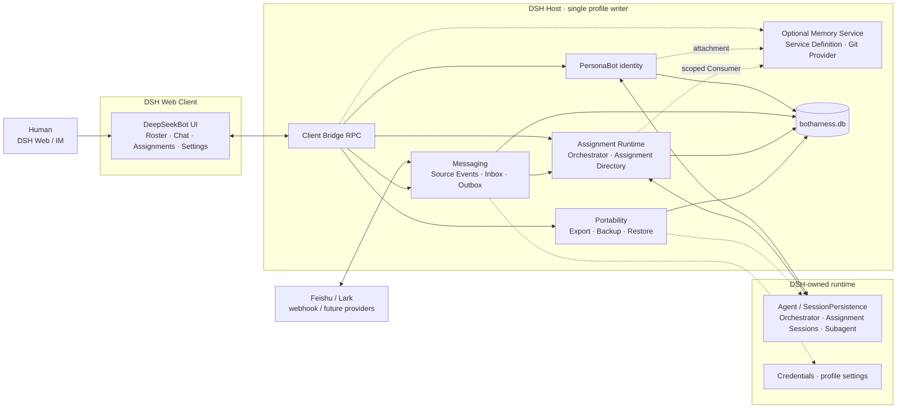
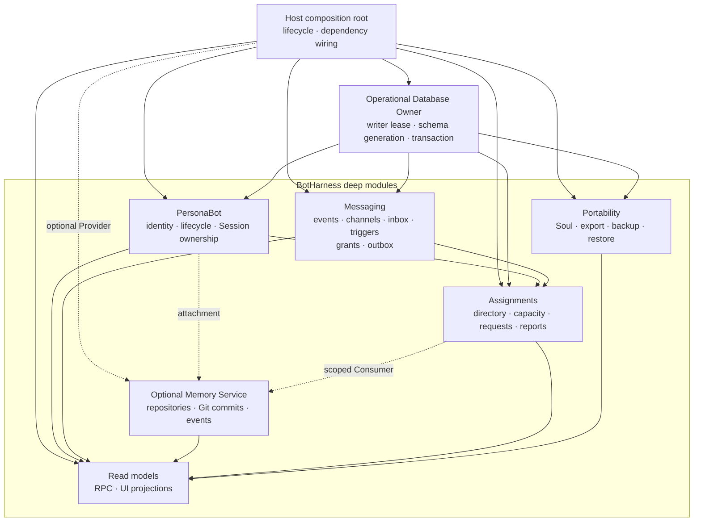
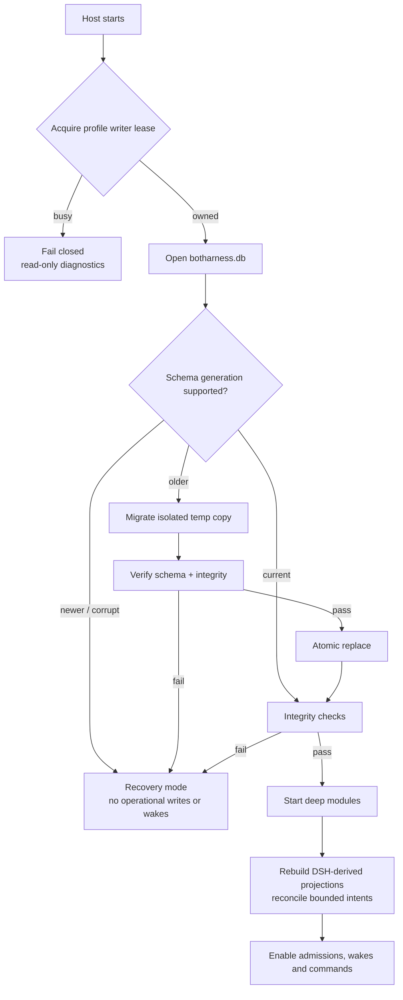
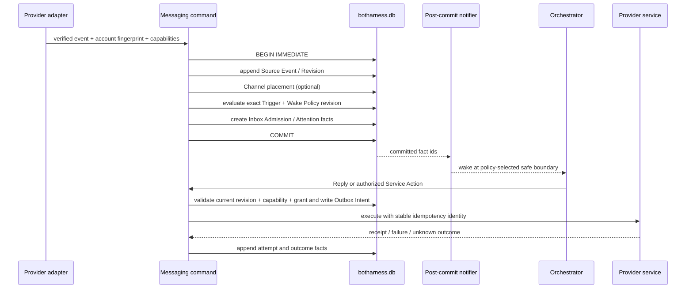
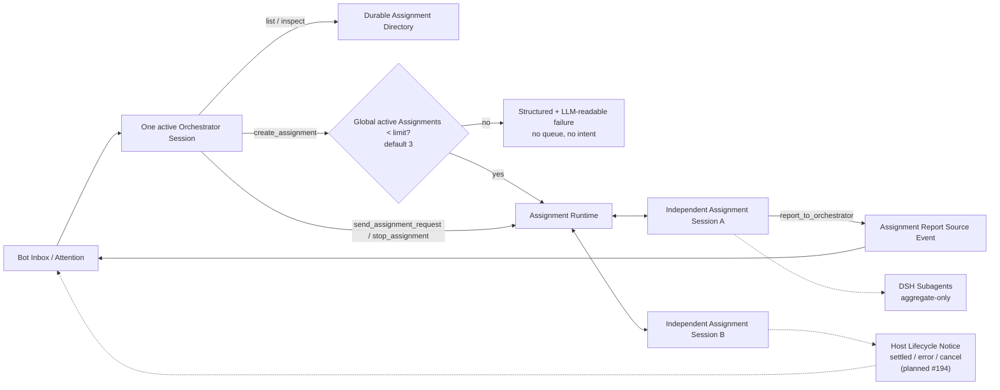
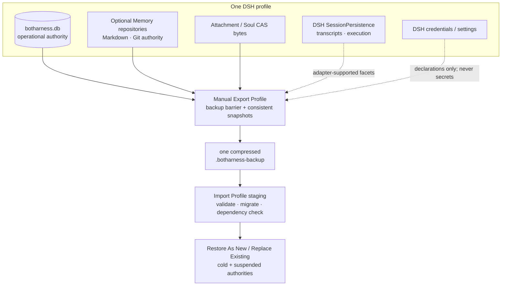

# BotHarness Architecture & Data Flow

<!-- Maintained source, not generated: this is the English translation of `docs/architecture/botharness-architecture.md`. Edit this file (and its `diagrams/en/*.mmd` sources), not `apps/docs`. -->

BotHarness is a plugin layer on top of DSH (DeepSeek Harness) that gives an Agent a persistent product identity: a **PersonaBot**. One Orchestrator Session manages its Inbox and may coordinate multiple independent Assignment Sessions concurrently; Memory is an optional capability and Persona is optional content within it; neither is a prerequisite for chat or execution. DeepSeekBot is the first app, providing the roster, Bot Inbox, Assignment Directory, delegation, and IM integration.

This document describes the target architecture agreed in #71. The M1 registry, M2 Memory MVP, and #66 roster storage exist today; #77 has validated the DSH runtime seams, while explicit Session ownership, Messaging, the Assignment Runtime, the unified operational database, and portability ship incrementally through #79–#81. Updated 2026-09-25.

The current Client UI mounts as a separate `@botharness/ui` Bundle, with source under `packages/client`. RC2 interprets a package ID ending `/client` as an export subpath, so [ADR-0066](../adr/0066-rc2-client-bundle-identity.md) assigns an unambiguous ID. Client HMR hands off only the selected Bot or Channel view; it does not copy the Host-owned PersonaBot, Channel, or message authority.

The rollout stays explicit: #66's `botharness_roster` domain is the current roster authority; #79 establishes only the `botharness.db` owner, and #80 performs the one-way roster and Session-ownership migration. The target diagrams show ownership after that migration, not a present-day dual-write path.

#56 and #137 extend the current roster global slot to `{ pins, hidden?, sectionOrder, topOrder? }`: `pins` canonically orders Channel IDs for both group Channels and PersonaBot DMs, `hidden` omits Channels only from roster navigation while retaining their placement, and `topOrder` mixes section blocks with loose Channels while membership remains owned only by section records. The unary client bridge now has nine arrangement methods, adding `topReorder` and `hiddenSet`; #80 must migrate this order, hidden presentation state, and single-membership invariant into the database without dual writes. After a roster mutation commits, the Host publishes a `roster/changed` live invalidation; other windows re-read the authoritative roster and never receive or replicate an in-progress drag preview.

The collapsed BOT-mode rail reuses this Channel-order read model: pinned items sit above a divider, while the remaining DM and group Channels follow the flattened section/loose order. `botharness/channels` additionally projects an optional `latestMessage` for hover previews; the field is derived from the current Messaging authority and does not become another durable source of truth.

Hidden Channel is application-defined reversible roster presentation state: it disappears from the expanded list, pin grid, search, and collapsed rail without changing the Channel, messages, PersonaBot, Memory, or retained placement. Destructive deletion remains behind ADR-0037's dependency report and separate confirmation boundary (#138).

Current Channel Chat live delivery follows ADR-0054: each committed message is written to the current durable authority before a process-local notification carrying that Channel's monotonic revision. The Host's opaque-cursor timeline exposes latest, older, newer, and around windows; after a reply quote locates old history, ordinary downward scrolling continues through newer pages to the latest committed message. The Client receives committed messages for the selected Channel over authenticated `/api/botharness/stream` SSE. Reconnects replay from the log; a gap re-reads the snapshot. The same connection carries process-only `channel/draft` previews of the Orchestrator's explicit `channel_send` arguments; drafts have no Channel revision, never replay from history, and disappear on commit or abandonment. Human sends use a Client-generated idempotency key: a failed local bubble remains available for restoring its text and attachments to the composer, while a response-loss retry with the same id can produce only one durable append. Ordinary Orchestrator finals and Assignment output are not Channel messages. When #46 migrates Messaging, a database transaction commit replaces the current NDJSON append as the publication boundary.

Channel attachment bytes live in a profile-scoped content-addressed store while messages persist only `{hash,name,mime,size}` references. Upload, inline display, and download use authenticated exact Fetch routes. An Orchestrator reads an image on demand through `channel_read_image` with `channel_id + message_id + hash`; trusted Host code first verifies PersonaBot membership, that the message references the exact hash, a supported image MIME, and the size limit, then commits the verified bytes to the DSH attachment service for model input. Historical images are not injected into every prompt, and the model never receives internal profile paths.

The root [`CONTEXT.md`](/dev/design/context) is the single product glossary. [BotHarness Runtime Architecture](/dev/design/bot-runtime) focuses on how PersonaBot, Bot Inbox, Orchestrator, Assignment, and DSH execution relate. DSH/Cordis terminology and Plugin-development decisions live under `/dsh` and are not redefined here.

## 1 · System context

The browser reaches Host read models and commands only through RPC. A provider adapter verifies and normalizes events and executes declared capabilities; it does not own the Inbox and cannot wake an Agent directly. DSH remains authoritative for Agent execution, SessionPersistence, Subagents, and credentials. BotHarness does not duplicate that runtime authority.

## 2 · Deep modules and ownership

| Module      | Owns                                                                                                      | Does not own                                         |
| ----------- | --------------------------------------------------------------------------------------------------------- | ---------------------------------------------------- |
| PersonaBot  | identity, lifecycle, explicit Session ownership                                                           | DSH Session lifecycle, Memory content                |
| Memory      | generic Git-backed repositories, semantic commits, operation events                                       | PersonaBot lifecycle, Inbox, Sessions                |
| Messaging   | Source Events, Channel placement, Inbox Admission, Attention, Trigger/Wake Policy, Service Grants, Outbox | Agent execution, provider credentials                |
| Assignments | Assignment Directory, Assignment Request/Delivery Intent, capacity admission, report/lifecycle routing    | DSH transcripts, Subagent runtime                    |
| Portability | coordination for SoulSnapshot, PersonaBot Export, Profile Backup/Restore/Transfer                         | credentials, executable plugins, private DSH formats |
| Read models | queries, pagination, UI-friendly projections                                                              | business facts and write rules                       |

`botharness.db` is the physical transaction host for BotHarness core, not a shared generic repository. Optional Git-backed Providers own Memory content and commits. Each deep module owns its tables and invariants only through its own interfaces; explicit commands and ports coordinate cross-module flows.

The application-defined Memory Service uses a `Consumer → Service Definition → Provider` capability seam. Every PersonaBot has a Git-backed Memory Repository and its Orchestrator Session uses that repository as its fixed working directory. The checked-out working-tree files are current Memory immediately, whether they are Markdown, code, or binary. The Agent reads and changes the repository through native file, search, Shell, and Git capabilities; there are no model-visible Memory CRUD tools. PersonaBot creation offers empty Memory or an HTTPS/SSH Git import: the Host checks Git, clones into staging with its existing credentials, and creates the Bot only after a successful clone; the checked-out branch and files become Memory immediately (#298). The creation page never collects private repository credentials. An existing Bot integrates a remote with native Git. If incorporating an external repository requires a choice between merge, replacement, or another destination, the Orchestrator uses DSH's native Ask Question seam. Git governs branches, merges, and conflicts. A switch takes effect in the same Session as soon as Git changes the worktree; the Session-frozen Persona prompt does not change retroactively (ADR-0060).

Memory Service owns repository identity and lifecycle, trusted Session ownership, bounded UI queries, and audit/recovery checkpoints. After a successful turn it may record the observed HEAD with the trusted Source Event and Session actor, but it never stages, commits, or hides working-tree files as part of observation. The Git repository is the authority for current files and history; the database ledger is an auxiliary record. The Channel Memory list reads the current worktree, renders text with a bounded preview, lists binary files without text editing, and shows all local Git branches and reachable commits in the graph. Human text saves compare the current HEAD and make an explicit Git commit. Memory file queries block `.git` control paths and symlink escapes, without restricting the file types Git may store. Legacy repair archives and checkpoint records remain available for compatibility; a normal uncommitted edit does not block the next turn or require repair (ADR-0068).

## 3 · Host boot, migration, and recovery

Only one BotHarness writer may own a DSH profile at a time. Module migrations combine into one monotonically increasing Schema Generation. Migration runs against a temporary copy and atomically replaces the active database only after validation. Open, migration, or integrity failure enters recovery mode; the Host never falls back to NDJSON, a storage domain, or in-memory writes.

## 4 · Messaging transaction and external side effects

A Source Event is the sole authority for content; Channels and Inboxes hold relationships only. A Reply follows the trusted Reply Route so the Host selects the source provider. A proactive post is a Service Action and requires both Provider Capability and a Human Service Grant. A SQLite transaction covers local facts only. External effects use an Outbox Intent, a stable idempotency identity, and bounded reconciliation without claiming exactly-once delivery. An outcome that cannot be proven becomes `unknown-outcome` for Human resolution.

Wake Policy decides when an Orchestrator observes new attention: at the safe boundary after the current step, after the current turn, or by starting a new turn while idle. Ordinary external messages do not interrupt a running model/tool step. Only a DSH-supported and policy-authorized control path may steer execution.

### Bot collaboration through Channels (ADR-0065)

A Bot-to-Bot DM is a real `dm` Channel with two PersonaBot participants. Bot A sends as its trusted Actor identity derived from Session ownership; Messaging commits one Source Event, Channel placement, and B's Inbox Admission in the same authority. The Bot-hop guard bounds loops, and A does not receive its own output. A Human may open this default-hidden Channel read-only without becoming a third member. Every committed A send to a non-Human DM Channel adds a centered action chip to Human–A DM. The chip points to the send and inspectable conversation rather than copying the message body.

Selecting `@B` in Human–A DM supplies B's stable ID and bounded description to A's prompt; it neither wakes B nor changes DM membership. Only a later explicit A-to-B send reaches B's Inbox. In a Group Channel, a Human or joined Bot may `@` joined Bots; one Source Event yields independent Inbox Admissions for the recipients. A Bot may create a Group Channel and invite other Bots; an invitation grants no membership before acceptance. The Bot creator can manage Bot members and Group settings, while the Human retains override authority and exclusive whole-Channel deletion. #254 is the first Human-authored Group mention slice; #278 organizes the later collaboration tracers.

The Orchestrator's application-defined channel_list query derives the PersonaBot identity from Session ownership and returns only its joined Group, Human DM, and Bot DM Channels. It filters by name, type, or stable member Bot IDs with bounded cursor pages and current member identities. The result is an authorized Consumer of canonical Channel records, not a second membership directory. A Bot may use a returned stable Channel ID in channel_send, which rechecks membership at send time. The application-defined channel_read query checks membership and filters the full ordered history of one Channel by text, author, and date before returning a bounded cursor page; reply previews still resolve from their original messages.

## 5 · Orchestrator and Assignment control plane

The Human does not create or select execution Conversations. The Human–PersonaBot DM is the Human's direct entry to that Bot: a message becomes a Source Event, enters the Bot Inbox, and reaches the Orchestrator, which either replies directly or creates, reuses, and manages several Assignment Sessions within authorization and capacity. The UI projects those Assignment Sessions by purpose and state in the `Assignments` list; it never presents the Orchestrator Session as an Assignment.

A Workspace Grant is durable, application-defined PersonaBot authority for one resolved directory. A Human adds an existing Host folder through the DSH picker or an absolute path entry, validated by the Workspace registry, then grants it to the PersonaBot. The Orchestrator keeps its Memory Repository as cwd, may read and write Memory, and may read every currently active granted project folder; it cannot directly write project folders or issue Grants. Each Assignment selects one active Grant and persists its Grant ID, Workspace ID, single primary cwd, and permission snapshot; it may read and write only that selected folder. Revocation stops future file access for both roles and future Assignment create/request/resume/wake under that Grant; a new Grant does not revive an old Session. The right pane shows Memory as a fixed internal root and project folders as addable, revocable access rows; revocation does not delete DSH registrations or files. Native DSH workspace-write limits some writes but does not isolate reads and may allow temp writes, so BotHarness needs one enforcing file and execution Provider across native file, search, Shell, and terminal operations, failing closed when it cannot enforce the roots (ADR-0067). The current #233 tracer implements Assignment admission and safe write defaults, not this read boundary, and must not be presented as folder isolation.

When no active Grant fits the requested project work, the Orchestrator can emit a durable authorization request card in its DM through a dedicated tool. This tool can request access but cannot issue a Grant or pre-create an Assignment. The Human chooses a Host folder on the card; the existing Workspace Grant authority validates and persists access, and the Human’s explicit DM reply becomes a Source Event that wakes the same Orchestrator Session. The Orchestrator lists active Grants again before creating the Assignment under the selected Grant. The card and the Grant are separate durable facts. Ordinary Assignment Asks still reach the Orchestrator first; forwarding native DSH questions and permissions is a later slice.

The right region is the Channel sidebar (ADR-0053): a group Channel shows its membership and Channel management entries, and a Human–PersonaBot DM shows that PersonaBot's entries such as Assignments, Memory, Bot Inbox, and Computer. Entries register through one ordered, collapsible seam, and unavailable entries are absent rather than placeholders. Chat is always the center Channel body. Selecting an Assignment opens read-only detail; raw DSH Session content requires an explicit secondary action. The first tracer bullet does not depend on Persona or Memory: create a name-only Bot, traverse the real DM → Bot Inbox → Orchestrator Session → Assignment Session → Assignment Report path, reply in the same DM, and expose the Assignment through the smallest Human-testable list/detail projection.

An Assignment Session is an independent DSH root whose canonical identity is the DSH `sessionId`; a Continuity Key is only a PersonaBot-local alias. The Orchestrator manages Assignments through five tools: `list_assignments`, `inspect_assignment`, `create_assignment`, `send_assignment_request`, and `stop_assignment`. An Assignment Agent can report only through `report_to_orchestrator`. v1 has no direct Assignment-to-Assignment messaging, broadcast, or waiting queue.

The current `stop_assignment` uses DSH `Agent.cancel({ kind: "user" })` to abort the active turn and clear queued input. BotHarness persists a stopping state first, then a stopped state after the Agent is quiescent. A stopped Assignment rejects requests and late reports; its Continuity Key can start a new Session. Cancellation retains DSH Session history. Independent Host Lifecycle Notices and Attention/digest remain later #194 slices.

The Assignment Request modes `context-update`, `next-step`, and `next-turn` map to verified DSH inject, steer, and followup seams. An ordinary request never cancels the current step. Across the SQLite/DSH boundary BotHarness retains only a minimal Assignment Delivery Intent and performs bounded restart reconciliation. Ambiguity becomes `needs-repair`; it does not grow into a general workflow engine.

## 6 · Persistence, export, and restore boundaries

| Data                           | Authority                            | Portability                                                              |
| ------------------------------ | ------------------------------------ | ------------------------------------------------------------------------ |
| operational facts              | `$DSH_HOME/botharness/botharness.db` | consistent SQLite snapshot in a manual profile backup                    |
| optional Memory repositories   | Git-backed Memory Provider           | selected SoulSnapshot / PersonaBot Export / profile backup               |
| attachments / Soul bytes       | content-addressed files              | dependency-closed selected bytes                                         |
| Session transcript / execution | DSH SessionPersistence               | only through a verified DSH export adapter; otherwise explicitly omitted |
| credentials and DSH settings   | DSH services                         | never copied; restore creates suspended rebind requests                  |

v1 has only two backup actions: Export Profile produces one self-contained `.botharness-backup`, and Import Profile selects one file. There is no automatic backup, scheduler, catalog, retention, or incremental chain. Restore always validates in isolated staging. A restored PersonaBot stays cold, provider authorities stay suspended, and Workspace/model/plugin dependencies must be resolved on the target before a Human explicitly activates it.

## 7 · Critical boundaries

- Normal runtime uses explicit Session ownership only. `cwd` may be a migration or repair hint but never decides PersonaBot identity.
- DSH Session state is authoritative for execution. BotHarness projects activity/last-run facts and keeps a semantic Assignment Report separate from a Host Lifecycle Notice.
- Provider capability is not authorization. Discovering a Feishu channel never grants permission to post into it.
- The UI never reads files or the database directly and does not derive business state. It consumes Host read models and sends commands back to the owning module.
- Archiving a PersonaBot first closes admissions, wakes, and external actions, then stops its Orchestrator, Assignment Sessions, and owned Subagents. Purge is a separate destructive action.
- Browser and Host are separate Cordis applications. Host services are never injected across processes; all calls use the `/api` client bridge.
- Roadmap Project #1 stays private. Docs sync reads only explicit `In Progress` and Artifact values with `read:project`, then commits public JSON only after a fail-closed allowlist projection. Project notes, private items, assignees, backlog, and ETA never cross this publication boundary.

## 8 · Implementation order and parallel work

1. #77 validates the pinned DSH Agent/SessionPersistence/Subagent seams while #79 builds the operational database owner. These can proceed in parallel.
2. #80 implements explicit Session ownership and the activity projection after #77 and #79.
3. After #77, #79, and #80, #81 first delivers the minimal DM → Orchestrator → Assignment → report → DM-reply tracer bullet together with a Human-testable Assignment list/detail; later Assignment coordination in #47 expands only after that slice passes.
4. #78 can research the Feishu provider contract in parallel, but it gates adapter implementation in #48.
5. #74 advances Memory as a separate optional-Provider tracer bullet only after that main path passes; #75 and #76 remain focused design/grill tracks so they do not block the first experiential loop.

## 9 · Maintenance

- When module structure, data flow, transaction boundaries, or authority changes, update this file, its Chinese mirror, and `docs/architecture/diagrams/*.mmd`.
- Run `pnpm diagrams` and commit the light/dark SVGs. `scripts/sync-docs.mjs` publishes this source and those diagrams to `apps/docs`.
- Companion sources: BotHarness Product Context in `CONTEXT.md`, with trade-offs and rationale in `docs/adr/`. The platform spec and app PRD are archived working drafts rather than parallel design authorities.
