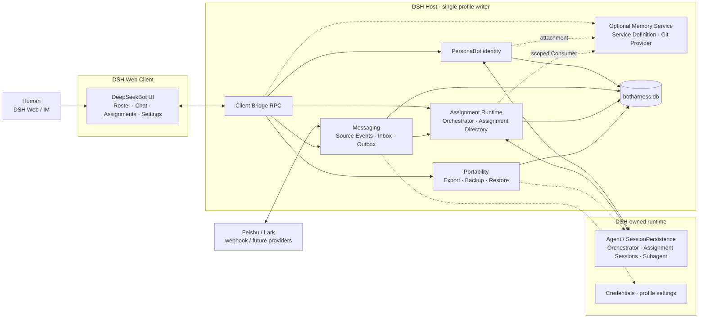
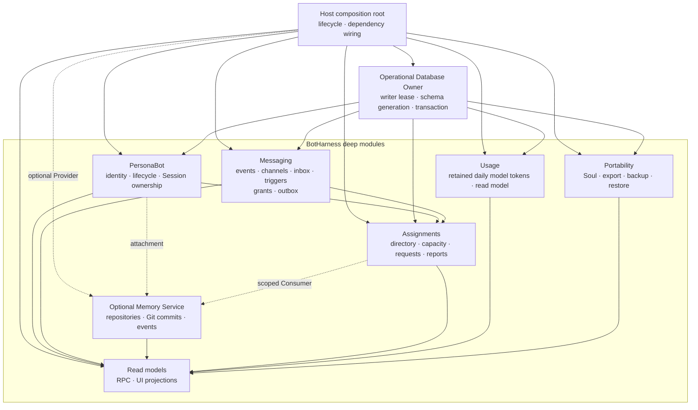
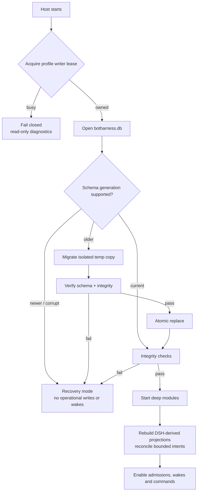
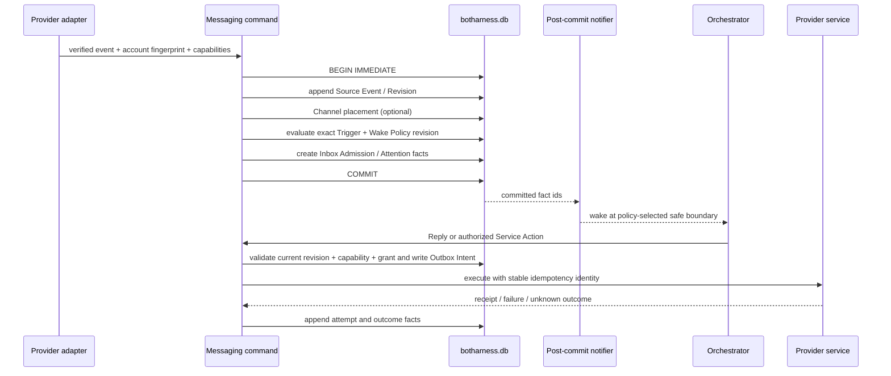
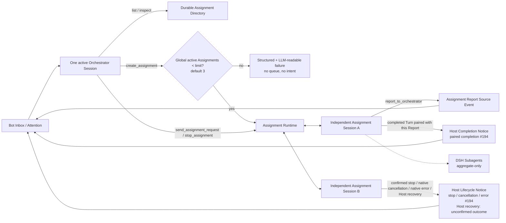
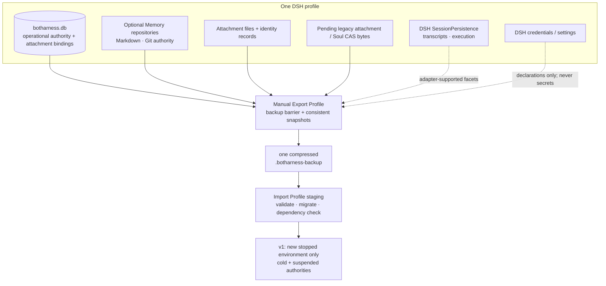
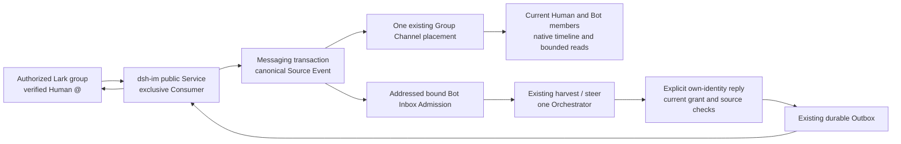

# BotHarness Architecture & Data Flow

<!-- Maintained source, not generated: this is the English translation of `docs/architecture/botharness-architecture.md`. Edit this file (and its `diagrams/en/*.mmd` sources), not `apps/docs`. -->

BotHarness is a plugin layer on top of DSH (DeepSeek Harness) that gives an Agent a persistent product identity: a **PersonaBot**. One Orchestrator Session manages its Inbox and may coordinate multiple independent Assignment Sessions concurrently; Memory is an optional capability and Persona is optional content within it; neither is a prerequisite for chat or execution. DeepSeekBot is the first app, providing the roster, Bot Inbox, Assignment Directory, delegation, and IM integration.

This document describes the target architecture agreed in #71. The M1 registry, M2 Memory MVP, and #66 roster storage exist today; #77 has validated the DSH runtime seams, while explicit Session ownership, Messaging, the Assignment Runtime, the unified operational database, and portability ship incrementally through #79–#81. Updated 2026-09-28.

The current Client UI mounts as a separate `@botharness/ui` Bundle, with source under `packages/client`. RC2 interprets a package ID ending `/client` as an export subpath, so [ADR-0066](../adr/0066-rc2-client-bundle-identity.md) assigns an unambiguous ID. Client HMR hands off only the selected Bot or Channel view; it does not copy the Host-owned PersonaBot, Channel, or message authority.

The rollout stays explicit: #66's `botharness_roster` domain is the current roster authority; #79 establishes only the `botharness.db` owner, and #80 performs the one-way roster and Session-ownership migration. The target diagrams show ownership after that migration, not a present-day dual-write path.

#56 and #137 extend the current roster global slot to `{ pins, hidden?, sectionOrder, topOrder? }`: `pins` canonically orders Channel IDs for both group Channels and PersonaBot DMs, `hidden` omits Channels only from roster navigation while retaining their placement, and `topOrder` mixes section blocks with loose Channels while membership remains owned only by section records. The unary client bridge now has nine arrangement methods, adding `topReorder` and `hiddenSet`; #80 must migrate this order, hidden presentation state, and single-membership invariant into the database without dual writes. After a roster mutation commits, the Host publishes a `roster/changed` live invalidation; other windows re-read the authoritative roster and never receive or replicate an in-progress drag preview.

The collapsed BOT-mode rail reuses this Channel-order read model: pinned items sit above a divider, while the remaining DM and group Channels follow the flattened section/loose order. `botharness/channels` additionally projects an optional `latestMessage` for hover previews; the field is derived from the current Messaging authority and does not become another durable source of truth.

Hidden Channel is application-defined reversible roster presentation state: it disappears from the expanded list, pin grid, search, and collapsed rail without changing the Channel, messages, PersonaBot, Memory, or retained placement. Destructive deletion remains behind ADR-0037's dependency report and separate confirmation boundary (#138).

Current Channel Chat live delivery follows ADR-0054: each committed message is written to the current durable authority before a process-local notification carrying that Channel's monotonic revision. The Host's opaque-cursor timeline exposes latest, older, newer, and around windows; after a reply quote locates old history, ordinary downward scrolling continues through newer pages to the latest committed message. The Client receives committed messages for the selected Channel over authenticated `/api/botharness/stream` SSE. Reconnects replay from the log; a gap re-reads the snapshot. The same connection carries process-only `channel/draft` previews of the Orchestrator's explicit `channel_send` arguments; drafts have no Channel revision, never replay from history, and disappear on commit or abandonment. Human sends use a Client-generated idempotency key: a failed local bubble remains available for restoring its text and attachments to the composer, while a response-loss retry with the same id can produce only one durable append. Ordinary Orchestrator finals and Assignment output are not Channel messages. When #46 migrates Messaging, a database transaction commit replaces the current NDJSON append as the publication boundary.

New Channel attachments (#576, ADR-0100) are independent profile-managed real files referenced as `{fileId,name,mime,size}`. Message queries project current MIME/size without changing the immutable Source Event envelope. Retained legacy `{hash,name,mime,size}` occurrences resolve through generation 39 Messaging bindings to independent real files; conversion validates source and destination bytes before activation, leaving immutable envelopes unchanged. Failed conversions keep the old readable object and a bounded repair diagnostic. Composer upload keys and Human message IDs make transfer/send retries idempotent. Authenticated upload retains its exact Fetch route; current downloads validate `channelId + messageId + fileId` and use `no-store`. Human chips reuse DSH-native actions. `channel_read_image` accepts `attachment_id` (fileId) or legacy `hash`; trusted Host code checks current membership, message ownership, current MIME and size before passing image bytes to DSH, with no model-visible Host paths. Reference-aware cleanup protects identities in every retained Source Event; no automatic retention is enabled. See the [file guide](../file-open.md).

The owning Orchestrator can forward up to 10 trusted attachment references copied unchanged from `channel_read` (including complete `message_id`/`content_cursor` reads) or an older authorized read: exactly `{fileId,name,mime,size}`. After #577, retained legacy messages project migrated file identities; obsolete `{hash,name,mime,size}` results must be refreshed from the owning message before forwarding, while owner-qualified legacy image reads still resolve current bytes. The Orchestrator may also explicitly import a selected authorized local result using `channel_attachment_import`; identifiers and metadata must not be guessed. The supported DSH schema declares `size` as an integer; Host validation retains the safe nonnegative byte range 0–9007199254740991. Array limits remain explicit descriptions plus runtime guards because the pinned DSH schema does not support `maxItems` or numeric bounds. At most 20 Group mention IDs are accepted; each must identify another active current member. `channel_send` returns compact `{channelId,messageId}` JSON only after canonical Messaging accepts the write, using the inbound Channel when no destination is supplied. This replaces the former prose acknowledgement; attachment identities, profile ownership, current-file semantics, reply targets, delivery-key retries and causal-loop boundaries remain intact ([#570](https://github.com/BotHarness/BotHarness/issues/570)).

The root [`CONTEXT.md`](/dev/design/context) is the single product glossary. [BotHarness Runtime Architecture](/dev/design/bot-runtime) focuses on how PersonaBot, Bot Inbox, Orchestrator, Assignment, and DSH execution relate. DSH/Cordis terminology and Plugin-development decisions live under `/dsh` and are not redefined here.

The application-defined `group_leave` Tool returns `{channelId,left:true,outcome:"changed"}` only after canonical membership removal, or `{channelId,left:false,outcome:"unchanged",reason:"not-member"}` when the Bot is not a current Group member. No-change includes a repeat and a never-joined Group; it neither guesses historical membership nor returns a hidden Group name or roster. Missing Channels fail with `group_leave: channel-unavailable`, and non-Group targets fail with `group_leave: group-required`, replacing their former ambiguous `left:false` success. Tool exceptions remain failures. Existing `{channelId,left}` fields and the Core return shape remain compatible; consumers must handle the explicit invalid-target failures. The same ADR-0073 transaction retains creator-to-Human handoff, pending-admission revocation, one durable departure notice and remaining-member attention policy. Post-commit live-notification warnings do not negate a committed change; read/send authority is lost immediately, so the Bot reports to the Human through an available Channel ([#571](https://github.com/BotHarness/BotHarness/issues/571)).

Bot-mode onboarding (#1175, [ADR-0147](../adr/0147-onboarding-is-profile-progress-over-canonical-dm-evidence.md)) has an application-defined Onboarding owner that stores a Profile receipt in the existing operational database at schema generation 71. Deliberate entry prepares the identity through Registry/Memory, saves the website mascot Appearance, and idempotently prepares the real Human DM and one product-authored system welcome through the Channel owner. Existing Bots are reused or selected; deletion and archive never trigger resurrection. The Channel append transaction retains trusted Session ownership and Human-request Source Event provenance for a real same-DM Bot reply. That evidence completes onboarding; welcomes, acceptance, failure notices and initialized Memory do not. Tutorial participation is separate from completion. Unsent intent and companion preferences stay Client-local, and a fresh Client does not reopen another Client's highlight.

The welcome offers capability introduction, today’s news, a daily summary and a ten-minute schedule test as ordinary Human DM requests through existing execution capabilities. Model saving and question sending are separate actions: standalone model setup invents no question, and blocked requests reach a distinct send-review step after saving. Closing or restoring either step never submits a request.

Native model and credential Services remain authoritative. Default-on Profile setup saves and verifies the native global selection, leaving the Bot inheriting; opting out writes an individual Model Plan. New Bots without a plan follow the global default. A retained revision counter protects return to inheritance; global edits preserve fixed plans and running Assignment Sessions. Manual retry uses the original Human message and Admission through the existing retryability/side-effect gate, without adding another Human message.

## 1 · System context

```mermaid
flowchart LR
  Human["Human<br/>DSH Web / IM"]
  External["Feishu / Lark<br/>webhook / future providers"]

  subgraph Browser["DSH Web Client"]
    UI["DeepSeekBot UI<br/>Roster · Chat · Assignments · Settings"]
  end

  subgraph Host["DSH Host · single profile writer"]
    API["Client Bridge RPC"]
    Identity["PersonaBot identity"]
    Memory["Optional Memory Service<br/>Service Definition · Git Provider"]
    Messaging["Messaging<br/>Source Events · Inbox · Outbox"]
    Assignments["Assignment Runtime<br/>Orchestrator · Assignment Directory"]
    Transfer["Portability<br/>Export · Backup · Restore"]
    DB[("botharness.db")]
  end

  subgraph DSH["DSH-owned runtime"]
    Sessions["Agent / SessionPersistence<br/>Orchestrator · Assignment Sessions · Subagent"]
    Credentials["Credentials · profile settings"]
  end

  Human --> UI
  External <--> Messaging
  UI <--> API
  API --> Identity
  API -.-> Memory
  API --> Messaging
  API --> Assignments
  API --> Transfer
  Identity --> DB
  Identity -. attachment .-> Memory
  Messaging --> DB
  Assignments --> DB
  Transfer --> DB
  Identity <--> Sessions
  Messaging --> Assignments
  Assignments <--> Sessions
  Assignments -. scoped Consumer .-> Memory
  Messaging -.-> Credentials
  Transfer -.-> Sessions
```

The browser reaches Host read models and commands only through RPC. A provider adapter verifies and normalizes events and executes declared capabilities; it does not own the Inbox and cannot wake an Agent directly. DSH remains authoritative for Agent execution, SessionPersistence, Subagents, and credentials. BotHarness does not duplicate that runtime authority.

PersonaBot activity is delivered as one Host-owned snapshot (`generation`, monotonic `revision`, per-Bot aggregate state) through the public `activitySnapshot` query and authenticated `scope=activity` SSE. Every connection starts with a complete baseline, followed by complete snapshots on actual Activity projection changes; reconnects recover without a second activity history. The Client atomically updates pinned, ordinary and rail avatars and the DM composer, rejects older revisions within a generation, and retains current activity over stale roster responses. Leaving Bot mode or hiding the page closes the connection. The Activity Client also queries a baseline on entry and refetches on revision gaps. A failed or unavailable stream retries and queries the existing `activitySnapshot` authority at most once per 10 seconds, with a 5-second query deadline; valid live frames stop fallback refresh. A slow Activity stream retains one queued complete snapshot and coalesces later changes to the latest snapshot, so skipped revisions recover without replaying raw execution facts. Leaving Bot mode, hiding the page or Plugin disposal cancels timers, requests and subscriptions; late responses from an older Host generation cannot replace a newer live baseline (#121). Execution state comes from explicit Session Ownership and the existing DSH SessionEvent Projection, never roster polling or local send flags (#120/#536). On initial connection, the Channel stream also sends current receipts for at most 100 messages at or before the already-seen cursor; this closes the HTTP-snapshot/stream gap without polling or creating another admission authority.

The first tool-aware Activity slice (#122) projects pending `tool/call` / paired `tool/result` facts through the Agent-scoped registered Tool presenter. Only its bounded kind and registered name enter the Activity snapshot; presenter titles, raw inputs, paths, diffs, arguments and results remain outside it. Matching concurrent kinds retain their effect; mixed kinds use generic work, and a result cannot hide remaining calls. Each changed projection commits one revision before emitting the application-defined process-local `botharness/personabot/activity` Cordis notification and complete SSE snapshot, including same-state tool changes. Sidebar hover/focus and the composer use the same safe summary; the keyboard disclosure shows current Activity only. Existing motion preferences control the same effects. Trusted Session Ownership root role and lineage provenance also supply up to three source categories (Orchestrator, Assignment, DSH Subagent), with one count per working Session regardless of its concurrent tools. These source counts ride the same committed projection and are cleared when their last pending tool completes; no Session ids, paths or raw payloads cross this seam. Explicit Provider public detail now enters the same projection through an application-defined `withPublicToolDetail` declaration on the actual registered DSH Tool Definition: nonempty single-line text of at most 160 characters, rejecting control/bidirectional formatting, omitting invalid/throwing declarations and conflicting concurrent text. The browser-tabs Provider publishes only fixed operation labels, never URLs, titles or tab identities. The same Host projection publishes each active Session’s latest safe observation with an opaque process-local display key, trusted role, optional native `session/title` name, observation time and revision. Names are bounded to 1,024 characters and reject control/bidirectional formatting; create, rename and rebuild read the same committed title facts. Snapshot/SSE and the folded composer disclosure place that current observation inside its own compact Session block, without a duplicate Bot heading or an eight-entry history. The composer disclosure floats transparently over the transcript; only full-width Session cards retain a background. Desktop name/status share one line, narrow cards wrap, and Assignment cards use their native title with ellipsis. The latest-message inset follows the measured disclosure height so approval actions remain above the overlay while older history can scroll behind it. Same-role Sessions remain distinct, done/disposed rows disappear and restart rebuilds a complete current baseline atomically. Display keys are not native Session IDs or authorized full-detail lookup capabilities; no Session payloads, reasoning or history are persisted or replayed. Authorized opaque full-detail reads use the Host-only `botharnessActivityDetails.read(reference)` Capability; role-priority aggregation remains #123.

Committed PersonaBot output now publishes the application-defined process-local `botharness/personabot/output-committed` notification from the canonical Channel writer. Trusted runtime context supplies the originating Session and source reference; explicit Session Ownership must match the author. Consumers receive a frozen allowlist of public text and Bot/Session/Channel/message references, after persistence succeeds. Origin metadata is transient and excluded from Channel SSE and durable messages. Each native Cordis listener is invoked independently through the Events Service dispatch seam, so throwing or rejecting consumers cannot undo the commit or suppress other listeners. Fiber disposal removes subscriptions; restart does not replay output, and Channel Query remains the history authority. This adds no consumer registry, second store, or API Gateway interceptor; see the [extension guide](../dev/guides/personabot-output.md).

Activity Center Overview reads the same Host Tracker execution selection and bounded Tool summary as sidebar/composer. Native question/approval cards and other Human actions remain a separate `hasAction`/action-count projection; they do not rewrite SessionEvents or replace execution with waiting/blocked. Live owned root cards use the canonical execution fact and native running-root filter. The application-owned `wait_for_assignment` Tool waits on committed Assignment reports or settlement through the Runtime, with a native Tool AbortSignal and a 1–120 second bound. While every active Orchestrator Tool call belongs to a live wait operation, shared execution selection uses owned Assignment activity; another active Orchestrator call retains precedence. The process-local wait lease clears on report, completion, cancellation, timeout or Runtime close and is never inferred from historical Tool names. Canonical completed Assignment reports contribute an optional `informationalCount` to the same revisioned Activity snapshot. Informational-only attention shows a neutral `i` marker, while numeric action badges exclude it; hover/focus summaries retain both axes when actions coexist. The existing latest-report, ignore and source-key dismissal facts determine eligibility. Opening a report alone does not acknowledge it. Information never changes native execution facts and survives restart until canonically ignored or dismissed.

Pending Workspace Grant requests share the same durable Human-action query and independent Activity attention. Only an authorized Grant-linked Human resolution, Inbox dismissal or removal of the source DM clears their count; plain approval text does not. Restart rebuilds the count from committed actions without inventing execution.

The Tool detail Capability defaults to denying every Consumer. Deployment configuration explicitly lists trusted Host Plugin runtime names in `botharness-core.activityDetailConsumers`; native Cordis Service caller Context supplies the actual Fiber identity, which must be ACTIVE and allowlisted. This is a deployment authorization boundary between trusted Host Plugins, not a sandbox against malicious code in the same process. No Browser RPC or Fetch detail endpoint exists. An opaque reference does not grant permission and is distinct from a Session display key. Each read audits Consumer name, outcome and byte count, never references, native Session IDs, arguments or results.

The shared state and Tool summary select active Orchestrator Sessions before Assignment Sessions, while the safe expanded Session list retains both. Once the Orchestrator finishes, the remaining owned Session activity resumes. This first #123 slice does not introduce an inferred waiting flag or a new attention lifecycle; the explicit wait operation now owns its short-lived presentation lease; complete orthogonal attention remains follow-up work.

A process-local index retains only native SessionEvent locators: at most 256 references for five minutes. Each read checks current ownership plus the owning module’s process-local monotonic repair revision and the live canonical Session snapshot, then returns an independent JSON copy of exact Tool arguments and paired result (including native meta); complete details over 64 KiB refuse rather than truncate. Changed ownership, missing canonical facts, Turn boundaries, Session disposal, projection rebuild and Host disposal revoke old references. Consumers may retain a reference to read a completed result within the same Turn; current Activity still contains pending tools only. No durable payload copy or replay is added.

## 2 · Deep modules and ownership

```mermaid
flowchart TB
  Root["Host composition root<br/>lifecycle · dependency wiring"]
  DB["Operational Database Owner<br/>writer lease · schema generation · transaction"]

  subgraph Modules["BotHarness deep modules"]
    Bots["PersonaBot<br/>identity · lifecycle · Session ownership"]
    Memory["Optional Memory Service<br/>repositories · Git commits · events"]
    Msg["Messaging<br/>events · channels · inbox · triggers<br/>grants · outbox"]
    Assignments["Assignments<br/>directory · capacity · requests · reports"]
    Usage["Usage<br/>retained daily model tokens · read model"]
    Portable["Portability<br/>Soul · export · backup · restore"]
    Views["Read models<br/>RPC · UI projections"]
  end

  Root --> DB
  Root --> Bots
  Root -. optional Provider .-> Memory
  Root --> Msg
  Root --> Assignments
  Root --> Usage
  Root --> Portable
  Root --> Views
  DB --> Bots
  DB --> Msg
  DB --> Assignments
  DB --> Usage
  DB --> Portable
  Bots -. attachment .-> Memory
  Bots --> Assignments
  Msg --> Assignments
  Bots --> Views
  Msg --> Views
  Assignments -. scoped Consumer .-> Memory
  Memory --> Views
  Assignments --> Views
  Usage --> Views
  Portable --> Views
```

| Module      | Owns                                                                                                      | Does not own                                         |
| ----------- | --------------------------------------------------------------------------------------------------------- | ---------------------------------------------------- |
| PersonaBot  | identity, lifecycle, explicit Session ownership                                                           | DSH Session lifecycle, Memory content                |
| Memory      | generic Git-backed repositories, semantic commits, operation events                                       | PersonaBot lifecycle, Inbox, Sessions                |
| Messaging   | Source Events, Channel placement, Inbox Admission, Attention, Trigger/Wake Policy, Service Grants, Outbox | Agent execution, provider credentials                |
| Assignments | Assignment Directory, Assignment Request/Delivery Intent, capacity admission, report/lifecycle routing    | DSH transcripts, Subagent runtime                    |
| Usage       | retained daily tokens per PersonaBot, execution role, and actual model                                    | DSH Session logs, price tables, currency ledger      |
| Portability | coordination for SoulSnapshot, PersonaBot Export, Profile Backup/Restore/Transfer                         | credentials, executable plugins, private DSH formats |
| Read models | queries, pagination, UI-friendly projections                                                              | business facts and write rules                       |

`botharness.db` is the physical transaction host for BotHarness core, not a shared generic repository. Optional Git-backed Providers own Memory content and commits. Each deep module owns its tables and invariants only through its own interfaces; explicit commands and ports coordinate cross-module flows.

Usage is an application-defined retained statistic derived from the actual provider/model and reported token buckets of DSH Session attempts. Trusted Session ownership attributes Orchestrator, Assignment, and DSH Subagent calls to a PersonaBot. A multi-model Turn contributes to each exact route, and absent provider usage is unknown rather than zero. The daily `(bot, day, execution role, provider, model)` aggregate is folded idempotently; deleting an ordinary Session preserves its totals, so reconciliation cannot clear the table or recount surviving evidence over retained history. A thorough PersonaBot purge removes its identifiable usage (ADR-0094, #39).

Usage generation 40 commits each anonymous HMAC attempt receipt together with its daily increment in the same Operational Database transaction; reconciliation only inserts unseen attempts and never clears retained totals. Receipts contain no raw Session identifier or per-attempt content. Existing aggregates migrate as a Bot-level cutoff baseline, with unverifiable pre-upgrade backfill explicitly diagnosed; new attempts remain durably idempotent. Archive preserves usage. Registry Purge clears its aggregates, receipts and baseline; current Bot incarnation and trusted root ownership prevent old Session evidence from restoring it.

The first runnable slice (#499) extends the existing bounded 26-week `profileActivity` query with actual provider/model day rows, nullable reported buckets, and a provider-reported total that may remain known when an individual cache bucket is absent. Profile selects a Host-local day and displays observed usage independently of its allowed Model Plan. The per-attempt slice (#503) folds each append-only Assistant settlement independently, uses its successful source or logged dispatch route for failed attempts, and separates trusted Orchestrator, Assignment and Subagent ownership in Profile. Session sequence numbers deduplicate live notifications and replay snapshots; surface replacements do not create usage. Session-deletion retention is implemented in #502. The Profile coordinates daily usage, actual provider/model composition and cache-ratio charts under one bounded range within the existing 26-week public query, defaulting to the latest 7 days. A Model / Provider switch groups by the selected actual model ID or provider ID, without nesting the other dimension; the raw Host rows and collapsed execution details retain both identities. Compact model/provider rows display only the selected name and reported total; chart hover tooltips expose total input (uncached input plus cache reads and writes), cache-read/input and output/reported-total percentages; missing or zero-denominator ratios stay unknown. Only execution-role detail stays collapsed by default (#592).

The filtered `profileUsage` query (#507) is owned by Usage and exposed through Typert/API Gateway: real non-future dates cover at most 182 days, model/provider and execution-role predicates constrain both daily rows and all-time aggregates, and the latter ignore only dates. Profile defaults to seven days and keeps execution-role controls in collapsed details. It queries on opening/filter changes and explicit refresh, without polling or timed expiry; failed same-filter refreshes are marked stale and late responses from other filters are ignored. Responses include query/reconciliation timestamps, ready/reconciling/degraded status, nullable unknown buckets and explicit detail/facet limits (2,000 rows / 1,000 observed choices per dimension); exact totals remain complete and truncated charts are hidden. Session source availability does not own this retained statistic (#502).

A deployment-local Model Preset is a reusable template. Applying one copies an independent PersonaBot Model Plan snapshot, so later edits to the template do not alter existing Bots. The plan fixes the Orchestrator provider/model/reasoning effort and defines exact Assignment routes with allowed and default efforts plus a default route. Host execution boundaries validate selections while DSH SessionEvents record actual calls. Orchestrator changes start after the current Turn; existing Assignments keep their routes until explicitly switched under the current plan. A new DSH Subagent inherits an allowed parent route or uses the current Assignment default and informs its parent. Missing or ambiguous routes stop for Human repair. Model configuration travels in an identity-preserving Profile Backup, not in SoulSnapshot or PersonaBot Export (ADR-0027, ADR-0093, #488). Profile will offer a compact preset switch above activity charts and detailed plan editing below them; usage charts default to the latest 7 days and support range switching within the existing 26-week query (#592), with separate filtered all-time queries delivered in #507. Model usage remains separate from model permission.

The application-defined Memory Service uses a `Consumer → Service Definition → Provider` capability seam. Every PersonaBot has a Git-backed Memory Repository and its Orchestrator Session uses that repository as its fixed working directory. The checked-out working-tree files are current Memory immediately, whether they are Markdown, code, or binary. The Agent reads and changes the repository through native file, search, Shell, and Git capabilities; there are no model-visible Memory CRUD tools. PersonaBot creation offers empty Memory or an HTTPS/SSH Git import: the Host checks Git, clones into staging with its existing credentials, and creates the Bot only after a successful clone; the checked-out branch and files become Memory immediately (#298). The creation page never collects private repository credentials. An existing Bot integrates a remote with native Git. If incorporating an external repository requires a choice between merge, replacement, or another destination, the Orchestrator uses DSH's native Ask Question seam. Git governs branches, merges, and conflicts. A switch takes effect in the same Session as soon as Git changes the worktree; the Session-frozen Soul and Core Memory prompt does not change retroactively (ADR-0060). The Memory root's `SOUL.md` (Soul) and `MEMORY.md` (Core Memory) enter the prompt from one snapshot frozen at the Session's first prompt assembly and refreshed together only at the compaction boundary; each has a per-Bot configurable character limit, and an over-limit file is truncated with an explicit notice. A legacy `PERSONA.md` is idempotently migrated to `SOUL.md` at every Host startup, and reads still fall back to the old name (ADR-0134). Cross-device continuity reuses the same path: on request the Orchestrator syncs with a remote the owner configured using native Git, a new device creates a new PersonaBot from a Git URL, and owners who do not operate Git use Profile Backup rather than a Host-owned sync service or one-click sync (ADR-0084).

[ADR-0140](../adr/0140-the-host-falls-back-to-a-managed-git.md) decides where Git comes from. The Host resolves Git on every start: a system Git that runs and is at least 2.28 wins; otherwise the Host uses the Managed Git in the Profile. A missing Git, the macOS stub and a version below 2.28 all count as unavailable. Bot mode checks Git on entry; while it is unavailable it offers one Install Git button and disables creating and importing Bots. Managed Git is a portable build pinned by version and SHA-256 for each deepseekbot release, downloaded from the `media.botharness.ai` mirror first and GitHub second, with no administrator rights; while it is in use the Host prepends its directory to the DSH process PATH so the Orchestrator's Shell uses the same Git. Settings show the Git version in use and whether it is system or managed. When cloning an SSH import address fails, the Host retries once with the matching HTTPS address and tells the Human.

Memory Service owns repository identity and lifecycle, trusted Session ownership, bounded UI queries, and audit/recovery checkpoints. After a successful turn it may record the observed HEAD with the trusted Source Event and Session actor, but it never stages, commits, or hides working-tree files as part of observation. The Git repository is the authority for current files and history; the database ledger is an auxiliary record. The Channel Memory list reads the current worktree, renders text with a bounded preview, lists binary files without text editing, and shows all local Git branches and reachable commits in the graph. Human text saves compare the current HEAD and make an explicit Git commit. Memory file queries block `.git` control paths and symlink escapes, without restricting the file types Git may store. Legacy repair archives and checkpoint records remain available for compatibility; a normal uncommitted edit does not block the next turn or require repair (ADR-0068).

Memory's current-file actions follow [ADR-0100](../adr/0100-file-open-actions-target-real-host-files.md) and #574. Clicking the displayed Memory Repository path opens a menu; current tree rows expose context menus, keyboard entry and a compact More button, and the reader offers a path/menu action. Ordinary file clicks still select the built-in reader; directory clicks still expand. The application-defined Memory Service resolves a PersonaBot-relative path on the Host and refuses `.git`, traversal, missing targets and symlink escapes, including links into `.git`. The Client consumes DSH's public directory catalog/open routes and Session Remote file association/open/reveal capabilities through the existing API Gateway seam. Only detected applications appear, with no custom executable or persistent preference.

Authorized ordinary Workspace paths reuse the same Client menu (#575). The Client submits only the PersonaBot slug and Grant ID; the application-defined Workspace Grant Store's `requireActive` checks ownership, revocation and the current DSH Workspace Registry identity on the Host and resolves the canonical directory again before opening. Displayed paths carry no authority. Missing, moved, unregistered or invalid Grants fail explicitly. Menus list only detected Host directory applications, with Copy Host path alone when native opening is unavailable. Opening does not change Grants, Session cwd or access, create Sessions, or offer directory downloads.

Native actions operate on the serving Host computer; Tailscale and Cloudflare Tunnel provide connectivity without proving browser co-location. Menus identify the Host, explain unavailable capability, and offer Copy Host path. Current files also offer authenticated full-byte download to the browser device, including binary and oversized files whose internal preview is bounded; downloaded edits do not automatically return to the Host. This slice excludes directory downloads and historical exports. Workspace and message-file owners remain subsequent slices, not generic arbitrary-path callers.

New attachments implement ADR-0100's real destination semantics: independent equal-byte uploads stay independent, explicit identity reuse shares edits, and later message reads/previews/downloads use current bytes. External saves produce no attachment versions, Source Revisions, notifications, Inbox admissions or Bot wakes. Missing files are unavailable and never reconstructed. Legacy CAS migration (#577) reserves resumable per-Source-Event attachment identities and retains old objects only while any dependency is unconverted; Memory Git behavior and other CAS data retain their own semantics.

## 3 · Host boot, migration, and recovery

```mermaid
flowchart TD
  Start["Host starts"] --> Lease{"Acquire profile writer lease"}
  Lease -- "busy" --> ReadOnly["Fail closed<br/>read-only diagnostics"]
  Lease -- "owned" --> Open["Open botharness.db"]
  Open --> Gen{"Schema generation supported?"}
  Gen -- "newer / corrupt" --> Recovery["Recovery mode<br/>no operational writes or wakes"]
  Gen -- "current" --> Integrity["Integrity checks"]
  Gen -- "older" --> Copy["Migrate isolated temp copy"]
  Copy --> Verify["Verify schema + integrity"]
  Verify -- "fail" --> Recovery
  Verify -- "pass" --> Activate["Atomic replace"]
  Activate --> Integrity
  Integrity -- "fail" --> Recovery
  Integrity -- "pass" --> Modules["Start deep modules"]
  Modules --> Rebuild["Rebuild DSH-derived projections<br/>reconcile bounded intents"]
  Rebuild --> Ready["Enable admissions, wakes and commands"]
```

Only one BotHarness writer may own a DSH profile at a time. Module migrations combine into one monotonically increasing Schema Generation. Migration runs against a temporary copy and atomically replaces the active database only after validation. Open, migration, or integrity failure enters recovery mode; the Host never falls back to NDJSON, a storage domain, or in-memory writes.

## 4 · Messaging transaction and external side effects

```mermaid
sequenceDiagram
  participant P as Provider adapter
  participant M as Messaging command
  participant DB as botharness.db
  participant N as Post-commit notifier
  participant O as Orchestrator
  participant X as Provider service

  P->>M: verified event + account fingerprint + capabilities
  M->>DB: BEGIN IMMEDIATE
  M->>DB: append Source Event / Revision
  M->>DB: Channel placement (optional)
  M->>DB: evaluate exact Trigger + Wake Policy revision
  M->>DB: create Inbox Admission / Attention facts
  M->>DB: COMMIT
  DB-->>N: committed fact ids
  N-->>O: wake at policy-selected safe boundary
  O->>M: Reply or authorized Service Action
  M->>DB: validate current revision + capability + grant and write Outbox Intent
  M->>X: execute with stable idempotency identity
  X-->>M: receipt / failure / unknown outcome
  M->>DB: append attempt and outcome facts
```

A Source Event is the sole authority for content; Channels and Inboxes hold relationships only. A Reply follows the trusted Reply Route so the Host selects the source provider. A proactive post is a Service Action and requires Provider Capability plus either the Bot's conversation entry for a conversation the App can reach or, as a fallback, a Human saved-target Service Grant. A SQLite transaction covers local facts only. External effects use an Outbox Intent, a stable idempotency identity, and bounded reconciliation without claiming exactly-once delivery. An outcome that cannot be proven becomes `unknown-outcome` for Human resolution.

Wake Policy decides when an Orchestrator observes new attention: at the safe boundary after the current step, after the current turn, or by starting a new turn while idle. Ordinary external messages do not interrupt a running model/tool step. Only a DSH-supported and policy-authorized control path may steer execution. Ready attention is consumed by turn, not by event: while a turn runs, arrivals mark a ready set, and one harvest turn consumes it when the turn ends or the Bot is idle; only direct mentions and DMs steer into the running turn (ADR-0077). Wake handling follows the Source class rather than the platform: external providers normalize into Source Events at the Bridge, and the runtime branches only on Source class and admission reason (ADR-0075).

### Bound apps admit default traffic (ADR-0142)

Reception is keyed by the external identity Binding, not by a saved target. An enabled Binding admits its App's default traffic, direct messages and qualified group mentions, into the bound Bot's Inbox. The first admitted message from a conversation commits an implicit conversation entry (a `messaging_grants` row with `origin: 'implicit'`) in the same transaction as its Source Event and Inbox Admission, so Outbox fences, group policies, Channel Bridge routes and revocation keep one anchor. The Binding's new-conversation mode (`auto` or `ask`) and its bounds (20 new entries per hour, 500 active, 200 held) decide whether a new conversation is admitted or held. A block is durable per Bot, App fingerprint, conversation kind and ID; mute moves only `preferenceRevision`, leaving the entry's Outbox revision untouched. A Bot may bind several Apps of one platform; each App still belongs to one Bot. In the Client the App's conversation list manages entries and shows their existing Channel Bridge routes (creating a sync is being redesigned around External connectors), and the External connectors entry lists those routes and keeps saved-target Service Grants as the advanced fallback for Providers that can't list or address conversations.

### Local Human names — target design (ADR-0103)

The local Human has one optional default display name within the DSH Profile, edited in BotHarness plugin settings and falling back to `Human`. Every Human-participating DM or Group Channel may override it with **Human Channel nickname**, edited through “My nickname” in the Channel header menu. Clearing an override restores inheritance; changing the default affects only Channels without an override. These names support roleplay with different partners without adding saved roleplay backgrounds, another Human account, or another Human Inbox.

The existing application-defined Messaging authority owns the default name and Channel overrides. Host reads resolve Channel nickname → Human display name → `Human`; browser tabs do not own independent copies. Name commands target the Host-owned local Human through the existing Typert/API Gateway seam. Existing default `Human` member labels are not user-chosen Channel overrides. Channel author labels, members, mention choices, receipts, and Human Inbox context use the same resolved name. Bot-facing Channel members and newly assembled or explicitly queried message context use it too; a nickname alone grants no permission and supplies no roleplay instruction. Existing DSH Session events and already assembled model input remain execution history.

Human and PersonaBot mentions retain typed stable targets and resolve their visible labels when displayed, including historical messages. Human names resolve in the source message's Channel, including when shown in Human Inbox; PersonaBot names resolve from the current PersonaBot identity. A known target's current name takes precedence over the saved label. An unavailable target may retain its recorded label as a presentation fallback, with no name-based retargeting. Plain text is not reinterpreted as a trusted mention. Source Event content and original mention spans remain unchanged; a different-length display label does not change canonical offsets or create a Source Revision, new notification, Bot Admission, or wake.

Names may repeat, including a Human and a PersonaBot with the same name in one Channel. Member and mention surfaces distinguish Human / you from PersonaBot and retain target IDs. Channel nicknames always label the same Human ID; read positions, actions, and mentions still belong to one Human Inbox. External account mapping and multi-Human login remain future Bridge work. The default-name path uses Messaging's `local_human_names` row and authenticated `humanIdentity` / `humanNameSet` Bridge operations. Current Human members are projected into Channel summaries; authors, receipts and trusted mention blocks resolve these names alongside current PersonaBot identity. Bot-facing Channel reads carry typed `actorNames` beside the original message, inside the existing output budget. Name commits refresh the existing roster stream, without a Channel placement or attention fact. Per-Channel overrides use Messaging `channel_human_nicknames` keyed by Channel ID and Human ID; `channelHumanNameSet` checks current Human participation, including rejecting Bot-to-Bot inspection. DM and Group header menus edit or clear the override through the existing Bridge. Explicit overrides remain independent even when their text equals the default; clearing removes the override and resumes inheritance (#622). The ID-based mention reference is consistent with [Slack's documented user mention syntax](https://docs.slack.dev/messaging/formatting-message-text/); Channel nickname overrides are motivated by the local roleplay scenario.

### Activity Center target design (ADR-0098, ADR-0099)

The #679 entry is a compact icon/unread chip left of Bot mode settings, or an aligned icon below Bot mode in the collapsed sidebar. Expanded shows only the unread badge, capped at 99+; without unread it only reveals on hover or keyboard focus while Bot mode is active, matching the settings gear; inactive empty entries remain hidden and are excluded from the tab order; collapsed is hidden while Bot mode is off, and shows only a top-right red dot for unread or action attention while active. The accessible name retains the full canonical unread count and action hint. Client-only tab preferences retain the last Overview/Inbox choice separately from conversation navigation across DM visits, mode changes and reload; explicit tabs remain direct navigation.

The #549 slice extends the personal view to **Mentions & replies**. An Orchestrator discovers current Group Human members through `channel_list` and addresses their stable identity with `channel_send.mention_human_ids`. The Channel owner validates current membership and commits Human mention targets and display offsets in the existing Source Event payload; plain text never supplies identity. A Bot message that both mentions and directly replies to the local Human has one personal item and one contribution to the unread total. The existing `replies` RPC category and Source Event item identity remain compatible; a trusted mention is distinguished by `channel-mention`. Both reasons share recent-first ordering, Bot/Channel filtering, read state, bounded chronological context, inline replies and exact navigation. Human mention metadata does not alter Bot Admissions or Wake Policy. The scope remains one local Human, with no all-Human broadcast or account provisioning.

The Bot-mode Activity Center has Overview and personal Human Inbox views. The delivered Human Inbox projects live questions, approvals, Group join and Workspace Grant requests, waiting or blocked Assignments, repair needs, and informational completion reports from their owning facts (ADR-0071). The #546 slice folds Group and Bot DM unread into one row per Channel from committed placements and the local Human's durable read position. The sidebar entry counts distinct unread Channel Source Events and separately indicates unresolved actions. Expanding a row leaves the read position alone; opening its exact message or explicitly marking its captured message read advances the canonical position. Inline responses to live action cards use their owning commands with short expandable context, and handled history references canonical requests and answers (#550–#553). Native Channels have no sub-Thread conversation yet, so unread is folded by Channel. The current slice supports one local Human while read state is addressed by Human identity.

The #547 slice lets the local Human inspect a captured unread Group or Bot DM message with nearby expandable context and reply inside Human Inbox. The Channel owner limits the timeline to messages visible to that Human and validates the reply target again at send time. Inbox reuses the existing `channelSend` path and commits one canonical Human Source Event with the source message reference. Its draft and retry identity are transient Client state; Inbox refresh or a failed send keeps the draft, while retrying an unchanged draft reuses the same message identity. Viewing the concrete source advances its canonical read position; opening the unread summary does not. The source and confirmed reply each retain exact Channel navigation.

The #550 slice lets the Human review and decide a live tool approval in the same Inbox source-context panel. It reuses the DM approval card and the existing `toolApprovalStatus` / `toolApprovalDecide` Bridge commands; the authenticated Host rechecks the source request and live scope, records the canonical Channel decision, and resumes only that native caller. Approved, rejected or expired requests leave the active projection; other Bots stay independent, with actions oldest-first by default. The Client refreshes the Inbox and its separate action indicator after success or stale failure, including removing a confirmed resolved item from retained older pages. Bounded nearby messages and exact source navigation use the existing Channel timeline boundary. No approval store or lifecycle is added; handled history is projected by #553.

The #553 slice derives Handled history from canonical typed Human response Source Events, joined through Channel placements to the original question, approval, Grant request or Assignment report. The earliest response per original Source Event produces one history row with request and response references, response time, Bot and source DM; no message copy or history table is added. History cursors bind category, Bot, Channel and sort; reading a message or ignoring a completion report does not create a handled action. Native Inbox acceptance of the addressed Assignment answer removes its Human action; Human DM receipt preserves the forwarding address and unresolved action; a subsequent explicit report opens a new request when the prior blocked ask already has a canonical Human response. History context loads the exact answer separately from bounded request neighbors so a distant answer or expired live broker cannot mislabel a settled decision. Client refresh discards stale scope results and reconciles at most three canonical 50-item pages; additional rows remain loadable from the fresh cursor after that refresh. Assignment context highlights the exact report, Open Session enters the original native DSH Session, and View response opens the exact owning DM message.

The #551 slice extends the same Inbox source panel to live native user questions. It renders the source DM question card with the exact questions, options and custom input, and uses the existing `userQuestionStatus` / `userQuestionAnswer` Bridge operations. The owning Channel question broker validates the live Orchestrator, target and answer, commits one canonical resolution and resumes that native request. The Client shares post-decision refresh with tool approvals, removing confirmed answered or expired requests from retained pages while keeping other Bots independent. Bounded context and exact source navigation use the existing Channel timeline; request lifecycle and handled history remain owned by their existing boundaries.

The #548 slice projects “Replies to me” from Group Source Events and their exact same-Channel `replyTo` placement. A Bot reply qualifies only when both it and the original local-Human message are inside that Human's joined visibility boundary. Source Event IDs give stable row identities; recent-first pagination and Bot/Channel filters use the same query. Read replies remain browseable with unread status derived from the canonical read position. Personal replies are excluded from “Other unread” Channel summaries, while the entry still counts all distinct unread Source Events. A second Client window and Host restart reconstruct the same projection. Inline replies and exact navigation reuse #547; context lists author, avatar, time and the reply target in original chronological order, with bounded expandable neighbors, side-by-side panes on wide screens and stacked panes on narrow screens.

The #123 approval-attention slice publishes a positive `attention.approvalCount` independently of execution in the existing revisioned Activity snapshot and live stream. Its process-local source is the owning native Tool approval broker: a request counts only after its canonical Channel card commits, and decision, abort, scope invalidation or Fiber disposal removes it before the Tool answer resumes. Sidebar, composer and Overview avatars consume the same bounded count; payload and request identities stay in the owning approval surface. A fresh Host has no live approvals, so restart does not reconstruct attention from historical request cards. The native question broker likewise publishes a separate positive `questionCount` only after its Channel card commits, clearing it on answer, cancellation, Agent disposal or close; historical requests do not replay live attention after restart. Assignment waiting-human and blocked attention derive `waitingHumanCount` and `blockedCount` from the same canonical Human Inbox action query, including addressed-response, dismissal and stop predicates. Post-commit changes refresh the Tracker, and a fresh Host reconstructs unresolved durable reports without inventing execution state. Avatars sum these counts while localized summaries retain their distinct kinds. Explicit waiting-on-Assignment execution uses the Runtime-owned bounded wait described above; other attention sources remain subsequent slices.

The first Overview tracer (#541) reads the existing Human attention projection for an exact, unpaged explicit-action count and joins PersonaBot registry, root Session ownership, current activity and the native live Agent status through `botharness/activityOverview`. At that stage, native question/approval waits and idle Assignment asks appeared as waiting or blocked. The current Overview keeps Human actions separate from execution state, as described above; only live thinking/working root Sessions appear in the executing list, and process-local execution is not inferred from an old log after restart. A five-second view-owned refresh reconciles status and actions and drops late responses after navigation. No database table or execution authority is added.

Overview (#541) shows unresolved explicit Human actions, each PersonaBot's live state, and currently executing Orchestrator and Assignment Sessions. Selecting a Bot opens its DM; selecting a Session leaves Bot mode and opens that exact native DSH Session. Waiting, blocked, and idle Sessions are not counted as active. Today's committed Channel message chart groups by Channel, splits Human and Bot senders, and expands to per-sender counts. Global and per-Bot token usage has a seven-day trend without guessed Channel attribution (#34, #39); Memory shows seven-day accepted change counts and a separate uncommitted indicator. The view consumes the owning Channel activity (#424), usage, Memory, and Session read models rather than storing another authority.

In a Group, the Human-only `@所有 Bot` shortcut (#542) resolves the active Bot members of that Channel at send time. One Channel Source Event carries ordinary direct mentions for each target, producing separate Inbox Admissions and the same attention and Wake Policy behavior as individually mentioning those Bots. The Human sees the recipient count before sending. Bots cannot use the shortcut and no Bot outside the Channel is included.

### Bot collaboration through Channels (ADR-0065)

A Bot-to-Bot DM is a real `dm` Channel with two PersonaBot participants. Bot A sends as its trusted Actor identity derived from Session ownership; Messaging commits one Source Event, Channel placement, and B's Inbox Admission in the same authority. The Bot-hop guard bounds loops, and A does not receive its own output. A Human may open this default-hidden Channel read-only without becoming a third member. Every committed A send to a non-Human DM Channel adds a centered action chip to Human–A DM. The chip points to the send and inspectable conversation rather than copying the message body.

The application-defined `list_bot_contacts` Tool consumes the canonical PersonaBot Registry under the owning Orchestrator Agent Scope. Search with `query` (case-insensitive name, full description or stable ID, up to 200 characters), or browse pages of 20 contacts by default (`limit` 1–50). Follow `nextCursor` as `cursor` with the same query; cursors bind the owning Bot and normalized filter, and stable IDs use ascending ordinal order. Pagination is a live view: unchanged eligible rosters are exhausted without duplicates; rename does not reorder IDs, removed/paused contacts disappear, and new or newly matching IDs behind the cursor require a fresh search. Each result includes `botId`, a name up to 128 characters and a description preview up to 160 characters with explicit truncation flags; the complete JSON page, including continuation, fits 12,000 UTF-16 characters, so a page may contain fewer than requested. Use `bot_id` alone for one active colleague's description preview up to 1,000 characters. Profile text remains untrusted data; Soul, private Memory and credentials are never returned. Duplicate names stay distinct by ID. Pass the returned `botId` unchanged to `bot_dm_send`, Group invitation or mention consumers; Messaging still rechecks recipient activity and Group membership at send time. Discovery introduces no second directory or permission authority ([#568](https://github.com/BotHarness/BotHarness/issues/568)).

Selecting `@B` in Human–A DM supplies B's stable ID and bounded description to A's prompt; it neither wakes B nor changes DM membership. Only a later explicit A-to-B send reaches B's Inbox. In a Group Channel, a Human or joined Bot may `@` joined Bots; one Source Event yields independent Inbox Admissions for the recipients. A Bot may create a Group Channel and invite other Bots; an invitation grants no membership before acceptance, and Group invitation auto-accept defaults on in Bot mode, where the Host accepts on the invited Bot's behalf without a wake (ADR-0073). A Bot's per-Channel attention preference — all, digest (the default), mentions, or silent — belongs to the Bot, which may also tune its digest count and interval; the Human can override it, and the Bot manages the rest of its attention policy the same way (ADR-0074, ADR-0076). The Bot creator can manage Bot members and Group settings, while the Human retains override authority and exclusive whole-Channel deletion. #254 is the first Human-authored Group mention slice; #278 organizes the later collaboration tracers.

The five application-defined attention Tools consume the existing per-Bot source policy and Channel preference Providers. Human DM, Bot DM and Group mention always admit and wake immediately; both the Human Bridge and the owning Orchestrator can set or reset their delivery through the same audited policy owner. Direct sources require `wake: immediate` and explicit `delivery: steer | turn`, reject digest arguments, and reset to steer; other editable sources reject delivery. The Host reads current delivery at wake dispatch, while Admissions retain their admitted wake and revision. `source_attention_set` defaults omitted `sourceClass` to `assignment-report`, accepting only `conditional|immediate` without digest arguments; `group-ordinary` accepts `immediate|digest|mentions|silent`, with digest arguments accepted only for `digest`. Count and interval use integer schemas with Host-enforced bounds 1–100 and 1–3600 seconds; omitted digest values preserve effective settings. Per-Channel `group_attention_set` retains optional digest settings in every mode. Source reset restores the built-in rule without clearing Channel overrides or changing historical Admissions. Read/edit/reset results preserve effective values, revision, last actor/time and the bounded seven-day source wake count; invalid combinations fail before policy writes.

The Orchestrator's application-defined channel_list query derives the PersonaBot identity from Session ownership and returns only its joined Group, Human DM, and Bot DM Channels. It filters by name, type, or stable member Bot IDs with bounded cursor pages and current member identities. The result is an authorized Consumer of canonical Channel records, not a second membership directory. A Bot may use a returned stable Channel ID in channel_send, which rechecks membership at send time. The application-defined channel_read query checks membership and filters the full ordered history of one Channel by text, author, and date before returning a bounded cursor page; reply previews still resolve from their original messages.

In the Group sidebar, Members lists only current members. Group management owns the Human controls for a bounded, Host-validated raster avatar and Group name, Human-origin invitations, member removal, pending join decisions, and whole-Channel disbanding. Human invitations use the same Channel invitation fact and Bot Inbox Admission as Bot invitations, with a distinct Human actor; the invited Bot gains Group access only after acceptance.

The application-defined `group_rename` and `group_remove_member` Tools return a compact acknowledgement of the committed Channel: `channelId`, current `name`, and `outcome` (`renamed` or `member-removed`); removal also includes `memberBotId`. These acknowledgements do not contain avatars, invitation/join history, membership lists, or attention policies. The owning Host command still checks the current Bot creator and membership and commits through the Channel authority; the Human bridge continues to return the full presentation record. A missing rename store result is an explicit Tool failure. Use `channel_list` for current joined Channels and member identities rather than treating a command acknowledgement as a Group snapshot.

`group_create` acknowledges the new `channelId`, current `name`, and `outcome: created`. `group_invite_bot` acknowledges the checked `channelId`, `inviteId`, `inviteeBotId`, and the owning command's actual invitation status as `outcome`; it does not assume every result is pending. `group_invite_respond` returns the same references and actual decided status, plus the current Group `name`. These acknowledgements omit internal identity-version timestamps and unrelated Channel presentation state. A declined invitation grants no membership, read, or send authority; repeated matching decisions preserve the same references, while conflicting, stale, cancelled, or unauthorized decisions retain the owning command's errors.

The application-defined Channel query Tools enumerate `type: group|dm`, `scope: channel|joined`, and `author_kind: human|bot|bridged|system`, while the owning Host retains runtime defenses. An exact `channel_list(channel_id=...)` lookup with no accessible match after all filters returns `{channels: [], outcome: no-accessible-match}`; unknown, inaccessible, and filter-mismatched targets share this result without disclosing existence, while ordinary empty searches remain `{channels: []}`. `channel_read(scope=joined)` requires nonblank `text` and forbids `channel_id`; `author_bot_id` requires omitted or `bot` author kind. Date bounds are inclusive: a `YYYY-MM-DD` lower bound starts at UTC midnight and an upper bound covers the whole UTC day; unparseable or reversed ranges fail. Cursors stay bound to their filters, and joined-search cursors also bind the current membership set; reading observes only returned messages. Both Tools preserve numeric `limit` compatibility: default 20, floor then clamp to 1–100 for list or 1–200 for read. The pinned DSH 0.2.0-rc.1 converter supports integer but rejects minimum/maximum, so this slice does not tighten legacy fractional or out-of-range inputs.

The model-facing `channel_read` Consumer uses the Host-owned actionable projection and a 12,000 UTF-16 code-unit budget for the complete serialized result before exact-ID observation (ADR-0102). It omits Human receipts, deliveries and Channel revisions while preserving complete bodies, replies, trusted attachments and action references. Budget omissions remain pending and expose filter-bound continuation; an oversized first message exposes a `message_id` full-content path. Bounded JSON fragments bind the current projection hash and offset, recheck membership, and join consumption only after their complete contiguous content reaches the same active turn. Human Channel/Inbox records and bridge presentation remain unchanged.

### Attachment file operations

[ADR-0105](../adr/0105-attachments-use-native-file-operations-under-source-authority.md) keeps original file identity with the existing Attachment owner. `channel_attachment_save` checks current source Channel membership and exact message/file ownership, then streams a separate file into an explicitly writable Grant without overwriting. Native file tools process the file; approved Shell calls select that Grant via `workdir`. Agent-scoped native registrations use an isolated application-defined Policy Provider to choose one authorized execution root per call, preserving Memory cwd and the global Providers. Permission changes invalidate earlier approval-rule scope; in-flight Shell may finish.

`channel_attachment_import` explicitly selects a current canonical regular file under Memory/Grant read authority and creates a new independent downloadable Attachment. `channel_send` remains the checked send boundary. Save/import never parse documents or grant Shell permission. The local ZIP/CSV path is #632. In #633, `channel_attachment_open` resolves the exact source message/file into a turn-local native access selection: `read` allows only the selected original path; `edit-original` additionally requires existing Human tool approval or a matching saved rule. Native guards recheck current source authorization and file availability on every operation and reject unrelated paths, including siblings. The isolated Policy Provider uses that attachment's existing data directory for native mutation, not the attachment store or its metadata directory; opaque Shell retains approval. The selection clears on turn settlement and is not durable authority. Native writeback updates the existing file; shared identities expose current bytes after refresh/restart and independent uploads remain independent. No Source Revision, file-change Inbox Admission, wake, application lock or version archive is added. The #657 Lark Inbox-only file path follows ADR-0107. The #831 Slack source-file tracer separately qualifies the native message/file association under the active own-account Consumer lease. Safe ID/name/type/size metadata reaches the same canonical Source Event and Attachment owner; private URLs remain Provider-local. Explicit result files use the existing file Outbox and a checked fence before upload completion makes the file visible in the original Slack thread. Reads bound and validate streamed bytes, reject redirects and stop on revocation. No extra file authority or historical file search is introduced.

External application preparation is documented on the website, reached through localized tutorial links in the existing **Bind app** Modal. The standalone Lark setup card is removed. Driver.js remains an internal contextual-highlighting helper, independent of platform setup text. Binding, reception and reply outcomes still come from the existing Provider/Host authorities; opening a tutorial does not authorize or send anything and adds no onboarding store.

### First outbound tracer: explicit Profile authorization

[ADR-0127](../adr/0127-product-artifacts-compose-an-independently-versioned-im-provider.md) proposes the product-distribution path beyond the development-only fork policy: the staged `deepseekbot` artifact pins Core, Client and an independently versioned `@botharness/im-provider` and activates one Provider through its Bundle Patch. The Provider keeps SDKs, credentials, storage identity and its public Service; Core retains all application-defined authority. Immutable input, rebuilt runtime provenance and tarball integrity are checked. The native installation-first resolver requires a separate official CLI for package qualification, avoiding linked development code. Initial accounts stay disconnected; duplicate standalone Bundles refuse activation. Provider updates are product-managed. This build path does not publish npm packages, qualify additional platforms, or waive Human QA and the production enablement gate. See [packaged qualification](../product-im-installation.md). Product Provider source, DSH revision and runtime integrity are independently pinned; changing product input requires its own version increment and installed-artifact qualification ([#868](https://github.com/BotHarness/BotHarness/issues/868)).

PersonaBot Profile selects an authenticated IM account and a saved target through the existing Typert/API Gateway seam; a Human explicitly creates a Binding and single-target proactive Grant. An application-defined Messaging Provider Registration belongs to its Consumer Fiber. Binding, Grant and Outbox facts share `botharness.db`. Acceptance and execution revalidate the active Bot, Grant revision, live Registration, authenticated account fingerprint and target content digest. Changed accounts or destinations require new authorization. Intent and attempt-start commit before the provider call; results mean provider accepted, definite failure or unknown outcome. Restart never replays pending or in-flight work.

[ADR-0101](../adr/0101-external-grants-require-authenticated-accounts-and-checked-targets.md) requires a compatible public `describeBot` / `sendChecked` contract. Released dsh-im 4.32.0 lacks it and remains disabled; isolated development can opt into `dev-instance --im-provider`, which installs the temporary fork at its full qualified Git SHA and verifies its runtime digest before boot ([ADR-0104](../adr/0104-isolated-im-profiles-pin-a-qualified-temporary-provider-fork.md)). This does not represent upstream publication or production enablement. Native dsh-im settings remain available. The #12 tracer uses public `consumeInbound` to exclusively receive user text mentioning the bound identity in an explicitly authorized group. Messaging commits one bridge-message Source Event and canonical Bot Inbox Admission before acknowledging, then uses the existing group-mention harvest/steer path. No local Channel placement is required. The Inbox identifies the receiving account, sender, group and thread/root/parent; `bridge_read` reads the retained source, while `bridge_reply` accepts only its ID and text. Host derives this Bot's current account and original reply route, persists the existing Outbox, then calls public `replyChecked` without mirroring to the Human DM. Revocation, archival, consumer loss and obsolete grant revisions cannot authorize future intake or not-started replies; unknown Outbox outcomes are not resent after restart. Bridge-primary turns do not extend Memory acceptance's source authority or automatically write Memory. See [ADR-0106](../adr/0106-exclusive-im-intake-commits-bot-inbox-before-acknowledgement.md). The #612 `bridge_context` Consumer uses the same Inbox source and bound Bot identity to call public `historyChecked`, distinguishing group listing, a nearby five-minute Chat window, and authenticated Thread listing. Host reconciles only complete returned messages into canonical Source Events within the JSON budget and retains bounded read metadata. Ordinary history creates no Admission or wake; existing admissions explicitly returned to the Orchestrator join its current turn and retain its success/failure handling. Provider-supplied display names enrich the same canonical identity; sender and mention IDs remain authoritative. Inbox messages use harvest-style Message / Source Event references, and context returns sender names and mention mappings when available, falling back to IDs. Human source detail reads local audit records and the most recent returned page without fetching remote history.

## 5 · Orchestrator and Assignment control plane

The Human does not create or select execution Conversations. The Human–PersonaBot DM is the Human's direct entry to that Bot: a message becomes a Source Event, enters the Bot Inbox, and reaches the Orchestrator, which either replies directly or creates, reuses, and manages several Assignment Sessions within authorization and capacity. The right Sessions view projects only DSH root Sessions explicitly owned by that PersonaBot, including Orchestrator and Assignment but not Subagents. Session Ownership supplies membership and role; the native DSH Session catalog supplies title, workspace, and live running state. Cwd never implies ownership (ADR-0072).

A Workspace Grant is durable, application-defined PersonaBot authority for one resolved directory. A Human adds an existing Host folder through the DSH picker or an absolute path entry, validated by the Workspace registry, then grants it to the PersonaBot. The Orchestrator keeps its Memory Repository as cwd, may read and write Memory, and may read every currently active granted project folder; it may write a project folder only after the Human enables that Grant’s Orchestrator write permission, and cannot issue Grants or enable its own permissions. Each Assignment selects one active Grant and persists its Grant ID, Workspace ID, single primary cwd, and permission snapshot; it may read and write only that selected folder. Revocation stops future file access for both roles and future Assignment create/request/resume/wake under that Grant; a new Grant does not revive an old Session. The right pane shows Memory as a fixed internal root and project folders as addable, revocable access rows; revocation does not delete DSH registrations or files. Native DSH workspace-write limits some writes but does not isolate reads and may allow temp writes, so BotHarness needs one enforcing file and execution Provider across native file, search, Shell, and terminal operations, failing closed when it cannot enforce the roots (ADR-0067). Current native file Tool guards check Memory/current Grant paths; #632 additionally selects exactly one authorized execution root for Orchestrator native mutations and foreground Shell. Approved opaque tools may read outside those folders; approval is not read isolation.

When no active Grant fits the requested project work, the Orchestrator can emit a durable authorization request card in its DM through a dedicated tool. This tool can request access but cannot issue a Grant or pre-create an Assignment. The Human chooses a Host folder on the card; the existing Workspace Grant authority validates and persists access, and the Human’s explicit DM reply becomes a Source Event that wakes the same Orchestrator Session. The Orchestrator lists active Grants again before creating the Assignment under the selected Grant. The card and the Grant are separate durable facts. Ordinary Assignment Asks still reach the Orchestrator first; forwarding native DSH questions and permissions is a later slice.

The right region is the Channel sidebar (ADR-0053): a group Channel shows its membership and Channel management entries, and a Human–PersonaBot DM shows that PersonaBot's entries such as Sessions, Memory, Bot Inbox, and Computer. Entries register through one ordered, collapsible seam whose descriptors may supply Lucide icon names and display-settings components. The top gear renders settings for the visible entries; Sessions range/layout remain per-PersonaBot browser preferences, Memory terminology remains browser-global, and unavailable entries are absent rather than placeholders. Chat is always the center Channel body. Sessions defaults to a flat Current view with the Orchestrator and active or attention-needing Assignments; All includes stopped history. Humans may use a collapsible By workspace layout; each PersonaBot's range, layout and group collapse preferences stay in this browser. A row opens its native DSH Session through `UiWorkspace.openSession`, without a duplicate read-only Assignment detail. An owned root Session has native header and Session-menu actions to return to its PersonaBot DM; its avatar appears before the idle native sidebar title, while DSH status and Schedule marks take priority. The Assignment Directory still owns Grant, continuity, report, stop, concurrency, and audit facts.

Channel sidebar edit mode folds the presentation without rewriting expansion preferences. Drag and arrow keys update a draft; Done saves the order for that scope, Cancel discards it, and Restore default is also a draft operation. Browser-local preferences keep one order shared by PersonaBot DMs and another shared by group Channels. Stable unavailable/unregistered IDs retain their placement; new entries append in registrar order. Selection changes or closing the sidebar discard editing state, while permission revocation continues through the existing expandable seam so forbidden expansion cannot be restored. Ordering writes neither the Host nor Memory ([#721](https://github.com/BotHarness/BotHarness/issues/721)).

Personal item visibility shares the same browser-local scope and edit transaction as order: Done saves both in one preference update, Cancel discards both, and Restore defaults shows all available entries in registrar order. Hidden entries remain listed with a Show control in edit mode; settings stay reachable even when every entry is hidden. Normal presentation omits their bodies while retaining header permission listeners, so revocation still clears forbidden expansion. Unregistered identities retain their visibility preference, and newly registered entries start shown. Visibility does not change Host access, execution, or Memory ([#809](https://github.com/BotHarness/BotHarness/issues/809)).

Display-setting submenus temporarily isolate the owning sidebar entry for preview. Repeated selections keep the menu open and update the existing display preference immediately; dismissal restores the prior disclosure presentation without writing expansion preferences, and permission gates still apply. Selection changes discard preview ([#807](https://github.com/BotHarness/BotHarness/issues/807)).

Memory files and Memory evolution keep a Client read cache scoped to the Bridge action owner and Channel, bounded to 30 Channels. Reopening and background refresh retain the last successful result; skeletons appear only before the first successful read, and successful empty results count as loaded. Failure feedback exposes Retry, remains while retrying and clears on success. Changing the action owner or Channel remounts the read resource so old completions cannot update the new scope; this cache is not a durable Memory or Git authority ([#719](https://github.com/BotHarness/BotHarness/issues/719)).

Computer is a profile-scoped shared resource (ADR-0051, ADR-0082): **Computer Target** in Bot settings selects Local or Container. Fresh Bundle compositions default to Local; legacy saved Computer configuration objects without a target retain Docker behavior. The owning Computer Provider manages the selected strategy, with one Provider registration on the official `ctx.computerUse` seam (ADR-0079). On macOS, Local uses a checksum-verified, pinned `cua-driver mcp --direct --embedded` on the Host, inherits the running DSH application's TCC permissions, and never probes Docker. The Human explicitly checks installation and Accessibility/Screen Recording grants and signs in directly on their desktop. Local has no viewer, archive transfer or idle stop; Container keeps `docker exec` stdio MCP, Selkies viewer, persistent volumes and export/import. Native configForms persists the target; a volatile change closes the old driver, stops the old target, and clears tool catalogs and session grants. Pending Human approval is bound to a target revision and cannot authorize actions on another target.

Only when the Human turns on a PersonaBot's **Computer Access** are the curated observe/act/verify tools and guidance injected into its Orchestrator and Assignment Agent Scopes. A session's first action asks the Human through native approval unless the Profile explicitly auto-allows it. Every observation and action is recorded as a redacted **Computer Audit** entry in `logs.db` (ADR-0080); observation content and element tokens stay out of Audit. Driver structured observations are also projected into Native model-visible text, preserving the canonical result and image blocks. A stopped Computer or missing local OS permission returns an actionable tool error without blocking Host boot or silently retrying a permission failure.

Browser is likewise a profile-scoped shared resource (ADR-0089): the optional `@botharness/browser` bundle runs managed **Bot Browsers** (one instance per assigned browser profile; the default profile stays shared, named profiles launch on demand and idle-stop independently — ADR-0096) — preferring the machine's installed Chrome/Edge with a dedicated profile under `$DSH_HOME/botharness/browser`, installing a version-pinned Chrome for Testing under `$DSH_HOME/botharness/browser-chromium` when no browser is available, and keeping its CDP endpoint on loopback, where the Human signs in once. Only when the Human turns on a PersonaBot's **Browser Access** are the tools and guidance injected into that PersonaBot's Orchestrator and Assignment session scopes; the read-only `browser_open` and `browser_observe` ship first, the first action of a session rides the same native approval as the Computer (a profile switch can auto-allow), and every observation and action is recorded as a redacted **Browser Audit** entry in `logs.db`; each Bot owns its **Bot Tabs** (background tabs in the shared window; tab ownership is a visibility scope, not a security boundary — ADR-0095). The Browser entry shows the Bot's tab list with a focused preview and offers `browser_screenshot` (model attachment only, never the audit) plus a Human **Browser Pause** that stops that Bot's actions and model screenshots while the Human can always operate the window directly; model screenshots check that Bot's control revision from queue admission through native attachment processing, and Pause/Resume or a profile change refuses unfinished old images; the interaction tools (click, type, press_key, scroll, wait) ship with stale-ref re-observe semantics; native mouse and keyboard input prepare focus within the CDP Session without foreground activation, and navigation and post-action readiness require two complete samples one polling interval apart with a 15-second deadline, returning an error rather than success for an unsettled page and requiring observation before retrying a potentially completed action; and `browser_tabs` (list, open, select, close) keeps several background tabs per Bot while idle windows close without stopping the browser. A stopped browser surfaces a readable tool error; profile export stays a later phase.

Local Browser can explicitly select `localDriver=current` (default) or `agent-browser` (trial) under [ADR-0124](../adr/0124-local-browser-drivers-share-host-authority.md). Both share the Browser Provider, dedicated persistent browser profile, owned Chrome lifecycle and Human window. The candidate attaches a pinned native child through private IPC only after disabling its separate interactive stream. It serializes exact target selection per profile; native snapshot refs stay read-only, and the shared DOM observer supplies action handles without role/name or neighboring-tab recovery. Its additional DOM observation cost belongs in the candidate measurement. Browser Access, owning Session, native approval, Pause, Audit and model attachments retain their existing authority. Driver changes revoke grants and await old disposal; cancellation stops the owned child and Chrome. Container independently selects `containerDriver=current` (default) or `agent-browser` (#768). The same Host-native candidate attaches through the existing owned Container CDP relay and forwards its authenticated shared Viewer; bounded upload staging, screenshots, pause-before-Human-input and fullscreen retain their original authority. Normal Container stop requests bounded graceful Chrome closure before ownership-checked desktop cleanup to preserve fresh profile writes; cleanup failure still blocks replacements. Stop revokes all registrations/grants sharing the affected profile before cleanup; native approvals bind to the exact Session registration, and late Human previews use a Bot invalidation revision. Idle tabs revoke their Bot, idle runtime shutdown revokes its profile, and failed idle disposal retains the shared execution barrier until a later idle cleanup retry or Human Stop succeeds. Daily-browser adapters retain their existing drivers. Actual PersonaBot comparisons for Local and Container are reported separately in #767 and #768, with defaults unchanged.

Managed Browser observation supplies bounded non-sensitive form values and applicable control states beside the existing exact refs. The optional Local candidate conservatively compacts full AX scaffolding while retaining semantic page/dialog content; snapshots containing raw control values stay verbatim to preserve multiline values. Neither formatting path changes Browser authorization or ref identity ([#787](https://github.com/BotHarness/BotHarness/issues/787)).

Browser Target now selects Local, Container or Daily Browser through native Profile settings (ADR-0114/0116). Local remains the default; Container runs a digest-pinned official Chrome image with bounded resources, a separate owned volume per named profile and internal CDP, independently of Computer. The independent Browser and Computer Client Bundles compile the same pure presentation component from `packages/client/src/client/remote-viewer/`, without a Computer runtime dependency. The sidebar shows a read-only container stream, and Human Open expands the same connection into the shared fullscreen Viewer with interaction, status and scaling controls. Browser enables input only after Host confirms Pause; disabling interaction or collapsing preserves Pause, and explicit Resume restores Bot execution. The sidebar overlay raises its stack only while the shared Viewer is fullscreen, so the sidebar toggle cannot obscure its collapse control. Changing target, profile, viewer address or closing Access revokes UI input permission. Target changes revoke Session grants, pending approval scope, refs and tab ownership and await runtime disposal before new execution. Explicit uploads copy bounded files without Host mounts; idle-stop preserves browser data. The read-only daily-browser borrowing slice is described below.

Daily Browser ([#741](https://github.com/BotHarness/BotHarness/issues/741), [ADR-0116](../adr/0116-daily-browser-tabs-use-explicit-ephemeral-borrowing.md)) explicitly borrows one Human tab through an MV3 extension and exposes only `browser_observe`, retaining Browser Access, trusted Session ownership, native first-action approval and existing Audit. The Browser Service owns process-local one-use pairing codes, extension-Origin-bound tokens, a fixed tab/URL lease and observation deadlines, without durable authorization storage. The authenticated Client creates a Bot pairing code; the extension redeems it through a loopback-only WebServer prefix, displays the Bot and current page, then requires a separate Human Share action. Approved observation uses activeTab/scripting to read bounded main-document visible text and control labels, excluding input values, cookies and other tabs; URL/documentId fences refuse results from another document. The sidebar shows the read-only lease and Return. Return, navigation/reload, tab closure, Access revocation, target changes, Host shutdown or disconnection cancel pending observations and revoke action approvals; restart never restores borrowing, and the Human tab stays open. The extension uses loopback host permissions, activeTab, scripting, session storage and alarms, independently of Computer or a managed launch of the Human default profile. See the [installation and operation guide](../daily-browser.md).

Daily Chrome · Control ([#766](https://github.com/BotHarness/BotHarness/issues/766), [ADR-0121](../adr/0121-daily-chrome-control-is-bound-to-one-selected-document.md)) is a separate target using the pinned official Playwright extension connector in one cancellable Subprocess per Bot. Human selects one existing HTTP(S) document, then separately grants control in the Browser entry; Browser Access, trusted Session ownership and native first-action approval remain required. The Browser Tool Provider exposes only observe, input and ref-based click, retaining redacted Audit. Document-bound handles never follow another tab or document. Pause fences new actions and waits for issued actions to settle before acknowledging; Resume requires fresh observation. Navigation/reload, tab removal, disconnect, Return, Access/target/profile changes or Host disposal revoke the process-local document grant and pending results, retaining the Human tab; restart restores no grant. Computer Access remains independent and the existing read-only extension is unchanged.

Explicit `profile-control` pairs one Human Chrome Profile persistently through a first-party curated extension. Browser Access and native Session approval remain independent; only live ordinary webpage tabs are usable. Pairing hashes persist, while refs, selection, commands and Session authority do not. Operations serialize across Bots; navigation invalidates refs, and Pause drains issued operations. See [ADR-0123](../adr/0123-daily-chrome-profile-control-is-an-explicit-persistent-pairing.md).

The Browser entry’s header Access switch gates expansion: off collapses and locks the entry; enabling it expands in the same interaction. Its flat tab list pins the Provider’s current Bot Tab first and displays each title and URL. Follow on previews current Bot work; Follow off fixes the visible target until the Human selects another owned tab. Preview selection reads observation only and never changes the Provider’s current tab or Agent control; Pause remains a separate Host command.

The authenticated Human Open Bot Browser action goes through the same process-local per-Bot tab Provider: it reveals the live owned preview (or current tab), restores a minimized window, and preserves the Bot’s current pointer when the Human previews another tab. Closed owned targets are pruned; a live owned fallback is preferred, otherwise one blank Human tab is created and adopted. Repeated Human opens share the per-Bot operation queue and reuse that tab; foreign tabs in a shared browser profile are never revealed or adopted. Human foreground focus remains separate from background Agent operations.

Temporarily disabling Browser Access revokes the Agent-scope tool registrations and refuses queued actions while preserving the Provider’s process-local owned/current tabs; re-enabling restores tools against the same work page. Explicit stop/reset clears this bookkeeping; this continuity applies within the same browser profile, and no ownership is persisted across Host restarts.

Concurrent first calls on the same browser profile await one Browser startup; a failed startup permits a fresh retry without a second instance. When the Human closes the current Bot Tab, the next tool call clears its stale in-process ownership and current-page pointer and directs the caller to `browser_tabs list` or `browser_open` for recovery (#463).

`browser_upload` attaches a Host file to the current Bot Tab: a file-input ref selects that exact observed field, a picker-control ref intercepts the native chooser in its CDP Session and uses the actual `Page.fileChooserOpened.backendNodeId`, and omitted ref selects the first `input[type=file]`. Chooser listeners are scoped to the CDP Session and removed with interception on success, timeout or failure. Missing files, absent inputs and controls that do not open a chooser return readable errors. Browser Audit records only ref, basename and size, with the supplied full Host path redacted from failure summaries; posting still requires explicit Human confirmation.

Changing the assigned browser profile calls the existing Browser Provider reset command through its application-defined Host service. The switching Bot loses its old process-local current/owned tab records and Pause state before using the newly selected runtime; Browser Access and Session authorization remain separate. Other Bots’ ownership and the old profile’s browser data remain intact. The reset records a bounded lifecycle diagnostic and does not persist or adopt old targets when switching back.

Pause/Resume invalidates that Bot’s actionable observation in the existing process-local Provider state. Page clicks (refs or coordinates), typing, keys, scrolling and upload require a successful observation begun after the current control transition while Pause is inactive; a failed read, a read during Pause or an older in-flight read cannot satisfy that requirement. Screenshots do not satisfy it. Open and tab management remain available to recover a missing page, while Access cycling retains the requirement and explicit Profile reset starts new ownership. Other Bots remain independent.

```mermaid
flowchart LR
  Inbox["Bot Inbox / Attention"] --> O["One active Orchestrator Session"]
  O -->|"list / inspect"| Dir["Durable Assignment Directory"]
  O -->|"create_assignment"| Gate{"Global active Assignments < limit?<br/>default 3"}
  Gate -- "no" --> Error["Structured + LLM-readable failure<br/>no queue, no intent"]
  Gate -- "yes" --> Runtime["Assignment Runtime"]
  O -->|"send_assignment_request / stop_assignment"| Runtime
  Runtime <--> W1["Independent Assignment Session A"]
  Runtime <--> W2["Independent Assignment Session B"]
  W1 -->|"report_to_orchestrator"| Report["Assignment Report Source Event"]
  W1 -->|"completed Turn paired with this Report"| Completion["Host Completion Notice<br/>paired completion #194"]
  W2 -->|"confirmed stop / native cancellation / native error / Host recovery"| Notice["Host Lifecycle Notice<br/>stop / cancellation / error #194<br/>Host recovery: unconfirmed outcome"]
  Report --> Inbox
  Completion --> Inbox
  Notice --> Inbox
  W1 -.-> Sub["DSH Subagents<br/>aggregate-only"]
```

An Assignment Session is an independent DSH root whose canonical identity is the DSH `sessionId`; a Continuity Key is only a PersonaBot-local alias. The Orchestrator manages Assignments through five tools: `list_assignments`, `inspect_assignment`, `create_assignment`, `send_assignment_request`, and `stop_assignment`. An Assignment Agent can report only through `report_to_orchestrator`. v1 has no direct Assignment-to-Assignment messaging, broadcast, or waiting queue.

An addressed answer clears only its captured open ask after native Inbox acceptance. Pending followup scheduling is not proof of delivery. A proven preparation failure preserves the original ask, permission/model snapshots and idle retry path; ambiguous native send or restart remains repair-visible without replay. Human DM receipt does not hide unresolved actions or create Handled history; after a proven failure the original source accepts an explicit Human retry. Older settlement cannot remove a newer ask (#812).

The Assignment Runtime's concurrency limit covers all PersonaBots on the Host (default 3), including new creation, addressed idle wake and Continuity Key reuse. Before waking an idle Assignment, the Runtime synchronously reserves its existing Directory row as working, then enters the DSH adapter. Updating already-running work needs no additional slot. Full capacity returns `assignment-capacity`, the active count, limit and retryable flag without delivery, ask clearing or model/permission changes. Stopping work holds its slot until stop is confirmed; after a slot is released, the Orchestrator may retry the same Session. This does not add a waiting queue (#811).

Humans adjust this Profile-wide limit from 1 to 32 in Bot mode Settings. The native DSH Settings schema declares a Volatile field persisted by the Profile Config Editor; the UI Plugin's Host Fiber binds a live reader to the application-defined Assignment Runtime and releases the binding on disposal. The Client displays only Host-confirmed saved values, and the Runtime reads the current value whenever it admits creation or an idle wake. Saving affects subsequent admissions immediately and survives restart. Lowering the limit does not cancel running work; new execution starts only once usage falls below the new limit (#825).

The current `stop_assignment` uses DSH `Agent.cancel({ kind: "user" })` to abort the active turn and clear queued input. BotHarness persists a stopping state first, then a stopped state after the Agent is quiescent. A stopped Assignment rejects requests and late reports; its Continuity Key can start a new Session. Cancellation retains DSH Session history. The confirmed stop writes an independent Host Lifecycle Notice in the same transaction as the stopped state. A successful native completion now creates one idempotent Host/system Source Event linked to a Bot-authored completed Report from the exact owned Session and trusted native Turn. The adapter supplies the Turn number from native Session Events; the notice retains the native end sequence and exact Report Source Event ID. The existing Bot Inbox query exposes this causal identity. The Report owns the wake: the paired notice rides that harvest or the next real Turn, remains pending until actually exposed, and never independently wakes or replays after restart. The harvest preserves both Report meaning and Host confirmation with separate source references ([ADR-0077](../adr/0077-turn-time-harvest-consumes-the-ready-attention-set.md)). Progress-only successful Turns do not create paired notices. Human cancellation of a live owned Assignment is confirmed by a committed native `aborted` Turn. The adapter supplies its trusted Turn/end sequence; the Runtime atomically marks execution error, releases its Continuity Key and admits one idempotent System cancellation Lifecycle Notice through the existing canonical Source Event/Inbox path. The original semantic Report remains immutable, and cancellation never creates a successful completion pair, retry or replacement. The notice independently enters the existing ready-set harvest with an exact source reference; cold restart preserves handled facts without replay. Orchestrator `stop_assignment` suppresses this callback and retains its confirmed-stop notice. A committed native error Turn now uses the same atomic unsuccessful-settlement path with failed/native-turn-error provenance. Only trusted Turn/end identity crosses the adapter boundary; raw errors are excluded from the Notice. It releases the Continuity Key, preserves progress Reports and independently harvests once without successful pairing, automatic retry or replacement. Handled facts survive cold restart without replay. Host startup now atomically transitions still-working running Directory rows to error, releases their Continuity Keys and admits one System interrupted/host-recovery Notice under the saved source policy. It states an unconfirmed prior outcome without inventing native Turn/end identity or a Report pairing. Original Reports remain intact; the existing harvest may wake the Orchestrator once, but never automatically resumes an Assignment. The transition and handled facts survive another cold restart without duplicate Notices or harvest. Pre-acceptance failures remain a separate boundary; remaining #194 visual acceptance is tracked in the issue.

The Assignment Request modes `context-update`, `next-step`, and `next-turn` map to verified DSH inject, steer, and followup seams. An ordinary request never cancels the current step. Across the SQLite/DSH boundary BotHarness retains only a minimal Assignment Delivery Intent and performs bounded restart reconciliation. Ambiguity becomes `needs-repair`; it does not grow into a general workflow engine.

### 5.3 · Window Companions (accepted design, not yet implemented)

[ADR-0144](../adr/0144-window-companions-consume-owned-activity-and-scoped-output.md) and [specification #1135](https://github.com/BotHarness/BotHarness/issues/1135) record the confirmed Q1–Q23 design. A Human explicitly shows a selected Bot through its sidebar context menu or a Bot-specific Channel-header action. This Binding is independent of Channel pinning and keeps the existing bust Avatar across Harness pages through the official RC shell overlay Slot. An independent Client companion owner holds selection, per-Bot sources/visibility/walking preferences and shared card-capacity settings for the current Client × DSH Profile. Identity, saved appearance, Memory and Channel placement keep their existing owners; Supported pixel companions omit the tile and square Avatar-frame background for a transparent silhouette while retaining the saved recipe, ordinary roster presentation, usable hit area and independent attention. Image/missing-rig snapshots are not automatically cut out. Positions, drag, roaming and anchored bubbles remain Client presentation.

The target path is owning Registry/Activity Projection/canonical Channel → authenticated Typert/API Gateway and bounded live/query adapters → companion Client owner → existing Avatar and cards. Current Activity consumption closes on Bot-mode exit and current output SSE is single-Channel; independent lifecycle and a Bot-scoped cross-Channel output contract remain implementation work. Other Host Plugins query the same Activity Service and synchronize through its application-defined Cordis notification. Companion UI never writes execution or attention facts back.

Per-Bot Activity, DM and group-message switches default to on/on/off. Companion Visibility defaults to Channels shared by the Human and Bot, with own DM only and all Channels joined by the selected Bot as alternatives. The broad scope includes Bot–Bot DM under the DM switch, and shows only that Bot's committed output with source Channel/participant labels. It needs a Host-owned read-only observation contract for a trusted Human Consumer, bounded to the selected author's output. General timeline membership checks, other authors' full history, model capabilities and membership/send authority do not expand. Original-Channel navigation still checks its owning read boundary and explains unavailable context.

First selection and Client/Host restart establish a Host-consistent future-message baseline without old replay; current Activity is queried directly. Brief background/disconnect recovery is bounded at both query and queue, includes only unplayed enabled-source output after the current baseline, deduplicates canonical identity and fences old generations. Disabling clears source cards/pending work; re-enabling or newly eligible Channels start from the current baseline. A process-local output-committed notification is not a durable cursor. Bubble dismissal/expiry does not mark a Channel read. Independent Human attention survives all playback switches and navigates to the owning activity/Human Inbox surface without invented controls.

Each Bot has one updating Activity card and parallel typewriter message cards, with defaults of 3 collapsed layers and at most 20 unexpired retained cards, adjustable through shared settings. Hover/focus expands a stable list, pauses roaming/expiry, continues visible typing and counts new arrivals until leaving; previews, scrolling and basic bubble avoidance preserve reading. No automatic +N fold or companion selection cap is imposed; Humans drag, pause walking or remove companions. Archive retains a static marked companion; deletion removes selection. Existing motion, freshness, static-image and missing-version fallback contracts apply. First validate one real Host→Client pixel companion Activity/DM interaction/recovery slice with Human feedback, then extend multiple Bots, groups and all visibility modes. A compatible text-paced closed/half-open/open BotPixel mouth follows separately. Independent desktop windows, fork distribution and full-body animation stay outside this target.

### 5.4 · Avatar Species and Custom Parts (partly implemented)

[ADR-0148](../adr/0148-avatar-species-and-custom-parts-extend-one-pixel-rig.md) extends the pixel Avatar Family without a new rig. An Avatar Species (human, elf, goblin, dwarf, orc, cat, dog, fox, rabbit, bear, flower) is a base on the pixel bust skeleton: silhouette, ears, nose or muzzle, suggested body colors and accepted parts; motion, anchors, the speech mouth and the transparent companion silhouette stay shared. Hair splits into separately colored pieces and a through-hair headpiece slot adds front and back layers. Choices a species cannot show stay saved and hidden instead of being replaced.

Custom Parts are bounded pixel grids whose cells reference appearance colors or fixed colors with a tone step, so they recolor with the Appearance. BotPixel owns their type, validation, rendering and pure drawing algorithms; the PersonaBot owning module stores an embedded copy in the Avatar Appearance, and a Host-owned Part Library in the DSH Profile holds reusable parts by content-hash identity and origin. Exported PersonaBots carry their parts; single parts move as PNGs with embedded data. Eyes, brows and mouth are not drawable, so blink and speech frames stay rig-owned.

New PersonaBots record a full-domain name-seed version; PersonaBots without it keep the human-only seed. Recipes using species, new slots or Custom Parts raise the asset/schema version and fall back to the saved snapshot on older Clients; existing recipes render unchanged. The first slice proves goblin, split side hair and one drawn headpiece from editor to Part Library to a Window Companion and through export/import.

Implemented so far: goblin, elf, dwarf, orc and flower species, split side hair, beards, medieval outfits and headwear, the full-domain seed (#1210, #1212–#1214), the first Custom Part path (#1211), drawn hair pieces (#1238), every other drawn part (#1240), part files (#1215), and the full drawing tool set (#1216). A drawn bangs, side or back piece replaces the built-in piece while that choice stays saved; its live `hairColor` cells are shaded like built-in hair, so editing starts from the worn style flattened to cells. A drawn headpiece is an asset version 3 recipe. The Part Library is the `avatar-part-library` module's `avatar_part_library` table (schema generation 73), keyed by the part's content hash and holding name, origins and parent. The `partLibraryList`, `partLibraryAdd`, `partLibraryExport` and `partLibraryImport` bridge methods expose it to the Client editor (pencil with a lighter/darker shade modifier, eraser, 4-connected fill, line and rectangle with Shift snapping, a region-bounded tone gradient with 4×4 or 2×2 Bayer dithering, seeded ±1 tone noise with re-roll, an eyedropper by Alt-click or long-press, centerline mirror for every tool, front and back layers, one undo step per action with two- and three-finger tap undo and redo, an offset touch cursor, and a 1× preview; BotPixel computes every tool's cells, which stay appearance colors at a tone). The appearance embeds a copy of the part, so it travels in `.botharness/bot.json` and Bot Zips. `part-file` encodes one part as a ×8 preview PNG with the part data in a `botharness-part` tEXt chunk, and the library as a zip of such PNGs; import checks every chunk CRC and deduplicates by content. Importing a Bot adds the parts its appearance wears to the library with the `imported-bot` origin and the Bot's display name as author. Animal species and plain PNG import are still to come.

## 6 · Persistence, export, and restore boundaries

```mermaid
flowchart TB
  subgraph Profile["One DSH profile"]
    DB[("botharness.db<br/>operational authority + attachment bindings")]
    Files["Optional Memory repositories<br/>Markdown · Git authority"]
    Attachments["Attachment files + identity records"]
    CAS["Pending legacy attachment / Soul CAS bytes"]
    DSHS["DSH SessionPersistence<br/>transcripts · execution"]
    Creds["DSH credentials / settings"]
  end

  Barrier["Manual Export Profile<br/>backup barrier + consistent snapshots"]
  Package["one compressed<br/>.botharness-backup"]
  Stage["Import Profile staging<br/>validate · migrate · dependency check"]
  Target["v1: new stopped environment only<br/>cold + suspended authorities"]

  DB --> Barrier
  Files --> Barrier
  Attachments --> Barrier
  CAS --> Barrier
  DSHS -.->|"adapter-supported facets"| Barrier
  Creds -.->|"declarations only; never secrets"| Barrier
  Barrier --> Package
  Package --> Stage
  Stage --> Target
```

| Data                           | Authority                                                                | Portability                                                              |
| ------------------------------ | ------------------------------------------------------------------------ | ------------------------------------------------------------------------ |
| operational facts              | `$DSH_HOME/botharness/botharness.db`                                     | consistent SQLite snapshot in a manual profile backup                    |
| optional Memory repositories   | Git-backed Memory Provider                                               | selected SoulSnapshot / PersonaBot Export / profile backup               |
| attachments                    | real files, identity receipts and Messaging bindings; pending legacy CAS | current referenced files and records                                     |
| Soul bytes                     | content-addressed files                                                  | dependency-closed selected bytes                                         |
| Session transcript / execution | DSH SessionPersistence                                                   | only through a verified DSH export adapter; otherwise explicitly omitted |
| credentials and DSH settings   | DSH services                                                             | never copied; restore creates suspended rebind requests                  |

The diagram includes current attachment destinations and their identity records; Messaging bindings resolve converted legacy references; old CAS remains only for unconverted dependencies. Hash equality does not recover sharing, and unqualified/ambiguous legacy calls fail explicitly. Future Backup/Export and explicit Purge must include current referenced files and mappings, preserve shared identities and protect retained references. An explicit export captures current bytes without continuous attachment history.

v1 has only two backup actions: Export Profile produces one self-contained `.botharness-backup`, and Import Profile selects one file. There is no automatic backup, scheduler, catalog, retention, or incremental chain. Restore always validates in isolated staging. A restored PersonaBot stays cold, provider authorities stay suspended, and Workspace/model/plugin dependencies must be resolved on the target before a Human explicitly activates it.

The #886 implementation adds Generation 72 recovery receipts, per-Bot model authorization/activation and Session content availability. The application-defined Portability coordinator asks owning modules for historical Memory locators, current attachment closure and suspension transitions. Under the existing Profile Writer Lease, the Database owner blocks transactions and runs `VACUUM INTO`; `ContentPurge.withCheckpoint` spans that snapshot and synchronous managed-file capture. Capture verifies file identity, timestamps, size, SHA-256 and the file set before releasing the barrier. Missing dependencies, mutation or resource/time limits refuse publication. Compression and full verification follow barrier release. Deleted identities retain their Memory unless canonical erasure proof allows omission. Reusable templates and independent Model Plans retain their values/revisions; restore never reapplies a template. Git authorization configuration becomes safe defaults and imported hooks are quarantined. This version supports DSH `0.2.0-rc.1`, 60,000 entries and 512 MiB, and explicitly marks native Session content unsupported.

Settings uses the existing Connection Fetch seam for preview/download, file inspection and readiness commands. It accepts no destination path and cannot replace its running Profile. The trusted local `botharness-profile restore` command accepts only a nonexistent new destination, validates bounded paths/hashes/SQLite/Generation in sibling staging, acquires the Writer Lease, applies the real Purge checkpoint, relocates Memory and commits once. Executable Bundle/Profile configuration, credentials, Workspace files and debug logs are excluded; trusted pinned DSH and installed Bundles launch the target. Existing-target replacement and Managed Transfer have no v1 runtime entry point.

Disaster Restore preserves historical ownership but marks imported native Session content unavailable. Interrupted Assignment/Inbox/Outbox work never replays. Bots, triggers, external bindings, Service Grants, Workspace and persistent tool authorization remain suspended; Browser/Computer access is off. The target Human saves an explicit Model Plan, configures local credentials, authorizes that Plan revision and acknowledges the same-identity double-holder risk before activation. New Orchestrator ownership and the activation receipt commit together; execution creates a fresh native Session. Plan drift blocks execution until reviewed again, and the current model catalog validates every actual route without silent fallback. Activation opens local Bot execution only; external authorities and Workspace mapping require separate explicit repair. See [Settings](../settings.md#complete-environment-backup-and-restore).

### Channel Content Purge runtime (#897)

The application-defined `ContentPurge` Host owner in Generation 70 exposes ended Group history, selected Source Event preview and separate confirmation through the existing Typert/API Gateway seam, without a model Tool. Ended Group identities stay reserved, so a same-name Group cannot overwrite retained history. Local and external sources may have live shared placements; every placement must remain within current Human read access at its recorded revision. Ordinary deletion ends only the selected Channel's routes/ingests and preserves other Channel/Inbox targets and the provider conversation. [ADR-0146](../adr/0146-content-purge-retains-file-selectors-and-settles-issued-effects.md) records the file, effect and restore boundaries. Memory supplies recorded source-derived accepted commits through its own query and retained/deleted repository locators; Workspace grants supply possible copy locations. These references participate in consent revalidation, remain outside the ledger, and do not imply that untracked files/exports have been scanned.

The existing roster stream projects bodyless purged placement selectors after commit and on reconnect. The Client redacts active and cached conversations, sidebars and attention summaries, prevents delayed responses from restoring selected content, and renders tombstones. These ephemeral selectors derive from the Host; they add no durable authority.

The Host owns independent `botharness/purge/ledger.db` outside restorable `botharness.db` snapshots. A SQLite FULL transaction accepts monotonic identity, author/time, causality, Human audit and managed-file selectors without bodies before operational removal. Application preserves minimal tombstones and placements, uses secure-delete and truncates the WAL. Failure closes the operational database into recovery; startup reapplies facts before Messaging Consumers. The Attachment owner rechecks retained Source Events, migration/acquisition bindings and Outbox references before removing reviewed current-file or legacy CAS identities. Shared files survive; blocked cleanup is visible and resumes on restart. Pending dependent Outbox intents are redacted/cancelled; live issued requests settle with actual evidence, while cold interrupted requests remain unknown-outcome. Persistent fences and native Tool Guards refuse replay refill, stale commands and new content-dependent effects.

`checkpoint()` exports validated facts; `withCheckpoint` holds the purge barrier until its synchronous or asynchronous snapshot callback settles. Profile Backup invokes it under its wider Backup Barrier. Cold `restoring` validates a v1/v2 package checkpoint, unions it with destination facts without replacing audit, then applies before Messaging. A fresh destination initializes only from a validated package; a missing established ledger, corrupt/unsupported data or operational facts absent from the union fail closed. V2 includes managed-file identities and external/system authors. The Portability module provides the backup Settings and local restore entry point.

Preview lists selected sources, all placements/Admissions, file removal/retention and dependent effects. Information controls disclose surviving Assignment/causal-source content, Human-managed Memory/Workspace/exports, native DSH Session prompts/results, provider copies, Git remotes and offline backups. Old standalone files enforce only their contained checkpoint. See the [QA guide](../agents/qa-channel-purge.md) for real SQLite/file restore and DSH shared-file/interrupted-cleanup verification.

### PersonaBot deletion runtime (#896)

Registry stores a terminal identity fence and the reviewed Memory locator in Generation 66.
Its active queries exclude accepted deletions; historical queries retain identity, ownership,
Reports, messages and usage attribution. The Human Profile confirmation uses the existing
Typert/API Gateway and native Host file-opening capability. Memory erasure is unchecked and
requires a dedicated Git repository, recorded directory identity, and no other retained
repository or registered Workspace overlap; shared Host storage is protected. Newly created custom repositories can carry the same
ownership proof; pre-existing custom paths alone cannot establish exclusive ownership.

The deletion owner accepts its durable fence before stopping this Bot's native AgentHandle
execution tree, revoking its Workspace/tool rules and disabling its Messaging bindings.
Started native/provider effects retain their actual outcome. Optional filesystem cleanup has
an explicit accepted intent and incomplete status; retry uses the original directory identity,
never a newly selected path. It preserves DSH Session Persistence and shared provider accounts.
A cold Host excludes the tombstone even when cleanup needs repair. Future Profile Backup must
enumerate historical Registry records and deletion locators and distinguish intentional erasure.
Channel Content Purge and its restore-safe ledger remain #897.

### Bot Marketplace (accepted design, not implemented)

[ADR-0131](../adr/0131-bot-marketplace-starts-as-a-github-indexed-catalog.md) and #18 start the Bot Marketplace as a GitHub-indexed catalog: adding the `botharness-bot` topic to a public repository is the author's consent to be listed, and pasting the URL into the Marketplace crawls it at once. A dedicated Cloudflare Worker with its own D1 runs a daily topic discovery sliced by creation date and an hourly GraphQL batch refresh, indexing READMEs with FTS5; browsing uses keyset cursors and search returns at most 200 results. The harness Marketplace modal shows README details; Install reuses #298 Git-URL creation, with a confirmation showing the latest commit and a third-party risk notice. URL paste and one-click reporting share ALTCHA and rate limits. There are no accounts and no download counts. [ADR-0135](../adr/0135-a-bot-moves-between-people-as-a-zip-of-its-memory-files.md) withdraws the account-based second phase: to hand one Bot to someone else or another device, the Human exports a Bot Zip from the harness (Memory files and `.botharness/bot.json` by default, Git history optional for a whole-Bot export), and the receiver imports it through the create menu's Import from zip as a fresh PersonaBot.

## 7 · Critical boundaries

- Normal runtime uses explicit Session ownership only. `cwd` may be a migration or repair hint but never decides PersonaBot identity.
- DSH Session state is authoritative for execution. BotHarness projects activity/last-run facts and keeps a semantic Assignment Report separate from a Host Lifecycle Notice.
- Provider capability is not authorization. Discovering a Feishu channel never grants permission to post into it.
- The UI never reads files or the database directly and does not derive business state. It consumes Host read models and sends commands back to the owning module.
- Archiving a PersonaBot first closes admissions, wakes, and external actions, then stops its Orchestrator, Assignment Sessions, and owned Subagents. Purge is a separate destructive action.
- Browser and Host are separate Cordis applications. Host services are never injected across processes; all calls use the `/api` client bridge.
- Memory cross-device sync is the Orchestrator's native Git behavior, not a Host service. BotHarness holds no remote or credentials and offers no one-click sync; owners who do not operate Git migrate through Portability (ADR-0084).
- Roadmap Project #1 stays private. Docs sync reads only explicit `In Progress` and Artifact values with `read:project`, then commits public JSON only after a fail-closed allowlist projection. Project notes, private items, assignees, backlog, and ETA never cross this publication boundary.

## 8 · Implementation order and parallel work

1. #77 validates the pinned DSH Agent/SessionPersistence/Subagent seams while #79 builds the operational database owner. These can proceed in parallel.
2. #80 implements explicit Session ownership and the activity projection after #77 and #79.
3. After #77, #79, and #80, #81 first delivers the minimal DM → Orchestrator → Assignment → report → DM-reply tracer bullet together with a Human-testable Assignment list/detail; later Assignment coordination in #47 expands only after that slice passes.
4. #78 can research the Feishu provider contract in parallel, but it gates adapter implementation in #48.
5. #74 advances Memory as a separate optional-Provider tracer bullet only after that main path passes; #75 and #76 remain focused design/grill tracks so they do not block the first experiential loop.

## 9 · Maintenance

- When module structure, data flow, transaction boundaries, or authority changes, update this file, its Chinese mirror, and `docs/architecture/diagrams/*.mmd`.
- Run `pnpm diagrams` and commit the light/dark SVGs. `scripts/sync-docs.mjs` publishes this source and those diagrams to `apps/docs`.
- Companion sources: BotHarness Product Context in `CONTEXT.md`, with trade-offs and rationale in `docs/adr/`. The platform spec and app PRD are archived working drafts rather than parallel design authorities.

The [#657 external-file tracer](../adr/0107-external-files-use-trusted-source-capabilities-and-existing-owner.md) adds public optional file capabilities to the existing dsh-im Service. The authenticated text mention resolves only its exact parent file metadata; canonical Source Event/Inbox holds this provenance without a Channel placement. First access rechecks the original account/conversation/topic/resource and streams bounded bytes into the existing Attachment owner. Its ordinary receipt reuses the stable identity after restart and never reconstructs a missing original. The external source detail's download and `bridge_attachment_save` share this authority. Native files and approved Shell process an independent writable-Grant copy; the current run's explicit `channel_attachment_import` selection authorizes `bridge_reply_file`. The existing Outbox records the file reference before effects, rechecks current Grants/source and uses the provider's native upload plus exact-topic reply. Unknown outcomes remain non-retryable; no new file catalog, parser, SDK connection, transcript or automatic file wake is added.

### Grant and Assignment actions in Human Inbox

Inbox and source DM reuse the same DSH folder-selection and Workspace Grant authorization path. Only a committed Human reply with the validated request message and Grant IDs resolves a Grant request; this also applies to historical requests. The commit transaction rechecks the active Bot Grant and unresolved request. Text alone never proves authorization.

Waiting and blocked Assignment cards aggregate by Assignment Session and read the exact report Source Event with at most two neighboring reports on either side. A Human answer commits through the owning Bot DM authority with `assignmentReply: {sessionId, sourceEventId}`. The commit transaction validates the owning Bot, running state, current request or idle blocker, and absence of a prior Human response, unless a later canonical preacceptance failure identifies that same still-open ask in an idle Assignment. A new Human response consumes that retry opportunity, so concurrent submissions still admit one response. The Orchestrator receives the trusted address and relays the answer through its existing Assignment operation; the Human DM does not directly resume an Assignment or clear its ask. Terminal or stopped work refuses new responses, while same-ID retries return the existing commitment. Ordinary progress preserves an unresolved ask and a weaker waiting report cannot overwrite a stronger blocked ask. Bot navigation opens the DM; Session navigation opens the original DSH Session (ADR-0071).

Human response targets and event times use Messaging-owned SQLite indexes. Lists beyond 150 loaded items explicitly pause automatic polling while the Human browses older rows; the visible Refresh current list action preserves filters and reconciles up to three pages with a fresh cursor. Load more does not truncate the viewed rows. Successful action commands still refresh canonical state.

## Shared Channel bridge — #634

[ADR-0108](../adr/0108-shared-channel-bridge-places-canonical-external-sources.md) adds an explicit existing Group Channel target to the authorized Lark grant. Messaging atomically commits the same external Source Event, its canonical Channel placement and the receiving bound Bot's Inbox Admission before ACK (#634 verifies mentions; ordinary text follows #613). The native timeline and authorized member reads project a bounded external author/time/body/origin; another member receives visibility without a copied message, identity, admission or wake. The existing harvest/steer path uses that local Channel as the inbound context, while only an explicit own-identity checked reply goes back to Lark. Current membership, binding and grant revision gate intake, wake, reads and unstarted replies; removal/revocation preserves retained shared facts. Inbox-only remains the default. This slice retains one target per grant and one placement per source; replay does not move history. Multiple targets, topic following and coordination remain later #629 tracers; ordinary text intake follows the #613 policy below.

```mermaid
flowchart LR
  IM["Authorized Lark group<br/>verified Human @"] --> Provider["dsh-im public Service<br/>exclusive Consumer"]
  Provider --> Commit["Messaging transaction<br/>canonical Source Event"]
  Commit --> Placement["One existing Group Channel placement"]
  Commit --> Admission["Addressed bound Bot Inbox Admission"]
  Placement --> Members["Current Human and Bot members<br/>native timeline and bounded reads"]
  Admission --> Runtime["Existing harvest / steer<br/>one Orchestrator"]
  Runtime --> Reply["Explicit own-identity reply<br/>current grant and source checks"]
  Reply --> Outbox["Existing durable Outbox"]
  Outbox --> Provider
  Provider --> IM
```

## External group collection and wake — #613

[ADR-0109](../adr/0109-external-group-collection-is-separate-from-wake.md) separates ordinary text collection from wake for each authorized PersonaBot/account fingerprint/exact Chat. Messaging persists immutable policy revisions and editors. Human Profile controls and the owning Orchestrator’s scoped tools select mention-only or all ordinary text, independently choosing count/time digest, next-turn immediate, same-group mention context or silent reads. Enabling full intake requires a real non-mention event from the current exclusive Consumer; an excluded verification probe retains neither content nor a Source Event. Receive-lease and Host restart reset delivery verification without changing the saved policy or backfilling platform gaps.

Before ACK, new intake atomically commits the Source, optional existing target Channel placement and receiving Bot’s own Admission, preserving the exact Messaging revision and thresholds. The Bot Runtime reuses bounded harvest and timers; ordinary traffic queues at the turn boundary without steering an active model/tool step. Mentions retain existing steer/turn rules and can co-harvest pending digest/mention-context from the same grant; silent items enter the turn only through explicit reads. Restart restores pending readiness from recorded thresholds, edits affect future arrivals, and redelivery does not reclassify retained Admissions. Reply participation remains independent. Ordinary attention for other Channel members belongs to #638 and topic following to #614.

The #837 Slack ordinary-text extension explicitly opts the checked exclusive Consumer into
fresh public-channel Human message events. Account/App, membership and lease checks remain
active, and own mentions use app_mention alone to avoid overlap. Per-authorized-group
collection remains mention-only by default and requires real current delivery to enable
full collection. Existing canonical Source Events, Admission snapshots and count/time
harvest or immediate turn queuing govern collected text; reply participation stays independent.
Profile reuses the compact policy editor. Restart resets verification without changing policy
or backfilling gaps. Native thread following and ordinary files remain separate qualifications; #843 extends global defaults after this qualification, with no new queue, store or Session authority.

### Human Inbox details and dismissal (#687 QA)

Equal-width controls flush with the message window reveal older or newer context independently; the lower control can check arrivals after the previous end. Channel context reuses canonical timeline cursors and Assignment reports continue through the same bounded query at their edge. Each message exposes exact source navigation on hover/focus, with a touch fallback; an unplaced Assignment report opens its owning native DSH Session. Routine manual refresh and footer source controls are removed, while failures retain retry and drafts.

Human Attention owns `human_inbox_dismissals` in the existing operational database, recording Human, item, source key, optional unread placement revision and timestamp without copying messages. The Host validates the visible source before committing Inbox-only Dismiss: it does not answer, approve, authorize, advance read position or create handled history. Paging and the action count exclude dismissed items, while the entry unread count remains based on canonical read position. A Channel summary suppresses only its captured batch; later messages and new Assignment reports remain eligible. Windows and restart share this preference. Source request cards remain operable, and subsequent real responses retain canonical handled history. Clicking the same row again closes detail without dismissing it.

## Overview action and Session tiles (#698)

Overview defaults to PersonaBots with non-idle state or canonical unresolved Human actions; Show idle Bots reveals the remaining roster. Waiting/blocked work stays visible through status/actions without being counted as executing. Each Bot reuses Human Inbox action views in an independent Bot-filtered Client query cache, oldest first, with bounded refresh and continuation through the same Human Attention Bridge. Native question, approval, Grant, Group and Assignment decisions use the existing commands and refresh both the scoped list and global count. Inbox dismissal exclusions apply equally here. No new durable table or action lifecycle is introduced. Executing root tiles use the subscribed native DSH Session list displayTitle; Overview entry/refresh loads that public list and icons distinguish Orchestrator from Assignment. Purpose/role is only an unavailable-title fallback; clicking still opens the exact original Session outside Bot mode.

## Today Channel activity (#703)

The application-defined `botharness/channelActivityToday` read query aggregates distinct committed Source Event placements for the Host local calendar day through the Channel owner. It respects Human membership and visible revision boundaries, excluding deleted Channels, Bot DMs and generated Bot DM attention notices. Exact Human/Bot/other totals retain current Channel Human names, registry Bot names and bridged sender labels. The response exposes day, timezone and half-open bounds; Overview renders compact shared-scale bars with expandable sender details and Channel navigation. It initially renders 20 rows with continuation while keeping complete totals. Mounted 30-second, midnight and explicit refreshes do not advance read positions or create wakes. Unavailable data is explicit, with no new schema or counter authority.

Overview prioritizes Human-action Bots and renders their canonical action forms before executing Sessions. Its explicit mark-all-read command snapshots each Human-visible Channel head, then advances existing read positions; later arrivals remain unread and action resolution/Inbox dismissal/Bot attention are unchanged. Statistics uses the existing pinned TanStack chart/theme and a frontend disclosure preference, with accessible sender counts. ([#705](https://github.com/BotHarness/BotHarness/issues/705)).

Overview token statistics (#709) consume the existing retained Usage owner through the application-defined `overviewUsage(period, after?)` Typert query. Today or seven Host-local calendar days return complete global totals/daily buckets independent of bounded Bot pages; missing reports stay nullable and reconciliation/baseline status stays explicit. Current Registry names label rows; retained statistics without a current Bot stay visible without inventing an identity or a Profile target. The Client reuses Profile UsageChart/theme, polls settled facts with disposal and opens a current Bot Profile through existing DM navigation. No new ledger, Channel token attribution or model/wake policy exists.

Overview Memory statistics (#716) use the application-defined `overviewMemory(after?)` Typert query against the existing Memory Service and Registry. A page contains at most ten current Bots; ordinary Git commits reachable from non-recovery/stash refs are counted once by committer time across seven Host-local calendar days including today. Current staged, unstaged and untracked state is separate and implies neither authorship nor approval. Missing, invalid, timed-out or unreadable repositories are unavailable, never zero or clean. Git reads are asynchronous with timeouts, optional locks/fsmonitor disabled; they never stage, commit, reconcile or capture checkpoints. ADR-0068 remains authoritative and no statistics ledger is added. The Client uses compact Profile cards and the existing TanStack theme, exact daily details, retained-page refresh and disposal when Statistics collapses or Overview exits.

## External identity lifecycle — #699

[ADR-0111](../adr/0111-external-identity-lifecycle-is-independent-of-grants.md) separates PersonaBot-owned external identities from target grants. Account-only binding validates authenticated Provider metadata and creates neither a target authorization nor a Consumer. The existing `messaging_bindings` rows own display name, enabled preference and revision; PersonaBot Profile renders an independent identity table above Channel Bridge controls. Pause stops dependent intake and rejects unstarted external effects while preserving scopes, policies and history. Resume verifies the same account fingerprint and every retained exact scope; stale edits and Provider replacement fail closed. Unbinding invalidates dependent grants without deleting canonical messages, accepted outcomes or shared Provider credentials.

### Channel Bridge management (#700)

[ADR-0112](../adr/0112-channel-bridge-intake-is-managed-at-the-existing-grant.md) embeds a revisioned intake preference in the existing Messaging grant (Generation 50), with a Group Profile Bridge table and Lark configuration Modal. Authenticated Human commands check current Human/receiving-Bot membership, grant/configuration revisions and the exact previously authorized account/target. Pause retains the exclusive Provider lease while dropping future intake before canonical persistence; accepted sources remain readable/replyable under current authority. Delete strips intake/target, increments grant revision and closes the lease, fencing old-source effects without deleting history, identity or independent outbound scope. Managed add/re-enable persists a Provider-send-time intake boundary; delayed messages sent before that boundary are acknowledged without placement, including after restart. This relies on qualified Provider timestamps and aligned clocks; migrated routes keep their previous semantics until managed activation. Re-enable requests no backfill and opens no duplicate listener. Collection does not replace per-Bot attention/harvest/wake; receiving attribution never grants other members sender identity. Legacy intake controls update this same authority. Multi-source/DM fan-out follows #635; own-identity member replies follow #637 below.

### Member attention for shared ordinary traffic (#638)

[ADR-0113](../adr/0113-shared-external-traffic-uses-member-channel-harvest.md) admits a newly placed, explicitly collected ordinary external source to current active Group members in the canonical transaction, snapshotting each Channel override or Bot default. Replay does not admit later joiners or rewrite policy history; direct external mentions retain the receiving identity's existing path. Members use existing Channel count/time digests, bounded oldest-first harvest, safe turn queuing and recovery; placed ordinary sources leave the identity-specific external digest path. An explicit followed-thread wake override is partitioned only for the receiving Bot. Prompt provenance includes sender, platform, external message and Source Event IDs; shared admission does not authorize borrowed identities. The Group Channel sidebar's Wake policy entry reads effective Host policy and inheritance as one card per member and edits via the existing audited owner; Channel Bridge collection stays separate. No remote offline backfill, new scheduler or shared Inbox store is introduced.

## Human all-Bot Group mention (#542)

The Group composer’s `@All Bots` token is a transient Human draft intent with a visible count of current joined, unpaused recipients. DMs offer no shortcut and pasted text carries no selection authority. The existing Channel Store derives a revision from Registry and membership facts, including resolved IDs and names. Validation before submission and at the actual commit boundary rejects a changed set even at the same count, or an empty set, returning the updated trusted preview through existing Typert error details. The composer retains the draft, shows the updated count, and waits for another explicit Human send.

The Host expands the selected token into ordinary per-Bot mention text and stable ID/ranges, commits one Source Event and placement, and reuses normal group-mention Admissions, attention and wake policy. Ordinary-message silent preferences do not suppress explicit mentions. A retry with the same messageId reuses committed content before checking current membership, and restart retains ordinary history and per-recipient status. No preview is persisted in messages, no broadcast Source Class is added, and Bot Tools do not expose this shortcut. See [ADR-0099](../adr/0099-human-all-bot-mention-expands-to-direct-mentions.md).

### Explicit own-Inbox source sharing (#636)

[ADR-0115](../adr/0115-explicit-inbox-sharing-adds-canonical-placement.md) exposes `bridge_share` to the active Orchestrator. Messaging checks the caller's own Inbox source, current receiving identity/Grant and joined Group before atomically adding one canonical placement and per-member ordinary admissions. The owner retains its original admission, while other members use their existing Channel attention and count/time harvest. Channel rendering reads canonical source content and keeps sender/platform/external IDs. Sharing does not change future intake, mirror into Human DM, send externally or authorize another member to borrow an identity. Same-destination replay returns the committed result without admitting new members; the first slice refuses another destination, DM or an already Channel-targeted source. Revocation fences new effects but retains shared history. Multiple placements follow [ADR-0120](../adr/0120-multiple-bridge-routes-retain-canonical-sources.md); explicit shared-source replies use the responder-owned authorization below.

[ADR-0117](../adr/0117-external-only-reports-use-owned-outbox-correspondence.md) adds explicitly requested external-only reports. `bridge_targets` returns existing own authorized group Grants; `bridge_post` reuses Outbox without a Channel placement or admission. An opt-in Provider receipt retains the native message/conversation ID, and `bridge_outbox` offers bounded own previews or one canonical report even after revocation. Genuine incoming parent/root references associate only the same Bot/account fingerprint/conversation with that report. Profile and source Modals read the canonical Outbox projection. Optional authenticated own echoes enrich existing correspondence without incoming attention; real Lark echo delivery is not assumed. Unknown outcomes never auto-retry; existing mention/following and pre-dispatch revocation gates remain intact.

### Own-identity replies to shared external sources (#637)

[ADR-0122](../adr/0122-shared-source-replies-use-responder-owned-authorization.md) keeps source content and receiving identity canonical while allowing a current Group member to inspect its shared placement without creating an Inbox Admission. An explicit reply requires that member's own enabled external identity and one verified Grant for the original external group. The optional dsh-im checked reply-context contract resolves the exact source under the responder's application, retaining conversation/thread/root/parent while translating only the app-scoped sender identifier. The existing Outbox records a per-responder/source intent, owned identity, qualified route, receipt and honest outcome; Profile projects these details. Membership, Binding/Grant revisions and Provider Registration are fenced again after remote validation and immediately before SDK dispatch. Missing authority, mismatched routes and unknown outcomes never borrow the receiver, fall back to the group mainline or retry blindly. Text replies add no source copy, automatic ownership lock, wake or schema migration; shared remote context/files remain separately qualified. Before qualification, the existing Consumer fanout acquires a reply-only account lease when reception is disabled; it acknowledges and discards inbound messages while retaining exact own-echo correspondence. Profile still shows reception off, and identity/provider lifecycle cancels the process-local lease.

### Qualified external-platform defaults

[#843](https://github.com/BotHarness/BotHarness/issues/843) extends [ADR-0119](../adr/0119-external-platform-defaults-retain-explicit-inheritance.md) to qualified Slack group text. Bot settings selects Lark or Slack with independent drafts and immutable preference revisions. The authenticated read RPC accepts an optional qualified platform; legacy calls still read Lark. Generation 53 preserves all prior default rows and scoped overrides while allowing Slack revisions. New Slack identities inherit; existing identities retain their explicit choices until Human restores inheritance. Only future inherited intake/harvest and enabled behavior changes; authorization, delivery verification, per-Admission snapshots and resume fencing keep their existing owners. No account, Grant, Source, queue or reply authority is added.

### Native WeChat typing candidate (#911)

[#911](https://github.com/BotHarness/BotHarness/issues/911) adds a process-local checked typing lease for the authorized WeChat owner DM ([ADR-0145](../adr/0145-wechat-typing-follows-owned-processing-leases.md)). Canonical Messaging checks the owning source, Binding, Grant and Provider Registration; actual Orchestrator processing, accepted steering and related Assignment work share one bounded native lifecycle. Only the Provider holds tickets and continuations. Renewal requires current authority; the final worker or invalidation cancels the original ticket. Schema generation 67 stores only the identity preference, after main's unchanged PersonaBot deletion migration. Live activity resets on restart and is neither a SessionEvent nor a delivery/read receipt. Windows qualification and its limits are recorded on #911; global defaults and inheritance remain the separate #912 slice.

### Window Companions (#1138–#1142)

If an EventSource enters the terminal CLOSED state after a temporary HTTP failure, the collection owner replaces it with one retry timer backing off from 1 to 8 seconds. The last acknowledged process consumer ID is carried in `?resume=`; native `Last-Event-ID` takes precedence when the replacement subsequently reconnects automatically. Both paths use the same authenticated, bounded Host lease and canonical requalification. Successful baselines reset backoff; removing the last selection or disposing the Plugin cancels the timer and resume identity. No resume identity survives a Client restart.

The Client's independent `CompanionMotion` owns bounded drag poses, velocity sampling, continuous gravity, damped lateral motion, a small floor rebound and settling. View owns the existing frame loop and eases character transforms; bubbles follow the same position. Resizing preserves the current motion and retargets bounds and the drag origin; pointer cancellation matches the active capture. Final landing persists only the normalized horizontal position. Reduced motion returns directly to the floor without pose effects. These are independently implemented presentation dynamics, informed by Coopanion's drag/air/landing interaction rather than imported source or artwork.

The application-defined Window Companion owner lives for the Client Plugin lifetime, outside Bot-mode panels, and renders through the official `shell.overlay` Slot. Its preferences are local to the Client origin and the opaque hash of the native `profileContext.dir`; cards never persist. The authenticated Connection Fetch endpoint `/api/botharness/companion` supplies a Profile context and a future-only SSE baseline. A consumer registers and snapshots synchronously in one Host turn, then projects Registry appearance, the existing all-Bot Activity snapshot and owned committed Human–Bot DM output. The Channel store and Session ownership remain canonical; neither drafts nor historical queries enter this first feed.

The application-defined `WindowCompanions` collection owns Profile selection and shared capacity, composing an independent playback owner and motion View per Bot. Sidebar menus and individual Bot header buttons update this collection independently of Channel pinning. Preferences migrate from single-selection v1 to v2 and persist only selections, sources/scope, positions, walking and capacity. Companions share one authenticated SSE; a native random transient consumer ID and same-path POST atomically replace subscriptions. Control handles expire with the stream and are neither identity nor durable authority. Monotonic selection revisions reject superseded baselines; selecting or removing another Bot does not reset a reading list.

The shared feed supplies the existing Client Activity store in place of its separate SSE. Slow consumers independently coalesce Activity and selection snapshots, bound queued output per Bot, and drain Bot queues in rotation. Capacity defaults to 3 layers/20 retained cards; layers span 1–10, retention 1–100, and layers never exceed retention. Each Bot's Host output queue, Client retained cards and reading-arrival queue are independently bounded by retention. Reading keeps at most twice retention before merging the latest arrivals on leave; existing text continues by whole graphemes. Views use basic bubble avoidance and viewport clamping, without a selection limit or automatic character folding. Removing one Bot releases only its playback; removing the last closes the shared stream. PixelFigure's public body/head structure omits the tile only for the companion surface; normal portraits keep their recipe and background. Per-Bot DM, Group and Activity-card switches are independent; message-kind switches intersect own-dm/shared/all-bot visibility. The Channel owner's `observeOutput` reads one canonical message and returns safe text, author, current membership and independent Human read eligibility. Feed qualifies the selected Bot and rechecks queued references on selection changes and before draining. Source/scope changes remove only newly ineligible shown and queued cards; a same-Host confirmation baseline preserves eligible content and reading progress, while newly enabled sources do not replay their disabled period. Source clicks refresh the owner roster when missing and check anchored timeline access before opening; failures are explained on the card. Cards identify the Channel, both Bot-DM participants and original-context read availability, without joining or marking read. Broad observation exposes only the selected Bot's output and does not expand general timeline or model capabilities. Same-Host EventSource reconnection uses `Last-Event-ID` to identify a process-local lease: at most 60 seconds and 128 detached leases, with canonical references bounded per Bot by retention. The Channel owner reads the latest placement through `outputCheckpoint` and returns each message position through `observeOutput`; first selection and newly enabled sources establish Host baselines, excluding delayed old notifications. Four source epochs fence offline source/scope changes; recovery rereads canonical body and current membership for continuously enabled eligible references. Recovery takes over admission atomically through repeated GET/POST handshakes; duplicate canonical references do not consume queue capacity. Selection confirmation precedes replay; Clients retain same-Host reading progress and deduplicate Channel/message identities. Expired leases, new generations and Client restart start future-only baselines, without full-history scans, durable message copies or read-position writes. Hidden pages cancel frame sampling and pause text/expiry time. Lifecycle expansion remains sequenced by specification [#1135](https://github.com/BotHarness/DeepSeekBot/issues/1135).

The Companion Feed observes committed `bot-registry` notifications directly, independently of Bot mode, through one disposable subscription. Selected archives remain labelled and still; canonical pause/reactivation changes reset the bounded message references and source checkpoints. A process-local lifecycle token survives stream recovery and makes a coalesced archive/reactivation transition observable without creating durable identity state. Confirmed deletion sends removed IDs through the acknowledged shared snapshot; the collection releases only those children, preferences and cards, while stale revisions cannot restore them. Current owning attention facts remain navigation-only. Uploaded images keep their media and whole-object interaction; unsupported rig/schema versions retain the saved recipe and versioned snapshot with an explicit animation limitation. The image owner refuses an obsolete version URL instead of serving a different Avatar. Keyboard focus expands reading like hover, Context Menu/Shift+F10 opens native options, Escape returns focus, and card dismissal selects a surviving control. Effective reduced-motion changes settle immediately, offscreen/hidden stages stop sampling, and all observers, frames and morph/fade animations are cancelled on disposal; obsolete animation completions cannot enqueue fresh motion. Actual multi-Bot frame/memory/asset measurements and Human-agreed budgets remain required before performance acceptance.

Supported pixel companions request the optional BotPixel `mouthLayers` contract with pre-rendered saved/closed/half-open/open groups; ordinary portraits and Host snapshots retain default output. `WindowCompanion` derives one mouth from existing safe-grapheme text progress, adding no speaking Activity, second message queue, timer or durable expression. The production Avatar requests these groups only for the companion surface. Its independent `AvatarSpeech` resource fades groups inside the same SVG without rebuilding the character or restarting gaze/blink/head animation. Speech temporarily reveals the face while outer Activity and attention remain truthful. Punctuation closes the mouth; completion, cancellation, archive, disconnect and disposal restore the saved expression. Shared reduced-motion, hidden and offscreen gates settle immediately. The first card still revealing text drives the single bounded mouth. Images and unsupported families/versions keep existing fallbacks, with no substituted parts. No TTS, phonemes, model action markup or private Tool data is needed ([#1143](https://github.com/BotHarness/DeepSeekBot/issues/1143)).

### AX Client startup evidence

The application-defined Client diagnostics collector extends the existing ADR-0063/0064 developer-log boundary. On explicitly enabled Hosts (the isolated AX launcher enables its own child), a Host Cordis Fiber installs an early observer through native `webServer.tapIndex`, before Client imports, and registers an exact authenticated Connection Fetch route at `/api/botharness/client-diagnostics`. The browser reports allowlisted error/lifecycle codes, ordered document attempts, pinned first-failure and shell-mount observations and bounded omissions; the Host keeps a bounded live read model and appends the same process evidence to existing `logs.db`. It creates no SessionEvent, product state, extra SSE or authority for actions. API health, visible committed shell observation, freshness and real browser console/DOM verification remain distinct; unknown, background-deferred and failed evidence cannot become implicit success. See the [agent verification loop](../dev/guides/client-startup-diagnostics.md) and [#1184](https://github.com/BotHarness/DeepSeekBot/issues/1184).
