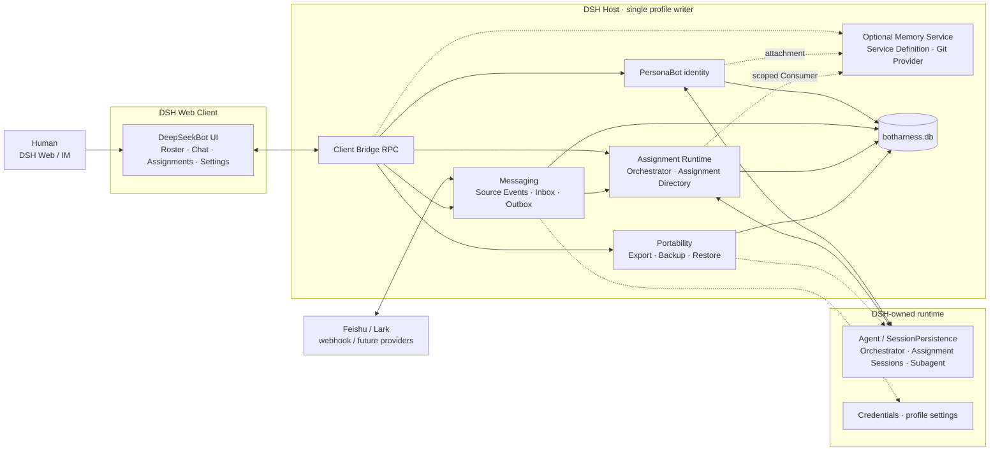
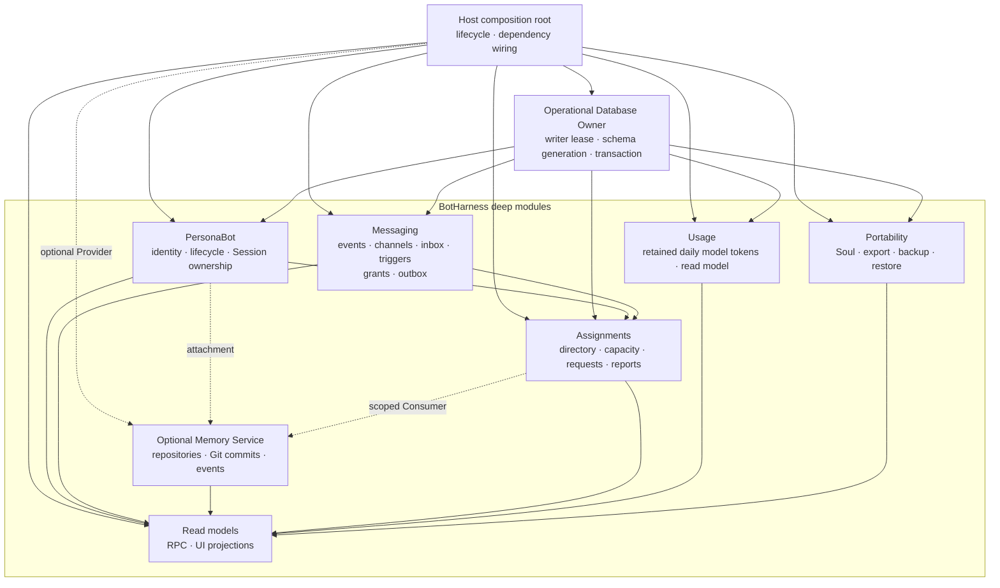
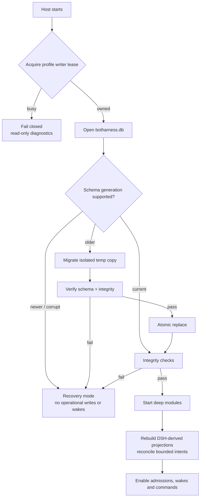
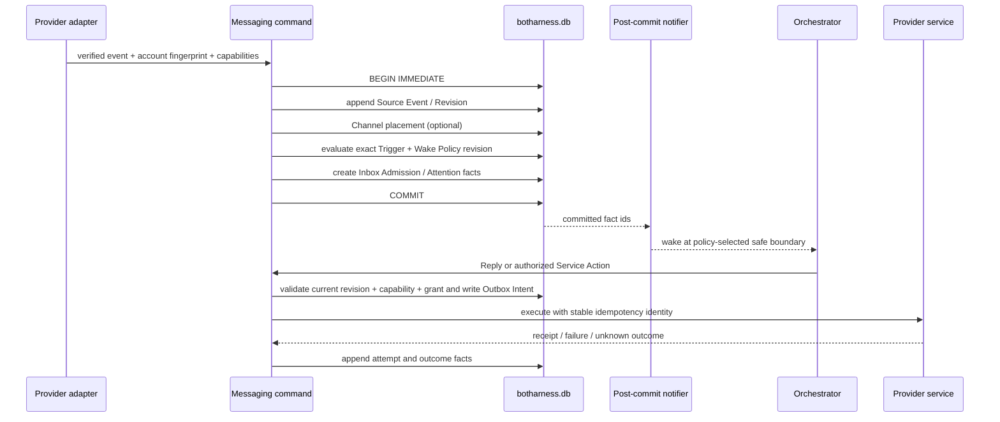
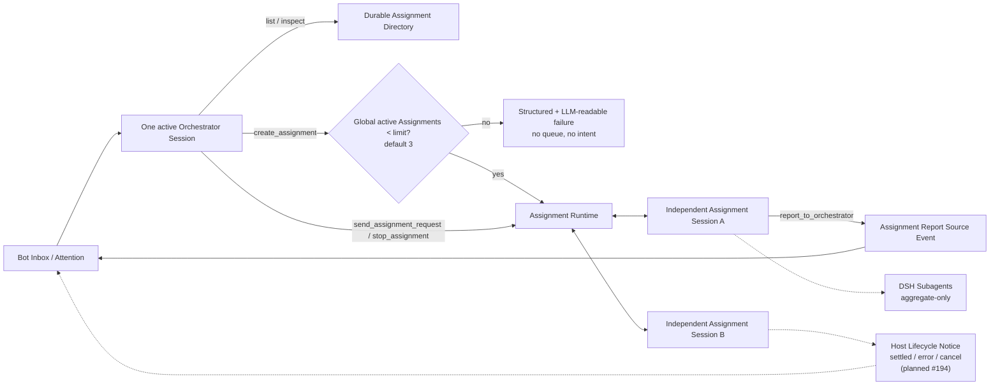
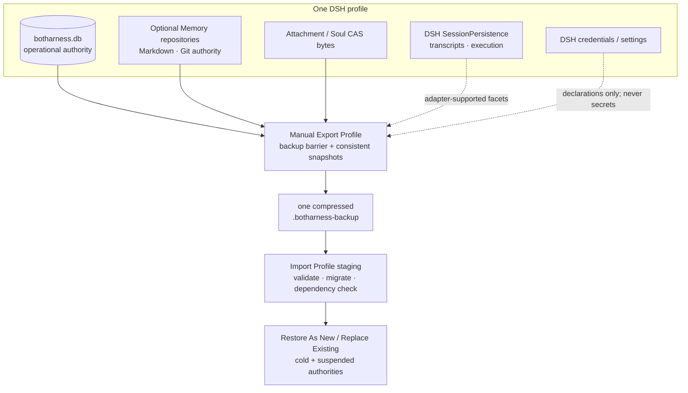

# BotHarness Architecture & Data Flow

<!-- Maintained source, not generated: this is the English translation of `docs/architecture/botharness-architecture.md`. Edit this file (and its `diagrams/en/*.mmd` sources), not `apps/docs`. -->

BotHarness is a plugin layer on top of DSH (DeepSeek Harness) that gives an Agent a persistent product identity: a **PersonaBot**. One Orchestrator Session manages its Inbox and may coordinate multiple independent Assignment Sessions concurrently; Memory is an optional capability and Persona is optional content within it; neither is a prerequisite for chat or execution. DeepSeekBot is the first app, providing the roster, Bot Inbox, Assignment Directory, delegation, and IM integration.

This document describes the target architecture agreed in #71. The M1 registry, M2 Memory MVP, and #66 roster storage exist today; #77 has validated the DSH runtime seams, while explicit Session ownership, Messaging, the Assignment Runtime, the unified operational database, and portability ship incrementally through #79–#81. Updated 2026-09-28.

The current Client UI mounts as a separate `@botharness/ui` Bundle, with source under `packages/client`. RC2 interprets a package ID ending `/client` as an export subpath, so [ADR-0066](../adr/0066-rc2-client-bundle-identity.md) assigns an unambiguous ID. Client HMR hands off only the selected Bot or Channel view; it does not copy the Host-owned PersonaBot, Channel, or message authority.

The rollout stays explicit: #66's `botharness_roster` domain is the current roster authority; #79 establishes only the `botharness.db` owner, and #80 performs the one-way roster and Session-ownership migration. The target diagrams show ownership after that migration, not a present-day dual-write path.

#56 and #137 extend the current roster global slot to `{ pins, hidden?, sectionOrder, topOrder? }`: `pins` canonically orders Channel IDs for both group Channels and PersonaBot DMs, `hidden` omits Channels only from roster navigation while retaining their placement, and `topOrder` mixes section blocks with loose Channels while membership remains owned only by section records. The unary client bridge now has nine arrangement methods, adding `topReorder` and `hiddenSet`; #80 must migrate this order, hidden presentation state, and single-membership invariant into the database without dual writes. After a roster mutation commits, the Host publishes a `roster/changed` live invalidation; other windows re-read the authoritative roster and never receive or replicate an in-progress drag preview.

The collapsed BOT-mode rail reuses this Channel-order read model: pinned items sit above a divider, while the remaining DM and group Channels follow the flattened section/loose order. `botharness/channels` additionally projects an optional `latestMessage` for hover previews; the field is derived from the current Messaging authority and does not become another durable source of truth.

Hidden Channel is application-defined reversible roster presentation state: it disappears from the expanded list, pin grid, search, and collapsed rail without changing the Channel, messages, PersonaBot, Memory, or retained placement. Destructive deletion remains behind ADR-0037's dependency report and separate confirmation boundary (#138).

Current Channel Chat live delivery follows ADR-0054: each committed message is written to the current durable authority before a process-local notification carrying that Channel's monotonic revision. The Host's opaque-cursor timeline exposes latest, older, newer, and around windows; after a reply quote locates old history, ordinary downward scrolling continues through newer pages to the latest committed message. The Client receives committed messages for the selected Channel over authenticated `/api/botharness/stream` SSE. Reconnects replay from the log; a gap re-reads the snapshot. The same connection carries process-only `channel/draft` previews of the Orchestrator's explicit `channel_send` arguments; drafts have no Channel revision, never replay from history, and disappear on commit or abandonment. Human sends use a Client-generated idempotency key: a failed local bubble remains available for restoring its text and attachments to the composer, while a response-loss retry with the same id can produce only one durable append. Ordinary Orchestrator finals and Assignment output are not Channel messages. When #46 migrates Messaging, a database transaction commit replaces the current NDJSON append as the publication boundary.

Channel attachment bytes live in a profile-scoped content-addressed store while messages persist only `{hash,name,mime,size}` references. Upload, inline display, and download use authenticated exact Fetch routes. An Orchestrator reads an image on demand through `channel_read_image` with `channel_id + message_id + hash`; trusted Host code first verifies PersonaBot membership, that the message references the exact hash, a supported image MIME, and the size limit, then commits the verified bytes to the DSH attachment service for model input. Historical images are not injected into every prompt, and the model never receives internal profile paths.

The root [`CONTEXT.md`](/dev/design/context) is the single product glossary. [BotHarness Runtime Architecture](/dev/design/bot-runtime) focuses on how PersonaBot, Bot Inbox, Orchestrator, Assignment, and DSH execution relate. DSH/Cordis terminology and Plugin-development decisions live under `/dsh` and are not redefined here.

## 1 · System context

```mermaid
flowchart LR
  Human["Human<br/>DSH Web / IM"]
  External["Feishu / Lark<br/>webhook / future providers"]

  subgraph Browser["DSH Web Client"]
    UI["DeepSeekBot UI<br/>Roster · Chat · Assignments · Settings"]
  end

  subgraph Host["DSH Host · single profile writer"]
    API["Client Bridge RPC"]
    Identity["PersonaBot identity"]
    Memory["Optional Memory Service<br/>Service Definition · Git Provider"]
    Messaging["Messaging<br/>Source Events · Inbox · Outbox"]
    Assignments["Assignment Runtime<br/>Orchestrator · Assignment Directory"]
    Transfer["Portability<br/>Export · Backup · Restore"]
    DB[("botharness.db")]
  end

  subgraph DSH["DSH-owned runtime"]
    Sessions["Agent / SessionPersistence<br/>Orchestrator · Assignment Sessions · Subagent"]
    Credentials["Credentials · profile settings"]
  end

  Human --> UI
  External <--> Messaging
  UI <--> API
  API --> Identity
  API -.-> Memory
  API --> Messaging
  API --> Assignments
  API --> Transfer
  Identity --> DB
  Identity -. attachment .-> Memory
  Messaging --> DB
  Assignments --> DB
  Transfer --> DB
  Identity <--> Sessions
  Messaging --> Assignments
  Assignments <--> Sessions
  Assignments -. scoped Consumer .-> Memory
  Messaging -.-> Credentials
  Transfer -.-> Sessions
```

The browser reaches Host read models and commands only through RPC. A provider adapter verifies and normalizes events and executes declared capabilities; it does not own the Inbox and cannot wake an Agent directly. DSH remains authoritative for Agent execution, SessionPersistence, Subagents, and credentials. BotHarness does not duplicate that runtime authority.

## 2 · Deep modules and ownership

```mermaid
flowchart TB
  Root["Host composition root<br/>lifecycle · dependency wiring"]
  DB["Operational Database Owner<br/>writer lease · schema generation · transaction"]

  subgraph Modules["BotHarness deep modules"]
    Bots["PersonaBot<br/>identity · lifecycle · Session ownership"]
    Memory["Optional Memory Service<br/>repositories · Git commits · events"]
    Msg["Messaging<br/>events · channels · inbox · triggers<br/>grants · outbox"]
    Assignments["Assignments<br/>directory · capacity · requests · reports"]
    Usage["Usage<br/>retained daily model tokens · read model"]
    Portable["Portability<br/>Soul · export · backup · restore"]
    Views["Read models<br/>RPC · UI projections"]
  end

  Root --> DB
  Root --> Bots
  Root -. optional Provider .-> Memory
  Root --> Msg
  Root --> Assignments
  Root --> Usage
  Root --> Portable
  Root --> Views
  DB --> Bots
  DB --> Msg
  DB --> Assignments
  DB --> Usage
  DB --> Portable
  Bots -. attachment .-> Memory
  Bots --> Assignments
  Msg --> Assignments
  Bots --> Views
  Msg --> Views
  Assignments -. scoped Consumer .-> Memory
  Memory --> Views
  Assignments --> Views
  Usage --> Views
  Portable --> Views
```

| Module      | Owns                                                                                                      | Does not own                                         |
| ----------- | --------------------------------------------------------------------------------------------------------- | ---------------------------------------------------- |
| PersonaBot  | identity, lifecycle, explicit Session ownership                                                           | DSH Session lifecycle, Memory content                |
| Memory      | generic Git-backed repositories, semantic commits, operation events                                       | PersonaBot lifecycle, Inbox, Sessions                |
| Messaging   | Source Events, Channel placement, Inbox Admission, Attention, Trigger/Wake Policy, Service Grants, Outbox | Agent execution, provider credentials                |
| Assignments | Assignment Directory, Assignment Request/Delivery Intent, capacity admission, report/lifecycle routing    | DSH transcripts, Subagent runtime                    |
| Usage       | retained daily tokens per PersonaBot, execution role, and actual model                                    | DSH Session logs, price tables, currency ledger      |
| Portability | coordination for SoulSnapshot, PersonaBot Export, Profile Backup/Restore/Transfer                         | credentials, executable plugins, private DSH formats |
| Read models | queries, pagination, UI-friendly projections                                                              | business facts and write rules                       |

`botharness.db` is the physical transaction host for BotHarness core, not a shared generic repository. Optional Git-backed Providers own Memory content and commits. Each deep module owns its tables and invariants only through its own interfaces; explicit commands and ports coordinate cross-module flows.

Usage is an application-defined retained statistic derived from the actual provider/model and reported token buckets of DSH Session attempts. Trusted Session ownership attributes Orchestrator, Assignment, and DSH Subagent calls to a PersonaBot. A multi-model Turn contributes to each exact route, and absent provider usage is unknown rather than zero. The daily `(bot, day, execution role, provider, model)` aggregate is folded idempotently; deleting an ordinary Session preserves its totals, so reconciliation cannot clear the table or recount surviving evidence over retained history. A thorough PersonaBot purge removes its identifiable usage (ADR-0094, #39).

The first runnable slice (#499) extends the existing bounded 26-week `profileActivity` query with actual provider/model day rows, nullable reported buckets, and a provider-reported total that may remain known when an individual cache bucket is absent. Profile selects a Host-local day and displays observed usage independently of its allowed Model Plan. The per-attempt slice (#503) folds each append-only Assistant settlement independently, uses its successful source or logged dispatch route for failed attempts, and separates trusted Orchestrator, Assignment and Subagent ownership in Profile. Session sequence numbers deduplicate live notifications and replay snapshots; surface replacements do not create usage. Session-deletion retention remains #502.

A deployment-local Model Preset is a reusable template. Applying one copies an independent PersonaBot Model Plan snapshot, so later edits to the template do not alter existing Bots. The plan fixes the Orchestrator provider/model/reasoning effort and defines exact Assignment routes with allowed and default efforts plus a default route. Host execution boundaries validate selections while DSH SessionEvents record actual calls. Orchestrator changes start after the current Turn; existing Assignments keep their routes until explicitly switched under the current plan. A new DSH Subagent inherits an allowed parent route or uses the current Assignment default and informs its parent. Missing or ambiguous routes stop for Human repair. Model configuration travels in an identity-preserving Profile Backup, not in SoulSnapshot or PersonaBot Export (ADR-0027, ADR-0093, #488). Profile will offer a compact preset switch above activity charts and detailed plan editing below them; model usage remains separate from model permission.

The application-defined Memory Service uses a `Consumer → Service Definition → Provider` capability seam. Every PersonaBot has a Git-backed Memory Repository and its Orchestrator Session uses that repository as its fixed working directory. The checked-out working-tree files are current Memory immediately, whether they are Markdown, code, or binary. The Agent reads and changes the repository through native file, search, Shell, and Git capabilities; there are no model-visible Memory CRUD tools. PersonaBot creation offers empty Memory or an HTTPS/SSH Git import: the Host checks Git, clones into staging with its existing credentials, and creates the Bot only after a successful clone; the checked-out branch and files become Memory immediately (#298). The creation page never collects private repository credentials. An existing Bot integrates a remote with native Git. If incorporating an external repository requires a choice between merge, replacement, or another destination, the Orchestrator uses DSH's native Ask Question seam. Git governs branches, merges, and conflicts. A switch takes effect in the same Session as soon as Git changes the worktree; the Session-frozen Persona prompt does not change retroactively (ADR-0060). Cross-device continuity reuses the same path: on request the Orchestrator syncs with a remote the owner configured using native Git, a new device creates a new PersonaBot from a Git URL, and owners who do not operate Git use PersonaBot Export / Profile Backup rather than a Host-owned sync service or one-click sync (ADR-0084).

Memory Service owns repository identity and lifecycle, trusted Session ownership, bounded UI queries, and audit/recovery checkpoints. After a successful turn it may record the observed HEAD with the trusted Source Event and Session actor, but it never stages, commits, or hides working-tree files as part of observation. The Git repository is the authority for current files and history; the database ledger is an auxiliary record. The Channel Memory list reads the current worktree, renders text with a bounded preview, lists binary files without text editing, and shows all local Git branches and reachable commits in the graph. Human text saves compare the current HEAD and make an explicit Git commit. Memory file queries block `.git` control paths and symlink escapes, without restricting the file types Git may store. Legacy repair archives and checkpoint records remain available for compatibility; a normal uncommitted edit does not block the next turn or require repair (ADR-0068).

Memory's current-file actions follow [ADR-0100](../adr/0100-file-open-actions-target-real-host-files.md) and #574. Clicking the displayed Memory Repository path opens a menu; current tree rows expose context menus, keyboard entry and a compact More button, and the reader offers a path/menu action. Ordinary file clicks still select the built-in reader; directory clicks still expand. The application-defined Memory Service resolves a PersonaBot-relative path on the Host and refuses `.git`, traversal, missing targets and symlink escapes, including links into `.git`. The Client consumes DSH's public directory catalog/open routes and Session Remote file association/open/reveal capabilities through the existing API Gateway seam. Only detected applications appear, with no custom executable or persistent preference.

Authorized ordinary Workspace paths reuse the same Client menu (#575). The Client submits only the PersonaBot slug and Grant ID; the application-defined Workspace Grant Store's `requireActive` checks ownership, revocation and the current DSH Workspace Registry identity on the Host and resolves the canonical directory again before opening. Displayed paths carry no authority. Missing, moved, unregistered or invalid Grants fail explicitly. Menus list only detected Host directory applications, with Copy Host path alone when native opening is unavailable. Opening does not change Grants, Session cwd or access, create Sessions, or offer directory downloads.

Native actions operate on the serving Host computer; Tailscale and Cloudflare Tunnel provide connectivity without proving browser co-location. Menus identify the Host, explain unavailable capability, and offer Copy Host path. Current files also offer authenticated full-byte download to the browser device, including binary and oversized files whose internal preview is bounded; downloaded edits do not automatically return to the Host. This slice excludes directory downloads and historical exports. Workspace and message-file owners remain subsequent slices, not generic arbitrary-path callers.

The current attachment paragraphs above describe the hash-addressed implementation. ADR-0100's accepted target makes each independent upload a real Host destination file with its safe filename and extension, independent identity and current mutable bytes. Explicit reuse of one identity shares edits; equal-byte independent uploads do not. Source Event envelopes and file references remain immutable while future reads use the file's current content. External saves do not create attachment revisions, archives, Inbox admissions or Bot wakes. Migration must establish those independent files before in-place editor actions are offered; directly editing a shared CAS object does not implement the target. Memory Git history and other CAS data retain their own semantics.

## 3 · Host boot, migration, and recovery

```mermaid
flowchart TD
  Start["Host starts"] --> Lease{"Acquire profile writer lease"}
  Lease -- "busy" --> ReadOnly["Fail closed<br/>read-only diagnostics"]
  Lease -- "owned" --> Open["Open botharness.db"]
  Open --> Gen{"Schema generation supported?"}
  Gen -- "newer / corrupt" --> Recovery["Recovery mode<br/>no operational writes or wakes"]
  Gen -- "current" --> Integrity["Integrity checks"]
  Gen -- "older" --> Copy["Migrate isolated temp copy"]
  Copy --> Verify["Verify schema + integrity"]
  Verify -- "fail" --> Recovery
  Verify -- "pass" --> Activate["Atomic replace"]
  Activate --> Integrity
  Integrity -- "fail" --> Recovery
  Integrity -- "pass" --> Modules["Start deep modules"]
  Modules --> Rebuild["Rebuild DSH-derived projections<br/>reconcile bounded intents"]
  Rebuild --> Ready["Enable admissions, wakes and commands"]
```

Only one BotHarness writer may own a DSH profile at a time. Module migrations combine into one monotonically increasing Schema Generation. Migration runs against a temporary copy and atomically replaces the active database only after validation. Open, migration, or integrity failure enters recovery mode; the Host never falls back to NDJSON, a storage domain, or in-memory writes.

## 4 · Messaging transaction and external side effects

```mermaid
sequenceDiagram
  participant P as Provider adapter
  participant M as Messaging command
  participant DB as botharness.db
  participant N as Post-commit notifier
  participant O as Orchestrator
  participant X as Provider service

  P->>M: verified event + account fingerprint + capabilities
  M->>DB: BEGIN IMMEDIATE
  M->>DB: append Source Event / Revision
  M->>DB: Channel placement (optional)
  M->>DB: evaluate exact Trigger + Wake Policy revision
  M->>DB: create Inbox Admission / Attention facts
  M->>DB: COMMIT
  DB-->>N: committed fact ids
  N-->>O: wake at policy-selected safe boundary
  O->>M: Reply or authorized Service Action
  M->>DB: validate current revision + capability + grant and write Outbox Intent
  M->>X: execute with stable idempotency identity
  X-->>M: receipt / failure / unknown outcome
  M->>DB: append attempt and outcome facts
```

A Source Event is the sole authority for content; Channels and Inboxes hold relationships only. A Reply follows the trusted Reply Route so the Host selects the source provider. A proactive post is a Service Action and requires both Provider Capability and a Human Service Grant. A SQLite transaction covers local facts only. External effects use an Outbox Intent, a stable idempotency identity, and bounded reconciliation without claiming exactly-once delivery. An outcome that cannot be proven becomes `unknown-outcome` for Human resolution.

Wake Policy decides when an Orchestrator observes new attention: at the safe boundary after the current step, after the current turn, or by starting a new turn while idle. Ordinary external messages do not interrupt a running model/tool step. Only a DSH-supported and policy-authorized control path may steer execution. Ready attention is consumed by turn, not by event: while a turn runs, arrivals mark a ready set, and one harvest turn consumes it when the turn ends or the Bot is idle; only direct mentions and DMs steer into the running turn (ADR-0077). Wake handling follows the Source class rather than the platform: external providers normalize into Source Events at the Bridge, and the runtime branches only on Source class and admission reason (ADR-0075).

### Activity Center target design (ADR-0098, ADR-0099)

The Bot-mode Activity Center has Overview and personal Human Inbox views. The delivered Human Inbox projects live questions, approvals, Group join and Workspace Grant requests, waiting or blocked Assignments, repair needs, and informational completion reports from their owning facts (ADR-0071). The #546 slice folds Group and Bot DM unread into one row per Channel from committed placements and the local Human's durable read position. The sidebar entry counts distinct unread Channel Source Events and separately indicates unresolved actions. Expanding a row leaves the read position alone; opening its exact message or explicitly marking its captured message read advances the canonical position. Human mentions, inline responses to live action cards with short expandable context, and handled history follow in narrow slices. Native Channels have no sub-Thread conversation yet, so unread is folded by Channel. The current slice supports one local Human while read state is addressed by Human identity.

The #547 slice lets the local Human inspect a captured unread Group or Bot DM message with nearby expandable context and reply inside Human Inbox. The Channel owner limits the timeline to messages visible to that Human and validates the reply target again at send time. Inbox reuses the existing `channelSend` path and commits one canonical Human Source Event with the source message reference. Its draft and retry identity are transient Client state; Inbox refresh or a failed send keeps the draft, while retrying an unchanged draft reuses the same message identity. Viewing the concrete source advances its canonical read position; opening the unread summary does not. The source and confirmed reply each retain exact Channel navigation.

The #548 slice projects “Replies to me” from Group Source Events and their exact same-Channel `replyTo` placement. A Bot reply qualifies only when both it and the original local-Human message are inside that Human's joined visibility boundary. Source Event IDs give stable row identities; recent-first pagination and Bot/Channel filters use the same query. Read replies remain browseable with unread status derived from the canonical read position. Personal replies are excluded from “Other unread” Channel summaries, while the entry still counts all distinct unread Source Events. A second Client window and Host restart reconstruct the same projection. Inline replies and exact navigation reuse #547; context lists author, avatar, time and the reply target in original chronological order, with bounded expandable neighbors, side-by-side panes on wide screens and stacked panes on narrow screens.

Overview (#541) shows unresolved explicit Human actions, each PersonaBot's live state, and currently executing Orchestrator and Assignment Sessions. Selecting a Bot opens its DM; selecting a Session leaves Bot mode and opens that exact native DSH Session. Waiting, blocked, and idle Sessions are not counted as active. Today's committed Channel message chart groups by Channel, splits Human and Bot senders, and expands to per-sender counts. Global and per-Bot token usage has a seven-day trend without guessed Channel attribution (#34, #39); Memory shows seven-day accepted change counts and a separate uncommitted indicator. The view consumes the owning Channel activity (#424), usage, Memory, and Session read models rather than storing another authority.

In a Group, the Human-only `@所有 Bot` shortcut (#542) resolves the active Bot members of that Channel at send time. One Channel Source Event carries ordinary direct mentions for each target, producing separate Inbox Admissions and the same attention and Wake Policy behavior as individually mentioning those Bots. The Human sees the recipient count before sending. Bots cannot use the shortcut and no Bot outside the Channel is included.

### Bot collaboration through Channels (ADR-0065)

A Bot-to-Bot DM is a real `dm` Channel with two PersonaBot participants. Bot A sends as its trusted Actor identity derived from Session ownership; Messaging commits one Source Event, Channel placement, and B's Inbox Admission in the same authority. The Bot-hop guard bounds loops, and A does not receive its own output. A Human may open this default-hidden Channel read-only without becoming a third member. Every committed A send to a non-Human DM Channel adds a centered action chip to Human–A DM. The chip points to the send and inspectable conversation rather than copying the message body.

Selecting `@B` in Human–A DM supplies B's stable ID and bounded description to A's prompt; it neither wakes B nor changes DM membership. Only a later explicit A-to-B send reaches B's Inbox. In a Group Channel, a Human or joined Bot may `@` joined Bots; one Source Event yields independent Inbox Admissions for the recipients. A Bot may create a Group Channel and invite other Bots; an invitation grants no membership before acceptance, and Group invitation auto-accept defaults on in Bot mode, where the Host accepts on the invited Bot's behalf without a wake (ADR-0073). A Bot's per-Channel attention preference — all, digest (the default), mentions, or silent — belongs to the Bot, which may also tune its digest count and interval; the Human can override it, and the Bot manages the rest of its attention policy the same way (ADR-0074, ADR-0076). The Bot creator can manage Bot members and Group settings, while the Human retains override authority and exclusive whole-Channel deletion. #254 is the first Human-authored Group mention slice; #278 organizes the later collaboration tracers.

The five application-defined attention Tools consume the existing per-Bot source policy and Channel preference Providers. `source_attention_set` defaults omitted `sourceClass` to `assignment-report`, accepting only `conditional|immediate` without digest arguments; `group-ordinary` accepts `immediate|digest|mentions|silent`, with digest arguments accepted only for `digest`. Count and interval use integer schemas with Host-enforced bounds 1–100 and 1–3600 seconds; omitted digest values preserve effective settings. Per-Channel `group_attention_set` retains optional digest settings in every mode. Source reset restores the built-in rule without clearing Channel overrides or changing historical Admissions. Read/edit/reset results preserve effective values, revision, last actor/time and the bounded seven-day source wake count; invalid combinations fail before policy writes.

The Orchestrator's application-defined channel_list query derives the PersonaBot identity from Session ownership and returns only its joined Group, Human DM, and Bot DM Channels. It filters by name, type, or stable member Bot IDs with bounded cursor pages and current member identities. The result is an authorized Consumer of canonical Channel records, not a second membership directory. A Bot may use a returned stable Channel ID in channel_send, which rechecks membership at send time. The application-defined channel_read query checks membership and filters the full ordered history of one Channel by text, author, and date before returning a bounded cursor page; reply previews still resolve from their original messages.

In the Group sidebar, Members lists only current members. Group management owns the Human controls for a bounded, Host-validated raster avatar and Group name, Human-origin invitations, member removal, pending join decisions, and whole-Channel disbanding. Human invitations use the same Channel invitation fact and Bot Inbox Admission as Bot invitations, with a distinct Human actor; the invited Bot gains Group access only after acceptance.

The application-defined `group_rename` and `group_remove_member` Tools return a compact acknowledgement of the committed Channel: `channelId`, current `name`, and `outcome` (`renamed` or `member-removed`); removal also includes `memberBotId`. These acknowledgements do not contain avatars, invitation/join history, membership lists, or attention policies. The owning Host command still checks the current Bot creator and membership and commits through the Channel authority; the Human bridge continues to return the full presentation record. A missing rename store result is an explicit Tool failure. Use `channel_list` for current joined Channels and member identities rather than treating a command acknowledgement as a Group snapshot.

`group_create` acknowledges the new `channelId`, current `name`, and `outcome: created`. `group_invite_bot` acknowledges the checked `channelId`, `inviteId`, `inviteeBotId`, and the owning command's actual invitation status as `outcome`; it does not assume every result is pending. `group_invite_respond` returns the same references and actual decided status, plus the current Group `name`. These acknowledgements omit internal identity-version timestamps and unrelated Channel presentation state. A declined invitation grants no membership, read, or send authority; repeated matching decisions preserve the same references, while conflicting, stale, cancelled, or unauthorized decisions retain the owning command's errors.

The application-defined Channel query Tools enumerate `type: group|dm`, `scope: channel|joined`, and `author_kind: human|bot|bridged|system`, while the owning Host retains runtime defenses. An exact `channel_list(channel_id=...)` lookup with no accessible match after all filters returns `{channels: [], outcome: no-accessible-match}`; unknown, inaccessible, and filter-mismatched targets share this result without disclosing existence, while ordinary empty searches remain `{channels: []}`. `channel_read(scope=joined)` requires nonblank `text` and forbids `channel_id`; `author_bot_id` requires omitted or `bot` author kind. Date bounds are inclusive: a `YYYY-MM-DD` lower bound starts at UTC midnight and an upper bound covers the whole UTC day; unparseable or reversed ranges fail. Cursors stay bound to their filters, and joined-search cursors also bind the current membership set; reading observes only returned messages. Both Tools preserve numeric `limit` compatibility: default 20, floor then clamp to 1–100 for list or 1–200 for read. The pinned DSH 0.2.0-rc.1 converter supports integer but rejects minimum/maximum, so this slice does not tighten legacy fractional or out-of-range inputs.

The model-facing `channel_read` Consumer uses the Host-owned actionable projection and a 12,000 UTF-16 code-unit budget for the complete serialized result before exact-ID observation (ADR-0102). It omits Human receipts, deliveries and Channel revisions while preserving complete bodies, replies, trusted attachments and action references. Budget omissions remain pending and expose filter-bound continuation; an oversized first message exposes a `message_id` full-content path. Bounded JSON fragments bind the current projection hash and offset, recheck membership, and join consumption only after their complete contiguous content reaches the same active turn. Human Channel/Inbox records and bridge presentation remain unchanged.

### First outbound tracer: explicit Profile authorization

PersonaBot Profile selects an authenticated IM account and a saved target through the existing Typert/API Gateway seam; a Human explicitly creates a Binding and single-target proactive Grant. An application-defined Messaging Provider Registration belongs to its Consumer Fiber. Binding, Grant and Outbox facts share `botharness.db`. Acceptance and execution revalidate the active Bot, Grant revision, live Registration, authenticated account fingerprint and target content digest. Changed accounts or destinations require new authorization. Intent and attempt-start commit before the provider call; results mean provider accepted, definite failure or unknown outcome. Restart never replays pending or in-flight work.

[ADR-0101](../adr/0101-external-grants-require-authenticated-accounts-and-checked-targets.md) requires a compatible public `describeBot` / `sendChecked` contract. Released dsh-im 4.32.0 lacks it and remains disabled; isolated verification uses an explicitly identified, unreleased source proposal. Native dsh-im settings remain available. Inbound ownership and automatic replies are deferred.

## 5 · Orchestrator and Assignment control plane

The Human does not create or select execution Conversations. The Human–PersonaBot DM is the Human's direct entry to that Bot: a message becomes a Source Event, enters the Bot Inbox, and reaches the Orchestrator, which either replies directly or creates, reuses, and manages several Assignment Sessions within authorization and capacity. The right Sessions view projects only DSH root Sessions explicitly owned by that PersonaBot, including Orchestrator and Assignment but not Subagents. Session Ownership supplies membership and role; the native DSH Session catalog supplies title, workspace, and live running state. Cwd never implies ownership (ADR-0072).

A Workspace Grant is durable, application-defined PersonaBot authority for one resolved directory. A Human adds an existing Host folder through the DSH picker or an absolute path entry, validated by the Workspace registry, then grants it to the PersonaBot. The Orchestrator keeps its Memory Repository as cwd, may read and write Memory, and may read every currently active granted project folder; it cannot directly write project folders or issue Grants. Each Assignment selects one active Grant and persists its Grant ID, Workspace ID, single primary cwd, and permission snapshot; it may read and write only that selected folder. Revocation stops future file access for both roles and future Assignment create/request/resume/wake under that Grant; a new Grant does not revive an old Session. The right pane shows Memory as a fixed internal root and project folders as addable, revocable access rows; revocation does not delete DSH registrations or files. Native DSH workspace-write limits some writes but does not isolate reads and may allow temp writes, so BotHarness needs one enforcing file and execution Provider across native file, search, Shell, and terminal operations, failing closed when it cannot enforce the roots (ADR-0067). The current #233 tracer implements Assignment admission and safe write defaults, not this read boundary, and must not be presented as folder isolation.

When no active Grant fits the requested project work, the Orchestrator can emit a durable authorization request card in its DM through a dedicated tool. This tool can request access but cannot issue a Grant or pre-create an Assignment. The Human chooses a Host folder on the card; the existing Workspace Grant authority validates and persists access, and the Human’s explicit DM reply becomes a Source Event that wakes the same Orchestrator Session. The Orchestrator lists active Grants again before creating the Assignment under the selected Grant. The card and the Grant are separate durable facts. Ordinary Assignment Asks still reach the Orchestrator first; forwarding native DSH questions and permissions is a later slice.

The right region is the Channel sidebar (ADR-0053): a group Channel shows its membership and Channel management entries, and a Human–PersonaBot DM shows that PersonaBot's entries such as Sessions, Memory, Bot Inbox, and Computer. Entries register through one ordered, collapsible seam, and unavailable entries are absent rather than placeholders. Chat is always the center Channel body. Sessions defaults to a flat Current view with the Orchestrator and active or attention-needing Assignments; All includes stopped history. Humans may use a collapsible By workspace layout; each PersonaBot's range, layout and group collapse preferences stay in this browser. A row opens its native DSH Session through `UiWorkspace.openSession`, without a duplicate read-only Assignment detail. An owned root Session has native header and Session-menu actions to return to its PersonaBot DM; its avatar appears before the idle native sidebar title, while DSH status and Schedule marks take priority. The Assignment Directory still owns Grant, continuity, report, stop, concurrency, and audit facts.

Computer is a profile-scoped shared resource (ADR-0051): the Computer Provider owns its runtime (container, viewer, transfer), and a Computer Tool Provider registered on the official `ctx.computerUse` seam owns its tool surface (ADR-0079). Only when the Human turns on a PersonaBot's **Computer Access** are the curated observe/act/verify tools and their guidance injected into that PersonaBot's Orchestrator and Assignment session scopes; the first action of a session asks the Human once through native approval (a profile switch can auto-allow), and every observation and action is recorded as a redacted **Computer Audit** entry in `logs.db` (ADR-0080). The pinned Cua Driver inside the container is reached over stdio MCP through `docker exec`; a stopped Computer surfaces a readable tool error and never threatens Host boot.

Browser is likewise a profile-scoped shared resource (ADR-0089): the optional `@botharness/browser` bundle runs managed **Bot Browsers** (one instance per assigned browser profile; the default profile stays shared, named profiles launch on demand and idle-stop independently — ADR-0096) — preferring the machine's installed Chrome/Edge with a dedicated profile under `$DSH_HOME/botharness/browser`, installing a version-pinned Chrome for Testing under `$DSH_HOME/botharness/browser-chromium` when no browser is available, and keeping its CDP endpoint on loopback, where the Human signs in once. Only when the Human turns on a PersonaBot's **Browser Access** are the tools and guidance injected into that PersonaBot's Orchestrator and Assignment session scopes; the read-only `browser_open` and `browser_observe` ship first, the first action of a session rides the same native approval as the Computer (a profile switch can auto-allow), and every observation and action is recorded as a redacted **Browser Audit** entry in `logs.db`; each Bot owns its **Bot Tabs** (background tabs in the shared window; tab ownership is a visibility scope, not a security boundary — ADR-0095). The Browser entry shows the Bot's tab list with a focused preview and offers `browser_screenshot` (model attachment only, never the audit) plus a Human **Browser Pause** that stops that Bot's actions and model screenshots while the Human can always operate the window directly; the interaction tools (click, type, press_key, scroll, wait) ship with stale-ref re-observe semantics, and `browser_tabs` (list, open, select, close) keeps several background tabs per Bot while idle windows close without stopping the browser. A stopped browser surfaces a readable tool error; the container target and profile export stay later phases.

The authenticated Human Open Bot Browser action goes through the same process-local per-Bot tab Provider: it reveals the live owned preview (or current tab), restores a minimized window, and preserves the Bot’s current pointer when the Human previews another tab. Closed owned targets are pruned; a live owned fallback is preferred, otherwise one blank Human tab is created and adopted. Repeated Human opens share the per-Bot operation queue and reuse that tab; foreign tabs in a shared browser profile are never revealed or adopted. Human foreground focus remains separate from background Agent operations.

Temporarily disabling Browser Access revokes the Agent-scope tool registrations and refuses queued actions while preserving the Provider’s process-local owned/current tabs; re-enabling restores tools against the same work page. Explicit stop/reset clears this bookkeeping; this continuity applies within the same browser profile, and no ownership is persisted across Host restarts.

Changing the assigned browser profile calls the existing Browser Provider reset command through its application-defined Host service. The switching Bot loses its old process-local current/owned tab records and Pause state before using the newly selected runtime; Browser Access and Session authorization remain separate. Other Bots’ ownership and the old profile’s browser data remain intact. The reset records a bounded lifecycle diagnostic and does not persist or adopt old targets when switching back.

```mermaid
flowchart LR
  Inbox["Bot Inbox / Attention"] --> O["One active Orchestrator Session"]
  O -->|"list / inspect"| Dir["Durable Assignment Directory"]
  O -->|"create_assignment"| Gate{"Global active Assignments < limit?<br/>default 3"}
  Gate -- "no" --> Error["Structured + LLM-readable failure<br/>no queue, no intent"]
  Gate -- "yes" --> Runtime["Assignment Runtime"]
  O -->|"send_assignment_request / stop_assignment"| Runtime
  Runtime <--> W1["Independent Assignment Session A"]
  Runtime <--> W2["Independent Assignment Session B"]
  W1 -->|"report_to_orchestrator"| Report["Assignment Report Source Event"]
  W2 -.-> Notice["Host Lifecycle Notice<br/>settled / error / cancel<br/>(planned #194)"]
  Report --> Inbox
  Notice -.-> Inbox
  W1 -.-> Sub["DSH Subagents<br/>aggregate-only"]
```

An Assignment Session is an independent DSH root whose canonical identity is the DSH `sessionId`; a Continuity Key is only a PersonaBot-local alias. The Orchestrator manages Assignments through five tools: `list_assignments`, `inspect_assignment`, `create_assignment`, `send_assignment_request`, and `stop_assignment`. An Assignment Agent can report only through `report_to_orchestrator`. v1 has no direct Assignment-to-Assignment messaging, broadcast, or waiting queue.

The current `stop_assignment` uses DSH `Agent.cancel({ kind: "user" })` to abort the active turn and clear queued input. BotHarness persists a stopping state first, then a stopped state after the Agent is quiescent. A stopped Assignment rejects requests and late reports; its Continuity Key can start a new Session. Cancellation retains DSH Session history. Independent Host Lifecycle Notices and Attention/digest remain later #194 slices.

The Assignment Request modes `context-update`, `next-step`, and `next-turn` map to verified DSH inject, steer, and followup seams. An ordinary request never cancels the current step. Across the SQLite/DSH boundary BotHarness retains only a minimal Assignment Delivery Intent and performs bounded restart reconciliation. Ambiguity becomes `needs-repair`; it does not grow into a general workflow engine.

## 6 · Persistence, export, and restore boundaries

```mermaid
flowchart TB
  subgraph Profile["One DSH profile"]
    DB[("botharness.db<br/>operational authority")]
    Files["Optional Memory repositories<br/>Markdown · Git authority"]
    CAS["Attachment / Soul CAS bytes"]
    DSHS["DSH SessionPersistence<br/>transcripts · execution"]
    Creds["DSH credentials / settings"]
  end

  Barrier["Manual Export Profile<br/>backup barrier + consistent snapshots"]
  Package["one compressed<br/>.botharness-backup"]
  Stage["Import Profile staging<br/>validate · migrate · dependency check"]
  Target["Restore As New / Replace Existing<br/>cold + suspended authorities"]

  DB --> Barrier
  Files --> Barrier
  CAS --> Barrier
  DSHS -.->|"adapter-supported facets"| Barrier
  Creds -.->|"declarations only; never secrets"| Barrier
  Barrier --> Package
  Package --> Stage
  Stage --> Target
```

| Data                           | Authority                            | Portability                                                              |
| ------------------------------ | ------------------------------------ | ------------------------------------------------------------------------ |
| operational facts              | `$DSH_HOME/botharness/botharness.db` | consistent SQLite snapshot in a manual profile backup                    |
| optional Memory repositories   | Git-backed Memory Provider           | selected SoulSnapshot / PersonaBot Export / profile backup               |
| attachments / Soul bytes       | content-addressed files              | dependency-closed selected bytes                                         |
| Session transcript / execution | DSH SessionPersistence               | only through a verified DSH export adapter; otherwise explicitly omitted |
| credentials and DSH settings   | DSH services                         | never copied; restore creates suspended rebind requests                  |

v1 has only two backup actions: Export Profile produces one self-contained `.botharness-backup`, and Import Profile selects one file. There is no automatic backup, scheduler, catalog, retention, or incremental chain. Restore always validates in isolated staging. A restored PersonaBot stays cold, provider authorities stay suspended, and Workspace/model/plugin dependencies must be resolved on the target before a Human explicitly activates it.

## 7 · Critical boundaries

- Normal runtime uses explicit Session ownership only. `cwd` may be a migration or repair hint but never decides PersonaBot identity.
- DSH Session state is authoritative for execution. BotHarness projects activity/last-run facts and keeps a semantic Assignment Report separate from a Host Lifecycle Notice.
- Provider capability is not authorization. Discovering a Feishu channel never grants permission to post into it.
- The UI never reads files or the database directly and does not derive business state. It consumes Host read models and sends commands back to the owning module.
- Archiving a PersonaBot first closes admissions, wakes, and external actions, then stops its Orchestrator, Assignment Sessions, and owned Subagents. Purge is a separate destructive action.
- Browser and Host are separate Cordis applications. Host services are never injected across processes; all calls use the `/api` client bridge.
- Memory cross-device sync is the Orchestrator's native Git behavior, not a Host service. BotHarness holds no remote or credentials and offers no one-click sync; owners who do not operate Git migrate through Portability (ADR-0084).
- Roadmap Project #1 stays private. Docs sync reads only explicit `In Progress` and Artifact values with `read:project`, then commits public JSON only after a fail-closed allowlist projection. Project notes, private items, assignees, backlog, and ETA never cross this publication boundary.

## 8 · Implementation order and parallel work

1. #77 validates the pinned DSH Agent/SessionPersistence/Subagent seams while #79 builds the operational database owner. These can proceed in parallel.
2. #80 implements explicit Session ownership and the activity projection after #77 and #79.
3. After #77, #79, and #80, #81 first delivers the minimal DM → Orchestrator → Assignment → report → DM-reply tracer bullet together with a Human-testable Assignment list/detail; later Assignment coordination in #47 expands only after that slice passes.
4. #78 can research the Feishu provider contract in parallel, but it gates adapter implementation in #48.
5. #74 advances Memory as a separate optional-Provider tracer bullet only after that main path passes; #75 and #76 remain focused design/grill tracks so they do not block the first experiential loop.

## 9 · Maintenance

- When module structure, data flow, transaction boundaries, or authority changes, update this file, its Chinese mirror, and `docs/architecture/diagrams/*.mmd`.
- Run `pnpm diagrams` and commit the light/dark SVGs. `scripts/sync-docs.mjs` publishes this source and those diagrams to `apps/docs`.
- Companion sources: BotHarness Product Context in `CONTEXT.md`, with trade-offs and rationale in `docs/adr/`. The platform spec and app PRD are archived working drafts rather than parallel design authorities.
