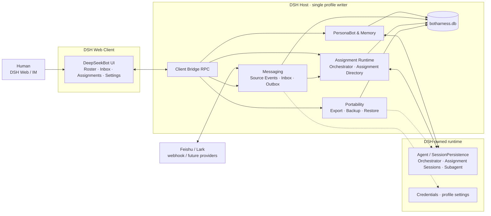
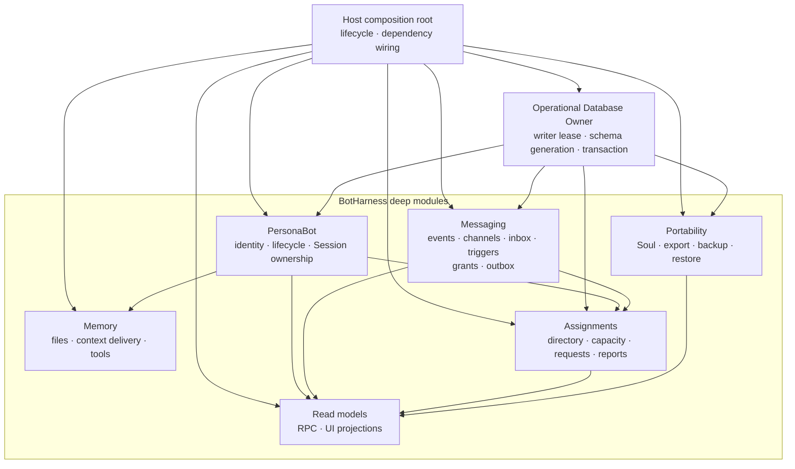
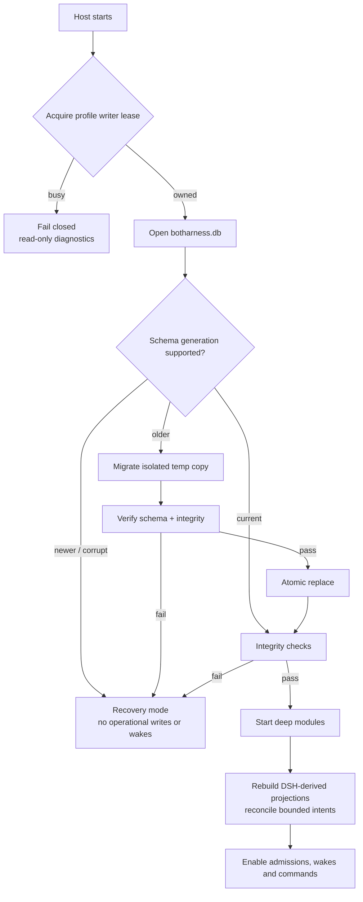
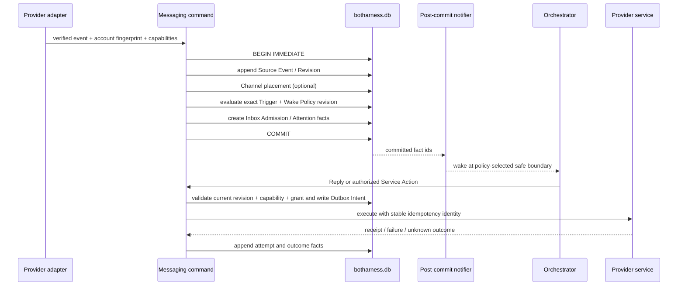
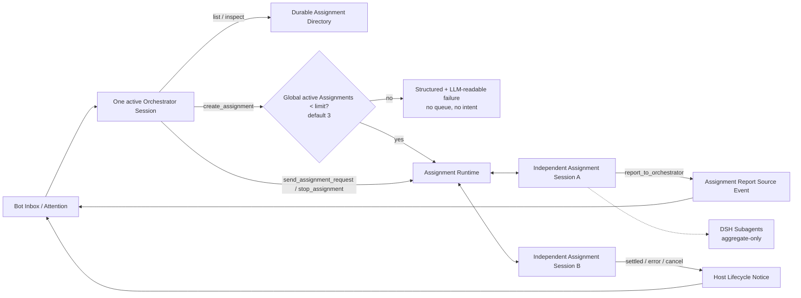
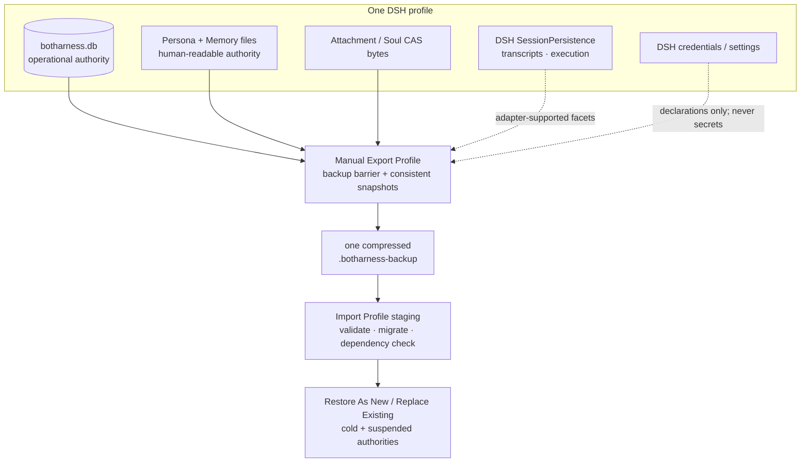

# BotHarness 架构与数据流

BotHarness 是 DSH（DeepSeek Harness）之上的插件层，给 Agent 持久身份：**PersonaBot**。PersonaBot 的人格与 Memory 跨 Session 延续；它用一个 Orchestrator Session 管理 Inbox，并可同时管理多个独立 Assignment Session。DeepSeekBot 是首个应用，提供 roster、Bot Inbox、Assignment Directory、委派和 IM 接入。

本文描述 #71 确认后的目标架构。M1 registry、M2 Memory 与 #66 roster storage 已实现；#77 已验证 DSH runtime seams，显式 Session ownership、Messaging、Assignment Runtime、统一 operational database 和可移植性按 #79–#81 分阶段落地。更新：2026-09-20。

产品术语以根目录 [`CONTEXT.md`](/zh/dev/design/context) 为唯一词表；[BotHarness Runtime 架构](/zh/dev/design/bot-runtime) 单独展开 PersonaBot、Bot Inbox、Orchestrator、Assignment 与 DSH execution 的关系。DSH/Cordis 本身的术语和 Plugin 开发决策位于 `/zh/dsh`，不在这里重复定义。

迁移阶段保持可验证：#66 的 `botharness_roster` 是当前 roster 权威；#79 只先建立 `botharness.db` owner，#80 才将 roster 与 Session ownership 单向迁入。目标图表示迁移完成后的所有权，不表示运行时现在已经双写两套存储。

#56 extends the current roster global slot to `{ pins, sectionOrder, topOrder? }`: `topOrder` mixes section blocks with loose Channels while membership remains owned only by section records. The unary client bridge now has eight arrangement methods, adding `topReorder`; #80 must migrate this order and its single-membership invariant into the database without dual writes.

## 1 · 系统上下文

浏览器只通过 RPC 访问 Host read models 和 commands。Provider adapter 只负责验证、规范化和执行能力；它不拥有 Inbox，也不能直接唤醒 Agent。DSH 继续拥有 Agent 执行、SessionPersistence、Subagent 与凭据；BotHarness 不复制这些 runtime 权威。

## 2 · Deep modules 与所有权

| Module      | Owns                                                                                                    | Does not own                          |
| ----------- | ------------------------------------------------------------------------------------------------------- | ------------------------------------- |
| PersonaBot  | Host-owned ID、display name / role badges、lifecycle、explicit Session ownership                        | DSH Session lifecycle、Memory 内容    |
| Memory      | `PERSONA.md`、Memory files、context assembly contract                                                   | Inbox 内容、自动蒸馏                  |
| Messaging   | Source Event、Channel placement、Inbox Admission、Attention、Trigger/Wake Policy、Service Grant、Outbox | Agent execution、provider credentials |
| Assignments | Assignment Directory、Assignment Request/Delivery Intent、capacity admission、report/lifecycle routing  | DSH transcript、Subagent runtime      |
| Portability | SoulSnapshot、PersonaBot Export、Profile Backup/Restore/Transfer 协调                                   | credentials、可执行插件、DSH 私有格式 |
| Read models | 查询、分页、UI-friendly projection                                                                      | 业务事实与写入规则                    |

`botharness.db` 是一个物理事务宿主，不是共享的 generic repository。每个 deep module 只通过自己的接口拥有表和不变量；跨模块流程由显式 command/port 协调。

## 3 · Host 启动、迁移与 recovery

一个 DSH profile 同时只允许一个 BotHarness writer。所有 module migration 合并成单调递增的 Schema Generation；迁移只在临时副本上完成，校验后原子替换。打开、迁移或完整性检查失败时进入 recovery mode，不回退到 NDJSON、storage domain 或内存写入。

## 4 · Messaging 事务与外部副作用

Source Event 是内容唯一权威；Channel 和 Inbox 都只保存关系。Reply 使用可信 Reply Route 自动选择来源 provider；主动发布属于 Service Action，必须同时满足 Provider Capability 与 Human Service Grant。SQLite 事务只覆盖本地事实；外部副作用使用 Outbox Intent、幂等标识和有界 reconciliation，不宣称 exactly-once。不可证明的结果进入 `unknown-outcome`，由 Human 处理。

Wake Policy 决定何时让 Orchestrator 看见新 attention：当前 step 完成后的安全边界、当前 turn 结束后，或 idle 时启动新 turn。普通外部消息不打断正在执行的 model/tool step；只有 DSH 明确支持且策略授权的控制路径才能 steer。

## 5 · Orchestrator 与 Assignment control plane

Human 不负责创建或选择执行 Conversation。PersonaBot DM 是唯一聊天入口：消息先成为 Source Event，经 Bot Inbox 交给 Orchestrator；Orchestrator 再决定直接回复，或在授权与 capacity 内创建、复用和管理多个 Assignment Session。UI 只把后者按 purpose 和 state 投影到 `事项` 列表中，不会把 Orchestrator Session 显示成事项。

PersonaBot navigation 只出现在 DM：`Chat` 与 `Memory` 是主要 destination，其下直接平铺事项列表。选择某个事项会打开只读详情；原始 DSH Session 仅通过显式次级操作进入。group Channel 不显示该导航。首个 tracer bullet 先交付 Chat 与 files-first Memory 闭环，Assignment 列表随后消费 Assignment Directory read model。

Assignment Session 是 DSH independent root，以 DSH `sessionId` 为 canonical identity；Continuity Key 只是 PersonaBot-local alias。Orchestrator 通过五个工具 `list_assignments`、`inspect_assignment`、`create_assignment`、`send_assignment_request`、`stop_assignment` 管理它们。Assignment Agent 只能用 `report_to_orchestrator` 回报；v1 没有 Assignment-to-Assignment 直连、广播或等待队列。

Assignment Request 的 `context-update`、`next-step`、`next-turn` 分别映射到经过验证的 DSH inject、steer、followup seam；普通请求不 cancel 当前 step。跨 SQLite/DSH 边界只保留最小 Assignment Delivery Intent，重启时有界 reconciliation；歧义进入 `needs-repair`，不扩张为通用 workflow engine。

## 6 · 持久化、导出与恢复边界

| Data                           | Authority                            | Portability                                                            |
| ------------------------------ | ------------------------------------ | ---------------------------------------------------------------------- |
| operational facts              | `$DSH_HOME/botharness/botharness.db` | consistent SQLite snapshot inside manual profile backup                |
| Persona / Memory               | files under PersonaBot ownership     | SoulSnapshot / PersonaBot Export / profile backup                      |
| attachments / Soul bytes       | content-addressed files              | dependency-closed selected bytes                                       |
| Session transcript / execution | DSH SessionPersistence               | only through a verified DSH export adapter; otherwise declared omitted |
| credentials and DSH settings   | DSH services                         | never copied; restore creates suspended rebind requests                |

v1 只有两个备份动作：Export Profile 生成一个 self-contained `.botharness-backup`，Import Profile 选择一个文件。没有自动备份、scheduler、catalog、retention 或 incremental chain。Restore 总是在隔离 staging 中验证；成功后 PersonaBot 仍为 cold，provider authority suspended，Workspace/model/plugin dependencies 必须在目标机重新解析并由 Human 明确激活。

## 7 · 关键边界

- 正常运行只认 explicit Session ownership；`cwd` 只可作为迁移/修复提示，不能决定 PersonaBot 身份。
- DSH Session 状态是执行权威；BotHarness 只投影 activity/last-run，并将 semantic Assignment Report 与 Host Lifecycle Notice 分开。
- Provider capability 不等于授权；发现一个飞书频道也不自动授予向它发消息的权限。
- UI 不直接读文件或数据库，不自己推导业务状态；它消费 Host read models，并把 command 交回 owning module。
- PersonaBot archive 先关闭 admissions、wakes 和外部 actions，再停止 Orchestrator、Assignment 与 owned Subagents；purge 是单独的破坏性动作。
- Browser 与 Host 是两个 Cordis 应用；Host service 不跨进程 inject，统一走 `/api` client bridge。

## 8 · 实现顺序与可并发范围

1. #77 验证 pinned DSH 的 Agent/SessionPersistence/Subagent seams；#79 建立 operational database owner。这两项可并行。
2. #80 在 #77 与 #79 后实现 explicit Session ownership 和 activity projection。
3. #81 在 #77、#79、#80 后实现 Assignment Runtime；#47 的 Assignment coordination 依赖它。
4. #78 可与上述工作并行研究 Feishu provider contract，但 #48 的 adapter 实现受它约束。
5. #74、#75、#76 是各自 focused design/grill；其中 #75 与 sidebar 排序 #55 可并行。

## 9 · 如何维护

- 模块、数据流、事务边界或 authority 发生结构变化时，同步本文件、英文镜像和 `docs/architecture/diagrams/*.mmd`。
- 运行 `pnpm diagrams` 提交 light/dark SVG；`scripts/sync-docs.mjs` 将本文和图同步到 `apps/docs`。
- 配套：BotHarness 产品术语 `CONTEXT.zh.md`（英文为 `CONTEXT.md`）；取舍与理由 `docs/adr/`。Platform Spec 与 App PRD 已归档为历史工作草稿，不再作为并列设计权威。
