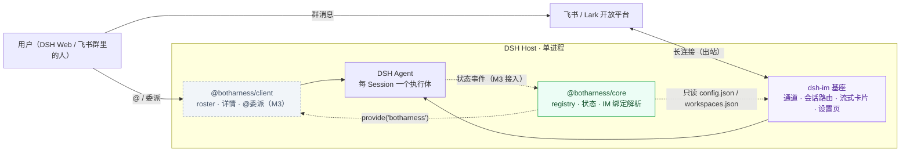
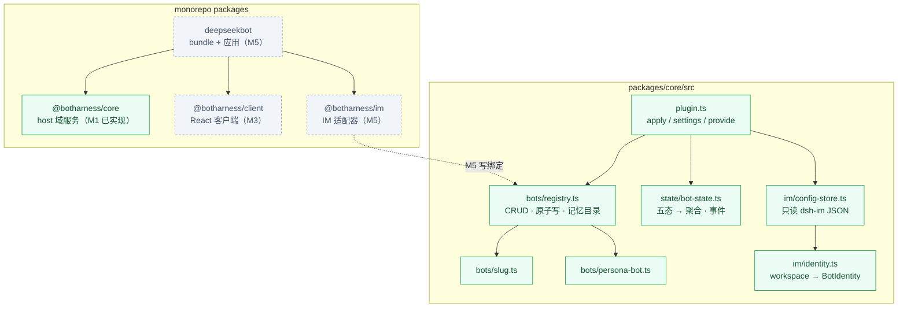
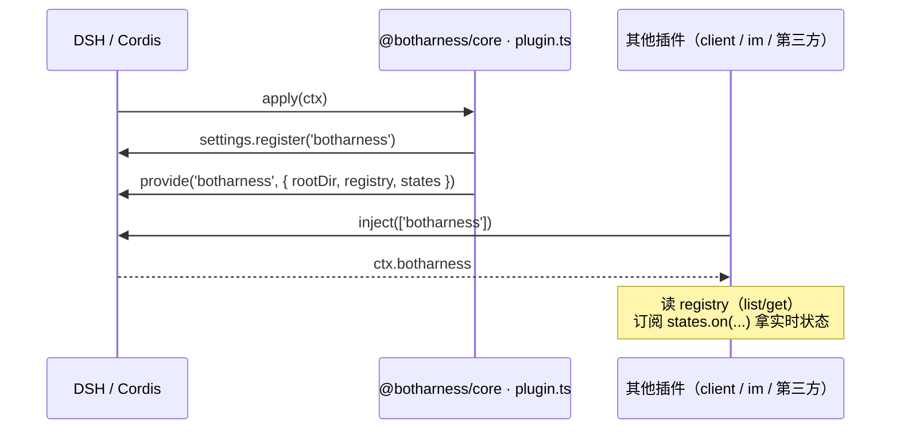
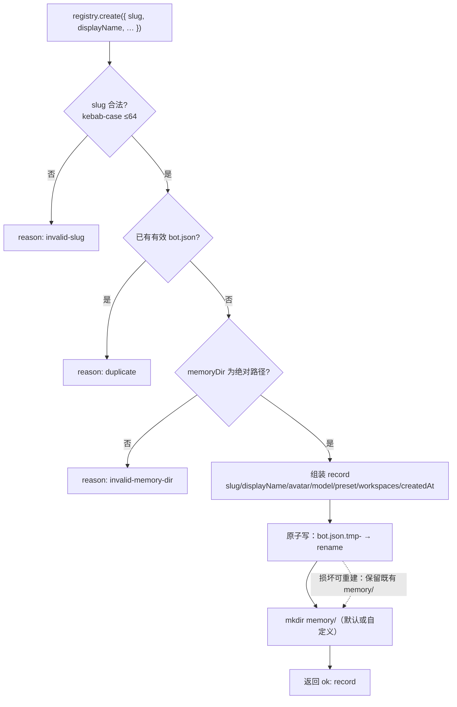
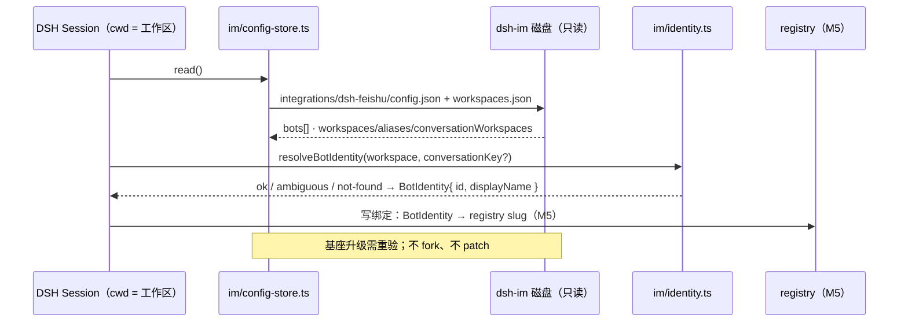
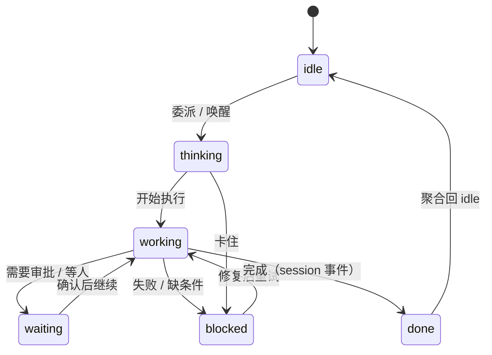

# BotHarness 架构与数据流

BotHarness 是 DSH（DeepSeek Harness）之上的插件层，给 agent 持久身份：**PersonaBot**——带人格、跨 session 记忆、可并发工作。DeepSeekBot 是它的首个应用（sidebar 名册 + 委派 + IM 接入）。DSH 内核不 fork；IM 由 dsh-im 基座提供通道。

状态：M1 已实现（PR #13）· M2 记忆 MVP · M3 Roster 与委派 · M5 IM 适配器 · 更新 2026-09-17

## 1 · 系统上下文



两条入口（DSH Web 的 roster/委派、飞书群的 IM），同一颗 PersonaBot 大脑。

## 2 · 模块与包



| 模块                 | 职责                                                                                        | 状态             |
| -------------------- | ------------------------------------------------------------------------------------------- | ---------------- |
| `plugin.ts`          | 插件入口：settings 命名空间 + `provide('botharness')`；`createCore()` 组装                  | M1 ✅            |
| `bots/registry.ts`   | PersonaBot 生命周期 + 原子持久化；`remove` 默认保记忆，`purge` 才清                         | M1 ✅            |
| `state/bot-state.ts` | Session 五态上报 → PersonaBot 聚合；`aggregate-changed / session-changed / session-removed` | M1 ✅            |
| `im/*`               | 只读 dsh-im 存储（v1/v2/v3 兼容）+ workspace→BotIdentity（IM 绑定助手）                     | M1 ✅（M5 接线） |
| 记忆（M2）           | front-matter、目录树注入、`memory_*` 工具、可见性、git 版本化                               | M2               |
| roster 客户端        | `main` 面板 + `sidebar.panellist`；名册树 / 详情 / 新建；@委派                              | M3               |

## 3 · 装载与服务暴露



一切走 Cordis 服务总线，无文件轮询。

## 4 · 创建 PersonaBot（数据流）



校验 → 判重（以有效记录为准，不因墓碑目录卡死）→ 原子写 → 记忆目录。

## 5 · IM 绑定解析（当前为 helper，M5 接线）



## 6 · 状态机与事件



| 事件                | 触发                                  | 消费者               |
| ------------------- | ------------------------------------- | -------------------- |
| `aggregate-changed` | 聚合态变化                            | roster / 头像（M3+） |
| `session-changed`   | 任一 Session 状态变化（含聚合不动时） | 会话详情             |
| `session-removed`   | 会话结束 / 清理                       | 树刷新               |

## 7 · 磁盘数据

我们的（registry 写入）：

```text
$DSH_HOME/botharness/bots/<slug>/
├── bot.json   # 机器元数据（原子写）
└── memory/    # 默认记忆目录；可配绝对路径
               # M2：PERSONA.md / MEMORY.md / 主题文件
```

dsh-im 的（只读）：

```text
$DSH_HOME/integrations/dsh-feishu/
├── config.json      # bots[]
├── workspaces.json  # v3：workspaces/aliases/覆盖
└── bots/<botId>/state.json  # 会话绑定（M5）
```

## 8 · 通信与边界

| 通道                         | 方向                    | 说明                                         |
| ---------------------------- | ----------------------- | -------------------------------------------- |
| Cordis 服务 `provide/inject` | core → client/im/第三方 | `botharness` 服务；无全局单例                |
| Tracker 订阅 `states.on()`   | core → client           | 进程内事件，非轮询                           |
| DSH 事件总线 `ctx.on`        | DSH/dsh-im → core       | M3 接 `agent/*` 驱动状态                     |
| 飞书 / Lark                  | dsh-im ↔ 开放平台       | 长连接出站；无公网入口（webhook 例外见 PRD） |
| dsh-im 磁盘                  | 只读                    | 只经 `im/` 一个模块；不 fork / 不 patch      |
| Secrets                      | —                       | 只在 DSH credentials 服务；仓库零明文        |

## 9 · 如何维护

- 这是**活的**架构文档：模块、数据流、边界发生结构变化时，更新本文件（mermaid 源码直接内联）。
- 本页由 `scripts/sync-docs.mjs` 同步到文档站（`apps/docs`）；站点地址 `https://botharness.ai/architecture`。
- 配套：平台规格 `docs/botharness.md` · 应用 PRD `PRD.md` · 词表 `CONTEXT.md` · 决策 `docs/adr/`。
