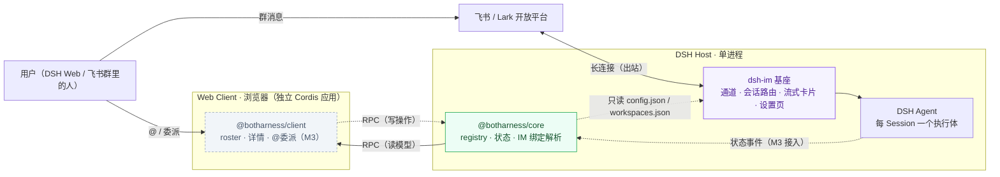
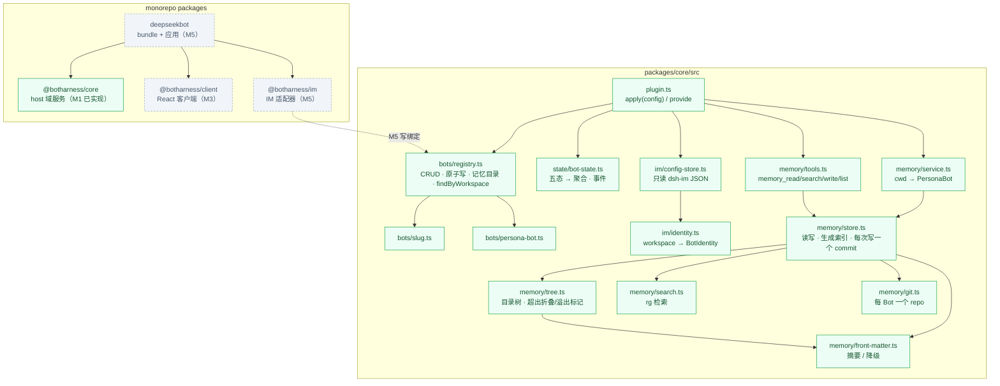
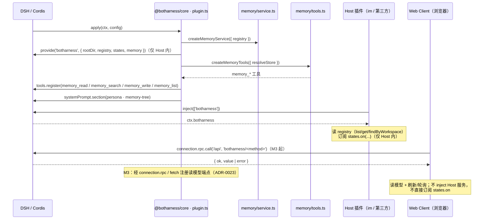
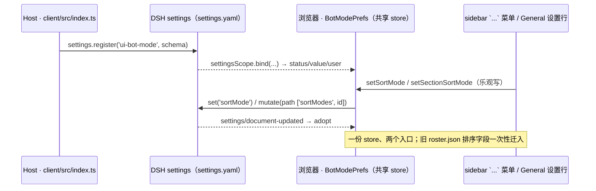
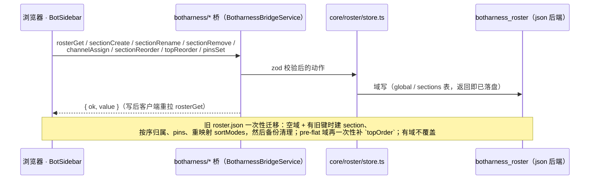
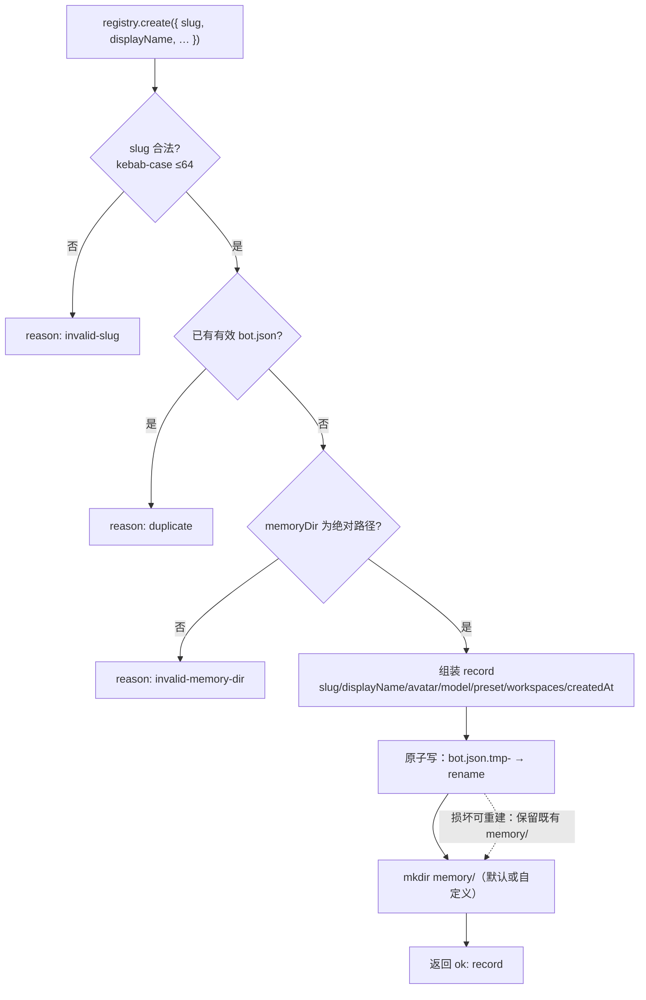
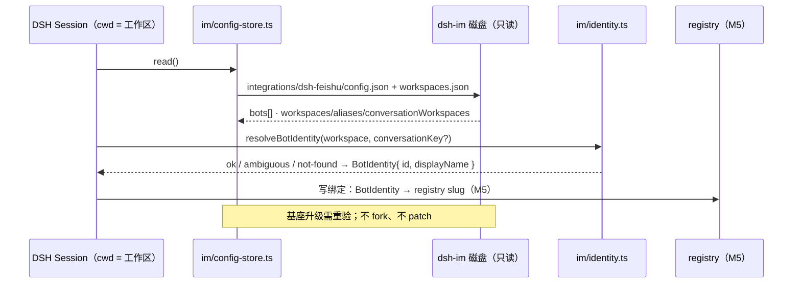
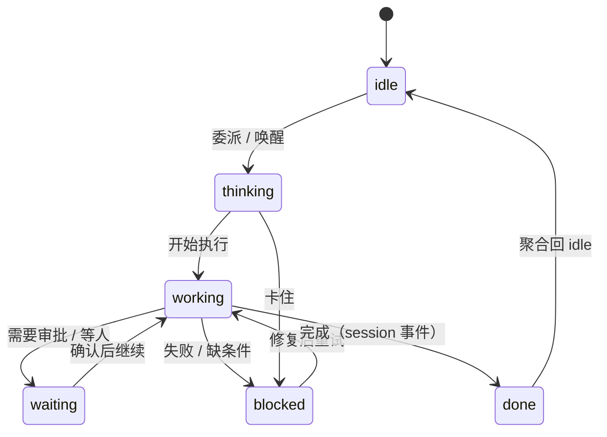

# BotHarness 架构与数据流

BotHarness 是 DSH（DeepSeek Harness）之上的插件层，给 agent 持久身份：**PersonaBot**——带人格、跨 session 记忆、可并发工作。DeepSeekBot 是它的首个应用（sidebar 名册 + 委派 + IM 接入）。DSH 内核不 fork；IM 由 dsh-im 基座提供通道。

状态：M1 已实现（PR #13）· M2 记忆 MVP 已实现 · M3 Roster 与委派（名册陈列迁 Host `botharness_roster`，#66） · M5 IM 适配器 · M6 SoulSnapshot · M7 Soul registry（ADR-0019/0020）· 更新 2026-09-20

## 1 · 系统上下文



两条入口（DSH Web 的 roster/委派、飞书群的 IM），同一颗 PersonaBot 大脑。浏览器半侧不是 Host 进程的一部分：跨进程只有 RPC（ADR-0023）。

## 2 · 模块与包



| 模块                     | 职责                                                                                                                                   | 状态             |
| ------------------------ | -------------------------------------------------------------------------------------------------------------------------------------- | ---------------- |
| `plugin.ts`              | 插件入口：`apply(ctx, config)`（`enabled` 门控）+ `provide('botharness')`；`createCore()` 组装                                         | M1 ✅            |
| `bots/registry.ts`       | PersonaBot 生命周期 + 原子持久化；`remove` 默认保记忆，`purge` 才清                                                                    | M1 ✅            |
| `state/bot-state.ts`     | Session 五态上报 → PersonaBot 聚合；`aggregate-changed / session-changed / session-removed`                                            | M1 ✅            |
| `im/*`                   | 只读 dsh-im 存储（v1/v2/v3 兼容）+ workspace→BotIdentity（IM 绑定助手）                                                                | M1 ✅（M5 接线） |
| `memory/front-matter.ts` | front-matter 解析/序列化 + 降级（首行摘要 + mtime；非法 YAML 不抛错）                                                                  | M2 ✅            |
| `memory/store.ts`        | 记忆读写：路径 jail、原子写、串行队列、`MEMORY.md` 生成、每次写入一个 commit                                                           | M2 ✅            |
| `memory/tree.ts`         | 目录树：front-matter 摘要 + `updated_at`；≤1000 路径，超出折叠为目录计数                                                               | M2 ✅            |
| `memory/search.ts`       | 大小写不敏感检索（`rg` 优先，纯 Node 回退）；跳过 front-matter，返回 path/line/excerpt                                                 | M2 ✅            |
| `memory/tools.ts`        | DSH 工具 `memory_read / memory_search / memory_write / memory_list`（write 必带 summary）                                              | M2 ✅            |
| `memory/service.ts`      | `agent.session.header.cwd → PersonaBot` 映射；每记忆目录一个 store（跨 Session 串行）                                                  | M2 ✅            |
| `memory/git.ts`          | 每 Bot 一个 repo：`main` 单分支、`.gitattributes` 强制 LF、本地身份、`history()`                                                       | M2 ✅            |
| roster 客户端            | `main` 面板 + `sidebar.panellist`；名册树 / 详情 / 新建；@委派                                                                         | M3               |
| `roster/{spec,store}.ts` | `botharness_roster` 存储域（global `pins/sectionOrder/topOrder?` + `sections` 表）；Host 生成 id；可选 `storageDomain`（缺省只读降级） | M3 ✅ #66        |

## 3 · 装载与服务暴露



Host 内一切走 Cordis 服务总线；浏览器半侧经客户端桥 RPC 读模型，不跨进程 inject、无文件轮询。

### 3.1 · BOT 模式偏好（#68）

Host 半在 `packages/client/src/index.ts` 向 `ctx.settings` 注册命名空间 `ui-bot-mode`（schemastery：全局 `sortMode` + per-section `sortModes`，默认 `updated` / `{}`）；浏览器半经 `ctx.settingsScope.bind({ namespace: 'ui-bot-mode' })` 读写（全局 `set`、per-section `mutate` 路径操作），`settings/document-updated` 到达时由 policy store adopt：



偏差记录：Host 半用 `settings.register(ns, schema)`，不用 cookbook 主推的 `installSection(ctx, ns, Config, config, { setSource, onChange })` —— 本插件没有可作 base 的 `cordis.yml` entry config，默认值与缺省行为完全由 schema 承担；出现 entry 配置需求时再切换到 `installSection`。

### 3.2 · 名册陈列（#66）

陈列（section 名称/成员/相对顺序、pins、混排 section 与松散 Channel 的 `topOrder`）的权威在 Host storage 域 `botharness_roster`（json 后端、`version 1`、`layout: single`；ADR-0034）；浏览器只经八个细粒度桥方法读写（含绝对顶层位置写 `topReorder`），写后重拉 `rosterGet`（无乐观状态）。storage 是可选能力：没有 `storageDomain` 时插件照常加载，roster 的读写都回 `storage-unavailable`（`rosterGet` 不假装空陈列），客户端首屏即只读、后端可用后重载恢复。



## 4 · 创建 PersonaBot（数据流）



校验 → 判重（以有效记录为准，不因墓碑目录卡死）→ 原子写 → 记忆目录。

## 5 · IM 绑定解析（当前为 helper，M5 接线）



## 6 · 状态机与事件



| 事件                | 触发                                  | 消费者               |
| ------------------- | ------------------------------------- | -------------------- |
| `aggregate-changed` | 聚合态变化                            | roster / 头像（M3+） |
| `session-changed`   | 任一 Session 状态变化（含聚合不动时） | 会话详情             |
| `session-removed`   | 会话结束 / 清理                       | 树刷新               |

事件只在 Host 进程内发出。浏览器端不直接订阅：roster 经客户端桥读模型 + 刷新/轮询获得状态（ADR-0023）。

## 7 · 磁盘数据

我们的（registry 写入）：

```text
$DSH_HOME/botharness/bots/<slug>/
├── bot.json   # 机器元数据（原子写）
└── memory/    # 默认记忆目录；可配绝对路径
               # M2：PERSONA.md / MEMORY.md / 主题文件
```

dsh-im 的（只读）：

```text
$DSH_HOME/integrations/dsh-feishu/
├── config.json      # bots[]
├── workspaces.json  # v3：workspaces/aliases/覆盖
└── bots/<botId>/state.json  # 会话绑定（M5）
```

## 8 · 通信与边界

| 通道                                 | 方向                          | 说明                                                                                   |
| ------------------------------------ | ----------------------------- | -------------------------------------------------------------------------------------- |
| Host 内 Cordis 服务 `provide/inject` | core → Host 插件（im/第三方） | `botharness` 服务仅同进程可见；无全局单例                                              |
| Host 内 Tracker 订阅 `states.on()`   | core → Host 消费者            | 进程内事件，非轮询；浏览器不直接订阅                                                   |
| 浏览器内 Cordis（slots/触发源等）    | client 插件之间               | Web Client 是独立 Cordis 应用，shell 基线由宿主注入                                    |
| 跨进程 Connection RPC                | client ↔ core                 | `botharness/<method>` 读模型；`{ ok, value \| error }` + cursor；刷新/轮询（ADR-0023） |
| DSH 事件总线 `ctx.on`                | DSH/dsh-im → core             | M3 接 `agent/*` 驱动状态                                                               |
| 飞书 / Lark                          | dsh-im ↔ 开放平台             | 长连接出站；无公网入口（webhook 例外见 PRD）                                           |
| dsh-im 磁盘                          | 只读                          | 只经 `im/` 一个模块；不 fork / 不 patch                                                |
| Secrets                              | —                             | 只在 DSH credentials 服务；仓库零明文                                                  |

## 9 · 如何维护

- 这是**活的**架构文档：模块、数据流、边界发生结构变化时，更新本文件（mermaid 源码直接内联）。
- 本页由 `scripts/sync-docs.mjs` 同步到文档站（`apps/docs`）；站点地址 `https://botharness.ai/architecture`。
- 配套：平台规格 `docs/botharness.md` · 应用 PRD `PRD.md` · 词表 `CONTEXT.md` · 决策 `docs/adr/`。
