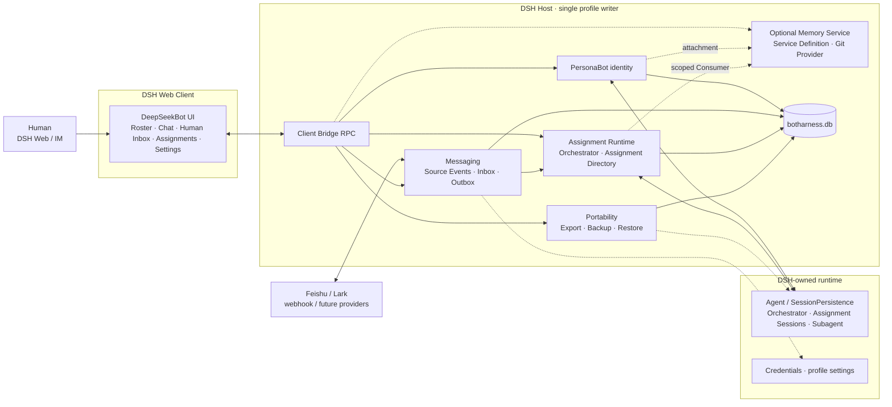
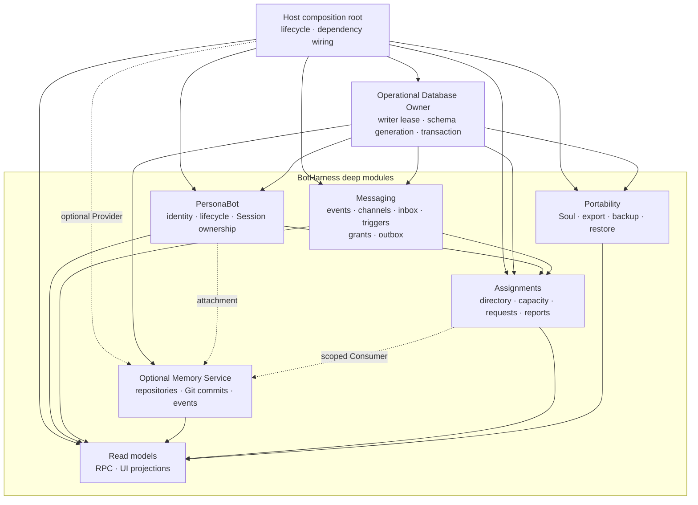
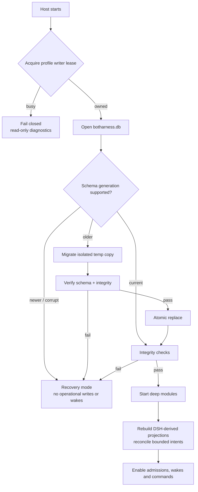
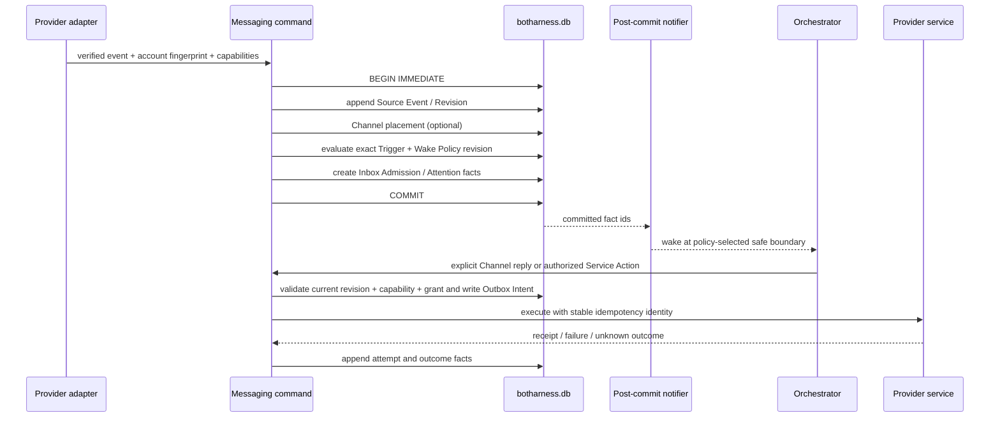
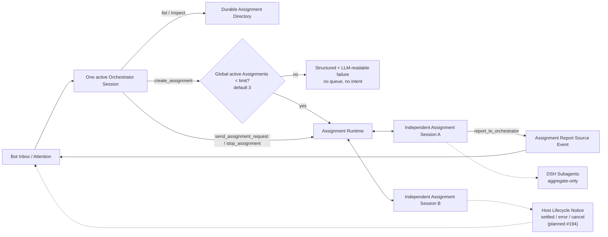
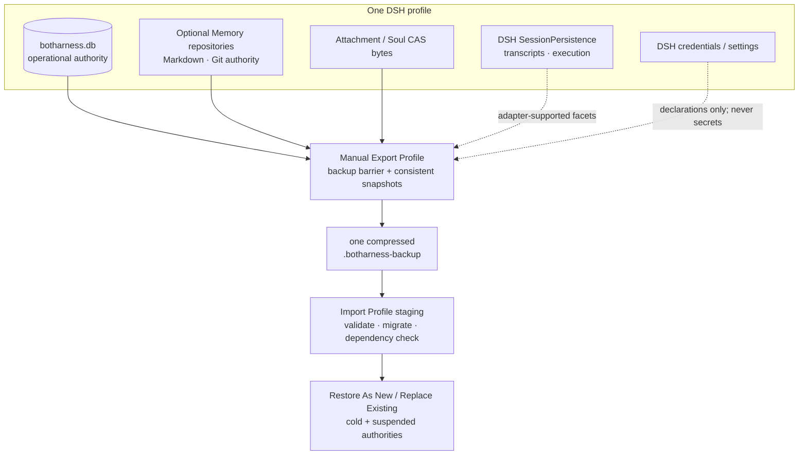

# BotHarness 架构与数据流

BotHarness 是 DSH（DeepSeek Harness）之上的插件层，给 Agent 持久产品身份：**PersonaBot**。PersonaBot 用一个 Orchestrator Session 管理 Inbox，并可同时管理多个独立 Assignment Session；Memory 是 optional capability，Persona 是其中的 optional 内容；两者都不是聊天或执行的前置依赖。DeepSeekBot 是首个应用，提供 roster、Bot Inbox、Assignment Directory、委派和 IM 接入。

本文描述 #71 确认后的目标架构。M1 registry、M2 Memory 与 #66 roster storage 已实现；#77 已验证 DSH runtime seams，显式 Session ownership、Messaging、Assignment Runtime、统一 operational database 和可移植性按 #79–#81 分阶段落地。更新：2026-09-25。

当前 Client UI 由独立 `@botharness/ui` Bundle 挂载，源码仍在 `packages/client`；RC2 的插件图把结尾 `/client` 解释为导出子路径，因此包身份依 [ADR-0066](../adr/0066-rc2-client-bundle-identity.md) 避开该后缀。Client HMR 只暂存当前 Bot/Channel 选择以恢复视图，不复制 Host 中的 PersonaBot、Channel 或消息权威。

产品术语以根目录 [`CONTEXT.md`](/zh/dev/design/context) 为唯一词表；[BotHarness Runtime 架构](/zh/dev/design/bot-runtime) 单独展开 PersonaBot、Bot Inbox、Orchestrator、Assignment 与 DSH execution 的关系。DSH/Cordis 本身的术语和 Plugin 开发决策位于 `/zh/dsh`，不在这里重复定义。

迁移阶段保持可验证：#66 的 `botharness_roster` 是当前 roster 权威；#79 只先建立 `botharness.db` owner，#80 才将 roster 与 Session ownership 单向迁入。目标图表示迁移完成后的所有权，不表示运行时现在已经双写两套存储。

#56 and #137 extend the current roster global slot to `{ pins, hidden?, sectionOrder, topOrder? }`: `pins` canonically orders Channel IDs for both group Channels and PersonaBot DMs, `hidden` omits Channels only from roster navigation while retaining their placement, and `topOrder` mixes section blocks with loose Channels while membership remains owned only by section records. The unary client bridge now has ten arrangement methods, including `topReorder`, `hiddenSet`, and bounded `rosterBatch` (one Host completion notice and one final Client snapshot for multi-select); #80 must migrate this order, hidden presentation state, and single-membership invariant into the database without dual writes. 已提交的 roster mutation 会在 Host commit 后发送 `roster/changed` live invalidation；其他窗口只重读权威 roster，不接收也不复制拖拽中的预览状态。

BOT mode 的折叠 rail 复用这份 Channel 排序读模型：置顶项在分隔线上方，其余 DM 与 group Channel 按 section/未分组的扁平顺序排列。`botharness/channels` 额外投影可选 `latestMessage` 供 hover 摘要使用；该字段从当前 Messaging authority 派生，不成为新的持久化权威。

置顶格也是独立的排序 scope：默认继承全局最近更新／手动模式，可用 `ui-bot-mode.sortModes.pinned` 覆盖；拖动置顶卡片会把当前完整顺序（包括被搜索或隐藏过滤的置顶项）冻结为手动模式，通过 `pinsSet` 持久化，不影响 section 归属或其他 scope 的排序。折叠 rail 使用同一置顶顺序。

Hidden Channel 是 application-defined 的可逆 roster presentation state：它会从展开列表、pin grid、搜索与折叠 rail 中消失，但不会改动 Channel、消息、PersonaBot、Memory 或原 placement。破坏性删除仍受 ADR-0037 的 dependency report 与独立确认约束（#138）。

当前 Channel Chat 的实时显示遵循 ADR-0054：正式消息先写入当前持久化权威，再以该 Channel 的单调 revision 发出进程内通知。#143 的时间线读取遵循 ADR-0061：Host 的 `channelTimeline` 用不透明游标提供 latest / older / newer / around 窗口，Client 仅保留一段连续的按提交顺序排列的可见消息；SQLite Channel placement 的游标解释留在 Host。首次打开 Channel 取最新页；有上次已读锚点时，重开会在锚点附近分页并定位；向上补页维持视口锚点，定位旧消息可前后补页并高亮，并可继续向 newer 分页直至最新消息；用户离开底部后，新消息只更新未读提示，不强制滚到底，也不把实时消息拼接进尚有后续页的旧窗口。旧 `channelMessages` 端点暂作兼容。已选 Channel 通过经过 DSH 认证的 `/api/botharness/stream` SSE 接收已提交消息；重连可回放、缺口则从 Host 修复。同一连接还传送 Orchestrator 显式 `channel_send` 工具参数产生的进程内草稿预览：`channel/draft` / `channel/draft-settled` / `channel/draft-abandoned` 带 attempt ID 与独立于持久消息的进程内草稿 revision；连接时先发送完整 baseline，断档则重读 committed。草稿不从历史回放，不进入 Inbox，提交后由正式消息替换，放弃时移除；呈现层可消费草稿，任何不可逆操作只认已提交消息（ADR-0054）。Human send 使用 Client 生成的幂等 message ID；网络失败时本地气泡保留失败状态，Human 可把原文和附件恢复到 composer 后再次确认发送，而 Host 对响应丢失后的同 ID 重试只接受一次 durable append。Orchestrator 普通 final 与 Assignment 输出不等于 Channel 消息；当前正式 Channel 消息由 SQLite Source Event 与 placement 事务提交，旧 NDJSON 历史只在首次升级时单向导入。Group 中经候选列表选中的多个 Bot mention 在同一事务形成独立 Inbox Admission；Bot 处理状态经同一 SSE 流独立投影。已入群 Bot 的 channel_send 可提交稳定 ID 列表；Host 从可信 Orchestrator ownership 得到发送者，读取当前成员与名称生成 mention 标签，并在同一事务为不同目标建立独立 Admission。Bot-authored Group 消息保留因果根和跳数；同根同目标只投递一次，过限消息保留在群里但不再唤醒目标。收件 Bot 可以在同一群回复，重启后 pending/retryable Admission 仍可恢复。 Group 之外，Bot-to-Bot DM 使用确定性的双成员 Channel ID；Orchestrator 的 `bot_dm_send` 或该 DM 内的 `channel_send` 以可信 Session ownership 确定发送者。每次发送在同一事务中提交 Bot DM Source Event、placement、收件 Bot Admission（受因果根去重与跳数上限约束），以及发送者 Human DM 中只链接原消息的无正文动作提示。重启时恢复 pending/retryable 收件投递；Bot DM 默认不进入 Human roster，但在隐藏频道管理器中可发现、只读打开，Human 无发送或重命名权限。
Channel 的消息引用（#145）只保存同 Channel 的已提交目标 ID；Human 发送与 PersonaBot 显式 `channel_send` 由同一持久化权威校验，跨 Channel/缺失目标不能产生消息。引用作者和截断摘要在时间线读取时由当前历史投影，不复制为另一份持久内容，也不为每条消息单独读取。目标后来不可见则降级为不可点击提示；点击有效引用复用 `around` 窗口和高亮，不改变相邻消息分组与时间语义。

Channel 附件（#146）以 profile-scoped content-addressed 文件仓库存放真实字节，消息只持久化 `{hash,name,mime,size}` 引用；Host 在 Channel append 前验证该引用确实存在于当前 profile，并由服务器嗅探 MIME。浏览器经 DSH 认证的 exact Fetch 路径分开流式 POST 上传 `/api/botharness/attachment/upload` 和普通 GET 下载 `/api/botharness/attachment`：图片安全内联，其他文件强制下载。Human composer 保留失败附件供重试；PersonaBot `channel_send` 也复用引用校验。Orchestrator 可通过 `channel_read_image` 按 `channel_id + message_id + hash` 读取图片；可信 Host 必须先验证 PersonaBot 已加入该 Channel、消息确实引用该 hash、MIME 为受支持图片且未超限，再把字节提交到 DSH attachment service 作为模型可见图片。历史图片不会被自动塞入上下文，模型也不接触 profile 内部文件路径。未完成上传的临时文件可按保留期清理；已发布对象提供显式的引用感知 mark-and-sweep，由当前持久 Channel 消息提供标记集，且在单个 Host 调用中无异步间隙地删除过期孤儿。自动调度与保留期策略暂不启用。

## 1 · 系统上下文

浏览器只通过 RPC 访问 Host read models 和 commands。Provider adapter 只负责验证、规范化和执行能力；它不拥有 Inbox，也不能直接唤醒 Agent。DSH 继续拥有 Agent 执行、SessionPersistence、Subagent 与凭据；BotHarness 不复制这些 runtime 权威。

## 2 · Deep modules 与所有权

| Module           | Owns                                                                                                    | Does not own                             |
| ---------------- | ------------------------------------------------------------------------------------------------------- | ---------------------------------------- |
| PersonaBot       | Host-owned ID、display name / role badges、lifecycle、explicit Session ownership                        | DSH Session lifecycle、Memory 内容       |
| Memory           | generic Git-backed repositories、semantic commits、operation events                                     | PersonaBot lifecycle、Inbox、Session     |
| Messaging        | Source Event、Channel placement、Inbox Admission、Attention、Trigger/Wake Policy、Service Grant、Outbox | Agent execution、provider credentials    |
| Assignments      | Assignment Directory、Assignment Request/Delivery Intent、capacity admission、report/lifecycle routing  | DSH transcript、Subagent runtime         |
| Workspace Grants | Human 对 DSH Workspace 的授权与撤销、Assignment 创建时的权限快照                                        | DSH Workspace registry、Session 权限实现 |
| Portability      | SoulSnapshot、PersonaBot Export、Profile Backup/Restore/Transfer 协调                                   | credentials、可执行插件、DSH 私有格式    |
| Read models      | 查询、分页、PersonaBot Activity Projection、Human Inbox、UI-friendly projection                         | 业务事实与写入规则                       |

`botharness.db` 是 BotHarness core 的物理事务宿主，不是共享的 generic repository。Memory 内容与 commit 由 optional Git-backed Provider 掌管；每个 deep module 只通过自己的接口拥有表和不变量，跨模块流程由显式 command/port 协调。

application-defined Memory Service 使用 `Consumer → Service Definition → Provider` capability seam。每个 PersonaBot 都有一个 Git-backed Memory Repository，Orchestrator Session 固定以它为 working directory。当前检出的工作树文件立即是记忆，无论是 Markdown、代码还是二进制文件。Agent 通过原生文件、搜索、Shell 与 Git 能力读写仓库；没有面向模型的 Memory CRUD 工具。新建 PersonaBot 时可选择空白记忆，或由 Host 检查 Git 并以 HTTPS/SSH 地址在暂存目录克隆远端仓库；克隆成功才建立 Bot，远端当前分支及文件立即成为记忆（#298）。私有仓库使用 Host 已配置的 Git 凭证，不经创建页面收集密钥；已有 Bot 仍通过原生 Git 整合远端仓库。外部仓库应合并、替换或放到其他位置若有歧义，Orchestrator 经 DSH 原生 Ask Question 询问 Human。分支、合并与冲突由 Git 决定；Git 改变工作树后，同一 Session 立即看到新文件，但该 Session 已冻结的 Persona prompt 不追溯更新（ADR-0060）。

Memory Service 拥有 repository identity 和 lifecycle、可信 Session ownership、受限的 UI 查询，以及审计/恢复检查点。成功回合后，它可以把观察到的 HEAD 与可信 Source Event、Session actor 记录下来；观察不会暂存、提交或隐藏工作树文件。当前文件与历史以 Git 仓库为权威，数据库 ledger 只是辅助记录。Channel Memory 列表读取当前工作树，提供有界文本预览，列出二进制文件但不把它们作为文本编辑，并在 Git graph 展示所有本地分支及可达提交。Human 文本保存先比较当前 HEAD，再显式生成 Git commit。Memory 文件查询阻止访问 `.git` 控制路径及指向仓库外的符号链接，但不限制 Git 可保存的文件类型。旧 Repair 归档与检查点记录仍保留兼容；普通未提交改动不会阻止下一回合或强制修复（ADR-0068）。

## 3 · Host 启动、迁移与 recovery

一个 DSH profile 同时只允许一个 BotHarness writer。所有 module migration 合并成单调递增的 Schema Generation；迁移只在临时副本上完成，校验后原子替换。打开、迁移或完整性检查失败时进入 recovery mode，不回退到 NDJSON、storage domain 或内存写入。

## 4 · Messaging 事务与外部副作用

Source Event 是内容唯一权威；Channel 和 Inbox 都只保存关系。Reply 使用可信 Reply Route 自动选择来源 provider；主动发布属于 Service Action，必须同时满足 Provider Capability 与 Human Service Grant。SQLite 事务只覆盖本地事实；外部副作用使用 Outbox Intent、幂等标识和有界 reconciliation，不宣称 exactly-once。不可证明的结果进入 `unknown-outcome`，由 Human 处理。

Wake Policy 决定何时让 Orchestrator 看见新 attention：当前 step 完成后的安全边界、当前 turn 结束后，或 idle 时启动新 turn。普通外部消息不打断正在执行的 model/tool step；只有 DSH 明确支持且策略授权的控制路径才能 steer。

### Bot 之间的 Channel 协作（ADR-0065）

当前 #47 首个高流量 Group 切片把每位成员的普通消息 Wake Policy 写在 Channel record；Human 可在成员侧栏选择仅直接 @ 唤醒、N 条 / T 秒汇总，或静默收件。启用汇总或静默收件时，普通消息作为 Source Event 与该 Bot 的 `group-ordinary` Inbox Admission 在同一 SQLite 事务中提交，Admission 固定当时的 policy revision；汇总记录阈值，静默记录空阈值。直接 @ 走独立的即时 Admission，不等待汇总。Host 在达到数量或非空队列的时间上限后，为该 Bot 排入一个汇总回合；若 Orchestrator 正忙，按每 Bot 的串行队列在当前回合结束后执行，不打断正在运行的 step。重启从 pending/retryable Admission 重建计时，汇总进入 Orchestrator context 后记录 observed，回合结束标为 handled；是否向 Channel 回复仍由 Bot 决定。静默收件为普通消息保留待处理 Admission，但不设置汇总阈值，不在当前进程或重启后排入自动唤醒；直接 @ 仍即时。完整 Attention 聚合和 #47 其余 Wake Policy seam 尚待实现。

当前 Bot-scoped botAttention Bridge 查询直接从 Inbox Admission、Source Event 与 Channel placement 投影有界页，按 Source Event 时间与 ID 排序，返回状态、发送者、摘要和可用的来源消息引用；它不另建收件内容。Human–PersonaBot DM 的 Channel sidebar 在有事实时显示 Bot Inbox entry，按来源 Channel 分组，待处理项展开，已处理历史折叠；点击仍可访问的来源时复用 Channel timeline 的 around 定位。Group Channel 不显示该 entry。已处理只表示回合处理完成，不代表 Bot 发言；Human 查看侧栏不改变 Bot 的观察事实（ADR-0070、#47、#152）。

Human Inbox 的首个可运行切片在 Bot mode 左侧栏的 Messages 上方提供独立入口，默认显示待 Human 处理的群聊加入申请，可切换到新 Bot→Human DM 消息。Host 从 Channel record 中的待处理申请、Source Event/Channel placement 以及 Human 的 Channel read position 投影列表，不另存 Inbox 内容；批准或拒绝沿用 Group 决策事务，已了解沿用 Channel 已读位置。查询按时间与稳定 ID 分页，并把游标绑定到分类、Bot/Channel 过滤条件与排序方向；Client 在切换范围时丢弃旧响应。失败、提问、工具审批和 Grant 请求暂不落入普通资讯项，后续以各自的 action-required 规则扩展（ADR-0071、#126）。

Bot-to-Bot DM 是两个 PersonaBot 参与的真实 `dm` Channel。Bot A 通过可信 Session ownership 以自己的 Actor 身份向 B 发送消息；Messaging 在同一权威中提交 Source Event、Channel placement 与 B 的 Inbox Admission，Bot-hop guard 限制循环，A 不接收自己的输出。Human 可以只读打开此类默认不在 roster 显示的 Channel，但不会成为第三位成员。A 每次向非 Human DM Channel 发出已提交消息时，其 Human–A DM 都会出现居中的动作 chip，指向这次发信与可查看的对话，而不复制正文。

Human–A DM 里选中 `@B` 会在 Human 消息中持久保存 B 的稳定 ID 与文字范围；Host 在 A 的 Orchestrator 回合组装输入时重新读取 B 的当前名称与最多 400 字的简介，并把它们作为有界联系人资料提供给 A。重名靠 ID 区分，改名采用当前资料，已归档或失效的目标在发送时被拒绝；手打或粘贴的 `@名字` 只是普通文字。此操作不唤醒 B 或改变 DM 成员；只有 A 后续显式发送 Bot-to-Bot DM 消息才触发 B 的 Inbox。Group Channel 中 Human 或已加入的 Bot 可 `@` 已加入的 Bot；一条消息仍只有一个 Source Event，每位目标 Bot 独立获得 Inbox Admission。Bot 创建 Group 时，Host 从 Orchestrator ownership 确定创建者，初始成员只有该 Bot；创建者可邀请活跃非成员 Bot。邀请状态存于同一 SQLite Channel record，创建待处理邀请、无 Channel placement 的 system Source Event 和受邀 Bot 的 `group-invite` Inbox Admission 在一个事务内提交。邀请携带可信的 Bot 协作跳数和受邀 Bot 的创建时间，跨 Bot 唤醒不重置循环限制，删除后重建的同名 Bot 也不能继承旧邀请。受邀者收到自己的 DM 上下文中的邀请 prompt，但在接受前没有 Group read/send 权限；接受把 membership 与邀请状态同时更新，拒绝不增加成员。重复邀请与重复同向决定幂等，归档目标时取消待处理邀请，重启时恢复仍待处理的 Admission。创建者可改群名、移出其他 Bot 成员；Human 可在成员侧栏查看状态、取消邀请、移出成员、改名，并独占整群逻辑删除命令；删除撤销成员访问，保留 Source Event 等运行证据而不作破坏性清除。首个 Group Human `@` 切片是 #254，后续协作切片由 #278 组织。

Human 在自己的 PersonaBot DM 输入框中从 `#` 候选选中 Group，消息才记录稳定 Channel ID 与选中文字范围；Human 已发消息中的引用可点击进入该 Group。Host 在该 Bot 的 Orchestrator 输入中重查当前名称，非成员只收到 ID、名称和是否已加入，不读取成员或历史，普通手打的 `#名称` 没有引用身份。Bot 可在该 Human DM 所触发的回合用 `group_join_request` 请求加入选中的 Group；请求本身不会改变 membership。待处理申请保存在同一 Channel record，Bot 创建者收到独立的 system Source Event 与 Bot Inbox Admission，Human 在群成员侧栏可批准或拒绝，创建者可用 `group_join_decide` 决定。首个决定与成员更新、申请者的结果通知在本地事务中提交；申请者收到结果后才能按现有成员规则使用 `channel_read` 和 `channel_send`。重试、重启、改名、同名群都使用稳定 ID；归档申请者或删除群会取消待处理申请（ADR-0069、#292）。

Orchestrator 的应用定义 channel_list 工具从当前 PersonaBot 的 Session ownership 派生身份，只返回其已加入的 Group、Human DM 和 Bot DM；可按名称、Channel 类型、稳定 Bot 成员 ID 筛选并分页，结果带当前成员身份。它是 canonical Channel record 的授权查询 Consumer，不创建第二份成员目录。Bot 用返回的稳定 Channel ID 调用 channel_send；发送时仍重新检查当前成员资格，旧查询结果不会授予访问权。应用定义的 channel_read 查询在成员校验后对该 Channel 的完整有序消息历史应用正文、作者及日期过滤，再返回有界游标页；回复预览仍解析自原消息，不因过滤失去引用。`channel_read(scope=joined, text=...)` 对当前已加入的 Channel 进行跨频道正文搜索，结果按时间与稳定 ID 排序并分页；成员关系变化会使旧游标失效。原先仅扫描每个 Channel 最近 200 条的 `channel_search` 工具已移除，Bot 不再面对两个含义重叠的搜索入口。

## 5 · Orchestrator 与 Assignment control plane

Human 不负责创建或选择执行 Conversation。Human–PersonaBot DM 是 Human 与该 Bot 直接对话的入口：消息先成为 Source Event，经 Bot Inbox 交给 Orchestrator；Orchestrator 再决定直接回复，或在授权与 capacity 内创建、复用和管理多个 Assignment Session。普通 Orchestrator assistant final 只留在 DSH SessionPersistence；只有显式 Channel messaging command 才产生 Human-facing Channel message。该 command 从可信 Session ownership 推导 PersonaBot Actor，并验证目标 Channel membership，不接受模型自报 bot id 或 author。UI 只把 Assignment Session 按 purpose 和 state 投影到 `事项` 列表中，不会把 Orchestrator Session 显示成事项。

Workspace Grant 是 application-defined 的持久授权记录：Human 通过 DSH 的 Host 目录选择器或绝对路径输入添加一个现有文件夹，由 DSH Workspace registry 解析真实路径，再为 PersonaBot 创建 Grant。Orchestrator 的 cwd 始终是自己的 Memory Repository；它可读写 Memory，并可读取所有当前有效 Grant 的项目目录，但不能直接写项目目录或自行创建 Grant。每个 Assignment 选择一个有效 Grant，固化 Grant ID、Workspace ID、单一 primary cwd 与权限快照，只能读写所选目录。撤销 Grant 会阻止两个角色后续的文件访问及该 Grant 的新事项创建、请求和恢复；历史 Session 不因重新授权而复活。授权列表中 Memory 是固定内部目录，项目目录可添加、撤销，撤销不会删除 DSH Workspace 或磁盘文件。DSH 原生 workspace-write 仅限制部分写入并不隔离读取，且可能允许临时目录写入。BotHarness 在最终 Tool guard 对 DSH 原生 read、read_image、write、edit、str_replace_editor、glob、grep 的路径按当前 Grant 校验：Orchestrator 可读 Memory 与所有有效 Grant、只可写 Memory；Assignment 只可读写固化的单一有效 Grant。Shell、terminal 等无法从参数证明文件范围的原生工具在 `tools/pre-execute` 暂停当前调用，经 DSH `approval/request` 在 PersonaBot DM 展示完整输入，由 Human 对这一次调用批准或拒绝；仅 Orchestrator 在真实 Memory 根目录运行字面量 `ls -la` 或 `pwd` 是可直接核对的只读目录检查，直接放行；批准不等于目录隔离，调用可能访问授权目录之外。缺少、取消或无法展示的审批均拒绝。批准后最终 guard 仍重查当前 Session 和 Grant，并消费仅属于这次调用的批准标记；撤销会让待审批卡立即失效且不能再批准，已开始执行的调用可能完成，撤销阻止之后的 Assignment 调用。Human 可在审批卡保存 Tool Approval Rule：精确规则匹配工具名与完整输入，宽规则只适用于同一 Bot、角色及有效 Grant 范围内的不透明原生工具；每次命中仍经 DSH `approval/request` 给出独立的 `allowed-once` 审计，撤销规则或改变 Grant 范围后不再命中。每个 PersonaBot 的 Assignment Access Preset 默认为 `workspace-write + ask`；Human 经二次风险确认可为**之后新建**的事项启用 `danger-full-access + never`。该模式不改变 Orchestrator 或已有事项，也不取消事项创建及后续调用所需的有效 Grant；它让危险事项在该前提下绕过路径与不透明工具审批（ADR-0067）。

当所需项目尚无有效 Grant 时，Orchestrator 可通过专用工具在自己的 DM 提交一条持久授权请求卡；该工具只能请求，不能发放 Grant，也不会预建 Assignment。Human 在卡上用 Host 目录选择器选定文件夹后，现有 Workspace Grant authority 校验并写入授权，再由 Human 的明确回复成为 DM Source Event，唤醒同一个 Orchestrator Session。Orchestrator 重新列出有效 Grant，随后才用选中的 Grant 创建 Assignment；卡片和授权记录是不同的持久事实。普通 Assignment Ask 仍先回到 Orchestrator。Orchestrator 遇到 Human 未指明的 Memory 分支选择时，调用 DSH 原生 `ask_user_question`；BotHarness 在该 Agent 作用域的 `user-questions/request` waterfall 中提交持久 Channel 提问卡，Human 的选项或自定义回答经同一 DM 回到原生 Service，使同一 Session 继续。卡片保留来源 Session，回答和取消各有持久消息；停止、重启或旧请求不得再次回答。明确目标直接切换，不提问。Assignment 不直接向 Human 使用此原生工具，仍通过 Orchestrator 转问。

右侧是 Channel sidebar（ADR-0053）：group Channel 显示成员与 Channel 管理 entries，Human–PersonaBot DM 显示该 PersonaBot 的 entries（事项、Memory、Bot Inbox、Computer 等）；entries 由统一注册 seam 提供、可折叠、按声明顺序排列，未注册或不可用时直接不显示而不是占位。Chat 始终是中间的 Channel body。选择某个事项会打开只读详情；原始 DSH Session 仅通过显式次级操作进入。首个 tracer bullet 不依赖 Persona 或 Memory：创建仅有名称的 Bot，经真实 DM → Bot Inbox → Orchestrator Session → Assignment Session → Assignment Report 回流，在同一 DM 回复，并以最小列表/详情投影让 Human 验收。

Assignment Session 是 DSH independent root，以 DSH `sessionId` 为 canonical identity；Continuity Key 只是 PersonaBot-local alias。Orchestrator 通过五个工具 `list_assignments`、`inspect_assignment`、`create_assignment`、`send_assignment_request`、`stop_assignment` 管理它们。Assignment Agent 只能用 `report_to_orchestrator` 向 Orchestrator 回报；其 Agent Scope 没有 Channel send capability，普通 final 也不会写入 Channel。v1 没有 Assignment-to-Assignment 直连、广播或等待队列。

当前 `stop_assignment` 通过 DSH `Agent.cancel({ kind: "user" })` 取消活动回合并清空待执行输入；BotHarness 先持久记录「停止中」，待 Agent 静止后记录「已停止」。停止的事项不再接收请求或迟到报告，其 Continuity Key 可用于新 Session；取消不销毁 DSH Session 历史。独立的 Host Lifecycle Notice 和 Attention/digest 仍由 #194 后续切片交付。

Assignment Request 的 `context-update`、`next-step`、`next-turn` 分别映射到经过验证的 DSH inject、steer、followup seam；普通请求不 cancel 当前 step。跨 SQLite/DSH 边界只保留最小 Assignment Delivery Intent，重启时有界 reconciliation；歧义进入 `needs-repair`，不扩张为通用 workflow engine。

### 5.1 · PersonaBot activity、事件与 renderer

DSH 失败的 `turn/end` 仍是执行事实权威；BotHarness 在所属 Orchestrator 或 Assignment 回合结束并判定失败后，由 Host 向对应 PersonaBot DM 提交一条带 role、Session ID、错误码、可用 HTTP status、简短错误详情和事项上下文的 application-defined failure notice。该消息是面向 Human 的持久通知，不把 SessionEvent 全文或工具日志复制成第二套执行历史；Client 把它渲染成可读的失败卡，刷新后从 Channel authority 恢复。Orchestrator 的 Human Source Event 仍依原有 retry/reconciliation 语义处理，失败通知不等于完成该 Source Event。

DSH SessionEvent 是 durable execution authority；BotHarness 不复制 tool call 或 assistant output 为第二套 Session fact。explicit Session Ownership 把 Session 归属到 PersonaBot 及 `orchestrator` / `assignment` root role，PersonaBot module 再把这些事实与 live liveness 折叠成一个可重建的 Activity Projection。Browser 首先经 Typert/API Gateway 查询 projection，随后消费带单调 revision 的 live update；revision 断档时重新查询，而不是由 Client 自己推导状态。

application-defined `botharness/personabot/activity` Cordis Event 在 projection 改变后以 `emit` 发出，供 Host 内的 Live2D、3D 或其他 Plugin 同步。Orchestrator 活跃时负责呈现；当它明确 `waiting-on-assignment` 时，活动来源切换为 Assignment：同类 tool kind 使用对应 effect，多类并行回退到通用 `working`。waiting、blocked、approval 与 informational attention 单独投影，不进入可配置 priority。

Tool activity notification 只广播 `toolKind`、可选 `toolName`、SessionEvent reference 与 Tool 显式声明的 `publicDetail`；完整 arguments/result 由受控 Capability 按引用读取。Channel output commit 后另发 PersonaBot output notification，TTS 与说话动画消费该 public output，而不是任意 Tool 参数或尚未提交的草稿。

Client 通过一个 Avatar module 在侧栏行、响应式 Pin Grid、消息、顶部和 composer activity row 中呈现同一 projection。默认 Blobatar media 可在 thinking/working 时运动；自定义图片保持静止，由外层 Activity Frame 表达状态；group Channel 可用最多三个头像与 `+N` 的 facepile。Human Inbox 则统一投影 Channel Attention 与 PersonaBot Attention，并按 action-required / informational 分类；首个切片可暂不计算 Channel unread count。

## 6 · 持久化、导出与恢复边界

| Data                              | Authority                                                         | Portability                                                            |
| --------------------------------- | ----------------------------------------------------------------- | ---------------------------------------------------------------------- |
| operational facts                 | `$DSH_HOME/botharness/botharness.db`                              | consistent SQLite snapshot inside manual profile backup                |
| operational logs (debug timeline) | `$DSH_HOME/botharness/logs.db` (lightweight owner, rebuild-empty) | excluded from backup; emailable as-is                                  |
| optional Memory repositories      | Git-backed Memory Provider                                        | selected SoulSnapshot / PersonaBot Export / profile backup             |
| attachments / Soul bytes          | content-addressed files                                           | dependency-closed selected bytes                                       |
| Session transcript / execution    | DSH SessionPersistence                                            | only through a verified DSH export adapter; otherwise declared omitted |
| credentials and DSH settings      | DSH services                                                      | never copied; restore creates suspended rebind requests                |

v1 只有两个备份动作：Export Profile 生成一个 self-contained `.botharness-backup`，Import Profile 选择一个文件。没有自动备份、scheduler、catalog、retention 或 incremental chain。Restore 总是在隔离 staging 中验证；成功后 PersonaBot 仍为 cold，provider authority suspended，Workspace/model/plugin dependencies 必须在目标机重新解析并由 Human 明确激活。

## 7 · 关键边界

- 正常运行只认 explicit Session ownership；`cwd` 只可作为迁移/修复提示，不能决定 PersonaBot 身份。
- DSH Session 状态是执行权威；BotHarness 只投影 activity/last-run，并将 semantic Assignment Report 与 Host Lifecycle Notice 分开。
- Provider capability 不等于授权；发现一个飞书频道也不自动授予向它发消息的权限。
- UI 不直接读文件或数据库，不自己推导业务状态；它消费 Host read models，并把 command 交回 owning module。
- PersonaBot archive 先关闭 admissions、wakes 和外部 actions，再停止 Orchestrator、Assignment 与 owned Subagents；purge 是单独的破坏性动作。
- Browser 与 Host 是两个 Cordis 应用；Host service 不跨进程 inject，统一走 `/api` client bridge。
- Roadmap Project #1 保持 private；文档同步只用 `read:project` 读取显式 `In Progress` 和 Artifact，经过 fail-closed 白名单投影后才提交公开 JSON。Project notes、private items、assignee、backlog 与 ETA 不跨越这条发布边界。

## 8 · 实现顺序与可并发范围

1. #77 验证 pinned DSH 的 Agent/SessionPersistence/Subagent seams；#79 建立 operational database owner。这两项可并行。
2. #80 在 #77 与 #79 后实现 explicit Session ownership 和 activity projection。
3. #81 在 #77、#79、#80 后先交付最小 DM → Orchestrator → Assignment → report → DM reply tracer bullet，并同时提供可验收的事项列表/详情；#47 的后续 Assignment coordination 在该切片通过后扩展。
4. #78 可与上述工作并行研究 Feishu provider contract，但 #48 的 adapter 实现受它约束。
5. #74 的 Memory 工作在上述主链通过后，以独立 optional Provider tracer bullet 推进；#75、#76 保持 focused design/grill，避免阻塞首个可体验闭环。

## 9 · 如何维护

- 模块、数据流、事务边界或 authority 发生结构变化时，同步本文件、英文镜像和 `docs/architecture/diagrams/*.mmd`。
- 运行 `pnpm diagrams` 提交 light/dark SVG；`scripts/sync-docs.mjs` 将本文和图同步到 `apps/docs`。
- 配套：BotHarness 产品术语 `CONTEXT.zh.md`（英文为 `CONTEXT.md`）；取舍与理由 `docs/adr/`。Platform Spec 与 App PRD 已归档为历史工作草稿，不再作为并列设计权威。
