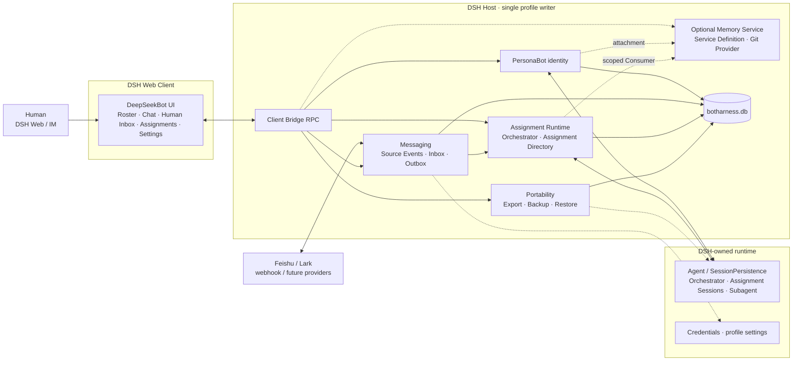
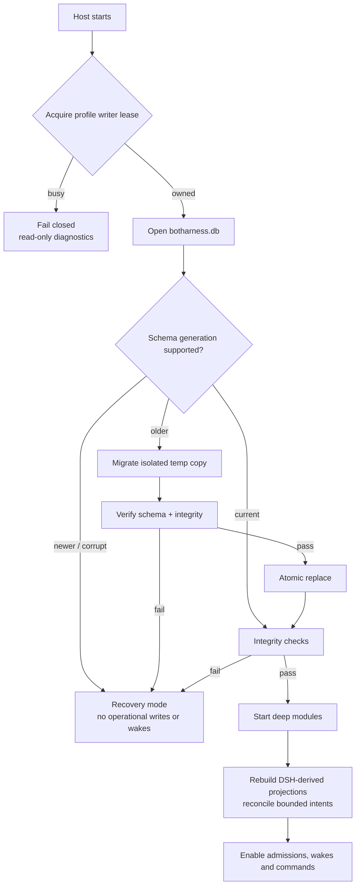
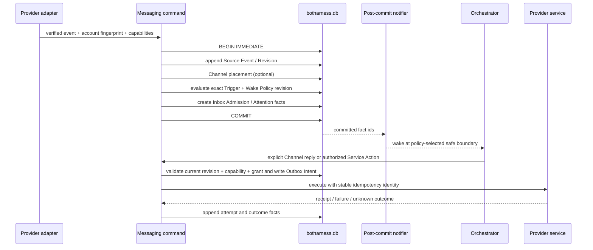
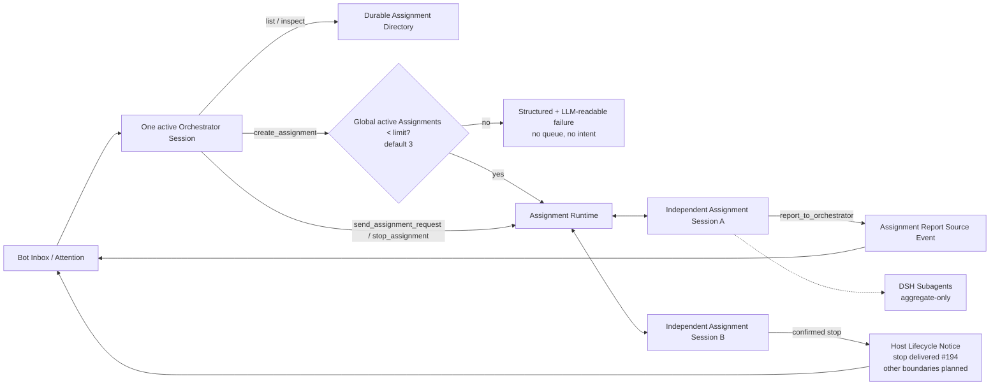
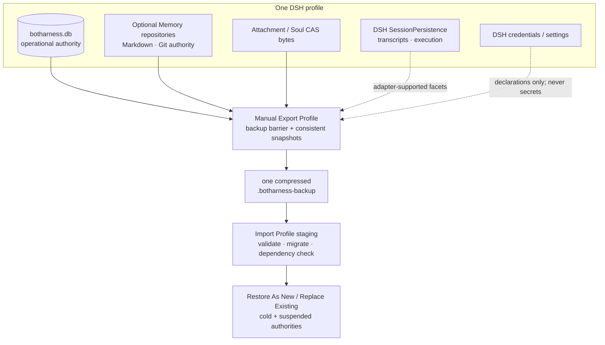

# BotHarness 架构与数据流

BotHarness 是 DSH（DeepSeek Harness）之上的插件层，给 Agent 持久产品身份：**PersonaBot**。PersonaBot 用一个 Orchestrator Session 管理 Inbox，并可同时管理多个独立 Assignment Session；Memory 是 optional capability，Persona 是其中的 optional 内容；两者都不是聊天或执行的前置依赖。DeepSeekBot 是首个应用，提供 roster、Bot Inbox、Assignment Directory、委派和 IM 接入。

本文描述 #71 确认后的目标架构。M1 registry、M2 Memory 与 #66 roster storage 已实现；#77 已验证 DSH runtime seams，显式 Session ownership、Messaging、Assignment Runtime、统一 operational database 和可移植性按 #79–#81 分阶段落地。更新：2026-09-29。

当前 Client UI 由独立 `@botharness/ui` Bundle 挂载，源码仍在 `packages/client`；RC2 的插件图把结尾 `/client` 解释为导出子路径，因此包身份依 [ADR-0066](../adr/0066-rc2-client-bundle-identity.md) 避开该后缀。Client HMR 只暂存当前 Bot/Channel 选择以恢复视图，不复制 Host 中的 PersonaBot、Channel 或消息权威。

产品术语以根目录 [`CONTEXT.md`](/zh/dev/design/context) 为唯一词表；[BotHarness Runtime 架构](/zh/dev/design/bot-runtime) 单独展开 PersonaBot、Bot Inbox、Orchestrator、Assignment 与 DSH execution 的关系。DSH/Cordis 本身的术语和 Plugin 开发决策位于 `/zh/dsh`，不在这里重复定义。

迁移阶段保持可验证：#66 的 `botharness_roster` 是当前 roster 权威；#79 只先建立 `botharness.db` owner，#80 才将 roster 与 Session ownership 单向迁入。目标图表示迁移完成后的所有权，不表示运行时现在已经双写两套存储。

#56 and #137 extend the current roster global slot to `{ pins, hidden?, sectionOrder, topOrder? }`: `pins` canonically orders Channel IDs for both group Channels and PersonaBot DMs, `hidden` omits Channels only from roster navigation while retaining their placement, and `topOrder` mixes section blocks with loose Channels while membership remains owned only by section records. The unary client bridge now has ten arrangement methods, including `topReorder`, `hiddenSet`, and bounded `rosterBatch` (one Host completion notice and one final Client snapshot for multi-select); #80 must migrate this order, hidden presentation state, and single-membership invariant into the database without dual writes. 已提交的 roster mutation 会在 Host commit 后发送 `roster/changed` live invalidation；其他窗口只重读权威 roster，不接收也不复制拖拽中的预览状态。

BOT mode 的折叠 rail 复用这份 Channel 排序读模型：置顶项在分隔线上方，其余 DM 与 group Channel 按 section/未分组的扁平顺序排列。`botharness/channels` 额外投影可选 `latestMessage` 供 hover 摘要使用；该字段从当前 Messaging authority 派生，不成为新的持久化权威。

置顶格也是独立的排序 scope：默认继承全局最近更新／手动模式，可用 `ui-bot-mode.sortModes.pinned` 覆盖；拖动置顶卡片会把当前完整顺序（包括被搜索或隐藏过滤的置顶项）冻结为手动模式，通过 `pinsSet` 持久化，不影响 section 归属或其他 scope 的排序。折叠 rail 使用同一置顶顺序。

Hidden Channel 是 application-defined 的可逆 roster presentation state：它会从展开列表、pin grid、搜索与折叠 rail 中消失，但不会改动 Channel、消息、PersonaBot、Memory 或原 placement。破坏性删除仍受 ADR-0037 的 dependency report 与独立确认约束（#138）。

当前 Channel Chat 的实时显示遵循 ADR-0054：正式消息先写入当前持久化权威，再以该 Channel 的单调 revision 发出进程内通知。#143 的时间线读取遵循 ADR-0061：Host 的 `channelTimeline` 用不透明游标提供 latest / older / newer / around 窗口，Client 仅保留一段连续的按提交顺序排列的可见消息；SQLite Channel placement 的游标解释留在 Host。首次打开 Channel 取最新页；有上次已读锚点时，重开会在锚点附近分页并定位；向上补页维持视口锚点，定位旧消息可前后补页并高亮，并可继续向 newer 分页直至最新消息；用户离开底部后，新消息只更新未读提示，不强制滚到底，也不把实时消息拼接进尚有后续页的旧窗口。旧 `channelMessages` 端点暂作兼容。已选 Channel 通过经过 DSH 认证的 `/api/botharness/stream` SSE 接收已提交消息；重连可回放、缺口则从 Host 修复。同一连接还传送 Orchestrator 显式 `channel_send` 工具参数产生的进程内草稿预览：`channel/draft` / `channel/draft-settled` / `channel/draft-abandoned` 带 attempt ID 与独立于持久消息的进程内草稿 revision；连接时先发送完整 baseline，断档则重读 committed。草稿不从历史回放，不进入 Inbox，提交后由正式消息替换，放弃时移除；呈现层可消费草稿，任何不可逆操作只认已提交消息（ADR-0054）。Human send 使用 Client 生成的幂等 message ID；网络失败时本地气泡保留失败状态，Human 可把原文和附件恢复到 composer 后再次确认发送，而 Host 对响应丢失后的同 ID 重试只接受一次 durable append。Orchestrator 普通 final 与 Assignment 输出不等于 Channel 消息；当前正式 Channel 消息由 SQLite Source Event 与 placement 事务提交，旧 NDJSON 历史只在首次升级时单向导入。Group 中经候选列表选中的多个 Bot mention 在同一事务形成独立 Inbox Admission；Bot 处理状态经同一 SSE 流独立投影。已入群 Bot 的 channel_send 可提交稳定 ID 列表；Host 从可信 Orchestrator ownership 得到发送者，读取当前成员与名称生成 mention 标签，并在同一事务为不同目标建立独立 Admission。Bot-authored Group 消息保留因果根和跳数；同根同目标只投递一次，过限消息保留在群里但不再唤醒目标。收件 Bot 可以在同一群回复，重启后 pending/retryable Admission 仍可恢复。 Group 之外，Bot-to-Bot DM 使用确定性的双成员 Channel ID；Orchestrator 的 `bot_dm_send` 或该 DM 内的 `channel_send` 以可信 Session ownership 确定发送者。每次发送在同一事务中提交 Bot DM Source Event、placement、收件 Bot Admission（受因果根去重与跳数上限约束），以及发送者 Human DM 中只链接原消息的无正文动作提示。重启时恢复 pending/retryable 收件投递；Bot DM 默认不进入 Human roster，但在隐藏频道管理器中可发现、只读打开，Human 无发送或重命名权限。
Group Channel 的气泡收件圆环只投影该消息已有的 PersonaBot Inbox Admission，分母是实际收件者而不是群成员总数。入队是「已投递」；运行时 claim 本身仍显示已投递，直到 observed_at 标记消息进入 Orchestrator 回合上下文才显示「处理中」。若 Bot 通过 Channel 查询主动读到消息而没有进入处理该消息的回合，Admission 保持 pending 但 observed_at 非空，投影为独立的「已读」；回合结束是「已处理」，并不意味着发出了回复。明确忽略、可重试失败和需修复失败各有独立状态。每次权威状态变化通过 Channel revision/SSE 通知并重读该投影，不新建第二套已读存储。Bot 发送者不产生自己的 Inbox Admission，也不进入收件人数。Group 的本机 Human 成员以 Host 固定身份、显示名、加入时间及首个可见 revision 保存在 Messaging 权威中；Human 阅读位置按 Channel ID 与 Human ID 共同持久化。既有 Group 从首条消息起可见，旧 Channel 阅读位置迁移到本机 Human。Host 仅对有可见权限的非作者 Human 投影已读／未读，Bot 状态仍只取 Inbox Admission；同一圆饼与明细展示两种语义，不再从浏览器 tab 或作者推断已读（ADR-0078、#347）。Human 已读推进只广播一条携带阅读 revision 的 Channel SSE；重连时从权威已读位置发送 baseline，Client 用消息的 placement revision 更新当前可见窗口，避免阅读大量历史时逐条广播。当前只支持本地一个 Human；跨账号多人 Channel 仍需独立身份与授权设计（#377）。
Channel 的消息引用（#145）只保存同 Channel 的已提交目标 ID；Human 发送与 PersonaBot 显式 `channel_send` 由同一持久化权威校验，跨 Channel/缺失目标不能产生消息。引用作者和截断摘要在时间线读取时由当前历史投影，不复制为另一份持久内容，也不为每条消息单独读取。目标后来不可见则降级为不可点击提示；点击有效引用复用 `around` 窗口和高亮，不改变相邻消息分组与时间语义。

Channel 附件（#146）以 profile-scoped content-addressed 文件仓库存放真实字节，消息只持久化 `{hash,name,mime,size}` 引用；Host 在 Channel append 前验证该引用确实存在于当前 profile，并由服务器嗅探 MIME。浏览器经 DSH 认证的 exact Fetch 路径分开流式 POST 上传 `/api/botharness/attachment/upload` 和普通 GET 下载 `/api/botharness/attachment`：图片安全内联，其他文件强制下载。Human composer 保留失败附件供重试；PersonaBot `channel_send` 也复用引用校验。Orchestrator 可通过 `channel_read_image` 按 `channel_id + message_id + hash` 读取图片；可信 Host 必须先验证 PersonaBot 已加入该 Channel、消息确实引用该 hash、MIME 为受支持图片且未超限，再把字节提交到 DSH attachment service 作为模型可见图片。历史图片不会被自动塞入上下文，模型也不接触 profile 内部文件路径。未完成上传的临时文件可按保留期清理；已发布对象提供显式的引用感知 mark-and-sweep，由当前持久 Channel 消息提供标记集，且在单个 Host 调用中无异步间隙地删除过期孤儿。自动调度与保留期策略暂不启用。

## 1 · 系统上下文

```mermaid
flowchart LR
  Human["Human<br/>DSH Web / IM"]
  External["Feishu / Lark<br/>webhook / future providers"]

  subgraph Browser["DSH Web Client"]
    UI["DeepSeekBot UI<br/>Roster · Chat · Human Inbox · Assignments · Settings"]
  end

  subgraph Host["DSH Host · single profile writer"]
    API["Client Bridge RPC"]
    Identity["PersonaBot identity"]
    Memory["Optional Memory Service<br/>Service Definition · Git Provider"]
    Messaging["Messaging<br/>Source Events · Inbox · Outbox"]
    Assignments["Assignment Runtime<br/>Orchestrator · Assignment Directory"]
    Transfer["Portability<br/>Export · Backup · Restore"]
    DB[("botharness.db")]
  end

  subgraph DSH["DSH-owned runtime"]
    Sessions["Agent / SessionPersistence<br/>Orchestrator · Assignment Sessions · Subagent"]
    Credentials["Credentials · profile settings"]
  end

  Human --> UI
  External <--> Messaging
  UI <--> API
  API --> Identity
  API -.-> Memory
  API --> Messaging
  API --> Assignments
  API --> Transfer
  Identity --> DB
  Identity -. attachment .-> Memory
  Messaging --> DB
  Assignments --> DB
  Transfer --> DB
  Identity <--> Sessions
  Messaging --> Assignments
  Assignments <--> Sessions
  Assignments -. scoped Consumer .-> Memory
  Messaging -.-> Credentials
  Transfer -.-> Sessions
```

浏览器只通过 RPC 访问 Host read models 和 commands。Provider adapter 只负责验证、规范化和执行能力；它不拥有 Inbox，也不能直接唤醒 Agent。DSH 继续拥有 Agent 执行、SessionPersistence、Subagent 与凭据；BotHarness 不复制这些 runtime 权威。

## 2 · Deep modules 与所有权

```mermaid
flowchart TB
  Root["Host composition root<br/>lifecycle · dependency wiring"]
  DB["Operational Database Owner<br/>writer lease · schema generation · transaction"]

  subgraph Modules["BotHarness deep modules"]
    Bots["PersonaBot<br/>identity · lifecycle · Session ownership"]
    Memory["Optional Memory Service<br/>repositories · Git commits · events"]
    Msg["Messaging<br/>events · channels · inbox · triggers<br/>grants · outbox"]
    Assignments["Assignments<br/>directory · capacity · requests · reports"]
    Usage["Usage<br/>daily token buckets · read model"]
    Portable["Portability<br/>Soul · export · backup · restore"]
    Views["Read models<br/>RPC · UI projections"]
  end

  Root --> DB
  Root --> Bots
  Root -. optional Provider .-> Memory
  Root --> Msg
  Root --> Assignments
  Root --> Portable
  Root --> Usage
  Root --> Views
  DB --> Bots
  DB --> Memory
  DB --> Msg
  DB --> Assignments
  DB --> Portable
  DB --> Usage
  Bots -. attachment .-> Memory
  Bots --> Assignments
  Msg --> Assignments
  Bots --> Views
  Msg --> Views
  Assignments -. scoped Consumer .-> Memory
  Memory --> Views
  Assignments --> Views
  Usage --> Views
  Portable --> Views
```

| Module           | Owns                                                                                                    | Does not own                             |
| ---------------- | ------------------------------------------------------------------------------------------------------- | ---------------------------------------- |
| PersonaBot       | Host-owned ID、display name / role badges、lifecycle、explicit Session ownership                        | DSH Session lifecycle、Memory 内容       |
| Memory           | generic Git-backed repositories、semantic commits、operation events                                     | PersonaBot lifecycle、Inbox、Session     |
| Messaging        | Source Event、Channel placement、Inbox Admission、Attention、Trigger/Wake Policy、Service Grant、Outbox | Agent execution、provider credentials    |
| Assignments      | Assignment Directory、Assignment Request/Delivery Intent、capacity admission、report/lifecycle routing  | DSH transcript、Subagent runtime         |
| Usage            | per-PersonaBot／执行类型／实际模型的保留日统计、usage read model 契约                                   | DSH Session 日志、价格表、金额总账       |
| Workspace Grants | Human 对 DSH Workspace 的授权与撤销、Assignment 创建时的权限快照                                        | DSH Workspace registry、Session 权限实现 |
| Portability      | SoulSnapshot、PersonaBot Export、Profile Backup/Restore/Transfer 协调                                   | credentials、可执行插件、DSH 私有格式    |
| Read models      | 查询、分页、PersonaBot Activity Projection、Human Inbox、UI-friendly projection                         | 业务事实与写入规则                       |

`botharness.db` 是 BotHarness core 的物理事务宿主，不是共享的 generic repository。Memory 内容与 commit 由 optional Git-backed Provider 掌管；每个 deep module 只通过自己的接口拥有表和不变量，跨模块流程由显式 command/port 协调。

Usage 是 application-defined 的保留统计：从 DSH durable SessionEvent 中按实际请求提取 provider／model 与 provider 报告的 input、output、cache-read、cache-write token，按可信 Session ownership 归属 PersonaBot，分别汇总 Orchestrator、Assignment 和 DSH Subagent；同一 Turn 用多个模型时分别入桶，缺失用量标为未知。`botharness.db` 按 `(bot, day, execution role, provider, model)` 保留日汇总，日界取 Host 本地时区；增量折叠必须幂等，普通 Session 删除后不可用剩余日志全表重建或重复计数，彻底清除 PersonaBot 才删除其可识别统计（ADR-0094，#39）。金额由价格表在查询时另行估算，1.0 不落金额总账（#35 留 v1.1）。Browser 只经 read model 查询，不直读 Session 日志或投影表；PersonaBot Profile 的 token 卡是当前消费者（#34 Decisions、#428）。

Model Preset 是部署本地可复用模板；Human 在 Profile 应用时，PersonaBot 保存独立 Model Plan 快照，后续模板编辑不传播到已应用的 Bot。Plan 固定 Orchestrator 的 provider／model／reasoning effort，并定义 Assignment 可用的精确模型、各模型允许及默认的 effort 和默认模型。Host 在每个执行入口按当前 Plan 验证选择，而 DSH SessionEvent 记录实际调用：Orchestrator 的变更在当前 Turn 结束后生效，已有 Assignment 保留当前路由，之后的显式切换按最新 Plan 校验；新建 DSH Subagent 默认继承仍获允许的父路由，否则选当前 Assignment 默认并告知父 Agent。不可用或有歧义的路由停止请求，交由 Human 修复，不静默回退。Model Preset 与 Model Plan 可进入保持身份的 Profile Backup，不进入 SoulSnapshot 或 PersonaBot Export（ADR-0027、ADR-0093，#488）。

application-defined Memory Service 使用 `Consumer → Service Definition → Provider` capability seam。每个 PersonaBot 都有一个 Git-backed Memory Repository，Orchestrator Session 固定以它为 working directory。当前检出的工作树文件立即是记忆，无论是 Markdown、代码还是二进制文件。Agent 通过原生文件、搜索、Shell 与 Git 能力读写仓库；没有面向模型的 Memory CRUD 工具。新建 PersonaBot 时可选择空白记忆，或由 Host 检查 Git 并以 HTTPS/SSH 地址在暂存目录克隆远端仓库；克隆成功才建立 Bot，远端当前分支及文件立即成为记忆（#298）。私有仓库使用 Host 已配置的 Git 凭证，不经创建页面收集密钥；已有 Bot 仍通过原生 Git 整合远端仓库。外部仓库应合并、替换或放到其他位置若有歧义，Orchestrator 经 DSH 原生 Ask Question 询问 Human。分支、合并与冲突由 Git 决定；Git 改变工作树后，同一 Session 立即看到新文件，但该 Session 已冻结的 Persona prompt 不追溯更新（ADR-0060）。跨设备延续沿用同一路径：Orchestrator 按 Human 请求用原生 Git 与 Human 自配置的远端同步，新设备以 Git URL 创建新的 PersonaBot；不操作 Git 的所有者使用 PersonaBot Export / Profile Backup，而不是 Host 持有的同步服务或一键同步（ADR-0084）。

Memory Service 拥有 repository identity 和 lifecycle、可信 Session ownership、受限的 UI 查询，以及审计/恢复检查点。成功回合后，它可以把观察到的 HEAD 与可信 Source Event、Session actor 记录下来；观察不会暂存、提交或隐藏工作树文件。当前文件与历史以 Git 仓库为权威，数据库 ledger 只是辅助记录。PersonaBot DM 的 Channel sidebar 分为「记忆文件」和「记忆演化」：前者以可展开目录树展示当前工作树，选中文件后在 Channel body 只读查看文本或二进制提示；后者展示所有本地分支及可达提交的 Git graph，选中 commit 查看完整 diff。当前差异默认按「新记忆／已有记忆的更新」对文件去重，切换并持久保存 Git 术语后，显示可折叠的未暂存、已暂存和未跟踪分组及状态标识。打开视图时定时读取、窗口重新聚焦时立即读取外部编辑，侧栏折叠标题栏也有刷新按钮；查询不暂存或提交（ADR-0088）。Human 文本保存服务仍先比较当前 HEAD，再显式生成 Git commit；普通导航不提供页内编辑。Memory 文件查询阻止访问 `.git` 控制路径及指向仓库外的符号链接，但不限制 Git 可保存的文件类型。旧 Repair 归档与检查点记录仍保留兼容；普通未提交改动不会阻止下一回合或强制修复（ADR-0068）。

## 3 · Host 启动、迁移与 recovery

```mermaid
flowchart TD
  Start["Host starts"] --> Lease{"Acquire profile writer lease"}
  Lease -- "busy" --> ReadOnly["Fail closed<br/>read-only diagnostics"]
  Lease -- "owned" --> Open["Open botharness.db"]
  Open --> Gen{"Schema generation supported?"}
  Gen -- "newer / corrupt" --> Recovery["Recovery mode<br/>no operational writes or wakes"]
  Gen -- "current" --> Integrity["Integrity checks"]
  Gen -- "older" --> Copy["Migrate isolated temp copy"]
  Copy --> Verify["Verify schema + integrity"]
  Verify -- "fail" --> Recovery
  Verify -- "pass" --> Activate["Atomic replace"]
  Activate --> Integrity
  Integrity -- "fail" --> Recovery
  Integrity -- "pass" --> Modules["Start deep modules"]
  Modules --> Rebuild["Rebuild DSH-derived projections<br/>reconcile bounded intents"]
  Rebuild --> Ready["Enable admissions, wakes and commands"]
```

一个 DSH profile 同时只允许一个 BotHarness writer。所有 module migration 合并成单调递增的 Schema Generation；迁移只在临时副本上完成，校验后原子替换。打开、迁移或完整性检查失败时进入 recovery mode，不回退到 NDJSON、storage domain 或内存写入。

## 4 · Messaging 事务与外部副作用

```mermaid
sequenceDiagram
  participant P as Provider adapter
  participant M as Messaging command
  participant DB as botharness.db
  participant N as Post-commit notifier
  participant O as Orchestrator
  participant X as Provider service

  P->>M: verified event + account fingerprint + capabilities
  M->>DB: BEGIN IMMEDIATE
  M->>DB: append Source Event / Revision
  M->>DB: Channel placement (optional)
  M->>DB: evaluate exact Trigger + Wake Policy revision
  M->>DB: create Inbox Admission / Attention facts
  M->>DB: COMMIT
  DB-->>N: committed fact ids
  N-->>O: wake at policy-selected safe boundary
  O->>M: explicit Channel reply or authorized Service Action
  M->>DB: validate current revision + capability + grant and write Outbox Intent
  M->>X: execute with stable idempotency identity
  X-->>M: receipt / failure / unknown outcome
  M->>DB: append attempt and outcome facts
```

Source Event 是内容唯一权威；Channel 和 Inbox 都只保存关系。Reply 使用可信 Reply Route 自动选择来源 provider；主动发布属于 Service Action，必须同时满足 Provider Capability 与 Human Service Grant。SQLite 事务只覆盖本地事实；外部副作用使用 Outbox Intent、幂等标识和有界 reconciliation，不宣称 exactly-once。不可证明的结果进入 `unknown-outcome`，由 Human 处理。

Wake Policy 决定何时让 Orchestrator 看见新 attention：当前 step 完成后的安全边界、当前 turn 结束后，或 idle 时启动新 turn。普通外部消息不打断正在执行的 model/tool step；只有 DSH 明确支持且策略授权的控制路径才能 steer。就绪的 attention 按回合收割：忙碌期间新到的事件只把就绪集合置脏，当前回合结束（即空闲）时由一次 harvest turn 消费全部就绪项；主动 steer 只用于直接 @ 与 DM（ADR-0077）。

### Bot 之间的 Channel 协作（ADR-0065）

Orchestrator Session 中注册的 `group_attention_get` 与 `group_attention_set` 是 DSH model-facing Tool，消费 BotHarness Host 的 application-defined Channel capability；Host 从该 Session 所属 PersonaBot 确定 actor，并在读写时复核当前 Group membership。未保存的 Group 偏好只读为 digest 5 条／30 秒、revision 0；Human Bridge 写入和 Bot Tool 写入共用 Channel record 中的 `wakePolicies`，每次实质变更在同一 SQLite 事务里追加不可改写的 actor／时间／revision 审计事实。审计表只存历史，不作为第二套当前偏好；Admission 在消息提交时固定有效策略与 revision，不会随之后的编辑回写。

#366 把 Human DM、Bot DM、群内提及、普通群消息、入群邀请与申请流程、Assignment 报告及生命周期的内建来源规则写成每个 PersonaBot 本地的不可改写修订事实。Host 在建立新 Inbox Admission 的同一事务里读取对应规则并保存来源规则 revision／wake 快照；既有 Admission 不回填。普通群消息的来源默认值沿用 5 条／30 秒 digest，适用的 per-Channel `wakePolicies` 覆盖仍保留在 Group Channel record；Assignment 进度报告仍按报告状态与回复请求决定是否即时唤醒。资料页经 Host Bridge 查询所有有效规则、修订及最后修改者。来源类别修订与 Channel 覆盖分属不同作用域。

#370 的 `source_attention_get/set/reset` 是仅对所属 PersonaBot 可见的 Orchestrator Tools，Human Profile 通过 Typert/API Gateway Bridge 编辑同一 `bot_source_policy_revisions` 修订权威。v1.0 可编辑来源为 `assignment-report`（`conditional`／`immediate`）与 `group-ordinary`（`immediate`／`digest`／`mentions`／`silent`，汇总条数及间隔有界）；两者始终 `admit`。`human-dm`、`bot-dm`、`group-mention` 保持即时送达，`group-invite`、`group-join-request`、`group-join-decision`、`assignment-lifecycle` 保持即时工作流通知；这些来源在当前没有安全的延后／静默收割语义，因此只读，Bot Tool 与 Human Bridge 都拒绝其修改。删除可编辑覆盖以带 Human／Bot actor 的新修订恢复内建默认，不删除历史；后提交的 Admission 才读取新修订。Orchestrator 真正启动时为所纳入的来源类别追加不可改写的 wake-attempt 事实，近七天计数从这些事实投影，而非把 Admission 数或汇总阈值当作唤醒次数。Group Channel 的普通消息覆盖继续独立存于 Channel record，优先于 PersonaBot 来源默认值；冻结规则按 ADR-0076 延后。

Attention 已交付契约（ADR-0070/0074/0077、#364）：四档偏好均为普通群消息保留该 Bot 的 Inbox Admission。`mentions` 不自行唤醒，但同群直接 @ 可带入有限的待处理上下文；`silent` 不自行唤醒，也不搭乘 @，只在 Bot 显式读取时进入本轮。群聊触发 harvest 时同时选择触发消息附近的上下文与最早待处理的一段；单群至多 100 条，并受整轮文本/token 预算约束。提示中明确省略数量与继续读取位置，未选中消息保持待处理，后续合格轮次继续从最早处推进。`channel_read` 只把实际返回并进入本轮的 Admission 纳入处理集合：进入本轮显示处理中，成功结束才已处理，失败显示需修复。内部 observed 保留审计用途，不新增常用“完成”工具，也不把 Human 打开 Channel 当作 Bot 处理。#362 的通用多来源 Inbox Trigger 与 Attention 聚合仍待后续切片。

当前 #47 首个高流量 Group 切片把每位成员的普通消息 Wake Policy 写在 Channel record；该 preference 归 Bot 所有，Bot 可用自己的工具读写（含 count/interval），Human 可在成员侧栏查看并覆盖；四档：`all`（每条普通消息即时成为 attention）、`digest`（N 条 / T 秒汇总；默认）、`mentions`（只有直接 @ 到达）、`silent`（记录但不唤醒、也不搭车，只能显式读取）（ADR-0074）。任一模式下，普通消息作为 Source Event 与该 Bot 的 `group-ordinary` Inbox Admission 在同一 SQLite 事务中提交，Admission 固定当时的 policy revision；即时模式逐条就绪，汇总记录阈值，mentions 与 silent 记录空阈值。未保存偏好时采用 digest 的默认阈值，保留已保存的模式与 revision。直接 @ 走独立的即时 Admission，不等待汇总。Host 在达到数量或时间上限后把该 digest 批次标记为就绪；忙碌期间新到的即时项不再各自排队，只标记就绪集合，当前回合结束或空闲时由一次 harvest turn 消费全部就绪项（ADR-0077）。直接 @ 与 DM 默认 steer：有活动回合时在下一个安全 step 注入，否则并入下一次 harvest。重启从 pending/retryable Admission 重建计时，收割只把实际纳入 Orchestrator context 的 Admission 标为处理中，回合成功结束才标为已处理；Bot 通过 `channel_read` 明确读取到的普通群消息也加入该回合，成功后标为已处理，失败则需修复，未返回的消息保持待处理；是否向 Channel 回复仍由 Bot 决定。静默收件为普通消息保留待处理 Admission，但不设置汇总阈值，不自动唤醒，也不进入 harvest；只有显式 `channel_read` 才会进入本轮处理，直接 @ 仍即时。归档中的 Bot 在消息提交时不产生新的 Inbox Admission；群消息与其他活跃 Bot 的收件仍独立提交。唤醒处理按 Source 类别而非平台分类：外部平台在 Bridge 边界归一化为 Source Event，运行时只认 Source 类别与 admission reason（ADR-0075）。Bot 自管自己的 attention policy（来源类别规则 + per-Channel 覆盖 + count/interval），Human 可覆盖；冻结规则按 ADR-0076 延后，安全闸门不属于 policy。通用多来源 Attention 聚合与 Inbox Trigger 仍待后续切片。

当前 Bot-scoped botAttention Bridge 查询直接从 Inbox Admission、Source Event、Channel placement 与 Assignment Directory 投影有界页，按 Source Event 时间与 ID 排序，返回状态、发送者、摘要以及可用的 Channel 消息或 Assignment Session 引用；它不另建收件内容。Assignment Report 与 Source Event 在同一事务中形成该 Bot 的 Inbox Admission，并带报告状态；报告进入 Orchestrator 回合时记录观察，回合完成后标记已处理，是否向 Channel 回复由 Bot 决定。重启后未观察的到期报告可唤醒一次，已进入回合却中断的报告显示需要修复。Human–PersonaBot DM 的 Channel sidebar 在有事实时显示 Bot Inbox entry，按来源 Channel 或 Assignment 分组，待处理项展开，已处理和明确忽略的历史折叠；Bot 在收到或读取某条 Channel 消息后可用 `inbox_ignore` 明确忽略，决定写在同一 Admission 上并保留消息历史；普通回合完成但不回复仍是 handled，阅读本身不自动写入长期 Memory。点击来源消息复用 Channel timeline 的 around 定位，点击 Assignment 报告打开事项详情。Group Channel 不显示该 entry；Human 查看侧栏不改变 Bot 的观察事实（ADR-0070、#47、#152）。

Human Inbox 的首个可运行切片在 Bot mode 左侧栏的 Messages 上方提供独立入口，默认显示待 Human 处理的群聊加入申请、仍存活的原生提问和工具审批，可切换到新 Bot→Human DM 消息。提问项只在 DSH 原生请求仍等待 Human 答复，工具审批项只在 BotHarness 审批请求仍存活、且 Channel 内没有答复、取消或审批决定时出现；打开后定位到对应私聊卡片。事项的最新报告为 `waiting-human` 且 open ask 仍存活，或报告为 `blocked` 且尚未解决时，Human Inbox 从 Assignment Directory 投影同一条按 Session ID 稳定标识的待办；状态升级为受阻时更新摘要与报告来源，不重复建项。Orchestrator 回复后事项运行期间暂隐藏该项；若事项再次空闲或出错但没有新的解除受阻报告，待办继续显示。打开后进入该 Bot 私聊并展开事项详情；完成报告或停止事项后待办消失。事项完成报告则按最新 Source Event 投影到“仅供了解”，Human 可打开来源或忽略该份报告；忽略决定单独保存 Source Event ID、决定与时间，新报告仍会出现，不复制 Inbox 内容。Host 从 Channel record 中的待处理申请、Source Event/Channel placement 以及 Human 的 Channel read position 投影列表，不另存 Inbox 内容；批准或拒绝沿用 Group 决策事务，已了解沿用 Channel 已读位置。查询按时间与稳定 ID 分页，并把游标绑定到分类、Bot/Channel 过滤条件与排序方向；Client 在切换范围时丢弃旧响应。Bot 的 Channel Admission 进入 needs-repair 时，同一权威按受影响 Bot 与 Source Event 投影一条待办；Human 可打开 Bot Inbox 或来源消息，来源 Channel 已删除时降级到 Bot Inbox，修复状态解除后待办消失。Workspace Grant 请求也从 Bot DM Source Event 投影为待办；新提交的回复只有带有效 Grant 引用才会清除，历史已存储的本地化授权文字回复仍按兼容规则识别；unknown-outcome、rebind 与 readiness 等原因仍待各自的 typed Attention facts（ADR-0071、#126）。

Bot-to-Bot DM 是两个 PersonaBot 参与的真实 `dm` Channel。Bot A 通过可信 Session ownership 以自己的 Actor 身份向 B 发送消息；Messaging 在同一权威中提交 Source Event、Channel placement 与 B 的 Inbox Admission，Bot-hop guard 限制循环，A 不接收自己的输出。Human 可以只读打开此类默认不在 roster 显示的 Channel，但不会成为第三位成员。A 每次向非 Human DM Channel 发出已提交消息时，其 Human–A DM 都会出现居中的动作 chip，指向这次发信与可查看的对话，而不复制正文。

Human–A DM 里选中 `@B` 会在 Human 消息中持久保存 B 的稳定 ID 与文字范围；Host 在 A 的 Orchestrator 回合组装输入时重新读取 B 的当前名称与最多 400 字的简介，并把它们作为有界联系人资料提供给 A。重名靠 ID 区分，改名采用当前资料，已归档或失效的目标在发送时被拒绝；手打或粘贴的 `@名字` 只是普通文字。此操作不唤醒 B 或改变 DM 成员；只有 A 后续显式发送 Bot-to-Bot DM 消息才触发 B 的 Inbox。Group Channel 中 Human 或已加入的 Bot 可 `@` 已加入的 Bot；一条消息仍只有一个 Source Event，每位目标 Bot 独立获得 Inbox Admission。Bot 创建 Group 时，Host 从 Orchestrator ownership 确定创建者，初始成员只有该 Bot；创建者可邀请活跃非成员 Bot。邀请状态存于同一 SQLite Channel record，创建待处理邀请、无 Channel placement 的 system Source Event 和受邀 Bot 的 `group-invite` Inbox Admission 在一个事务内提交。邀请携带可信的 Bot 协作跳数和受邀 Bot 的创建时间，跨 Bot 唤醒不重置循环限制，删除后重建的同名 Bot 也不能继承旧邀请。受邀者收到自己的 DM 上下文中的邀请 prompt，但在接受前没有 Group read/send 权限；接受把 membership 与邀请状态同时更新，拒绝不增加成员。Bot 模式提供默认开启的 Group 邀请自动接受（ADR-0073）：开启时 Host 代受邀 Bot 接受、不启动唤醒；关闭时保留上述逐邀请决定。重复邀请与重复同向决定幂等，归档目标时取消待处理邀请，重启时恢复仍待处理的 Admission。创建者可改群名、移出其他 Bot 成员；任一已入群 Bot 可用 `group_leave` 自行退出，成员关系在同一 Channel record 中更新，读写权限立即撤销，待处理群消息不再唤醒它；若创建者退出，Bot 管理权消失、成员界面标明由 Human 管理，其余成员与历史仍保留。Bot 自主退出或任何现有移出成员操作，都会在同一事务中提交一条 Host 撰写的群内成员变动消息，分别记录“离开”和“被移出”的类型与正文，供留在群内的人查看，并给每位仍在群内且活跃的 Bot 建立独立的普通消息 Inbox Admission，记录各自当时的 Channel 注意力偏好；退出者没有 Admission。all 可即时唤醒，digest 到达数量或时间条件后唤醒，mentions 可随之后的直接提及进入回合，silent 仅在显式读取时处理。进入回合的成员变动提示标明 Channel system，Bot 可按需回复。提交后的界面实时发布与 Bot 唤醒彼此独立；唤醒通知失败时运行中的 Bot Runtime 按有界退避重试持久 Admission，重启后仍由启动扫描恢复。Human 的群聊侧栏将成员名单与群管理分区：成员区标题的加号打开可搜索的邀请弹窗，带待办数字的铃铛打开邀请与入群申请处理弹窗；成员行左键打开 Bot 私聊，右侧菜单或右键菜单提供私聊、消息提醒策略弹窗与移出群聊。群管理区只呈现群头像、群名，次级菜单提供解散命令；Human 裁切 1:1 头像后将有界 WebP 图像写入同一 Channel record，Host 仍校验图像。邀请仍通过同一 Channel 邀请事实及 Bot Inbox Admission；Human 独占整群逻辑删除命令。Human 发起的邀请在 Bot 接受前不授予群访问权限；删除撤销成员访问，保留 Source Event 等运行证据而不作破坏性清除。首个 Group Human `@` 切片是 #254，后续协作切片由 #278 组织。

Human 在自己的 PersonaBot DM 输入框中从 `#` 候选选中 Group，消息才记录稳定 Channel ID 与选中文字范围；Human 已发消息中的引用可点击进入该 Group。Host 在该 Bot 的 Orchestrator 输入中重查当前名称，非成员只收到 ID、名称和是否已加入，不读取成员或历史，普通手打的 `#名称` 没有引用身份。Bot 可在该 Human DM 所触发的回合用 `group_join_request` 请求加入选中的 Group；请求本身不会改变 membership。待处理申请保存在同一 Channel record，Bot 创建者收到独立的 system Source Event 与 Bot Inbox Admission，Human 在成员区通知弹窗可批准或拒绝，创建者可用 `group_join_decide` 决定。首个决定与成员更新、申请者的结果通知在本地事务中提交；申请者收到结果后才能按现有成员规则使用 `channel_read` 和 `channel_send`。重试、重启、改名、同名群都使用稳定 ID；归档申请者或删除群会取消待处理申请（ADR-0069、#292）。

Orchestrator 的应用定义 channel_list 工具从当前 PersonaBot 的 Session ownership 派生身份，只返回其已加入的 Group、Human DM 和 Bot DM；可按名称、Channel 类型、稳定 Bot 成员 ID 筛选并分页，结果带当前成员身份。它是 canonical Channel record 的授权查询 Consumer，不创建第二份成员目录。Bot 用返回的稳定 Channel ID 调用 channel_send；发送时仍重新检查当前成员资格，旧查询结果不会授予访问权。应用定义的 channel_read 查询在成员校验后对该 Channel 的完整有序消息历史应用正文、作者及日期过滤，再返回有界游标页；回复预览仍解析自原消息，不因过滤失去引用。`channel_read(scope=joined, text=...)` 对当前已加入的 Channel 进行跨频道正文搜索，结果按时间与稳定 ID 排序并分页；成员关系变化会使旧游标失效。原先仅扫描每个 Channel 最近 200 条的 `channel_search` 工具已移除，Bot 不再面对两个含义重叠的搜索入口。

## 5 · Orchestrator 与 Assignment control plane

Human 不负责创建或选择执行 Conversation。Human–PersonaBot DM 是 Human 与该 Bot 直接对话的入口：消息先成为 Source Event，经 Bot Inbox 交给 Orchestrator；Orchestrator 再决定直接回复，或在授权与 capacity 内创建、复用和管理多个 Assignment Session。普通 Orchestrator assistant final 只留在 DSH SessionPersistence；只有显式 Channel messaging command 才产生 Human-facing Channel message。该 command 从可信 Session ownership 推导 PersonaBot Actor，并验证目标 Channel membership，不接受模型自报 bot id 或 author。右侧「会话」只投影明确归属该 PersonaBot 的独立 DSH 根 Session，包括 Orchestrator 与 Assignment，不展示 Subagent；归属与角色来自 Session Ownership，标题、工作区及实时运行状态来自 DSH 原生 Session 目录，不以 cwd 推断归属（ADR-0072）。

Workspace Grant 是 application-defined 的持久授权记录：Human 通过 DSH 的 Host 目录选择器或绝对路径输入添加一个现有文件夹，由 DSH Workspace registry 解析真实路径，再为 PersonaBot 创建 Grant。Orchestrator 的 cwd 始终是自己的 Memory Repository；它可读写 Memory，并可读取所有当前有效 Grant 的项目目录，但不能直接写项目目录或自行创建 Grant。每个 Assignment 选择一个有效 Grant，固化 Grant ID、Workspace ID、单一 primary cwd 与权限快照，只能读写所选目录。撤销 Grant 会阻止两个角色后续的文件访问及该 Grant 的新事项创建、请求和恢复；历史 Session 不因重新授权而复活。授权列表中 Memory 是固定内部目录，项目目录可添加、撤销，撤销不会删除 DSH Workspace 或磁盘文件。DSH 原生 workspace-write 仅限制部分写入并不隔离读取，且可能允许临时目录写入。BotHarness 在最终 Tool guard 对 DSH 原生 read、read_image、write、edit、str_replace_editor、glob、grep 的路径按当前 Grant 校验：Orchestrator 可读 Memory 与所有有效 Grant、只可写 Memory；Assignment 只可读写固化的单一有效 Grant。Shell、terminal 等无法从参数证明文件范围的原生工具在 `tools/pre-execute` 暂停当前调用，经 DSH `approval/request` 在 PersonaBot DM 展示完整输入，由 Human 对这一次调用批准或拒绝；仅 Orchestrator 在真实 Memory 根目录运行字面量 `ls -la` 或 `pwd` 是可直接核对的只读目录检查，直接放行；批准不等于目录隔离，调用可能访问授权目录之外。缺少、取消或无法展示的审批均拒绝。批准后最终 guard 仍重查当前 Session 和 Grant，并消费仅属于这次调用的批准标记；撤销会让待审批卡立即失效且不能再批准，已开始执行的调用可能完成，撤销阻止之后的 Assignment 调用。Human 可在审批卡保存 Tool Approval Rule：精确规则匹配工具名与完整输入，宽规则只适用于同一 Bot、角色及有效 Grant 范围内的不透明原生工具；每次命中仍经 DSH `approval/request` 给出独立的 `allowed-once` 审计，撤销规则或改变 Grant 范围后不再命中。每个 PersonaBot 的 Assignment Access Preset 默认为 `workspace-write + ask`；Human 经二次风险确认可为**之后新建**的事项启用 `danger-full-access + never`。该模式不改变 Orchestrator 或已有事项，也不取消事项创建及后续调用所需的有效 Grant；它让危险事项在该前提下绕过路径与不透明工具审批（ADR-0067）。

当所需项目尚无有效 Grant 时，Orchestrator 可通过专用工具在自己的 DM 提交一条持久授权请求卡；该工具只能请求，不能发放 Grant，也不会预建 Assignment。Human 在卡上用 Host 目录选择器选定文件夹后，现有 Workspace Grant authority 校验并写入授权，再由 Human 的明确回复成为 DM Source Event，唤醒同一个 Orchestrator Session。回复携带经 Host 核验的请求消息 ID 与有效 Grant ID；Human Inbox 从请求和回复 Source Event 投影一条待办，普通回复不解除，授权回复解除。升级前已保存、无结构化引用的授权回复沿用原有文案判定以兼容历史消息；新发送的同类文案必须携带有效 Grant 引用。Orchestrator 重新列出有效 Grant，随后才用选中的 Grant 创建 Assignment；卡片和授权记录是不同的持久事实。普通 Assignment Ask 仍先回到 Orchestrator。Orchestrator 遇到 Human 未指明的 Memory 分支选择时，调用 DSH 原生 `ask_user_question`；BotHarness 在该 Agent 作用域的 `user-questions/request` waterfall 中提交持久 Channel 提问卡，Human 的选项或自定义回答经同一 DM 回到原生 Service，使同一 Session 继续。卡片保留来源 Session，回答和取消各有持久消息；停止、重启或旧请求不得再次回答。明确目标直接切换，不提问。Assignment 不直接向 Human 使用此原生工具，仍通过 Orchestrator 转问。

右侧是 Channel sidebar（ADR-0053）：group Channel 显示成员与 Channel 管理 entries，Human–PersonaBot DM 显示该 PersonaBot 的 entries（会话、Memory、Bot Inbox、Computer 等）；entries 由统一注册 seam 提供、可折叠、按声明顺序排列，未注册或不可用时直接不显示而不是占位。Chat 始终是中间的 Channel body。「会话」默认平铺当前 Orchestrator 与活跃、待关注的 Assignment，「全部」保留已停止的历史 Session；Human 可切换平铺或按工作区折叠分组，每个 Bot 的范围、布局与折叠选择仅保存在本浏览器。点击行使用 DSH 原生 `UiWorkspace.openSession` 打开对应 Session，而不是维护一份只读事项详情。归属该 Bot 的根 Session 可通过原生标题栏及 Session 菜单返回 Bot 私聊；空闲时左侧标题前显示 Bot 头像，运行状态及日程标记仍优先显示。Assignment Directory 继续持有 Grant、续接、报告、停止、并发及审计事实。

点击 Human–PersonaBot DM 头部头像打开 **PersonaBot Profile**（ADR-0085）：compact 的 **Profile popover** 只显示 Human pin 过的 **Profile Card**，其中「查看详细」把 Channel body 暂时换成 **Profile view**（替换聊天历史与 composer），退出即回到 Chat；Profile view 同时是 Display name 与 Avatar 的编辑入口。Profile Card 由新的 client 侧 Cordis registry 注册（有序、可增删、scope-aware），1.0 内置 token 用量、事件活跃、Memory commit 活跃与累计值卡片；pin 集合是 client-local 的全局呈现状态，未知或不可用的卡片不显示。Channel sidebar 完全不受影响；group Channel 1.0 不提供 Profile，群活跃留待后续（#424）。自定义 Avatar 是有界 data URL 存在 `bot.json`（512×512 WebP、解码 ≤128 KiB、magic-byte 校验、拒绝远端 URL），经带缓存校验的认证读取 route 提供，缺失或损坏时确定性回退 identity-seeded Blobatar（ADR-0086）。

模型配置目标在 Profile 顶部提供紧凑的预设切换，详细的单 Bot 快照编辑置于活动图表下方的折叠区或弹窗；用量图表默认显示近 26 周，也可切换时间范围并查看累计值。Profile 的实际模型用量与配置的可用模型分开呈现，后者不冒充已经发生的调用（#488、#39）。

Computer 是 profile 级共享资源（ADR-0051）：运行时由 Computer Provider 管理（容器、观看、导出），工具面由注册在官方 `ctx.computerUse` seam 上的 Computer Tool Provider 提供（ADR-0079）。只有 Human 为某个 PersonaBot 打开 **Computer Access** 时，精选的观察/动作/验证工具与指引才注入它的 Orchestrator 与 Assignment 会话作用域；每个会话的首次动作经 DSH 原生审批询问 Human 一次（profile 开关可自动允许），每次观察与动作都以脱敏的 **Computer Audit** 记入 `logs.db`（ADR-0080）。容器内的 pinned Cua Driver 经 `docker exec` 的 stdio MCP 连接；Computer 未运行时工具返回可读错误，不威胁 Host 启动。

Browser 同样是 profile 级共享资源（ADR-0089）：可选 `@botharness/browser` Bundle 运行一个受管的 **Bot Browser**——优先复用机器上已装的 Chrome/Edge 加专属 profile（`$DSH_HOME/botharness/browser`），机器上没有可用浏览器时按需安装 version-pinned Chrome for Testing（`$DSH_HOME/botharness/browser-chromium`），CDP 端点收在 loopback，Human 可在窗口里登录一次。只有 Human 为某个 PersonaBot 打开 **Browser Access** 时，工具与指引才注入它的 Orchestrator 与 Assignment 会话作用域；只读的 `browser_open` 与 `browser_observe` 已交付，每个会话的首次动作走与 Computer 相同的原生审批（profile 开关可自动允许），每次观察与动作以脱敏 **Browser Audit** 记入 `logs.db`；每个 Bot 拥有自己的 **Bot Tab**（窗口与标签是可见性作用域，不是安全边界，ADR-0091）。Browser entry 已提供该 Bot 标签的实时画面、`browser_screenshot`（只作为 model attachment，绝不进审计）与 Human **Browser Takeover**（暂停该 Bot 的动作与模型截图）；交互工具（click/type/press_key/scroll/wait）与多标签管理（`browser_tabs` list/open/select/close、后台标签、空闲收窗）已交付，ref 过期以"重新观察"错误收场。浏览器未运行时工具返回可读错误；container target 与 profile 导出留待后续阶段。

```mermaid
flowchart LR
  Inbox["Bot Inbox / Attention"] --> O["One active Orchestrator Session"]
  O -->|"list / inspect"| Dir["Durable Assignment Directory"]
  O -->|"create_assignment"| Gate{"Global active Assignments < limit?<br/>default 3"}
  Gate -- "no" --> Error["Structured + LLM-readable failure<br/>no queue, no intent"]
  Gate -- "yes" --> Runtime["Assignment Runtime"]
  O -->|"send_assignment_request / stop_assignment"| Runtime
  Runtime <--> W1["Independent Assignment Session A"]
  Runtime <--> W2["Independent Assignment Session B"]
  W1 -->|"report_to_orchestrator"| Report["Assignment Report Source Event"]
  W2 -->|"confirmed stop"| Notice["Host Lifecycle Notice<br/>stop delivered #194<br/>other boundaries planned"]
  Report --> Inbox
  Notice --> Inbox
  W1 -.-> Sub["DSH Subagents<br/>aggregate-only"]
```

Assignment Session 是 DSH independent root，以 DSH `sessionId` 为 canonical identity；Continuity Key 只是 PersonaBot-local alias。Orchestrator 通过五个工具 `list_assignments`、`inspect_assignment`、`create_assignment`、`send_assignment_request`、`stop_assignment` 管理它们。Assignment Agent 只能用 `report_to_orchestrator` 向 Orchestrator 回报；其 Agent Scope 没有 Channel send capability，普通 final 也不会写入 Channel。v1 没有 Assignment-to-Assignment 直连、广播或等待队列。

报告超过 2 KiB 时，Assignment Runtime 在提交 Inbox Admission 前把完整文本交给 DSH Spill Service 保存，并只将前缀预览、字节数、不透明 locator 与 provider 的检索提示写入 Assignment Directory、Source Event 和 Bot Inbox；单份报告上限为 1 MiB。Orchestrator 的 `inspect_assignment` 可通过 DSH Session Query 读取该事项最近四条原生日志事件（最多 12,000 个字符），也可指定 `report_offset` 从已接收报告的原生 `tool/call` 事件每次读取至多 2,000 个字符，并通过 `nextOffset` 继续；两种读取均先核实事项归属，返回查询条数、实际读取量与估算 token 成本。Spill Service 仅负责保存且 locator 对消费者不透明；Orchestrator 即使不能直接读取本地 Spill 路径，也能通过 Session Query 找回该报告，不额外建立一份全文报告数据库。

Agent 可自行选择发送内联报告，或先写入其工作区文件并报告路径；超长内联报告由 Host 自动处理，不触发额外提问。

当前 `stop_assignment` 通过 DSH `Agent.cancel({ kind: "user" })` 取消活动回合并清空待执行输入；BotHarness 先持久记录「停止中」，待 Agent 静止后在同一事务里记录「已停止」和 Host 来源的 Lifecycle Notice。通知进入该 PersonaBot 的 Bot Inbox，Orchestrator 可在私聊报告停止结果；未观察的通知在 Host 重启后恢复，已交给 Orchestrator 但在运行中中断的通知标为 needs-repair，以免重复执行不确定的副作用。停止的事项不再接收请求或迟到报告，其 Continuity Key 可用于新 Session；取消不销毁 DSH Session 历史。其他结算边界的通知和 Attention/digest 仍由 #194 后续切片交付。

Assignment Request 的 `context-update`、`next-step`、`next-turn` 分别映射到经过验证的 DSH inject、steer、followup seam；普通请求不 cancel 当前 step。跨 SQLite/DSH 边界只保留最小 Assignment Delivery Intent，重启时有界 reconciliation；歧义进入 `needs-repair`，不扩张为通用 workflow engine。

### 5.1 · PersonaBot activity、事件与 renderer

DSH 失败的 `turn/end` 仍是执行事实权威；BotHarness 在所属 Orchestrator 或 Assignment 回合结束并判定失败后，由 Host 向对应 PersonaBot DM 提交一条带 role、Session ID、错误码、可用 HTTP status、简短错误详情和事项上下文的 application-defined failure notice。该消息是面向 Human 的持久通知，不把 SessionEvent 全文或工具日志复制成第二套执行历史；Client 把它渲染成可读的失败卡，刷新后从 Channel authority 恢复。Orchestrator 的 Human Source Event 仍依原有 retry/reconciliation 语义处理，失败通知不等于完成该 Source Event。

DSH SessionEvent 是 durable execution authority；BotHarness 不复制 tool call 或 assistant output 为第二套 Session fact。explicit Session Ownership 把 Session 归属到 PersonaBot 及 `orchestrator` / `assignment` root role，PersonaBot module 再把这些事实与 live liveness 折叠成一个可重建的 Activity Projection。Browser 首先经 Typert/API Gateway 查询 projection，随后消费带单调 revision 的 live update；revision 断档时重新查询，而不是由 Client 自己推导状态。

application-defined `botharness/personabot/activity` Cordis Event 在 projection 改变后以 `emit` 发出，供 Host 内的 Live2D、3D 或其他 Plugin 同步。Orchestrator 活跃时负责呈现；当它明确 `waiting-on-assignment` 时，活动来源切换为 Assignment：同类 tool kind 使用对应 effect，多类并行回退到通用 `working`。waiting、blocked、approval 与 informational attention 单独投影，不进入可配置 priority。

Tool activity notification 只广播 `toolKind`、可选 `toolName`、SessionEvent reference 与 Tool 显式声明的 `publicDetail`；完整 arguments/result 由受控 Capability 按引用读取。Channel output commit 后另发 PersonaBot output notification，TTS 与说话动画消费该 public output，而不是任意 Tool 参数或尚未提交的草稿。

Client 通过一个 Avatar module 在侧栏行、响应式 Pin Grid、消息、顶部和 composer activity row 中呈现同一 projection。默认 Blobatar media 可在 thinking/working 时运动；自定义图片保持静止，由外层 Activity Frame 表达状态；group Channel 可用最多三个头像与 `+N` 的 facepile。Human Inbox 则统一投影 Channel Attention 与 PersonaBot Attention，并按 action-required / informational 分类；首个切片可暂不计算 Channel unread count。

## 6 · 持久化、导出与恢复边界

```mermaid
flowchart TB
  subgraph Profile["One DSH profile"]
    DB[("botharness.db<br/>operational authority")]
    Files["Optional Memory repositories<br/>Markdown · Git authority"]
    CAS["Attachment / Soul CAS bytes"]
    DSHS["DSH SessionPersistence<br/>transcripts · execution"]
    Creds["DSH credentials / settings"]
  end

  Barrier["Manual Export Profile<br/>backup barrier + consistent snapshots"]
  Package["one compressed<br/>.botharness-backup"]
  Stage["Import Profile staging<br/>validate · migrate · dependency check"]
  Target["Restore As New / Replace Existing<br/>cold + suspended authorities"]

  DB --> Barrier
  Files --> Barrier
  CAS --> Barrier
  DSHS -.->|"adapter-supported facets"| Barrier
  Creds -.->|"declarations only; never secrets"| Barrier
  Barrier --> Package
  Package --> Stage
  Stage --> Target
```

| Data                              | Authority                                                         | Portability                                                            |
| --------------------------------- | ----------------------------------------------------------------- | ---------------------------------------------------------------------- |
| operational facts                 | `$DSH_HOME/botharness/botharness.db`                              | consistent SQLite snapshot inside manual profile backup                |
| operational logs (debug timeline) | `$DSH_HOME/botharness/logs.db` (lightweight owner, rebuild-empty) | excluded from backup; emailable as-is                                  |
| optional Memory repositories      | Git-backed Memory Provider                                        | selected SoulSnapshot / PersonaBot Export / profile backup             |
| attachments / Soul bytes          | content-addressed files                                           | dependency-closed selected bytes                                       |
| Session transcript / execution    | DSH SessionPersistence                                            | only through a verified DSH export adapter; otherwise declared omitted |
| credentials and DSH settings      | DSH services                                                      | never copied; restore creates suspended rebind requests                |

v1 只有两个备份动作：Export Profile 生成一个 self-contained `.botharness-backup`，Import Profile 选择一个文件。没有自动备份、scheduler、catalog、retention 或 incremental chain。Restore 总是在隔离 staging 中验证；成功后 PersonaBot 仍为 cold，provider authority suspended，Workspace/model/plugin dependencies 必须在目标机重新解析并由 Human 明确激活。

## 7 · 关键边界

- 正常运行只认 explicit Session ownership；`cwd` 只可作为迁移/修复提示，不能决定 PersonaBot 身份。
- DSH Session 状态是执行权威；BotHarness 只投影 activity/last-run，并将 semantic Assignment Report 与 Host Lifecycle Notice 分开。
- Provider capability 不等于授权；发现一个飞书频道也不自动授予向它发消息的权限。
- UI 不直接读文件或数据库，不自己推导业务状态；它消费 Host read models，并把 command 交回 owning module。
- PersonaBot archive 先关闭 admissions、wakes 和外部 actions，再停止 Orchestrator、Assignment 与 owned Subagents；purge 是单独的破坏性动作。
- Browser 与 Host 是两个 Cordis 应用；Host service 不跨进程 inject，统一走 `/api` client bridge。
- Memory 跨设备同步是 Orchestrator 的原生 Git 行为，不是 Host 服务；BotHarness 不持有远端仓库或凭据，也不提供一键同步，非 Git 所有者经 Portability 迁移记忆（ADR-0084）。
- Roadmap Project #1 保持 private；文档同步只用 `read:project` 读取显式 `In Progress` 和 Artifact，经过 fail-closed 白名单投影后才提交公开 JSON。Project notes、private items、assignee、backlog 与 ETA 不跨越这条发布边界。

## 8 · 实现顺序与可并发范围

1. #77 验证 pinned DSH 的 Agent/SessionPersistence/Subagent seams；#79 建立 operational database owner。这两项可并行。
2. #80 在 #77 与 #79 后实现 explicit Session ownership 和 activity projection。
3. #81 在 #77、#79、#80 后先交付最小 DM → Orchestrator → Assignment → report → DM reply tracer bullet，并同时提供可验收的事项列表/详情；#47 的后续 Assignment coordination 在该切片通过后扩展。
4. #78 可与上述工作并行研究 Feishu provider contract，但 #48 的 adapter 实现受它约束。
5. #74 的 Memory 工作在上述主链通过后，以独立 optional Provider tracer bullet 推进；#75、#76 保持 focused design/grill，避免阻塞首个可体验闭环。

## 9 · 如何维护

- 模块、数据流、事务边界或 authority 发生结构变化时，同步本文件、英文镜像和 `docs/architecture/diagrams/*.mmd`。
- 运行 `pnpm diagrams` 提交 light/dark SVG；`scripts/sync-docs.mjs` 将本文和图同步到 `apps/docs`。
- 配套：BotHarness 产品术语 `CONTEXT.zh.md`（英文为 `CONTEXT.md`）；取舍与理由 `docs/adr/`。Platform Spec 与 App PRD 已归档为历史工作草稿，不再作为并列设计权威。
