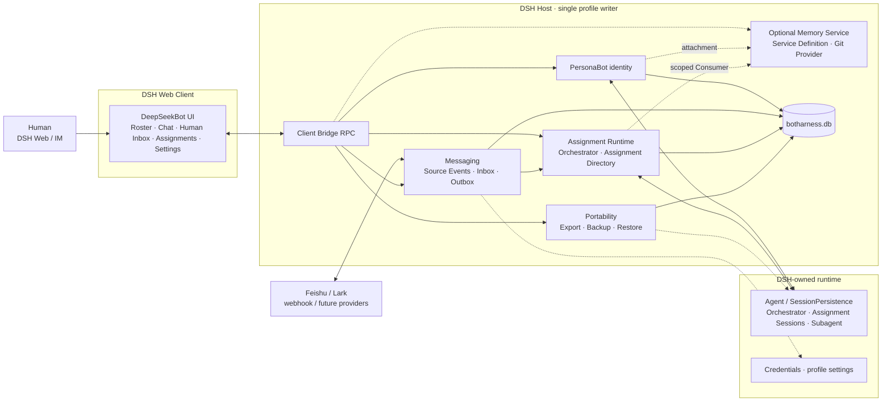
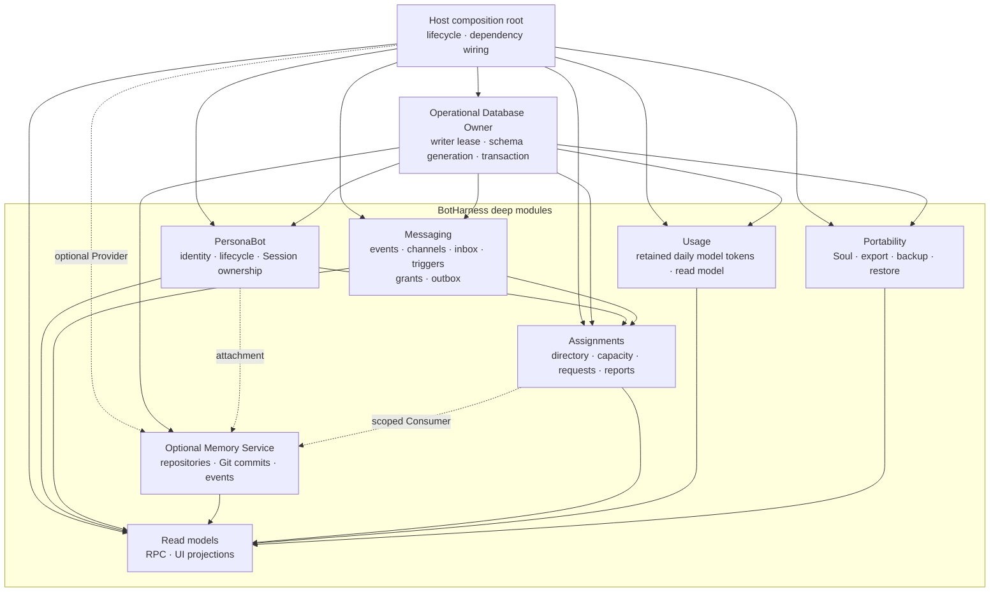
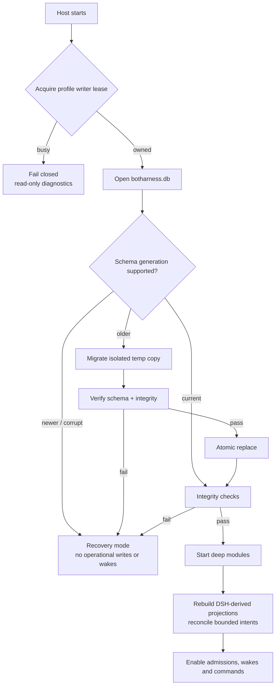
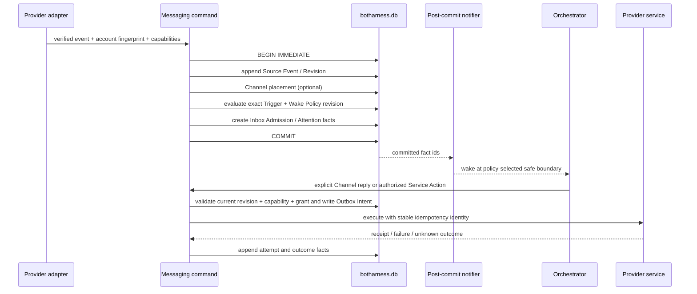
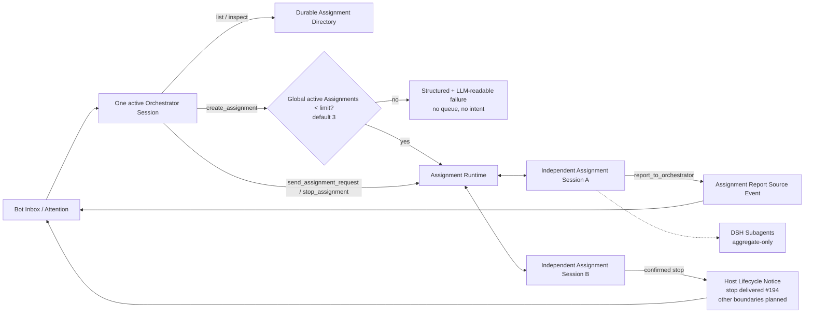
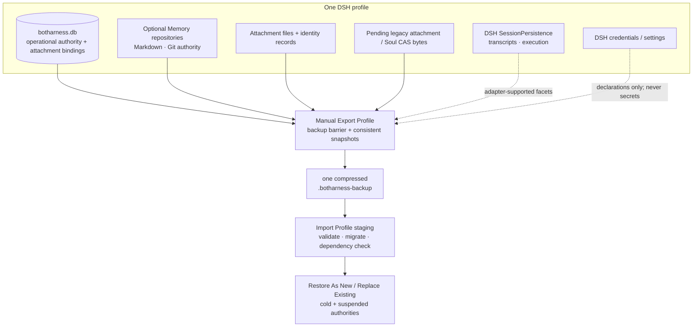
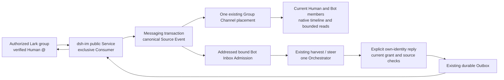

# BotHarness 架构与数据流

#679 将入口收束为 Bot 模式设置左侧的紧凑图标／未读 Chip；折叠侧栏时则在 Bot 模式下方以相同尺寸对齐。展开时仅显示未读数字 badge，最多为 99+；有未读时入口常显，没有未读时仅在 Bot 模式开启时悬停或键盘聚焦才显示，与设置按钮一致；模式关闭时 hover 不显示，也不进入 Tab 顺序；折叠时入口仅在 Bot 模式开启后显示，图标右上角红点表示有未读或待行动；模式关闭时入口隐藏且不进入 Tab 顺序。无障碍名称保留完整未读数量与待行动提示。Client 导航偏好单独记住最后查看的总览／收件箱，不受私聊、模式切换或刷新影响；显式 tab 仍直接打开对应视图。

BotHarness 是 DSH（DeepSeek Harness）之上的插件层，给 Agent 持久产品身份：**PersonaBot**。PersonaBot 用一个 Orchestrator Session 管理 Inbox，并可同时管理多个独立 Assignment Session；Memory 是 optional capability，Persona 是其中的 optional 内容；两者都不是聊天或执行的前置依赖。DeepSeekBot 是首个应用，提供 roster、Bot Inbox、Assignment Directory、委派和 IM 接入。

本文描述 #71 确认后的目标架构。M1 registry、M2 Memory 与 #66 roster storage 已实现；#77 已验证 DSH runtime seams，显式 Session ownership、Messaging、Assignment Runtime、统一 operational database 和可移植性按 #79–#81 分阶段落地。更新：2026-09-30。

当前 Client UI 由独立 `@botharness/ui` Bundle 挂载，源码仍在 `packages/client`；RC2 的插件图把结尾 `/client` 解释为导出子路径，因此包身份依 [ADR-0066](../adr/0066-rc2-client-bundle-identity.md) 避开该后缀。Client HMR 只暂存当前 Bot/Channel 选择以恢复视图，不复制 Host 中的 PersonaBot、Channel 或消息权威。

产品术语以根目录 [`CONTEXT.md`](/zh/dev/design/context) 为唯一词表；[BotHarness Runtime 架构](/zh/dev/design/bot-runtime) 单独展开 PersonaBot、Bot Inbox、Orchestrator、Assignment 与 DSH execution 的关系。DSH/Cordis 本身的术语和 Plugin 开发决策位于 `/zh/dsh`，不在这里重复定义。

迁移阶段保持可验证：#66 的 `botharness_roster` 是当前 roster 权威；#79 只先建立 `botharness.db` owner，#80 才将 roster 与 Session ownership 单向迁入。目标图表示迁移完成后的所有权，不表示运行时现在已经双写两套存储。

#56 and #137 extend the current roster global slot to `{ pins, hidden?, sectionOrder, topOrder? }`: `pins` canonically orders Channel IDs for both group Channels and PersonaBot DMs, `hidden` omits Channels only from roster navigation while retaining their placement, and `topOrder` mixes section blocks with loose Channels while membership remains owned only by section records. The unary client bridge now has ten arrangement methods, including `topReorder`, `hiddenSet`, and bounded `rosterBatch` (one Host completion notice and one final Client snapshot for multi-select); #80 must migrate this order, hidden presentation state, and single-membership invariant into the database without dual writes. 已提交的 roster mutation 会在 Host commit 后发送 `roster/changed` live invalidation；其他窗口只重读权威 roster，不接收也不复制拖拽中的预览状态。

BOT mode 的折叠 rail 复用这份 Channel 排序读模型：置顶项在分隔线上方，其余 DM 与 group Channel 按 section/未分组的扁平顺序排列。`botharness/channels` 额外投影可选 `latestMessage` 供 hover 摘要使用；该字段从当前 Messaging authority 派生，不成为新的持久化权威。

置顶格也是独立的排序 scope：默认继承全局最近更新／手动模式，可用 `ui-bot-mode.sortModes.pinned` 覆盖；拖动置顶卡片会把当前完整顺序（包括被搜索或隐藏过滤的置顶项）冻结为手动模式，通过 `pinsSet` 持久化，不影响 section 归属或其他 scope 的排序。折叠 rail 使用同一置顶顺序。

Hidden Channel 是 application-defined 的可逆 roster presentation state：它会从展开列表、pin grid、搜索与折叠 rail 中消失，但不会改动 Channel、消息、PersonaBot、Memory 或原 placement。破坏性删除仍受 ADR-0037 的 dependency report 与独立确认约束（#138）。

当前 Channel Chat 的实时显示遵循 ADR-0054：正式消息先写入当前持久化权威，再以该 Channel 的单调 revision 发出进程内通知。#143 的时间线读取遵循 ADR-0061：Host 的 `channelTimeline` 用不透明游标提供 latest / older / newer / around 窗口，Client 仅保留一段连续的按提交顺序排列的可见消息；SQLite Channel placement 的游标解释留在 Host。首次打开 Channel 取最新页；有上次已读锚点时，重开会在锚点附近分页并定位；向上补页维持视口锚点，定位旧消息可前后补页并高亮，并可继续向 newer 分页直至最新消息；用户离开底部后，新消息只更新未读提示，不强制滚到底，也不把实时消息拼接进尚有后续页的旧窗口。旧 `channelMessages` 端点暂作兼容。已选 Channel 通过经过 DSH 认证的 `/api/botharness/stream` SSE 接收已提交消息；重连可回放、缺口则从 Host 修复。同一连接还传送 Orchestrator 显式 `channel_send` 工具参数产生的进程内草稿预览：`channel/draft` / `channel/draft-settled` / `channel/draft-abandoned` 带 attempt ID 与独立于持久消息的进程内草稿 revision；连接时先发送完整 baseline，断档则重读 committed。草稿不从历史回放，不进入 Inbox，提交后由正式消息替换，放弃时移除；呈现层可消费草稿，任何不可逆操作只认已提交消息（ADR-0054）。Human send 使用 Client 生成的幂等 message ID；网络失败时本地气泡保留失败状态，Human 可把原文和附件恢复到 composer 后再次确认发送，而 Host 对响应丢失后的同 ID 重试只接受一次 durable append。Orchestrator 普通 final 与 Assignment 输出不等于 Channel 消息；当前正式 Channel 消息由 SQLite Source Event 与 placement 事务提交，旧 NDJSON 历史只在首次升级时单向导入。Group 中经候选列表选中的多个 Bot mention 在同一事务形成独立 Inbox Admission；Bot 处理状态经同一 SSE 流独立投影。已入群 Bot 的 channel_send 可提交稳定 ID 列表；Host 从可信 Orchestrator ownership 得到发送者，读取当前成员与名称生成 mention 标签，并在同一事务为不同目标建立独立 Admission。Bot-authored Group 消息保留因果根和跳数；同根同目标只投递一次，过限消息保留在群里但不再唤醒目标。收件 Bot 可以在同一群回复，重启后 pending/retryable Admission 仍可恢复。 Group 之外，Bot-to-Bot DM 使用确定性的双成员 Channel ID；Orchestrator 的 `bot_dm_send` 或该 DM 内的 `channel_send` 以可信 Session ownership 确定发送者。每次发送在同一事务中提交 Bot DM Source Event、placement、收件 Bot Admission（受因果根去重与跳数上限约束），以及发送者 Human DM 中只链接原消息的无正文动作提示。重启时恢复 pending/retryable 收件投递；Bot DM 默认不进入 Human roster，但在隐藏频道管理器中可发现、只读打开，Human 无发送或重命名权限。
Group Channel 的气泡收件圆环只投影该消息已有的 PersonaBot Inbox Admission，分母是实际收件者而不是群成员总数。入队是「已投递」；运行时 claim 本身仍显示已投递，直到 observed_at 标记消息进入 Orchestrator 回合上下文才显示「处理中」。若 Bot 通过 Channel 查询主动读到消息而没有进入处理该消息的回合，Admission 保持 pending 但 observed_at 非空，投影为独立的「已读」；回合结束是「已处理」，并不意味着发出了回复。明确忽略、可重试失败和需修复失败各有独立状态。每次权威状态变化通过 Channel revision/SSE 通知并重读该投影，不新建第二套已读存储。Bot 发送者不产生自己的 Inbox Admission，也不进入收件人数。Group 的本机 Human 成员以 Host 固定身份、显示名、加入时间及首个可见 revision 保存在 Messaging 权威中；Human 阅读位置按 Channel ID 与 Human ID 共同持久化。既有 Group 从首条消息起可见，旧 Channel 阅读位置迁移到本机 Human。Host 仅对有可见权限的非作者 Human 投影已读／未读，Bot 状态仍只取 Inbox Admission；同一圆饼与明细展示两种语义，不再从浏览器 tab 或作者推断已读（ADR-0078、#347）。Human 已读推进只广播一条携带阅读 revision 的 Channel SSE；重连时从权威已读位置发送 baseline，Client 用消息的 placement revision 更新当前可见窗口，避免阅读大量历史时逐条广播。当前只支持本地一个 Human；跨账号多人 Channel 仍需独立身份与授权设计（#377）。
Channel 的消息引用（#145）只保存同 Channel 的已提交目标 ID；Human 发送与 PersonaBot 显式 `channel_send` 由同一持久化权威校验，跨 Channel/缺失目标不能产生消息。引用作者和截断摘要在时间线读取时由当前历史投影，不复制为另一份持久内容，也不为每条消息单独读取。目标后来不可见则降级为不可点击提示；点击有效引用复用 `around` 窗口和高亮，不改变相邻消息分组与时间语义。

新 Channel 附件（#576，ADR-0100）保存到 profile 管理的独立真实文件，消息持久化 `{fileId,name,mime,size}` 引用。Host 在 append 前校验 profile 归属，查询时从当前文件投影 MIME 与大小，不改写 Source Event envelope；保留的旧 `{hash,name,mime,size}` 通过 generation 39 的 Messaging 绑定解析到独立真实文件，转换前后均校验字节且不改写 envelope；失败保留旧对象可读状态并给出有界修复日志。Composer 的固定上传 key 与消息 ID 分别保障传输和发送重试幂等。认证 Fetch 上传仍走 `/api/botharness/attachment/upload`，新下载以 `channelId + messageId + fileId` 验证归属并用 `no-store` 返回当前字节。Human 文件／图片菜单复用现有 DSH 原生打开能力；Orchestrator `channel_read_image` 使用 `attachment_id`（fileId）或 legacy `hash`，先验证当前成员资格、消息引用、当前 MIME 和大小，再传给 DSH attachment service，模型不接触 Host 路径。引用感知清理保护所有保留 Source Event 的文件身份；不启用自动调度或保留期。详见[双语文件指南](../file-open.zh.md)。

拥有该 Session 的 Orchestrator 可复制 `channel_read`（含通过 `message_id` / `content_cursor` 完整读取的内容）或旧版授权读取结果中的最多 10 个可信附件引用，四个字段原样保留：`{fileId,name,mime,size}`。#577 后旧消息投影迁移后的文件身份；过期 `{hash,name,mime,size}` 结果必须先重新读取所属消息再转发，旧 hash 图片读取仍须带所属消息以解析当前字节。Orchestrator 还可通过 `channel_attachment_import` 明确选择并导入已授权的本地结果文件；不能猜测身份与元数据。DSH schema 将 `size` 声明为整数；Host 继续校验 0–9007199254740991 的安全非负字节范围。固定版本的 DSH schema 不支持 `maxItems` 或数值上下界，因此数组上限由描述与运行时校验共同表达。Group 最多接受 20 个提及 ID，每个都必须是其他活跃现成员。`channel_send` 只有在 Messaging 权威接受写入后才返回紧凑的 `{channelId,messageId}` JSON；省略目标时使用入站 Channel。该结果取代原文本确认；附件身份、profile 归属、当前文件语义、回复目标、delivery-key 重试与因果循环边界继续沿用（[#570](https://github.com/BotHarness/BotHarness/issues/570)）。

应用定义的 `group_leave` Tool 只在规范成员移除提交后返回 `{channelId,left:true,outcome:"changed"}`；Bot 当前不是该群成员时返回 `{channelId,left:false,outcome:"unchanged",reason:"not-member"}`。无变更既包括重复退出，也包括从未加入的群；不推断历史成员身份，不返回未加入群的名称或名单。缺失 Channel 抛出 `group_leave: channel-unavailable`，非群聊目标抛出 `group_leave: group-required`，替代旧的含糊 `left:false` 成功结果；Tool 异常保持为失败。既有 `{channelId,left}` 字段及 Core 返回结构保持兼容，调用方须处理新的无效目标失败。ADR-0073 的同一事务仍承担创建者移交 Human、待处理 Admission 撤销、单条持久离群通知及剩余成员注意力策略；提交后的实时通知警告不否定已提交变更。读写权限立即撤销，因此 Bot 应通过仍可访问的 Channel 向 Human 报告（[#571](https://github.com/BotHarness/BotHarness/issues/571)）。

## 1 · 系统上下文

新附件已遵循 [ADR-0100](../adr/0100-file-open-actions-target-real-host-files.md)：独立上传彼此独立，显式复用身份才共享编辑结果。原生打开指向真实目标；后续消息读取、预览和下载使用当前内容，上传源独立。保存不保留附件历史，不生成 Source Revision、Inbox Admission、通知或 Bot wake。目标缺失则报告不可用，不自动重建。旧 CAS 迁移（#577）按 Source Event 附件出现位置预留可重启恢复的身份，仅在保留依赖未转换时继续保护旧对象；其他 CAS 数据与 Memory Git 行为保持各自语义。

```mermaid
flowchart LR
  Human["Human<br/>DSH Web / IM"]
  External["Feishu / Lark<br/>webhook / future providers"]

  subgraph Browser["DSH Web Client"]
    UI["DeepSeekBot UI<br/>Roster · Chat · Human Inbox · Assignments · Settings"]
  end

  subgraph Host["DSH Host · single profile writer"]
    API["Client Bridge RPC"]
    Identity["PersonaBot identity"]
    Memory["Optional Memory Service<br/>Service Definition · Git Provider"]
    Messaging["Messaging<br/>Source Events · Inbox · Outbox"]
    Assignments["Assignment Runtime<br/>Orchestrator · Assignment Directory"]
    Transfer["Portability<br/>Export · Backup · Restore"]
    DB[("botharness.db")]
  end

  subgraph DSH["DSH-owned runtime"]
    Sessions["Agent / SessionPersistence<br/>Orchestrator · Assignment Sessions · Subagent"]
    Credentials["Credentials · profile settings"]
  end

  Human --> UI
  External <--> Messaging
  UI <--> API
  API --> Identity
  API -.-> Memory
  API --> Messaging
  API --> Assignments
  API --> Transfer
  Identity --> DB
  Identity -. attachment .-> Memory
  Messaging --> DB
  Assignments --> DB
  Transfer --> DB
  Identity <--> Sessions
  Messaging --> Assignments
  Assignments <--> Sessions
  Assignments -. scoped Consumer .-> Memory
  Messaging -.-> Credentials
  Transfer -.-> Sessions
```

浏览器只通过 RPC 访问 Host read models 和 commands。Provider adapter 只负责验证、规范化和执行能力；它不拥有 Inbox，也不能直接唤醒 Agent。DSH 继续拥有 Agent 执行、SessionPersistence、Subagent 与凭据；BotHarness 不复制这些 runtime 权威。

## 2 · Deep modules 与所有权

```mermaid
flowchart TB
  Root["Host composition root<br/>lifecycle · dependency wiring"]
  DB["Operational Database Owner<br/>writer lease · schema generation · transaction"]

  subgraph Modules["BotHarness deep modules"]
    Bots["PersonaBot<br/>identity · lifecycle · Session ownership"]
    Memory["Optional Memory Service<br/>repositories · Git commits · events"]
    Msg["Messaging<br/>events · channels · inbox · triggers<br/>grants · outbox"]
    Assignments["Assignments<br/>directory · capacity · requests · reports"]
    Usage["Usage<br/>retained daily model tokens · read model"]
    Portable["Portability<br/>Soul · export · backup · restore"]
    Views["Read models<br/>RPC · UI projections"]
  end

  Root --> DB
  Root --> Bots
  Root -. optional Provider .-> Memory
  Root --> Msg
  Root --> Assignments
  Root --> Portable
  Root --> Usage
  Root --> Views
  DB --> Bots
  DB --> Memory
  DB --> Msg
  DB --> Assignments
  DB --> Portable
  DB --> Usage
  Bots -. attachment .-> Memory
  Bots --> Assignments
  Msg --> Assignments
  Bots --> Views
  Msg --> Views
  Assignments -. scoped Consumer .-> Memory
  Memory --> Views
  Assignments --> Views
  Usage --> Views
  Portable --> Views
```

| Module           | Owns                                                                                                    | Does not own                             |
| ---------------- | ------------------------------------------------------------------------------------------------------- | ---------------------------------------- |
| PersonaBot       | Host-owned ID、display name / role badges、lifecycle、explicit Session ownership                        | DSH Session lifecycle、Memory 内容       |
| Memory           | generic Git-backed repositories、semantic commits、operation events                                     | PersonaBot lifecycle、Inbox、Session     |
| Messaging        | Source Event、Channel placement、Inbox Admission、Attention、Trigger/Wake Policy、Service Grant、Outbox | Agent execution、provider credentials    |
| Assignments      | Assignment Directory、Assignment Request/Delivery Intent、capacity admission、report/lifecycle routing  | DSH transcript、Subagent runtime         |
| Usage            | per-PersonaBot／执行类型／实际模型的保留日统计、usage read model 契约                                   | DSH Session 日志、价格表、金额总账       |
| Workspace Grants | Human 对 DSH Workspace 的授权与撤销、Assignment 创建时的权限快照                                        | DSH Workspace registry、Session 权限实现 |
| Portability      | SoulSnapshot、PersonaBot Export、Profile Backup/Restore/Transfer 协调                                   | credentials、可执行插件、DSH 私有格式    |
| Read models      | 查询、分页、PersonaBot Activity Projection、Human Inbox、UI-friendly projection                         | 业务事实与写入规则                       |

`botharness.db` 是 BotHarness core 的物理事务宿主，不是共享的 generic repository。Memory 内容与 commit 由 optional Git-backed Provider 掌管；每个 deep module 只通过自己的接口拥有表和不变量，跨模块流程由显式 command/port 协调。

Usage 是 application-defined 的保留统计：从 DSH durable SessionEvent 中按实际请求提取 provider／model 与 provider 报告的 input、output、cache-read、cache-write token，按可信 Session ownership 归属 PersonaBot，分别汇总 Orchestrator、Assignment 和 DSH Subagent；同一 Turn 用多个模型时分别入桶，缺失用量标为未知。`botharness.db` 按 `(bot, day, execution role, provider, model)` 保留日汇总，日界取 Host 本地时区；增量折叠必须幂等，普通 Session 删除后不可用剩余日志全表重建或重复计数，彻底清除 PersonaBot 才删除其可识别统计（ADR-0094，#39）。金额由价格表在查询时另行估算，1.0 不落金额总账（#35 留 v1.1）。Browser 只经 read model 查询，不直读 Session 日志或投影表；PersonaBot Profile 的 token 卡是当前消费者（#34 Decisions、#428）。

Usage generation 40 在同一 Operational Database 事务中写入匿名 HMAC 去重凭据与日增量；校准只补记未见调用，不清空保留汇总。凭据不保留原始 Session 标识或逐调用内容。旧汇总迁移为 Bot 级时间基线，升级前无法确认的补计明确留诊断；新调用持久幂等。归档保留用量；Registry Purge 清理汇总、凭据与基线，当前 Bot 创建身份与可信根 ownership 防止旧 Session 重新填入。

首个可运行切片（#499）扩展现有 26 周有界 `profileActivity` 查询，返回实际 provider／model 的日用量、可为未知的报告分项，以及即使某缓存分项缺失仍可确定的 provider 总量。Profile 按 Host 本地日期查看用量，与允许调用的 Model Plan 独立。逐调用切片（#503）独立结算每条追加的 Assistant 调用事件，成功调用使用实际 source，失败调用使用已记录的请求路由；Profile 区分可信 ownership 对应的 Orchestrator、Assignment 和子代理。Session 序号去重实时通知与重放快照，消息替换不产生新用量。Session 删除后的保留统计仍由 #502 完成。 Profile 在现有 26 周公开查询范围内，以一个有界时间选择联动每日用量、实际 provider/model 用量构成和缓存比例图，默认最近 7 天。模型／提供商切换按选中的实际模型 ID 或提供商 ID 汇总，不在行内嵌套另一维度；Host 原始行和折叠的执行详情保留两个标识。模型／提供商行紧凑地显示选中维度的名称与报告总量；图表悬浮提示展示总输入（未缓存输入加缓存读写）、缓存读/输入及输出/报告总量的比例；缺失分项或零分母的比例保持未知。执行类别默认折叠于详细信息（#592）。

筛选查询 `profileUsage`（#507）由 Usage 深模块拥有，经 Typert/API Gateway 提供：真实且非未来的日期最多覆盖 182 天；模型／提供商与执行类别条件同时作用于每日记录与累计汇总，累计值仅忽略日期。Profile 默认近七天，执行类别筛选位于折叠详细信息中；首次打开、改变筛选或手动刷新时查询，不轮询或按时间自动过期，同条件刷新失败明确标为过期，旧条件迟到的响应不会覆盖新筛选。响应包含查询／核对时间、正常／核对中／降级状态、可空未知用量，以及显式明细／选项上限（2,000 行／每维度 1,000 个实际选项）；总量完整，截断图表隐藏。Session 来源是否可用不决定保留统计是否存在（#502）。

Model Preset 是部署本地可复用模板；Human 在 Profile 应用时，PersonaBot 保存独立 Model Plan 快照，后续模板编辑不传播到已应用的 Bot。Plan 固定 Orchestrator 的 provider／model／reasoning effort，并定义 Assignment 可用的精确模型、各模型允许及默认的 effort 和默认模型。Host 在每个执行入口按当前 Plan 验证选择，而 DSH SessionEvent 记录实际调用：Orchestrator 的变更在当前 Turn 结束后生效，已有 Assignment 保留当前路由，之后的显式切换按最新 Plan 校验；新建 DSH Subagent 默认继承仍获允许的父路由，否则选当前 Assignment 默认并告知父 Agent。不可用或有歧义的路由停止请求，交由 Human 修复，不静默回退。Model Preset 与 Model Plan 可进入保持身份的 Profile Backup，不进入 SoulSnapshot 或 PersonaBot Export（ADR-0027、ADR-0093，#488）。

首个运行切片中，命名模板保存在部署本地的 `botharness/model-presets.json`，应用后的独立快照及修订号保存在该 Bot 的 `bot.json`。Profile 经现有 Host Bridge 读取 DSH 当前注册的 provider、model 与 effort 能力，并在创建及应用时校验确切路由；Orchestrator 的 Agent-scoped Model Selection 在每个新 Turn 前读取最新快照，不修改 DSH 部署默认值。DSH 请求头仍是实际调用路由的事实来源（#498）。

后续切片允许 Human 修订命名模板而只改变未来应用的值与模板修订；Profile 的紧凑切换按当前模板复制新 Bot 快照，手动改一个 Bot 的 Orchestrator 路由则清除模板来源标记、保留 Assignment 默认值并增加 Bot 计划修订。Host Bridge 在写入前验证现有 DSH 路由，正在执行的 Turn 持续使用其已组装选择，下一 Turn 才重新读取 Bot 快照（#501）。

新建 Assignment 的模型选择由当前 Bot Model Plan 管理：Human 在 Profile 保存精确 provider／model 集合、各模型允许及默认的 effort 和整体默认路由，Host Bridge 在写入前对照 DSH 当前 Model Catalog 校验并递增 Bot 计划修订。Orchestrator 通过 `list_assignment_models` 读取该集合，再在 `create_assignment` 中省略选择以使用整体默认值，或指定获准的模型与 effort；Host 在认领 Session 和启动工作前拒绝越界选择。选定路由随 Assignment ownership 记录保存在 `botharness.db`，并通过该 Assignment 独有的 DSH Agent-scoped Model Selection 进入真实请求；读取 Assignment 或 Host 重启不会把选择改为后来更新的 Bot 默认值。这个切片不修改 Orchestrator 路由或 DSH 部署默认值（#504）。

PersonaBot 的 Agent scope 提供 `bot_subagent`、`bot_subagent_fork` 和 `list_bot_subagent_models`；Host 在每次启动子代理时从该 Bot 的最新 Model Plan 验证路由，并用 DSH LLM Service 预检可用性，再交给 DSH Subagent Service 创建真正的子会话。Bot scope 拒绝绕过计划的原生 Subagent 工具调用。省略路由时，获准的父路由被继承；已从当前计划移除的旧 Assignment 路由改用当前 Assignment 默认值，并在工具结果中告知父 Agent。子代理沿用根会话的 Workspace Grant 与工作目录；DSH 子会话原生的 `never` 审批策略不放宽根会话的模式约束（#508）。

Model Route Readiness 在 Profile 查询及 Orchestrator／Assignment 新 Turn 入口读取同一 PersonaBot Registry。旧 `model` 字符串只有在 DSH Model Catalog 唯一匹配且路由配置有效时才迁移为独立 Model Plan；有歧义或缺失则保留旧值并等待 Human 选择，绝不拼接部署默认 provider。修复状态即时计算，不是第二套策略存储。请求前校验精确 provider／model／effort；provider 在真正执行时拒绝凭据则通过 DSH `turn/end` 和现有 Channel Session failure 通知给出修复指引。成功应用 Model Preset 后移除旧字段，保持 Agent preset 不变，下一次 Turn 使用修复后的路由（#500）。

application-defined Memory Service 使用 `Consumer → Service Definition → Provider` capability seam。每个 PersonaBot 都有一个 Git-backed Memory Repository，Orchestrator Session 固定以它为 working directory。当前检出的工作树文件立即是记忆，无论是 Markdown、代码还是二进制文件。Agent 通过原生文件、搜索、Shell 与 Git 能力读写仓库；没有面向模型的 Memory CRUD 工具。新建 PersonaBot 时可选择空白记忆，或由 Host 检查 Git 并以 HTTPS/SSH 地址在暂存目录克隆远端仓库；克隆成功才建立 Bot，远端当前分支及文件立即成为记忆（#298）。私有仓库使用 Host 已配置的 Git 凭证，不经创建页面收集密钥；已有 Bot 仍通过原生 Git 整合远端仓库。外部仓库应合并、替换或放到其他位置若有歧义，Orchestrator 经 DSH 原生 Ask Question 询问 Human。分支、合并与冲突由 Git 决定；Git 改变工作树后，同一 Session 立即看到新文件，但该 Session 已冻结的 Persona prompt 不追溯更新（ADR-0060）。跨设备延续沿用同一路径：Orchestrator 按 Human 请求用原生 Git 与 Human 自配置的远端同步，新设备以 Git URL 创建新的 PersonaBot；不操作 Git 的所有者使用 PersonaBot Export / Profile Backup，而不是 Host 持有的同步服务或一键同步（ADR-0084）。

Memory Service 拥有 repository identity 和 lifecycle、可信 Session ownership、受限的 UI 查询，以及审计/恢复检查点。成功回合后，它可以把观察到的状态与可信 Source Event、Session 上下文记录下来；观察不会暂存、提交或隐藏工作树文件，也不推断 Git 内容的作者。当前文件与历史以 Git 仓库为权威，数据库 ledger 只是辅助记录。PersonaBot DM 的 Channel sidebar 分为「记忆文件」和「记忆演化」：前者以可展开目录树展示当前工作树，选中文件后在 Channel body 只读查看文本或二进制提示；后者展示所有本地分支及可达提交的 Git graph，选中 commit 查看完整 diff。当前差异默认按「新记忆／已有记忆的更新」对文件去重，切换并持久保存 Git 术语后，显示可折叠的未暂存、已暂存和未跟踪分组及状态标识。打开视图时定时读取、窗口重新聚焦时立即读取外部编辑，侧栏折叠标题栏也有刷新按钮；查询不暂存或提交（ADR-0088）。Human 文本保存服务仍先比较当前 HEAD，再显式生成 Git commit；普通导航不提供页内编辑。Memory 文件查询阻止访问 `.git` 控制路径及指向仓库外的符号链接，但不限制 Git 可保存的文件类型。旧 Repair 归档与检查点记录仍保留兼容；普通未提交改动不会阻止下一回合或强制修复（ADR-0068）。

恢复检查点额外记录分支、HEAD、暂存区与工作树，并用隐藏的 Git ref 保留对象。观察记录区分 Host 扫描、Agent 会话上下文和明确的本地 Human 命令；后者使用与 Channel membership 相同的 Host-owned `local-human` 身份，不能区分共享 Host 凭据的多人。Human 在记忆演化页选择检查点并确认恢复；Host 校验当前状态与检查点引用，在副本中准备目标状态，完整归档原仓库后切换。未被观察的中间状态无法恢复；Git ignored 文件留在完整归档中（ADR-0097）。

Memory 外部打开沿用 ADR-0100 的交互，#574 实现当前 Memory 首片：显示路径的区域可点击弹出菜单，密集文件树提供右键菜单和键盘／触屏可到达的入口，合适位置提供带 Tooltip 的图标按钮。普通文件选择仍进内置阅读，目录选择仍展开。首片覆盖 Workspace 的 Memory Repository 路径及当前 Memory 文件／目录，#575 扩展已授权的普通 Workspace 路径，后续扩展 PR #435 的消息附件 chips，不识别任意正文路径。Memory Service 在 Host 从 PersonaBot 仓库根解析相对路径，沿用 `.git`、越界与符号链接检查；其他来源由各自 owning module 解析，不开放通用任意路径 authority。Client 沿用 DSH Typert／API Gateway seam 消费原生打开能力，不运行拼接 Shell 命令。目录菜单取 DSH 探测到的应用，文件菜单取默认和注册关联应用，首片不加自定义程序或持久默认应用设置。

普通 Workspace 路径复用同一 Client 菜单，但提交 PersonaBot slug 与 Grant ID，由 application-defined Workspace Grant Store 的 `requireActive` 在 Host 检查拥有者、撤销状态和当前 DSH Workspace Registry 身份，重新解析 canonical 目录。显示路径不承担 authority；失效、移动、未注册或缺失目录会拒绝。打开前再次校验，菜单只列 Host 探测到的目录应用，能力不可用时只保留复制 Host 路径。打开不修改 Grant、Session cwd 或访问权限，也不创建 Session；不提供目录下载（#575）。

原生打开始终作用于 DSH Host 所在电脑，Tailscale／Cloudflare Tunnel 只提供连接而不证明 Client 与 Host 同机。菜单明确目标和能力不可用原因；文件另提供下载到浏览器设备及复制 Host 路径，二进制／超大文件不因内置预览受限而失去打开和下载能力。下载后的编辑不自动回写远端，首片不做目录下载或历史 Memory 文件导出。

Memory Service 在 Host 启动、Orchestrator 回合前，以及本地 DM 或群提及并入活动回合前比较各 Bot 当前分支、HEAD、未提交文件内容和 Git index，与数据库中的每 Bot 观察检查点求净变化。首次观察只建立基线；之后在单次事务中写入有界路径摘要的 `memory-change` Source Event、该 Bot 的 Inbox Admission，并推进检查点。事务失败不推进基线，重启后重试；相同状态重复扫描不重复投递。启动扫描只入 Inbox，不主动唤醒 Agent；下一次普通回合在同一 Inbox 上下文领取并处理。Event 不推断编辑者，也不复制文件内容；Agent 需要时用原生文件和 Git 工具查看。并入消息时发现的净变化随消息在下一个安全步骤进入同一回合的 Inbox 上下文，成功投递才标记已观察，并随回合成功或失败处理；拒绝并入时保留待处理，供后续普通回合领取。回合结束更新剩余状态的基线，不额外通知，也不推断回合中变更的编辑者。离线期间改动又复原的中间过程无法从最终文件状态推断。`PERSONA.md` 变化可在 Event 中提示，但冻结的 Session persona prompt 不变（ADR-0092、#350、#352、#464）。

## 3 · Host 启动、迁移与 recovery

```mermaid
flowchart TD
  Start["Host starts"] --> Lease{"Acquire profile writer lease"}
  Lease -- "busy" --> ReadOnly["Fail closed<br/>read-only diagnostics"]
  Lease -- "owned" --> Open["Open botharness.db"]
  Open --> Gen{"Schema generation supported?"}
  Gen -- "newer / corrupt" --> Recovery["Recovery mode<br/>no operational writes or wakes"]
  Gen -- "current" --> Integrity["Integrity checks"]
  Gen -- "older" --> Copy["Migrate isolated temp copy"]
  Copy --> Verify["Verify schema + integrity"]
  Verify -- "fail" --> Recovery
  Verify -- "pass" --> Activate["Atomic replace"]
  Activate --> Integrity
  Integrity -- "fail" --> Recovery
  Integrity -- "pass" --> Modules["Start deep modules"]
  Modules --> Rebuild["Rebuild DSH-derived projections<br/>reconcile bounded intents"]
  Rebuild --> Ready["Enable admissions, wakes and commands"]
```

一个 DSH profile 同时只允许一个 BotHarness writer。所有 module migration 合并成单调递增的 Schema Generation；迁移只在临时副本上完成，校验后原子替换。打开、迁移或完整性检查失败时进入 recovery mode，不回退到 NDJSON、storage domain 或内存写入。

## 4 · Messaging 事务与外部副作用

```mermaid
sequenceDiagram
  participant P as Provider adapter
  participant M as Messaging command
  participant DB as botharness.db
  participant N as Post-commit notifier
  participant O as Orchestrator
  participant X as Provider service

  P->>M: verified event + account fingerprint + capabilities
  M->>DB: BEGIN IMMEDIATE
  M->>DB: append Source Event / Revision
  M->>DB: Channel placement (optional)
  M->>DB: evaluate exact Trigger + Wake Policy revision
  M->>DB: create Inbox Admission / Attention facts
  M->>DB: COMMIT
  DB-->>N: committed fact ids
  N-->>O: wake at policy-selected safe boundary
  O->>M: explicit Channel reply or authorized Service Action
  M->>DB: validate current revision + capability + grant and write Outbox Intent
  M->>X: execute with stable idempotency identity
  X-->>M: receipt / failure / unknown outcome
  M->>DB: append attempt and outcome facts
```

Source Event 是内容唯一权威；Channel 和 Inbox 都只保存关系。Reply 使用可信 Reply Route 自动选择来源 provider；主动发布属于 Service Action，必须同时满足 Provider Capability 与 Human Service Grant。SQLite 事务只覆盖本地事实；外部副作用使用 Outbox Intent、幂等标识和有界 reconciliation，不宣称 exactly-once。不可证明的结果进入 `unknown-outcome`，由 Human 处理。

Wake Policy 决定何时让 Orchestrator 看见新 attention：当前 step 完成后的安全边界、当前 turn 结束后，或 idle 时启动新 turn。普通外部消息不打断正在执行的 model/tool step；只有 DSH 明确支持且策略授权的控制路径才能 steer。就绪的 attention 按回合收割：忙碌期间新到的事件只把就绪集合置脏，当前回合结束（即空闲）时由一次 harvest turn 消费全部就绪项；主动 steer 只用于直接 @ 与 DM（ADR-0077）。

### 首条外部出站路径（ADR-0101）

PersonaBot Profile 的 IM 连接经现有 Typert/API Gateway 选择账号和已测试目标，再由 Human 建立 Binding 与单目标主动发送 Grant。application-defined Messaging Provider Registration 由 Consumer Fiber 持有，Binding／Grant／Outbox 使用同一 `botharness.db`。接受和执行都复核活跃 Bot、Grant、Registration、认证账号 fingerprint 和目标内容 digest；删除、改址或账号变化要求显式重新授权。先提交 Intent 和 attempt-start，再调用 provider，结果只记平台接受、明确失败或未知；重启不重发 pending／in-flight，未知结果留待 Human 核对。

生产适配需要 dsh-im 公开、版本化的 `describeBot`／`sendChecked` 契约，以在账号 transition 中验证平台身份并冻结已授权路由。这是待上游接受的小型扩展；已发布 `4.32.0` 不满足该契约，BotHarness 默认禁用这条出站 authority。隔离开发可通过 `dev-instance --im-provider` 安装 [ADR-0104](../adr/0104-isolated-im-profiles-pin-a-qualified-temporary-provider-fork.md) 指定的临时 fork 完整 SHA，并在启动前校验运行时代码 digest；这不代表上游已发布或生产启用。dsh-im 仍持有 SDK／连接／凭据与原设置入口；BotHarness 不读取其私有 JSON，不接管 standalone Session 路由。#12 通过公开 `consumeInbound` 独占接收显式授权群内的文字 @：Messaging 先提交 bridge-message Source Event 与独立 Bot Inbox Admission，commit 后确认，再沿既有 group-mention harvest／steer 唤醒 Orchestrator。来源不需要本地 Channel placement，模型从 Inbox 了解接收身份、发送人及 group／thread／root／parent；`bridge_read` 读本地已保存来源，`bridge_reply` 仅接受来源 ID 与正文，Host 推导本 Bot 的有效身份与原回复路由，复用 Outbox 后调用公开 `replyChecked`，不镜像到 Human DM。撤销、归档、consumer 丢失、旧 Grant revision 都不能授权未来收件或尚未开始的回复；重启不重发未知 Outbox。外部来源 turn 不扩展 Memory acceptance 的来源授权，也不自动写入 Memory。详见 [ADR-0106](../adr/0106-exclusive-im-intake-commits-bot-inbox-before-acknowledgement.md)。 #612 的 `bridge_context` 通过同一 Inbox 来源和 Bot 身份调用公开 `historyChecked`，区分群列表、附近 ±5 分钟 Chat 时间窗与可信 Thread 列表；Host 按 JSON 预算仅将完整返回内容 reconcile 到 canonical Source Event，并记录有界读取 metadata。普通历史不建立 Admission、不触发 wake；已经存在且实际返回的 Admission 沿用当前 turn 的成功／失败处理。Provider 返回的显示名仅补充同一 canonical 身份；发送人和 @ 人员 ID 保持身份依据。Inbox 沿用 harvest 的 Message／Source Event 引用格式，上下文返回可用的姓名和 @ 关联，缺失姓名时回退 ID。Human 来源详情显示读取记录与最近一页，不自行读取远端。

### Bot 之间的 Channel 协作（ADR-0065）

Orchestrator Session 中注册的 `group_attention_get` 与 `group_attention_set` 是 DSH model-facing Tool，消费 BotHarness Host 的 application-defined Channel capability；Host 从该 Session 所属 PersonaBot 确定 actor，并在读写时复核当前 Group membership。未保存的 Group 偏好只读为 digest 5 条／30 秒、revision 0；Human Bridge 写入和 Bot Tool 写入共用 Channel record 中的 `wakePolicies`，每次实质变更在同一 SQLite 事务里追加不可改写的 actor／时间／revision 审计事实。审计表只存历史，不作为第二套当前偏好；Admission 在消息提交时固定有效策略与 revision，不会随之后的编辑回写。

#366 把 Human DM、Bot DM、群内提及、普通群消息、入群邀请与申请流程、Assignment 报告及生命周期的内建来源规则写成每个 PersonaBot 本地的不可改写修订事实。Host 在建立新 Inbox Admission 的同一事务里读取对应规则并保存来源规则 revision／wake 快照；既有 Admission 不回填。普通群消息的来源默认值沿用 5 条／30 秒 digest，适用的 per-Channel `wakePolicies` 覆盖仍保留在 Group Channel record；Assignment 进度报告仍按报告状态与回复请求决定是否即时唤醒。资料页经 Host Bridge 查询所有有效规则、修订及最后修改者。来源类别修订与 Channel 覆盖分属不同作用域。

#370 的 `source_attention_get/set/reset` 是仅对所属 PersonaBot 可见的 Orchestrator Tools，Human Profile 通过 Typert/API Gateway Bridge 编辑同一 `bot_source_policy_revisions` 修订权威。v1.0 可编辑提醒强度的来源为 `assignment-report`（`conditional`／`immediate`）与 `group-ordinary`（`immediate`／`digest`／`mentions`／`silent`，汇总条数及间隔有界）；两者始终 `admit`。`human-dm`、`bot-dm`、`group-mention` 始终接收并即时唤醒；Human Bridge 与所属 Orchestrator 的 `source_attention_set/reset` 可编辑／恢复 `delivery: steer | turn`，默认 `steer`。直接来源要求 `wake: immediate` 和显式 delivery，拒绝汇总参数；其他可编辑来源拒绝 delivery。Host 在投递唤醒时读取当前 delivery；Admission 保留入队时的 wake 与修订。`group-invite`、`group-join-request`、`group-join-decision`、`assignment-lifecycle` 保持即时工作流通知；这些来源没有安全的延后／静默收割语义，因此只读，Bot Tool 与 Human Bridge 都拒绝其修改。删除可编辑覆盖以带 Human／Bot actor 的新修订恢复内建默认，不删除历史；后提交的 Admission 才读取新修订。Orchestrator 真正启动时为所纳入的来源类别追加不可改写的 wake-attempt 事实，近七天计数从这些事实投影，而非把 Admission 数或汇总阈值当作唤醒次数。Group Channel 的普通消息覆盖继续独立存于 Channel record，优先于 PersonaBot 来源默认值；冻结规则按 ADR-0076 延后。

Attention 已交付契约（ADR-0070/0074/0077、#364）：四档偏好均为普通群消息保留该 Bot 的 Inbox Admission。`mentions` 不自行唤醒，但同群直接 @ 可带入有限的待处理上下文；`silent` 不自行唤醒，也不搭乘 @，只在 Bot 显式读取时进入本轮。群聊触发 harvest 时同时选择触发消息附近的上下文与最早待处理的一段；单群至多 100 条，并受整轮文本/token 预算约束。提示中明确省略数量与继续读取位置，未选中消息保持待处理，后续合格轮次继续从最早处推进。`channel_read` 只把实际返回并进入本轮的 Admission 纳入处理集合：进入本轮显示处理中，成功结束才已处理，失败显示需修复。内部 observed 保留审计用途，不新增常用“完成”工具，也不把 Human 打开 Channel 当作 Bot 处理。#362 的通用多来源 Inbox Trigger 与 Attention 聚合仍待后续切片。

当前 #47 首个高流量 Group 切片把每位成员的普通消息 Wake Policy 写在 Channel record；该 preference 归 Bot 所有，Bot 可用自己的工具读写（含 count/interval），Human 可在成员侧栏查看并覆盖；四档：`all`（每条普通消息即时成为 attention）、`digest`（N 条 / T 秒汇总；默认）、`mentions`（只有直接 @ 到达）、`silent`（记录但不唤醒、也不搭车，只能显式读取）（ADR-0074）。任一模式下，普通消息作为 Source Event 与该 Bot 的 `group-ordinary` Inbox Admission 在同一 SQLite 事务中提交，Admission 固定当时的 policy revision；即时模式逐条就绪，汇总记录阈值，mentions 与 silent 记录空阈值。未保存偏好时采用 digest 的默认阈值，保留已保存的模式与 revision。直接 @ 走独立的即时 Admission，不等待汇总。Host 在达到数量或时间上限后把该 digest 批次标记为就绪；忙碌期间新到的即时项不再各自排队，只标记就绪集合，当前回合结束或空闲时由一次 harvest turn 消费全部就绪项（ADR-0077）。直接 @ 与 DM 默认 steer：有活动回合时在下一个安全 step 注入，否则并入下一次 harvest。重启从 pending/retryable Admission 重建计时，收割只把实际纳入 Orchestrator context 的 Admission 标为处理中，回合成功结束才标为已处理；Bot 通过 `channel_read` 明确读取到的普通群消息也加入该回合，成功后标为已处理，失败则需修复，未返回的消息保持待处理；是否向 Channel 回复仍由 Bot 决定。静默收件为普通消息保留待处理 Admission，但不设置汇总阈值，不自动唤醒，也不进入 harvest；只有显式 `channel_read` 才会进入本轮处理，直接 @ 仍即时。归档中的 Bot 在消息提交时不产生新的 Inbox Admission；群消息与其他活跃 Bot 的收件仍独立提交。唤醒处理按 Source 类别而非平台分类：外部平台在 Bridge 边界归一化为 Source Event，运行时只认 Source 类别与 admission reason（ADR-0075）。Bot 自管自己的 attention policy（来源类别规则 + per-Channel 覆盖 + count/interval），Human 可覆盖；冻结规则按 ADR-0076 延后，安全闸门不属于 policy。通用多来源 Attention 聚合与 Inbox Trigger 仍待后续切片。

五个应用自定义 attention Tools 使用现有逐 Bot 的来源策略与 Channel preference Provider。`source_attention_set` 省略 `sourceClass` 时默认 `assignment-report`，仅允许 `conditional|immediate` 且不能传 digest 参数；`group-ordinary` 允许 `immediate|digest|mentions|silent`，只有 `digest` 接受 digest 参数。计数与间隔使用整数 schema，由 Host 强制执行 1–100 与 1–3600 秒边界，省略时保留有效设置。逐 Channel 的 `group_attention_set` 在所有模式下保留可选 digest 设置。Source reset 恢复内置规则，不清除 Channel override，也不改变历史 Admission。读取、编辑和重置返回有效值、修订、最后编辑者/时间及有界七日 source wake 计数；非法组合在策略写入前失败。

当前 Bot-scoped botAttention Bridge 查询直接从 Inbox Admission、Source Event、Channel placement 与 Assignment Directory 投影有界页，按 Source Event 时间与 ID 排序，返回状态、发送者、摘要以及可用的 Channel 消息或 Assignment Session 引用；它不另建收件内容。Assignment Report 与 Source Event 在同一事务中形成该 Bot 的 Inbox Admission，并带报告状态；报告进入 Orchestrator 回合时记录观察，回合完成后标记已处理，是否向 Channel 回复由 Bot 决定。重启后未观察的到期报告可唤醒一次，已进入回合却中断的报告显示需要修复。Human–PersonaBot DM 的 Channel sidebar 在有事实时显示 Bot Inbox entry，按来源 Channel 或 Assignment 分组，待处理项展开，已处理和明确忽略的历史折叠；Bot 在收到或读取某条 Channel 消息后可用 `inbox_ignore` 明确忽略，决定写在同一 Admission 上并保留消息历史；普通回合完成但不回复仍是 handled，阅读本身不自动写入长期 Memory。点击来源消息复用 Channel timeline 的 around 定位，点击 Assignment 报告打开事项详情。Group Channel 不显示该 entry；Human 查看侧栏不改变 Bot 的观察事实（ADR-0070、#47、#152）。

Human Inbox 的首个可运行切片在 Bot mode 左侧栏的 Messages 上方提供独立入口，默认显示待 Human 处理的群聊加入申请、仍存活的原生提问和工具审批；#546 已交付的未读视图将群聊及 Bot→Human DM 按 Channel 汇总，信息视图保留无 Channel 的事项完成报告。提问项只在 DSH 原生请求仍等待 Human 答复，工具审批项只在 BotHarness 审批请求仍存活、且 Channel 内没有答复、取消或审批决定时出现；打开后定位到对应私聊卡片。事项的最新报告为 `waiting-human` 且 open ask 仍存活，或报告为 `blocked` 且尚未解决时，Human Inbox 从 Assignment Directory 投影同一条按 Session ID 稳定标识的待办；状态升级为受阻时更新摘要与报告来源，不重复建项。Orchestrator 回复后事项运行期间暂隐藏该项；若事项再次空闲或出错但没有新的解除受阻报告，待办继续显示。打开后进入该 Bot 私聊并展开事项详情；完成报告或停止事项后待办消失。事项完成报告则按最新 Source Event 投影到“仅供了解”，Human 可打开来源或忽略该份报告；忽略决定单独保存 Source Event ID、决定与时间，新报告仍会出现，不复制 Inbox 内容。Host 从 Channel record 中的待处理申请、Source Event/Channel placement 以及 Human 的 Channel read position 投影列表，不另存 Inbox 内容；批准或拒绝沿用 Group 决策事务，已了解沿用 Channel 已读位置。查询按时间与稳定 ID 分页，并把游标绑定到分类、Bot/Channel 过滤条件与排序方向；Client 在切换范围时丢弃旧响应。Bot 的 Channel Admission 进入 needs-repair 时，同一权威按受影响 Bot 与 Source Event 投影一条待办；Human 可打开 Bot Inbox 或来源消息，来源 Channel 已删除时降级到 Bot Inbox，修复状态解除后待办消失。Workspace Grant 请求也从 Bot DM Source Event 投影为待办；新提交的回复只有带有效 Grant 引用才会清除，历史已存储的本地化授权文字回复仍按兼容规则识别；unknown-outcome、rebind 与 readiness 等原因仍待各自的 typed Attention facts（ADR-0071、#126）。

[#687](https://github.com/BotHarness/BotHarness/issues/687) 切片让事件展开、行动执行和准确来源跳转彼此独立。只有点击整行才打开 Inbox 详情；工作区行动把权威请求上下文载入既有选择器，回复、提问、审批和 Assignment 行动使用原生 Modal 回应表单。重新打开工作区选择器时重查权威状态；这些控件沿用既有 Host 命令，不把决定权复制到 Client。

#547 切片允许本地 Human 在 Human Inbox 查看捕获的群聊或 Bot DM 未读消息、展开相邻上下文并原位回复。Channel owner 按该 Human 的可见范围返回 timeline，并在发送时再次验证回复目标；Inbox 复用现有 `channelSend`，只提交一条带来源消息引用的 Human Source Event。草稿与重试身份仅是 Client 临时状态；Inbox 刷新或发送失败保留草稿，未修改内容的重试复用同一消息身份。看到具体来源内容推进其权威已读位置，展开未读摘要不推进。来源及已确认回复均保留准确的 Channel 消息导航。

#550 切片允许 Human 在 Inbox 同一来源上下文面板中查看并决定实时工具审批，复用 DM 审批卡及既有 `toolApprovalStatus`／`toolApprovalDecide` Bridge 命令。认证 Host 再次检查来源请求和实时授权范围，提交权威 Channel 审批决定，并只恢复对应原生调用。批准、拒绝或过期后该请求离开待行动投影，其他 Bot 的请求保持独立，默认最久等待优先。成功或过期失败后 Client 刷新 Inbox 与独立行动提示，并从保留的旧分页中移除已确认解决的项。有界附近消息与准确来源跳转沿用现有 Channel timeline 边界，不新增审批存储或生命周期；已处理历史由 #553 投影。

#553 从已提交的 typed Human 回应 Source Event，经 Channel placement 关联原始提问、审批、Grant 请求或 Assignment 报告，投影已处理历史。同一请求 Source Event 只保留第一份权威回应的历史行，携带请求、回答、回应时间、Bot 与来源 DM；不复制消息、不增加历史表。游标绑定类别、Bot、Channel 和排序；阅读消息或忽略完成报告不产生已处理行动。Human 回答 Assignment 后立即移除 Human 待办，保留 Bot 运行时的转发地址；旧 blocked ask 已有权威 Human 答复时，后续明确报告建立新请求。历史上下文独立查询准确回答，不依赖请求附近各两条消息或已过期的实时 broker 推断已处理状态。Client 丢弃旧筛选结果，每次刷新最多重查三页、每页 50 项；更多记录可沿刷新后的游标再次加载。Assignment 上下文高亮准确报告，「查看 Session」进入原始 DSH Session，「查看答复」定位所属 DM 的准确回答。

#551 在同一 Inbox 来源面板支持实时原生提问，复用来源 DM 提问卡的准确问题、选项与自定义输入，以及既有 `userQuestionStatus`／`userQuestionAnswer` Bridge 操作。拥有请求的 Channel question broker 校验实时 Orchestrator、目标与答案，提交一次权威回答并恢复原生请求。Client 与工具审批共享决定后的刷新，从保留分页移除已确认回答或过期请求，其他 Bot 保持独立。有界上下文与准确来源跳转沿用既有 Channel timeline，请求生命周期及已处理历史仍归各自既有边界。

### 本地 Human 名称目标设计（ADR-0103）

本地 Human 在一个 DSH Profile 内有一个可选默认显示名，在 BotHarness 插件设置中编辑，未设置时使用 `Human`。Human 参与的每个 DM 或 Group Channel 都可用 **Human Channel nickname** 覆盖默认名，通过 Channel 头部菜单中的「我的昵称」编辑。清除昵称恢复继承；修改默认名只影响没有覆盖值的 Channel。这支持 Human 与不同角色聊天时使用不同称呼，本次只保存昵称，不增加角色背景、另一个 Human 账号或另一份 Human Inbox。

既有应用自定义 Messaging 权威拥有默认名与 Channel 覆盖值。Host 按 Channel 昵称 → Human 默认显示名 → `Human` 解析名称，浏览器 tab 不拥有独立副本。名字修改经既有 Typert／API Gateway seam 指向 Host-owned 本地 Human。既有成员记录中的默认 `Human` 不视为用户主动设置的 Channel 昵称。Channel 作者名、成员、提及选择器、收件明细及 Human Inbox 上下文使用同一有效名称；Bot 获得的 Channel 成员及新组装或明确查询的消息上下文也使用它。昵称不授予权限，也不提供角色扮演指令；既有 DSH SessionEvent 与已组装的模型输入仍保留执行历史。

Human 与 PersonaBot 的提及保存带类型的稳定目标，在显示时解析可见标签，包括历史消息。Human 名称取消息所属 Channel 的当前有效名称，Human Inbox 中也按来源 Channel 解析；PersonaBot 名称取其身份的当前名称。已知目标优先使用当前名字；目标不可用时可保留记录的标签作为展示回退，绝不按名字改指另一个目标。普通文本不会被重新解释为可信提及。Source Event 内容与原提及范围保持不变，显示标签长度变化不修改持久 offsets，也不产生 Source Revision、新通知、Bot Admission 或 wake。

名字允许重复，包括同一 Channel 中的 Human 与 PersonaBot 同名；成员与提及界面区分 Human／你和 PersonaBot，并保留目标 ID。Channel 昵称始终标记同一个 Human ID，阅读位置、行动与提及仍归同一份 Human Inbox。外部账号映射与多人登录留待后续 Bridge 工作。默认名路径使用 Messaging 的 `local_human_names` 记录及受信 `humanIdentity`／`humanNameSet` Bridge 操作；Channel 摘要投影当前 Human 成员，作者、回执和可信提及按其与 PersonaBot 当前身份解析名称。Bot 的 Channel 读取在原消息旁提供带类型的 `actorNames`，仍受既有输出预算约束。名称提交沿用 roster 实时通知，不产生 Channel placement 或注意力事实。各 Channel 覆盖使用 Messaging 的 `channel_human_nicknames`，以 Channel ID 与 Human ID 为键；`channelHumanNameSet` 检查当前 Human 参与资格，拒绝只读 Bot-to-Bot 观察。DM／群聊头部菜单经现有 Bridge 编辑或清除覆盖。明确昵称即使文字与默认名相同也独立保存；清除覆盖后恢复继承（#622）。按 ID 引用提及可参考 [Slack 官方提及语法](https://docs.slack.dev/messaging/formatting-message-text/)；Channel 昵称覆盖来自本地 roleplay 使用场景。

### 活动中心目标设计（ADR-0098、ADR-0099）

#548 切片从已加入 Group 的 Source Event 与同 Channel placement 的 `replyTo` 关系投影「回复我」：只包含 Bot 对本地 Human 可见消息的直接回复，仍绑定该 Human 的成员可见范围。每条回复使用 Source Event ID 稳定标识，按最近活动排序并允许 Bot／Channel 过滤，已读后保留浏览并从权威读位置计算未读标识。个人回复不重复进入「其他未读」Channel 汇总，入口未读总数仍统计所有不同的未读 Source Event。两个 Client 窗口及 Host 重启均从同一查询重建。原位回复和准确来源导航复用 #547 路径；上下文按原始时间顺序展示作者、头像、时间及回复目标，可展开有界相邻消息，宽屏采用列表与上下文并列，窄屏堆叠。

#549 切片将个人视图扩展为「提及与回复」。Orchestrator 通过 `channel_list` 发现当前 Group Human 成员，再用 `channel_send.mention_human_ids` 指定其稳定身份。Channel owner 验证当前成员关系，在已有 Source Event payload 内提交 Human 目标与显示偏移；普通文本不提供身份。一条 Bot 消息同时提及并直接回复本地 Human 时，个人视图只列一项，未读总数只计一次。现有 `replies` RPC category 和 Source Event item 身份保持兼容，可信提及用 `channel-mention` 区分。两种原因共用最近优先排序、Bot／Channel 筛选、已读状态、有界时间序上下文、原位回复及准确导航。Human 提及元数据不改变 Bot Admission 或 Wake Policy；范围仍是单一本地 Human，不新增全体 Human 广播或账号配置。

首个总览切片（#541）通过 `botharness/activityOverview` 读取现有 Human attention 投影的完整明确行动数，并连接 PersonaBot Registry、根 Session 归属、当前 activity 和 DSH 原生 live Agent 状态。原生提问／审批等待和空闲 Assignment 的未答请求显示为等待或受阻；只有 live 且 thinking／working 的根 Session 进入正在执行列表，重启后不把旧日志的执行状态当作当前运行。视图拥有每五秒的查询刷新及卸载清理，离开视图后的旧响应不会覆盖新状态；无新增数据库表或执行权威。

Bot 模式用一个「活动中心」入口承载「总览」和个人「收件箱」两个视图；前述 Human Inbox 段落记录已交付的首批投影，以下是后续目标。总览给出未解决的明确 Human 行动数、各 PersonaBot 实时状态，以及正在执行模型或工具的 Orchestrator／Assignment Session；点击 Bot 进入其私聊，点击任一 Session 退出 Bot 模式并打开 DSH 原始模式中的对应 Session。等待、受阻与空闲不计为活跃 Session。今日 Channel 活跃度按已提交消息数统计，主图逐 Channel 区分 Human／Bot，展开后按发送者查看；全局及逐 Bot token 用量可看近七天趋势，不按 Channel 猜测归因；Memory 展示逐 Bot 近七天已提交变更次数和当前未提交提示。各卡片消费各自权威的读模型，不另建消息、用量或运行事实账本（#34、#39、#424）。

收件箱面向当前本地 Human；已读事实按 Human 身份寻址，为将来多 Human 留出同一语义，但本切片不交付多账号。明确待行动、提及与回复、其余未读、信息更新和已处理历史分开呈现。待行动只计仍需 Human 决定或解除阻塞的 typed 请求，按等待最久排序；提及及未读按最近活动排序。繁忙 Channel 的未读折叠为一个 Channel 摘要，提及可定位准确消息；原生 Channel 尚无 Thread 子对话，不按 Thread 分组。展开摘要不推进已读位置；实际看到具体消息，或明确标记已读时，才在权威 Channel 读位置推进到相应消息。活动中心入口数字只计去重后的未读 Source Event，另用独立提示表示未解决行动；同一消息即使关联多个 Bot、兼属报告或提及，也只在 Human Channel attention 里出现一次，多个 Bot 分别提出的真实请求则各有行动卡。

行动卡在收件箱内显示问题、选项或输入框与简短可展开来源上下文；Human 可沿用来源处相同的授权命令直接回答，也可跳转原消息。已失效或被他人解决的卡片不允许继续提交；处理后从待行动移入可筛选的已处理历史，仍链接权威请求与回答。群组可回应请求须显式指明合格 Human 范围，首份有效回答解决同一请求，不暗含全员提及。#126 下一条 tracer 先交付本地 Human 的 Group 未读汇总、准确来源定位和已读；Human 提及／回复与 Inbox 内回应分步扩展。当前 ChannelMention 只记录 Bot，Human 提及需新的可信目标身份。跨 Bot 总览由 #541 交付，Bot Inbox 仍只负责选中 PersonaBot 的事件时间线。

Human 在 Group 中选择「@所有 Bot」时，Host 在发送时把当前 Channel 的活跃 Bot 成员解析为逐个直接提及：只提交一条 Channel Source Event，每位目标 Bot 获得与手动单独 @ 相同的 Inbox Admission、attention 与 wake；发送前向 Human 显示实际目标人数。它既不访问其他 Channel 的 Bot，也不允许 Bot 使用该快捷广播，不引入新的 Wake Policy。此输入能力由 #542 单独交付，不改变上述 Human 未读去重。

Bot-to-Bot DM 是两个 PersonaBot 参与的真实 `dm` Channel。Bot A 通过可信 Session ownership 以自己的 Actor 身份向 B 发送消息；Messaging 在同一权威中提交 Source Event、Channel placement 与 B 的 Inbox Admission，Bot-hop guard 限制循环，A 不接收自己的输出。Human 可以只读打开此类默认不在 roster 显示的 Channel，但不会成为第三位成员。A 每次向非 Human DM Channel 发出已提交消息时，其 Human–A DM 都会出现居中的动作 chip，指向这次发信与可查看的对话，而不复制正文。

应用定义的 `list_bot_contacts` Tool 在所属 Orchestrator 的 Agent Scope 中读取同一 PersonaBot Registry。`query` 对名称、完整简介及稳定 ID 做不区分大小写的子串搜索，最多 200 字；也可直接浏览，默认每页 20 位，`limit` 为 1–50。将 `nextCursor` 原样作为 `cursor`，保持 query 不变；游标绑定所属 Bot 和规范化筛选，结果按稳定 ID 的 ordinal 升序排列。分页读取当前资料：名单及匹配状态不变时续页不重复、不漏人，改名不改变 ID 排序，移除／暂停者不再返回；游标之前的新建或新匹配身份需要重新搜索。结果包含 `botId`、最多 128 字的名称和最多 160 字的简介预览，并显式标记截断；含续页信息的完整 JSON 页最多 12,000 个 UTF-16 字符，因此可少于请求条数。仅传 `bot_id` 可读取单个活跃同事最多 1,000 字的简介预览。资料始终是非可信数据，不提供 Soul、私有 Memory 或凭据；重名用 ID 区分。返回的 `botId` 可原样用于 `bot_dm_send`、群邀请与 mention，发送时仍由 Messaging 重查目标活跃状态及群成员权限；发现过程不引入第二份目录或权限权威（[#568](https://github.com/BotHarness/BotHarness/issues/568)）。

Human–A DM 里选中 `@B` 会在 Human 消息中持久保存 B 的稳定 ID 与文字范围；Host 在 A 的 Orchestrator 回合组装输入时重新读取 B 的当前名称与最多 400 字的简介，并把它们作为有界联系人资料提供给 A。重名靠 ID 区分，改名采用当前资料，已归档或失效的目标在发送时被拒绝；手打或粘贴的 `@名字` 只是普通文字。此操作不唤醒 B 或改变 DM 成员；只有 A 后续显式发送 Bot-to-Bot DM 消息才触发 B 的 Inbox。Group Channel 中 Human 或已加入的 Bot 可 `@` 已加入的 Bot；一条消息仍只有一个 Source Event，每位目标 Bot 独立获得 Inbox Admission。Bot 创建 Group 时，Host 从 Orchestrator ownership 确定创建者，初始成员只有该 Bot；创建者可邀请活跃非成员 Bot。邀请状态存于同一 SQLite Channel record，创建待处理邀请、无 Channel placement 的 system Source Event 和受邀 Bot 的 `group-invite` Inbox Admission 在一个事务内提交。邀请携带可信的 Bot 协作跳数和受邀 Bot 的创建时间，跨 Bot 唤醒不重置循环限制，删除后重建的同名 Bot 也不能继承旧邀请。受邀者收到自己的 DM 上下文中的邀请 prompt，但在接受前没有 Group read/send 权限；接受把 membership 与邀请状态同时更新，拒绝不增加成员。Bot 模式提供默认开启的 Group 邀请自动接受（ADR-0073）：设置由原生 Profile Config `botharness-client.autoAcceptGroupInvites` 持久保存，Client Fiber 将其实时读取器绑定到拥有邀请事务的 Core；只影响新邀请。开启时同一事务写入成员关系、accepted 邀请、system Source Event 与 handled Admission，并记录 `respondedBy=profile-policy`，不启动唤醒、不伪造 observed；关闭时保留上述逐邀请决定，Bot 的接受或拒绝也在同一事务结束邀请 Admission。启动时依据已有 accepted／declined 邀请补齐旧 Admission 的终态，避免重投或重启重复唤醒。重复邀请与重复同向决定幂等，归档目标时取消待处理邀请，重启时恢复仍待处理的 Admission。创建者可改群名、移出其他 Bot 成员；任一已入群 Bot 可用 `group_leave` 自行退出，成员关系在同一 Channel record 中更新，读写权限立即撤销，待处理群消息不再唤醒它；若创建者退出，Bot 管理权消失、成员界面标明由 Human 管理，其余成员与历史仍保留。Bot 自主退出或任何现有移出成员操作，都会在同一事务中提交一条 Host 撰写的群内成员变动消息，分别记录“离开”和“被移出”的类型与正文，供留在群内的人查看，并给每位仍在群内且活跃的 Bot 建立独立的普通消息 Inbox Admission，记录各自当时的 Channel 注意力偏好；退出者没有 Admission。all 可即时唤醒，digest 到达数量或时间条件后唤醒，mentions 可随之后的直接提及进入回合，silent 仅在显式读取时处理。进入回合的成员变动提示标明 Channel system，Bot 可按需回复。提交后的界面实时发布与 Bot 唤醒彼此独立；唤醒通知失败时运行中的 Bot Runtime 按有界退避重试持久 Admission，重启后仍由启动扫描恢复。Human 的群聊侧栏将成员名单与群管理分区：成员区标题的加号打开可搜索的邀请弹窗，带待办数字的铃铛打开邀请与入群申请处理弹窗；成员行左键打开 Bot 私聊，右侧菜单或右键菜单提供私聊、消息提醒策略弹窗与移出群聊。群管理区只呈现群头像、群名，次级菜单提供解散命令；Human 裁切 1:1 头像后将有界 WebP 图像写入同一 Channel record，Host 仍校验图像。邀请仍通过同一 Channel 邀请事实及 Bot Inbox Admission；Human 独占整群逻辑删除命令。关闭自动接受时，Human 发起的邀请在 Bot 接受前不授予群访问权限；删除撤销成员访问，保留 Source Event 等运行证据而不作破坏性清除。首个 Group Human `@` 切片是 #254，后续协作切片由 #278 组织。

Human 在自己的 PersonaBot DM 输入框中从 `#` 候选选中 Group，消息才记录稳定 Channel ID 与选中文字范围；Human 已发消息中的引用可点击进入该 Group。Host 在该 Bot 的 Orchestrator 输入中重查当前名称，非成员只收到 ID、名称和是否已加入，不读取成员或历史，普通手打的 `#名称` 没有引用身份。Bot 可在该 Human DM 所触发的回合用 `group_join_request` 请求加入选中的 Group；请求本身不会改变 membership。待处理申请保存在同一 Channel record，Bot 创建者收到独立的 system Source Event 与 Bot Inbox Admission，Human 在成员区通知弹窗可批准或拒绝，创建者可用 `group_join_decide` 决定。首个决定与成员更新、申请者的结果通知在本地事务中提交；申请者收到结果后才能按现有成员规则使用 `channel_read` 和 `channel_send`。重试、重启、改名、同名群都使用稳定 ID；归档申请者或删除群会取消待处理申请（ADR-0069、#292）。

应用定义的 `group_rename` 与 `group_remove_member` 工具只返回已提交 Channel 的简短确认：`channelId`、当前 `name` 与 `outcome`（`renamed` 或 `member-removed`）；移除成员还包含 `memberBotId`。确认中不含头像、邀请／入群申请历史、成员列表或提醒策略。所属 Host 命令仍检查当前 Bot 创建者及成员身份，通过 Channel authority 提交；Human bridge 继续返回完整呈现记录。改名持久化未返回记录时，工具明确失败。查看当前已加入的 Channel 与成员身份应使用 `channel_list`，不能把命令确认当作群快照。

`group_create` 确认新建的 `channelId`、当前 `name` 与 `outcome: created`。`group_invite_bot` 确认已检查的 `channelId`、`inviteId`、`inviteeBotId`，并以所属命令返回的实际邀请状态作为 `outcome`，不假定所有结果都为 pending。`group_invite_respond` 返回同样的引用与实际决定状态，并附当前群 `name`。这些确认不包含内部身份版本时间戳或无关的 Channel 呈现状态。拒绝邀请不授予成员、读取或发送权限；重复相同决定保持相同引用，冲突、旧身份、已取消或未获授权的决定保留所属命令的错误。

`group_join_request` 确认当前 Human DM 已选中的 `channelId`、`requestId`、`requesterBotId` 与所属命令实际返回的申请状态 `outcome`；`group_join_decide` 返回同样的引用和实际决定状态，并附当前群 `name`。申请确认不要求非成员群出现在已加入的 Channel 查询中，也不授予读取或发送权限。确认不包含完整群记录、成员列表、头像、提醒策略或内部身份版本时间戳；首个决定、成员更新和申请者通知仍由同一 Channel authority 提交。重复同向决定保留相同引用且不再次通知，冲突决定、已归档或旧身份申请者、失去管理权的创建者继续由所属命令拒绝。

Orchestrator 的应用定义 channel_list 工具从当前 PersonaBot 的 Session ownership 派生身份，只返回其已加入的 Group、Human DM 和 Bot DM；可按名称、Channel 类型、稳定 Bot 成员 ID 筛选并分页，结果带当前成员身份。它是 canonical Channel record 的授权查询 Consumer，不创建第二份成员目录。Bot 用返回的稳定 Channel ID 调用 channel_send；发送时仍重新检查当前成员资格，旧查询结果不会授予访问权。应用定义的 channel_read 查询在成员校验后对该 Channel 的完整有序消息历史应用正文、作者及日期过滤，再返回有界游标页；回复预览仍解析自原消息，不因过滤失去引用。`channel_read(scope=joined, text=...)` 对当前已加入的 Channel 进行跨频道正文搜索，结果按时间与稳定 ID 排序并分页；成员关系变化会使旧游标失效。原先仅扫描每个 Channel 最近 200 条的 `channel_search` 工具已移除，Bot 不再面对两个含义重叠的搜索入口。

应用定义的 Channel 查询工具枚举 `type: group|dm`、`scope: channel|joined` 和 `author_kind: human|bot|bridged|system`，所属 Host 仍防御非法值。`channel_list(channel_id=...)` 在全部过滤后没有可访问匹配时返回 `{channels: [], outcome: no-accessible-match}`；未知、不可访问或与其它过滤不符的目标使用同一确认，不泄露存在性，普通空搜索仍返回 `{channels: []}`。`channel_read(scope=joined)` 必须有非空白 `text`，不能同时指定 `channel_id`；`author_bot_id` 只能与省略或 `bot` 的作者类型组合。日期界限包含端点，日期形式 `YYYY-MM-DD` 的下界为 UTC 当日零时、上界包含整个 UTC 日；不可解析或倒序范围失败。游标仍绑定原过滤，跨已加入 Channel 查询还绑定当前成员集合；读取仅观察实际返回的消息。两个工具的 `limit` 保留 number 与既有兼容行为：默认 20，向下取整后夹取至 list 的 1–100 或 read 的 1–200。固定 DSH 0.2.0-rc.1 转换器支持 integer，但不支持 minimum/maximum；本票不收紧已有小数和越界输入。

模型侧 `channel_read` Consumer 使用 Host 所有的可行动消息投影，在精确 ID observation 前对完整序列化结果施加 12,000 个 UTF-16 code unit 的输出预算（ADR-0102）。投影去除 Human receipts、deliveries 和 Channel revision，保留完整正文、回复、可信附件及行动引用。因预算未返回的消息仍为 pending，并提供绑定原过滤的继续游标；首条超长消息提供 `message_id` 完整内容读取路径。有界 JSON 片段绑定当前投影的哈希及偏移，每次复查成员资格，只有同一活跃 turn 接收到完整连续内容后才加入消费集合。Human Channel / Inbox canonical records 和 bridge 呈现保持不变。

## 5 · Orchestrator 与 Assignment control plane

Human 不负责创建或选择执行 Conversation。Human–PersonaBot DM 是 Human 与该 Bot 直接对话的入口：消息先成为 Source Event，经 Bot Inbox 交给 Orchestrator；Orchestrator 再决定直接回复，或在授权与 capacity 内创建、复用和管理多个 Assignment Session。普通 Orchestrator assistant final 只留在 DSH SessionPersistence；只有显式 Channel messaging command 才产生 Human-facing Channel message。该 command 从可信 Session ownership 推导 PersonaBot Actor，并验证目标 Channel membership，不接受模型自报 bot id 或 author。右侧「会话」只投影明确归属该 PersonaBot 的独立 DSH 根 Session，包括 Orchestrator 与 Assignment，不展示 Subagent；归属与角色来自 Session Ownership，标题、工作区及实时运行状态来自 DSH 原生 Session 目录，不以 cwd 推断归属（ADR-0072）。

Workspace Grant 是 application-defined 的持久授权记录：Human 通过 DSH 的 Host 目录选择器或绝对路径输入添加一个现有文件夹，由 DSH Workspace registry 解析真实路径，再为 PersonaBot 创建 Grant。Orchestrator 的 cwd 始终是自己的 Memory Repository；它可读写 Memory，并可读取所有当前有效 Grant 的项目目录，只在 Human 为该 Grant 明确开启 Orchestrator 写入权限后可写项目目录，不能自行创建 Grant 或开启自己的写入权限。每个 Assignment 选择一个有效 Grant，固化 Grant ID、Workspace ID、单一 primary cwd 与权限快照，只能读写所选目录。撤销 Grant 会阻止两个角色后续的文件访问及该 Grant 的新事项创建、请求和恢复；历史 Session 不因重新授权而复活。授权列表中 Memory 是固定内部目录，项目目录可添加、撤销，撤销不会删除 DSH Workspace 或磁盘文件。DSH 原生 workspace-write 仅限制部分写入并不隔离读取，且可能允许临时目录写入。BotHarness 在最终 Tool guard 对 DSH 原生 read、read_image、write、edit、str_replace_editor、glob、grep 的路径按当前 Grant 校验：Orchestrator 可读 Memory 与所有有效 Grant、可写 Memory 与 Human 明确开启 Orchestrator 写入权限的 Grant；Assignment 只可读写固化的单一有效 Grant。Shell、terminal 等无法从参数证明文件范围的原生工具在 `tools/pre-execute` 暂停当前调用，经 DSH `approval/request` 在 PersonaBot DM 展示完整输入，由 Human 对这一次调用批准或拒绝；仅 Orchestrator 在真实 Memory 根目录运行字面量 `ls -la` 或 `pwd` 是可直接核对的只读目录检查，直接放行；批准不等于目录隔离，调用可能访问授权目录之外。缺少、取消或无法展示的审批均拒绝。批准后最终 guard 仍重查当前 Session 和 Grant，并消费仅属于这次调用的批准标记；撤销会让待审批卡立即失效且不能再批准，已开始执行的调用可能完成，撤销阻止之后的 Assignment 调用。Human 可在审批卡保存 Tool Approval Rule：精确规则匹配工具名与完整输入，宽规则只适用于同一 Bot、角色及有效 Grant 范围内的不透明原生工具；每次命中仍经 DSH `approval/request` 给出独立的 `allowed-once` 审计，撤销规则或改变 Grant 范围后不再命中。每个 PersonaBot 的 Assignment Access Preset 默认为 `workspace-write + ask`；Human 经二次风险确认可为**之后新建**的事项启用 `danger-full-access + never`。该模式不改变 Orchestrator 或已有事项，也不取消事项创建及后续调用所需的有效 Grant；它让危险事项在该前提下绕过路径与不透明工具审批（ADR-0067）。

当所需项目尚无有效 Grant 时，Orchestrator 可通过专用工具在自己的 DM 提交一条持久授权请求卡；该工具只能请求，不能发放 Grant，也不会预建 Assignment。Human 在卡上用 Host 目录选择器选定文件夹后，现有 Workspace Grant authority 校验并写入授权，再由 Human 的明确回复成为 DM Source Event，唤醒同一个 Orchestrator Session。回复携带经 Host 核验的请求消息 ID 与有效 Grant ID；Human Inbox 从请求和回复 Source Event 投影一条待办，普通回复不解除，授权回复解除。包括历史请求在内，仅有关联有效 Grant 的已提交结构化回复解除授权待办；原始文本保留，普通“已授权”文案不作为授权证明。Inbox 与来源 DM 复用同一目录选择及授权操作，提交事务重新核验请求与 Bot Grant，两窗口只能提交一条有效回应。Orchestrator 重新列出有效 Grant，随后才用选中的 Grant 创建 Assignment；卡片和授权记录是不同的持久事实。普通 Assignment Ask 仍先回到 Orchestrator。Orchestrator 遇到 Human 未指明的 Memory 分支选择时，调用 DSH 原生 `ask_user_question`；BotHarness 在该 Agent 作用域的 `user-questions/request` waterfall 中提交持久 Channel 提问卡，Human 的选项或自定义回答经同一 DM 回到原生 Service，使同一 Session 继续。卡片保留来源 Session，回答和取消各有持久消息；停止、重启或旧请求不得再次回答。明确目标直接切换，不提问。Assignment 不直接向 Human 使用此原生工具，仍通过 Orchestrator 转问。

右侧是 Channel sidebar（ADR-0053）：group Channel 显示成员与 Channel 管理 entries，Human–PersonaBot DM 显示该 PersonaBot 的 entries（会话、Memory、Bot Inbox、Computer 等）；entries 由统一注册 seam 提供、可折叠、按声明顺序排列，注册描述符可提供 Lucide 图标名称与显示设置组件；侧栏顶部齿轮集中渲染当前可见 entry 的显示设置，会话范围／布局保持 per-PersonaBot 浏览器偏好、记忆术语保持全局浏览器偏好，未注册或不可用时直接不显示而不是占位。Chat 始终是中间的 Channel body。「会话」默认平铺当前 Orchestrator 与活跃、待关注的 Assignment，「全部」保留已停止的历史 Session；Human 可切换平铺或按工作区折叠分组，每个 Bot 的范围、布局与折叠选择仅保存在本浏览器。点击行使用 DSH 原生 `UiWorkspace.openSession` 打开对应 Session，而不是维护一份只读事项详情。归属该 Bot 的根 Session 可通过原生标题栏及 Session 菜单返回 Bot 私聊；空闲时左侧标题前显示 Bot 头像，运行状态及日程标记仍优先显示。Assignment Directory 继续持有 Grant、续接、报告、停止、并发及审计事实。

Channel sidebar 的编辑模式只折叠当前呈现而不改写展开偏好，拖动／方向键只改变草稿；完成保存同类 scope 的顺序，取消丢弃草稿，恢复默认也属于草稿。浏览器本地分别保存所有 PersonaBot DM 共用的顺序与所有 group Channel 共用的顺序；未显示／未注册的稳定 ID 保留位置，新 entry 按注册顺序附加。切换选择或关闭侧栏丢弃编辑状态，授权撤销仍经原有 expandable seam 清除禁止展开的状态；排序不写 Host 或 Memory（[#721](https://github.com/BotHarness/BotHarness/issues/721)）。

Memory files 与 Memory evolution 的读取缓存仅属于 Client 的 Bridge action owner 和 Channel，最多保留 30 个 Channel；关闭／展开及后台刷新继续展示上次成功结果，首次成功之前使用 skeleton。成功空结果也是已加载状态；失败通过轻量提示与 Retry 恢复，重试中保留提示，成功后清除。切换 action owner／Channel 时重新挂载读取资源，旧请求不得更新新 scope；缓存不成为持久 Memory／Git 权威（[#719](https://github.com/BotHarness/BotHarness/issues/719)）。

点击 Human–PersonaBot DM 头部头像打开 **PersonaBot Profile**（ADR-0085）：compact 的 **Profile popover** 只显示 Human pin 过的 **Profile Card**，其中「查看详细」把 Channel body 暂时换成 **Profile view**（替换聊天历史与 composer），退出即回到 Chat；Profile view 同时是 Display name 与 Avatar 的编辑入口。Profile Card 由新的 client 侧 Cordis registry 注册（有序、可增删、scope-aware），1.0 内置 token 用量、事件活跃、Memory commit 活跃与累计值卡片；pin 集合是 client-local 的全局呈现状态，未知或不可用的卡片不显示。Channel sidebar 完全不受影响；Group Channel 头部打开同一 Profile popover／Channel-body view，但只显示 Group scope 卡片：Host 从该 Channel 已提交消息分页聚合近 26 周的每日消息数与按 author 分组的活跃度，经 Typert／API Gateway 交给 Client；Human／Bot 作者分别呈现，群管理仍在独立 Channel sidebar。DM Channel 只使用 PersonaBot Profile（#424）。自定义 Avatar 是有界 data URL 存在 `bot.json`（512×512 WebP、解码 ≤128 KiB、magic-byte 校验、拒绝远端 URL），经带缓存校验的认证读取 route 提供，缺失或损坏时确定性回退 identity-seeded Blobatar（ADR-0086）。

模型配置目标在 Profile 顶部提供紧凑的预设切换，详细的单 Bot 快照编辑置于活动图表下方的折叠区或弹窗；用量图表默认显示最近 7 天，可在现有 26 周查询范围内切换时间范围（#592）；独立的长期累计与筛选查询由 #507 提供。Profile 的实际模型用量与配置的可用模型分开呈现，后者不冒充已经发生的调用（#488、#39）。

Computer 是 profile 级共享资源（ADR-0051、ADR-0082）：Profile 的 **Computer Target** 在 Bot settings 中选择本机或容器，新 Bundle 默认本机，旧的无 target 配置保留 Docker 行为。Computer Provider 管理内部目标策略，官方 `ctx.computerUse` 的单一 Provider 注册不变（ADR-0079）。macOS 本机使用 Host 上校验固定版本的 `cua-driver mcp --direct --embedded`，继承运行 DSH 的应用的 TCC 权限，完全不探测 Docker；Human 显式检查安装及辅助功能/屏幕录制权限，直接在自己的屏幕上完成登录。本机没有 viewer、归档迁移或空闲停机；容器仍使用 `docker exec` stdio MCP、Selkies viewer、持久卷与导出/导入。目标通过原生 configForms 持久化，volatile 更新关闭旧驱动并停止旧目标，清空工具目录与会话授权；等待 Human 的审批绑定目标版本，不能批准另一个目标的桌面操作。

只有 Human 为某个 PersonaBot 打开 **Computer Access** 时，精选的观察/动作/验证工具与目标对应的指引才注入它的 Orchestrator 与 Assignment 会话作用域；每个会话的首次动作经 DSH 原生审批询问 Human 一次（profile 开关可自动允许），每次观察与动作都以脱敏的 **Computer Audit** 记入 `logs.db`（ADR-0080）。Computer 未准备好或权限被拒绝时工具返回可读错误，不威胁 Host 启动。

Browser 同样是 profile 级共享资源（ADR-0089）：可选 `@botharness/browser` Bundle 运行受管的 **Bot Browser**（每个被分配的 browser profile 一个实例；默认共用一个 profile，命名 profile 按需启动、独立空闲停，ADR-0096）——优先复用机器上已装的 Chrome/Edge 加专属 profile（`$DSH_HOME/botharness/browser`），机器上没有可用浏览器时按需安装 version-pinned Chrome for Testing（`$DSH_HOME/botharness/browser-chromium`），CDP 端点收在 loopback，Human 可在窗口里登录一次。只有 Human 为某个 PersonaBot 打开 **Browser Access** 时，工具与指引才注入它的 Orchestrator 与 Assignment 会话作用域；只读的 `browser_open` 与 `browser_observe` 已交付，每个会话的首次动作走与 Computer 相同的原生审批（profile 开关可自动允许），每次观察与动作以脱敏 **Browser Audit** 记入 `logs.db`；每个 Bot 拥有自己的 **Bot Tab**（共享窗口里的后台标签；标签归属是可见性作用域，不是安全边界，ADR-0095）。Browser entry 已提供该 Bot 标签列表与焦点预览、`browser_screenshot`（只作为 model attachment，绝不进审计）与 Human **Browser Pause**（暂停该 Bot 的动作与模型截图，Human 始终可直接操作窗口）；模型截图从入队到原生附件处理完成都检查该 Bot 的控制版本，Pause/Resume 或 profile 切换会拒绝未完成的旧截图；交互工具（click/type/press_key/scroll/wait）与多标签管理（`browser_tabs` list/open/select/close、后台标签、空闲收窗）已交付，ref 过期以"重新观察"错误收场；原生鼠标与键盘输入在 CDP Session 内准备焦点，不唤起前台窗口；导航与动作后的页面就绪检查要求相隔一个轮询间隔的两次完整状态，使用 15 秒截止时间，持续未就绪时返回错误而非成功，并要求先观察再决定是否重试可能已执行的动作。浏览器未运行时工具返回可读错误；profile 导出留待后续阶段。

Browser Target 通过原生 Profile 设置选择 Local 或 Container（ADR-0114），默认仍为 Local。Container 使用固定 digest 的官方 Chrome 镜像、资源上限、命名 profile 独立且带所有权标签的 volume 与内部 CDP，独立于 Computer。认证的 Human Open 打开默认只读的原生 Modal；允许 Human 操作前先暂停该 Bot，关闭操作或预览保持 Pause。Target 切换撤销 Session 授权、待审批作用域、ref 与标签归属，等待 runtime 成功停止后才允许新动作；显式上传经有界文件复制，空闲停止保留数据，不挂载 Host 目录。连接日常浏览器的扩展桥接仍是独立后续切片。

Browser entry 的 header Access 开关控制展开：关闭即折叠并锁定，开启在同一次交互中展开。平面标签列表置顶 Provider 当前 Bot Tab，并显示标题与 URL。跟随开启时预览 Bot 当前工作页；关闭时固定当前画面所对应的 target，直到 Human 选择另一个已归属标签。预览只读取 observation，不改变 Provider 的当前标签与 Agent 控制；Pause 仍是独立的 Host command。

Human 的「打开 Bot 浏览器」通过现有进程内 per-Bot 标签页 Provider：唤起仍存活且归属此 Bot 的预览页（或当前页），恢复最小化窗口；Human 预览其他页时不改变 Bot 当前页指针。已关闭的归属页被清理，优先复用仍存活的归属页，否则创建一个归属此 Bot 的空白 Human 标签页。重复打开与 Bot 操作共用 per-Bot 队列并复用该页，不唤起或登记共享浏览器 profile 中其他 Bot 的页。Human 前台聚焦与 Agent 后台操作保持独立。

临时关闭 Browser Access 会撤销 Agent Scope 工具注册并取消该注册的在途调用；正在等待的调用及时结束，已发出的 CDP 操作等待自身完成后返回撤销错误，队列中的旧调用即使权限重新开启也不会执行。调用者取消信号同样保留，不放弃底层尚未完成的操作；Provider 的进程内标签归属与当前页指针保留，重新开启后工具可继续使用原工作页。显式停止／重置会清空这些记录；此连续性限于同一个 browser profile，标签归属不跨 Host 重启持久化。

修改 browser profile 分配时，Core 通过应用定义的 Host Service 调用现有 Browser Provider reset command。Client Profile combobox 合并 PersonaBot record 中已分配的名称与 Browser observation 返回的已存 profile 目录名；目录读取不创建 runtime、不跟随符号链接，也不另建目录清单存储。输入已有名称可选择，新名称通过明确的创建项分配；失焦与 Escape 不保存。Profile 名称先在既有 Host 保存接口验证；保留路径段 `.` 和 `..` 在写入 PersonaBot record 与调用 reset 前被拒绝，当前标签与 Pause 不变。runtime 对已存无效名称继续回退默认 profile，正常名称中的点仍被允许。切换的 Bot 在使用新 runtime 前清空旧的进程内当前页／标签归属记录与 Pause 状态；Browser Access 与 Session 授权仍各自独立。其他 Bot 的标签归属与旧 profile 的浏览器数据保留。重置记录有界生命周期诊断，切回原 profile 时不持久化或重新登记旧 target。

同一 browser profile 的并发首次调用等待同一次 Browser 启动；启动失败后可重新尝试，不生成第二个实例。Human 关闭当前 Bot Tab 后，下一次工具调用清除失效的进程内归属与当前页，并提示使用 `browser_tabs list` 选择另一页或 `browser_open` 恢复（#463）。

`browser_upload` 使用 Host 文件向当前 Bot Tab 附件字段挂载文件：文件 input 的 ref 精确选择该字段，上传按钮的 ref 在 CDP Session 内拦截原生 chooser，并使用实际 `Page.fileChooserOpened.backendNodeId`，不会猜测其他附件字段；省略 ref 使用第一个 `input[type=file]`。chooser 监听按 CDP Session 隔离，超时或失败后解除监听与拦截；文件不存在、无输入或按钮未打开 chooser 均返回可读错误。Browser Audit 只记录 ref、文件 basename 与大小，失败摘要隐藏传入的完整 Host 路径；发布前仍须 Human 明确确认。

Browser Tool Provider 在同一调用完成路径中记录成功与失败，包含授权、Access、Pause 及 Resume 后重新观察检查的即时拒绝；队列入口拒绝与运行失败仍各只记录一次。Browser Audit 使用注册时的 Bot、Session 及可信 Session ownership 的角色归属，写入现有 `logs.db`；输入只记录字符数、上传只记录文件名，不另建日志存储或读取接口。

Pause/Resume 在现有进程内 Provider 状态中失效该 Bot 的可操作观察。页面点击（ref 或坐标）、输入、按键、滚动及上传，必须先完成一次在当前控制状态变更后开始、且 Pause 未开启时成功返回的观察；读取失败、Pause 期间的读取以及旧的在途读取均不能满足此要求，截图也不能替代观察。Open 与标签管理保留以恢复缺失页面；Access 开关保留重新观察要求，显式 Profile 重置则重新开始标签归属。其他 Bot 各自独立。

```mermaid
flowchart LR
  Inbox["Bot Inbox / Attention"] --> O["One active Orchestrator Session"]
  O -->|"list / inspect"| Dir["Durable Assignment Directory"]
  O -->|"create_assignment"| Gate{"Global active Assignments < limit?<br/>default 3"}
  Gate -- "no" --> Error["Structured + LLM-readable failure<br/>no queue, no intent"]
  Gate -- "yes" --> Runtime["Assignment Runtime"]
  O -->|"send_assignment_request / stop_assignment"| Runtime
  Runtime <--> W1["Independent Assignment Session A"]
  Runtime <--> W2["Independent Assignment Session B"]
  W1 -->|"report_to_orchestrator"| Report["Assignment Report Source Event"]
  W2 -->|"confirmed stop"| Notice["Host Lifecycle Notice<br/>stop delivered #194<br/>other boundaries planned"]
  Report --> Inbox
  Notice --> Inbox
  W1 -.-> Sub["DSH Subagents<br/>aggregate-only"]
```

Assignment Session 是 DSH independent root，以 DSH `sessionId` 为 canonical identity；Continuity Key 只是 PersonaBot-local alias。Orchestrator 通过五个工具 `list_assignments`、`inspect_assignment`、`create_assignment`、`send_assignment_request`、`stop_assignment` 管理它们。Assignment Agent 只能用 `report_to_orchestrator` 向 Orchestrator 回报；其 Agent Scope 没有 Channel send capability，普通 final 也不会写入 Channel。v1 没有 Assignment-to-Assignment 直连、广播或等待队列。

报告超过 2 KiB 时，Assignment Runtime 在提交 Inbox Admission 前把完整文本交给 DSH Spill Service 保存，并只将前缀预览、字节数、不透明 locator 与 provider 的检索提示写入 Assignment Directory、Source Event 和 Bot Inbox；单份报告上限为 1 MiB。Orchestrator 的 `inspect_assignment` 可通过 DSH Session Query 读取该事项最近四条原生日志事件（最多 12,000 个字符），也可指定 `report_offset` 从已接收报告的原生 `tool/call` 事件每次读取至多 2,000 个字符，并通过 `nextOffset` 继续；两种读取均先核实事项归属，返回查询条数、实际读取量与估算 token 成本。Spill Service 仅负责保存且 locator 对消费者不透明；Orchestrator 即使不能直接读取本地 Spill 路径，也能通过 Session Query 找回该报告，不额外建立一份全文报告数据库。

Agent 可自行选择发送内联报告，或先写入其工作区文件并报告路径；超长内联报告由 Host 自动处理，不触发额外提问。

当前 `stop_assignment` 通过 DSH `Agent.cancel({ kind: "user" })` 取消活动回合并清空待执行输入；BotHarness 先持久记录「停止中」，待 Agent 静止后在同一事务里记录「已停止」和 Host 来源的 Lifecycle Notice。通知进入该 PersonaBot 的 Bot Inbox，Orchestrator 可在私聊报告停止结果；未观察的通知在 Host 重启后恢复，已交给 Orchestrator 但在运行中中断的通知标为 needs-repair，以免重复执行不确定的副作用。停止的事项不再接收请求或迟到报告，其 Continuity Key 可用于新 Session；取消不销毁 DSH Session 历史。其他结算边界的通知和 Attention/digest 仍由 #194 后续切片交付。

Assignment Request 的 `context-update`、`next-step`、`next-turn` 分别映射到经过验证的 DSH inject、steer、followup seam；普通请求不 cancel 当前 step。跨 SQLite/DSH 边界只保留最小 Assignment Delivery Intent，重启时有界 reconciliation；歧义进入 `needs-repair`，不扩张为通用 workflow engine。

### 5.1 · PersonaBot activity、事件与 renderer

DSH 失败的 `turn/end` 仍是执行事实权威；BotHarness 在所属 Orchestrator 或 Assignment 回合结束并判定失败后，由 Host 向对应 PersonaBot DM 提交一条带 role、Session ID、错误码、可用 HTTP status、简短错误详情和事项上下文的 application-defined failure notice。该消息是面向 Human 的持久通知，不把 SessionEvent 全文或工具日志复制成第二套执行历史；Client 把它渲染成可读的失败卡，刷新后从 Channel authority 恢复。Orchestrator 的 Human Source Event 仍依原有 retry/reconciliation 语义处理，失败通知不等于完成该 Source Event。

DSH SessionEvent 是 durable execution authority；BotHarness 不复制 tool call 或 assistant output 为第二套 Session fact。explicit Session Ownership 把 Session 归属到 PersonaBot 及 `orchestrator` / `assignment` root role，PersonaBot module 再把这些事实与 live liveness 折叠成一个可重建的 Activity Projection。Browser 首先经 Typert/API Gateway 查询 projection，随后消费带单调 revision 的 live update；revision 断档时重新查询，而不是由 Client 自己推导状态。

PersonaBot 活动通过公开 `activitySnapshot` 查询与认证 `scope=activity` SSE stream 交付同一份 Host 拥有的快照（`generation`、单调 `revision`、每个 Bot 的聚合状态）。每次连接先发送完整 baseline，实际聚合状态改变后推送完整快照；重连无需重放第二套活动历史。Client 原子地向置顶、普通行、rail 头像及 DM 输入框应用同一快照，拒绝同 generation 内的旧 revision，并防止过期 roster 响应覆盖当前活动。退出 Bot mode 或隐藏页面时关闭活动连接。 Activity Client 在进入时查询 baseline，修订跳号时重新查询。stream 失败或不可用时，每 10 秒最多一次重试并查询既有 `activitySnapshot` 权威，单次查询时限 5 秒；收到有效 live frame 后停止备用刷新。慢 Activity stream 只保留一个排队的完整快照，后续变化合并到最新快照，不重放原始执行事实。退出 Bot mode、隐藏页面或 Plugin disposal 会取消定时器、请求和订阅；旧 Host generation 的迟到响应不会覆盖新的 live baseline（#121）。执行状态由显式 Session Ownership 和现有 DSH SessionEvent Projection 提供，不来自 roster 轮询或本地发送标记（#120/#536）。 Channel stream 建立连接时还补发已见 cursor 前最多 100 条消息的当前回执，补足 HTTP 快照与实时连接之间的窗口；不引入轮询或第二套 Admission 权威。

application-defined `botharness/personabot/activity` Cordis Event 在 projection 改变后以 `emit` 发出，供 Host 内的 Live2D、3D 或其他 Plugin 同步。Orchestrator 活跃时负责呈现；当它明确 `waiting-on-assignment` 时，活动来源切换为 Assignment：同类 tool kind 使用对应 effect，多类并行回退到通用 `working`。waiting、blocked、approval 与 informational attention 单独投影，不进入可配置 priority。

Tool activity notification 只广播 `toolKind`、可选 `toolName`、SessionEvent reference 与 Tool 显式声明的 `publicDetail`；完整 arguments/result 由受控 Capability 按引用读取。Channel output commit 后另发 PersonaBot output notification，TTS 与说话动画消费该 public output，而不是任意 Tool 参数或尚未提交的草稿。 当前 `publicDetail` 是 Tool Provider 在其实际注册的 DSH Tool Definition 上通过应用定义 `withPublicToolDetail` 显式提供的同步声明；Host 不从原生 call-card title/rawInput 推断公开文本。文本限制为 160 字符的非空单行，控制字符与双向格式符拒绝，失效或抛错时省略；并发声明不一致时省略，已有 revisioned Activity 与认证 Gateway 传递同一字段。浏览器标签页 Provider 只返回固定操作文案，不公开 URL、标题或 tab identity。

工具 Activity 的首个切片（#122）由待执行 `tool/call` 与配对的 `tool/result` 投影事实，经 Agent Scope 内已注册工具的 presenter 解析类别。Activity 快照只保留有界类别与已注册名称；presenter 标题、原始输入、路径、diff、参数和结果均留在原生 Session。并发同类保留效果，不同类别回退通用工作；一个结果不会隐藏尚未结束的调用。每次投影变更先提交一个 revision，再发布应用定义的 process-local `botharness/personabot/activity` Cordis 通知与完整 SSE 快照，同状态的工具变化也会通知。侧栏 hover/focus 与输入框读取同一安全摘要，键盘展开在每个活跃 Session 的独立卡片内显示最新安全活动，展开区不重复 Bot 名称；既有 motion 偏好控制相同效果。最新记录由同一 Host 投影拥有，携带进程内 opaque 显示 key、可信角色、可选的原生 `session/title` 名称、Host 观察时间与 revision，经 snapshot/SSE 同步；名称最长 1,024 字符，拒绝控制或双向格式字符，创建、改名和重建都读取相同的已提交标题事实。输入框展开区是透明浮层，只有全宽 Session 卡片保留背景；桌面名称与状态同行，窄屏换行，Assignment 使用原生名称并省略过长文字。按实测展开高度给最新消息留出空间，避免遮住审批操作，较早历史仍可滚到透明区域后方。同角色 Session 仍分别显示，完成或销毁后移出，idle 时不留记录，Host 重启后原子重建当前基线。显示 key 不是原始 Session ID，也不是完整详情查询授权；不保留八条历史，不持久化或回放 Session transcript，不包含参数、结果或 reasoning。授权 opaque 完整详情通过 Host-only `botharnessActivityDetails.read(reference)` Capability 读取，角色优先级聚合仍归 #123。 当前执行来源由已记录的 Session Ownership 的 root role 与 Subagent provenance 推导，Activity 聚合字段公开主会话、任务会话、子代理三个类别及各类正在执行工具的会话数，展开区的 per-Session 最新记录另以 opaque key 区分各个活跃 Session；同一会话多个工具只计一个来源。角色分布通过现有 revisioned snapshot、Cordis 通知和相同安全摘要交付，原始 Session 标识、路径和工具数据不会进入该来源字段。该来源信息不改变当前状态或效果选择，角色优先级仍由 #123 完成。

Client 通过一个 Avatar module 在侧栏行、响应式 Pin Grid、消息、顶部和 composer activity row 中呈现同一 projection。默认 Blobatar media 可在 thinking/working 时运动；自定义图片保持静止，由外层 Activity Frame 表达状态；group Channel 可用最多三个头像与 `+N` 的 facepile。Human Inbox 则统一投影 Channel Attention 与 PersonaBot Attention，并按 action-required / informational 分类；#546 从持久 Channel placement 与按 Human 身份保存的 read position 投影未读数；同一 Source Event 只计一次，入口另示待行动提示。

Tool detail Capability 默认拒绝所有 Consumer。部署 Human 在 `botharness-core.activityDetailConsumers` 显式列出受信任的 Host Plugin runtime name；Cordis Service caller Context 提供实际调用方 Fiber，只有处于 ACTIVE 的允许 Consumer 才可读取。它是受信任 Host Plugin 之间的部署授权边界，不是同进程恶意代码沙箱。服务不注册 Browser RPC 或 Fetch 详情端点；opaque reference 本身不授予权限，也不是 Session 显示 key。每次读取审计 Consumer、结果与字节数，不记录 reference、原生 Session ID、参数或结果。

共享状态与 Tool 摘要优先选择活跃 Orchestrator Session，安全的展开列表仍保留双方 Session；Orchestrator 结束后恢复展示剩余已归属 Session 的活动。#123 首片不推断等待标记或建立新的 attention 生命周期；明确等待 Assignment 与完整正交 attention 仍属后续契约。

引用表只保存指向原生 SessionEvent 的 process-local locator，最多 256 项，有效期五分钟；请求时校验当前归属及归属模块的进程内单调 repair revision，再从存活 Session 的 canonical snapshot 读取精确 Tool arguments 与配对 result（包括原生 meta），返回独立 JSON 副本，完整数据超过 64 KiB 时拒绝。归属改变、原生事实消失、Turn 边界、Session disposal、projection rebuild 或 Host disposal 均使旧引用失效；无持久 payload 副本或 replay。已完成 Tool 的 Consumer 可在当前 Turn 内使用此前收到的引用读取结果，Activity 则继续只显示当前待执行工具。

## 6 · 持久化、导出与恢复边界

```mermaid
flowchart TB
  subgraph Profile["One DSH profile"]
    DB[("botharness.db<br/>operational authority + attachment bindings")]
    Files["Optional Memory repositories<br/>Markdown · Git authority"]
    Attachments["Attachment files + identity records"]
    CAS["Pending legacy attachment / Soul CAS bytes"]
    DSHS["DSH SessionPersistence<br/>transcripts · execution"]
    Creds["DSH credentials / settings"]
  end

  Barrier["Manual Export Profile<br/>backup barrier + consistent snapshots"]
  Package["one compressed<br/>.botharness-backup"]
  Stage["Import Profile staging<br/>validate · migrate · dependency check"]
  Target["Restore As New / Replace Existing<br/>cold + suspended authorities"]

  DB --> Barrier
  Files --> Barrier
  Attachments --> Barrier
  CAS --> Barrier
  DSHS -.->|"adapter-supported facets"| Barrier
  Creds -.->|"declarations only; never secrets"| Barrier
  Barrier --> Package
  Package --> Stage
  Stage --> Target
```

| Data                              | Authority                                                                        | Portability                                                            |
| --------------------------------- | -------------------------------------------------------------------------------- | ---------------------------------------------------------------------- |
| operational facts                 | `$DSH_HOME/botharness/botharness.db`                                             | consistent SQLite snapshot inside manual profile backup                |
| operational logs (debug timeline) | `$DSH_HOME/botharness/logs.db` (lightweight owner, rebuild-empty)                | excluded from backup; emailable as-is                                  |
| optional Memory repositories      | Git-backed Memory Provider                                                       | selected SoulSnapshot / PersonaBot Export / profile backup             |
| attachments                       | Host-managed files, identity receipts and Messaging bindings; pending legacy CAS | current referenced files and identity mappings                         |
| Soul bytes                        | content-addressed files                                                          | dependency-closed selected bytes                                       |
| Session transcript / execution    | DSH SessionPersistence                                                           | only through a verified DSH export adapter; otherwise declared omitted |
| credentials and DSH settings      | DSH services                                                                     | never copied; restore creates suspended rebind requests                |

v1 只有两个备份动作：Export Profile 生成一个 self-contained `.botharness-backup`，Import Profile 选择一个文件。没有自动备份、scheduler、catalog、retention 或 incremental chain。Restore 总是在隔离 staging 中验证；成功后 PersonaBot 仍为 cold，provider authority suspended，Workspace/model/plugin dependencies 必须在目标机重新解析并由 Human 明确激活。

图中的 Attachment files 表示新附件真实文件及记录，Messaging 绑定将已转换旧引用解析到当前真实文件，legacy CAS 仅服务未转换依赖。hash 相同不恢复共享，缺少归属或含糊的旧调用明确失败。后续 Backup／Export 要包含当前被引用的文件与身份映射，引用感知清理及显式 Purge 也必须涵盖这些真实文件；一次明确导出保存当前字节，不建立持续附件版本归档。

## 7 · 关键边界

- 正常运行只认 explicit Session ownership；`cwd` 只可作为迁移/修复提示，不能决定 PersonaBot 身份。
- DSH Session 状态是执行权威；BotHarness 只投影 activity/last-run，并将 semantic Assignment Report 与 Host Lifecycle Notice 分开。
- Provider capability 不等于授权；发现一个飞书频道也不自动授予向它发消息的权限。
- UI 不直接读文件或数据库，不自己推导业务状态；它消费 Host read models，并把 command 交回 owning module。
- PersonaBot archive 先关闭 admissions、wakes 和外部 actions，再停止 Orchestrator、Assignment 与 owned Subagents；purge 是单独的破坏性动作。
- Browser 与 Host 是两个 Cordis 应用；Host service 不跨进程 inject，统一走 `/api` client bridge。
- Memory 跨设备同步是 Orchestrator 的原生 Git 行为，不是 Host 服务；BotHarness 不持有远端仓库或凭据，也不提供一键同步，非 Git 所有者经 Portability 迁移记忆（ADR-0084）。
- Roadmap Project #1 保持 private；文档同步只用 `read:project` 读取显式 `In Progress` 和 Artifact，经过 fail-closed 白名单投影后才提交公开 JSON。Project notes、private items、assignee、backlog 与 ETA 不跨越这条发布边界。

## 8 · 实现顺序与可并发范围

1. #77 验证 pinned DSH 的 Agent/SessionPersistence/Subagent seams；#79 建立 operational database owner。这两项可并行。
2. #80 在 #77 与 #79 后实现 explicit Session ownership 和 activity projection。
3. #81 在 #77、#79、#80 后先交付最小 DM → Orchestrator → Assignment → report → DM reply tracer bullet，并同时提供可验收的事项列表/详情；#47 的后续 Assignment coordination 在该切片通过后扩展。
4. #78 可与上述工作并行研究 Feishu provider contract，但 #48 的 adapter 实现受它约束。
5. #74 的 Memory 工作在上述主链通过后，以独立 optional Provider tracer bullet 推进；#75、#76 保持 focused design/grill，避免阻塞首个可体验闭环。

## 9 · 如何维护

- 模块、数据流、事务边界或 authority 发生结构变化时，同步本文件、英文镜像和 `docs/architecture/diagrams/*.mmd`。
- 运行 `pnpm diagrams` 提交 light/dark SVG；`scripts/sync-docs.mjs` 将本文和图同步到 `apps/docs`。
- 配套：BotHarness 产品术语 `CONTEXT.zh.md`（英文为 `CONTEXT.md`）；取舍与理由 `docs/adr/`。Platform Spec 与 App PRD 已归档为历史工作草稿，不再作为并列设计权威。

## 附件文件操作切片

[ADR-0105](../adr/0105-attachments-use-native-file-operations-under-source-authority.md) 沿用现有 Attachment owner 管理原件当前内容。`channel_attachment_save` 校验当前 Channel 成员权限与准确的消息／fileId 归属，再将原始字节流另存到明确允许 Orchestrator 写入的 Grant；已有目的文件不覆盖。原生文件工具处理另存文件，Shell 使用该 Grant 的 `workdir` 并保留 Human 审批。Agent Scope 中复用原生 Tool 注册，通过隔离的 application-defined Policy Provider 在每次 `tools/execute` 选择单一获准根目录，不改 Memory cwd 或全局 Provider。写入权限变更使旧审批规则范围失效；已开始的 Shell 可能完成。

`channel_attachment_import` 明确选择当前 Memory／Grant 读取权限内的 canonical 普通文件，交给既有 owner 创建独立可下载 Attachment，再经 `channel_send` 当前发送权限回发。另存与导入不解析文件，不授予 Shell 权限。#632 交付本地 ZIP/CSV 链路。#633 的 `channel_attachment_open` 从精确来源消息与文件生成仅当前回合有效的原生访问选择：`read` 只允许指定原件路径；`edit-original` 另需既有 Human 工具审批或匹配的已保存规则。原生 guard 每次复查当前来源权限与文件可用性，拒绝其他路径，包括同目录兄弟文件。隔离 Policy Provider 为原生修改选用该附件已有的 data 目录，不授权整个附件仓库或元数据目录；不透明 Shell 保留审批。该选择在回合结束时清除，不是持久授权。原生写回修改既有文件，共享身份在刷新／重启后读取当前字节，独立上传仍然独立。不增加 Source Revision、文件变化 Inbox Admission、唤醒、应用锁或版本档案。仅 Inbox 的 Lark 文件链路由 #657／ADR-0107 集成；Slack 仍是后续 provider 切片。

[#657 的外部文件切片](../adr/0107-external-files-use-trusted-source-capabilities-and-existing-owner.md) 为既有 dsh-im Service 增加可选公开文件能力。真实文本 @ 仅解析其准确父文件元信息；canonical Source Event／Inbox 保留来源，不产生 Channel placement。首次访问重新校验原账号、群／话题及资源关联，将有界字节流交给既有 Attachment owner；普通 receipt 让稳定文件身份在重启后复用，缺失原件不重建。来源详情下载与 `bridge_attachment_save` 共用该权限。原生文件工具和经审批的 Shell 处理可写 Grant 中的独立副本，当前回合通过 `channel_attachment_import` 明确选择结果后才能 `bridge_reply_file`。既有 Outbox 在外部效果前记录文件引用，再复查当前 Grant／来源，经 provider 原生上传与准确话题回复。不确定结果不重试，不增加文件目录、解析器、SDK 连接、转录存储或文件自动唤醒。

### Human Inbox 中回应 Assignment

等待／受阻卡片以 Assignment Session 聚合，读取准确报告 Source Event 和至多前后各两条报告。Human 在 Inbox 回答时，消息通过现有 Bot DM authority 提交，并携带 `assignmentReply: {sessionId, sourceEventId}`；事务核验所属 Bot、运行状态、当前请求或空闲受阻报告，以及尚无已提交 Human 回应。此消息由 Orchestrator 接收并转交 Assignment，不直接恢复事项或清除 ask；完成、失败或停止后的报告拒绝新回应。同 ID 重试返回原提交。普通进展保留未解决 ask，较弱等待报告不覆盖较强的受阻 ask。点击 Bot 打开私聊，点击 Assignment Session 切换到 DSH 原始 Session（ADR-0071）。

Human 回应目标及时间使用 Messaging 拥有的 SQLite 索引。列表超过 150 项时明确暂停自动轮询，保留正在浏览的旧记录；可见的「刷新回到当前列表」按钮保留筛选条件，重查最多三页并获取新游标。「加载更多」不截断当前记录，成功行动命令仍刷新权威状态。

## 共享 Channel Bridge — #634

[ADR-0108](../adr/0108-shared-channel-bridge-places-canonical-external-sources.md) 为授权 Lark Grant 增加明确选择已有 Group Channel 的收件位置。Messaging 在 ACK 前将同一个外部 Source Event、canonical Channel placement 与绑定收件 Bot 的 Inbox Admission 原子提交（#634 验证 @；普通文字见 #613）。原生时间线和授权成员读取投影有界的外部发送人／时间／正文／来源；其他成员获得可见性，不复制消息、身份、Admission 或唤醒。既有 harvest／steer 路径以该本地 Channel 作为入站上下文，只有明确使用自身身份的 checked reply 才回到 Lark。当前成员、绑定与 Grant revision 控制收件、唤醒、读取和未开始的回复；退出／撤销保留已有共享事实。默认仍仅入 Inbox；该切片保留每 Grant 一个目标、每 Source 一个 placement，重投不移动历史。多目标、话题跟进与协作继续由 #629 的后续 tracer 交付；普通文字收件沿用下述 #613 策略。

```mermaid
flowchart LR
  IM["Authorized Lark group<br/>verified Human @"] --> Provider["dsh-im public Service<br/>exclusive Consumer"]
  Provider --> Commit["Messaging transaction<br/>canonical Source Event"]
  Commit --> Placement["One existing Group Channel placement"]
  Commit --> Admission["Addressed bound Bot Inbox Admission"]
  Placement --> Members["Current Human and Bot members<br/>native timeline and bounded reads"]
  Admission --> Runtime["Existing harvest / steer<br/>one Orchestrator"]
  Runtime --> Reply["Explicit own-identity reply<br/>current grant and source checks"]
  Reply --> Outbox["Existing durable Outbox"]
  Outbox --> Provider
  Provider --> IM
```

## 外部群收件与唤醒 — #613

[ADR-0109](../adr/0109-external-group-collection-is-separate-from-wake.md) 将每个授权 PersonaBot／账号指纹／具体 Chat 的普通文字收件与唤醒分开。Messaging 保存不可改写的策略版本与编辑者；Human Profile 和所属 Orchestrator 的 scoped Tools 可选择仅收 @ 或普通文字全量，以及数量／时间 digest、下一轮 immediate、随本群 @ 阅读或 silent。开启全量要求当前 exclusive Consumer 确实收到一条该群非 @ 消息；仅验证时不保留该消息正文或 Source Event。接收租约与 Host 重启会重置能力验证，已保存策略保持不变，平台缺失的事件不回填。

新收件在 ACK 前原子提交 Source、已有目标 Channel placement（如配置）和绑定 Bot 自己的 Admission，固定当时的 Messaging revision 与阈值。Bot Runtime 复用现有有界 harvest 和计时；普通消息在回合边界入队，不 steer 正在执行的模型／工具步骤。@ 保留既有 steer／turn 规则，可同批阅读本群的待处理 digest／mentions 上下文；silent 只在显式读取时进入本轮。重启从 pending Admission 的历史阈值恢复，编辑只影响后续消息，重投不重新分类。是否回复仍由 Bot 独立决定；其他 Channel 成员的普通消息 attention 由 #638 交付，话题跟进由 #614 交付。

## 外部话题参与 — #614

应用定义的 Messaging Service 为已授权 Lark 群提供明确的话题跟进。PersonaBot 从自己 Inbox 的可信 Source Event 选择 Thread；Host 检查当前 Grant、Consumer、账号 fingerprint、Chat／Thread／root，以及该 Consumer 是否实际交付过本话题的无 @ 回复。发过一次回复不自动跟进。按 Grant／Thread 追加不可变策略版本，Bot 选择跟进或沿用群规则；Human 可跟进、排除普通回复或交回群默认，明确的 Human 覆盖在恢复继承前优先于 Bot 修改。

普通消息按 Thread 覆盖再按群 collection 判断，唤醒默认继承群 ordinary wake，亦可提供有界覆盖。直接 @ 继续走原 addressed 路径。退出恢复群规则，不等于在全量收件群中禁收；不回填、不重写历史。canonical Inbox Admission 在 ACK 前冻结 group／Thread revision 和实际 wake／count／interval，后续 harvest 沿用现有安全 turn／steer 边界。持久策略重启后保留；实际投递资格证据属于当前 Consumer 生命周期。撤销、归档、关闭 Consumer 与过期来源／Grant 始终优先。

PersonaBot Profile 展示最多 50 个 Inbox 锚定话题的收件方式、修改者和管理 Modal；无话题能力的平台不生成控件。DSH Tool Registry 与 Typert/API Gateway 分别承载 Bot 和 Human Consumer，应用权限仍由 Messaging Host 持有。参见 [ADR-0110](../adr/0110-external-thread-following-is-scoped-and-explicit.md)。

### Human Inbox 详情与移除（#687 QA）

消息窗口上下沿的等宽箭头分别增量读取历史／较新上下文；下沿到达此前末尾后仍能查询后来消息。Channel 沿用原时间线游标，Assignment 报告通过同一个有界查询继续读取边沿。每条消息在悬停或键盘聚焦时显示精确来源按钮，触屏保持可用；Assignment 原始报告则打开所属 DSH Session。常规手动刷新与底部来源按钮移除，失败可重试且保留回复草稿。

Human Attention 在原 operational database 拥有 `human_inbox_dismissals`，只保存 Human、item、Source Event key、可选 unread placement revision 和时间，不保存另一份消息。Host 验证可见原来源后提交 Inbox-only Dismiss；它不答复、审批、授权或推进已读，不创建已处理记录。查询分页和待行动计数排除已移除项；入口未读总数仍由原已读位置决定。Channel 未读汇总只隐藏当时 revision 及之前的批次，之后的消息重新出现；新的 Assignment 报告也不被旧决定隐藏。多窗口与重启共享同一状态，原 Channel 卡片仍能处理，随后真正回应的已处理历史仍引用原权威。再次点击同一行只收起详情，不移除。

### 总览行动与 Session 行卡（#698）

总览默认显示非 idle 状态或有权威 Human 待行动的 PersonaBot；「显示空闲 Bot」可查看其余 Bot。等待／受阻工作显示为状态或行动，不计为正在执行。每张 Bot 卡复用 Human Inbox 的原生行动表单与选择器，以独立的 Bot 过滤 Client 查询缓存读取同一 Human Attention Bridge，最久等待优先、有界刷新并沿原游标继续分页。决定与移除后刷新该列表及总行动数；沿用 Inbox 的移除排除规则，不新增持久表或请求生命周期。正在执行的根 Session 用紧凑行卡显示原生 DSH Session 列表的当前 displayTitle；总览打开／刷新时加载该公共列表，订阅名称更新，并用图标区分 Orchestrator 与 Assignment。只有原生名称不可用时才回退用途／角色；点击仍退出 Bot mode 并打开准确原始 Session。

## 今日 Channel 活跃度（#703）

application-defined `botharness/channelActivityToday` 查询由 Channel owner 在既有 SQLite 中聚合 Host 本地日内可见 placement 的不同 Source Event，尊重 Human 成员与可见修订边界，排除已删 Channel、Bot 私聊及其生成的注意力通知。响应给出准确的 Human／Bot／其他计数、当前 Channel Human 昵称、Registry Bot 名字、桥接发送者标签，以及日期／时区／半开时间边界。总览使用同一尺度的紧凑堆叠条，可展开发送者明细并跳转 Channel；默认渲染 20 行且提供继续查看，完整总量不截断。视图拥有每 30 秒、午夜和手动刷新及卸载清理；查询失败显式呈现，不推进已读、不生成 wake，不增加 schema 或第二套计数存储。

总览优先排列需 Human 行动的 Bot，并先展示 canonical 行动表单，再显示执行中的 Session。显式全部已读命令先固定每个 Human 可见 Channel 的消息位置，再推进既有已读游标；之后到达的消息仍未读，不改变请求解决、Inbox 移除或 Bot attention。统计复用锁定版本的 TanStack 图表与主题，以前端偏好记忆折叠状态，并保留可访问的发送者明细。 ([#705](https://github.com/BotHarness/BotHarness/issues/705)).

总览 token 统计（#709）通过应用定义的 `overviewUsage(period, after?)` Typert 查询消费既有保留 Usage 权威。今日或含今日的七个 Host 本地日期返回完整整体总量／每日分项，与有界 Bot 明细分页独立；缺失报告保持可空未知，核对和历史基线状态明确。当前 Registry 名称标记行；不在当前 Bot 列表中的保留统计仍可见，但不虚构身份或 Profile 入口。Client 复用 Profile UsageChart／主题，以可清理的轮询读取已结算事实，并通过既有 DM 导航打开当前 Bot Profile。不增加账本、Channel token 归因或模型／wake 策略。

总览 Memory 统计（#716）通过应用定义的 `overviewMemory(after?)` Typert 查询读取现有 Memory Service 与 Registry。每页至多十个当前 Bot；每个仓库的所有非恢复／stash 引用可达的普通 Git 提交按 committer 时间归入含今日的七个 Host 本地日期，共享提交仅计一次。当前 staged／unstaged／untracked 状态单独显示，不推断文件作者或审批需求；缺失、无效、超时或读取失败的仓库显示不可用，不伪装为零提交或 clean。仓库 Git 查询有超时并异步执行，避免阻塞共享 Host；查询关闭可选 Git 锁与 fsmonitor，不 stage、commit、reconcile 或建立 checkpoint；沿用 ADR-0068 的仓库权威，不增持久统计账本。Client 复用 Profile 紧凑卡片及 TanStack 主题；可展开每日值，保留已加载分页刷新，折叠 Statistics／退出视图时清理查询资源。

### 外部身份独立生命周期（#699）

[ADR-0111](../adr/0111-external-identity-lifecycle-is-independent-of-grants.md) 将应用定义的 PersonaBot 外部身份与会话 Grant 分开。Messaging 既有 bindings 表持久保存启用偏好、本地名称及 revision；仅绑定通过可信 dsh-im 的认证账号元信息，不创建 Grant 或 listener。Profile 以独立身份表／Modal 管理；Group 没有身份表。暂停停止该身份的 Consumer lease，并由同一个 Host 权限门禁拒绝未开始的 Client／Bot 外部效果；原有路线、Source Event 和政策快照保留。恢复校验同一账号和原目标 digest，不扩大范围。撤销单个 Grant 不解绑身份；明确解绑使该身份所有 Grant 失效，保留可检查配置和消息，不删除 Provider 凭据。#700 继续交付 Channel Bridge 表。

### Channel Bridge 管理（#700）

[ADR-0112](../adr/0112-channel-bridge-intake-is-managed-at-the-existing-grant.md) 将有 revision 的收件偏好嵌入既有 Messaging Grant（Generation 50），由 Group Profile 的 Bridge 表／Lark Modal 管理。Human 命令校验当前 Human／收件 Bot 成员资格、Grant／配置版本以及原授权账号和目标。暂停保留独占 Provider lease，在 canonical 持久化之前丢弃后续收件；已收来源仍按当前权限读取和回复。删除移除收件范围／目标、递增 Grant revision 并关闭 lease，拒绝旧来源未开始的效果，同时保留历史、身份和独立发送范围；不会自动回退 Inbox。管理界面的添加／恢复持久记录 Provider 发送时间边界；早于边界的迟到消息仅确认、不投递，重启后仍有效。这依赖已验证 Provider 的发送时间与对齐时钟；迁移路线在管理界面激活前保留既有语义。恢复不请求回填或重复 listener。收件条件不替代每个 Bot 的 attention／harvest／wake，收件身份不授权其他成员借用发言身份。旧收件接口更新同一权威；多来源／DM 投递和成员自身身份回复仍由后续切片交付。

### 共享普通消息的成员 Attention（#638）

[ADR-0113](../adr/0113-shared-external-traffic-uses-member-channel-harvest.md) 将明确收件并首次放入 Group Channel 的普通外部来源，在同一 canonical 事务中按当前活跃成员各自的频道覆盖／Bot 默认策略建立 Admission。重投不会补发给后来加入的成员或重写策略快照；直接外部 @ 仍只走接收身份的既有提及路径。每成员使用既有 Channel count/time digest、有界最旧优先 harvest、安全 turn 排队和恢复；已放入 Group 的普通来源不再走身份专属外部 digest。接收 Bot 明确设置的话题 wake 覆盖保持独立分区，不影响其他成员。来源文本保留发送者、平台、外部消息 ID 和 Source Event；共享收件不授权借用身份。群 Profile 的成员提醒表读取 Host 的实际有效策略与继承来源，编辑沿用既有审计 owner；频道连接器仍只控制收件。无远端离线回填、新队列或共享 Inbox 存储。

## Human 群聊全部 Bot 提及（#542）

群聊组合器的 `@所有 Bot` 是临时的 Human 输入意图，预览显示当前群内已加入且未暂停的接收 Bot 人数；DM 不提供该选项，粘贴文本不携带选择权威。现有 Channel Store 使用 Registry 与成员事实生成包含名单及显示名的预览 revision。提交前及实际提交边界校验同一预览，名单改变（即使人数相同）或人数为零时返回更新后的可信预览，经既有 Typert 错误 details 显示新人数、保留草稿，并等待 Human 再次发送。

Host 将选中的单一 token 展开为普通逐个 @Bot 的正文及稳定 ID／范围，提交一个 Source Event 和 placement，再复用每个 Bot 的普通 group-mention Admission、attention 与 wake policy；普通消息 silent 不屏蔽明确提及。重试相同 messageId 在当前成员校验前复用已提交内容，重启保留普通消息及各接收者状态。该预览不写入消息或引入 broadcast Source Class；Bot 的 Tool 不暴露此快捷方式。见 [ADR-0099](../adr/0099-human-all-bot-mention-expands-to-direct-mentions.md)。

### 明确分享自己的 Inbox 来源（#636）

[ADR-0115](../adr/0115-explicit-inbox-sharing-adds-canonical-placement.md) 向当前 Orchestrator 暴露 `bridge_share`。Messaging 在执行时检查自己的 Inbox 来源、当前接收身份／Grant 与已加入的 Group，再原子提交一个 canonical placement 和各成员普通收件记录。接收 Bot 保留原 admission，其他成员沿用自己的 Channel Attention 与数量／时间 harvest。Channel 渲染直接读取 canonical 来源内容，保留发送人、平台和外部 ID。分享不改变后续收件，不镜像到 Human DM，不对外发送，也不授权成员借用接收身份。同目标重试返回已提交结果，不补收给后来成员；首个切片拒绝另一个目标、DM 和已经投递到 Channel 的来源。撤销授权会阻止新的副作用，但保留已共享历史。多 placement 仍由 #635 交付。
