# #1085 External identities, external connectors and standing limits

Rows are filled with sample identities, connectors and pairing requests injected into the client, so every row type is visible.

## Before: the old Profile sections

| zh                                         | en                                         |
| ------------------------------------------ | ------------------------------------------ |
| 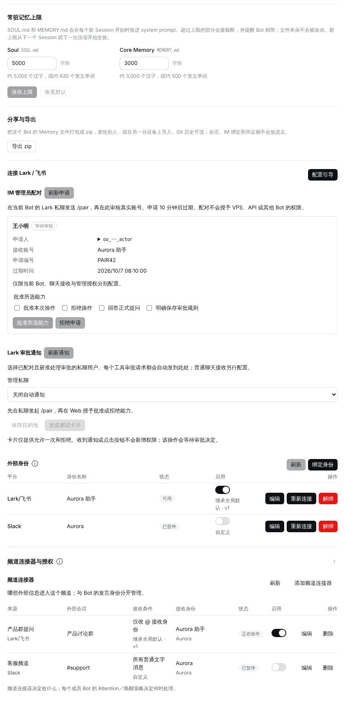 | 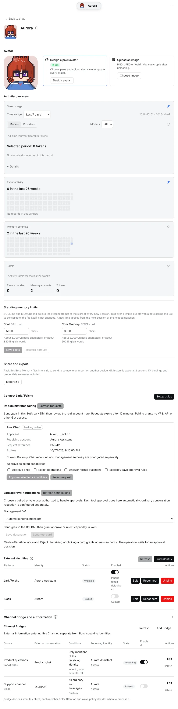 |

## After: sidebar entries

|       | zh                         | en                         |
| ----- | -------------------------- | -------------------------- |
| Light |  |  |
| Dark  | 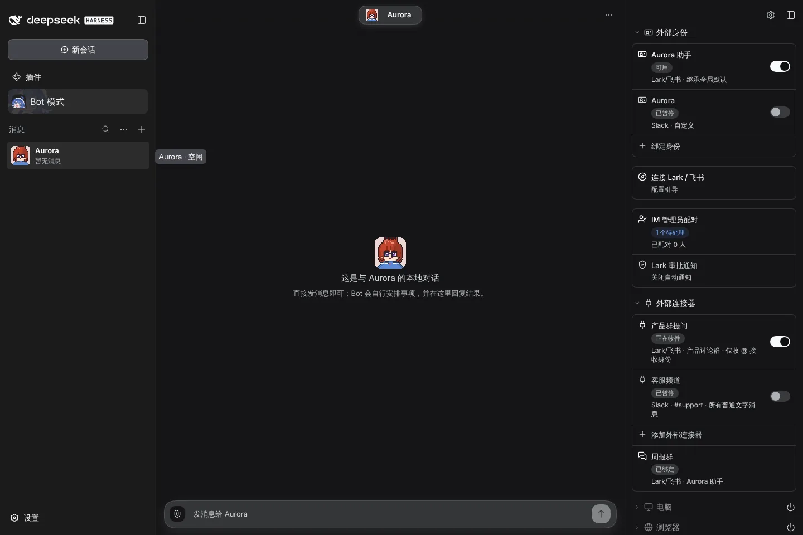  | 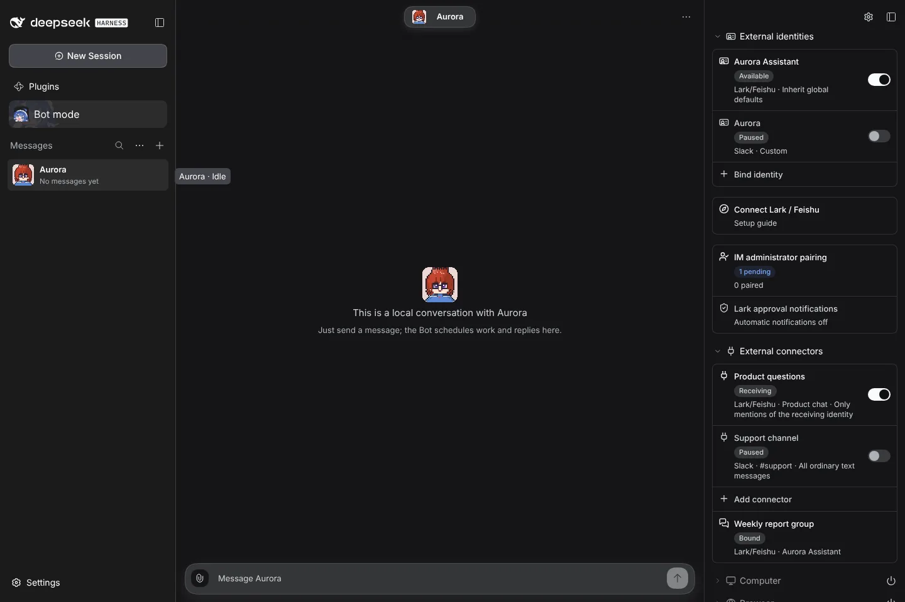  |

## Dialogs

|                                   | zh light                            | en dark                            |
| --------------------------------- | ----------------------------------- | ---------------------------------- |
| Edit identity                     | 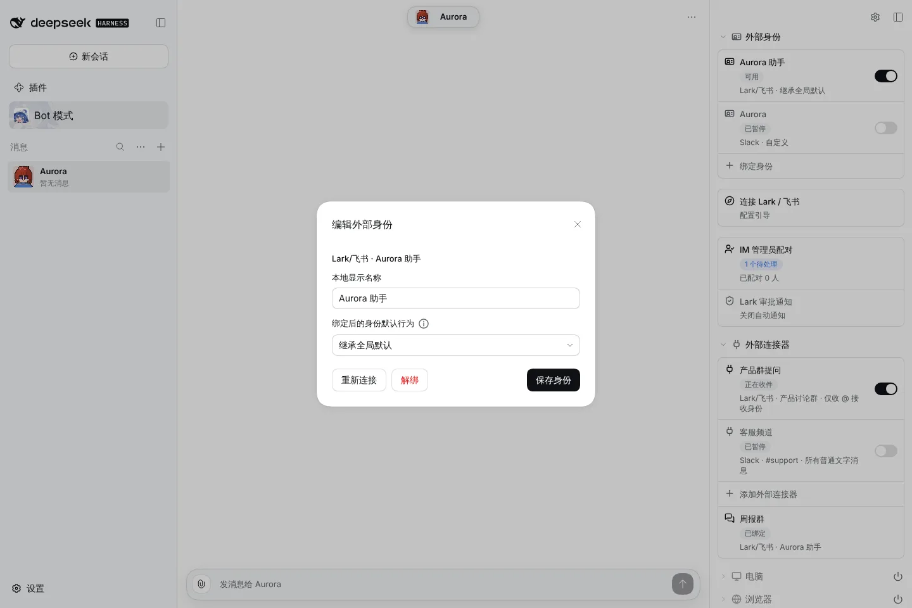  | 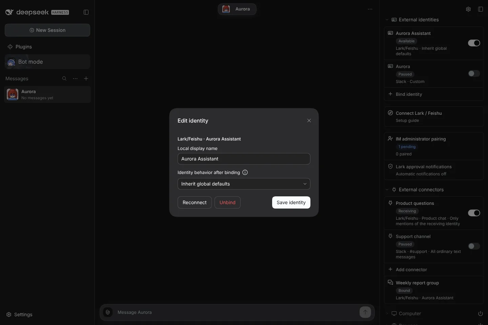  |
| IM administrator pairing          | 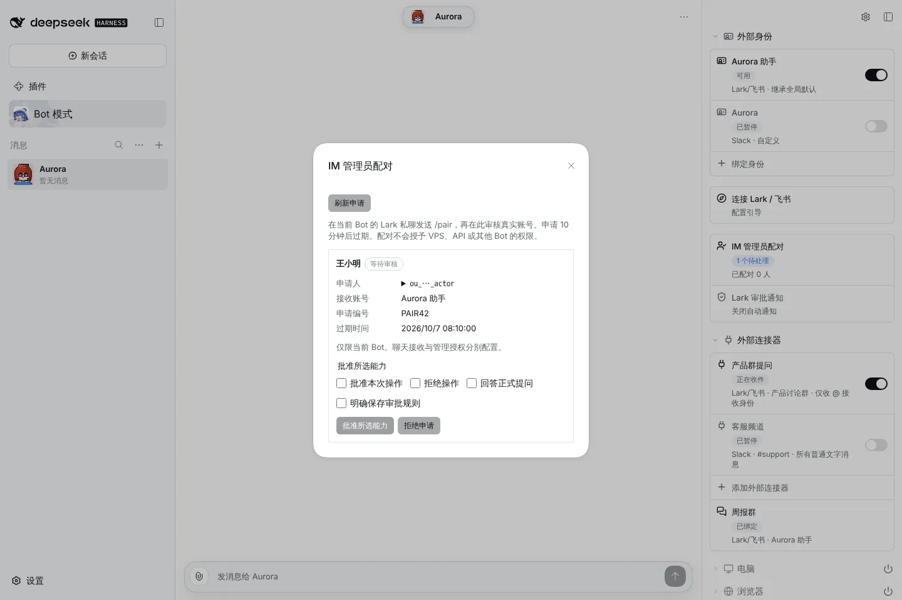   | 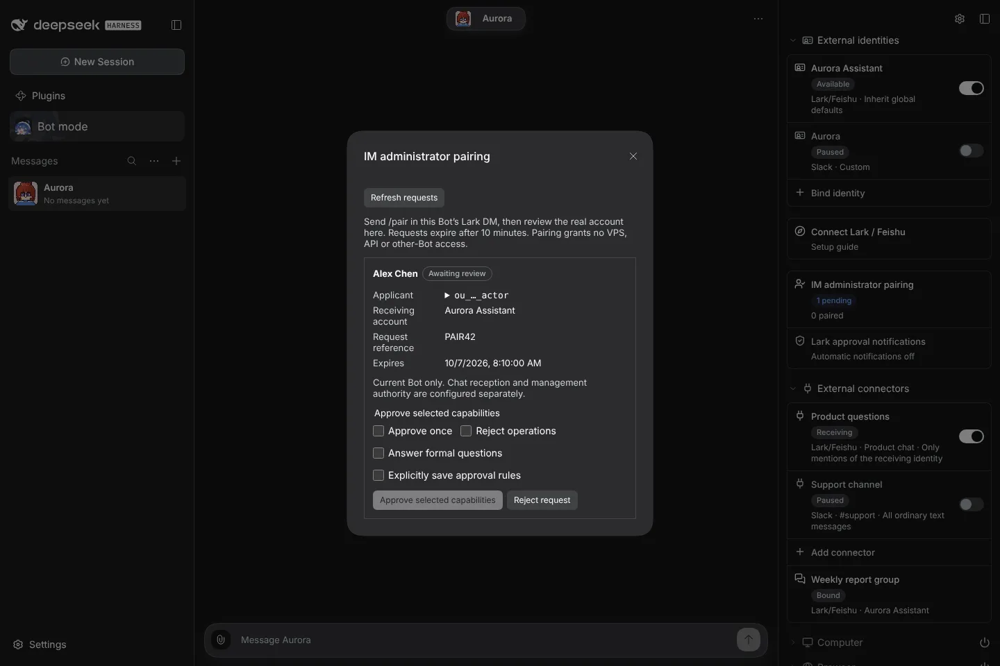   |
| Edit connector                    | 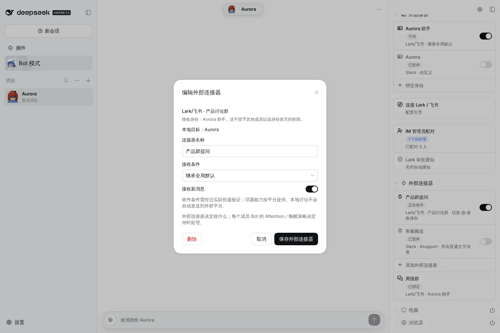 | 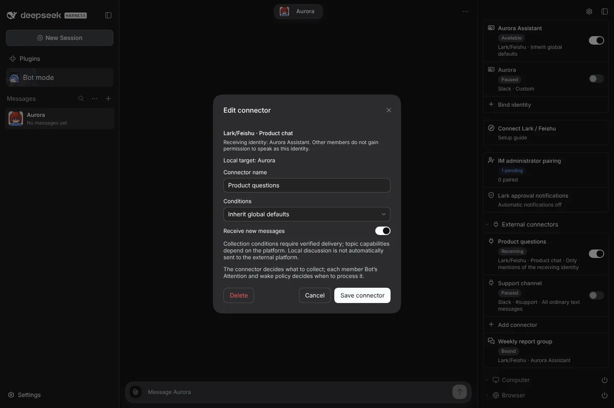 |
| Conversation authorization        | 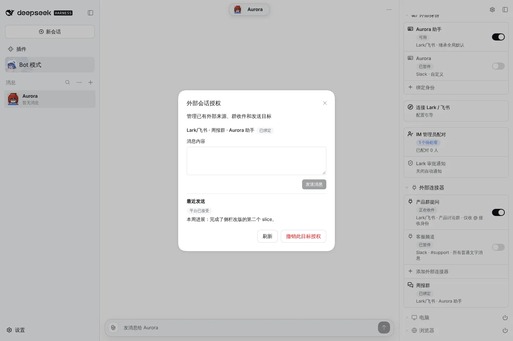     | 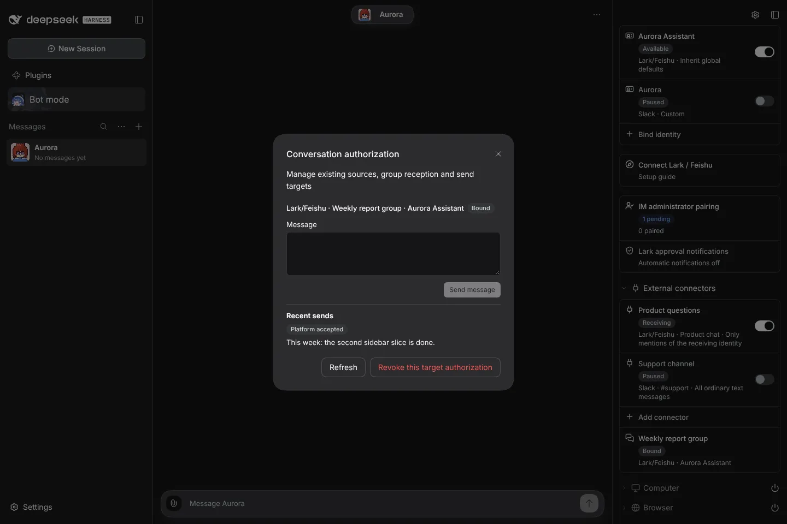     |
| Memory files: standing limits row | 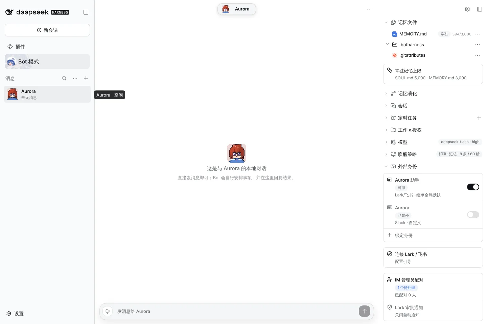    | 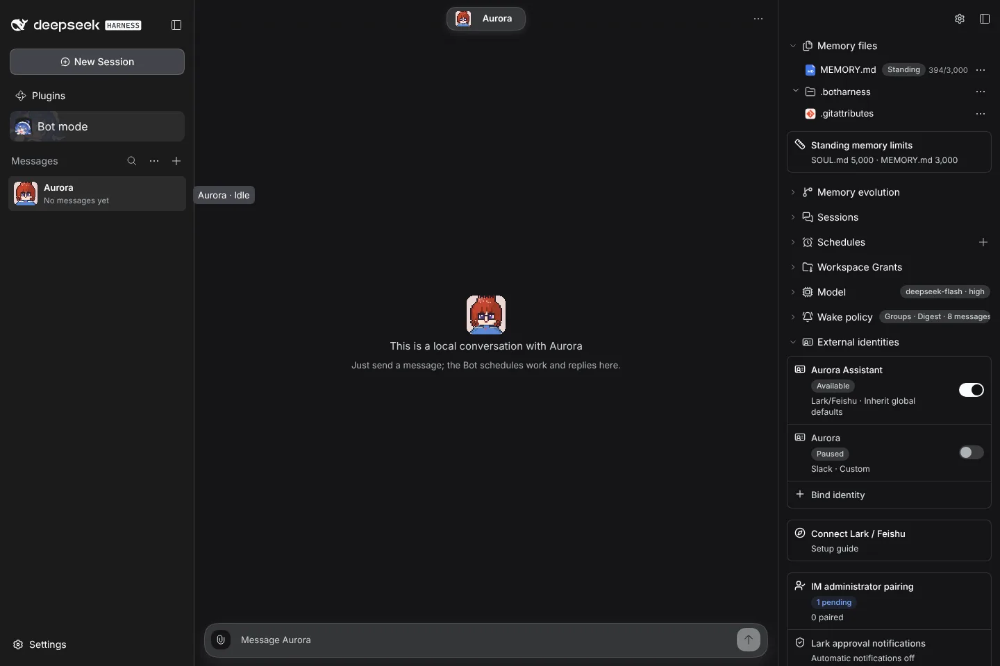    |
| Standing limits dialog            | 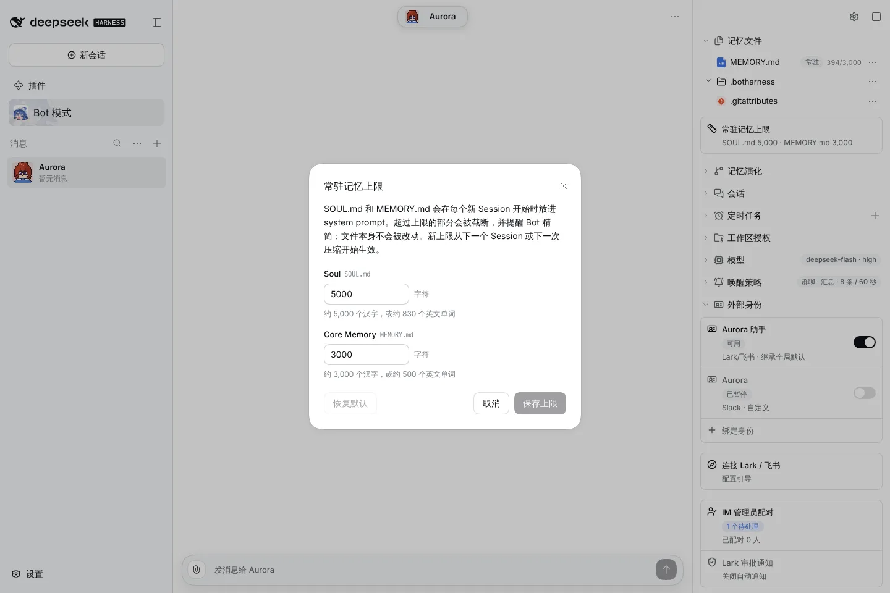    | 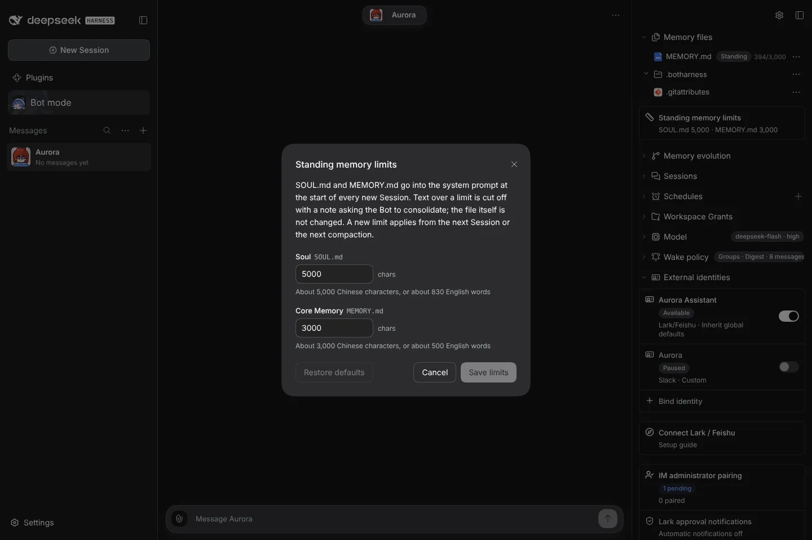    |

The remaining light/dark and zh/en variants are in this folder.
