# #1086 Group sidebar: Wake policy and External connectors

Captured on a real isolated DSH instance with three Bots in one local group. Bob and Ada have a group override; Cleo inherits the Bot default.

## Before: the group Profile held both tables

| zh                                         | en                                         |
| ------------------------------------------ | ------------------------------------------ |
| 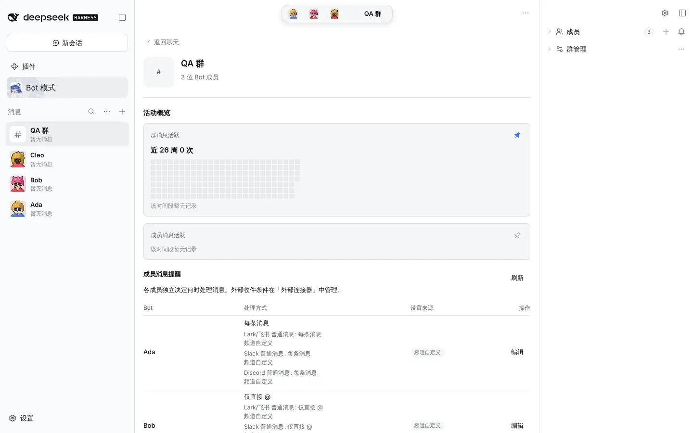 | 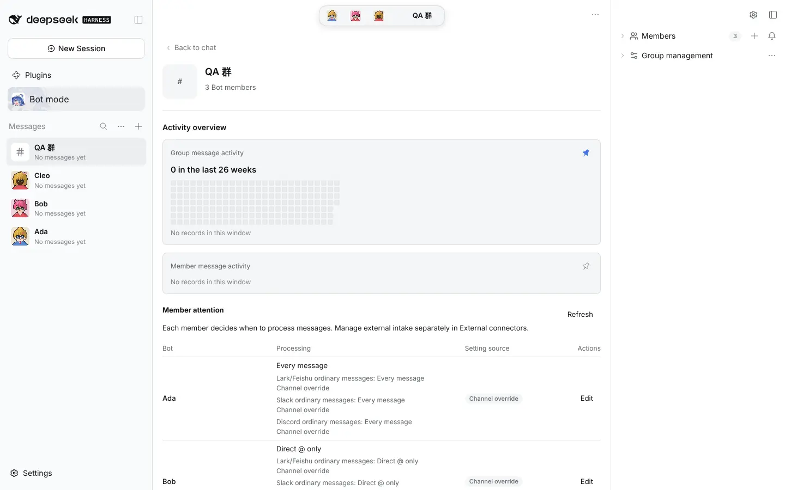 |

## After: group Channel sidebar entries

|       | zh                         | en                         |
| ----- | -------------------------- | -------------------------- |
| Light | 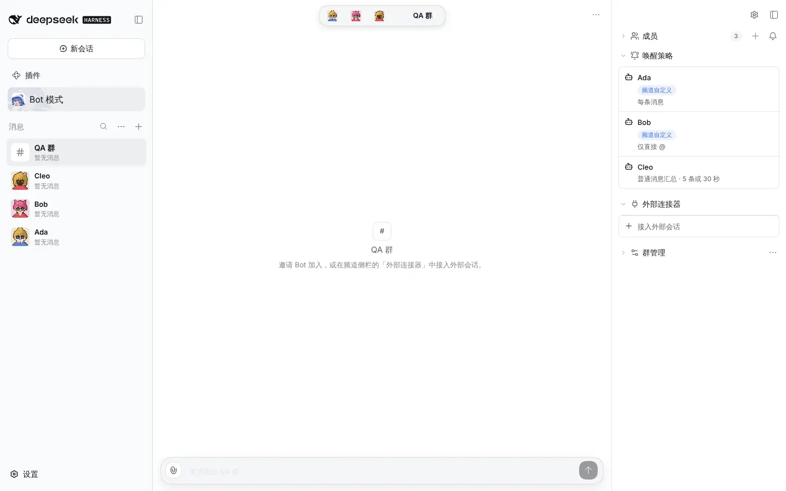 | 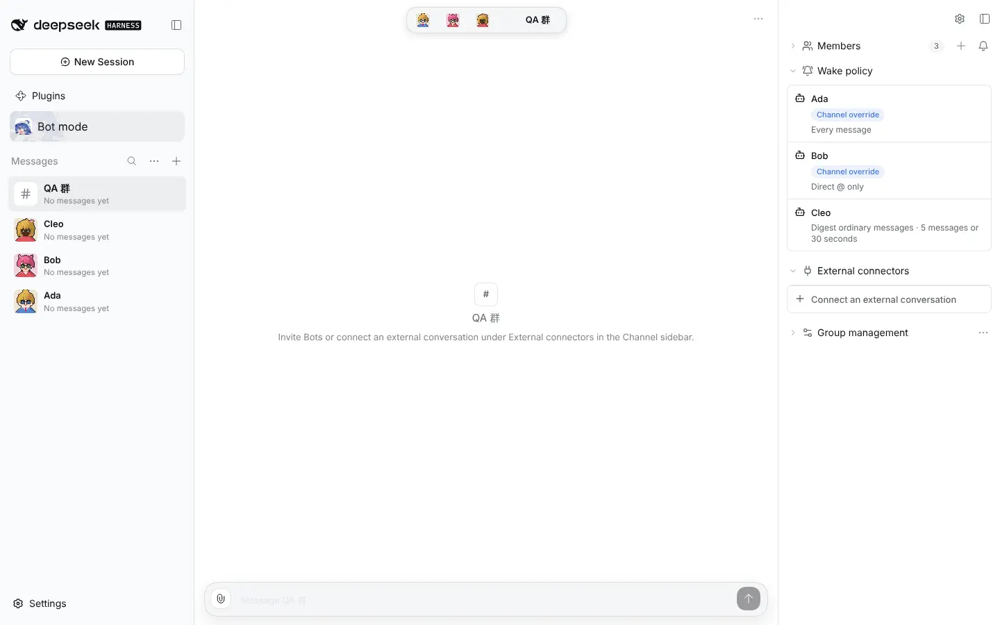 |
| Dark  | 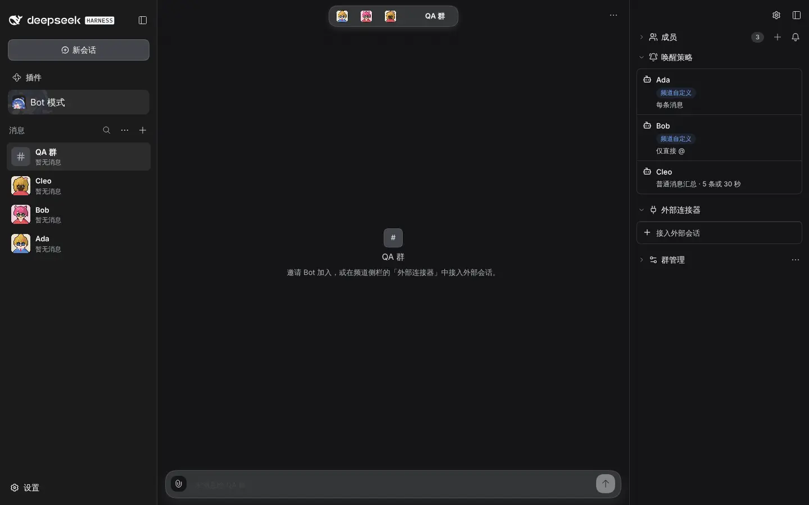  | 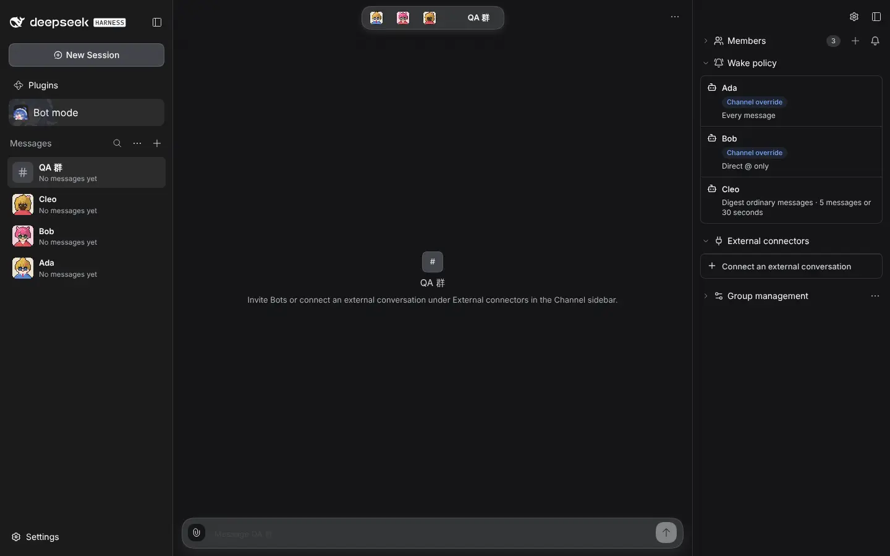  |

## Member wake dialog opened from a card

|       | zh                        | en                        |
| ----- | ------------------------- | ------------------------- |
| Light | 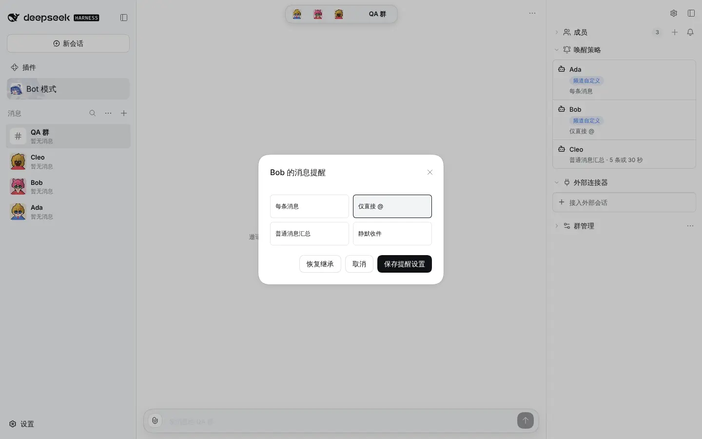 | 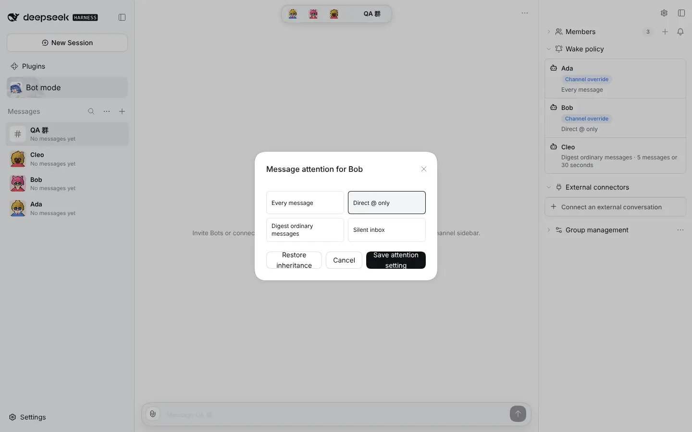 |
| Dark  | 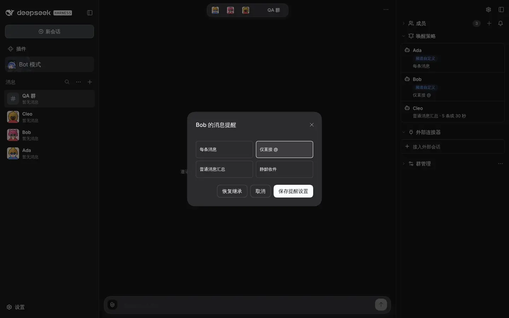  | 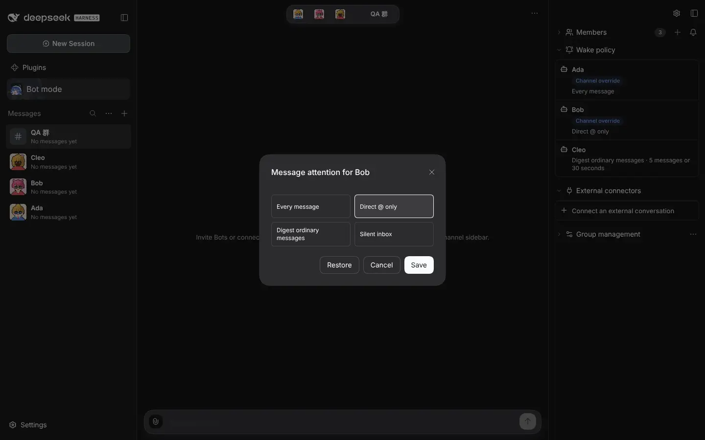  |

## After: group Profile keeps identity and activity

|       | zh                         | en                         |
| ----- | -------------------------- | -------------------------- |
| Light | 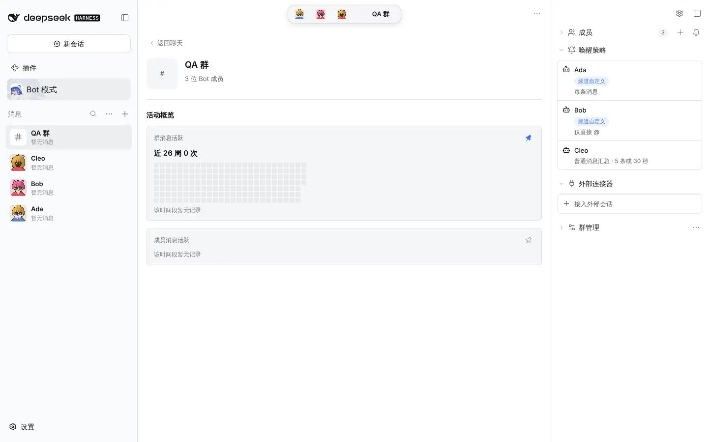 | 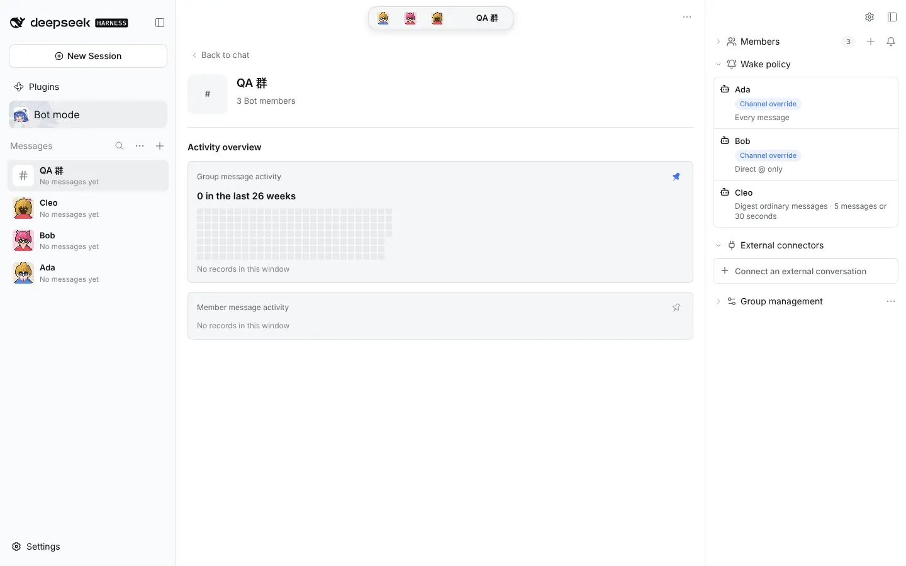 |
| Dark  | 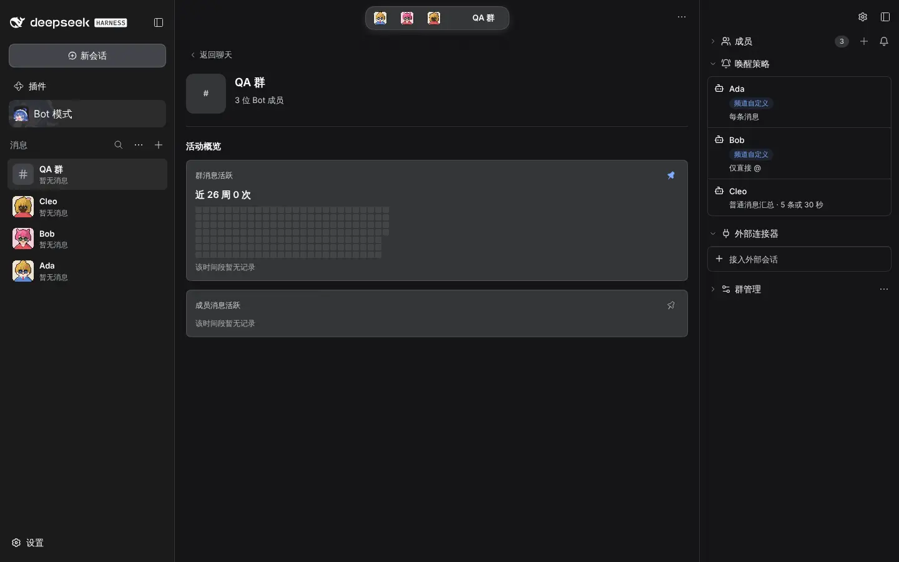  | 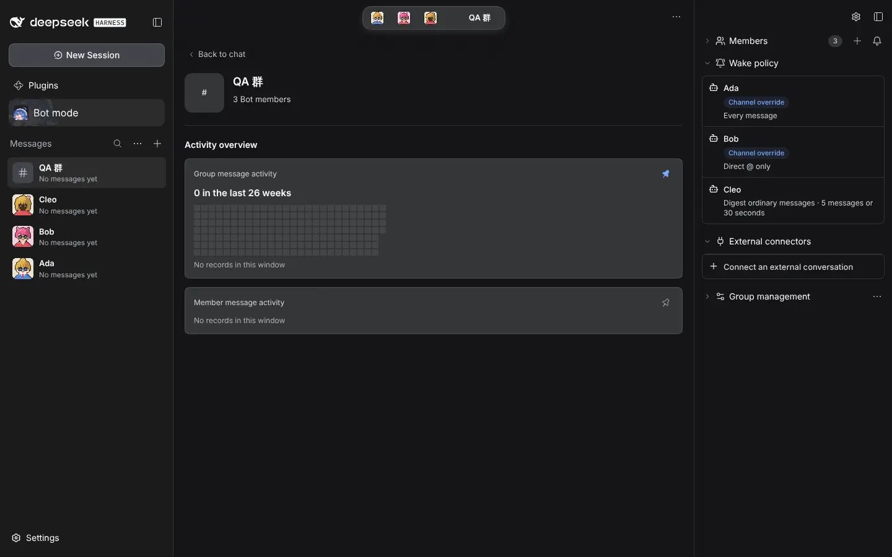  |
