# #1087 Profile header: Tags, Bio, Share and Edit profile

Captured on a real isolated DSH instance with one Bot (Tags 研究员 / 写作 and a Bio).

## Before: the Profile view held avatar, export and delete settings

| zh                                         | en                                         |
| ------------------------------------------ | ------------------------------------------ |
| 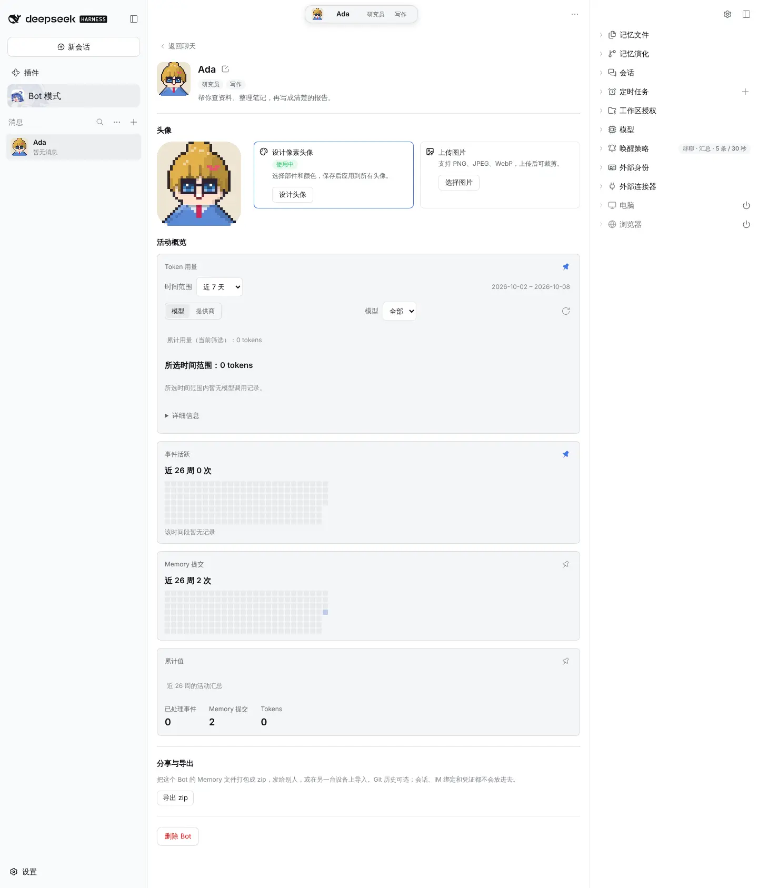 | 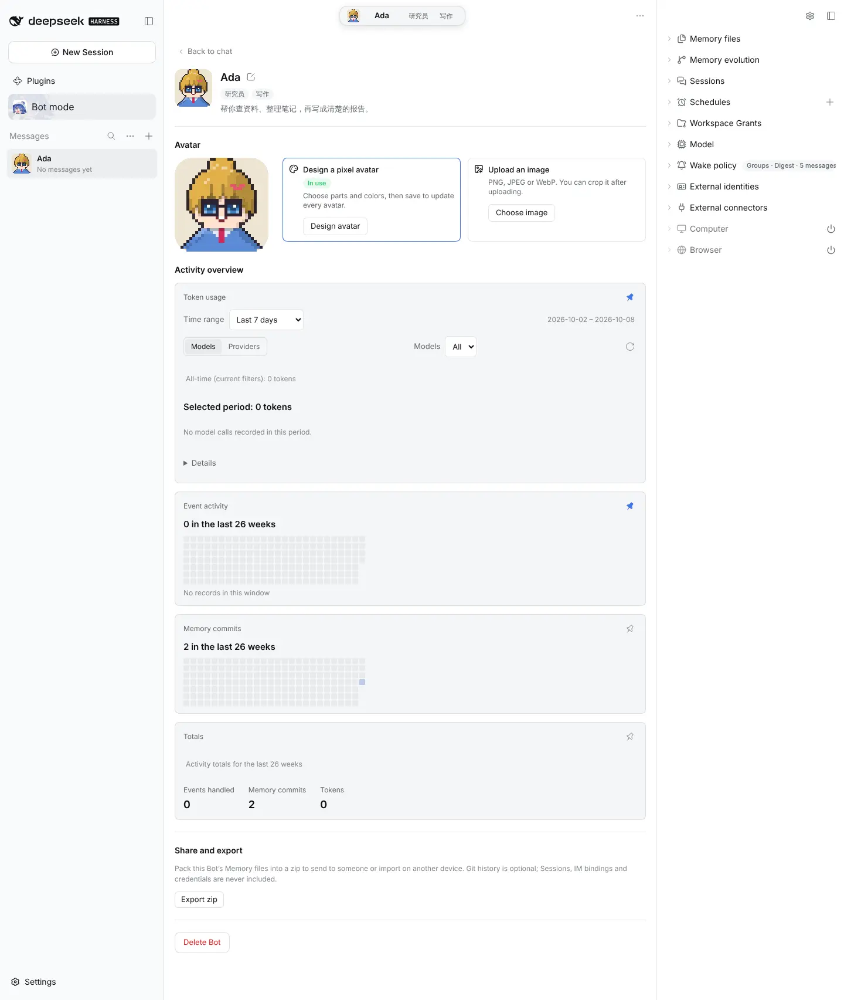 |

## After: identity header and activity only

| zh                              | en                              |
| ------------------------------- | ------------------------------- |
| 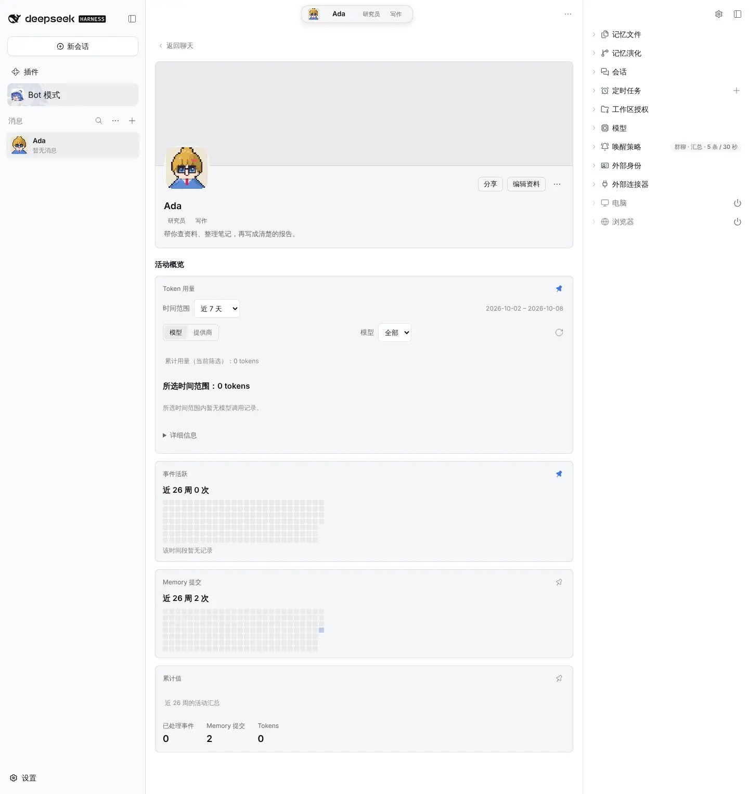 | 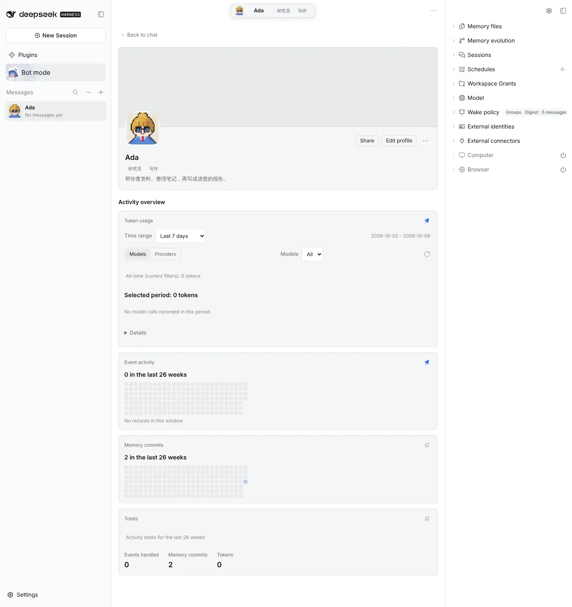 |

|       | zh                         | en                         |
| ----- | -------------------------- | -------------------------- |
| Light | 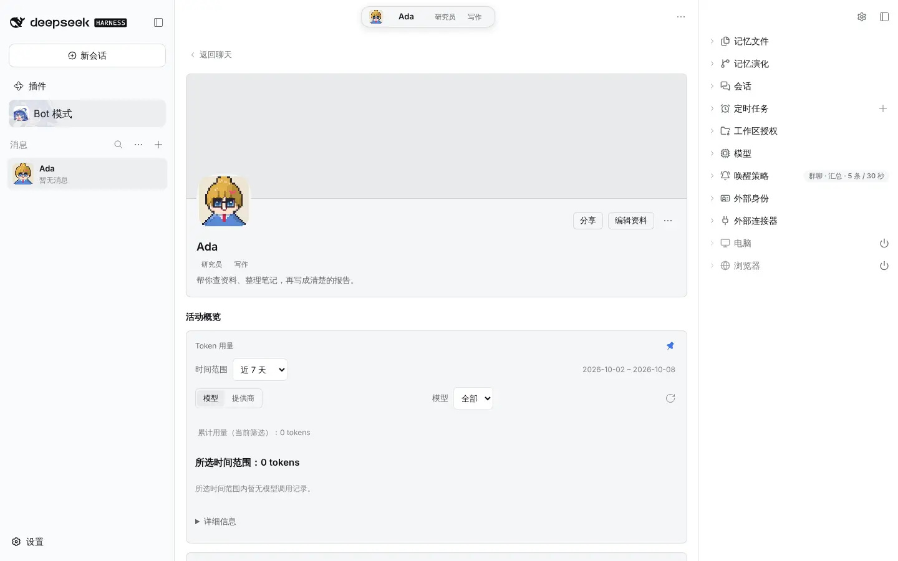 | 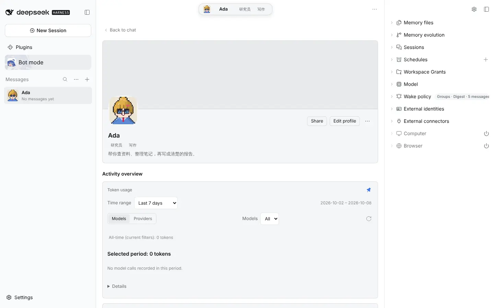 |
| Dark  | 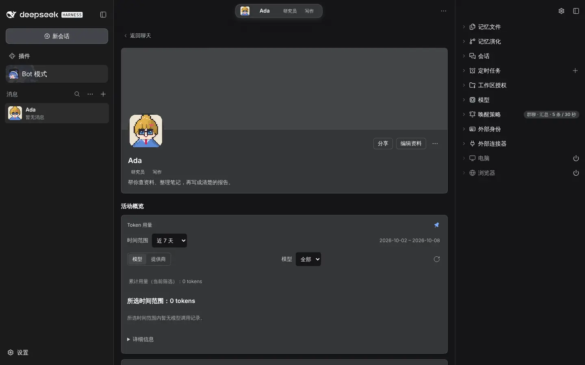  | 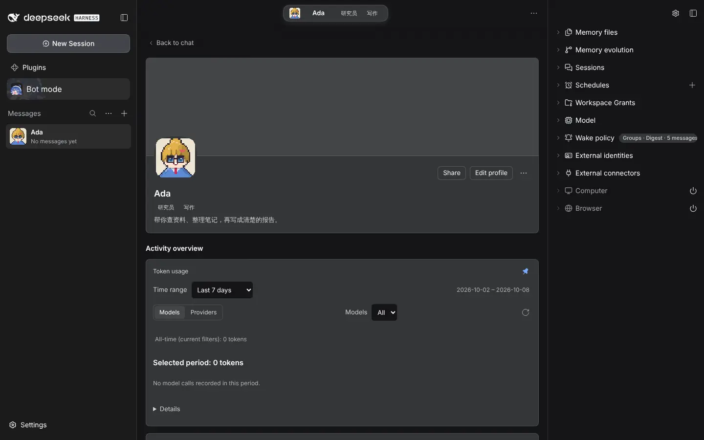  |

## Edit profile

|       | zh                      | en                      |
| ----- | ----------------------- | ----------------------- |
| Light | 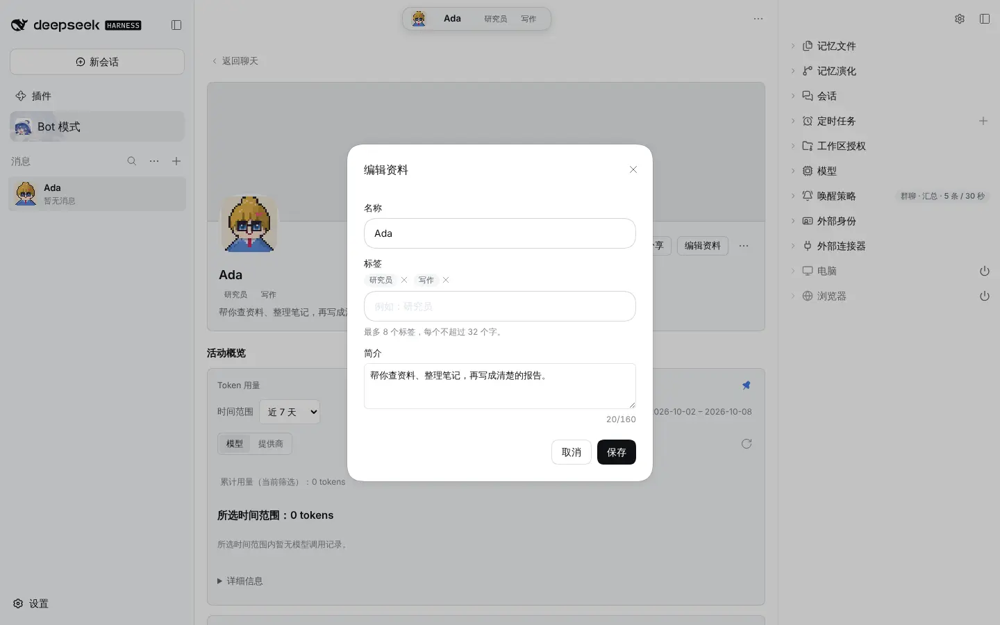 | 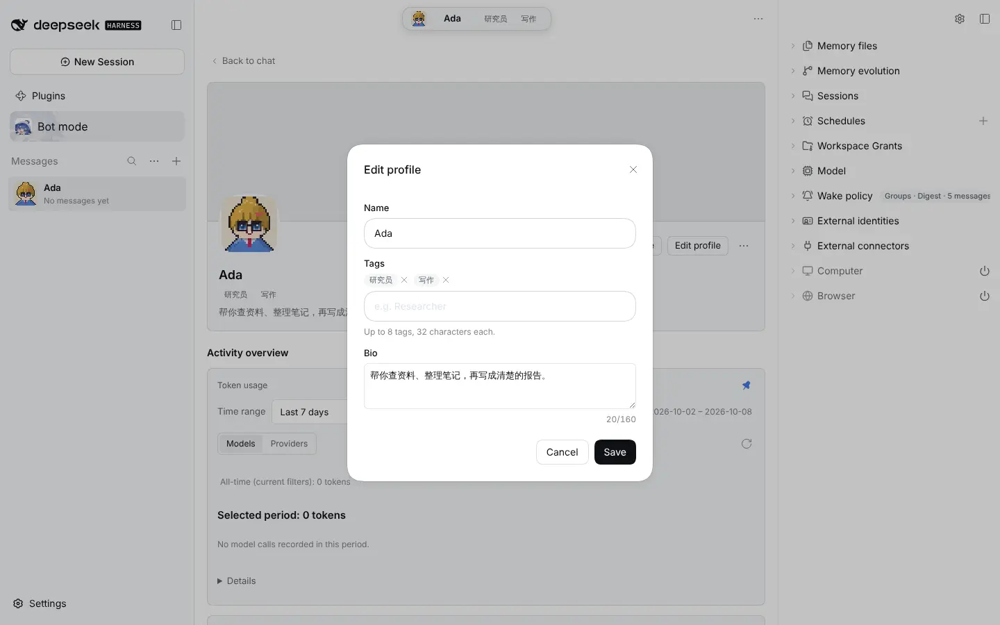 |
| Dark  | 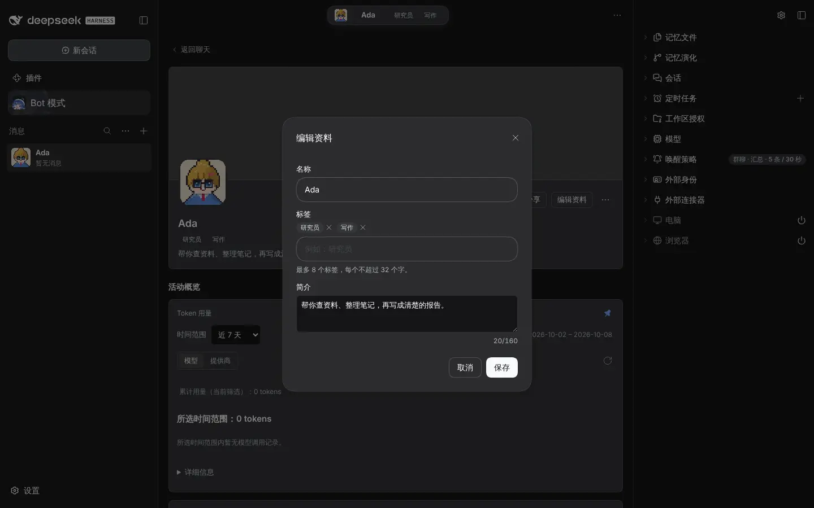  | 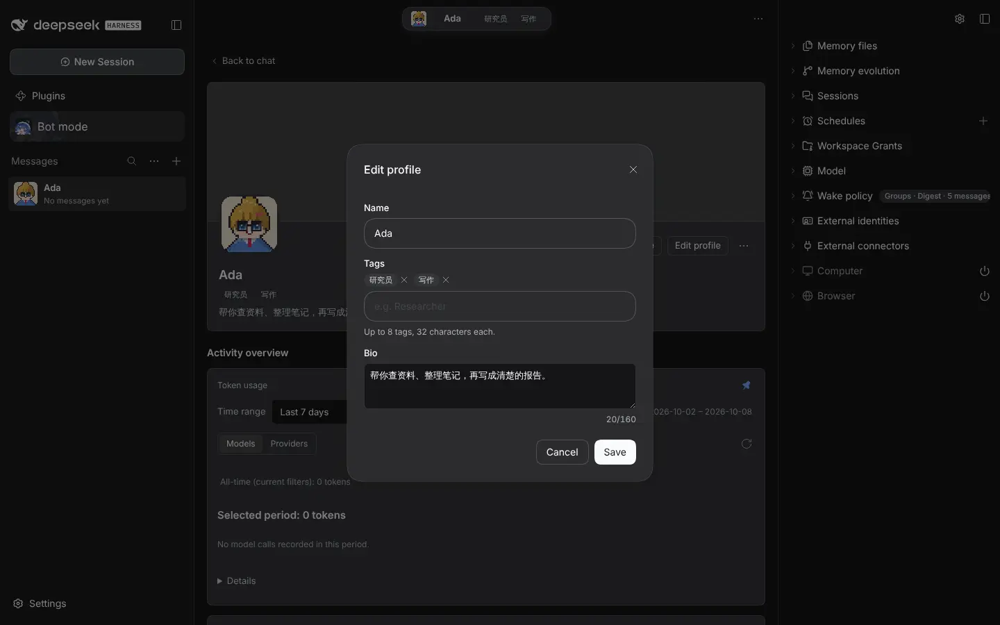  |

## Share from the sidebar's right-click menu

|       | zh                      | en                      |
| ----- | ----------------------- | ----------------------- |
| Light |  | 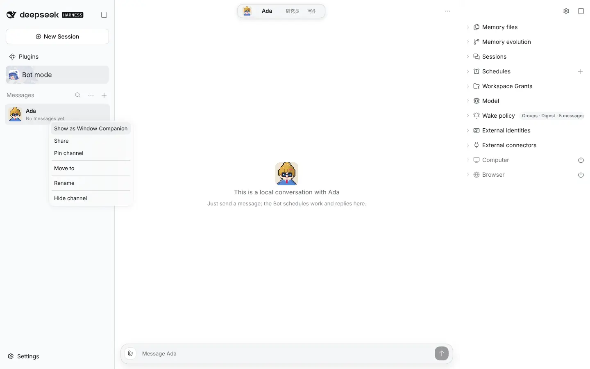 |
| Dark  | 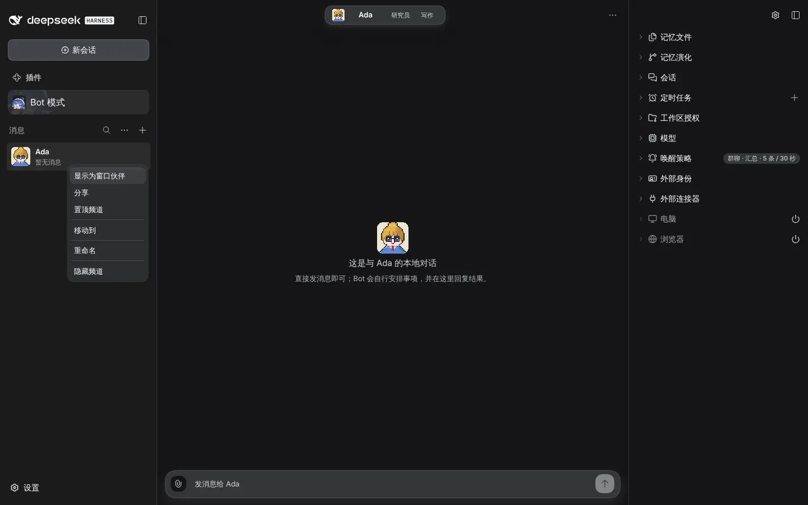  | 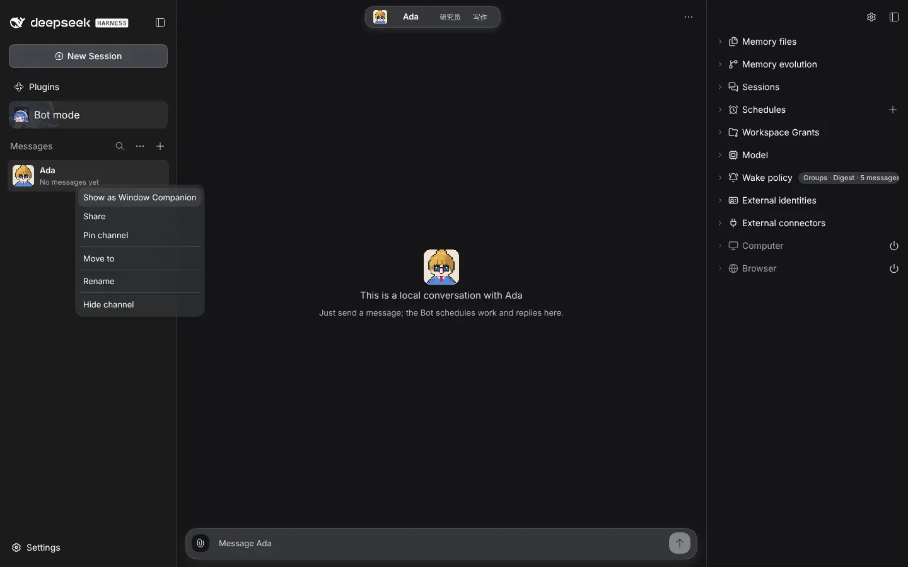  |
