# #1088 Token usage card

Captured on a real isolated DSH instance after two real DM turns (opencode-go/deepseek-v4-flash). This provider does not report the cached / output split, so the bars are grey "Total (breakdown unavailable)".

## Before → after, same 7-day range (76,997 tokens)

| Before (818 px)                         | After: Daily total (332 px)   | After: By model (206 px)      |
| --------------------------------------- | ----------------------------- | ----------------------------- |
| 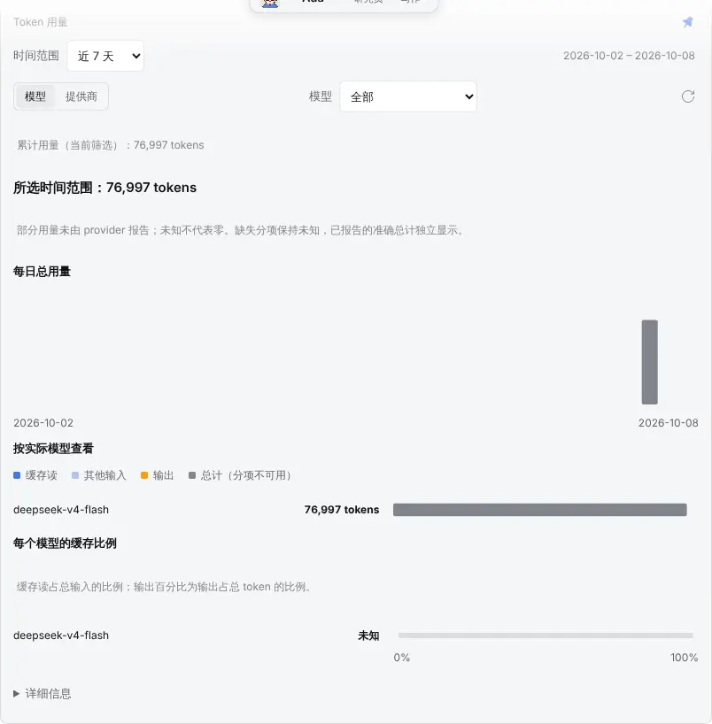 | 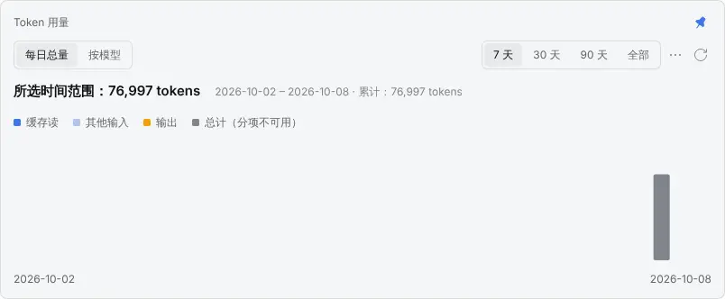 | 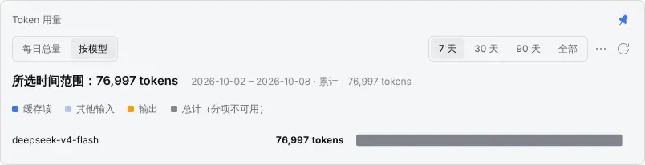 |
| 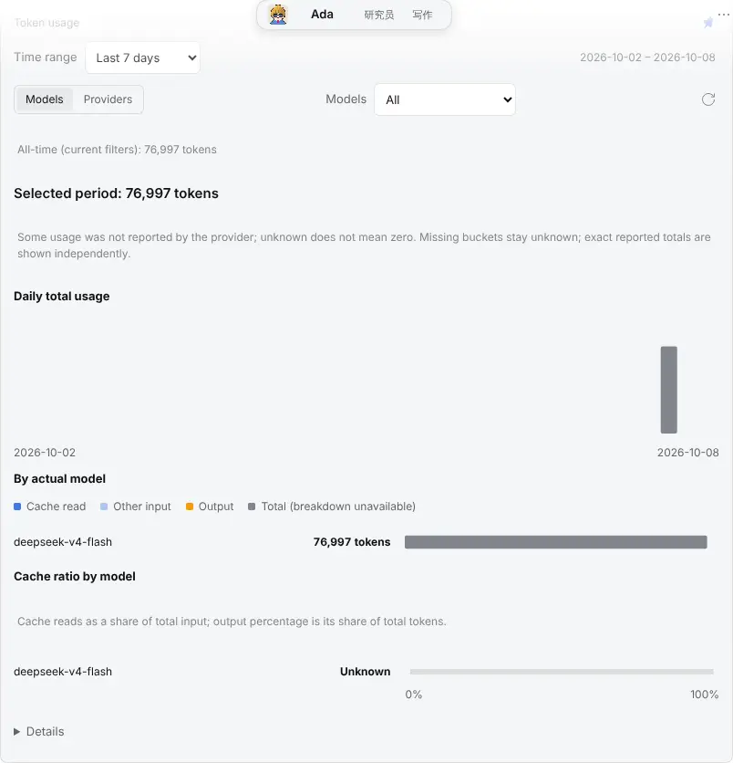 | 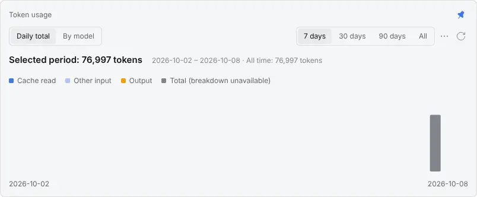 | 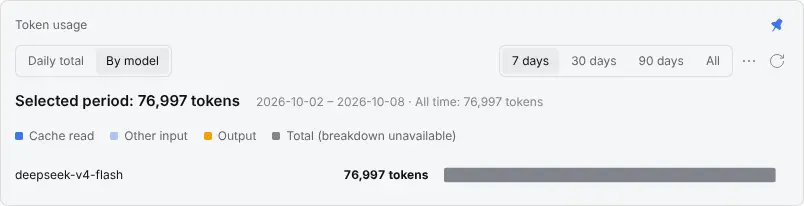 |

## Dark

| zh                           | en                           |
| ---------------------------- | ---------------------------- |
| 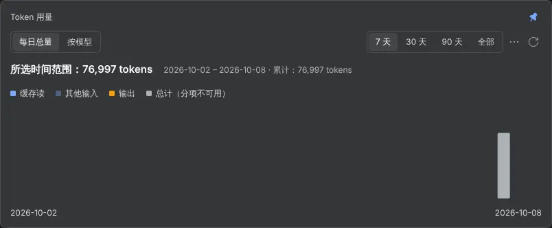 | 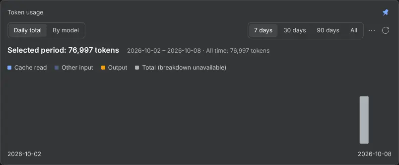 |
| 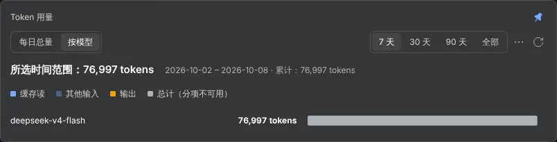 | 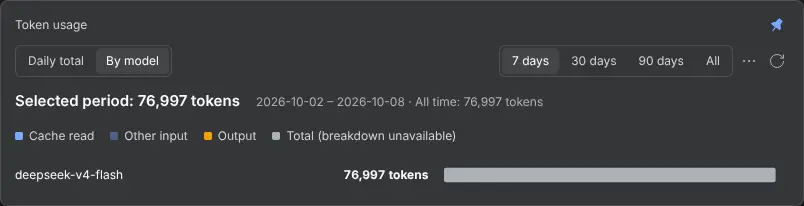 |

## Custom range from the ⋯ menu, and the split in the tooltip

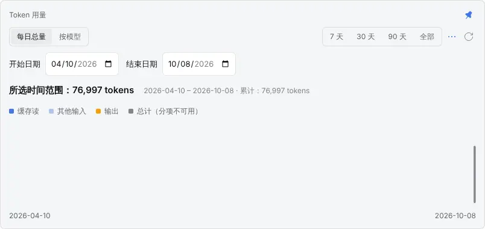

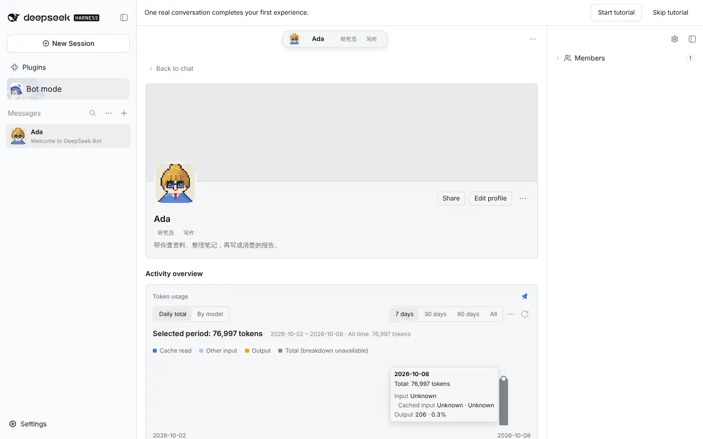
