# #1089 Activity heatmaps

Captured on a real isolated DSH instance. For evidence only, the QA Bot's creation date in that throwaway profile was set to 2025-03-03 and its Memory repository was given backdated commits, so the heatmap has 84 weeks of history to page through. Event activity is real (two DMs today).

## Width-driven columns, newest week on the right

| 1440 px window (774 px heatmap, 64 visible columns) | 1060 px window (394 px heatmap, 33 visible columns) |
| --------------------------------------------------- | --------------------------------------------------- |
| 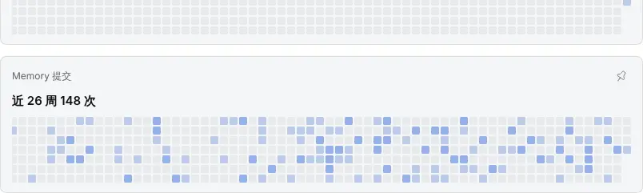                            | 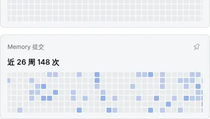                            |
| 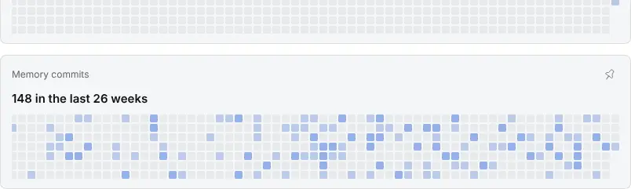                            | 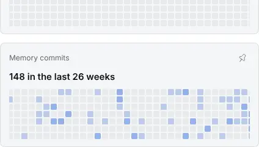                            |

## Scrolled back to the Bot's creation week

| zh                       | en                       |
| ------------------------ | ------------------------ |
| 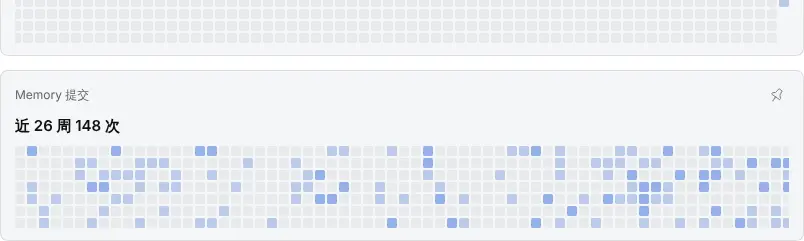 | 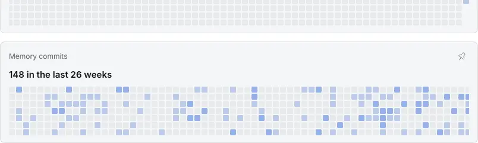 |

## Dark

| zh                            | en                            |
| ----------------------------- | ----------------------------- |
| 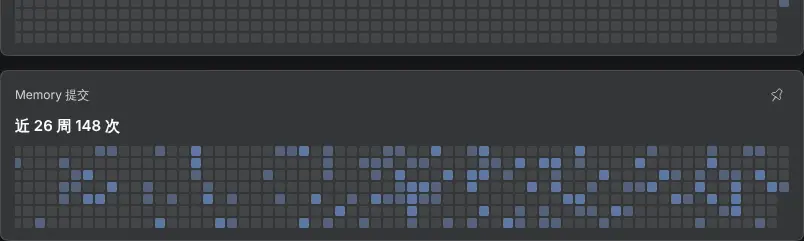 | 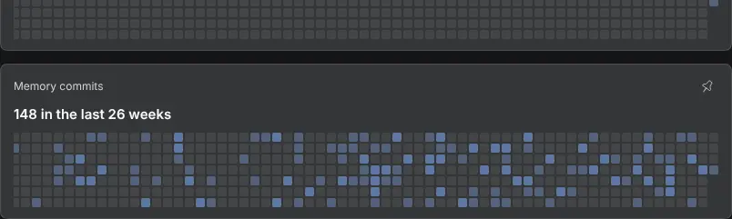 |

## Popover fills its width; per-reason counts in the tooltip

| Popover              | Tooltip (zh)            | Tooltip (en)            |
| -------------------- | ----------------------- | ----------------------- |
| 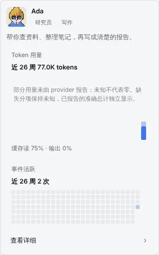 | 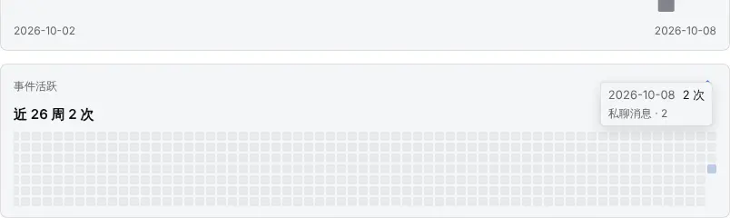 | 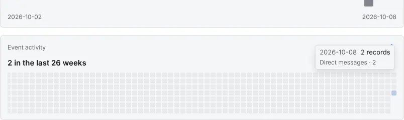 |
