# #1092 Profile banner

Captured on a real isolated DSH instance (1440 × 900). Ada had no banner before this change; the Host gave her a name-seeded autumn scene at startup.

## Profile

|       | zh                         | en                         |
| ----- | -------------------------- | -------------------------- |
| Light | 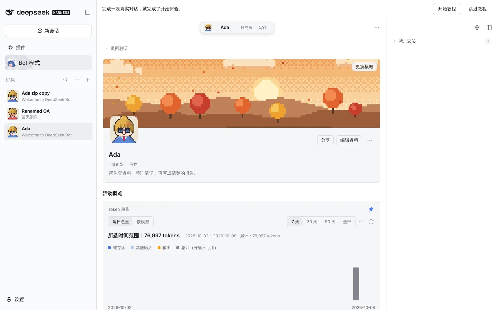 | 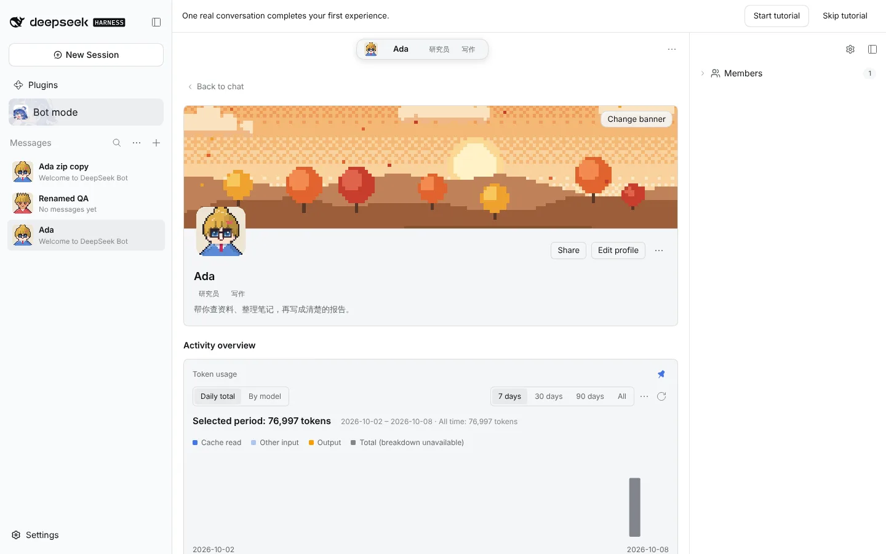 |
| Dark  |   | 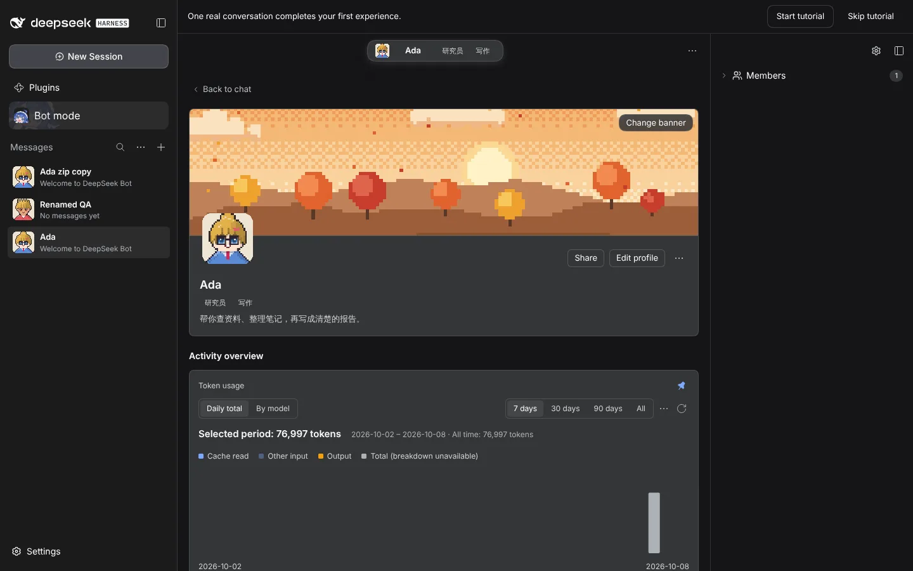  |

## Change banner

|       | zh                        | en                        |
| ----- | ------------------------- | ------------------------- |
| Light | 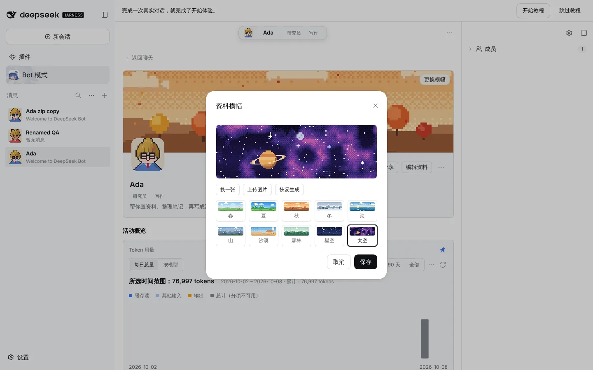 | 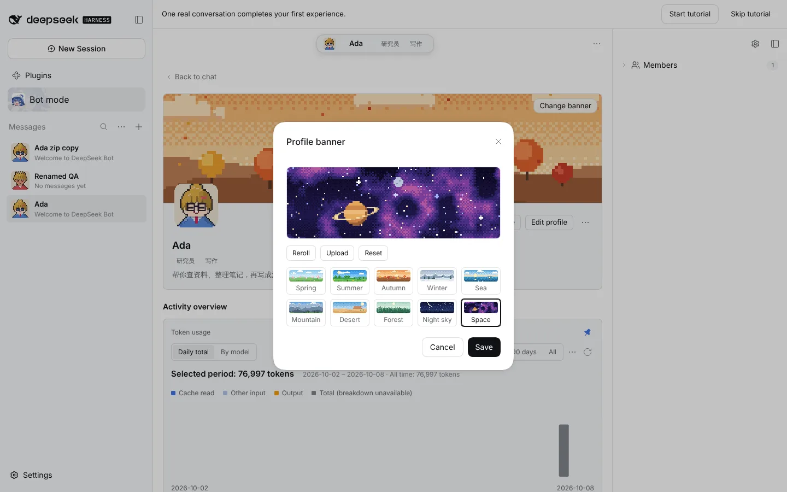 |
| Dark  | 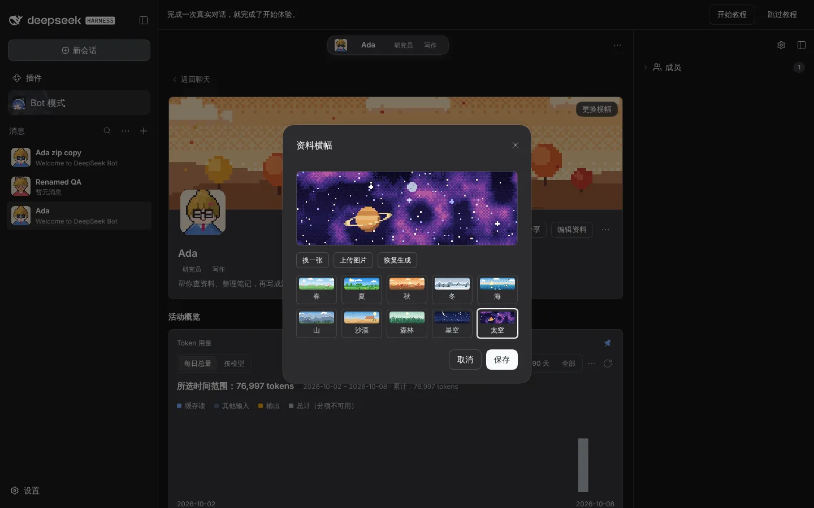  |   |

## Upload: 3:1 crop, then the saved image

| Crop (zh)               | Crop (en)               | Saved (zh)                  |
| ----------------------- | ----------------------- | --------------------------- |
| 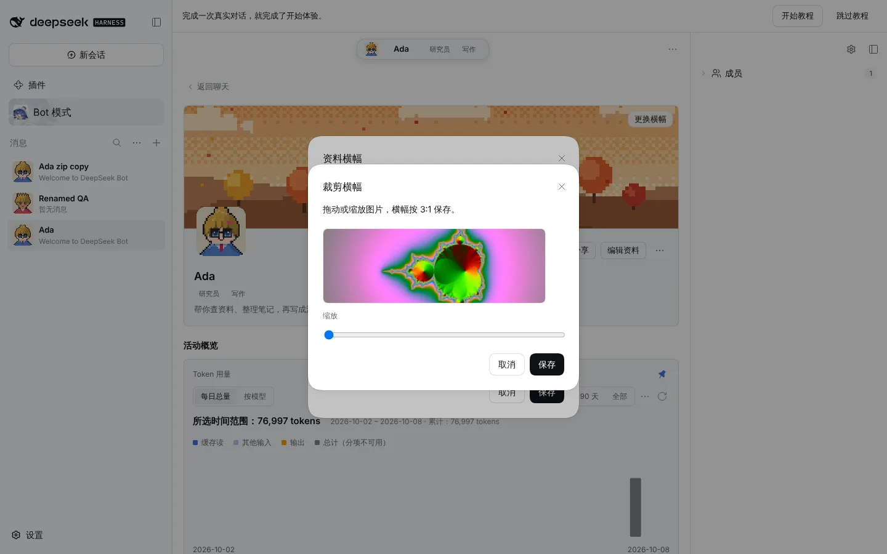 | 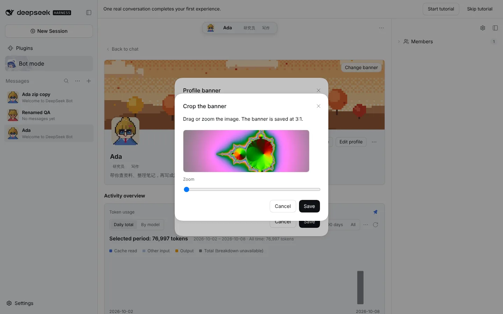 | 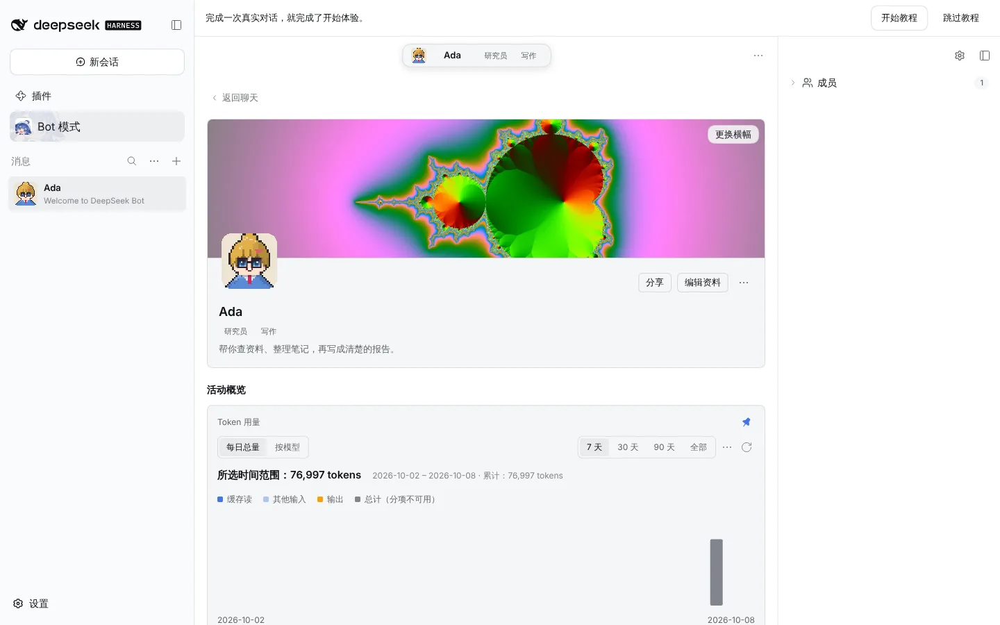 |

## Popover

|       | zh                         | en                         |
| ----- | -------------------------- | -------------------------- |
| Light | 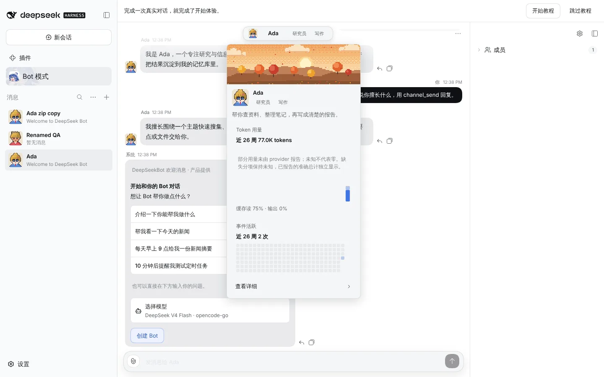 | 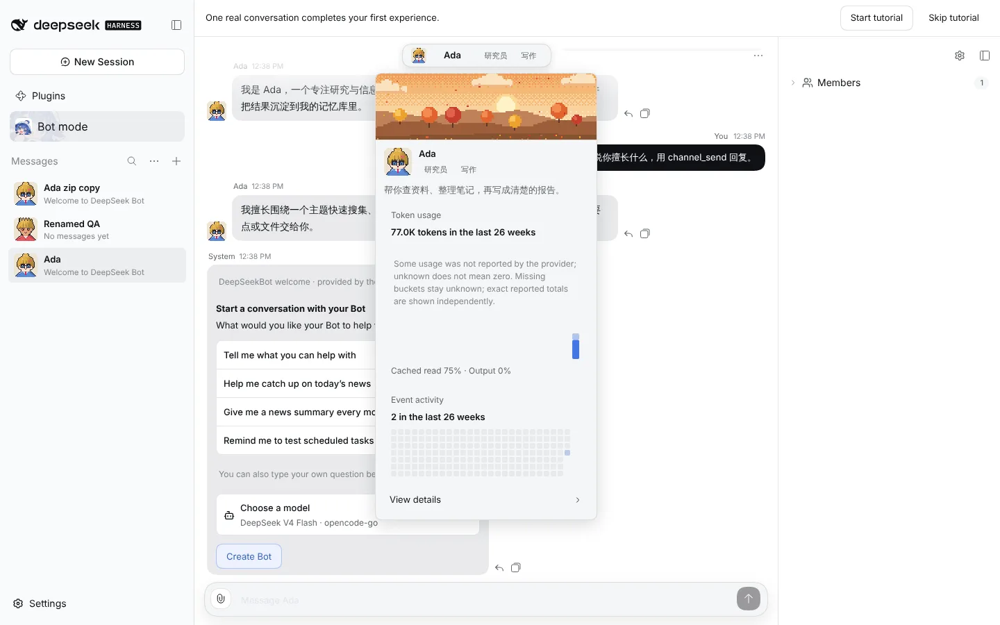 |
| Dark  | 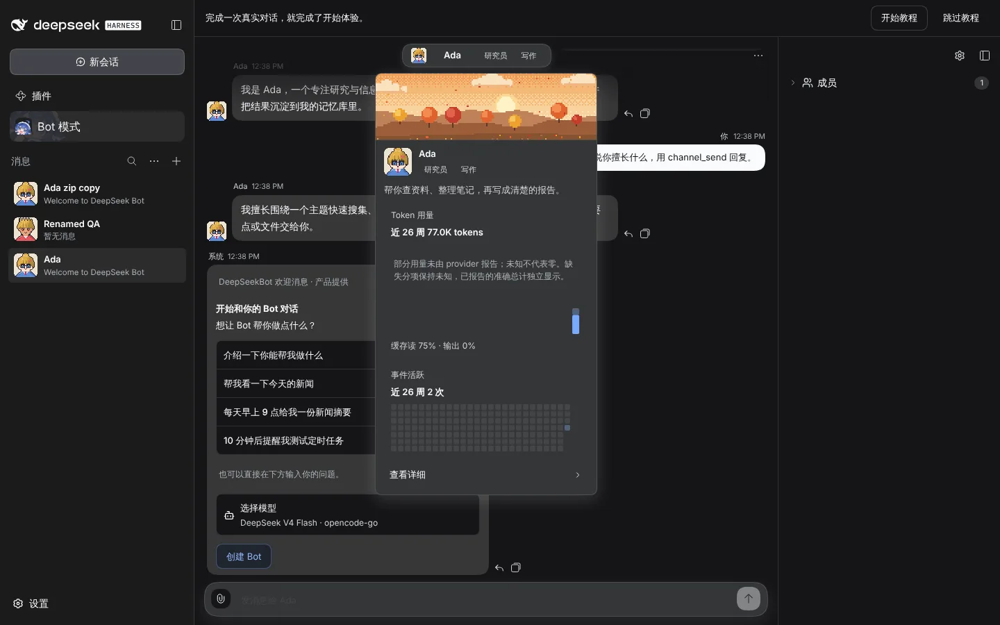  | 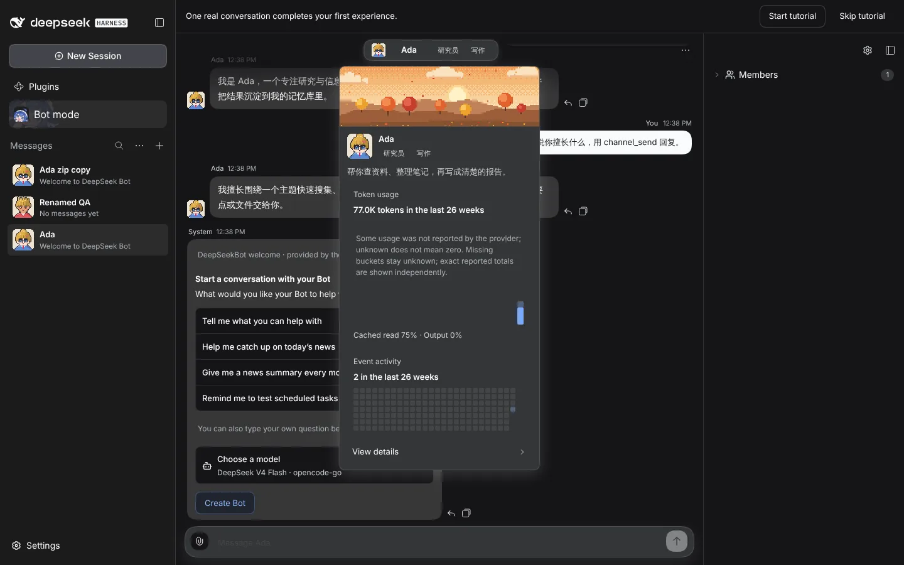  |

`guide-05-banner-zh.webp` and `guide-05-banner-en.webp` are the guide images that `docs/share-bot` references as `/guides/share-bot/05-banner-*.webp`; the site copies them into `public/guides/share-bot/` when it next syncs docs.
