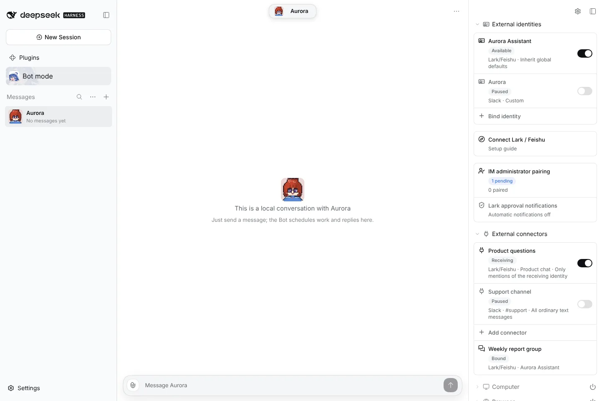
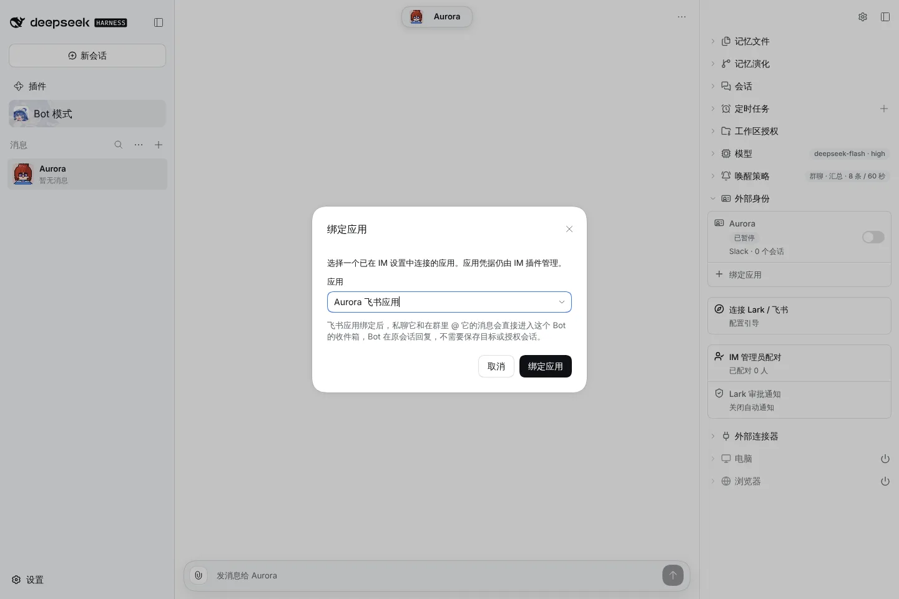
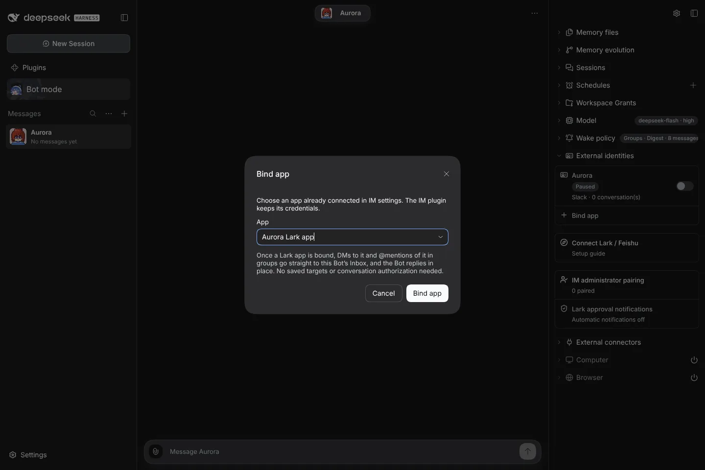
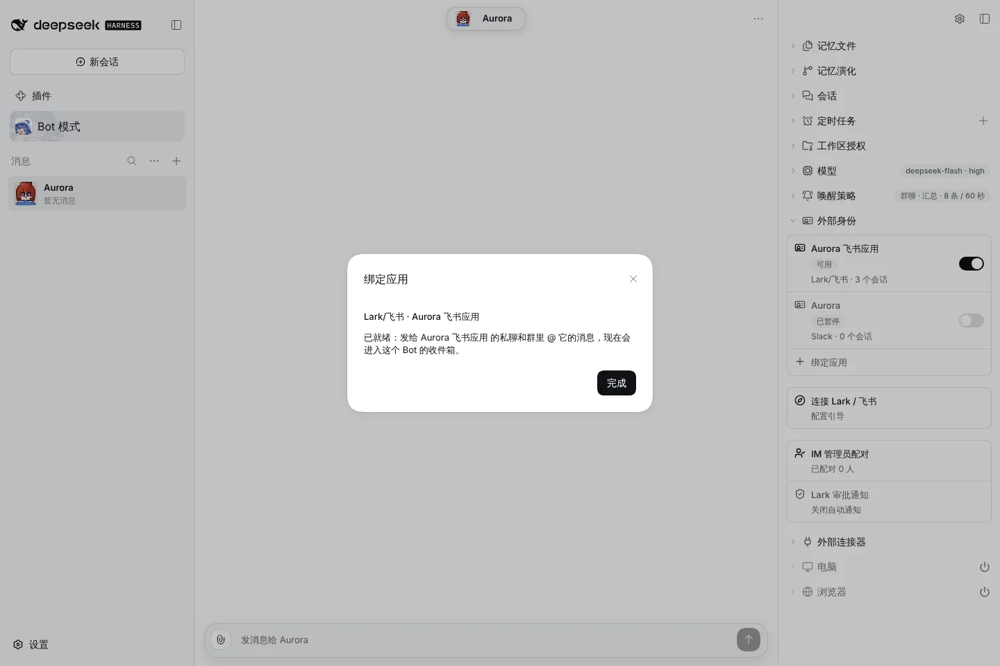
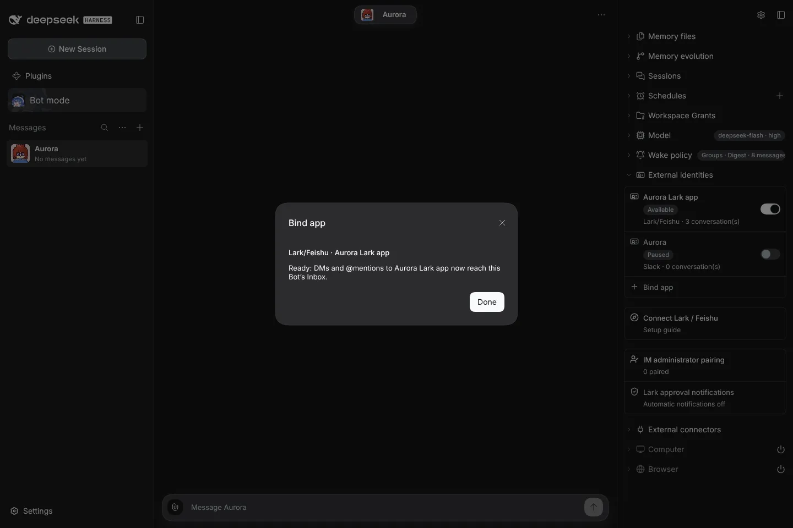
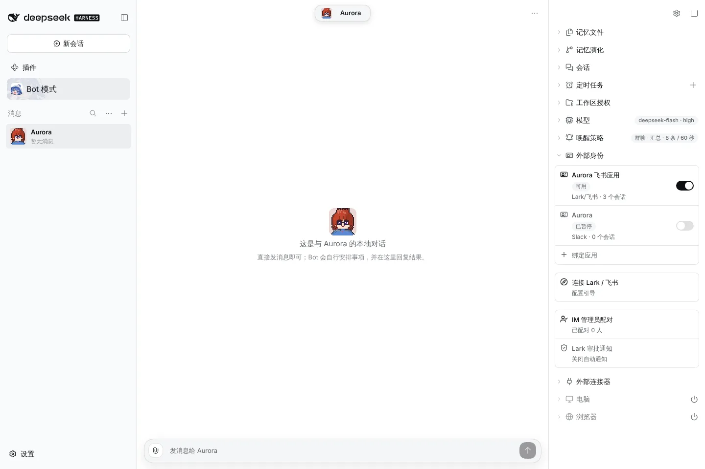
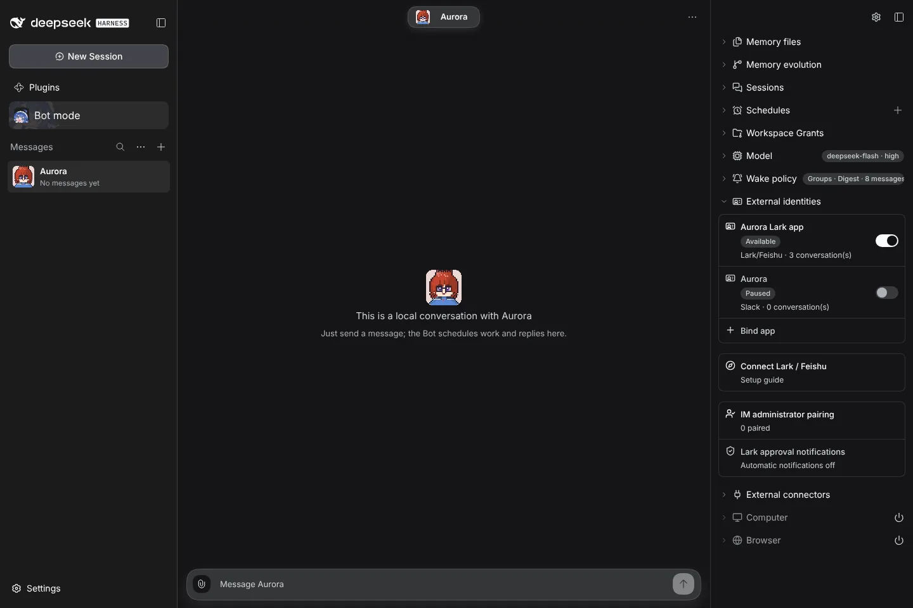
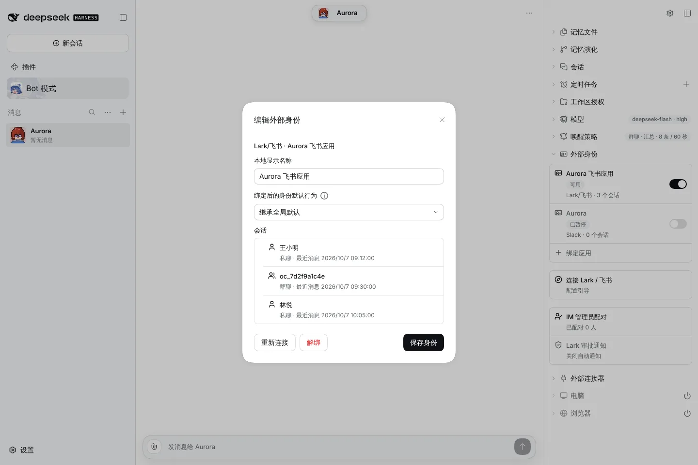
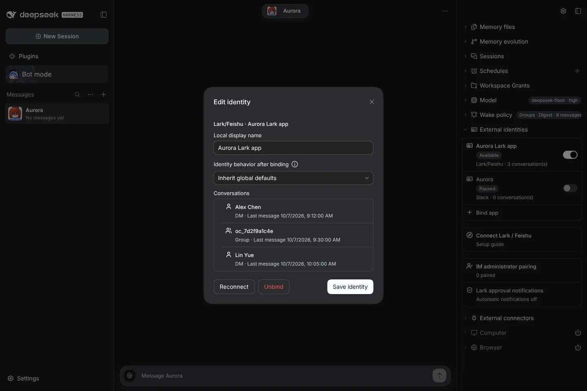

# #1108 Bind a Lark app; DMs and @mentions reach the Inbox

Rows and conversations are sample data injected into the client; the Host behaviour is covered by `packages/core/test/messaging-default-traffic.test.ts`.

## Before: Bind identity, then authorize each conversation

| zh                                                                         | en                                                                         |
| -------------------------------------------------------------------------- | -------------------------------------------------------------------------- |
|  |  |

## After

|                        | zh light                         | en dark                         |
| ---------------------- | -------------------------------- | ------------------------------- |
| Bind app dialog        |    |    |
| Ready after the commit |     |     |
| App row with count     |        |        |
| Conversation list      |  |  |

The remaining light/dark and zh/en variants are in this folder.
