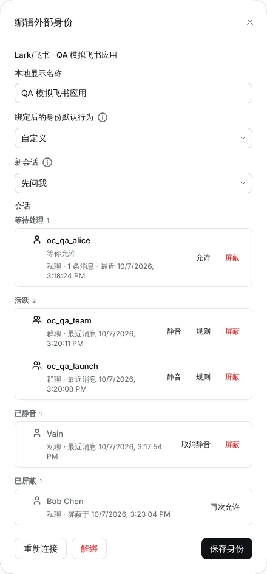
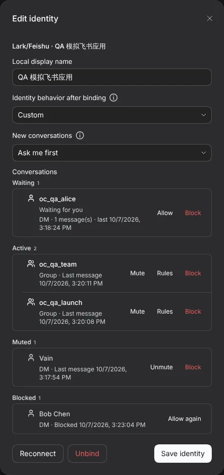
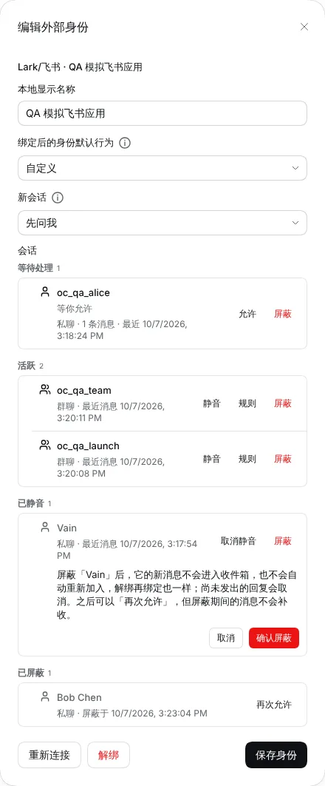
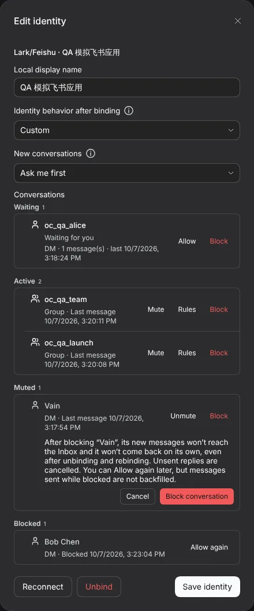
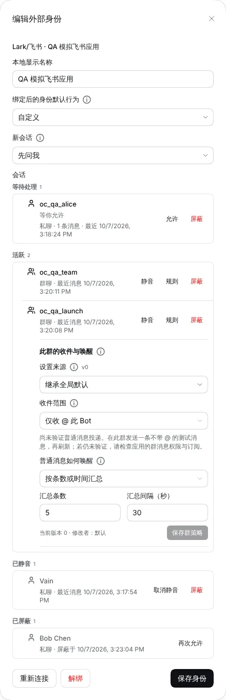
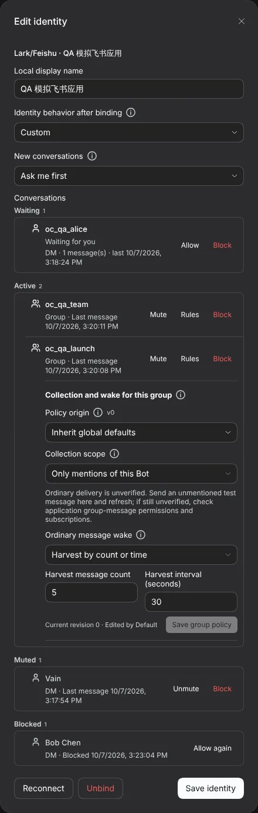

# #1109 Conversation list: mute, rules, block, allow again

Captured from a real DSH Host (0.2.0-rc.1) with the simulated Lark provider and the real OpenCode Go model. Each state was produced through the Host commands, not injected client data.

## Before

The app's **Conversations** list was read-only. A conversation could not be muted, given its own rules or blocked, and every new DM or @mention was admitted.

## After

|                   | zh light                         | en dark                         |
| ----------------- | -------------------------------- | ------------------------------- |
| Four groups       |  |  |
| Block confirm     |  |  |
| Rules for a group |          |          |

The remaining light/dark and zh/en variants are in this folder.
