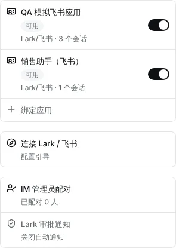
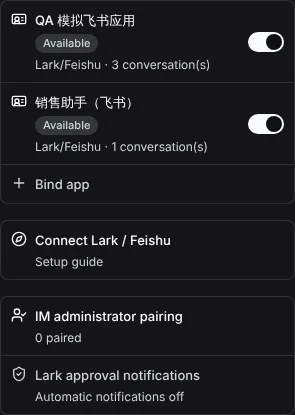
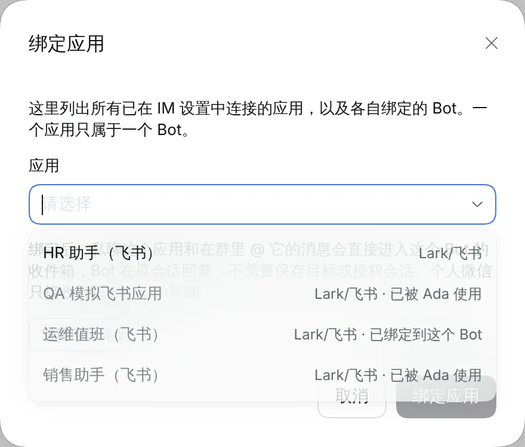
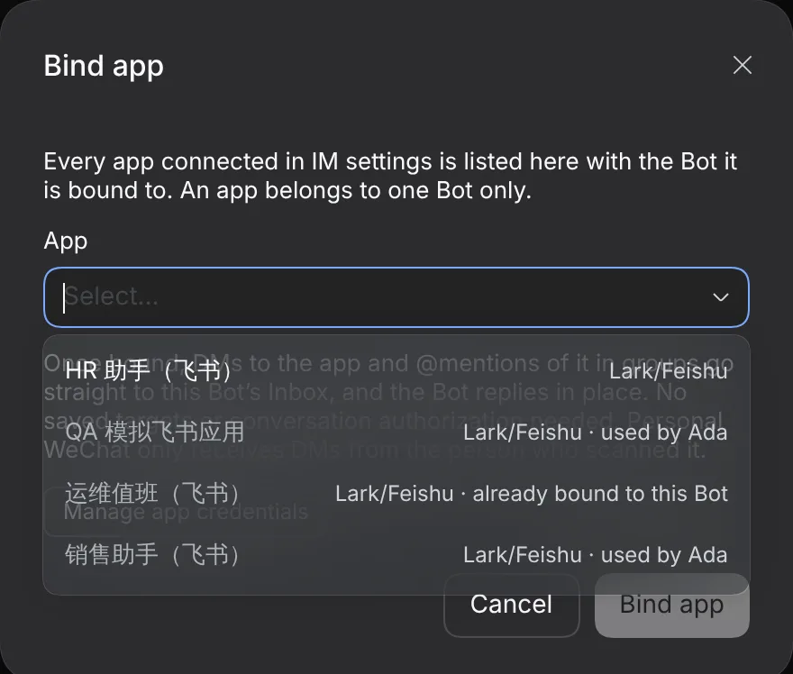

# #1110 Several apps per platform

Captured from a real DSH Host (0.2.0-rc.1) with a simulated Lark provider that exposes four apps: Ada has two Lark apps, Bob has one, and one is unbound. The Bind app shots are opened from Bob.

## Before

A Bot could bind only one app per platform. Bind app greyed out a second Lark app, and nothing showed which Bot used which app.

## After

|                                             | zh light                      | en dark                      |
| ------------------------------------------- | ----------------------------- | ---------------------------- |
| Two Lark apps on Ada                        |  |  |
| Bind app lists every app with its owner Bot |    |    |

The remaining light/dark and zh/en variants are in this folder.
