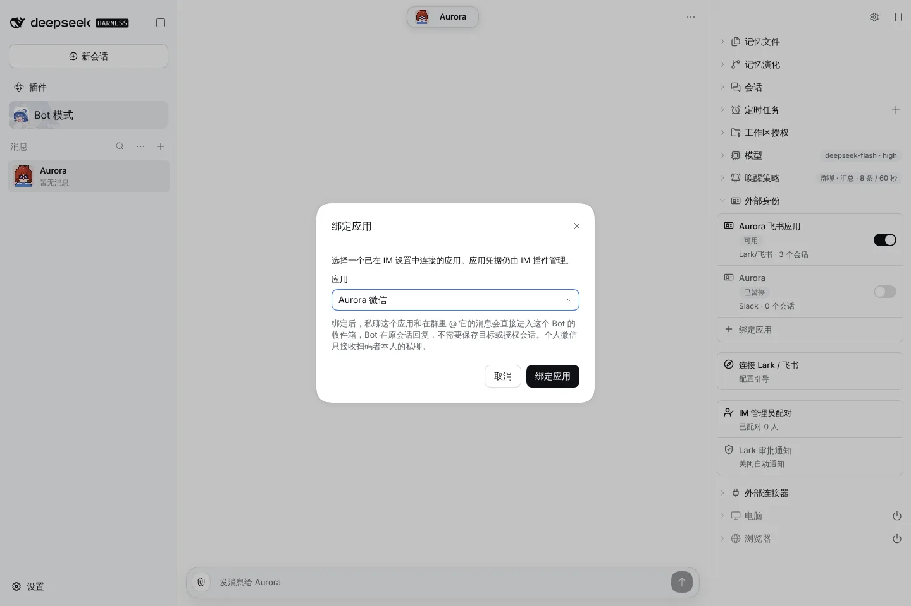
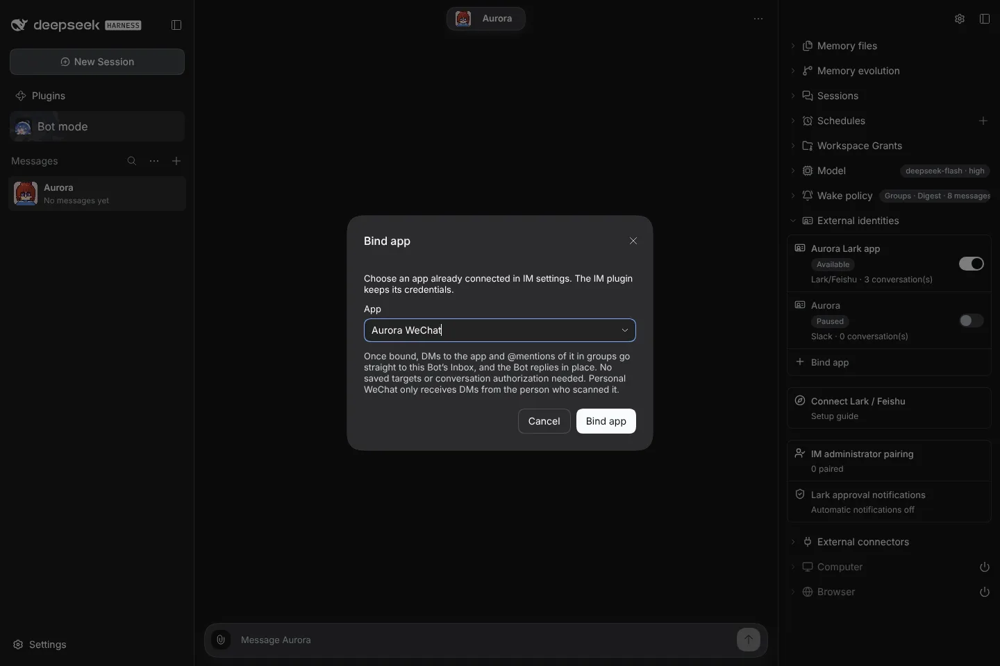
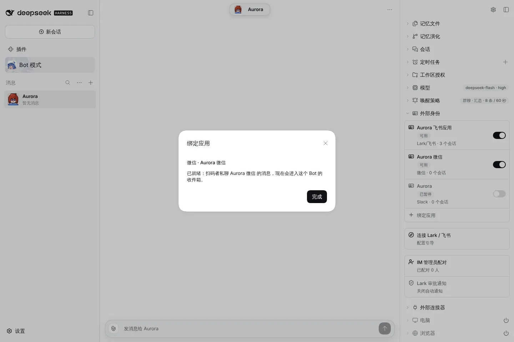
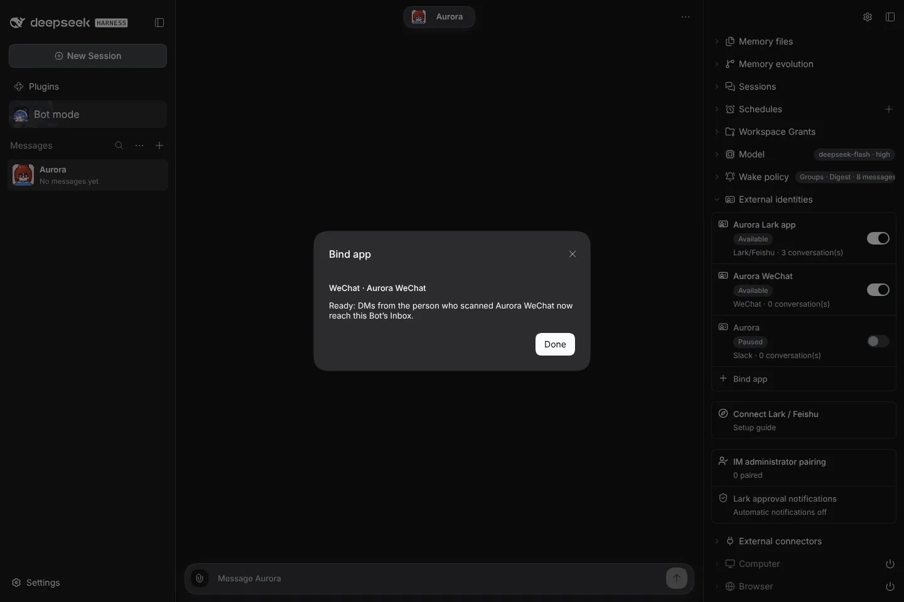

# #1112 Slack, Discord and WeChat default traffic

Sample data injected into the client; the Host behaviour is covered by `packages/core/test/messaging-default-traffic.test.ts`.

## Before

After binding a Slack, Discord or WeChat app, the dialog said its conversations still had to be authorized under External connectors, and DMs or @mentions were dropped.

## After: WeChat shows the real receiving state

|          | zh light                              | en dark                              |
| -------- | ------------------------------------- | ------------------------------------ |
| Bind app |  |  |
| Ready    |   |   |

The remaining light/dark and zh/en variants are in this folder.
