# #1113 External connectors relabel

Captured from a real DSH 0.2.0-rc.1 instance with the QA fake IM provider and the real OpenCode Go model.

## Sync a group into a Channel from its conversation row

|     | Light                      | Dark                      |
| --- | -------------------------- | ------------------------- |
| zh  | 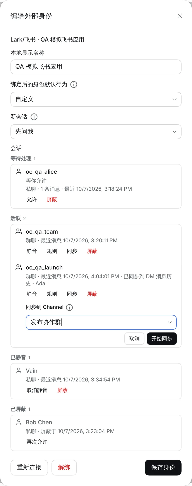 | 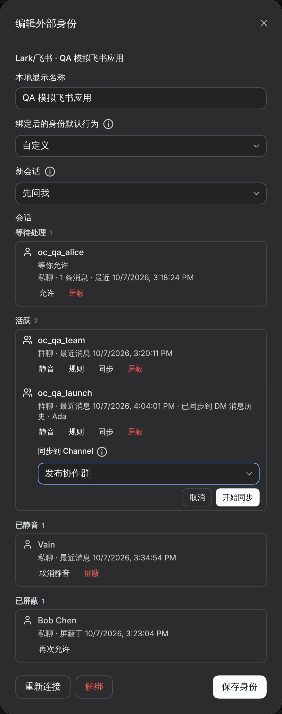 |
| en  | 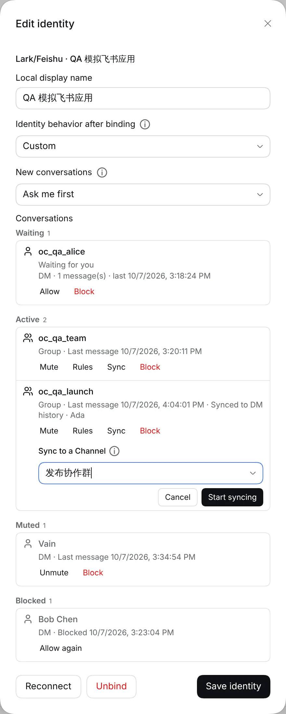 | 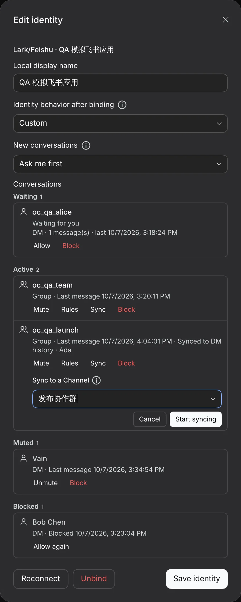 |

## External connectors: syncs plus the advanced send target

|     | Light                    | Dark                    |
| --- | ------------------------ | ----------------------- |
| zh  | 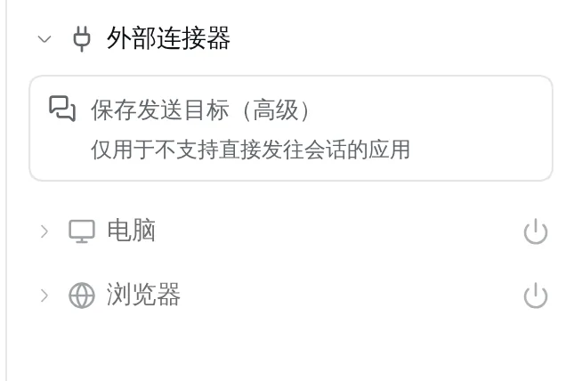 | 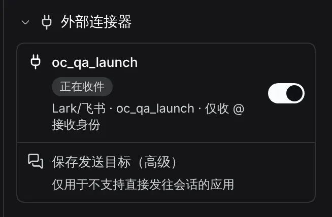 |
| en  | 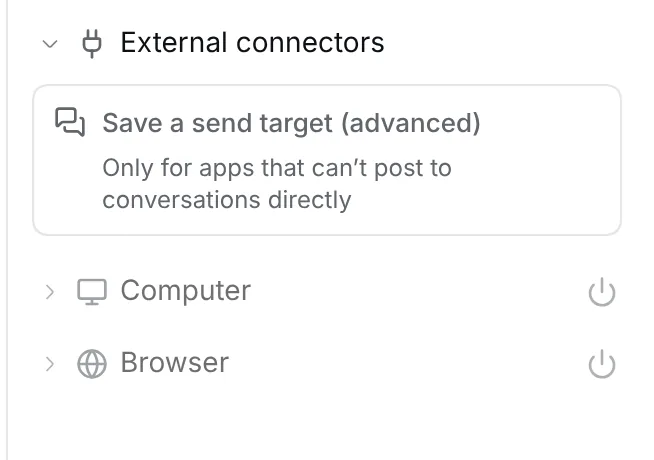 | 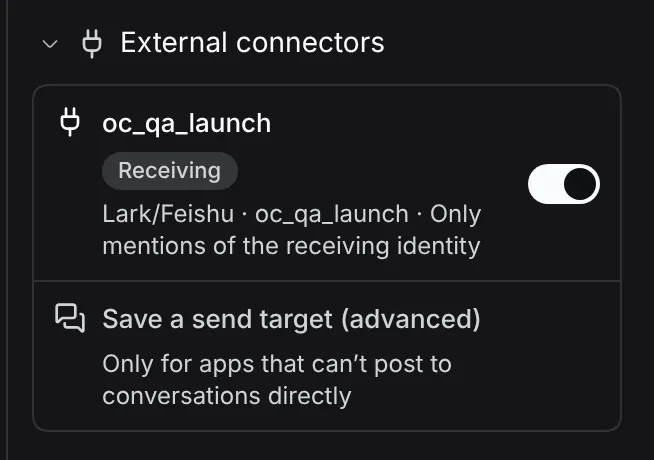 |

## Lark setup guide: three steps

|     | Light                       | Dark                       |
| --- | --------------------------- | -------------------------- |
| zh  | 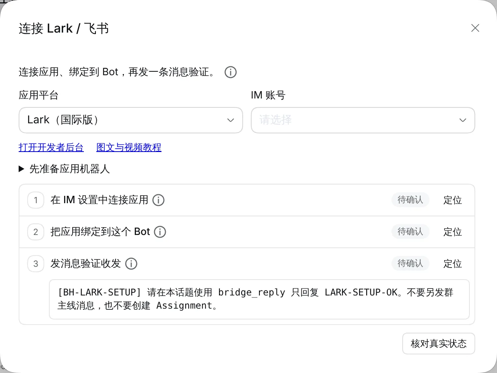 | 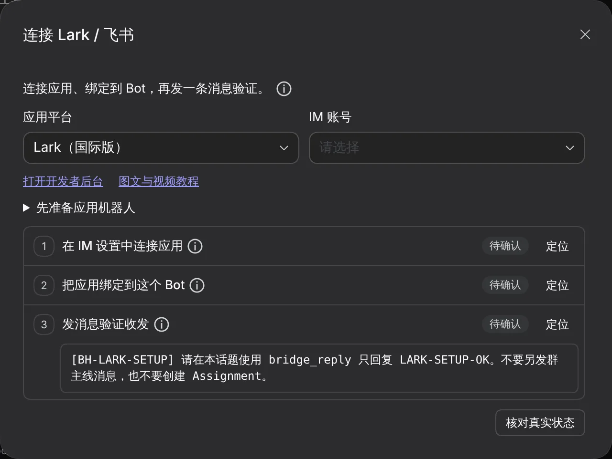 |
| en  | 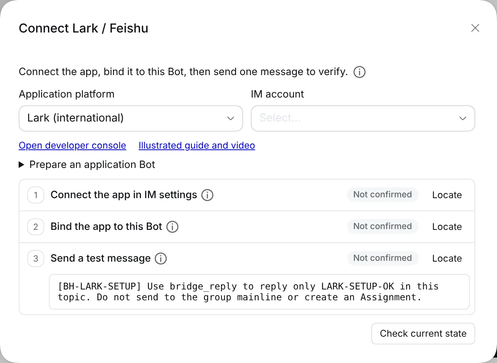 | 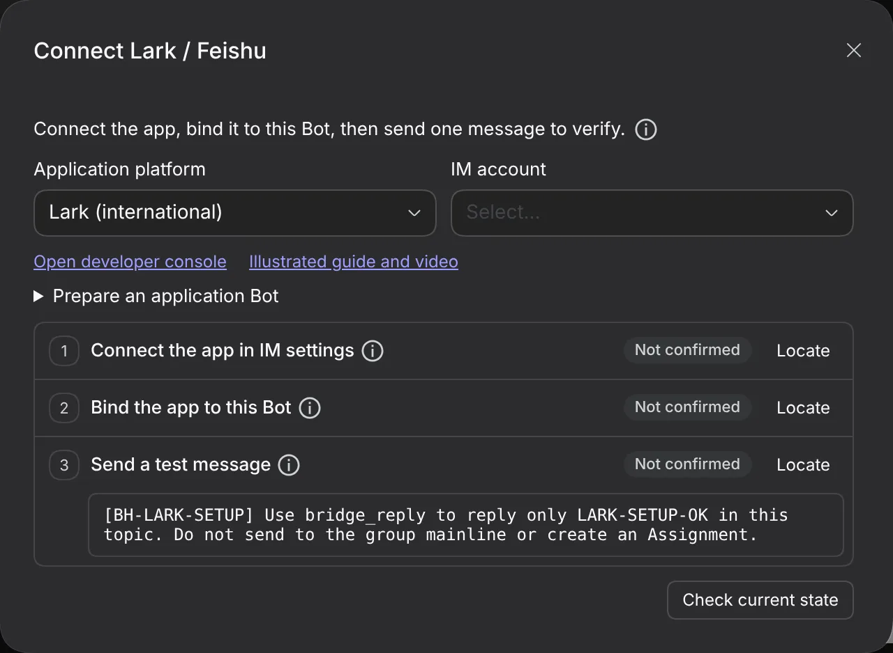 |
