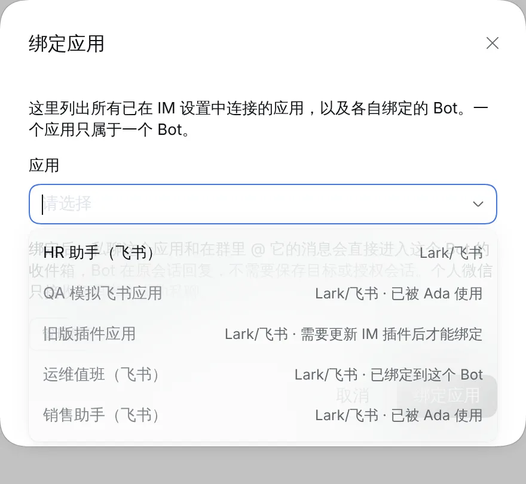
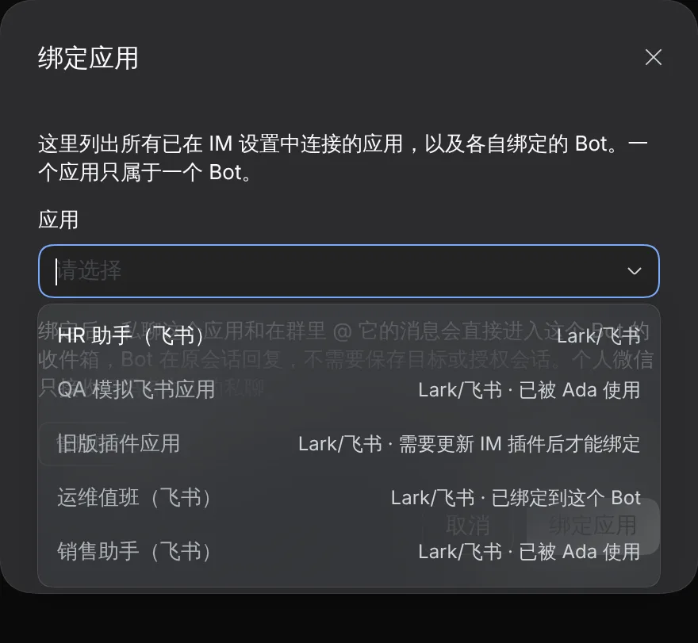
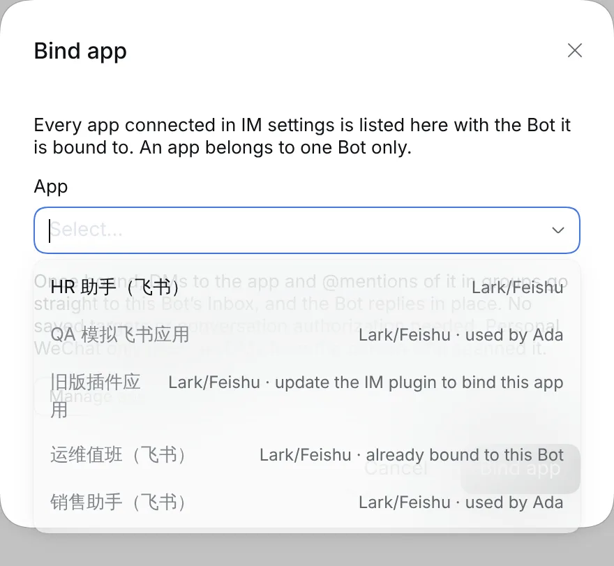
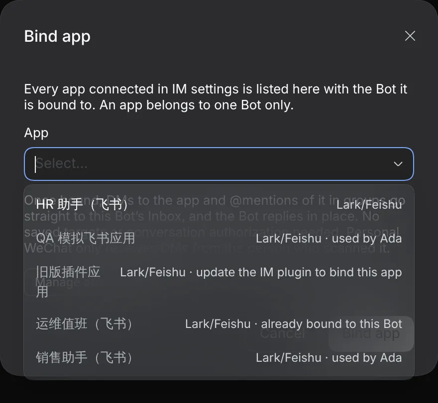

# #1123 Unsupported apps stay visible in Bind app

Captured from a real DSH Host (0.2.0-rc.1) with a simulated provider. "旧版插件应用" is a simulated app whose IM plugin lacks `proactive-text-checked`, the same state as Discord apps on the pinned dsh-im. Bind app is opened from Bob.

|     | Light                   | Dark                   |
| --- | ----------------------- | ---------------------- |
| zh  |  |  |
| en  |  |  |
