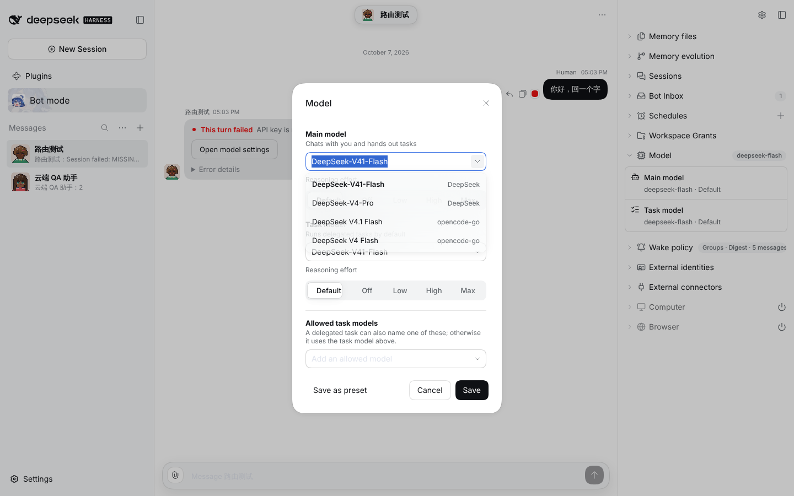
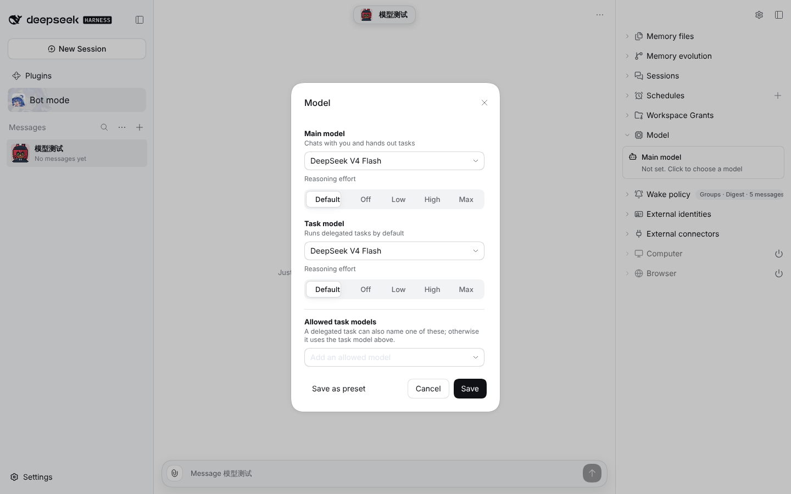
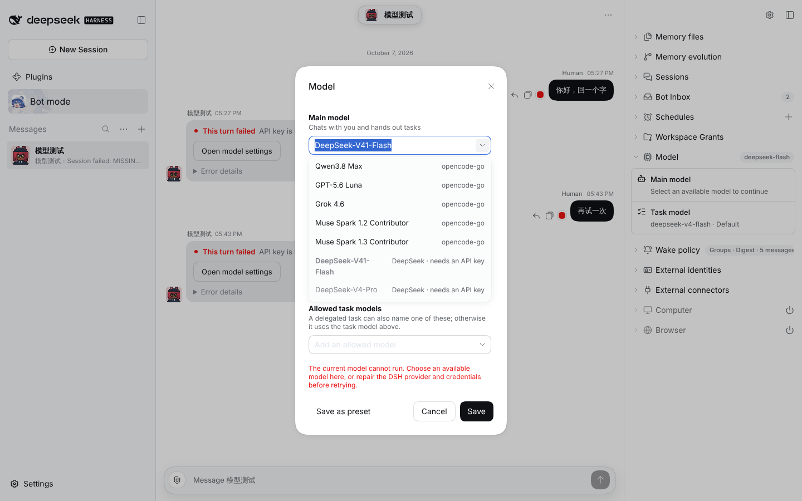

# #1124 Model dialog only offers usable routes

Real DSH instance, OpenCode Go key configured, no DeepSeek official key.

## Before

Every catalog route is pickable, including DeepSeek official with no API key.

## After: a Bot without a Model Plan starts on the DSH default model

## After: a provider whose key failed on a real turn is listed last and cannot be picked; the menu has a solid background that stays put while it scrolls

