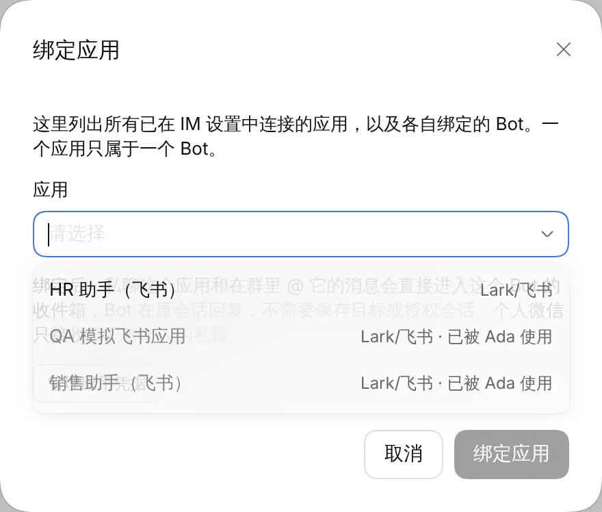
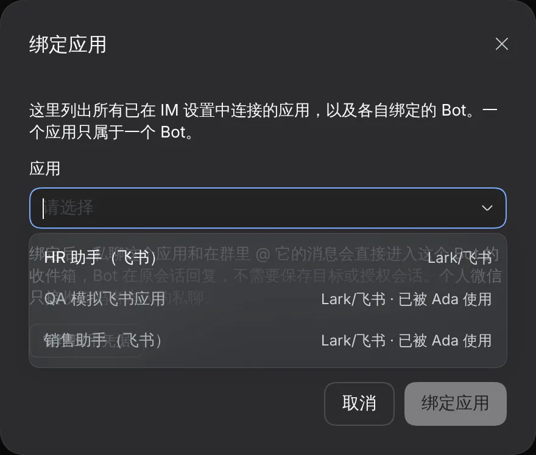
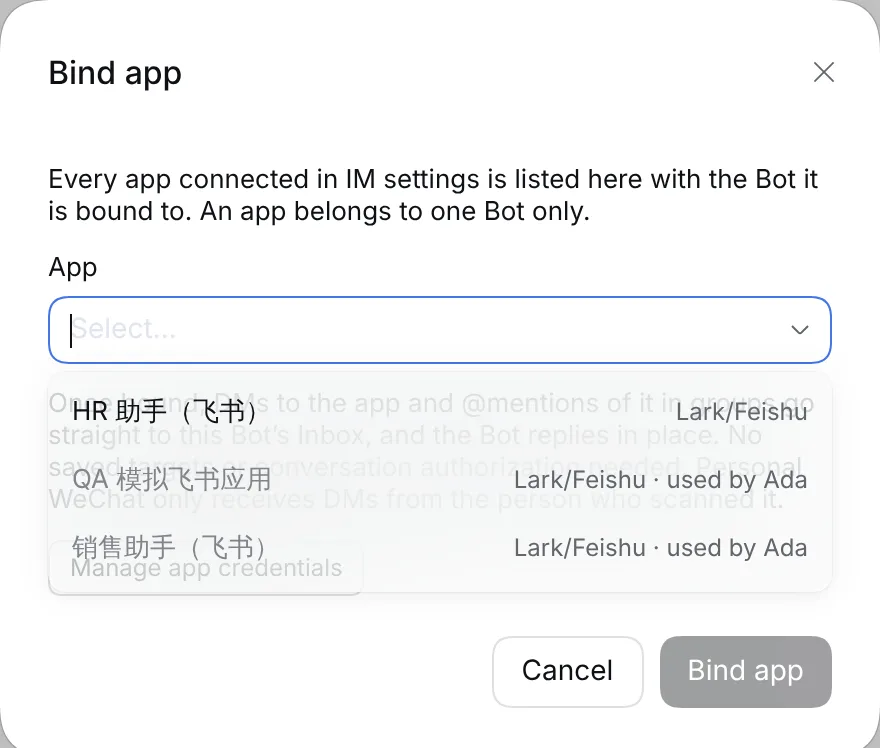
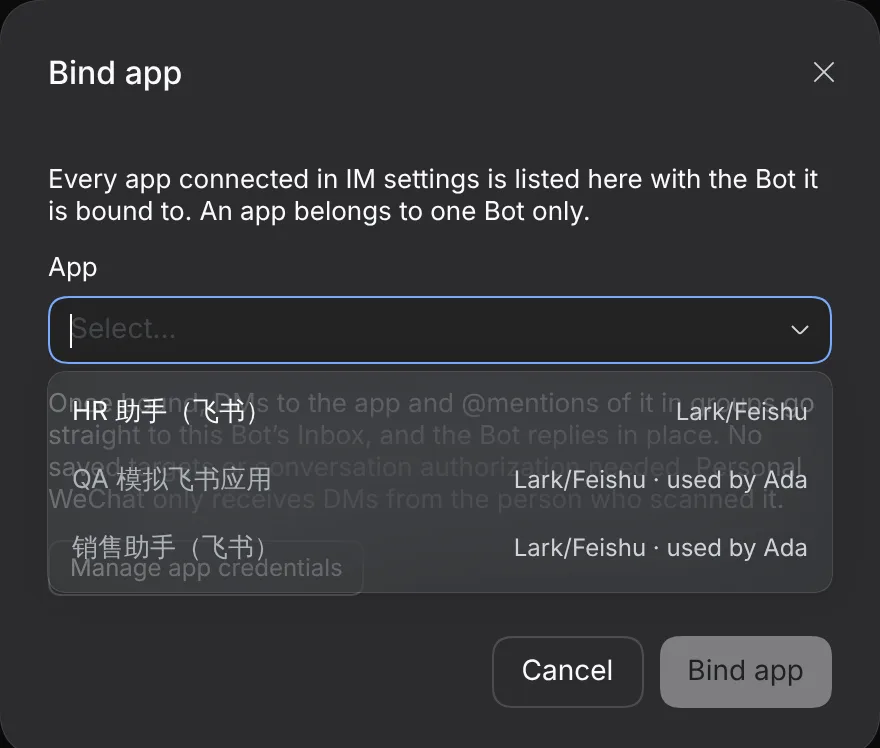

# #1127 Bind app leaves out the Bot's own apps

Captured from a real DSH Host (0.2.0-rc.1) with a simulated Lark provider. Bind app is opened from Bob, whose own app (运维值班) is no longer listed; Ada's two apps stay greyed out.

|     | Light                   | Dark                   |
| --- | ----------------------- | ---------------------- |
| zh  |  |  |
| en  |  |  |
