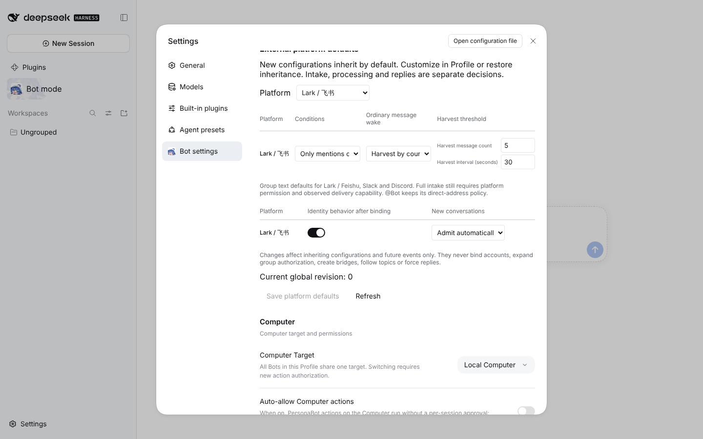

# #1134 New conversations as a platform default

Settings → Bot settings → External platform defaults, Lark tab: the new **New conversations** column (Admit automatically by default). Saving "Ask me first" here was read back through the bridge as `newConversations: "ask"`, revision 1.

