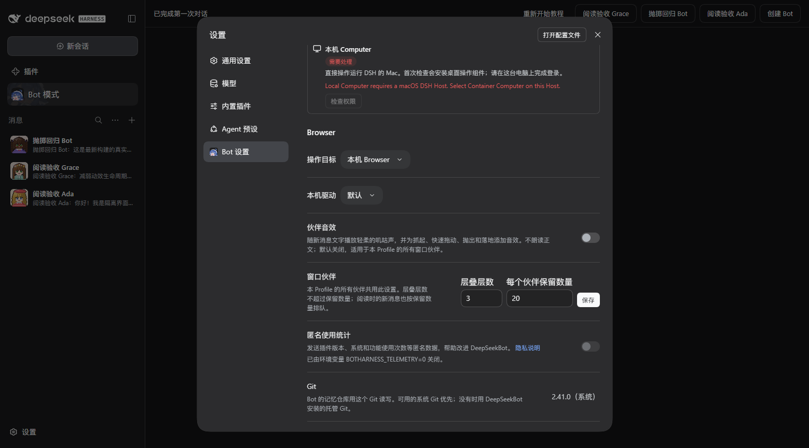
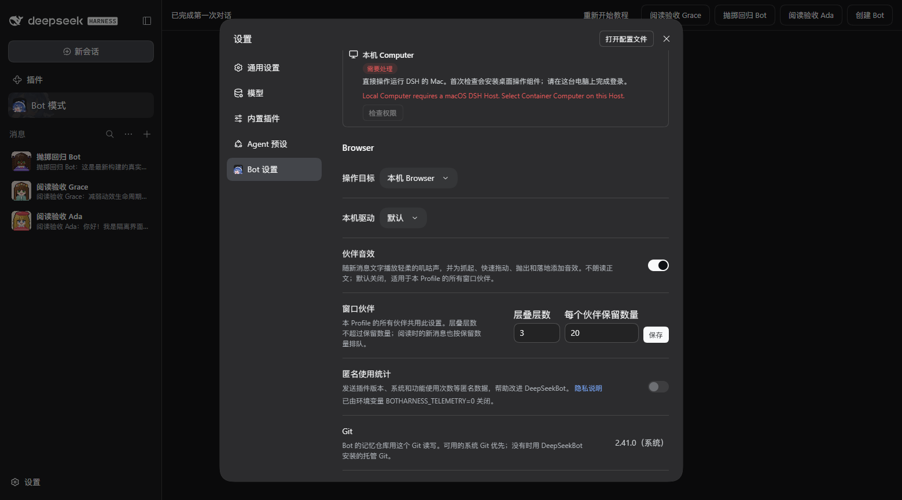
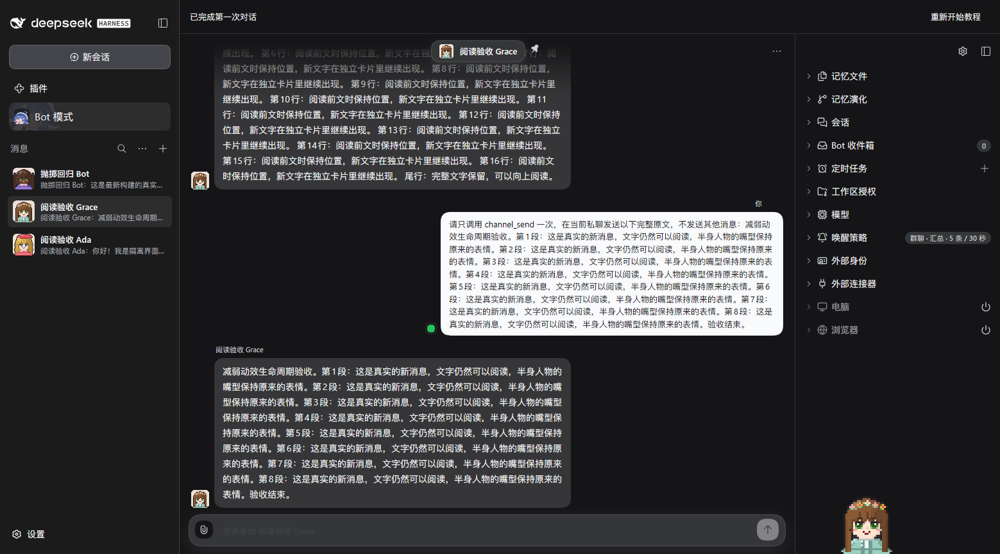
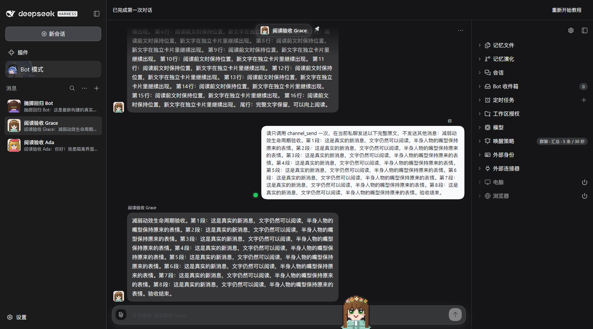
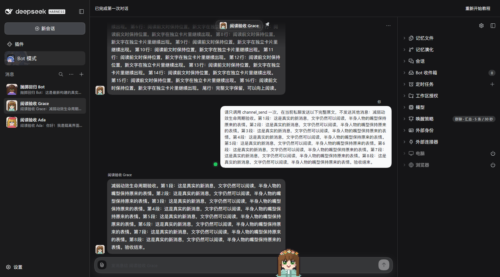
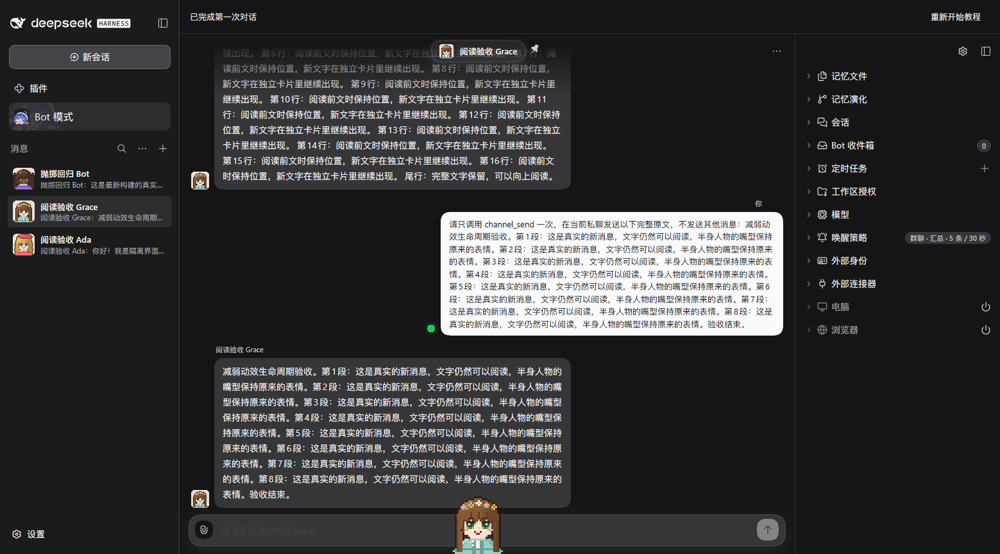

# Companion interaction audio qualification

Real isolated DSH 0.2.0-rc.1 at implementation `4776990c2bf82f8dc97578c440afa1fe9b15196f`, Chinese, dark theme, 1559 × 865, existing QA PersonaBot Grace. Screenshots are unchanged browser captures. The continuous silent WebM is an official Chrome DevTools MCP recording, remuxed without re-encoding.

| Same-build setting: off      | Same-build setting: enabled     |
| ---------------------------- | ------------------------------- |
|  |  |

These are actual switch states, not a comparison against the pre-feature build. Earlier before/after feature evidence remains separately identified in PR #1180.

| Reload before the first gesture     | Rest after grabbing and releasing |
| ----------------------------------- | --------------------------------- |
|  |           |

The persisted setting survived reload. With no historical companion cards, the first trusted drag admitted Web Audio, generated one grab voice and one landing voice, and ended at rest with character bottom865 matching viewport865. A separate QA-only branch on the actual Web Audio output recorded the sound without a microphone or product-volume change. The audio sample is separate from the silent video; it has not been synchronized or dubbed into that video. The Human listened and explicitly accepted keeping this quiet volume.

[Continuous silent drag recording](first-drag.webm) · [Actual grab and landing audio sample](grab-and-land.mp3)

| Muted native drag: rest | Reduced-motion native drag: rest |
| ----------------------- | -------------------------------- |
|      |             |

The muted and reduced-motion runs generated zero voices and returned to floor865. Reduced motion retained the saved mouth expression. Sound off and system motion were restored after testing. Console inspection found no JavaScript errors; the existing form-field id/name browser issue remains.

Two real native drags produced grab/landing only. They do not qualify the speed-triggered squeak/whoosh: those paths have automated coverage but still require an actual fast-gesture listening check. This is not a calibrated fast-throw test, mouth acceptance, frame-rate measurement or memory measurement. No full-scenario acceptance is claimed.
