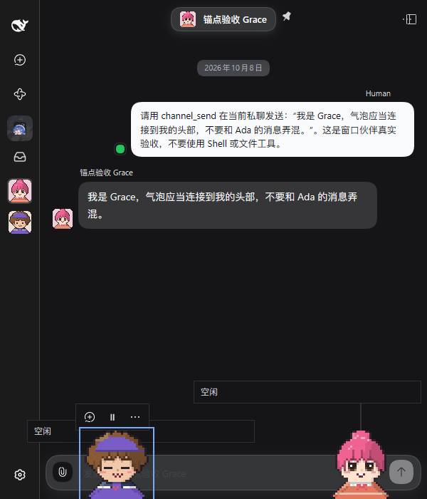
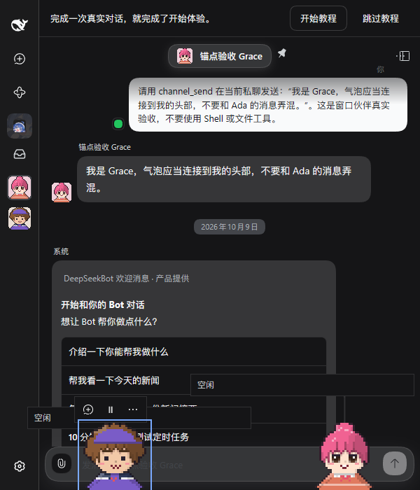

# Companion anchor resize qualification

Real isolated DSH 0.2.0-rc.1, Chinese, dark theme, the same Ada and Grace QA PersonaBots and Profile. Official Chrome DevTools MCP captured actual pointer dragging, release, keyboard movement and a 1559 × 865 → 600 × 700 → 1559 × 865 resize. Videos are continuous, silent screen recordings, remuxed without re-encoding; screenshots are unchanged captures. No synthetic presentation or message was injected.

- Before: `1ed6dcbd9caf4d179753c03ea930fb34fb8157c3`.
- After: `c946a74981944250376db5f8dc609a09c501072d`, including resize correction `f9fad41a` and integration of main `8940165f`.
- Main integration adds native onboarding content between captures. The center chat is therefore not a matched visual comparison; the same companion geometry and resize interaction are the subject of this check.

| Settled narrow viewport before | Settled narrow viewport after |
| ------------------------------ | ----------------------------- |
|     |     |

The settled screenshots do **not** show the transient defect. A QA-only observer independently compared the displayed head point with the connector origin every 50 ms. It observed one 588.694 px resize mismatch before correction. After correction, all 101 narrow-viewport samples were within 0.012 px; the maximum across all 1,200 samples was 0.710 px. Both recordings include rest, drag, fall and land; the after run contains 11 trusted pointer events and real focused-character arrow-key movement. Sampling cannot prove the absence of all unsampled transients and is not a performance measurement.

[Before recording](resize-before.webm) · [After recording](resize-after.webm)

Console inspection after the correction found no JavaScript errors; the existing form-field id/name browser issue remains. No historical companion message replayed after restart. Other fallback/tool-cover/reduced-motion and reading-stack scenarios retain their separately stated acceptance status in PR #1183; this check does not qualify them.

## Focused reading and reduced-motion release

At `c946a749` (evidence head `5c16fab9`), three new native Bot replies are verified against canonical Channel messages. The first focused-arrival screenshot shows two Ada cards beside Grace's independently sourced card. The later expanded-reading samples retain Ada's two upright cards; Grace's card has expired by then. Autonomous walking was paused through existing native buttons. As the third real card appears, normal public character focus enters reading before tool latency consumes its short lifetime; a subsequent actual MCP hover retains it. This is focused-reading evidence, not acceptance of mouse hover on a moving character. `focused-arrivals-dark.png` and `expanded-reading-dark.png` show those distinct moments.

The actual Bot Settings menu then selects reduced motion; native drag/release leaves both companions settled at bottom865 in every observed post-release sample (`reduced-released-dark.png`). Message cards have expired by that later screenshot; it does not show reduced-motion message reading or the first release frame. All sampled connector origins match their displayed bust anchors, maximum0px in this stationary/settled workload; sampling every80ms is not performance measurement or a guarantee about unsampled motion. Sanitized details: `reading-reduced-qualification.json`.

`reading-reduced.webm` is continuous silent official MCP output, container-remuxed only. Earlier failed attempts are retained privately and excluded: native hover could not stabilize a roaming character; a paused attempt lost its messages to TTL during capture latency. No fake reply/event, replay or card/store injection was used. Console contained no JavaScript error; the existing native form-field issue remained. Held/reversal, image/tool-cover and background scenarios remain separate.
