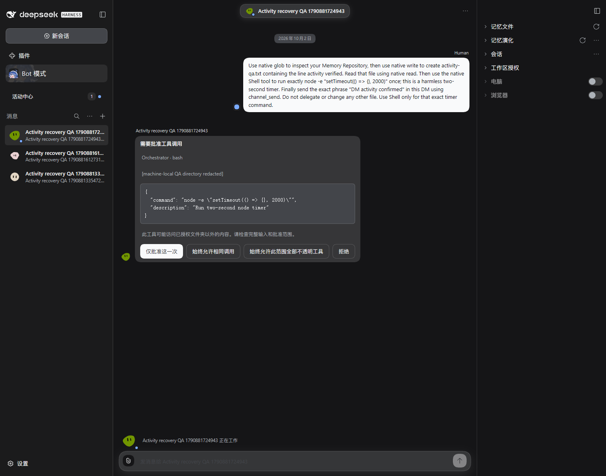
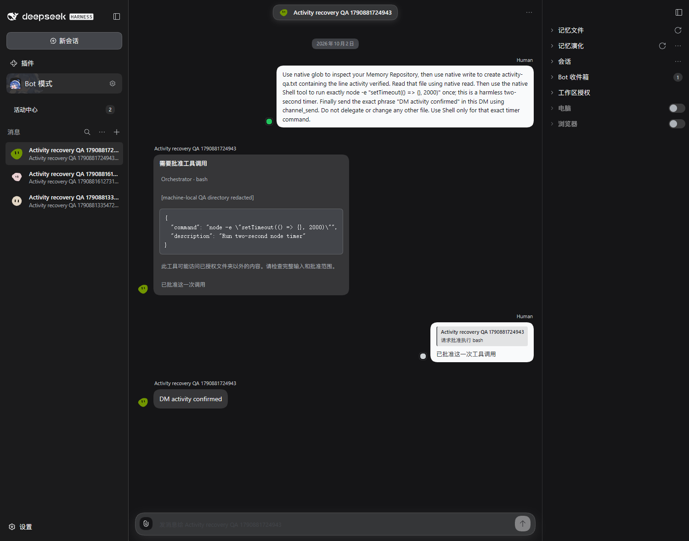
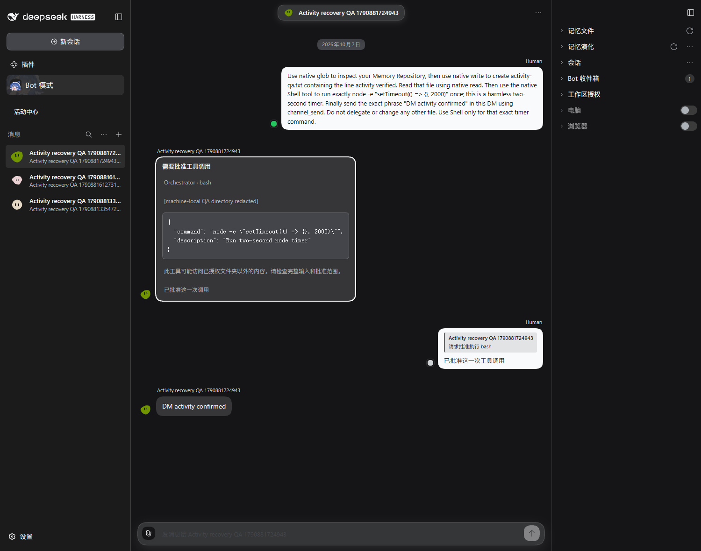
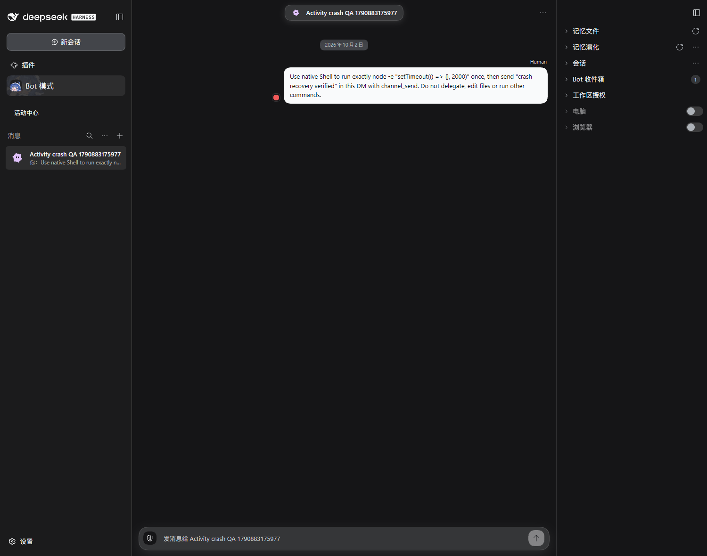

# #121 — Activity live recovery

Real isolated DSH **0.2.0-rc.1**, DeepSeek Flash `low`; production Host Activity Projection, authenticated query and exact SSE route. Fixture: **Activity recovery QA 1790881724943**.

## Observed path

1. The browser returns HTTP 503 only for `scope=activity`; Channel streams and actual model execution remain available.
2. The real Orchestrator performs native file operations and parks on the exact harmless `node -e "setTimeout(() => {}, 2000)"` approval. With no Activity frames received, bounded authenticated snapshot queries restore **working** on both the sidebar and composer.
3. Remove the 503 interception. A complete live snapshot at revision **32** restores streaming; both avatars still show working.
4. Exit Bot mode, approve only the exact timer through the public Host command, and let the real model commit **DM activity confirmed** while the view is closed.
5. Re-enter Bot mode without a document reload. The fresh complete baseline at revision **36** restores idle; the composer clears its active indicator.
6. Restart the same isolated Host and reopen the same Bot. A new generation at revision **0** restores idle, preserving the committed reply.

[Network and DOM proof](proof.json) · [Restart proof](restart-proof.json)

| Stream unavailable: bounded query restores working       | Live stream restored                                             |
| -------------------------------------------------------- | ---------------------------------------------------------------- |
|  |  |

| Fresh baseline after mode exit                                                 | Same Bot after Host restart                                   |
| ------------------------------------------------------------------------------ | ------------------------------------------------------------- |
|  |  |

## Additional recovery audit requested by Human

In a separate fresh isolated profile, **Activity crash QA 1790883175977** had one native Agent actually running, with the Host snapshot at **thinking**, revision **1**. The dedicated Host process was forcibly terminated without a graceful Turn end. Restarting the same profile produced a different generation at revision **0**, **idle** for the same Bot. Two full browser reloads received that new idle baseline; the sidebar stayed idle and the composer had no active indicator.

[Hard-termination and refresh proof](crash-proof.json)



This audit covers abandoned activity presentation. It does not prove that an interrupted task completed, retry its tool effects, or force a still-running/waiting Agent to idle. A refresh reads Host truth; a genuine pending execution or approval may correctly remain active. The earlier restart case followed a completed Turn; this additional case explicitly terminated an active Agent.

## Repeat

Boot a fresh isolated profile with `scripts/dev-instance.mjs --home <isolated-home> --port <port> --worktree <checkout> --build --json`.

```powershell
$env:BH_E2E_ORIGIN = "http://127.0.0.1:<port>"
$env:BH_E2E_HOME = "<isolated-home>"
$env:BH_E2E_EVIDENCE = "<private-output-directory>"
node scripts/e2e-activity-recovery.mjs
```

After restarting the same profile, set `BH_E2E_RECONNECT_BOT` to the slug recorded in `proof.json` and rerun to capture `restart-proof.json` and `restarted.png`. Cookies, login tokens and private directories stay outside the repo; screenshots redact machine-local approval paths.

## Human QA

Open the isolated page, enter Bot mode and open the named fixture. Send a fresh instruction to use the exact harmless timer above and then reply in this DM. When its approval card appears, both the sidebar and composer should show working. Leave and re-enter Bot mode: working should remain. Approve only that exact timer once. After the reply, the sidebar should show idle and the composer should clear its active indicator. Refresh and switch modes again: the reply and idle state should remain.

Automated coverage also checks duplicates/older revisions, revision-gap refetch, stale HTTP responses across Host generations, unavailable constructors, query deadlines, hidden-page cleanup and coalescing 100 revisions for a slow reader with cancellation/disposal listener cleanup.

The verified transport remains the existing exact authenticated route and Gateway query; see the [official DSH API Gateway contract](https://deepseek-harness.github.io/deepseek-harness/en/reference/api-gateway).
