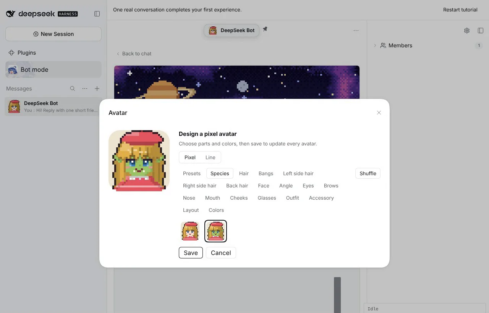
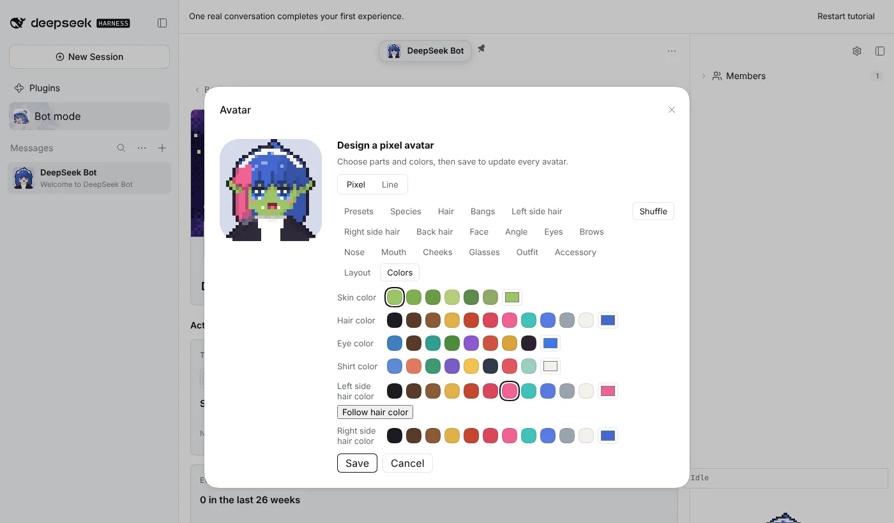
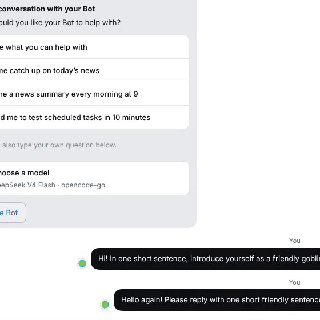
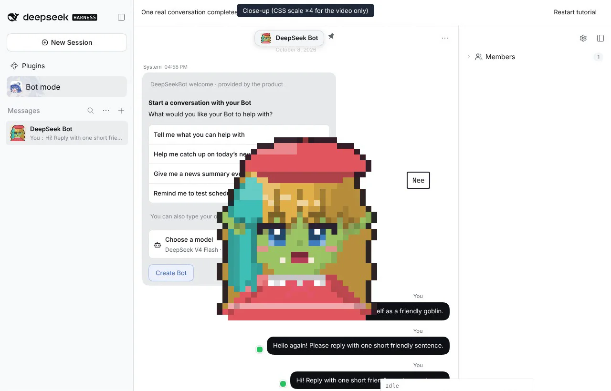
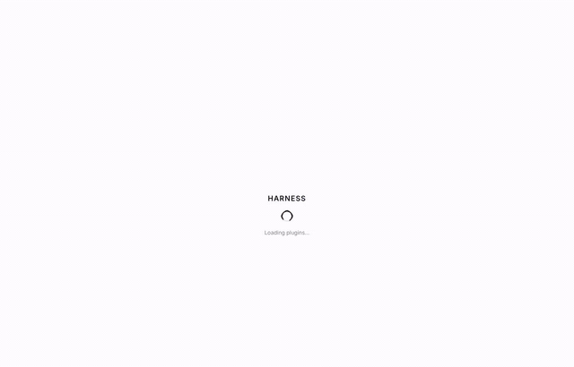

# #1210 Goblin Avatar Species and split side hair

Captured on an isolated DSH instance running this branch with `@botharness/pixel-avatar` 0.3.0 built in.

## Editing

| Species: human → goblin, keeping the saved hair and outfit | Left and right side hair with their own colors               |
| ---------------------------------------------------------- | ------------------------------------------------------------ |
|              |  |

## Window Companion speaking (simulated)

The speech is simulated. A test script drives the companion's own closed, half-open and open mouth layers at text pace. No model reply was involved, and the close-up is scaled ×4 with CSS for the recording only.

Full flow, from editing to saving to the companion speaking:

The same recording as video: [goblin-species-flow.mp4](goblin-species-flow.mp4)
