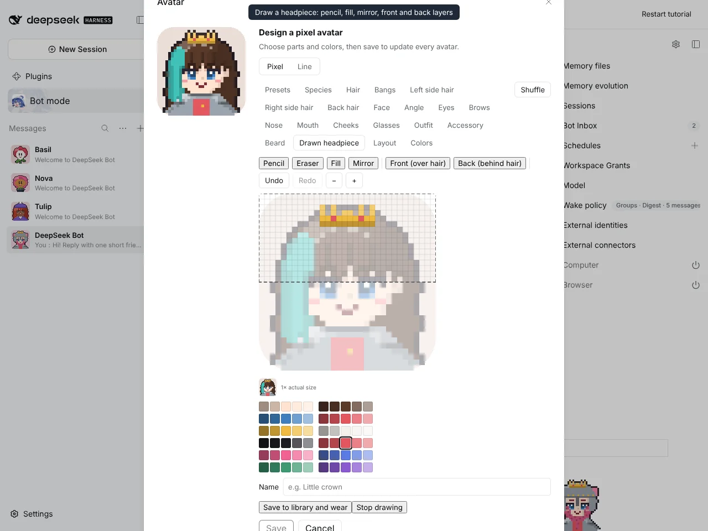
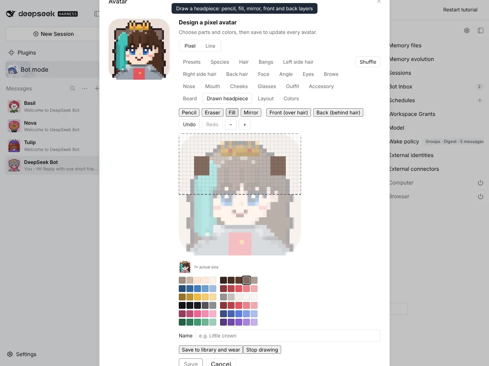
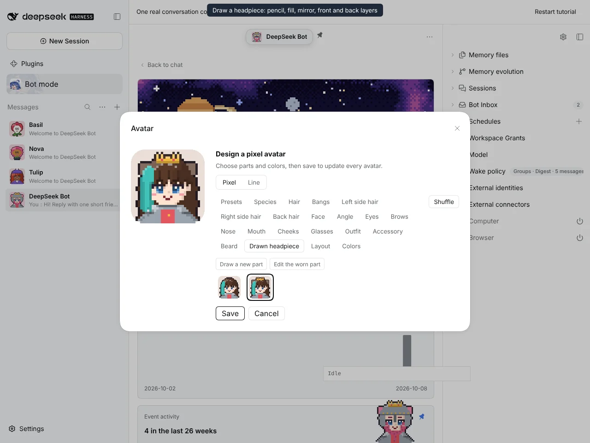
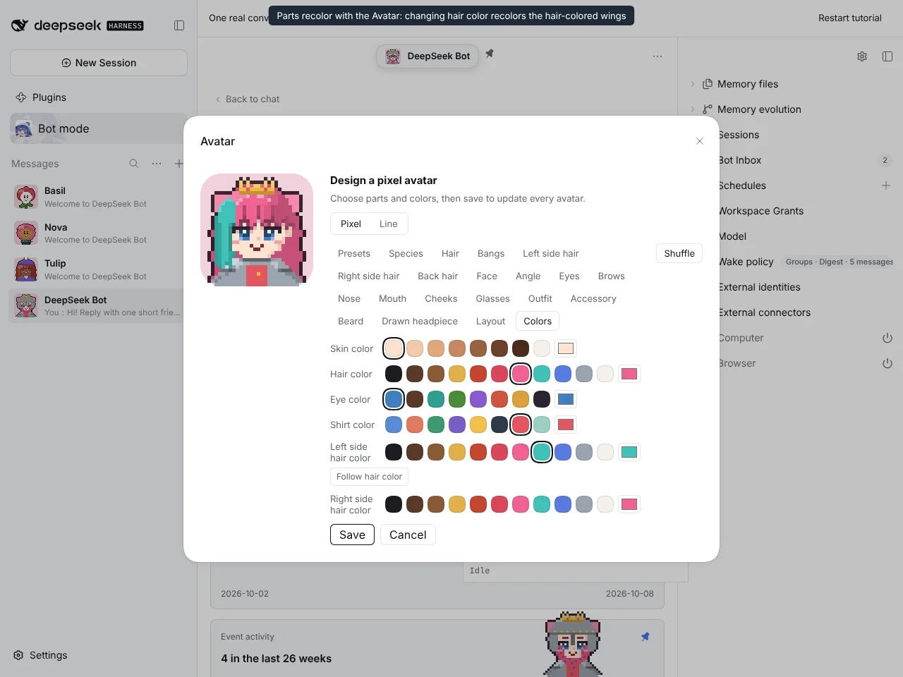
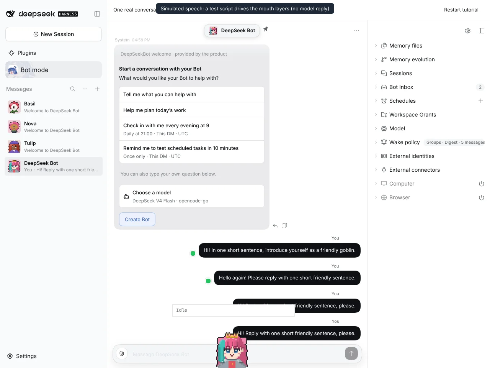
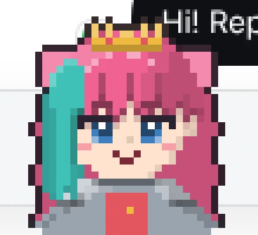

# #1211 Custom Parts 1: draw a headpiece into the Part Library and wear it

Captured on an isolated DSH instance built from this branch, with `@botharness/pixel-avatar` 0.5.0 (BotHarness/BotPixel#11) built in.

## Drawing

| Front layer: a mirrored gold crown with a gem, drawn with pencil, tones and mirror | Back layer: hair-colored side pieces behind the hair, seen through the dimmed Avatar |
| ---------------------------------------------------------------------------------- | ------------------------------------------------------------------------------------ |
|                                            |                                                |

## Library and color

| Saved to the Part Library and worn | Changing the hair color recolors the hair-colored back pieces |
| ---------------------------------- | ------------------------------------------------------------- |
|  |                         |

## Window Companion

The speech is simulated. A test script drives the companion's own closed, half-open and open mouth layers; no model reply was involved.

| Speaking companion wearing the drawn part | Close-up (×4, cropped from the screenshot)   |
| ----------------------------------------- | -------------------------------------------- |
|   |  |

## Full flow

The same recording as video: [custom-part-flow.mp4](custom-part-flow.mp4)
