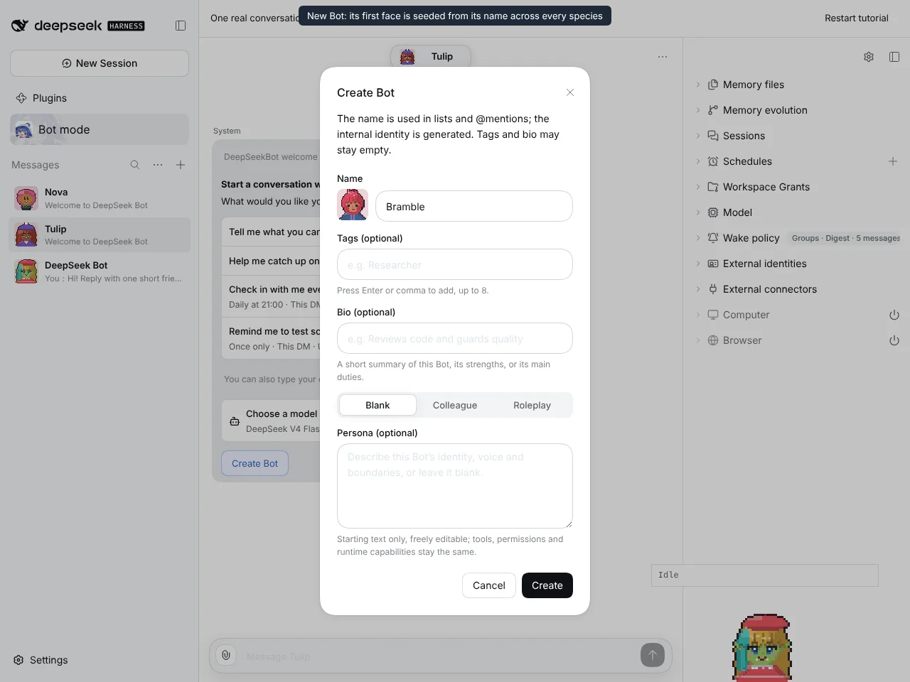
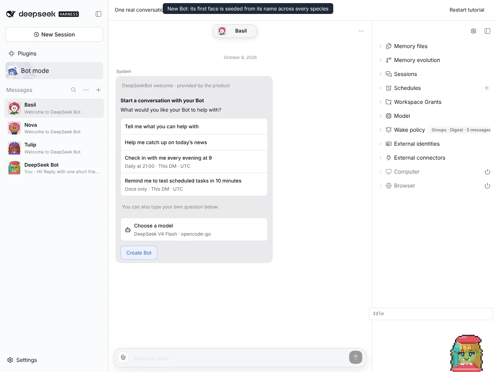
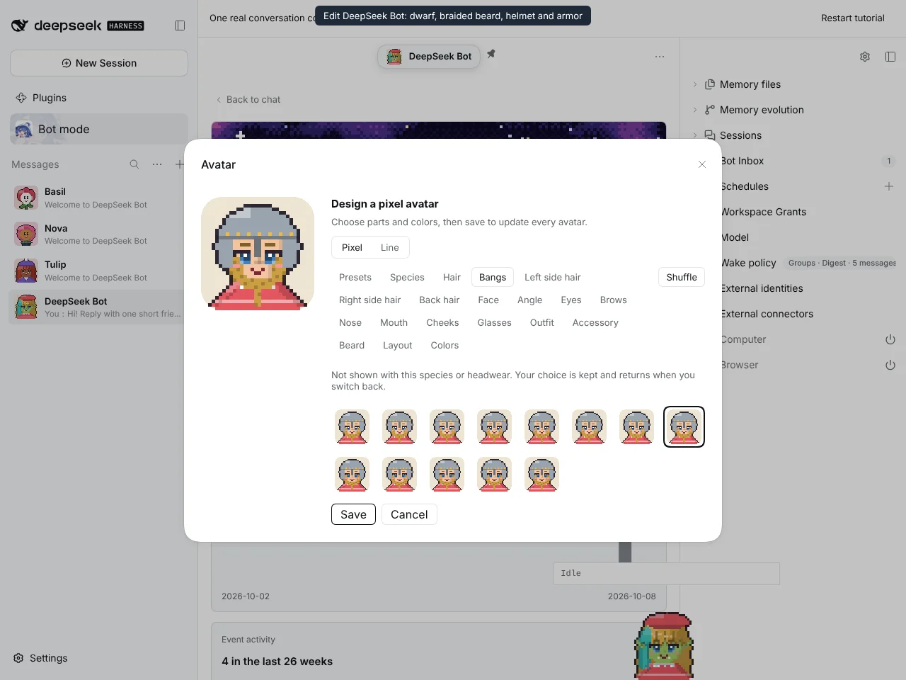
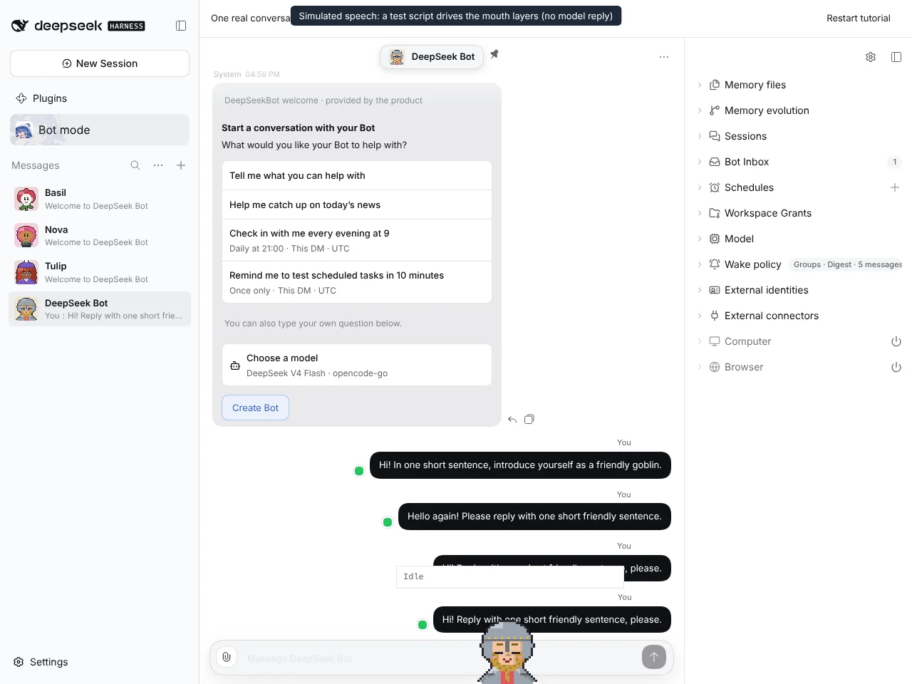
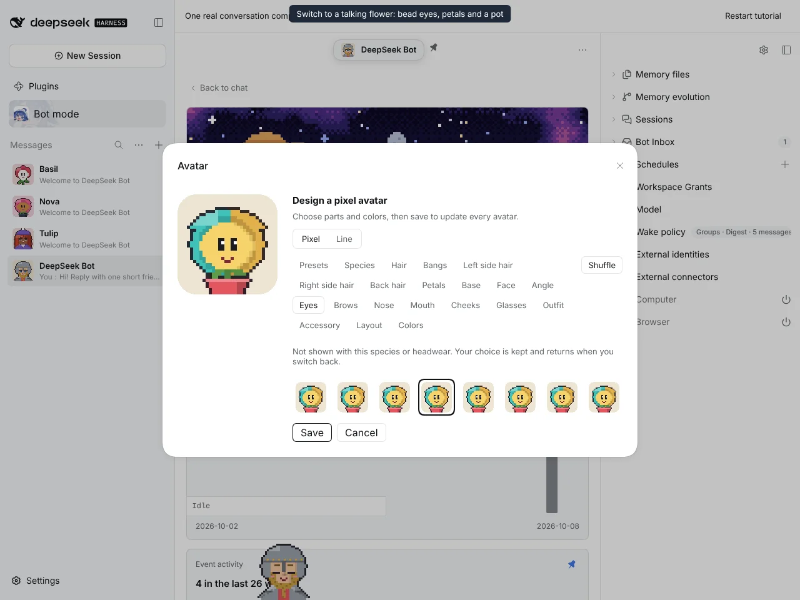
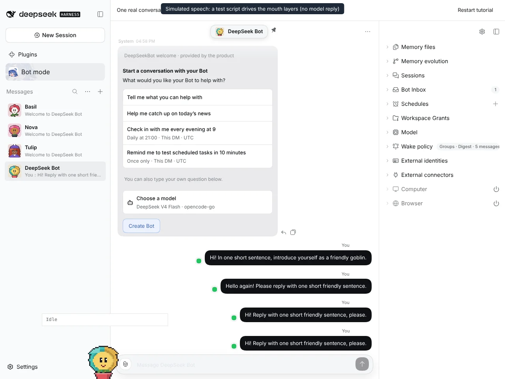

# #1212 #1213 #1214 Medieval species, talking flower and full-domain seed

Captured on an isolated DSH instance built from this branch with `@botharness/pixel-avatar` 0.4.0.

## New PersonaBots are seeded across every species (#1214)

| Typing a name previews its seeded face: "Bramble" is a bearded dwarf | "Basil" and "Nova" were created as flowers; "Tulip" was created by a build without the seed version and keeps its original face |
| -------------------------------------------------------------------- | ------------------------------------------------------------------------------------------------------------------------------- |
|                         |                                                                                   |

## Dwarf, beard, helmet and armor (#1212)

| A helmet hides the hair; the bangs choice is kept with a note | Speaking: the braided beard leaves the mouth visible |
| ------------------------------------------------------------- | ---------------------------------------------------- |
|         |       |

## Talking flower (#1213)

| Bead eyes, a trumpet bell and a pot; the saved eyes are kept with a note | Speaking as a Window Companion                    |
| ------------------------------------------------------------------------ | ------------------------------------------------- |
|                        |  |

## Full flow

The speech is simulated. A test script drives the companion's own closed, half-open and open mouth layers at text pace; no model reply was involved.

The same recording as video: [species-flow.mp4](species-flow.mp4)
