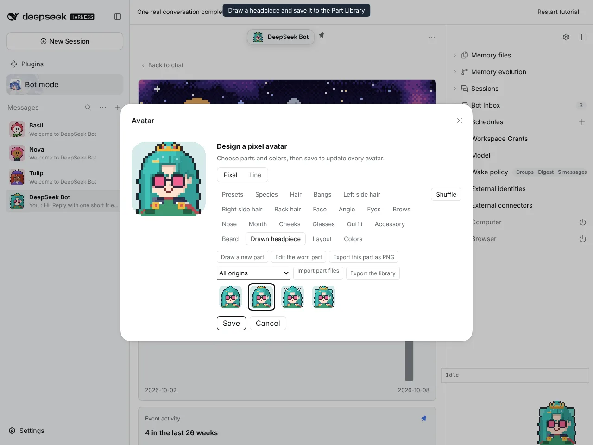
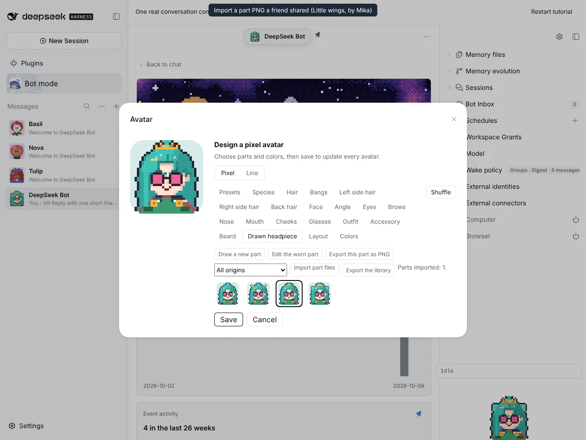
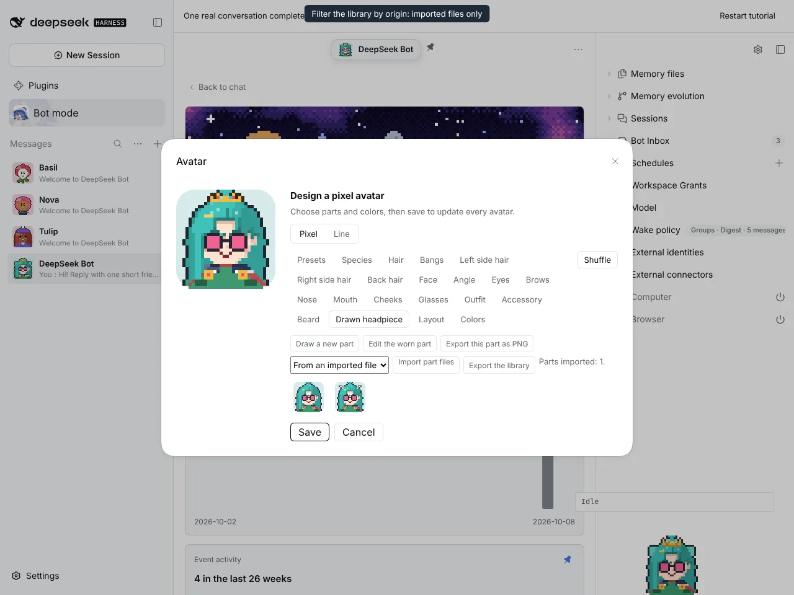
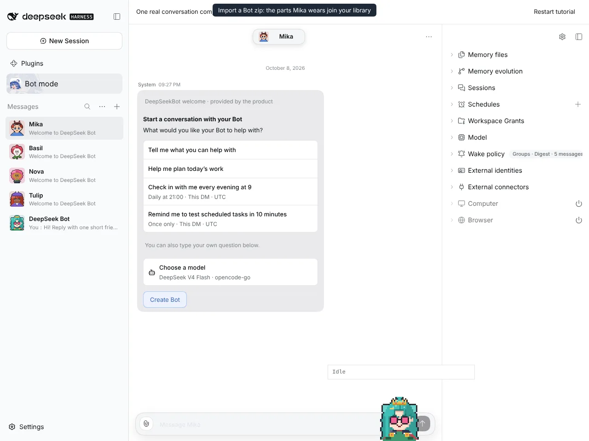
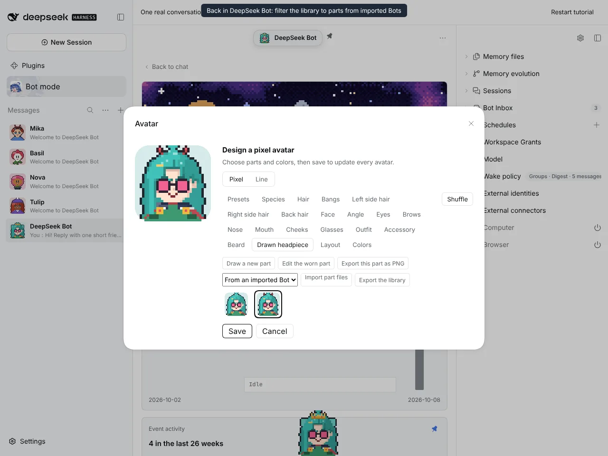
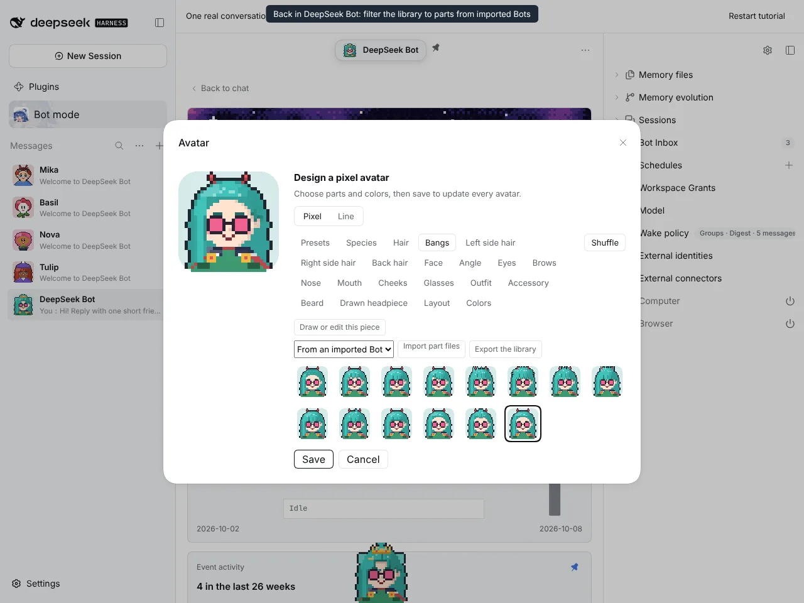

# #1215 Share drawn parts as files and through Bots

Captured on an isolated DSH instance built from this branch. The friend's part PNG and Bot zip were generated by the Host's own `encodePartFile` and Bot export.

## Exporting

| A drawn crown saved to the library | The exported part file (`gold-crown-cc9532aa.png`, ×8 preview with the part data embedded) |
| ---------------------------------- | ------------------------------------------------------------------------------------------ |
|       |                                                         |

**Export the library** downloads `part-library.zip`, one part PNG per entry.

## Importing a part file and filtering by origin

| "Little wings" by Mika imported from a PNG | Filtered to "From an imported file" |
| ------------------------------------------ | ----------------------------------- |
|         |  |

## Importing a Bot carries its parts

| Mika imported from a Bot zip, wearing drawn horns and bangs | DeepSeek Bot wearing Mika's horns from "From an imported Bot" | Mika's bangs in the bangs library |
| ----------------------------------------------------------- | ------------------------------------------------------------- | --------------------------------- |
|                  |                          |  |

## Full flow

The same recording as video: [part-files-flow.mp4](part-files-flow.mp4)
