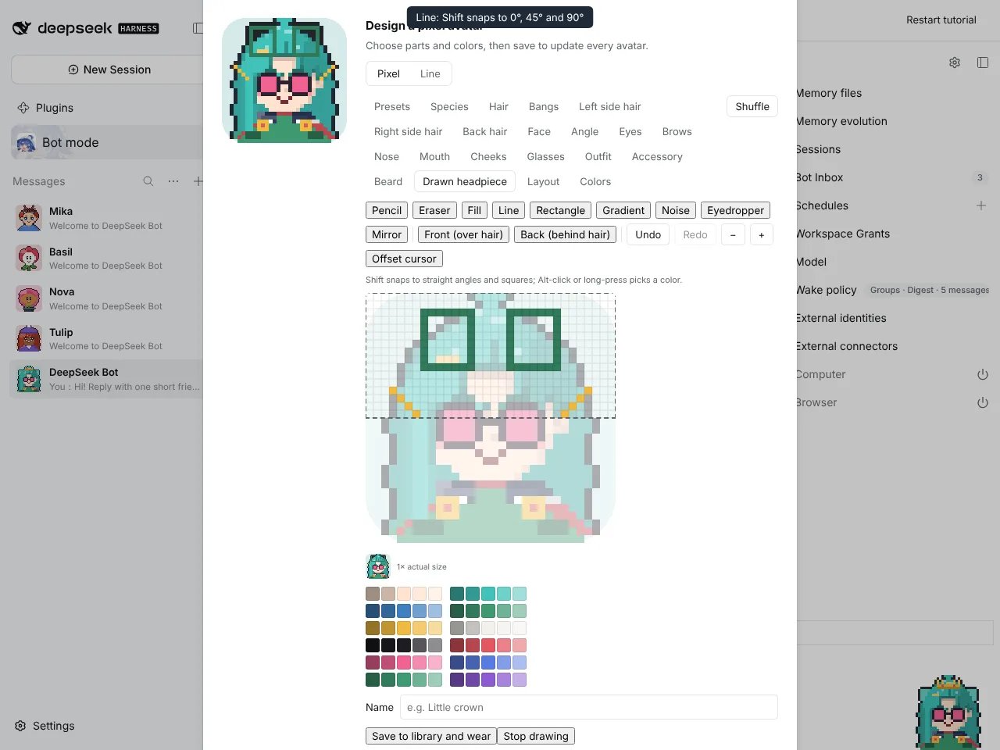
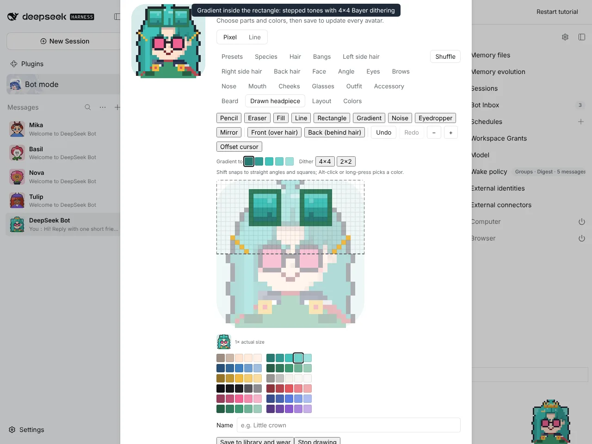
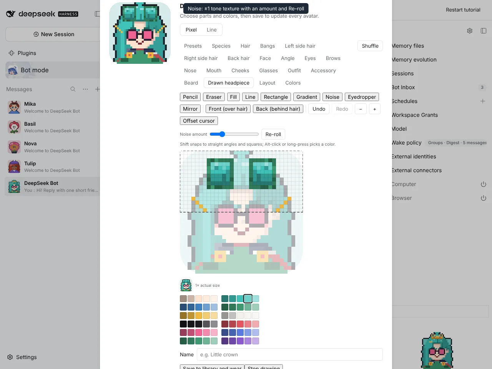
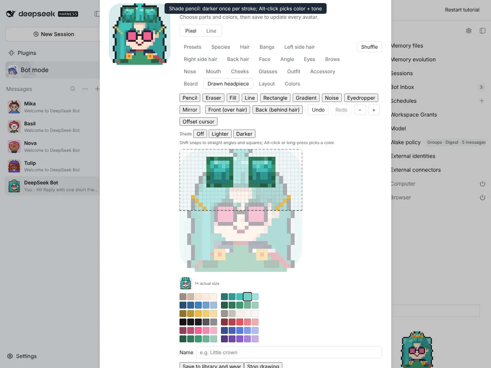
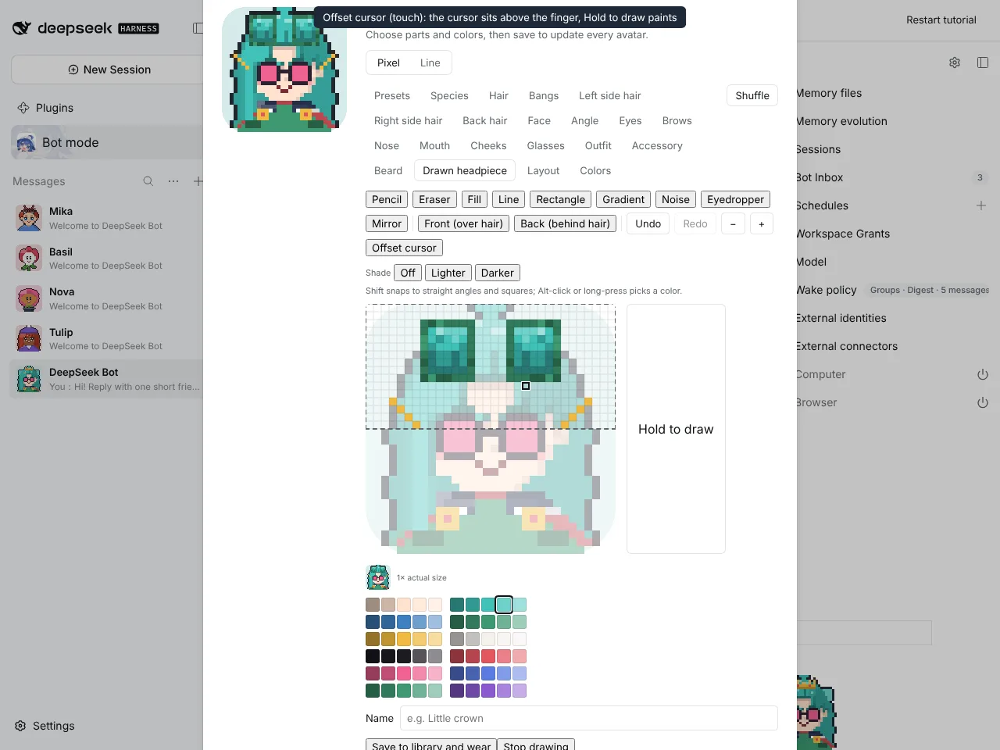
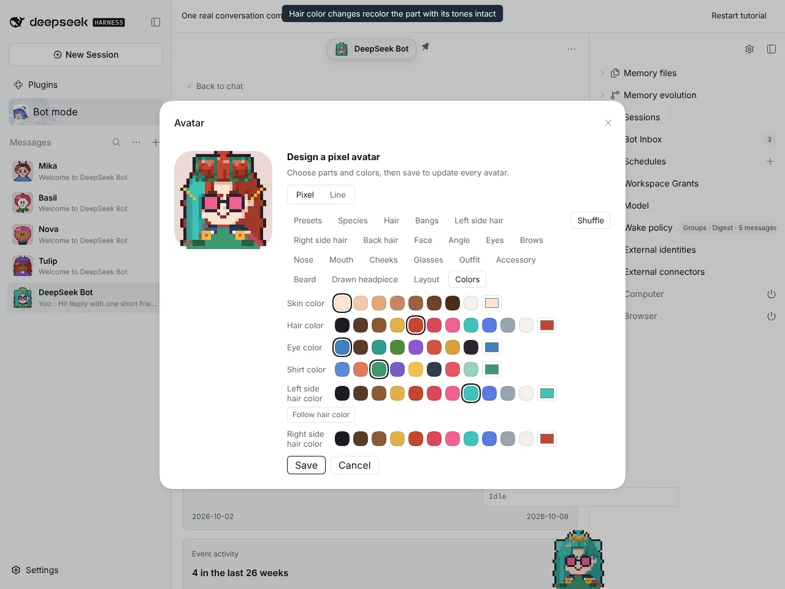
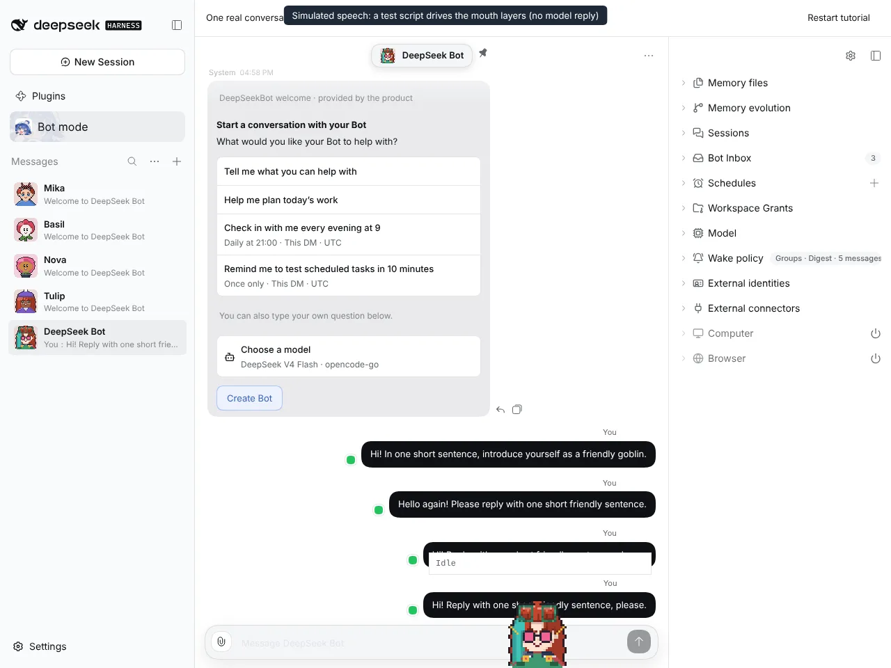

# #1216 Gradient, noise and the full tool set

Captured on an isolated DSH instance built from this branch, with `@botharness/pixel-avatar` 0.8.0 (BotHarness/BotPixel#16). Mirror is on throughout.

## Shapes

| Rectangle, and a line snapped to 45° with Shift |
| ----------------------------------------------- |
|        |

## Shading and texture

| Gradient inside the rectangle (hair color +1 → −2, 4×4 Bayer) | Noise at 30%, re-rolled twice |
| ------------------------------------------------------------- | ----------------------------- |
|                            |  |

| Darker shade stroke, then Alt-click picks color and tone | Offset cursor with the Hold to draw button |
| -------------------------------------------------------- | ------------------------------------------ |
|               |             |

## Recolor and Window Companion

The speech is simulated. A test script drives the companion's own mouth layers; no model reply was involved.

| Red hair recolors the part with its tones intact | Speaking with the shaded tiara      |
| ------------------------------------------------ | ----------------------------------- |
|                 |  |

## Full flow

The same recording as video: [drawing-tools-flow.mp4](drawing-tools-flow.mp4)
