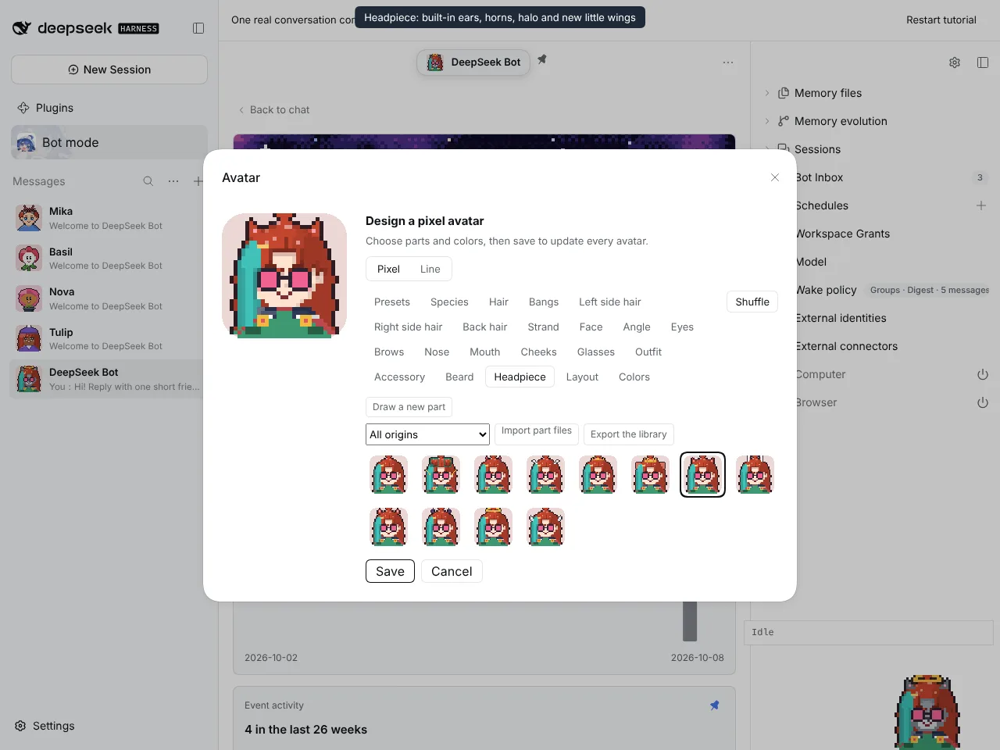
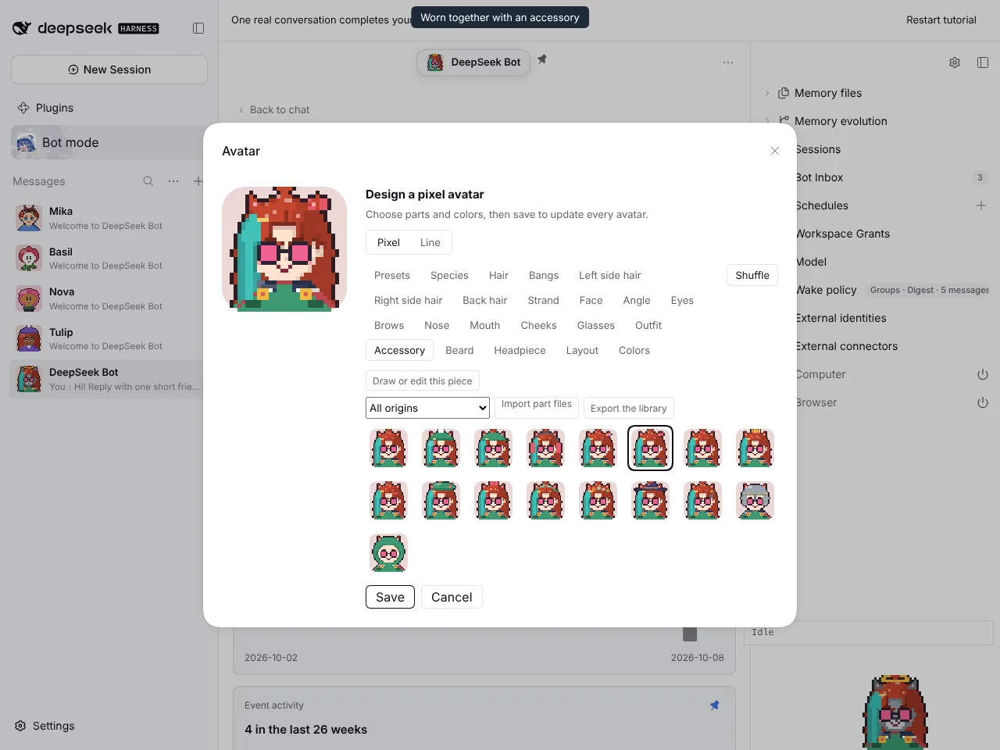
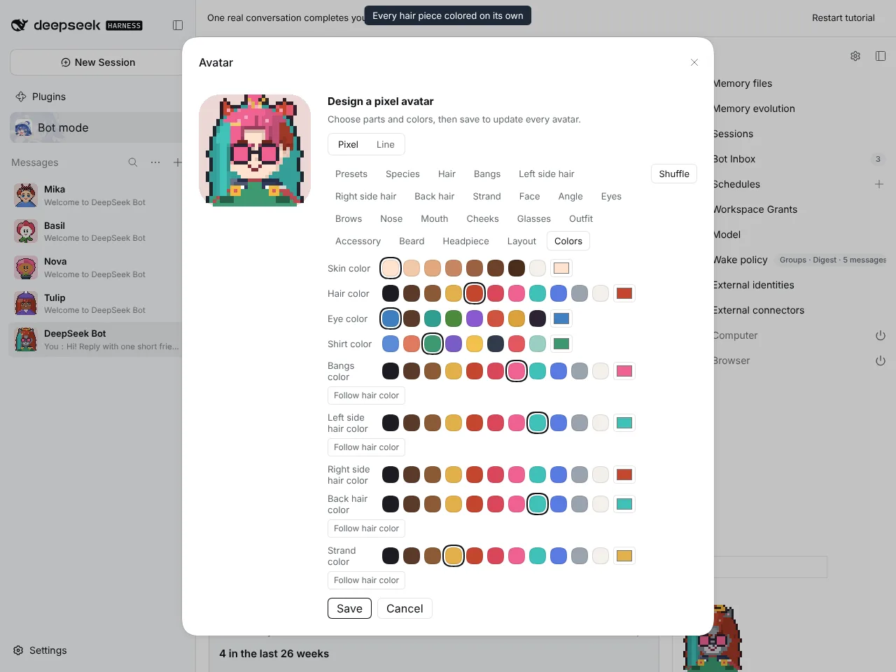
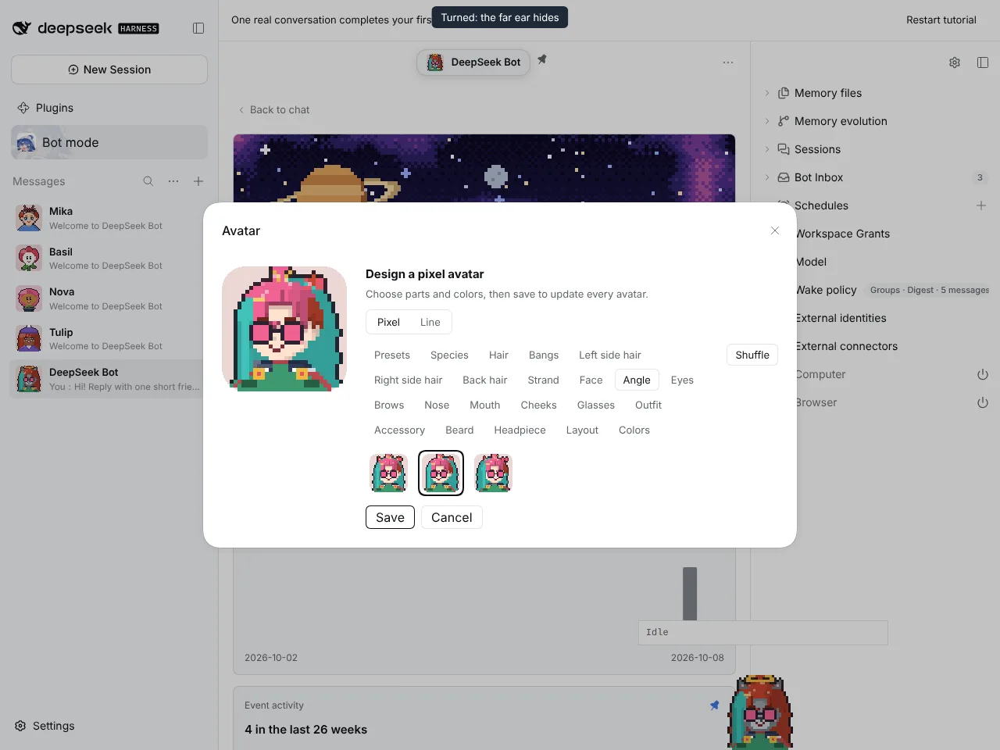
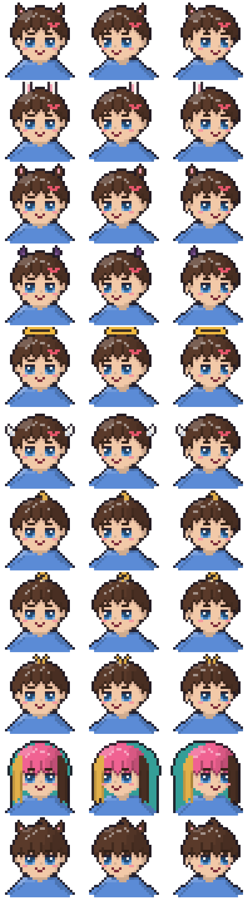
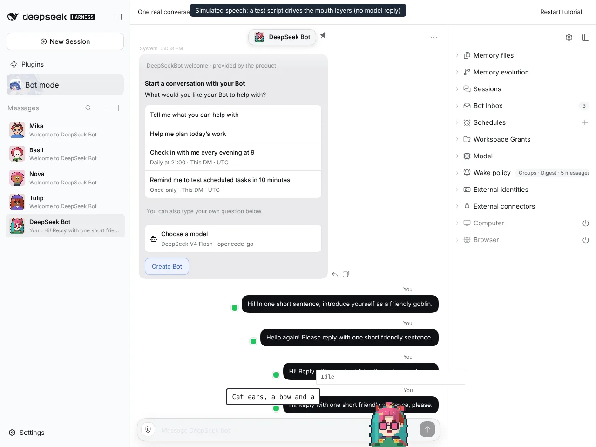

# #1217 Every hair piece colored and built-in headpieces

Captured on an isolated DSH instance built from this branch, with `@botharness/pixel-avatar` 0.9.0 (BotHarness/BotPixel#17).

| Built-in headpieces (cat ears last)     | Worn together with a bow accessory              |
| --------------------------------------- | ----------------------------------------------- |
|  |  |

| Bangs, left side, back hair and a double strand colored separately | Turned: the far ear hides       |
| ------------------------------------------------------------------ | ------------------------------- |
|                         |  |

## Renderer sheet

Each row is front, −30° and +30°: cat ears, bunny ears, horse ears, horns, halo and wings (each worn with a hairclip); ahoge, curl and double strands with a strand color; per-piece colors; and a saved cat-ears accessory recipe migrated by `withPieces`.

## Window Companion

The speech is simulated. A test script drives the companion's own mouth layers; no model reply was involved.

## Full flow

The same recording as video: [pieces-flow.mp4](pieces-flow.mp4)
