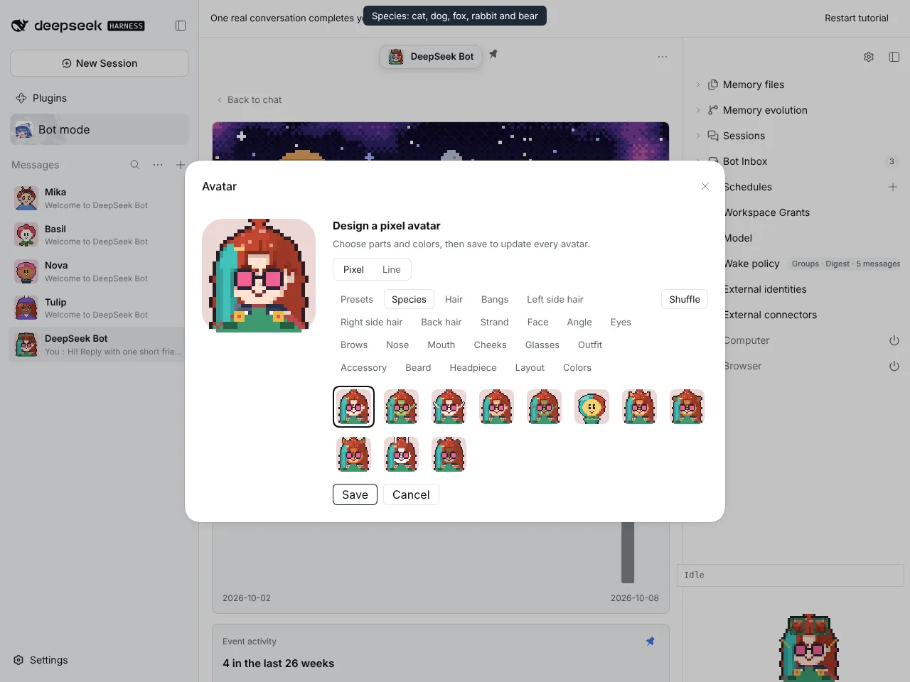
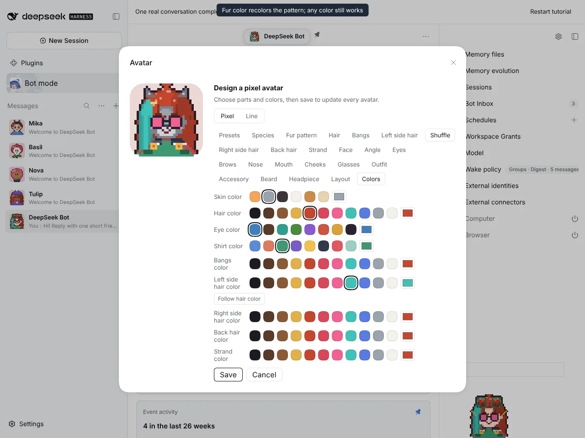
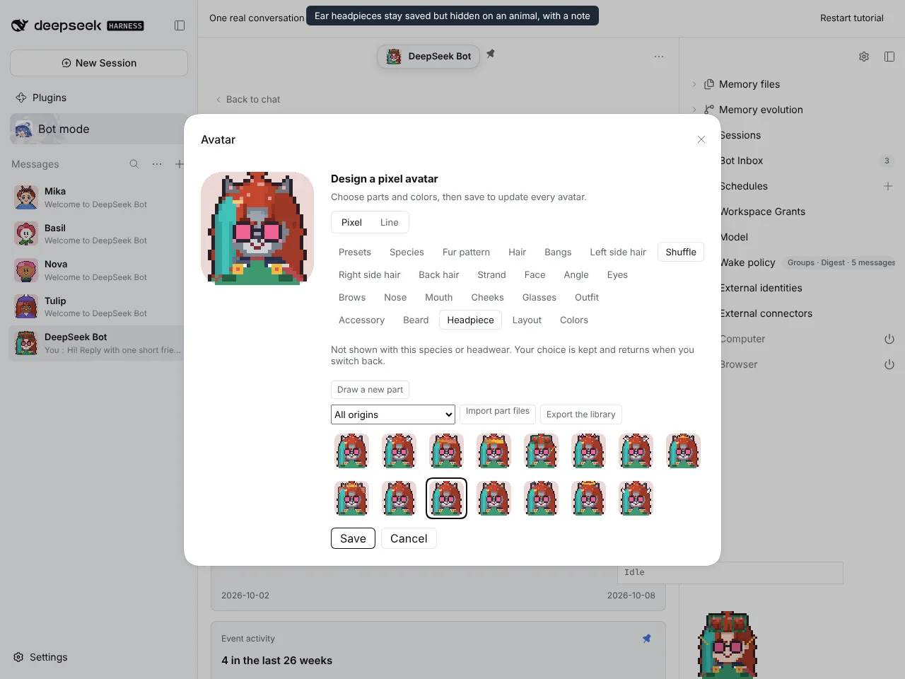
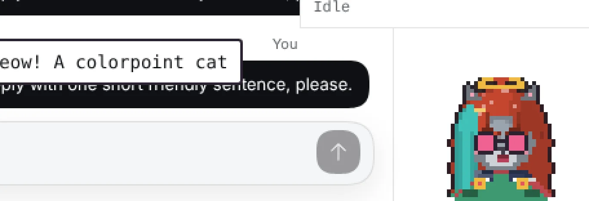

# #1218 Animal species with fur patterns

Captured on an isolated DSH instance built from this branch with `@botharness/pixel-avatar` 0.10.0 (BotHarness/BotPixel#18).

| Species: cat, dog, fox, rabbit, bear | Fur patterns in fur tones           |
| ------------------------------------ | ----------------------------------- |
|     |  |

| Gray fur recolors the colorpoint pattern | Bunny ears kept but hidden on a cat, with a note |
| ---------------------------------------- | ------------------------------------------------ |
|                 |         |

## Window Companion

The speech is simulated. A test script drives the companion's own mouth layers; no model reply was involved.

| Speaking as a colorpoint cat with a halo | Close-up (×3, cropped from the screenshot)   |
| ---------------------------------------- | -------------------------------------------- |
|       |  |

## Full flow

The same recording as video: [animal-species-flow.mp4](animal-species-flow.mp4)
