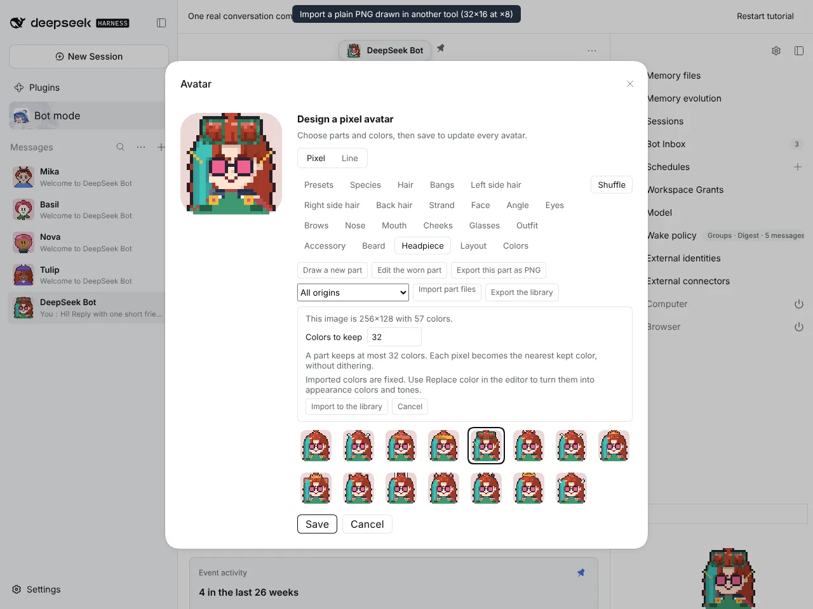
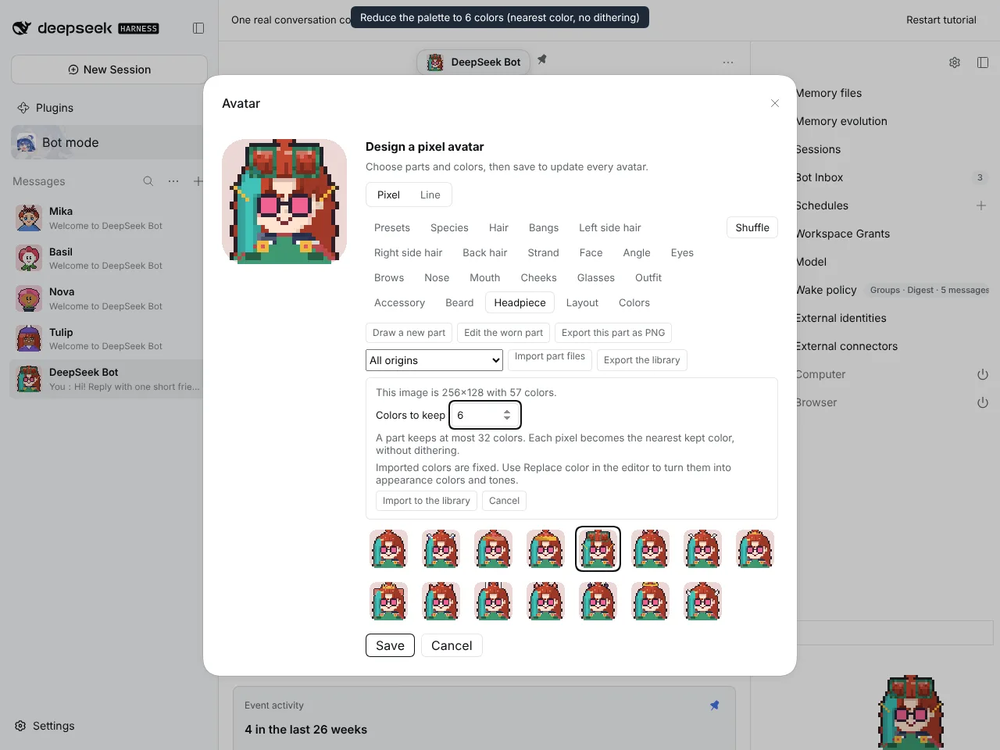
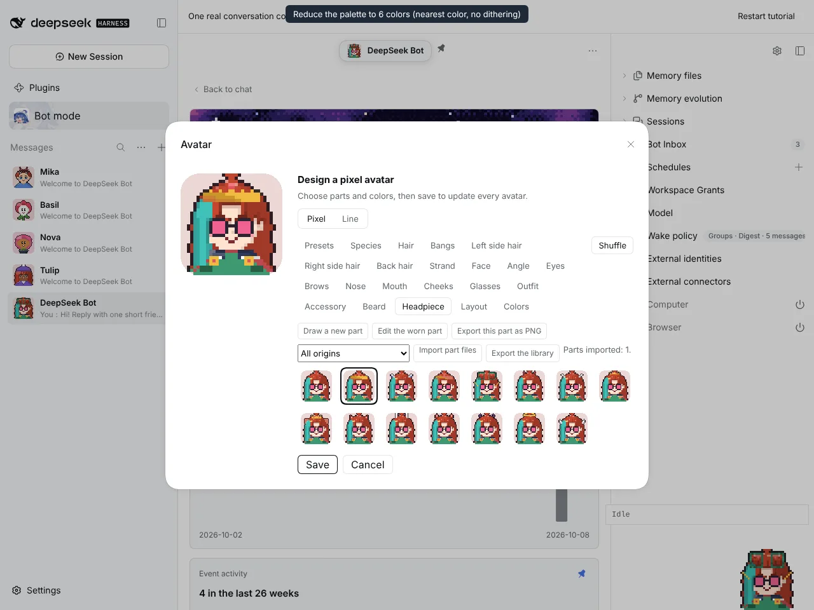
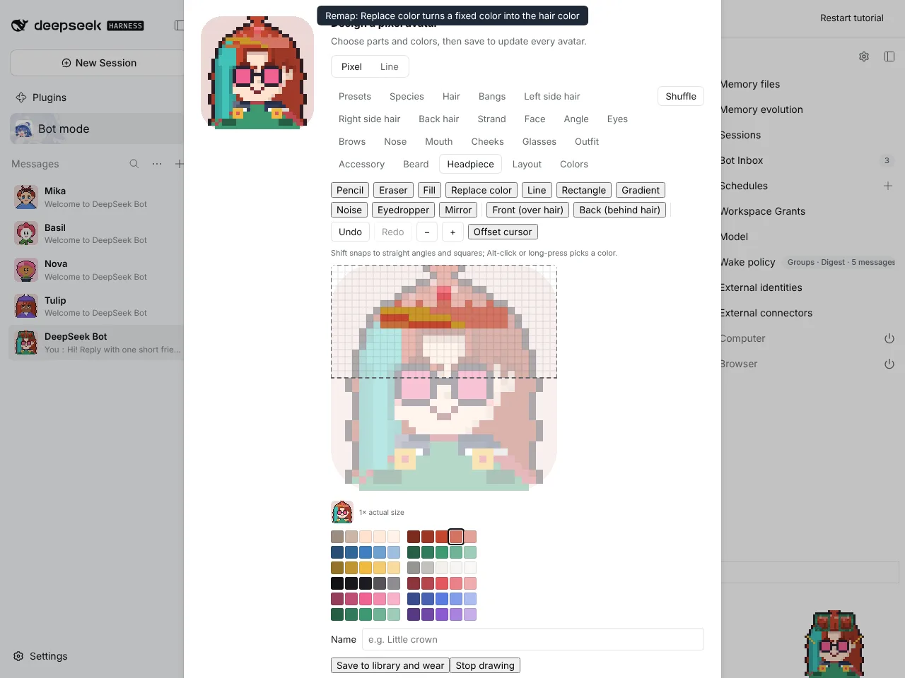
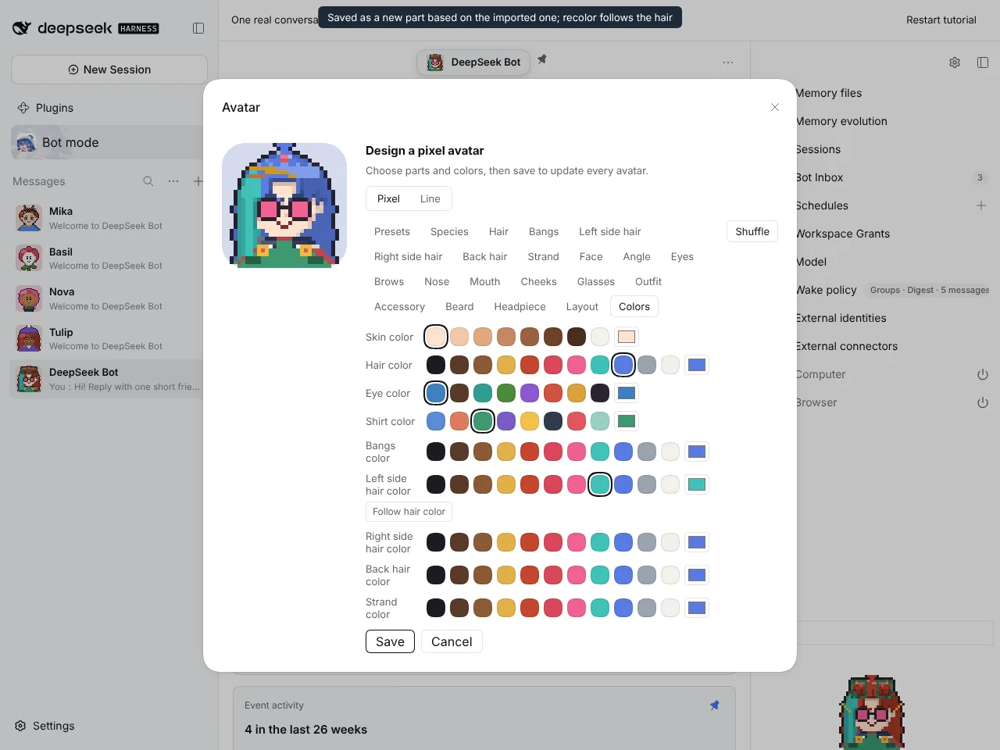
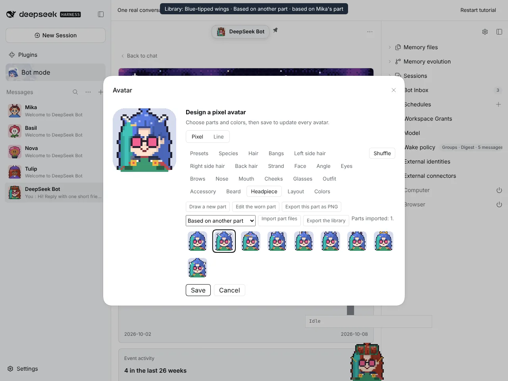
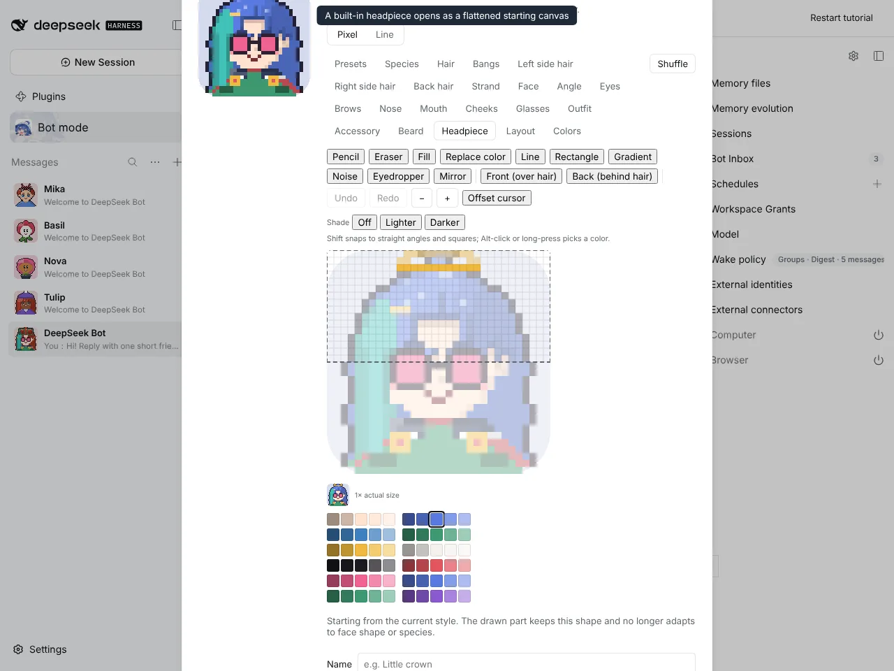

# #1219 Plain PNG import and derived editing

Captured on an isolated DSH instance built from this branch. The source image (`source-tiara.png`, 32×16 pixel art scaled ×8 with 57 colors) stands in for art drawn in another tool.

## Plain PNG import

| Size and color count shown before importing | Keeping 6 colors (nearest color, no dithering) |
| ------------------------------------------- | ---------------------------------------------- |
|          |           |

| Imported as fixed colors and worn | Replace color remaps two colors to hair color tones | The saved copy follows a hair color change |
| --------------------------------- | --------------------------------------------------- | ------------------------------------------ |
|  |                  |     |

## Derived parts

| Mika's wings edited and saved: "Based on another part · based on Mika's part" | A built-in halo opened as a flattened starting canvas |
| ----------------------------------------------------------------------------- | ----------------------------------------------------- |
|                                              |             |

## Full flow

The same recording as video: [png-import-flow.mp4](png-import-flow.mp4)
