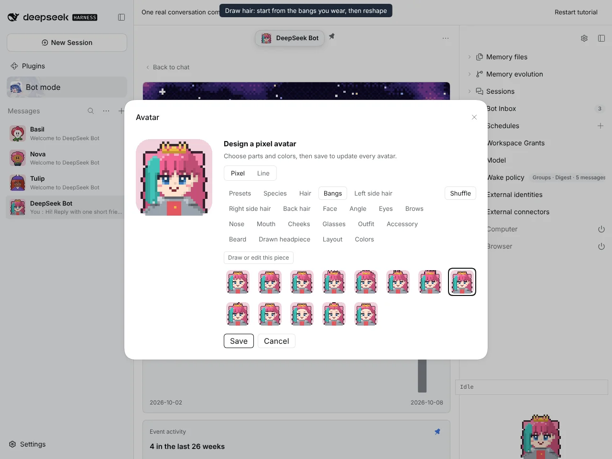
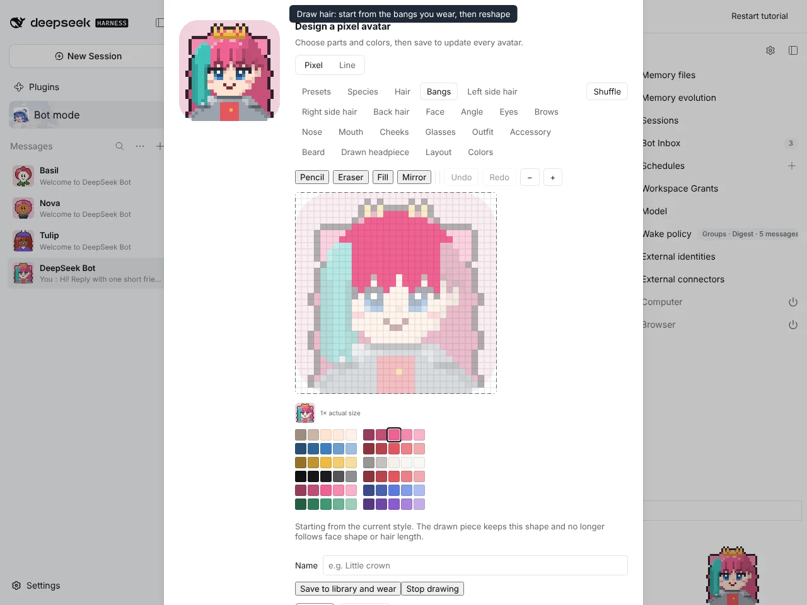
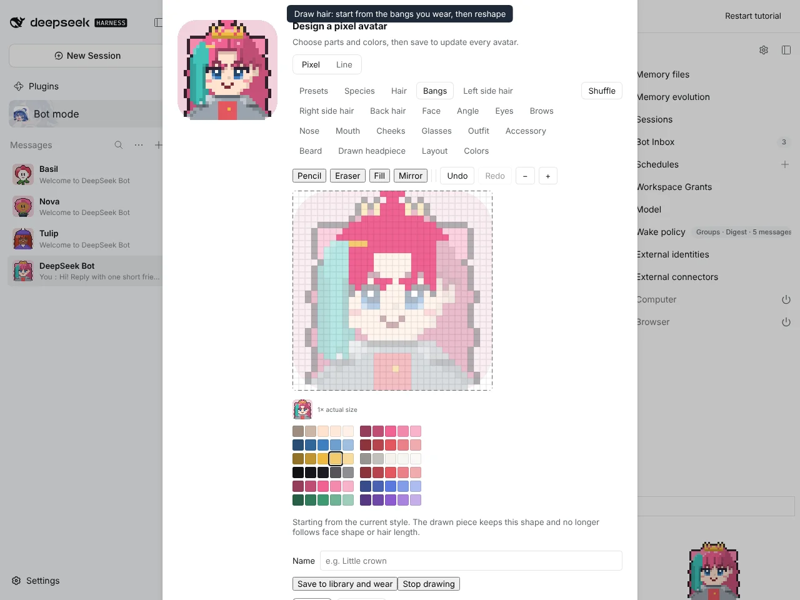
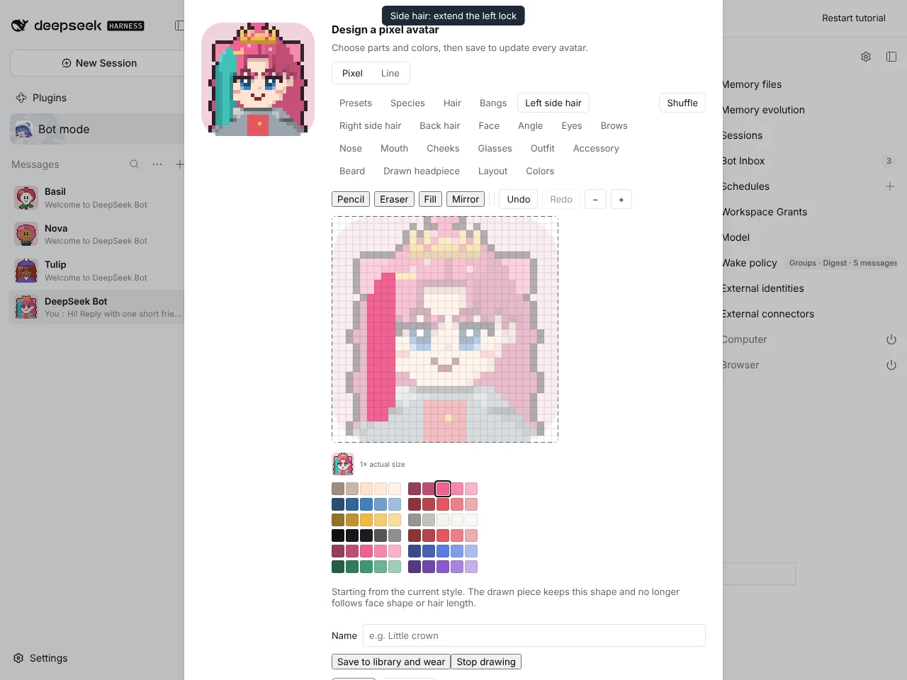
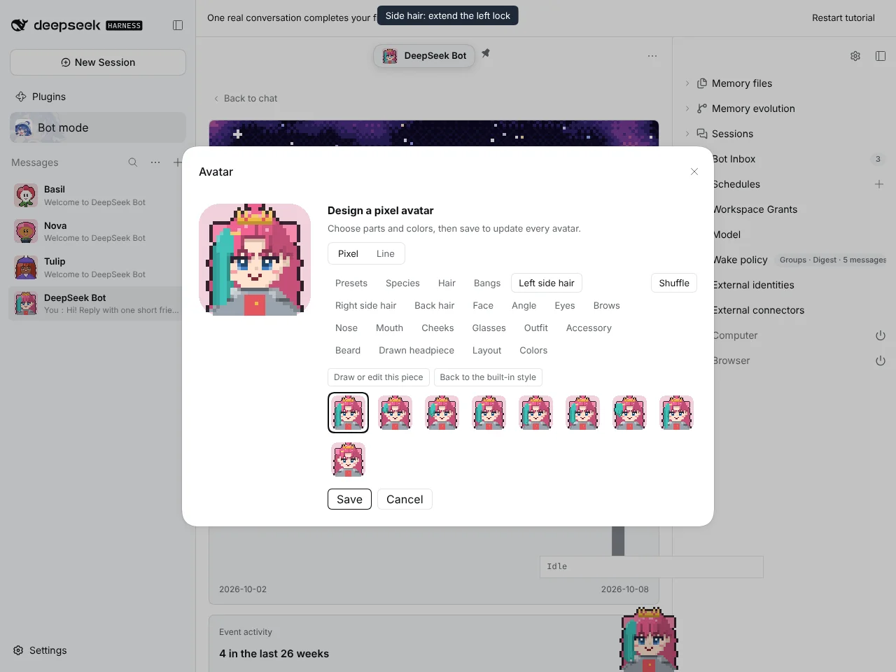
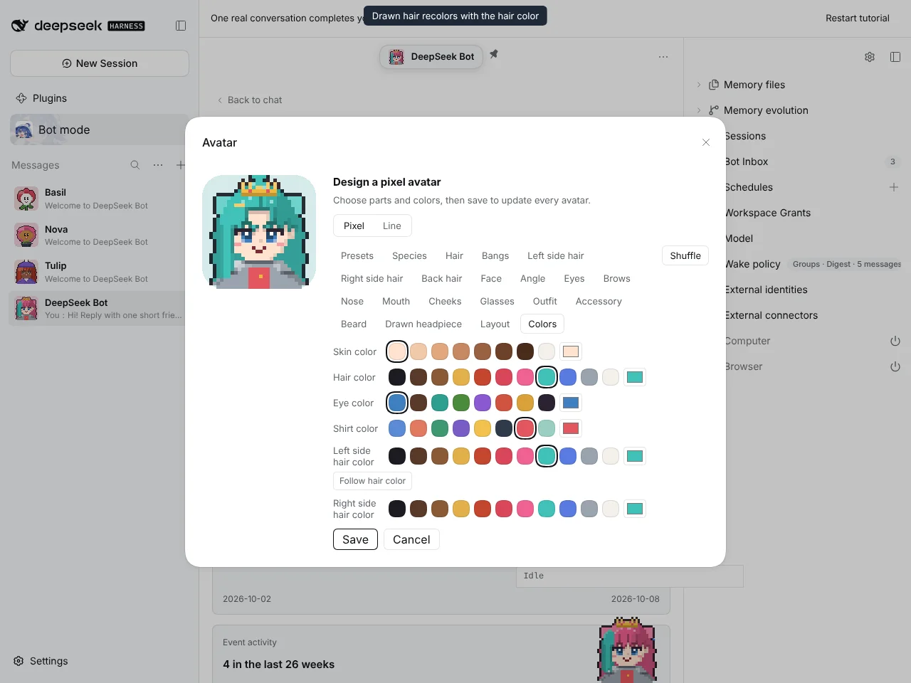
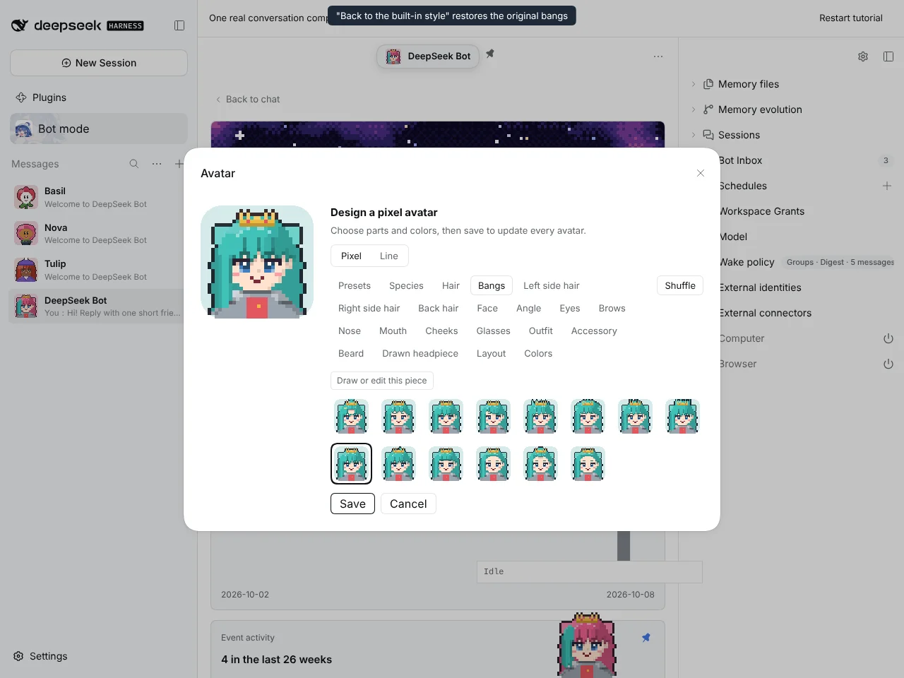
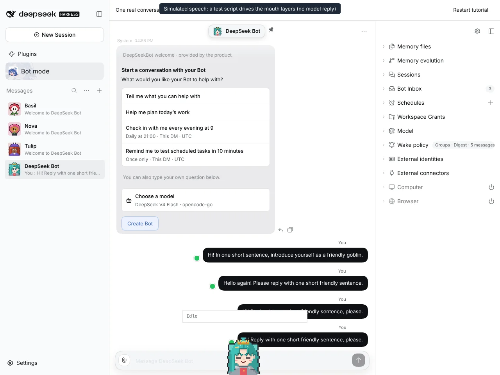

# #1238 Draw hair pieces starting from the built-in style

Captured on an isolated DSH instance built from this branch, with the `@botharness/pixel-avatar` 0.6.0 build (BotHarness/BotPixel#12).

## Starting from the worn style

| Bangs category: "Draw or edit this piece" | The worn bangs flattened to cells, with the keep-shape note |
| ----------------------------------------- | ----------------------------------------------------------- |
|    |                           |

## Reshaping

| Bangs parted, a tuft on top and a gold pin | Left side hair extended into a long lock |
| ------------------------------------------ | ---------------------------------------- |
|         |        |

## Library, color and restore

| Saved and worn                     | Recolored with the hair color          | "Back to the built-in style"             |
| ---------------------------------- | -------------------------------------- | ---------------------------------------- |
|  |  |  |

## Window Companion

The speech is simulated. A test script drives the companion's own mouth layers; no model reply was involved.

| Speaking with drawn hair                 | Close-up (×4, cropped from the screenshot)   |
| ---------------------------------------- | -------------------------------------------- |
|  |  |

## Full flow

The same recording as video: [drawn-hair-flow.mp4](drawn-hair-flow.mp4)
