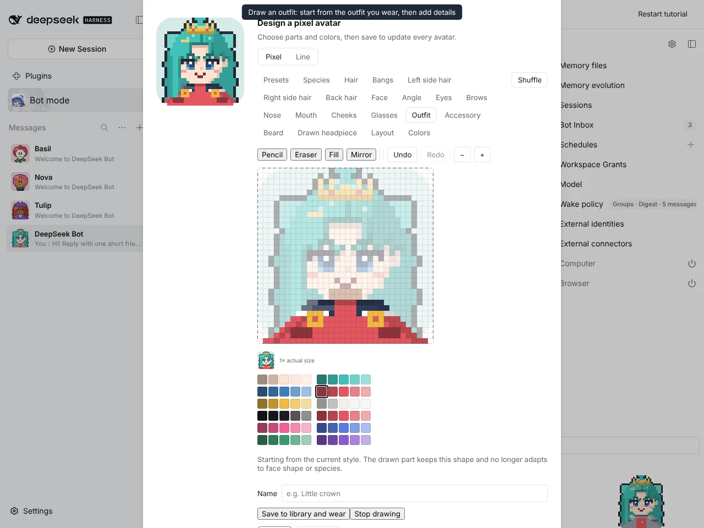
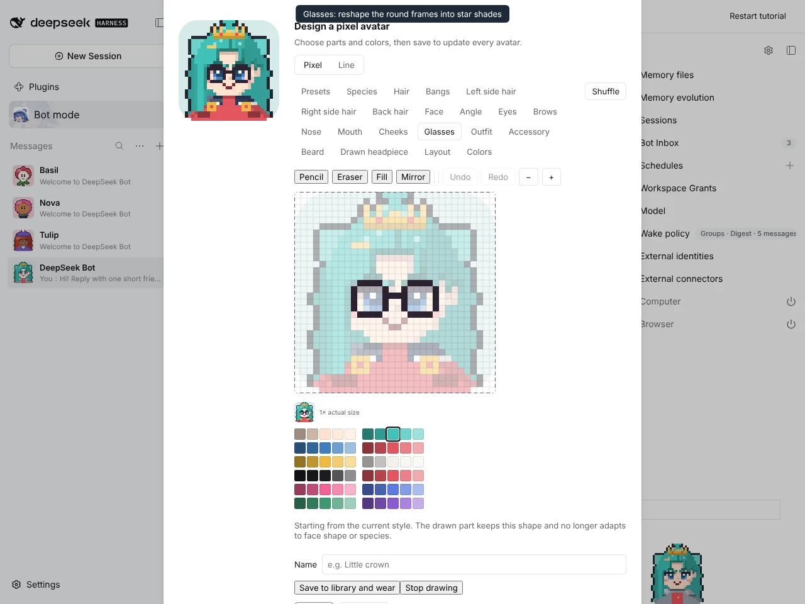
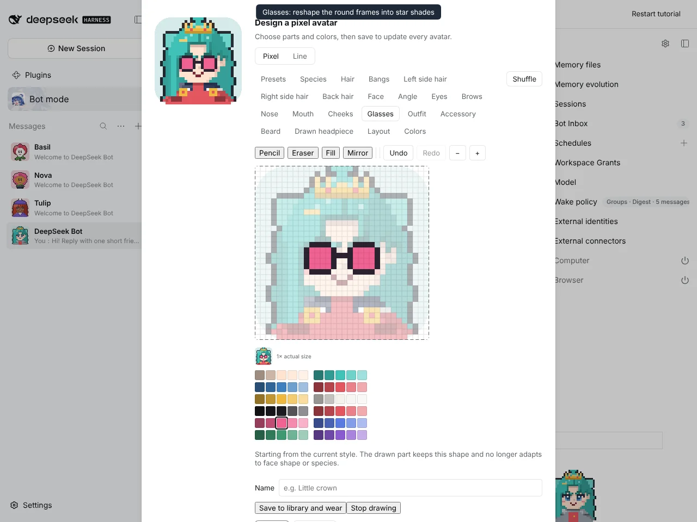
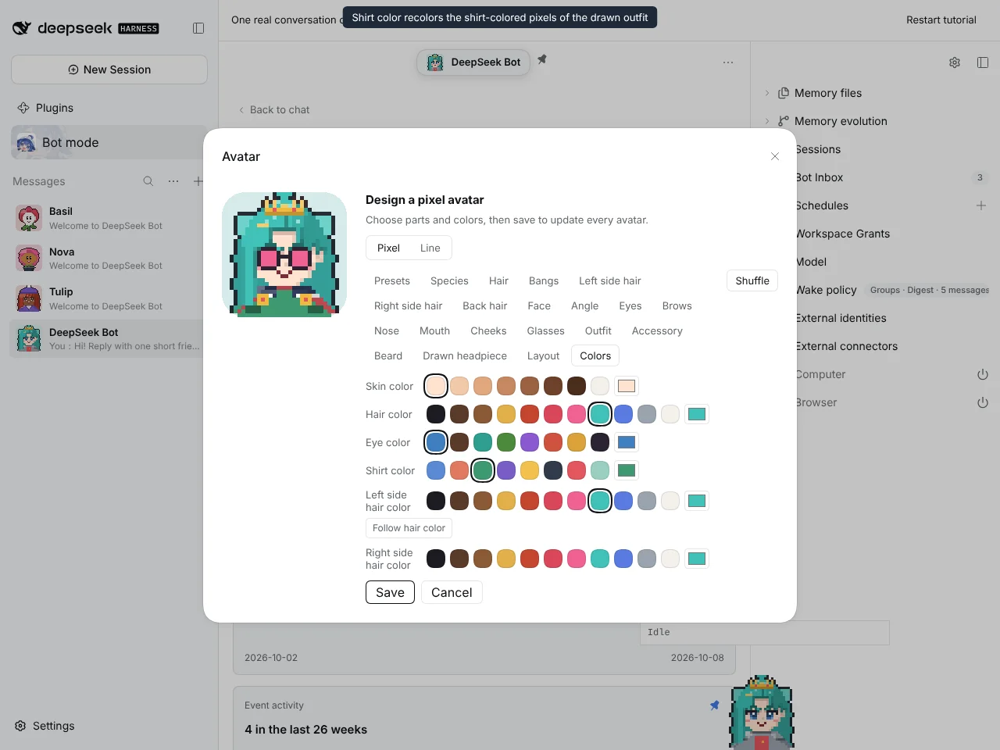
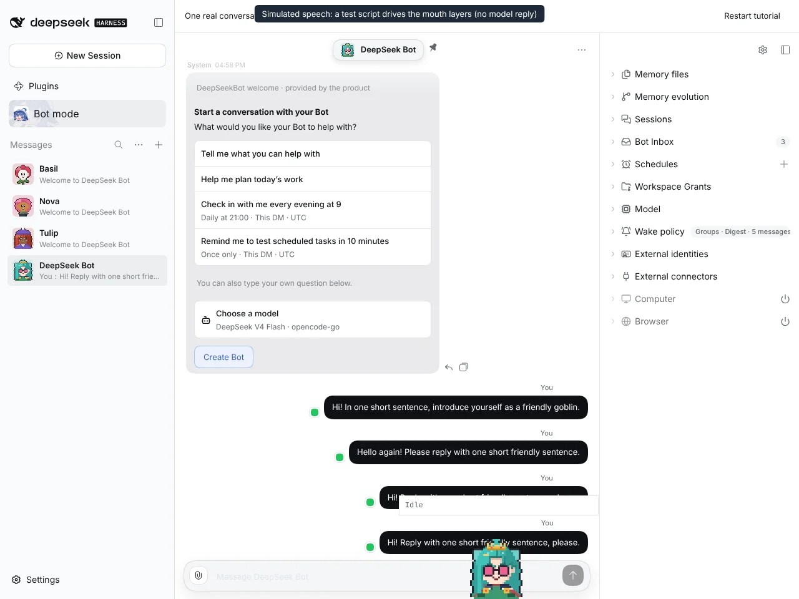

# #1240 Draw every other part starting from the built-in style

Captured on an isolated DSH instance built from this branch with `@botharness/pixel-avatar` 0.7.0 (BotHarness/BotPixel#15).

| Outfit flattened from the worn sailor outfit | Gold badges and a darker hem drawn in         |
| -------------------------------------------- | --------------------------------------------- |
|   |  |

| Round glasses flattened                       | Lenses filled pink                              |
| --------------------------------------------- | ----------------------------------------------- |
|  |  |

| Shirt color recolors the shirt-colored pixels of the drawn outfit | Window Companion speaking (simulated)     |
| ----------------------------------------------------------------- | ----------------------------------------- |
|                            |  |

The speech is simulated: a test script drives the companion's own mouth layers, and no model reply was involved.

Video: [drawn-parts-flow.mp4](drawn-parts-flow.mp4)
