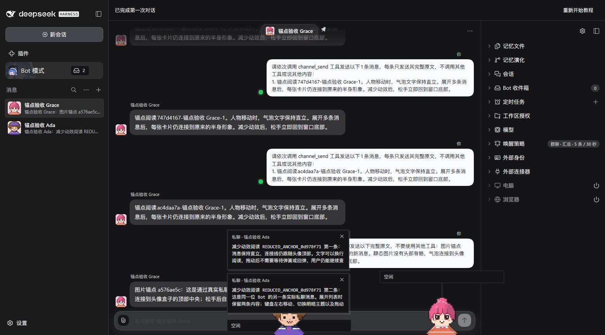
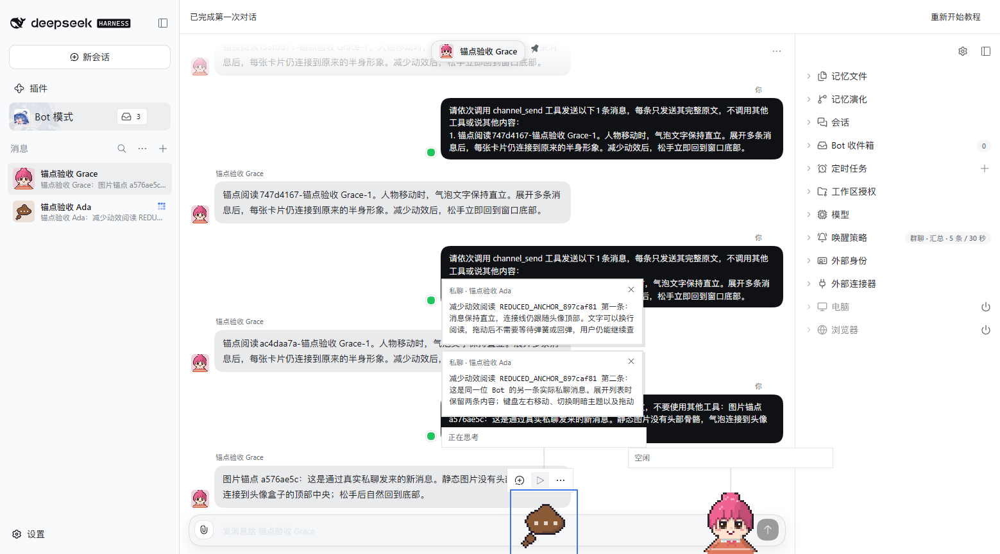
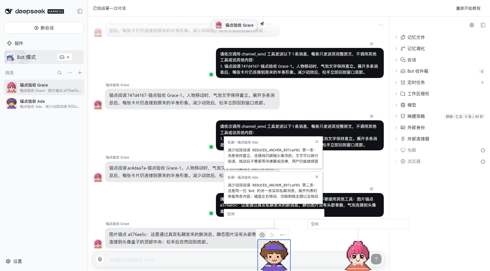
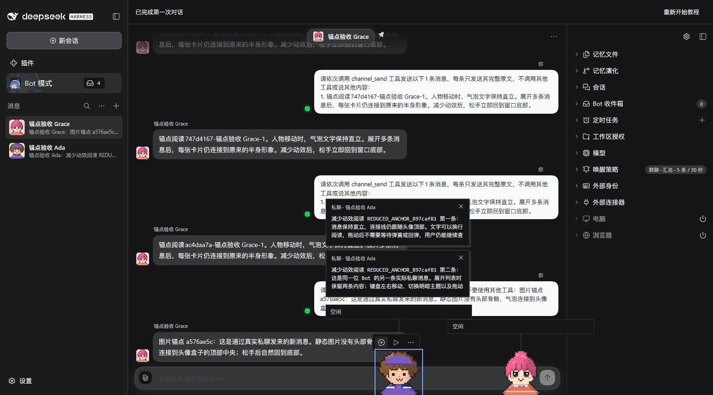

# Direct-motion anchor synchronization

Follow-up #1248 to merged #1183 and parent #1177. Real DSH 0.2.0-rc.1, formal pixel-avatar0.8.0, Chinese,1559×865. Baseline runtime4dbaa; corrected runtimefbb29752. The latter has an identical complete tracked tree to follow-up426167c9 from merged main85e9dfbe. New evidence commits do not change runtime code.

## Actual reduced-motion release

| Before, settled                      | After, settled                         |
| ------------------------------------ | -------------------------------------- |
|  |  |

These PNGs do not show the transient defect. A read-only QA observer compares the actual displayed head top-center and SVG connector origin in the first rAF callback after a trusted native pointerup. Before: character bottom865 but connector still points to screen y32 instead of769 (737px error). After: both origins match at y769 (0px). Both later120-sample reading/keyboard/theme/release workloads pass, illustrating why settled checks alone missed the defect. A mounted public View regression independently fails before the fix with300px error and passes after, without executing a subsequent animation frame.

[Continuous baseline recording](release-before.webm) · [Continuous corrected recording](release-after.webm) · [Sanitized qualification](qualification.json)

## Corrected reading and keyboard movement

| Light reading, genuine tool cover during initial reply | Light after native arrow keys   | Dark reading                  |
| ------------------------------------------------------ | ------------------------------- | ----------------------------- |
|                          |  |  |

Two exact new Bot-authored replies are independently checked against canonical Channel messages. Normal public character focus retains the reading list; native pause controls stop autonomous walking. Both original absent Avatar Appearance/image fields remain unchanged. All four phases stay in one document; cards remain upright and within the viewport. Console inspection finds0JavaScript errors and all owned test pages/browser are closed.

## Boundaries and preserved failures

Same Profile, identities, history, viewport, theme and scenario; reply marker and sidebar unread count differ. The first baseline setup timed out waiting for visible cards despite real replies. That attempt is retained privately. The next baseline adds live-stream and outside-focus preconditions, so recovery does not prove its cause. It exposes the737px first-release failure; the corrected run then passes the same scenario.

Recordings are continuous silent official MCP output, container-remuxed only. No synthetic reply/SSE/card injection, interpolation, dubbed audio or invented first-frame image. Sampling does not prove all compositor frames, performance, held/reversing drag, moving-hover/grace or genuine background behavior. Those broader #1177/#1167 gates remain separate. Quiet-idle presentation belongs to independent #1173.
