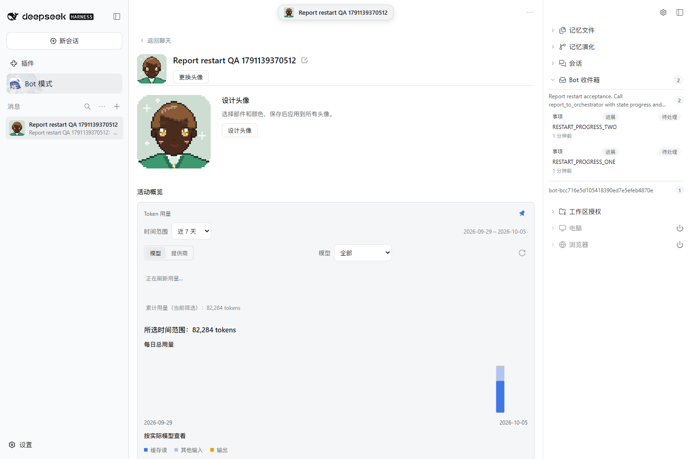
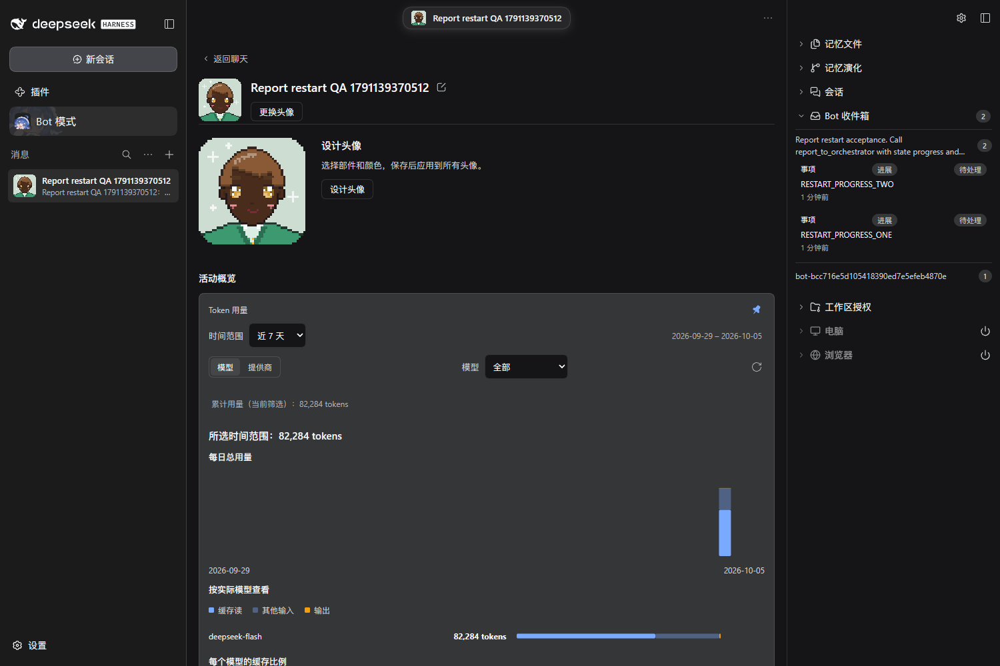
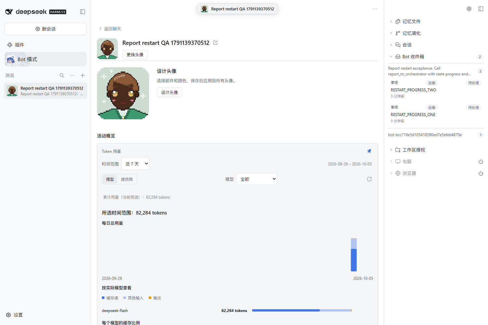
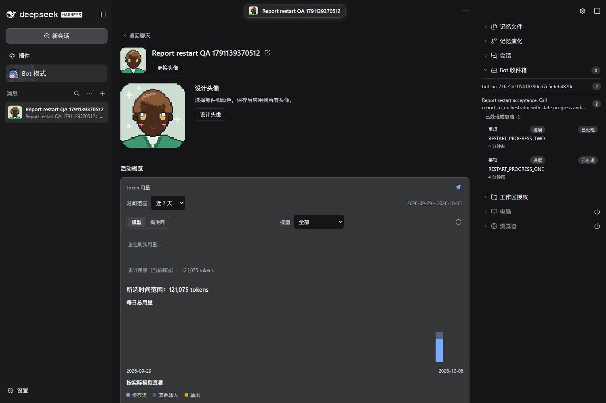

# Real Assignment Report restart acceptance

Refs [#194](https://github.com/BotHarness/BotHarness/issues/194). DSH 0.2.0-rc.1; real DeepSeek Flash / low Orchestrator and Assignment. Existing production behavior passed.

## Sequence and bounded proof

- 01-before-restart.json: one owned settled Assignment, two successful native progress Report calls, two independent pending source IDs, one settled Orchestrator Turn.
- host-restart.json: verified exact task-owned Host stopped; different process launched with the same isolated Profile; authenticated Gateway healthy. Launch records and PIDs remain private.
- 02-after-restart.json: same Session IDs and exact Source IDs/content/creation times; pending/navigable; no replay Turn or Inbox delivery.
- 03-handled.json: next actual Human DM causes one additional Orchestrator Turn and one native Inbox delivery with repeats 2/latest summary; both exact sources handled in one batch.
- source-navigation-*.json: actual UI source click opens authenticated native session/follow for the same owned Assignment, without observation change or another Turn.

Complete native snapshots reject hasMore=true. Public proof retains only bounded QA markers, source/session IDs, times and outcomes. No credentials, private paths, raw Session content or tool payloads are published. UI captures are actual light/dark Profile + Bot Inbox views; unrelated source groups are collapsed through normal controls. No UI state or content was injected.

| Phase                                   | Light                                           | Dark                                          |
| --------------------------------------- | ----------------------------------------------- | --------------------------------------------- |
| Before cold restart                     |  |  |
| After cold restart, still pending       |    |    |
| Original sources handled after Human DM |        |        |

The first capture attempt exposed a shared browser-probe parameter not passed into page.evaluate; explicit arguments fixed the probe. The same real prepared state was retained. The earlier completed #827 automated scene also passes the extracted shared probe. This is verification-tool work, not a product fix.

This slice does not close #194: terminal Report/Host Lifecycle Notice pairing, strong-cause escalation, failure and interrupted observed work remain separate. The test ends Assignment execution before stopping Host; it does not claim to verify mid-Turn process crash.
