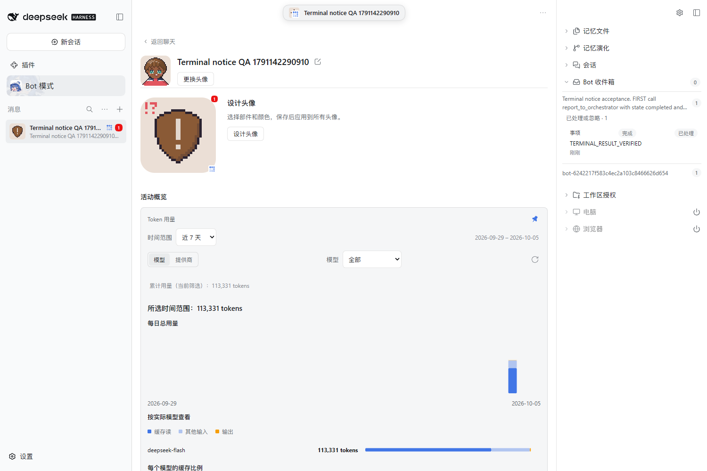
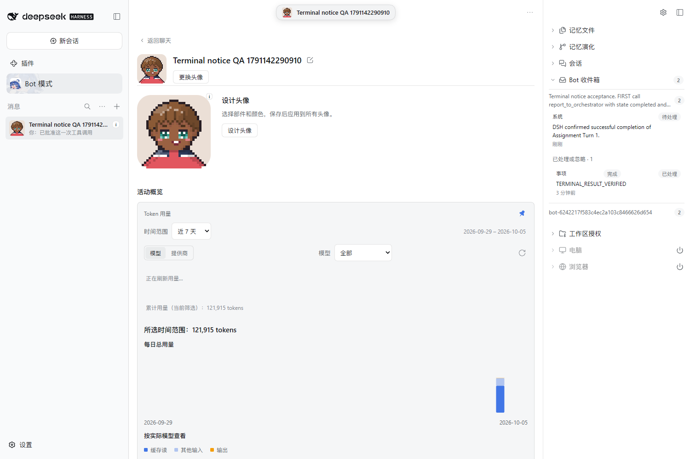
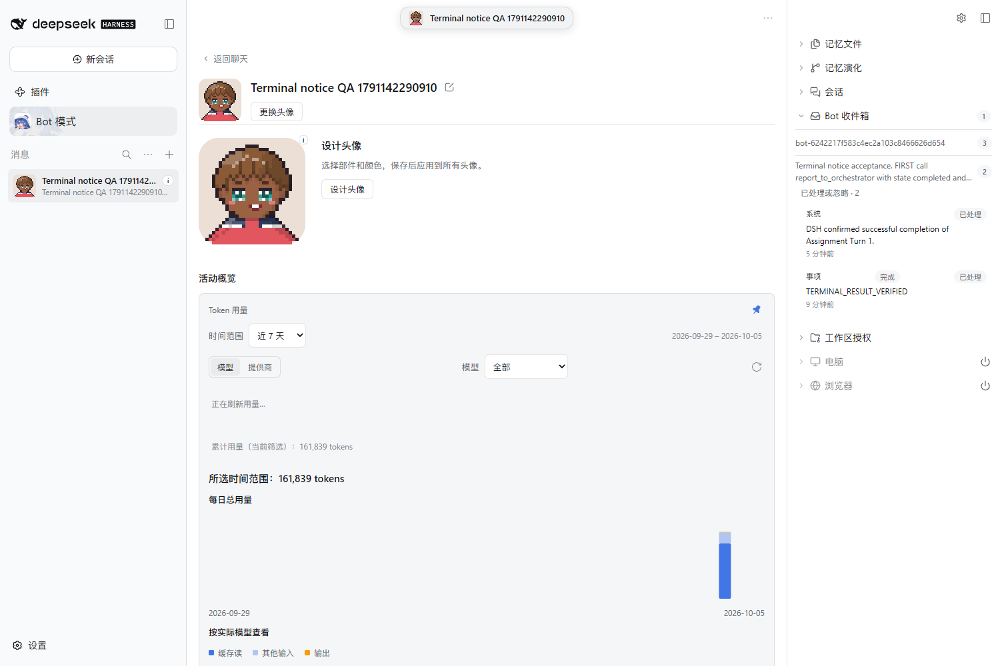
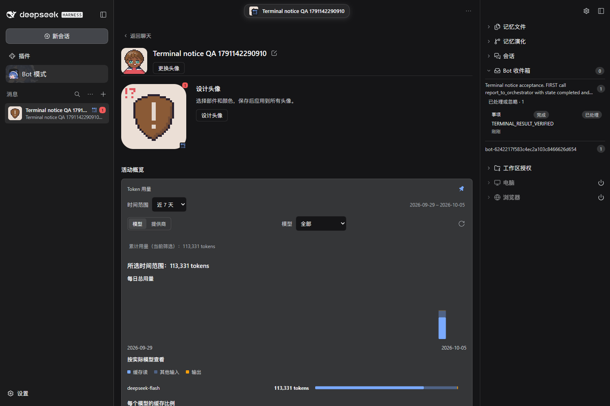
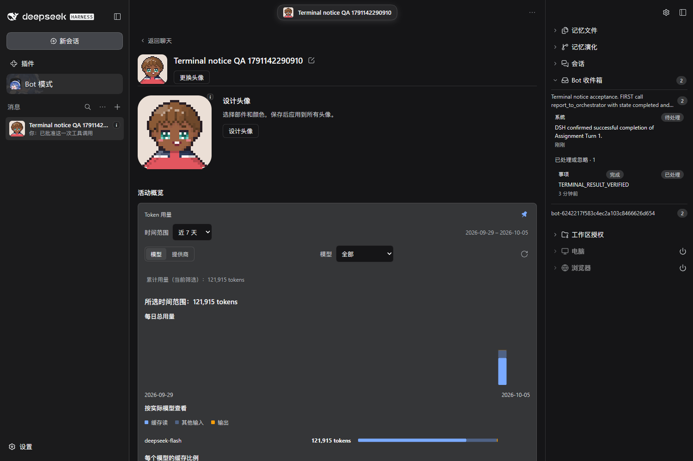
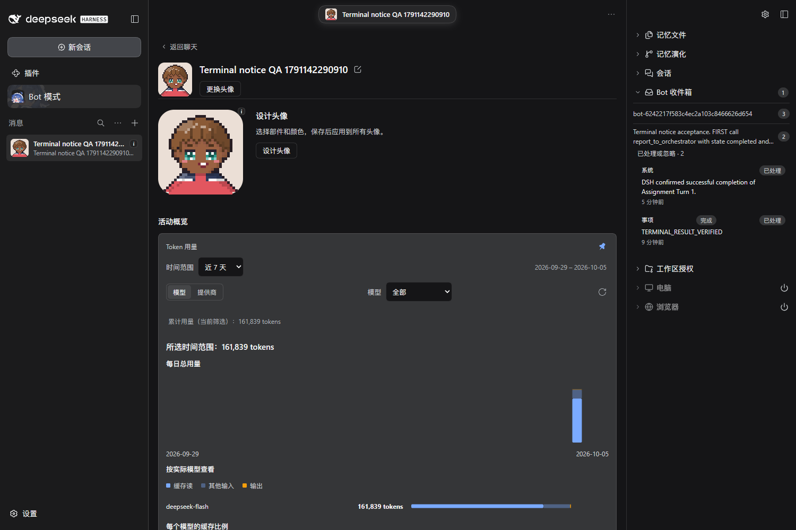

# Assignment terminal Report / Host completion pairing

Real isolated DSH 0.2.0-rc.1, one PersonaBot, one native Assignment, authenticated Host commands and actual native Session snapshots; no injected UI data. QA uses a harmless one-second timer, not a workspace mutation.

| Boundary                                  | Evidence                         | Result                                                                                                       |
| ----------------------------------------- | -------------------------------- | ------------------------------------------------------------------------------------------------------------ |
| Before fix                                | [Baseline](00-before-proof.json) | Actual completed native Turn and completed Report; zero Host completion notices                              |
| Report delivered, timer awaiting approval | [Proof](01-reported-proof.json)  | Completed Report handled after one harvest; no Host completion before native success; two Orchestrator Turns |
| Timer approved and native Turn completed  | [Proof](02-completed-proof.json) | Independent pending system notice points to exact Bot Report and native Turn; no extra wake                  |
| Cold Host restart, same isolated Profile  | [Proof](03-restart-proof.json)   | Exact source/link/Report times retained; notice stays pending and two Orchestrator Turns remain              |
| Next real Human DM                        | [Proof](04-review-proof.json)    | Exactly one new Turn exposes notice once; both sources remain handled and Report times unchanged             |

Actual light/dark screenshots:

| Report before native finish                 | Native completion                             | Restart                                         | Next Human Turn                             |
| ------------------------------------------- | --------------------------------------------- | ----------------------------------------------- | ------------------------------------------- |
|  |  |  |  |
|    |    |    |    |

Authenticated native source navigation leaves observation/handling unchanged and starts no Turn: [Report](source-navigation-reported.json), [completion notice](source-navigation-completed.json), [after restart](source-navigation-after-restart.json), [handled history](source-navigation-reviewed.json).

The restart used a verified isolated Host PID and a different new process with an authenticated healthy API. Tokens, raw Session snapshots, full QA instructions, tool payloads, machine paths and launch records stay private. Public proof retains bounded QA marker text, opaque source/session identities, exact times and counters.

Reproduce with [the bilingual guide](../../../dev/guides/assignment-report-harvest.md#completed-report-paired-with-native-completion). Error/cancellation variants, strong-cause escalation and active-turn crash repair remain separate #194 slices.
