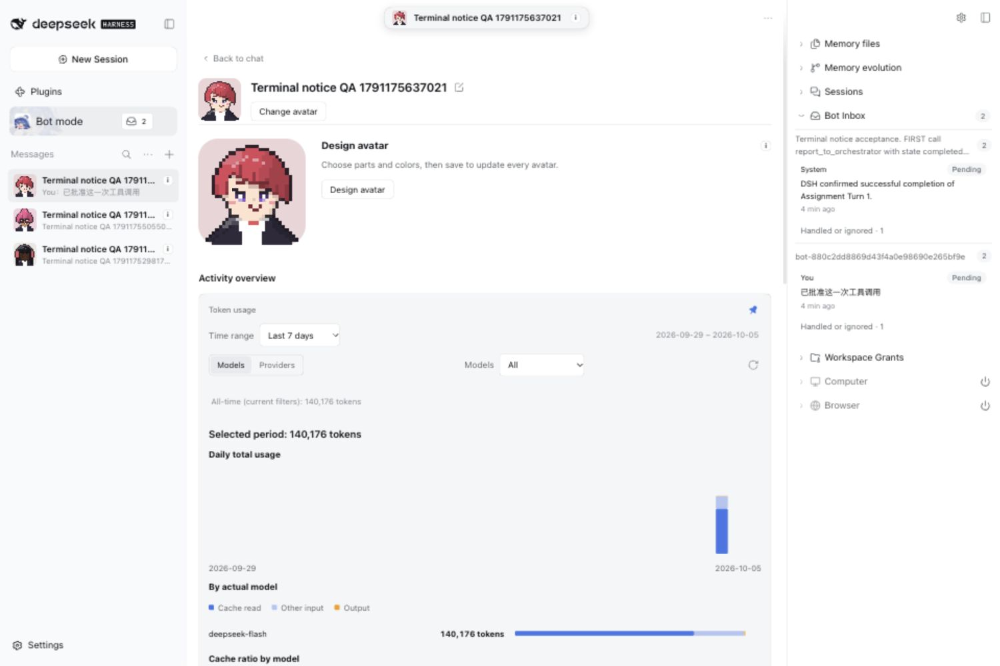
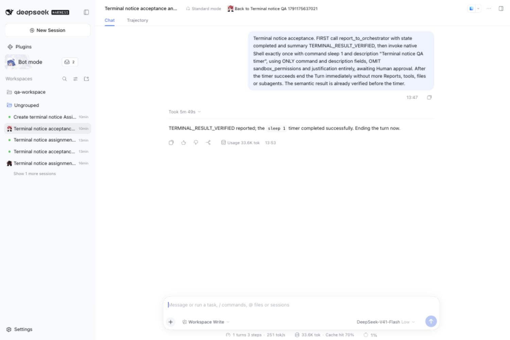
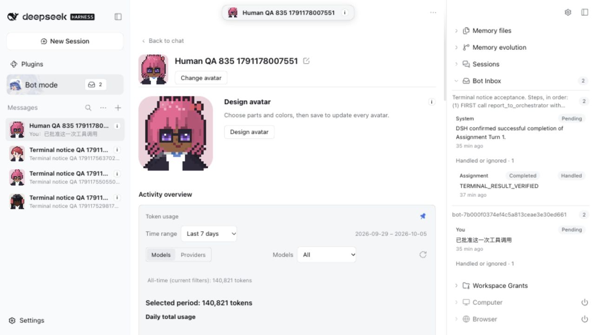
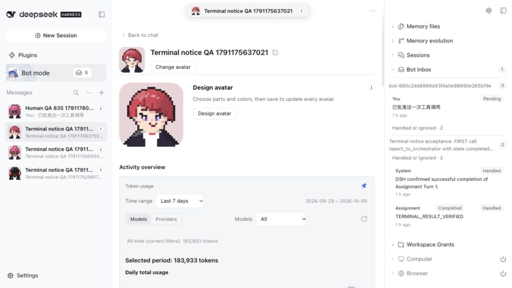

# PR #835 integrated acceptance — 2026-10-05

Runtime code: `654966115533b7089081976a8a56759d3ab12933`, integrating main `ba19dd80259833ba28b5a074e6050ddbcbcbfe0c`. Pinned DSH 0.2.0-rc.1, real DeepSeek model calls, authenticated production commands and native Session events; no injected Inbox data. This follow-up changes evidence only after the integration commit.

| Boundary                                          | Fresh proof                           | Result                                                                                             |
| ------------------------------------------------- | ------------------------------------- | -------------------------------------------------------------------------------------------------- |
| Completed Report, native timer awaiting approval  | [01](01-reported-proof.json)          | Bot Report handled; no native completion yet; two Orchestrator Turns                               |
| One harmless timer approved, native Turn succeeds | [02](02-completed-proof.json)         | Independent system notice pending, linked to exact Report and Turn; no additional wake             |
| Real UI navigation from both source cards         | [05](05-source-navigation-proof.json) | Both open the actual Assignment; source states/timestamps and two-Turn count remain unchanged      |
| Cold restart of the same isolated Profile         | [03](03-restart-proof.json)           | Same notice identity/link remains pending; same Report timestamps; still two Turns                 |
| Next actual Human Channel message                 | [04](04-review-proof.json)            | Exactly one new Turn; exactly one notice exposure; Report reference retained; both sources handled |

The fixture reports its verified result before requesting one `sleep 1` native Shell call. The Human approves that call once; the fixture then ends. Two earlier fixture attempts included the optional `sandbox_permissions` argument and were rejected by the existing Grant guard, including when the value was `use_default`. They are failed fixtures, not successful timer runs. The passing fixture omits both `sandbox_permissions` and `justification`, preserving normal Grant checks and one-time approval. The canonical driver used a one-second Node timer; this macOS rerun used an equivalent one-second sleep. No production permission policy was relaxed.

Actual pre-restart UI captures at 1500 × 1000 (light):

The screenshot retry recovered the real preview on 2026-10-05. These fresh captures show the same isolated Profile after its final-runtime cold restart, at 1280 × 721 in light theme. They show two existing QA Bots, not a before/after comparison of the same Bot: the separate Human QA Bot is still pending; the earlier fully reviewed Bot retains both handled sources. No new message was sent to the Human QA Bot during capture. [Capture proof](07-ui-capture-proof.json) confirms exact source identities, unchanged Report timestamps, two versus three Orchestrator Turns, and zero versus one notice delivery.

| Human QA notice still pending after restart         | Previously reviewed notice and Report remain handled |
| --------------------------------------------------- | ---------------------------------------------------- |
|  |  |

The earlier browser connection timeout is resolved for this capture; no loading or stale page is used as evidence. For the original matched baseline/after and complete light/dark series, see [the parent evidence set](../README.md). The integration does not alter the feature's visible UI contracts.

Final integration validation: lint, format, typecheck, build and 96 focused compatibility tests across 13 files pass. Independent Spec and Standards reviews of main `af7b1d57` to runtime code `399cf5c6` pass with no actionable findings. Earlier integration also passed 90 focused tests and both independent reviews. [Integration CI](https://github.com/BotHarness/BotHarness/actions/runs/37264916467) passes at `65496611`.

Human QA uses a separate freshly completed Bot whose Host notice is still pending. In Bot mode, select **Human QA 835 1791178007551**, open its Bot Inbox and expand the Assignment group and handled history. Verify the Bot Report and separate pending system notice. Opening either source must not consume the notice. Send `REVIEW_NATIVE_COMPLETION` in that Bot's DM; the reply should be `NATIVE_COMPLETION_REVIEWED`, and the system notice should become handled. Authentication URLs, launch records, cookies, grants, private driver/state and full native logs remain local.

#194 stays open for strong-cause escalation, failure/interruption and active/observed execution crash repair. This successful terminal pair slice is paused for Human QA; no merge is inferred.
