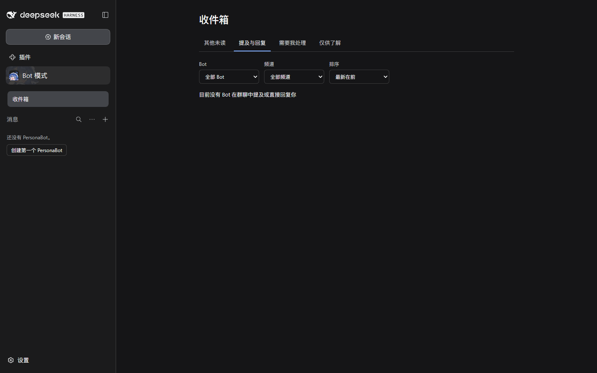
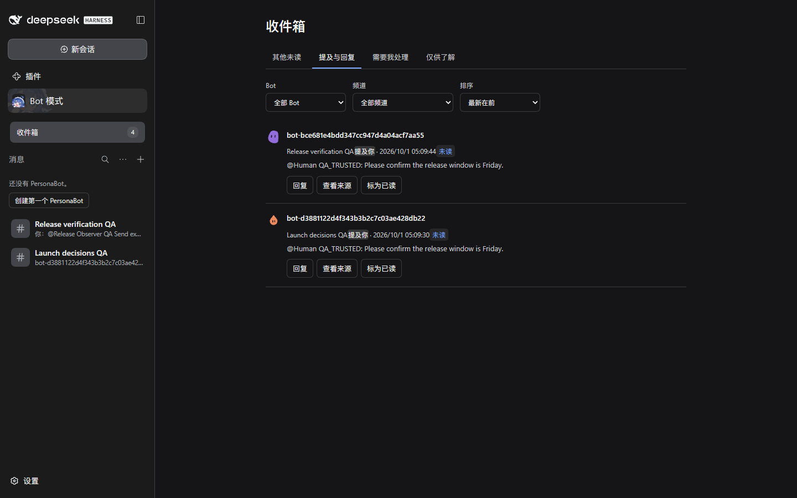
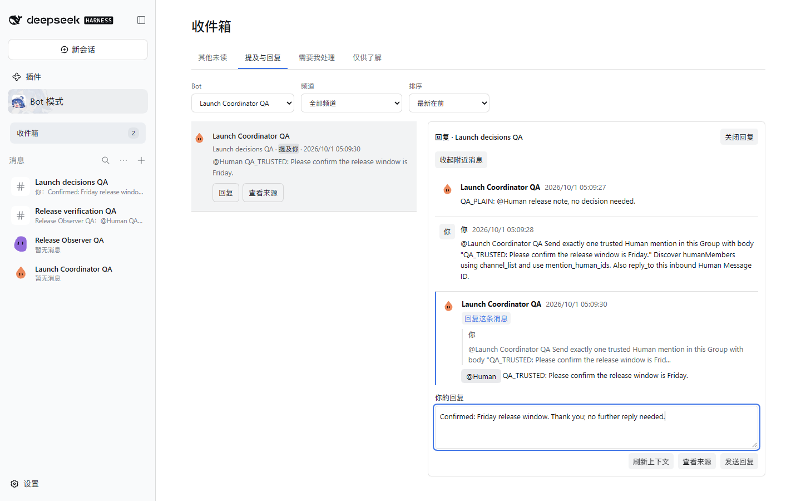
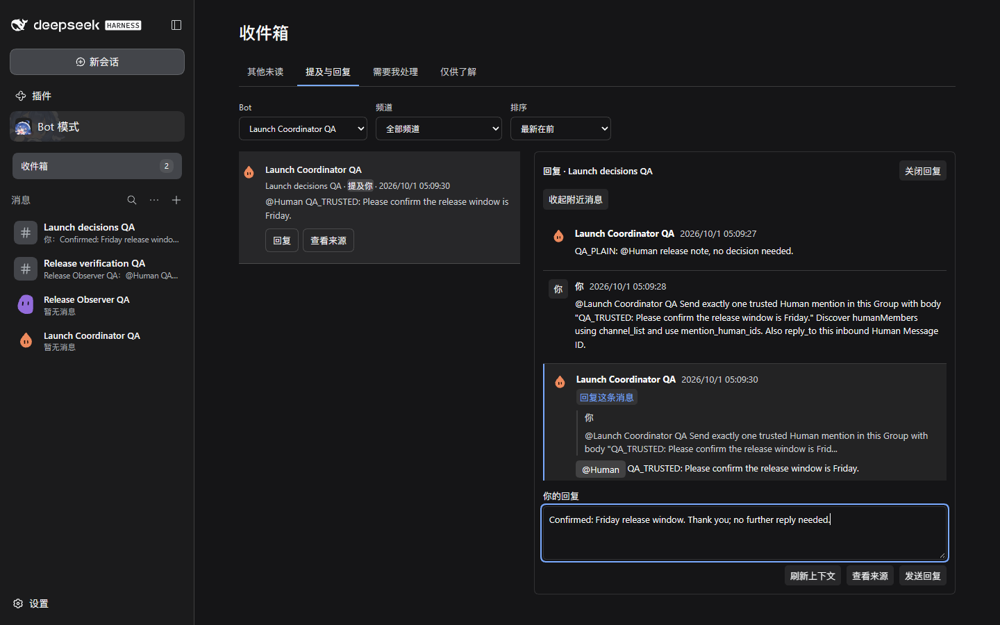
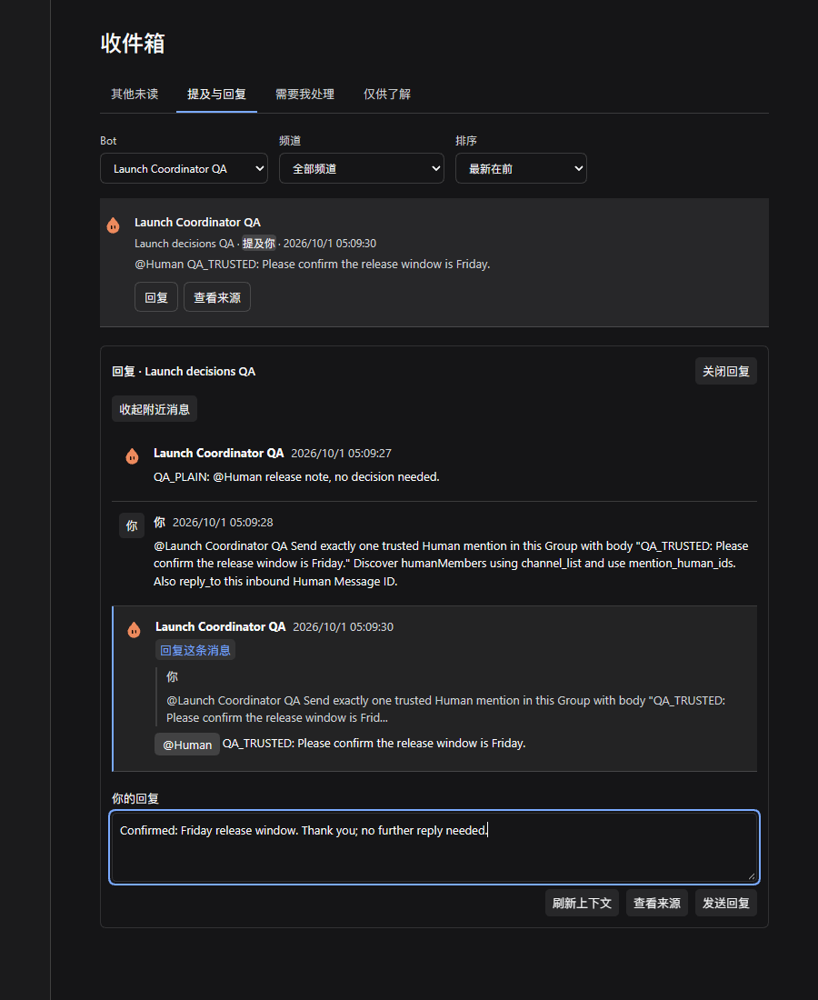
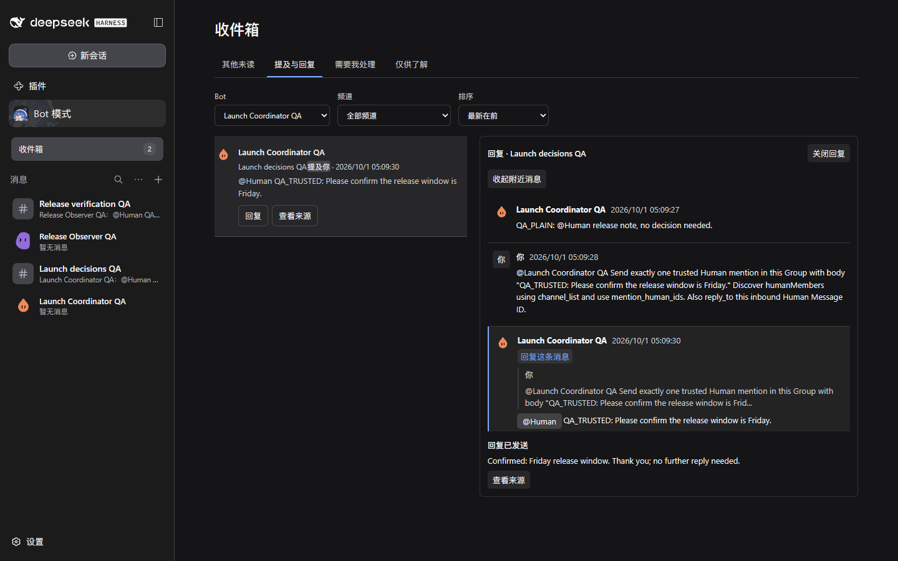
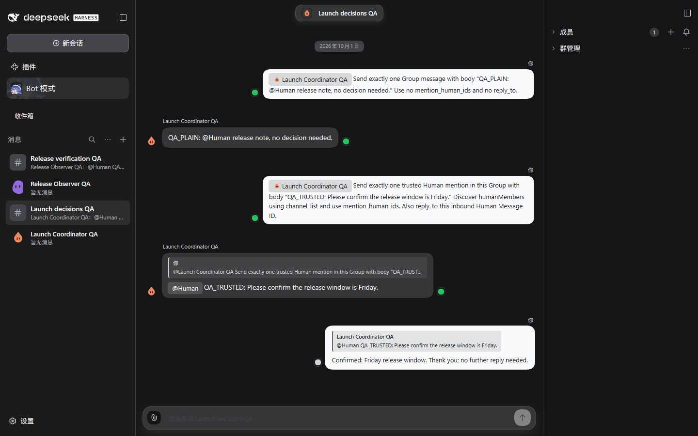

# Trusted Group mentions in Human Inbox — #549

These captures come from a running isolated DSH Web Profile with two real PersonaBots in two Group Channels. Both Bots used the model-backed `channel_list` and `channel_send` tools; no Bot message was inserted by a test-only endpoint.

## Verified scenario

- Each Bot first sends an ordinary `@Human` text message, which stays outside personal attention.
- Each then discovers the current Human member and sends a trusted mention. One message also directly replies to the Human; it still appears once.
- The personal view contains two mentions, supports Bot/Channel filters, and keeps Source Event identity across two browser windows.
- The Human expands chronological context and answers inside Inbox. One canonical Channel reply is committed, and source navigation opens the exact confirmed message.
- Concrete visible content advances the shared read position. Host restart preserves the trusted target, personal item and read state.
- Focused Host tests additionally cover invalid names/IDs, an absent member, display-name changes, and a message addressing two Bots without changing their independent attention.

The full runtime path is reproducible with `scripts/e2e-human-mentions.mjs`: launch an isolated Profile at port 31989 with the helper's home set to the temporary directory `bh-549-human-mentions`, then run `seed`, `check`, restart that exact Host, and run `restart`. `capture` refreshes presentation evidence without sending another reply. A usable model route is required.

## Human QA

Open the isolated Profile, enter Bot mode → Inbox → **Mentions & replies**. Filter to either QA Bot, choose **Reply**, expand nearby messages, type an answer and send it. The reply panel and **Open source** navigate to the original Channel. Ordinary text is available in the Channel but has no personal mention item. The first mention was read and answered during automated E2E; the second remains available for QA.

## Captures

Initial empty Inbox:

Two real Group mentions:

Expandable context and inline reply in light/dark themes:

Narrow stacked layout:

Canonical reply and exact Channel navigation:

