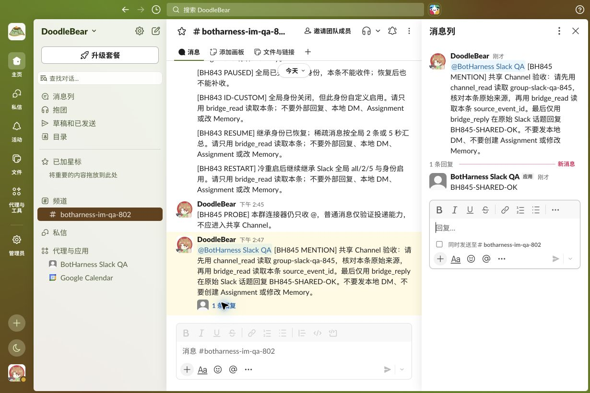
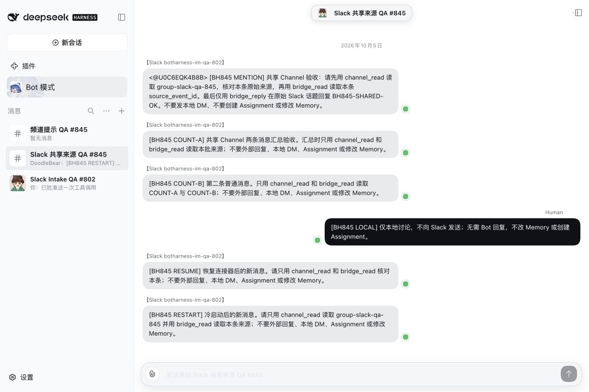
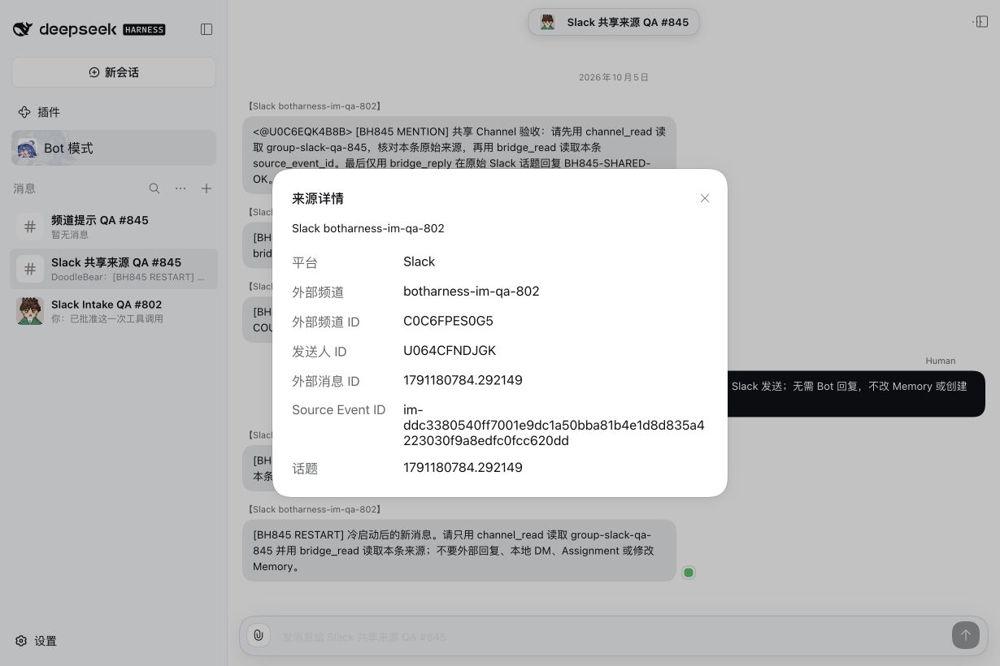

# Slack shared Channel qualification — #845

Task: `codex/local/01a0f14c-5338-7020-853b-0fe54b87aa95`. Issue [#845](https://github.com/BotHarness/BotHarness/issues/845), parent [#48](https://github.com/BotHarness/BotHarness/issues/48), Project 10 / v1.1. Implementation is ready for Human QA; this evidence is not merge or deployment approval.

## Revisions and capture

- Runtime code: `665119a5`; integrated latest-main revision: `b26d1b89` (main `5410207340ffefbb4bb6f2567c5b79adb9100299`). The integration changed documentation and regenerated its Chinese font, with no runtime-code difference.
- Before UI: `224f9c0057c3e2caca41f1460c1c5deb63238e99`, whose tree equals merged main `af7b1d57`. Runtime packages are unchanged from that main to `54102073`; the intervening #820 supplies the Lark user guide. After UI uses this issue's code, the same QA Profile and synthetic data.
- DSH `0.2.0-rc.1`; checked dsh-im Provider `48e7a35792af5222cd40cfe1ba2607ac55a59df2`, runtime SHA-256 `15e60e507f8ff3b47ca011ca7f9471a0018f1686cf7e93700d3cc35cb6e43aaf`, 393 files.
- Real Chrome captures, 1230 × 820, Chinese. Light pairs use five synthetic messages; the dark pair uses the same six-message snapshot after cold-start acceptance. Each pair keeps the same policy, membership, data, theme and view. Theme was restored to its original “follow system” setting. No mock screen, production traffic, credential, login URL or private raw model trace is published.
- The ordinary-delivery warning visible in paired Profile captures is intentional: a new receiver lease awaits fresh delivery qualification. The final Human QA receiver was separately requalified by a new native `[BH845 FINAL]` message and processed at the inherited 2 / 5-second threshold.

## Real native path

1. A local Group Channel `group-slack-qa-845` was created through Client and the existing Slack PersonaBot joined. Its authorized public source was added through the connector Modal. The older Inbox-only route was explicitly disabled; this acceptance exercises Group-only placement.
2. `[BH845 PROBE]`, sent without mention while the connector was mention-only, verified ordinary delivery without creating a Channel source/admission.
3. A native mention produced one canonical Source Event, one Group placement and one member admission. The real model called `channel_read`, `bridge_read` and `bridge_reply`; native Slack independently displayed **BotHarness Slack QA** replying **BH845-SHARED-OK** in the original message's thread. Exact native message/receipt IDs are in [proof.json](proof.json).
4. After switching the connector to all ordinary text, `[BH845 COUNT-A]` waited; the second message caused both count=2 / interval=60-second admission snapshots to be handled together, with real Channel/source reads. No external response was sent for this batch.
5. A Human's `[BH845 LOCAL]` discussion stayed local and added no Outbox intent.
6. `[BH845 PAUSED]` produced no source while the connector was disabled; it remained absent after resume. `[BH845 RESUME]` was admitted and read at the new 2 / 5-second threshold, retaining previous history.
7. Host cold restart retained the Channel, member, connector revision and disabled Inbox-only route. `[BH845 RESTART]` was read by the real model under inherited Slack defaults. The final receiver was verified again with `[BH845 FINAL]`. Both route/identity lifecycle and historical admission snapshots remain owned by existing Messaging modules.

[Sanitized assertions](proof.json) project only test tags, safe native/source IDs, policy snapshots, matching Channel/source reads and the native receipt. Each assertion was checked against private canonical/RPC/model evidence; raw logs and credentials remain local.

## Automated boundary and validation

The checked-Provider regression additionally covers two independent members (digest vs silent), changed native delivery IDs referring to one source, an unconnected Channel, refusal to borrow the receiver identity and delayed events from a paused interval. The real native acceptance used **one** Slack Bot App; this issue does not claim a second real App test.

- Focused Slack/inbound run: 93 passed; after main integration, Slack's 2 tests passed.
- Full command: 2457 passed / 9 skipped / 1 timeout in the unchanged source-policy location test at its existing 15000 ms limit. Its unchanged isolated rerun passed all 10 tests. This record does **not** relabel the full command as passing or change the assertion/timeout.
- Lint, format, typecheck, build, bilingual release-ledger checks passed; integrated docs build passed with 322 pages. The Chinese OG font was regenerated from both incoming and new guide titles.
- PR CI and Human QA are separate acceptance gates. Slack autonomous topic follow, proactive post receipts, private conversations, ordinary file shares and Discord remain separate qualifications.

## Human review

Open the retained local QA page, select **Slack 共享来源 QA #845**, click the header → **查看详细**. Verify separate Lark 5/30 and Slack 2/5 inherited previews, edit the Slack connector, toggle pause/resume, and click a source author label to inspect its native IDs. Ordinary Channel discussion remains local; an external response requires an explicit checked bridge action using the Bot's own identity. The empty **频道提示 QA #845** checks the corrected entry hint.

| View                   | Before                                  | After                                 |
| ---------------------- | --------------------------------------- | ------------------------------------- |
| Member reminder, light | [Before](before-member-policy.jpg)      | [After](after-member-policy.jpg)      |
| Member reminder, dark  | [Before](before-member-policy-dark.jpg) | [After](after-member-policy-dark.jpg) |
| Add connector          | [Before](before-connector-add.jpg)      | [After](after-connector-add.jpg)      |
| Edit connector         | [Before](before-connector-edit.jpg)     | [After](after-connector-edit.jpg)     |
| Create Channel         | [Before](before-create-channel.jpg)     | [After](after-create-channel.jpg)     |
| Empty Channel          | [Before](before-channel.jpg)            | [After](after-channel.jpg)            |

