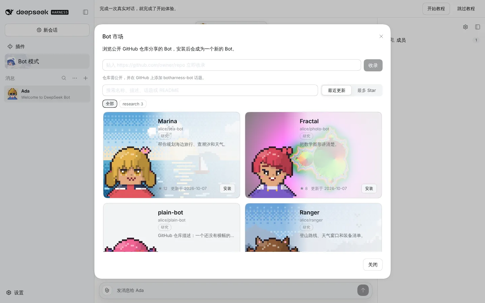
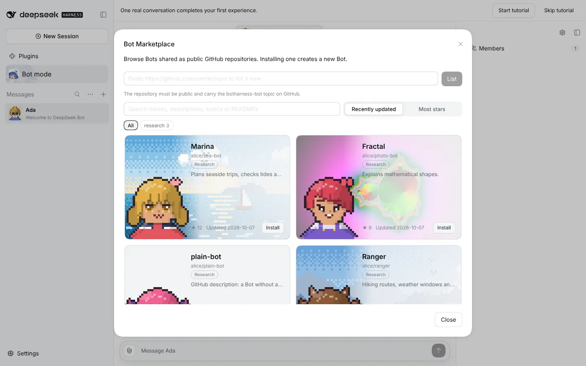
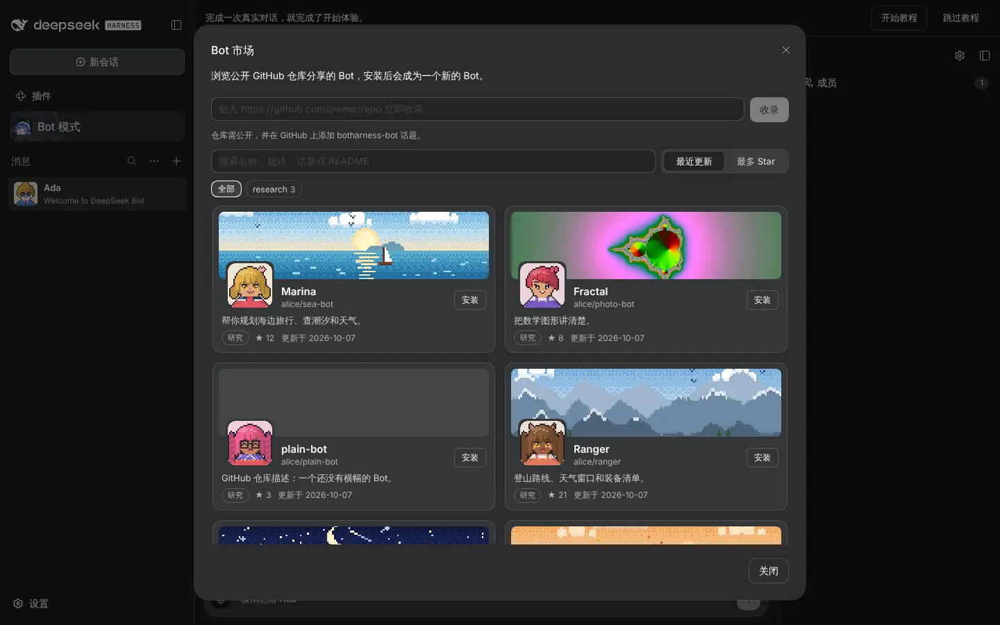
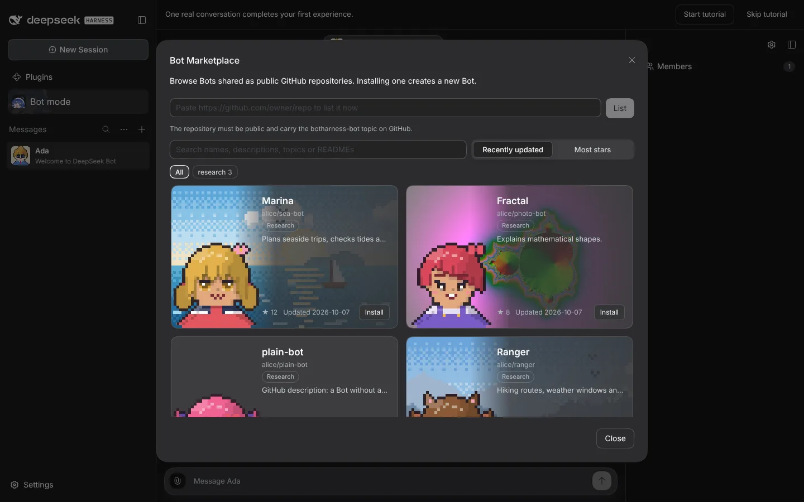
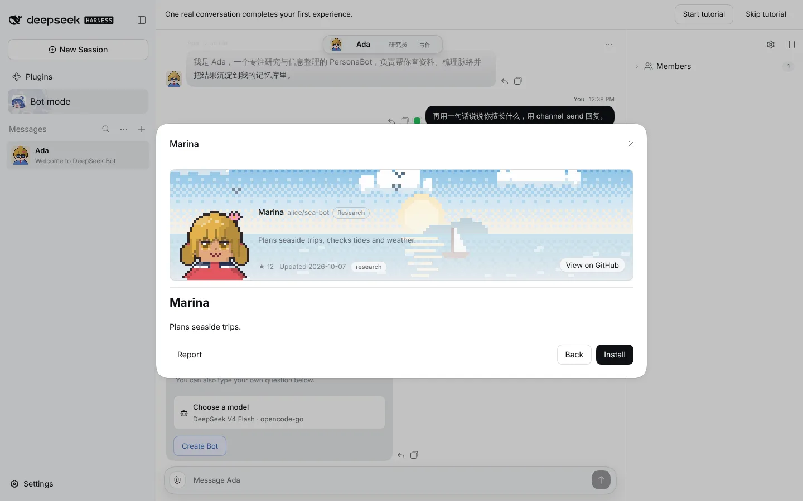
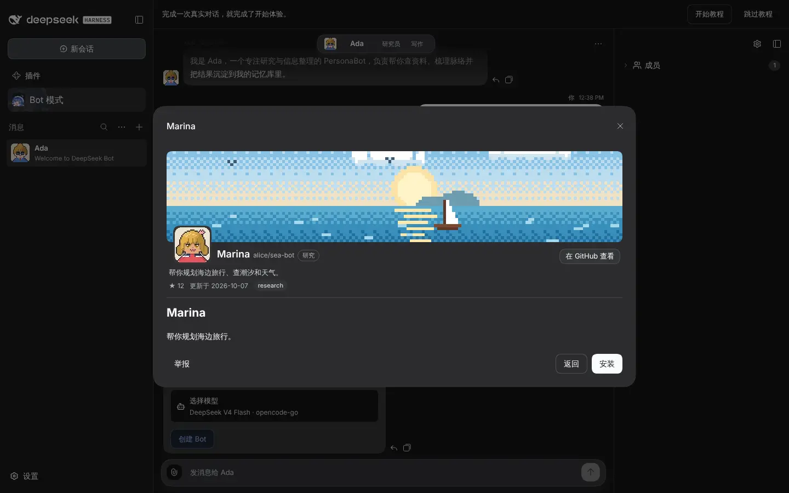
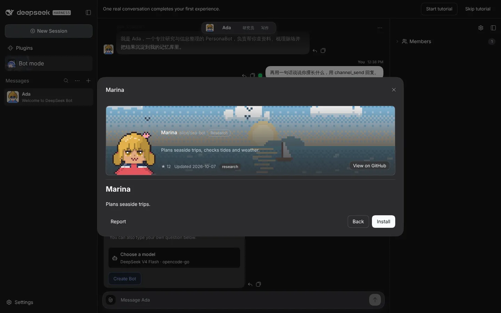

# Marketplace Bot cards

Captured on a real isolated DSH instance (1440 × 900), with the Marketplace list and detail RPCs answered by seven sample entries: five pixel-scene banners, one uploaded image and one Bot without a banner.

Before: 

|       | zh                                                                 | en                                                                 |
| ----- | ------------------------------------------------------------------ | ------------------------------------------------------------------ |
| Light |     |     |
| Dark  |       |       |
| Light |  |  |
| Dark  |    |    |
