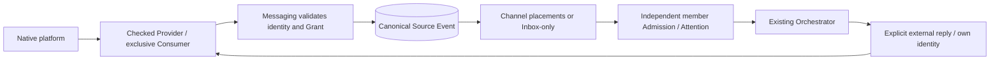

# IM Provider integration and qualification

This guide describes the implemented BotHarness integration boundary and the evidence required to extend it. Product meaning belongs to [Product Context](../../../CONTEXT.md), [Messaging architecture](../../architecture/botharness-architecture.md), and specs [#629](https://github.com/BotHarness/BotHarness/issues/629) / [#693](https://github.com/BotHarness/BotHarness/issues/693). The source contracts are `packages/core/src/messaging/provider.ts` and `dsh-im.ts`; the public RPC Reference is generated from code.

For a user-facing setup walkthrough, see the verified [Lark / Feishu connection guide](../../lark-connection.md).

## Keep the two layers distinct

DSH-native Plugin/Fiber lifecycle owns the connection and Service registration. The Service Definition → Provider → Consumer seam supplies checked external operations; the API Gateway owns Host/Client transport. PersonaBot identities, Grants, Source Events, Channel placements, Inbox Admissions and Outbox intents are **application-defined**, durable BotHarness records.

The Provider does not start a parallel dsh-im Session when BotHarness owns the account receiver. Commit the canonical source, placement and applicable admissions before acknowledging intake. Process-local notifications follow the commit. Receiver registration is exclusive per account; BotHarness fanout shares that receiver across authorized conversations and routes. Retry/disposal must retain this ownership boundary.

## Identity is separate from intake

- A PersonaBot binds at most one identity per supported platform; it may bind several platforms. Credentials stay in the DSH credentials service, never Client DTOs, Git, prompts or public evidence.
- Authorization pins the inspected account fingerprint and target digest, not only a display name or token. Replacing an App/account/target requires re-inspection and explicit rebind; a token refresh preserving the same identity is distinct.
- A Channel connector selects **what enters where**. Group and DM Channels can have multiple routes; Inbox-only reception does not mirror the PersonaBot DM history. One external source can be placed in several Channels without becoming several source authorities.
- A shared Channel member can read its shared source. External history/file reads and replies additionally require that member's own enabled, authorized identity for the original conversation. Reading is not permission to borrow the receiver's account.
- Ordinary local Channel replies remain local. Only explicit external reply/file actions cross the bridge. Receipt state does not imply that the native client displays the Bot in an “already read” list.

## Platform mapping is explicit

| Field             | Lark / Feishu                                        | Qualified Slack adapter                                                          |
| ----------------- | ---------------------------------------------------- | -------------------------------------------------------------------------------- |
| Account           | Application/Bot identity                             | Verified workspace, App, Bot and Bot-user identity; Socket hello App must match  |
| Conversation      | Native chat ID                                       | Native channel ID, checked against workspace and membership                      |
| Message           | Native message ID                                    | Message `ts` string; never round or parse into a floating-point ID               |
| Delivery evidence | Native event ID                                      | Native `event_id`; repeated deliveries may differ while referring to one message |
| Sender            | Native sender ID; best-effort name                   | Native user ID; bounded `users.info` name projection                             |
| Topic reply       | Preserve native thread/root/parent IDs when provided | `thread_ts` if supplied; otherwise message `ts` becomes the derived reply root   |
| Parent            | Native parent message ID when supplied               | No Lark-style parent ID; do not fabricate one                                    |

Thread, root and parent are routing metadata, not a new local Channel or independent Session store. A child message remains in its external conversation and carries the exact reply route. A reply does not automatically opt into topic following. No-thread platforms retain conversation-level policy instead of invented topic UI.

Explicit Slack follow uses the existing source-anchored thread policy. A root message can anchor its future topic, but only an unmentioned child with `ts != thread_ts` proves ordinary reply delivery on the current receiver lease. Slack requires matching root/thread timestamps and no parent field; Lark keeps its native parent requirement. Human follow/exclude overrides take precedence over Bot changes; restoring inheritance lets the Bot choose again. The Profile thread table remains available after a Grant migrates to Channel connector routes. Follow reuses count/time harvest; exit restores the group collection rule for future ordinary replies. Restart retains the policy but resets process-local delivery proof.

Name resolution is presentation only: retain sender ID, external message ID and canonical Source Event ID for exact lookup. The Channel bubble shows original content; its author label shows the platform and source name. Clicking that source opens a details Modal. Keep raw IDs in details rather than using them as the usual source name.

## Collection, wake and participation are separate decisions

The built-in default is mention-only collection. Full ordinary-text collection requires both native permissions/subscriptions and a fresh, verified ordinary delivery on the current receiver lease. An inherited “all” setting alone proves neither permission nor delivery.

A connector filters and places messages. Each Group member's existing Attention policy determines digest by count/time, next safe turn, mention-context or silent reading. Inbox-only reception uses its external group policy. Steer/turn boundaries and oldest-first bounded harvest remain owned by the existing runtime. Changing defaults affects inheriting configuration and future events; explicit overrides and committed admission snapshots remain intact.

Disable preserves configuration/history and stops new placements. Resume establishes a new intake boundary; delayed events from the paused interval are not backfilled. Deleting a route removes the configuration, not its retained history. Identity, Grant and individual route switches have different scopes. Revocation or Channel departure invalidates future authority, including a send waiting at the dispatch fence.

## Reads, files and sends must stay checked

- Group/nearby/topic history is bounded and provider-visible Human-text coverage, not a full workspace archive. Preserve `omitted`, `hasMore`, coverage and an opaque cursor. Bind cursors to account, conversation, route and query; reject reuse across scopes or identities. History reads do not silently create live Inbox admissions.
- Nearby uses the qualified time window plus requested before/after message minima within the hard page bound. A busy window can still require pagination; do not promise unlimited “all nearby” content. Bot selects bounded counts where exposed. Lark and Slack pagination mechanisms differ.
- For file reads, revalidate the original source, account, attachment ownership and resource key; bound bytes and validate download destinations. For file sends, run the authority fence before irreversible upload/share steps. Slack hosted files and Lark parent-file references are different mappings.
- Before replying, inspect the same account/target and exact source route. Run the latest BotHarness authority fence immediately before dispatch. Persist a checked native receipt. An ambiguous network/result outcome is **unknown**, never automatically resent or redirected to the main conversation.
- Suppress or correlate own echoes to avoid recursive intake. Expose stable bounded lifecycle logs, failure codes and duration without tokens or message dumps.

## Current qualification ledger

These are **development source qualifications**, not a claim that every published installable artifact includes the same capability. Record the immutable Provider SHA and runtime artifact hash with each E2E. [Product IM installation](../../product-im-installation.md) pins its separately verified artifact; do not substitute a fork tip or assume that an upstream merge updates an installed Profile.

| Capability                               | Lark / Feishu                                                                                                                                                                                  | Slack                                                                                      | Discord       |
| ---------------------------------------- | ---------------------------------------------------------------------------------------------------------------------------------------------------------------------------------------------- | ------------------------------------------------------------------------------------------ | ------------- |
| Checked mention intake / own-topic reply | Verified [#12](https://github.com/BotHarness/BotHarness/issues/12)                                                                                                                             | Verified [#802](https://github.com/BotHarness/BotHarness/issues/802)                       | Not qualified |
| Bounded history / nearby / topic reads   | Verified [#612](https://github.com/BotHarness/BotHarness/issues/612), [#793](https://github.com/BotHarness/BotHarness/issues/793)                                                              | Verified [#819](https://github.com/BotHarness/BotHarness/issues/819)                       | Not qualified |
| Hosted attachment workflow               | Verified [#657](https://github.com/BotHarness/BotHarness/issues/657)                                                                                                                           | Verified single mentioned file [#831](https://github.com/BotHarness/BotHarness/issues/831) | Not qualified |
| Ordinary public/group text and harvest   | Verified [#613](https://github.com/BotHarness/BotHarness/issues/613)                                                                                                                           | Verified public-channel text [#837](https://github.com/BotHarness/BotHarness/issues/837)   | Not qualified |
| Platform defaults / Profile overrides    | Verified [#701](https://github.com/BotHarness/BotHarness/issues/701)                                                                                                                           | Verified [#843](https://github.com/BotHarness/BotHarness/issues/843)                       | Not qualified |
| Shared Channel placement                 | Verified [#634](https://github.com/BotHarness/BotHarness/issues/634), [#635](https://github.com/BotHarness/BotHarness/issues/635), [#638](https://github.com/BotHarness/BotHarness/issues/638) | Verified [#845](https://github.com/BotHarness/BotHarness/issues/845)                       | Not qualified |
| Autonomous follow/exit native topic      | Verified [#614](https://github.com/BotHarness/BotHarness/issues/614)                                                                                                                           | Verified [#854](https://github.com/BotHarness/BotHarness/issues/854)                       | Not qualified |
| Proactive message with canonical receipt | Verified [#639](https://github.com/BotHarness/BotHarness/issues/639)                                                                                                                           | Adapter does not expose `post` receipt capability                                          | Not qualified |

Slack private channels/DMs, edits/deletions, ordinary file shares, workspace-wide search and gap backfill are not covered by the public-channel tracers. Remote withdrawal synchronization is deliberately outside the confirmed scope; a later read can report a missing source. Generic platform support in dsh-im is not BotHarness qualification.

## Repeatable acceptance for the next provider

1. Pin official API/source references and an immutable Provider build. Check real App/account, conversation membership, transport identity and capability versions. Discover the exact permissions and native event subscriptions; request Human approval at any required security-sensitive final step.
2. Start an isolated verified DSH Profile with exactly one receiver; prove a real model DM works before diagnosing credentials. Keep existing receivers and credentials untouched.
3. Deliver one native mention through Provider → canonical Messaging → Inbox/Channel → model → own-identity native reply. Independently read the reply: author, conversation, topic, body and receipt must match.
4. Exercise redelivery, wrong account/conversation, stale Grant/identity, member departure, disabled route, pause/resume and restart. Assert one source/placement and independent member admissions; assert no borrowed identity, no unintended DM mirror and no automatic send retry.
5. Add ordinary harvest, bounded reads, files and native topic follow as separate runnable tracers. Qualify actual capabilities instead of exposing every method the transport SDK happens to offer.
6. Capture latest-main UI in the supported locale/themes; publish only synthetic test messages, sanitized assertions and exact revisions. Keep private logs/credentials local. Attach screenshots or recording to the PR and pause for Human QA before broadening scope.

Discord is next after Slack. Its Gateway event/intents, guild/channel/thread permissions, identity/name mapping, message content availability, history limits and attachment handling must each be verified against official documentation and a real authorized QA App. A Slack `thread_ts` or Lark parent ID must not become an assumed Discord contract. Reusable checked Provider contracts should be contributed upstream when appropriate; a qualified pinned fork can continue independently of upstream merge timing.

## Native reference and permission checks

Recheck these official contracts when adding a capability: [Slack message.channels](https://docs.slack.dev/reference/events/message.channels/), [Slack history and threads](https://docs.slack.dev/messaging/retrieving-messages/), [Discord Gateway](https://docs.discord.com/developers/events/gateway) and [Discord threads](https://docs.discord.com/developers/topics/threads). They describe native behavior; the narrower checked BotHarness Provider contract still controls what is exposed.

The Slack public-channel QA App has Bot scopes `app_mentions:read`, `chat:write`, `channels:read`, `channels:history`, `users:read`, `files:read` and `files:write`; Socket Mode uses a separate App-level `connections:write` token. `app_mention` and `message.channels` subscriptions are distinct from scopes, and installing added scopes is distinct from saving event subscriptions. Do not request file permissions for a text-only tracer or use Human credentials to bypass a Bot capability refusal. Lark group-history permission `im:message.group_msg` must be granted to the **application** identity and published; Human OAuth for the same scope does not grant the Bot access. Verify native membership and the actual API result after configuration, rather than inferring capability from a green UI switch.
