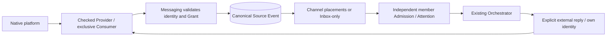

# IM Provider integration and qualification

This guide describes the implemented BotHarness integration boundary and the evidence required to extend it. Product meaning belongs to [Product Context](../../../CONTEXT.md), [Messaging architecture](../../architecture/botharness-architecture.md), and specs [#629](https://github.com/BotHarness/BotHarness/issues/629) / [#693](https://github.com/BotHarness/BotHarness/issues/693). The source contracts are `packages/core/src/messaging/provider.ts` and `dsh-im.ts`; the public RPC Reference is generated from code.

For user-facing setup walkthroughs, see the verified [Lark / Feishu connection guide](../../lark-connection.md) and [Slack connection guide](../../slack-connection.md).

## Keep the two layers distinct

DSH-native Plugin/Fiber lifecycle owns the connection and Service registration. The Service Definition → Provider → Consumer seam supplies checked external operations; the API Gateway owns Host/Client transport. PersonaBot identities, Grants, Source Events, Channel placements, Inbox Admissions and Outbox intents are **application-defined**, durable BotHarness records.

The Provider does not start a parallel dsh-im Session when BotHarness owns the account receiver. Commit the canonical source, placement and applicable admissions before acknowledging intake. Process-local notifications follow the commit. Receiver registration is exclusive per account; BotHarness fanout shares that receiver across authorized conversations and routes. Retry/disposal must retain this ownership boundary.

## Identity is separate from intake

- A PersonaBot binds at most one identity per supported platform; it may bind several platforms. Credentials stay in the DSH credentials service, never Client DTOs, Git, prompts or public evidence.
- Authorization pins the inspected account fingerprint and target digest, not only a display name or token. Replacing an App/account/target requires re-inspection and explicit rebind; a token refresh preserving the same identity is distinct.
- A Channel connector selects **what enters where**. Group and DM Channels can have multiple routes; Inbox-only reception does not mirror the PersonaBot DM history. One external source can be placed in several Channels without becoming several source authorities.
- A shared Channel member can read its shared source. External history/file reads and replies additionally require that member's own enabled, authorized identity for the original conversation. Reading is not permission to borrow the receiver's account.
- Ordinary local Channel replies remain local. Only explicit external reply/file actions cross the bridge. Receipt state does not imply that the native client displays the Bot in an “already read” list.

## Platform mapping is explicit

| Field             | Lark / Feishu                                        | Qualified Slack adapter                                                          |
| ----------------- | ---------------------------------------------------- | -------------------------------------------------------------------------------- |
| Account           | Application/Bot identity                             | Verified workspace, App, Bot and Bot-user identity; Socket hello App must match  |
| Conversation      | Native chat ID                                       | Native channel ID, checked against workspace and membership                      |
| Message           | Native message ID                                    | Message `ts` string; never round or parse into a floating-point ID               |
| Delivery evidence | Native event ID                                      | Native `event_id`; repeated deliveries may differ while referring to one message |
| Sender            | Native sender ID; best-effort name                   | Native user ID; bounded `users.info` name projection                             |
| Topic reply       | Preserve native thread/root/parent IDs when provided | `thread_ts` if supplied; otherwise message `ts` becomes the derived reply root   |
| Parent            | Native parent message ID when supplied               | No Lark-style parent ID; do not fabricate one                                    |

Thread, root and parent are routing metadata, not a new local Channel or independent Session store. A child message remains in its external conversation and carries the exact reply route. A reply does not automatically opt into topic following. No-thread platforms retain conversation-level policy instead of invented topic UI.

Explicit Slack follow uses the existing source-anchored thread policy. A root message can anchor its future topic, but only an unmentioned child with `ts != thread_ts` proves ordinary reply delivery on the current receiver lease. Slack requires matching root/thread timestamps and no parent field; Lark keeps its native parent requirement. Human follow/exclude overrides take precedence over Bot changes; restoring inheritance lets the Bot choose again. The Profile thread table remains available after a Grant migrates to Channel connector routes. Follow reuses count/time harvest; exit restores the group collection rule for future ordinary replies. Restart retains the policy but resets process-local delivery proof.

Name resolution is presentation only: retain sender ID, external message ID and canonical Source Event ID for exact lookup. The Channel bubble shows original content; its author label shows the platform and source name. Clicking that source opens a details Modal. Keep raw IDs in details rather than using them as the usual source name.

## Collection, wake and participation are separate decisions

The built-in default is mention-only collection. Full ordinary-text collection requires both native permissions/subscriptions and a fresh, verified ordinary delivery on the current receiver lease. An inherited “all” setting alone proves neither permission nor delivery.

A connector filters and places messages. Each Group member's existing Attention policy determines digest by count/time, next safe turn, mention-context or silent reading. Inbox-only reception uses its external group policy. Steer/turn boundaries and oldest-first bounded harvest remain owned by the existing runtime. Changing defaults affects inheriting configuration and future events; explicit overrides and committed admission snapshots remain intact.

Disable preserves configuration/history and stops new placements. Resume establishes a new intake boundary; delayed events from the paused interval are not backfilled. Deleting a route removes the configuration, not its retained history. Identity, Grant and individual route switches have different scopes. Revocation or Channel departure invalidates future authority, including a send waiting at the dispatch fence.

## Reads, files and sends must stay checked

- Group/nearby/topic history is bounded and provider-visible Human-text coverage, not a full workspace archive. Preserve `omitted`, `hasMore`, coverage and an opaque cursor. Bind cursors to account, conversation, route and query; reject reuse across scopes or identities. History reads do not silently create live Inbox admissions.
- Nearby uses the qualified time window plus requested before/after message minima within the hard page bound. A busy window can still require pagination; do not promise unlimited “all nearby” content. Bot selects bounded counts where exposed. Lark and Slack pagination mechanisms differ.
- For file reads, revalidate the original source, account, attachment ownership and resource key; bound bytes and validate download destinations. For file sends, run the authority fence before irreversible upload/share steps. Slack hosted files and Lark parent-file references are different mappings.
- Before replying, inspect the same account/target and exact source route. Run the latest BotHarness authority fence immediately before dispatch. Persist a checked native receipt. An ambiguous network/result outcome is **unknown**, never automatically resent or redirected to the main conversation.
- Suppress or correlate own echoes to avoid recursive intake. Expose stable bounded lifecycle logs, failure codes and duration without tokens or message dumps.

## Implementation-to-documentation delivery trail

Start the documentation evidence trail with the first integration ticket, not after the final feature merge. This is the delivery workflow for each new IM; it does not qualify an untested platform.

1. **Qualification and setup.** Record the selected product/channel type, official contracts, supported native fields and an immutable Provider baseline. Create one first-tracer ticket under the IM coordination parent; expand capabilities only after its Human feedback. Capture the original entry screen, app/bot creation or QR entry, permissions and installation steps as they actually occur. Keep account setup, external identity binding and Channel connector routing distinct.
2. **Continuous capture.** Maintain an issue-local evidence manifest under `.humanlayer/tasks/<issue>-<provider>/`. Each item names its purpose, capture date, exact BotHarness/Provider/runtime revisions, locale, theme, viewport and verification state; associate synthetic input, canonical Source Event/Admission and native receipt assertions where applicable. Keep private correlation values and raw logs outside the public manifest. Capture connected state, binding, explicit source authorization, Inbox/Channel source details and the independently observed native reply. Label empty forms, candidate builds and successful live results separately.
3. **Each tracer PR.** Include GitHub-renderable real screenshots or a recording, a runnable Human path and focused regression results. Use matched before/after evidence for changed UI; preserve immutable image URLs so later work does not rewrite old proof. Review every pixel and caption before publication: no tokens, active QR pairing codes, private login URLs, credentials, unrelated conversations or private account details. A disposable pairing screen may be represented by its sanitized entry/expired state, with the omission explained. Pause for Human QA before broadening scope; keep merge and deployment authorization separate.
4. **Connection guide handoff.** After the relevant runtime and installable-product paths have actual acceptance, write `docs/<provider>-connection.md` and its maintained `.zh.md` counterpart. Explain prerequisites, platform-specific setup, local connection, PersonaBot identity binding, explicit source authorization/routing, a short real message/reply check, troubleshooting and unqualified capabilities. Select reviewed screenshots into `apps/docs/public/guides/<provider>/`, with step captions, useful alt text and clear evidence provenance. A successful source build is not proof of a published npm package.
5. **Documentation and live checks.** Register both variants in `scripts/sync-docs.mjs`; never edit generated content. Cross-link the maintained IM qualification guide, keep bilingual release ledgers aligned, rebuild the Chinese OG font when the page's Chinese copy changes and run the relevant docs checks/build. Verify desktop/mobile layout, light/dark presentation, language links, clean `.md` siblings and every screenshot in the rendered guide. After an independently authorized docs deployment, verify the live pages/assets against the deployed source and record the result in the issue. Publishing a guide must not upgrade any unqualified capability row.

The completed [Lark guide](../../lark-connection.md) and [Slack guide](../../slack-connection.md) are examples. Their historical screenshots remain historical evidence; when a changed UI would confuse a new user, recapture that step on the latest main with qualified data and retain the old provenance. The provider program's documentation handoff is complete only when a user can follow the maintained guide and the screenshots render on the official site.

## Current qualification ledger

These are **development source qualifications**, not a claim that every published installable artifact includes the same capability. Record the immutable Provider SHA and runtime artifact hash with each E2E. [Product IM installation](../../product-im-installation.md) pins its separately verified artifact; do not substitute a fork tip or assume that an upstream merge updates an installed Profile.

| Capability                               | Lark / Feishu                                                                                                                                                                                  | Slack                                                                                                       | Discord                                                                                                                 |
| ---------------------------------------- | ---------------------------------------------------------------------------------------------------------------------------------------------------------------------------------------------- | ----------------------------------------------------------------------------------------------------------- | ----------------------------------------------------------------------------------------------------------------------- |
| Checked mention intake / own-topic reply | Verified [#12](https://github.com/BotHarness/BotHarness/issues/12)                                                                                                                             | Verified [#802](https://github.com/BotHarness/BotHarness/issues/802)                                        | Verified [#855](https://github.com/BotHarness/BotHarness/issues/855)                                                    |
| Bounded history / nearby / topic reads   | Verified [#612](https://github.com/BotHarness/BotHarness/issues/612), [#793](https://github.com/BotHarness/BotHarness/issues/793)                                                              | Verified [#819](https://github.com/BotHarness/BotHarness/issues/819)                                        | Not qualified                                                                                                           |
| Hosted attachment workflow               | Verified [#657](https://github.com/BotHarness/BotHarness/issues/657)                                                                                                                           | Verified single mentioned file [#831](https://github.com/BotHarness/BotHarness/issues/831)                  | Not qualified                                                                                                           |
| Ordinary public/group text and harvest   | Verified [#613](https://github.com/BotHarness/BotHarness/issues/613)                                                                                                                           | Verified public-channel text [#837](https://github.com/BotHarness/BotHarness/issues/837)                    | Not qualified                                                                                                           |
| Platform defaults / Profile overrides    | Verified [#701](https://github.com/BotHarness/BotHarness/issues/701)                                                                                                                           | Verified [#843](https://github.com/BotHarness/BotHarness/issues/843)                                        | Not qualified                                                                                                           |
| Shared Channel placement                 | Verified [#634](https://github.com/BotHarness/BotHarness/issues/634), [#635](https://github.com/BotHarness/BotHarness/issues/635), [#638](https://github.com/BotHarness/BotHarness/issues/638) | Verified [#845](https://github.com/BotHarness/BotHarness/issues/845)                                        | Verified one bound member, mentions / Message Content OFF [#1054](https://github.com/BotHarness/BotHarness/issues/1054) |
| Autonomous follow/exit native topic      | Verified [#614](https://github.com/BotHarness/BotHarness/issues/614)                                                                                                                           | Verified [#854](https://github.com/BotHarness/BotHarness/issues/854)                                        | Not qualified                                                                                                           |
| Proactive message with canonical receipt | Verified [#639](https://github.com/BotHarness/BotHarness/issues/639)                                                                                                                           | Verified root report and Human thread follow-up [#863](https://github.com/BotHarness/BotHarness/issues/863) | Not qualified                                                                                                           |

Slack private channels/DMs, edits/deletions, ordinary file shares, workspace-wide search and gap backfill are not covered by the public-channel tracers. Remote withdrawal synchronization is deliberately outside the confirmed scope; a later read can report a missing source. Generic platform support in dsh-im is not BotHarness qualification.

Discord shared-Channel qualification [#1054](https://github.com/BotHarness/BotHarness/issues/1054) covers one bound member, original public-thread mentions, overlapping Inbox/Channel deduplication, pause/resume without backfill and cold restart, with Message Content OFF. [Actual model/native evidence and restoration](https://github.com/BotHarness/BotHarness/blob/main/docs/dev/verification/discord-1054-shared-channel.md) distinguish native results from additional-member and duplicate-delivery fixtures; this does not qualify ordinary shared intake or update the product Provider pin.

## Repeatable acceptance for the next provider

1. Pin official API/source references and an immutable Provider build. Check real App/account, conversation membership, transport identity and capability versions. Discover the exact permissions and native event subscriptions; request Human approval at any required security-sensitive final step.
2. Start an isolated verified DSH Profile with exactly one receiver; prove a real model DM works before diagnosing credentials. Keep existing receivers and credentials untouched.
3. Deliver one native mention through Provider → canonical Messaging → Inbox/Channel → model → own-identity native reply. Independently read the reply: author, conversation, topic, body and receipt must match.
4. Exercise redelivery, wrong account/conversation, stale Grant/identity, member departure, disabled route, pause/resume and restart. Assert one source/placement and independent member admissions; assert no borrowed identity, no unintended DM mirror and no automatic send retry.
5. Add ordinary harvest, bounded reads, files and native topic follow as separate runnable tracers. Qualify actual capabilities instead of exposing every method the transport SDK happens to offer.
6. Capture latest-main UI in the supported locale/themes; publish only synthetic test messages, sanitized assertions and exact revisions. Keep private logs/credentials local. Attach screenshots or recording to the PR and pause for Human QA before broadening scope.

Discord is next after Slack. Its Gateway event/intents, guild/channel/thread permissions, identity/name mapping, message content availability, history limits and attachment handling must each be verified against official documentation and a real authorized QA App. A Slack `thread_ts` or Lark parent ID must not become an assumed Discord contract. Reusable checked Provider contracts should be contributed upstream when appropriate; a qualified pinned fork can continue independently of upstream merge timing.

## Discord mention/reply checkpoint — 2026-10-06

The [#855](https://github.com/BotHarness/BotHarness/issues/855) implementation is merged, and **development-source checked mention intake / own-location reply is qualified**. [BotHarness #870](https://github.com/BotHarness/BotHarness/pull/870) added checked mention intake and exact-location replies; [#876](https://github.com/BotHarness/BotHarness/pull/876) fixed adjacent identity/Grant/reception status refresh. [Provider #6](https://github.com/DoodleBears/dsh-im/pull/6) merged at `1a605b11fa8d321110540de42d58a77bdcd60f13`, with the same tree as tested candidate `8cf705ea474cdef8e658f7756ee48d5c936bd404`. The preceding QA checkpoint used Host `4138eeebffbf7abda53d9cd1ba1ccc98f95e16b1`, DSH `0.2.0-rc.1`, and 394 Provider runtime files with SHA-256 `69c513ff44fb802377ec7648e9c9075d2fc2c63b6f1c3205ee1d6012f956e58e`. These are QA revisions, not a product dependency promotion.

Real channel and existing-public-thread mentions reached one canonical Source Event/Inbox Admission, the existing Orchestrator model and one independently read own-Bot reply in the original native location. Subsequent bounded checks covered identity pause/recovery, revoked Grant, actual Provider Service loss/recovery, exclusive-consumer conflict, source editing and in-flight identity/Grant/Provider loss. Fresh channel and existing-thread model replies passed after recovery; interrupted requests were not automatically resent. Provider loss during sending retains `unknown-outcome`, even when native read-back finds no reply.

The Human subsequently instructed the agent to complete E2E acceptance directly and removed the personal-Human QA waiting condition. The agent used the existing Profile UI to unbind and rebind the same authenticated account, authorize the same target and enable mention-only reception. Fresh real browser-composed channel and existing-thread mentions each produced one canonical admission, one model `bridge_reply` intent and one independently read own-Bot reply at the original location. This is agent-operated UI acceptance, not a claim that the Human personally performed setup.

A subsequent real Gateway resume redelivered the same native message ID before `RESUMED`, with one admission, one model intent and one native reply. A real mention during reconnect was not backfilled; after all temporary observers were removed and the original Profile restored, a fresh model reply passed. Native HTTP 401/404 and registered-Service wrong-fingerprint refusals were also checked, with controlled inputs explicitly distinguished from full model/binding paths. An authorized real source deletion then exposed an adapter defect: the old Host converted definite `source-not-found` into an unknown outcome. This correction preserves `source-not-found` and `reply-permission-denied` as failed replies, while historical unknown intents remain unchanged. A restarted patched Host was tested through an actual model permission-denied reply, followed by exact permission restoration and a fresh own-Bot native reply. Corrected native preflight against the actually deleted source refuses before sending. After separate approval to delete a new prepared source, the patched real model read its retained canonical history and attempted one reply: one failed intent with `source-not-found`, no receipt and no native reply. A fresh native source then received one own-Bot original-channel reply. Two actual natively inspected App/Bot pairs subsequently connected; cross-account Host binding fingerprints refused with `rebind-required` before canonical writes. This verifies the identity pair boundary, not a Token swap or separately varied App/user fields. On a Human-created second QA server, the original Bot had native membership and reply permission, but no BotHarness Grant: a real mention advanced the consumed-Gateway counter by one while all canonical records stayed unchanged and native replies remained zero. A fresh original-channel model reply then passed; final counts are 41 Admissions / 36 Intents, with original authority and historical outcomes preserved. The latest Human-saved Boundary Token was valid; refreshing that same account’s older stored credential restored both QA connections without changing authority. The verification page separates the preceding Host revision from the rebuilt patched runtime.

Read the [current verification scope and historical first checkpoint](../verification/discord-855-mention-reply.md) and [matched UI evidence from #876](../../evidence/issue-855-messaging-refresh/README.md). [ADR-0128](../../adr/0128-discord-checked-replies-preserve-native-child-channel-routing.md) records the parent-conversation/native-child mapping. The qualified product Provider and every other Discord capability row remain unchanged.

The earlier read-only inspection used [Provider `abaee436`](https://github.com/DoodleBears/dsh-im/tree/abaee436e707c7d9cc7e5cefaa7bd5227321ff55), whose generic token controller lacked checked identity/consumer/reply operations and could create a standalone thread. That historical input is not the merged checked Provider. The current mention-only QA configuration uses `GUILDS` and `GUILD_MESSAGES`, without privileged Message Content intent. [Gateway documentation](https://docs.discord.com/developers/events/gateway#message-content-intent) exempts messages mentioning the App from the content restriction; ordinary collection and history remain separate qualification. [Threads](https://docs.discord.com/developers/topics/threads) are native child channels: `parent_id` is not a parent message ID, and sending requires `SEND_MESSAGES_IN_THREADS`. Preserve Snowflake strings and recheck guild, ancestry, permission, source and receipt, with no fallback to the parent or a standalone Session.

## Discord bounded context candidate — 2026-10-06

[#937](https://github.com/BotHarness/BotHarness/issues/937) adds checked, explicit `bridge_context` group/existing-public-thread Human-text pages on a separate development Provider candidate. Real model channel and thread read/reply passed; native cursor checks and restored Message Content refusal passed. Final rebuilt-Profile model continuation (13 + 5 disjoint Human messages), precise native edit conflict and whole-page rollback also passed; the combined history/nearby/topic row remains unqualified. History requires native App Message Content visibility plus `VIEW_CHANNEL` / `READ_MESSAGE_HISTORY`, with original Binding/Grant authorization; it does not enable ordinary live intake. Edited retained sources refuse instead of overwriting evidence. Read the [final acceptance, screenshots and immutable runtime](../verification/discord-937-context-reads.md); the product Provider pin is unchanged.

## Discord source-file candidate — 2026-10-06

[#1002](https://github.com/BotHarness/BotHarness/issues/1002) adds one directly mentioned hosted file and a checked original-location result on a separate development Provider. Safe metadata is opt-in; the original message refreshes its private signed CDN URL, and download/one non-retrying multipart reply retain identity, native permissions, lease and Host authority. Input/output are bounded to 20 MiB. The existing canonical save/native-file/import/Bridge Tool path remains the owner. Automated coverage and real model save/read/write/import/original-thread file reply pass, with independent 41-byte input/output, unchanged original, canonical deltas, revoked temporary write permission and stable cold restart. Read the [candidate scope and current checks](../verification/discord-1002-source-files.md). The product Provider pin and capability matrix remain unchanged.

## Native reference and permission checks

Recheck these official contracts when adding a capability: [Slack message.channels](https://docs.slack.dev/reference/events/message.channels/), [Slack history and threads](https://docs.slack.dev/messaging/retrieving-messages/), [Discord Gateway](https://docs.discord.com/developers/events/gateway) and [Discord threads](https://docs.discord.com/developers/topics/threads). They describe native behavior; the narrower checked BotHarness Provider contract still controls what is exposed.

The Slack public-channel QA App has Bot scopes `app_mentions:read`, `chat:write`, `channels:read`, `channels:history`, `users:read`, `files:read` and `files:write`; Socket Mode uses a separate App-level `connections:write` token. `app_mention` and `message.channels` subscriptions are distinct from scopes, and installing added scopes is distinct from saving event subscriptions. Do not request file permissions for a text-only tracer or use Human credentials to bypass a Bot capability refusal. Lark group-history permission `im:message.group_msg` must be granted to the **application** identity and published; Human OAuth for the same scope does not grant the Bot access. Verify native membership and the actual API result after configuration, rather than inferring capability from a green UI switch.

## External-only reports and native follow-up

A Bot explicitly calls `bridge_post` with its own authorized Grant and a stable request ID. The existing Outbox retains the report text and native receipt; the report creates no Channel placement or self Inbox admission. `bridge_outbox` reads its result after restart. Reusing the request ID does not resend an accepted or ambiguous intent; an unknown outcome requires inspection, not a new ID retry.

The qualified Slack slice posts plain text as a root message in a joined public channel using existing `chat:write`. The Provider rechecks authenticated Bot identity, exclusive Consumer lease, public membership and cancellation before one non-retrying request. The receipt uses Slack `channel` and `ts`; a later admitted Human reply's `thread_ts`/root ID associates it with that Outbox report under the same own identity, fingerprint and conversation. No Lark `parentId` is fabricated. Follow-up is still filtered by the configured connector and wake policy; report publication does not automatically follow the topic. Bot's explicit `bridge_reply` stays in that native thread.

This qualification does not add a morning-report scheduler, DM/private-channel sending, rich blocks or own-message echo enrichment. Own Socket messages remain excluded from intake. The fixed fork provides this optional contract independently of upstream merge; its generic checked-receipt changes are candidates for upstream contribution after the narrow integration is reviewed.

The prior accepted product Provider `4.32.0-botharness.3` selected the qualified Slack input `a0300e97`; #868 verified that locally packed installation. Developer source qualification, packed product qualification and registry publication remain separate evidence. A developer pin change does not change the product qualification record.

## Personal WeChat owner text DMs

The first WeChat tracer (#878) uses QR-paired owner text DMs, not group/mention/thread emulation. Explicit identity binding and DM Grant precede intake. Original source continuations stay private in the Provider; accepted sends carry a client acknowledgement rather than a native message ID. The developer candidate is `589e5507`. Source-mode Inbox/model/reply E2E passed with an independently observed native reply. The locally installed product candidate `0.0.0-test.878` / Provider `4.32.0-botharness.4` restored the same authorized connection and passed a fresh text/model/reply exchange, with one handled Admission, one accepted reply and no local DM mirror. The Human confirmed the native reply. Human QA approved this first slice and supplied its native screenshot; public release and deployment remain separate actions. Context, other contacts and group capabilities remain unavailable.

See the [personal WeChat connection guide](../../wechat-connection.md) for setup and real screenshots.

### Paired-owner files (#903)

The installed file candidate pins fork `8852e87f` as Provider `4.32.0-botharness.5`. One native type-4 file, with optional text, reuses the canonical Source Event and Bot Inbox. Preserve exact decimal native IDs and platform metadata; a missing MIME stays generic. Never expose AES keys, CDN tickets or source continuations to the model or Client. A private source ticket must match the current account, lease, route and exact retained metadata. Bound the streamed ciphertext and decrypted bytes to 25 MiB, allowing only encryption padding on transport; an oversized declaration can remain inspectable without downloading.

A file result is an independently imported canonical artifact. Require `reply-file-fence-checked` for this WeChat contract: check the application's current authorization again after upload immediately before native send. Refuse revoked Grants, replaced identities/leases and expired sources. Record client acceptance honestly and do not retry an uncertain send. Fresh installed-product/model E2E returned an independently downloaded 224-byte result ZIP with exact expected content, preserving the 207-byte input; revocation, invalid media and actual transfer limits also have focused regression coverage. This does not claim a complete native lifecycle matrix, remote history, groups, images or proactive delivery.

### Image qualification candidate (#904)

The WeChat image candidate negotiates `sourceImages` independently from files. Native type-2 image AES keys and CDN tickets remain private; public metadata has no guessed extension, plaintext size or concrete MIME. Detect format from bounded decrypted bytes before publishing a canonical Attachment or preview. Native ciphertext `mid_size` must not become declared plaintext size. A preview does not prove that a model received image input: use the exact calling model's DSH image capability, native `read_image` and a fresh blind-content check. An unsupported model refusal must stay honest and recover after an explicit model switch.

Result selection uses independently imported canonical bytes. Only the WeChat checked Provider receives the additional byte-derived MIME and selects native image sending; other platforms retain their existing file argument shape. Recheck authority after CDN upload, immediately before final send. Reusable regressions cover invalid bytes/MIME, metadata forgery, opt-in/lease isolation, revocation during upload and preview refusal/recovery/disposal. Fresh installed-product image E2E used actual DeepSeek Flash vision input: native `read_image` returned the JPEG and the model independently identified the visible application, layout and labels. A missing scoped `fs` dependency in the pinned official Tool was reproduced through the real Cordis Tool Runtime and repaired with a tracked package patch; the installed product passed the same native read afterward. The unchanged imported image was sent to the same source, and the Human confirmed native WeChat receipt with matching content. See the illustrated [image guide](../../wechat-connection.md#6-view-an-image-and-return-an-image-result). Receiver-side byte equality, final PR Human QA and public deployment remain separate.

## Platform-provided voice transcripts

The WeChat #905 candidate adds an opt-in `source-voice-transcript-checked` capability and `sourceVoiceTranscripts` Consumer option. A single completed native voice item enters the existing Source Event and Inbox as text only when the Provider can preserve the paired owner, account fingerprint, native message ID and original-DM reply continuation. `voice.transcript` records `platform` or `unavailable`; optional native item ID and duration remain provenance. The Client and model must distinguish platform transcription from Bot-generated content. Changed voice metadata for the same source is a conflict, not permission to overwrite committed evidence.

Native `voice_item.text` is optional. Never add ASR as an invisible fallback, fabricate a transcript from a caption, expose media keys, or offer an audio player/download without an independently checked audio capability. An unavailable transcript stays explicit. Partial/generating or ambiguous multi-item messages are not admitted by this candidate. The first real test supplied platform text and a 7,377 ms duration, but a reused QA Session retained its previous no-reply instructions; that first test proves intake, not reply delivery. A second native voice in a new QA Session supplied a 5,180 ms duration; the real DeepSeek Flash model called `bridge_read` and `bridge_reply`, the own-identity Outbox was accepted, and the Human confirmed “蓝色灯塔37” in the original WeChat DM. Light/dark screenshots show that same source. This is a checked transcript path, not audio recognition by BotHarness.

## Checked native video (#907)

Negotiate `sourceVideos` separately and require both `source-video-checked` and `reply-video-fence-checked`. Preserve native item IDs and reported values without inventing their semantics: incoming `video_size` matched decrypted bytes in this test, while the official sending implementation supplies encrypted length. Use `reportedSizeBytes`; retain `playLength` without assuming a unit. Never rewrite earlier canonical evidence to rename a recorded field.

Source playback and processing use the existing checked Attachment path, bounded to 25 MiB with private CDN tickets and keys. Conservatively inspect MP4 bytes before offering native browser controls; avoid autoplay, retain captions, offer refusal/retry, and release requests/Blob URLs on close. A player, file inspection or model claim is not video understanding. Results are independently imported artifacts sent using the acting Bot's current identity and original Source route, with authority checked again after upload and before send. Provider acceptance is not receiving-side delivery proof.

The installed local candidate passed real video intake, exact input-byte comparison, native playback and approved model processing into a three-second H.264 result. The Human confirmed native receipt, and the receiving-client screenshot shows the matching three-second result; receiver-side downloaded-byte equality is not claimed. See the illustrated [video guide](../../wechat-connection.md#9-receive-a-native-video-and-return-a-video-result). Broader Channel-history media rendering remains a separate slice.

## Discord nearby development slice — #981

The next isolated Provider candidate implements `bridge_context(nearby)` in the source's exact native channel or public thread: five minutes on each side, supplemented to the requested preceding/following Human-text minima (defaults 10/5) when sparse. The source anchor is independent; dense windows require bounded continuation, sparse exhausted sides may return fewer, and future messages are never awaited. Signed cursors retain an immutable snapshot and renew a 30-minute lifetime after a successful page; current permission and authority are checked on every read.

[#981](https://github.com/BotHarness/BotHarness/issues/981) tracks automated and real-model qualification. Agent-performed real-model native qualification passed at Core `7edd33e0` / Provider `5ae8bb3b`: three pages (11 / 0 / 5 texts), 16 unique Human texts, exact native original-thread reply, no historical Admissions and complete temporary Message Content OFF restoration. Final cold restart preserves all six canonical tables. See the [bounded evidence report](../verification/discord-981-nearby-context.md). The product Provider pin and combined history/nearby/topic qualification remain unchanged; there is no ordinary-message intake or thread-follow subscription.

## Native quotes and retained local context (#908)

Negotiate `sourceQuotes` / `source-quote-checked` independently. Keep one-level native `serverMessageId`, `itemId`, embedded text, display summary, attachment kind and partial-quote metadata separate; preserve numeric `svr_id` JSON lexemes before JavaScript precision loss. Strip continuation tokens, media keys and nested references. A changed quote on a repeated canonical native message is a source conflict.

Only Messaging may resolve an absent body: same current account fingerprint/private conversation, canonical readable Source Events, or an accepted Outbox with a genuine server receipt. Never use the Provider's standalone Session transcript, time-nearest heuristic, client acknowledgement, summary or item ID as a substitute. The Client/model distinguish native text, retained resolution and unavailable content; an unavailable reference does not prove remote deletion, and a quote is not a Thread.

`retained` / `retained-nearby` extend the existing `bridge_context` seam with `coverage: retained-local-sources`; remote Provider history contracts remain unchanged. Keyset pagination freezes the initial canonical row boundary and binds opaque in-process cursors to Bot, source, Grant revision, identity fingerprint, scope and counts. Each page rechecks the own identity, current Grant/lease and Provider inspection; reads are audited in the anchor Source Event without new Admissions or wake. Document record/count limits, expiry/restart, character-budget recovery, and local gaps explicitly. Local context is not remote WeChat history/search. Native quote variants must be evidenced as received; synthetic regressions do not prove the current client's wire shape.

WeChat #909 maps an authorized paired-owner **native DM** into the existing connector fanout. Collection covers authorized owner-DM messages without fabricated @ or topics. Group placements reuse member Attention; private Inbox and explicit local DM placements use `human-dm`. Native conversation kind stays independent from the local placement type. Shared readability does not grant the receiver identity, private continuation or checked attachment access. Fresh per-platform E2E remains required.

## Authorized WeChat external reports (#910)

Negotiate `receiptVersion: 1` and `postFenceVersion: 1` plus account capabilities `proactive-receipt-checked` and `proactive-fence-checked`. Reuse canonical post/Outbox authority for qualified paired-owner DMs; the exclusive Consumer remains the sole polling/context owner. No standalone Session, transcript store, local DM mirror or new scheduling system is added.

Pass a final application callback through the public Service seam. Immediately before native send, fence Provider Registration, account fingerprint, enabled Binding/current Grant and cancellation; serialize with account transitions. Cache only authentic owner context with matching fingerprint and native ordering, excluded from public status. Local 30-day retention bounds storage, never server validity. Missing/locally expired context refuses before dispatch; native rejection is definite failure with fresh-owner-message recovery, while uncertain network results remain unknown without automatic retry.

Preserve a genuine returned native `message_id` as lossless decimal `serverMessageId`, separate from the generated ID marked `client-acknowledgement`. Neither proves delivery/read. Source and packed-product qualification need unique reports without new incoming triggers, independent Human receipt, canonical follow-up intake, unchanged local DM history and refusal/recovery evidence. See [ADR-0138](../../adr/0138-wechat-external-reports-use-private-owner-context.md) and the [illustrated guide](../../wechat-connection.md#12-send-an-external-only-text-report).
